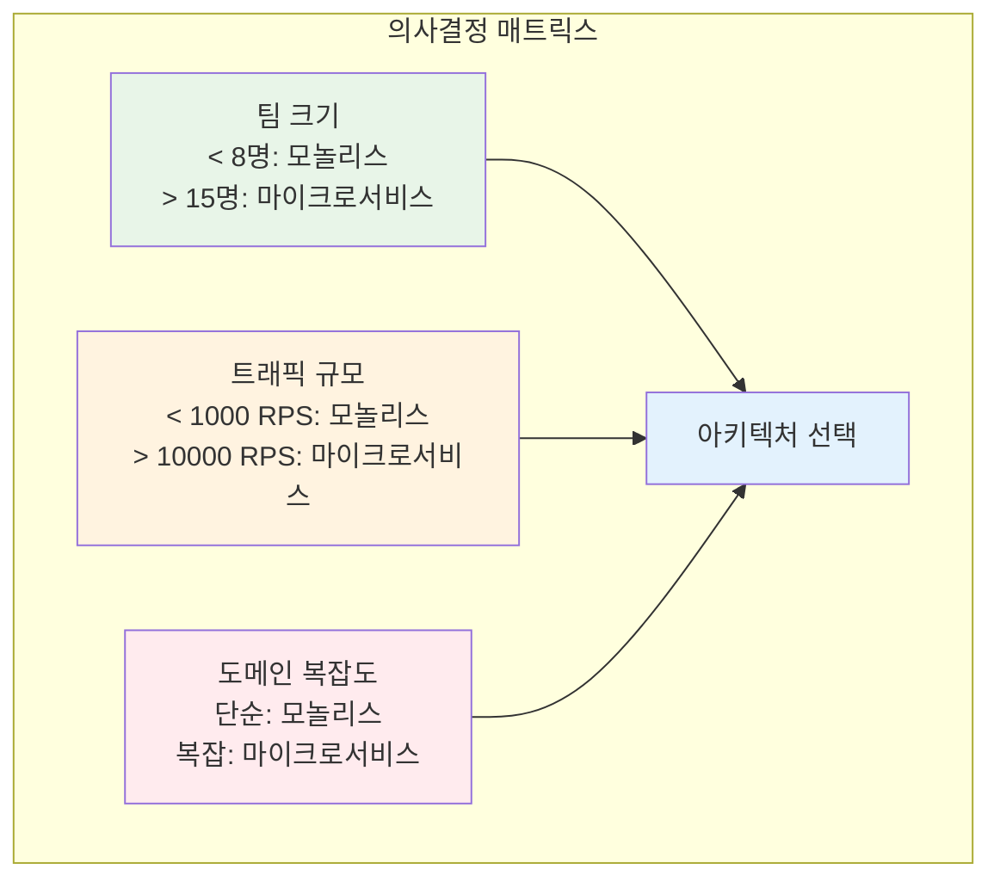
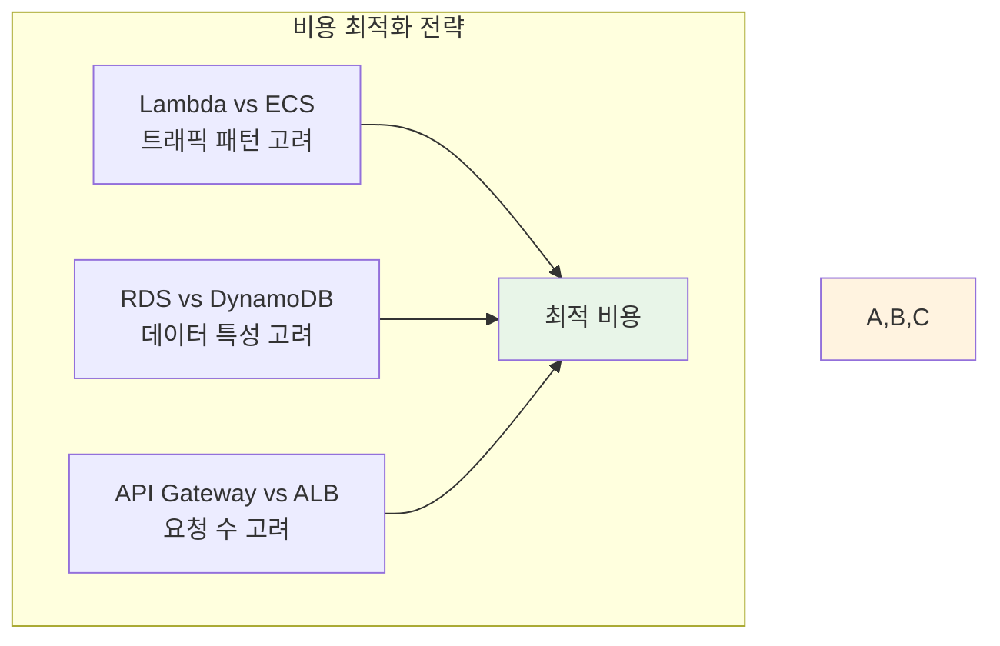

# Week 4 Day 1: 마이크로서비스 아키텍처 (개선 버전)

<div align="center">

**🏗️ 아키텍처 설계** • **🔄 서비스 분해** • **📡 통신 패턴** • **💡 의사결정**

*모놀리스에서 마이크로서비스로의 전환 - 설계부터 구현까지*

</div>

---

## 🕘 일일 스케줄 (최적화 버전)

### 📊 시간 배분 개선
```
📚 이론 강의: 2.3시간 (140분) - 핵심 개념 집중
🛠️ 실습 세션: 3.7시간 (220분) - 실무 적용 강화
🎤 발표/회고: 0.8시간 (50분) - 지식 공유 및 성찰
🍽️ 점심시간: 1시간 (실습 중 포함)
```

### 🗓️ 상세 스케줄 (최적화)
| 시간 | 구분 | 내용 | 목적 | 개선점 |
|------|------|------|------|--------|
| **09:00-09:45** | 📚 이론 1 | [마이크로서비스 vs 모놀리스](./session_1.md) (45분) | 의사결정 프레임워크 | ⚡ 정량적 판단기준 추가 |
| **09:45-09:55** | ☕ 휴식 | 10분 휴식 | | |
| **09:55-10:40** | 📚 이론 2 | [서비스 분해 전략](./session_2.md) (45분) | DDD 핵심 + 실습 | 🎯 실습 시간 확보 |
| **10:40-10:50** | ☕ 휴식 | 10분 휴식 | | |
| **10:50-11:40** | 📚 이론 3 | [마이크로서비스 패턴](./session_3.md) (50분) | 핵심 패턴 이해 | 📚 내용 유지 |
| **11:40-11:50** | ☕ 휴식 | 10분 휴식 | | |
| **11:50-13:45** | 🛠️ 실습 1 | [모놀리스 분해 실습](./lab_1.md) (115분) | 서비스 분해 | 💰 비용 최적화 고려 |
| **13:00-14:00** | 🍽️ 점심 | 점심시간 (실습 중 60분) | | |
| **13:45-15:30** | 🛠️ 실습 2 | [통신 패턴 구현](./handson_1.md) (105분) | 심화 적용 | 🔧 로컬 환경 대안 |
| **15:30-15:40** | ☕ 휴식 | 10분 휴식 | | |
| **15:40-17:10** | 🎮 Challenge | [아키텍처 설계 챌린지](./challenge_1.md) (90분) | 종합 실습 | ⏰ 시간 단축 |
| **17:10-17:40** | 🎤 발표 | 팀별 결과 발표 및 피드백 (30분) | 지식 공유 | ✨ 신규 추가 |
| **17:40-18:00** | 💭 회고 | 일일 학습 회고 및 내일 준비 (20분) | 성찰 및 준비 | ✨ 신규 추가 |

---

## 🎯 일일 학습 목표 (강화 버전)

### 📚 이론 학습 목표
- **의사결정 역량**: 정량적 기준으로 아키텍처 선택 (팀 크기, 트래픽, 복잡도)
- **설계 원칙**: DDD 핵심 개념 + 실제 도메인 모델링 체험
- **패턴 습득**: 실무에서 검증된 핵심 패턴 이해 및 적용 기준
- **ROI 분석**: 마이크로서비스 전환의 비용 대비 효과 계산

### 🛠️ 실습 학습 목표
- **점진적 전환**: Strangler Fig 패턴을 통한 안전한 마이그레이션
- **비용 최적화**: AWS 서비스 비용을 고려한 아키텍처 설계
- **성능 측정**: 아키텍처별 성능 특성 정량적 비교
- **운영 고려**: 모니터링, 로깅, 장애 대응 방안 포함

### 🤝 협업 학습 목표
- **집단 지성**: 팀 브레인스토밍을 통한 아키텍처 설계
- **역할 분담**: Conway's Law를 고려한 팀 구조와 서비스 경계
- **지식 공유**: 발표를 통한 학습 결과 공유 및 피드백
- **성찰 학습**: 회고를 통한 개인/팀 성장 포인트 도출

---

## 📚 이론 세션 개요 (개선 버전)

### Session 1: 마이크로서비스 vs 모놀리스 - 의사결정 프레임워크 (45분)
> **핵심 질문**: "정량적 기준으로 언제 마이크로서비스를 선택해야 하는가?"

**🔢 정량적 판단 기준 (신규 추가)**:


**💰 ROI 계산 방법론 (신규 추가)**:
- **개발 비용**: 초기 개발 + 유지보수 비용
- **운영 비용**: 인프라 + 모니터링 + 인력 비용
- **비즈니스 가치**: 배포 속도 + 확장성 + 안정성

### Session 2: 서비스 분해 전략 - DDD 핵심 + 실습 (45분)
> **핵심 질문**: "어떻게 비즈니스 가치 중심으로 서비스를 분해하는가?"

**🎯 핵심 개념 선별 (시간 최적화)**:
- **Bounded Context**: 서비스 경계의 핵심 원리
- **Aggregate**: 데이터 일관성 경계
- **Domain Event**: 서비스 간 통신 방법

**🛠️ 실습 시간 확보 (15분 → 25분)**:
- 간단한 E-Commerce 도메인 모델링
- 팀별 서비스 경계 설정 워크샵
- 결과 공유 및 피드백

### Session 3: 마이크로서비스 패턴 - 실무 검증된 핵심 패턴 (50분)
> **핵심 질문**: "어떤 패턴을 언제 사용해야 하는가?"

**패턴 선택 기준표 (신규 추가)**:
| 패턴 | 사용 시기 | 복잡도 | 성능 영향 | 운영 부담 |
|------|----------|--------|----------|----------|
| API Gateway | 항상 | 중간 | 낮음 | 중간 |
| Circuit Breaker | 외부 의존성 있을 때 | 낮음 | 낮음 | 낮음 |
| Saga | 분산 트랜잭션 필요시 | 높음 | 중간 | 높음 |
| CQRS | 읽기/쓰기 패턴 다를 때 | 높음 | 높음 | 높음 |

---

## 🛠️ 실습 세션 개요 (개선 버전)

### Lab 1: 모놀리스 애플리케이션 분해 실습 + 비용 최적화 (115분)
> **목표**: 비용을 고려한 실무적 마이크로서비스 전환

**💰 비용 최적화 고려사항 (신규 추가)**:


**🔧 로컬 환경 대안 (신규 추가)**:
- Docker Compose를 이용한 로컬 개발 환경
- LocalStack을 이용한 AWS 서비스 시뮬레이션
- 실습 후 자동 리소스 정리 스크립트

**실습 단계 개선**:
1. **비용 분석** (15분): 현재 모놀리스 vs 마이크로서비스 비용 비교
2. **서비스 분해** (40분): 비용 효율적인 서비스 분해
3. **인프라 구성** (35분): 최소 비용으로 AWS 인프라 구성
4. **성능 테스트** (25분): 비용 대비 성능 측정

### Hands-on 1: 마이크로서비스 통신 패턴 구현 + 성능 비교 (105분)
> **목표**: 통신 패턴별 성능과 비용 트레이드오프 이해

**📊 성능 비교 매트릭스 (신규 추가)**:
| 통신 방식 | 지연시간 | 처리량 | 복잡도 | 비용 |
|----------|----------|--------|--------|------|
| REST API | 50-100ms | 중간 | 낮음 | 낮음 |
| gRPC | 20-50ms | 높음 | 중간 | 낮음 |
| Message Queue | 100-200ms | 높음 | 높음 | 중간 |
| Event Stream | 10-30ms | 매우높음 | 매우높음 | 높음 |

---

## 🎮 Challenge: 마이크로서비스 아키텍처 설계 (90분, 단축)

### 🎯 Challenge 목표 (효율화)
**시나리오**: 
소셜 미디어 플랫폼 "CloudSocial"의 마이크로서비스 전환 설계
- **제약 조건**: 월 예산 $5,000 이내
- **성능 목표**: 평균 응답시간 200ms 이내
- **확장 목표**: 6개월 내 10배 확장 가능

### 📋 간소화된 요구사항
1. **핵심 기능만 선별**:
   - 사용자 관리 + 게시물 관리 + 알림 시스템
2. **비기능 요구사항 명확화**:
   - 가용성 99.9% + 응답시간 200ms + 비용 $5,000/월

### ⏰ 시간 배분 최적화
- **설계 단계** (30분): 아키텍처 설계 및 기술 선택
- **구현 단계** (40분): 핵심 서비스 구현
- **테스트 단계** (20분): 성능 및 비용 검증

---

## 🎤 팀별 발표 및 피드백 (30분, 신규 추가)

### 📊 발표 구조
**팀당 5분 발표 + 2분 Q&A**:
1. **아키텍처 개요** (2분): 전체 설계 및 핵심 결정사항
2. **기술적 도전** (2분): 어려웠던 문제와 해결 방법
3. **비용/성능 분석** (1분): 정량적 결과 및 개선 방안

### 🏆 평가 기준
- **실무 적용성** (40%): 실제 운영 가능성
- **비용 효율성** (30%): 예산 대비 성능
- **창의적 해결책** (20%): 독창적 아이디어
- **발표 품질** (10%): 명확한 전달력

---

## 💭 일일 학습 회고 (20분, 신규 추가)

### 🤝 개인 성찰 (10분)
**자가 진단 체크리스트**:
- [ ] **의사결정 역량**: 정량적 기준으로 아키텍처 선택 가능
- [ ] **설계 능력**: DDD 기반 서비스 경계 설정 가능
- [ ] **비용 인식**: AWS 비용을 고려한 설계 가능
- [ ] **협업 경험**: 팀과 효과적으로 협업했음

### 👥 팀 공유 (10분)
**공유 주제**:
1. **가장 큰 인사이트**: 오늘 배운 것 중 가장 중요한 것
2. **실무 적용 계획**: 현재/미래 프로젝트 적용 방안
3. **내일 학습 기대**: API Gateway & Service Discovery 궁금한 점
4. **팀 시너지**: 협업에서 좋았던 점과 개선점

---

## 🎯 다음 학습 준비 (강화)

### 📖 예습 키워드 (우선순위별)
**필수 키워드**:
- **API Gateway**: 단일 진입점, 라우팅, 인증/인가
- **Service Discovery**: 동적 서비스 찾기, 헬스체크
- **Load Balancing**: 트래픽 분산, 장애 대응

**권장 키워드**:
- **Service Mesh**: Istio, 트래픽 관리, 보안
- **Circuit Breaker**: 장애 전파 방지, 복구 전략

### 💰 비용 최적화 팁
```bash
# 실습 후 리소스 정리 (필수)
./cleanup-resources.sh

# 비용 모니터링 설정
aws budgets create-budget --account-id 123456789012 \
  --budget file://daily-budget.json
```

### 📚 추천 학습 자료 (우선순위별)
**필수 읽기**:
- **[AWS API Gateway 요금](https://aws.amazon.com/api-gateway/pricing/)**: 비용 계산 방법
- **[Microservices Cost Optimization](https://aws.amazon.com/blogs/architecture/optimizing-costs-in-microservices-architectures/)**: 비용 최적화 전략

**권장 읽기**:
- **[Building Microservices](https://www.oreilly.com/library/view/building-microservices/9781491950340/)**: 1-3장
- **[AWS Well-Architected Cost Optimization](https://docs.aws.amazon.com/wellarchitected/latest/cost-optimization-pillar/)**: 비용 최적화 원칙

---

## ✅ 개선 사항 요약

### 🎯 주요 개선점
1. **⏰ 시간 최적화**: 이론 140분, 실습 220분, 발표/회고 50분
2. **💰 비용 고려**: 모든 실습에 비용 최적화 관점 추가
3. **📊 정량적 기준**: 의사결정을 위한 구체적 매트릭스 제공
4. **🎤 지식 공유**: 발표 및 회고 시간으로 학습 효과 극대화
5. **🔧 실무 연계**: 로컬 환경 대안 및 자동화 스크립트 제공

### 📈 기대 효과
- **학습 효율성**: 핵심 개념 집중으로 이해도 향상
- **실무 적용성**: 비용과 성능을 고려한 실무적 설계 능력
- **협업 역량**: 발표와 회고를 통한 소통 능력 강화
- **지속 학습**: 명확한 다음 단계 준비로 연속성 확보

---

<div align="center">

**🏗️ 체계적 설계** • **💰 비용 최적화** • **🤝 협업 중심** • **🚀 실무 연계**

*개선된 마이크로서비스 아키텍처 학습으로 실무 역량 강화*

</div>
