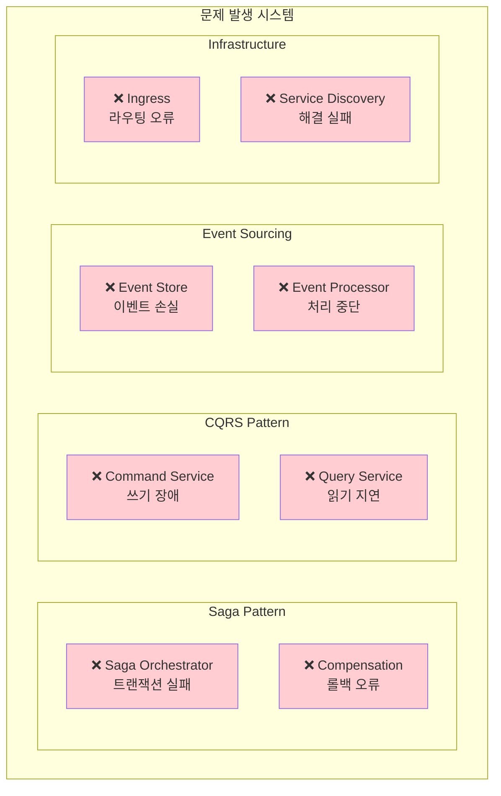

# Week 4 Day 1 Challenge 1: 마이크로서비스 패턴 장애 해결

<div align="center">

**🚨 패턴 장애 대응** • **🔍 분산 시스템 진단** • **🛠️ 실무 문제 해결**

*실제 운영 환경에서 발생하는 마이크로서비스 패턴 장애 상황 해결*

</div>

---

## 🕘 Challenge 정보
**시간**: 16:00-17:30 (90분)  
**목표**: 마이크로서비스 패턴 장애 진단 및 해결 능력 향상  
**방식**: 문제 상황 배포 → 진단 → 해결 → 검증

## 🎯 Challenge 목표

### 📚 학습 목표
- **패턴 장애 진단**: Saga, CQRS, Event Sourcing 패턴의 장애 분석
- **분산 시스템 디버깅**: Kubernetes 환경에서의 체계적 문제 해결
- **근본 원인 분석**: 표면적 증상이 아닌 근본 원인 파악
- **팀워크**: 복잡한 분산 시스템 문제를 협력하여 해결

### 🛠️ 실무 역량
- **장애 대응**: 신속하고 정확한 마이크로서비스 장애 복구
- **패턴 이해**: 각 패턴의 장애 포인트와 해결 방법 숙지
- **운영 노하우**: 실제 운영에서 발생하는 문제 상황 경험
- **문서화**: 장애 해결 과정과 예방책 체계적 기록

---

## 🚨 Challenge 시나리오: "CloudMart 마이크로서비스 긴급 장애"

### 📖 배경 상황
**시나리오**: 
온라인 쇼핑몰 "CloudMart"가 새로운 마이크로서비스 아키텍처로 전환한 후 Black Friday 준비 중 여러 패턴에서 동시 장애가 발생했습니다. 
고급 DevOps 엔지니어로서 각 패턴별 장애를 신속하게 진단하고 해결해야 합니다.

**긴급도**: 🔴 **Critical** - 주문 처리 완전 중단
**영향도**: 💰 **High** - 시간당 수백만원 매출 손실
**제한시간**: ⏰ **90분** - 세일 시작 전까지 모든 패턴 복구 필수

### 🏗️ 시스템 아키텍처


---

## 🔧 Challenge 환경 배포

### Step 1: 환경 설정
```bash
cd theory/week_04/day1/lab_scripts/challenge1
./setup-environment.sh
```

### Step 2: 문제 시스템 배포
```bash
./deploy-broken-system.sh
```

**배포되는 문제 시스템**:
- 🚨 **Saga 패턴**: 트랜잭션 오케스트레이션 실패
- 🚨 **CQRS 패턴**: Command/Query 분리 오류
- 🚨 **Event Sourcing**: 이벤트 처리 중단
- 🚨 **네트워킹**: 서비스 디스커버리 장애

---

## 🚨 문제 상황 1: Saga 패턴 트랜잭션 실패 (25분)

### 증상
- 주문 생성 요청이 중간에 멈춤
- 보상 트랜잭션이 실행되지 않음
- Saga Job이 Failed 상태로 남아있음
- 데이터 일관성 문제 발생

### 🔍 진단 과정

**1단계: Saga Job 상태 확인**
```bash
# Saga Job 상태 조회
kubectl get jobs -n ecommerce-microservices

# 실패한 Job 로그 확인
kubectl logs job/saga-orchestrator -n ecommerce-microservices

# Job 상세 정보 확인
kubectl describe job/saga-orchestrator -n ecommerce-microservices
```

**2단계: 서비스 간 통신 확인**
```bash
# 각 서비스 상태 확인
kubectl get pods -n ecommerce-microservices

# 서비스 연결 테스트
kubectl exec -n testing deployment/load-tester -- curl -v http://order-service.ecommerce-microservices.svc.cluster.local/api/orders

# DNS 해결 테스트
kubectl exec -n testing deployment/load-tester -- nslookup order-service.ecommerce-microservices.svc.cluster.local
```

**3단계: 근본 원인 파악**
```bash
# ConfigMap 설정 확인
kubectl get configmap -n ecommerce-microservices

# 서비스 엔드포인트 확인
kubectl get endpoints -n ecommerce-microservices
```

### 💡 힌트
- Job의 `backoffLimit` 설정 확인
- 서비스 간 통신에 사용되는 URL 검증
- 보상 트랜잭션 로직의 실행 조건 점검

**문제 파일**: [broken-saga.yaml](./lab_scripts/challenge1/broken-saga.yaml)

---

## 🚨 문제 상황 2: CQRS 패턴 읽기/쓰기 분리 오류 (25분)

### 증상
- Command Service에서 쓰기 작업 실패
- Query Service에서 데이터 조회 불가
- 읽기와 쓰기 간 데이터 동기화 문제
- 사용자가 빈 결과만 받음

### 🔍 진단 과정

**1단계: Command/Query 서비스 상태 확인**
```bash
# Command Service 상태
kubectl get deployment command-service -n ecommerce-microservices
kubectl logs deployment/command-service -n ecommerce-microservices

# Query Service 상태
kubectl get deployment query-service -n ecommerce-microservices
kubectl logs deployment/query-service -n ecommerce-microservices
```

**2단계: 서비스 설정 검증**
```bash
# ConfigMap 내용 확인
kubectl get configmap command-service-config -o yaml -n ecommerce-microservices
kubectl get configmap query-service-config -o yaml -n ecommerce-microservices

# 서비스 포트 매핑 확인
kubectl get svc command-service query-service -n ecommerce-microservices
```

**3단계: API 엔드포인트 테스트**
```bash
# Command API 테스트
kubectl exec -n testing deployment/load-tester -- curl -X POST http://command-service.ecommerce-microservices.svc.cluster.local/api/commands/create-user

# Query API 테스트
kubectl exec -n testing deployment/load-tester -- curl http://query-service.ecommerce-microservices.svc.cluster.local/api/queries/users
```

### 💡 힌트
- Nginx 설정의 location 블록 문법 확인
- JSON 응답 형식의 유효성 검증
- 서비스 포트와 컨테이너 포트 매핑 점검

**문제 파일**: [broken-cqrs.yaml](./lab_scripts/challenge1/broken-cqrs.yaml)

---

## 🚨 문제 상황 3: Event Sourcing 이벤트 처리 중단 (20분)

### 증상
- Event Processor CronJob이 실행되지 않음
- 이벤트 스토어에서 데이터 조회 실패
- 프로젝션 업데이트가 중단됨
- 이벤트 재생 기능 동작 안함

### 🔍 진단 과정

**1단계: CronJob 상태 확인**
```bash
# CronJob 상태 조회
kubectl get cronjobs -n ecommerce-microservices

# 최근 실행된 Job 확인
kubectl get jobs -n ecommerce-microservices | grep event-processor

# CronJob 상세 정보
kubectl describe cronjob/event-processor -n ecommerce-microservices
```

**2단계: Event Store 접근 테스트**
```bash
# Event Store API 테스트
kubectl exec -n testing deployment/load-tester -- curl http://event-store-api.ecommerce-microservices.svc.cluster.local/api/events

# ConfigMap 데이터 확인
kubectl get configmap event-store -o yaml -n ecommerce-microservices
```

**3단계: 볼륨 마운트 확인**
```bash
# Pod 내부 파일 시스템 확인
kubectl exec -n ecommerce-microservices deployment/event-store-api -- ls -la /usr/share/nginx/html/events/

# 볼륨 마운트 상태 확인
kubectl describe pod -l app=event-store-api -n ecommerce-microservices
```

### 💡 힌트
- CronJob의 스케줄 표현식 문법 확인
- ConfigMap 볼륨 마운트 경로 검증
- Nginx alias 설정과 실제 파일 경로 매핑

**문제 파일**: [broken-eventsourcing.yaml](./lab_scripts/challenge1/broken-eventsourcing.yaml)

---

## 🚨 문제 상황 4: 네트워킹 및 서비스 디스커버리 장애 (20분)

### 증상
- Ingress를 통한 외부 접근 실패
- 서비스 간 내부 통신 오류
- DNS 해결 실패로 서비스 발견 불가
- Load Balancer 라우팅 문제

### 🔍 진단 과정

**1단계: Ingress 상태 확인**
```bash
# Ingress 리소스 상태
kubectl get ingress -n ecommerce-microservices
kubectl describe ingress ecommerce-ingress -n ecommerce-microservices

# Ingress Controller 상태
kubectl get pods -n ingress-nginx
```

**2단계: 서비스 디스커버리 테스트**
```bash
# DNS 해결 테스트
kubectl exec -n testing deployment/load-tester -- nslookup command-service.ecommerce-microservices.svc.cluster.local

# 서비스 엔드포인트 확인
kubectl get endpoints -n ecommerce-microservices

# 서비스 라벨 셀렉터 확인
kubectl get svc command-service -o yaml -n ecommerce-microservices
```

**3단계: 네트워크 연결 테스트**
```bash
# 직접 Pod IP 접근 테스트
kubectl get pods -o wide -n ecommerce-microservices
kubectl exec -n testing deployment/load-tester -- curl http://[POD-IP]/api/commands/create-user

# 포트 포워딩 테스트
kubectl port-forward -n ecommerce-microservices svc/command-service 8080:80 &
curl http://localhost:8080/api/commands/create-user
```

### 💡 힌트
- Ingress 규칙의 host와 path 매핑 확인
- 서비스 셀렉터와 Pod 라벨 일치 여부 검증
- 포트 번호와 프로토콜 설정 점검

**문제 파일**: [broken-networking.yaml](./lab_scripts/challenge1/broken-networking.yaml)

---

## ✅ 해결 검증

### 최종 확인 스크립트
```bash
# 전체 시스템 검증
cd theory/week_04/day1/lab_scripts/challenge1
./verify-solutions.sh
```

### 수동 검증 체크리스트

**✅ Saga 패턴 복구 확인**
```bash
# Saga Job 성공 실행
kubectl get jobs -n ecommerce-microservices | grep saga-orchestrator
kubectl logs job/saga-orchestrator -n ecommerce-microservices | grep "SUCCESS"
```

**✅ CQRS 패턴 복구 확인**
```bash
# Command 서비스 정상 응답
kubectl exec -n testing deployment/load-tester -- curl -X POST http://command-service.ecommerce-microservices.svc.cluster.local/api/commands/create-user

# Query 서비스 정상 응답
kubectl exec -n testing deployment/load-tester -- curl http://query-service.ecommerce-microservices.svc.cluster.local/api/queries/users
```

**✅ Event Sourcing 복구 확인**
```bash
# Event Store API 정상 응답
kubectl exec -n testing deployment/load-tester -- curl http://event-store-api.ecommerce-microservices.svc.cluster.local/api/events

# CronJob 정상 스케줄링
kubectl get cronjobs -n ecommerce-microservices
```

**✅ 네트워킹 복구 확인**
```bash
# Ingress 라우팅 정상
kubectl exec -n testing deployment/load-tester -- curl -H "Host: api.local" http://nginx-ingress-controller/api/users

# 서비스 디스커버리 정상
kubectl exec -n testing deployment/load-tester -- nslookup command-service.ecommerce-microservices.svc.cluster.local
```

---

## 🎯 성공 기준

### 📊 기능적 요구사항
- [ ] **Saga 패턴**: 분산 트랜잭션 정상 실행 및 보상 트랜잭션 동작
- [ ] **CQRS 패턴**: Command/Query 서비스 정상 응답 (응답시간 < 1초)
- [ ] **Event Sourcing**: 이벤트 저장/조회 및 프로젝션 업데이트 정상
- [ ] **네트워킹**: 모든 서비스 간 통신 및 외부 접근 정상

### ⏱️ 성능 요구사항
- [ ] **응답 시간**: 모든 API 응답 시간 1초 이내
- [ ] **가용성**: 모든 서비스 Health Check 통과
- [ ] **일관성**: 데이터 일관성 및 트랜잭션 무결성 보장
- [ ] **확장성**: 각 패턴별 확장 가능한 구조 유지

### 🔒 운영 요구사항
- [ ] **모니터링**: 모든 컴포넌트 상태 모니터링 가능
- [ ] **로깅**: 장애 진단을 위한 충분한 로그 수집
- [ ] **복구**: 장애 발생 시 자동 복구 메커니즘 동작
- [ ] **문서화**: 장애 원인 및 해결 과정 문서화

---

## 🏆 도전 과제 (보너스)

### 고급 문제 해결 (+20점)
1. **성능 최적화**: 각 패턴의 성능 병목 지점 식별 및 개선
2. **장애 예방**: 유사 장애 재발 방지를 위한 모니터링 알림 설정
3. **자동 복구**: 장애 발생 시 자동 복구 스크립트 작성
4. **부하 테스트**: 복구된 시스템의 부하 테스트 및 성능 검증

### 창의적 해결책 (+10점)
1. **패턴 개선**: 기존 패턴의 한계점 분석 및 개선 방안 제시
2. **운영 도구**: 장애 진단을 위한 커스텀 도구 개발
3. **문서화**: 장애 대응 플레이북 작성
4. **교육 자료**: 팀원 교육을 위한 장애 사례 분석 자료

---

## 💡 문제 해결 가이드

### 🔍 체계적 진단 방법
1. **증상 파악**: 사용자 관점에서 문제 현상 정확히 파악
2. **로그 분석**: kubectl logs를 통한 에러 메시지 수집
3. **설정 검증**: YAML 파일의 문법 및 설정값 확인
4. **연결 테스트**: 네트워크 연결 및 서비스 디스커버리 검증
5. **근본 원인**: 표면적 증상이 아닌 근본 원인 파악

### 🛠️ 유용한 디버깅 명령어
```bash
# 전체 리소스 상태 확인
kubectl get all -n ecommerce-microservices

# 특정 리소스 상세 정보
kubectl describe [resource-type] [resource-name] -n ecommerce-microservices

# 실시간 로그 모니터링
kubectl logs -f deployment/[service-name] -n ecommerce-microservices

# 컨테이너 내부 접근
kubectl exec -it deployment/[service-name] -n ecommerce-microservices -- /bin/sh

# 네트워크 연결 테스트
kubectl exec -n testing deployment/load-tester -- curl -v [service-url]
```

### 📋 문제 해결 체크리스트
- [ ] **YAML 문법**: 들여쓰기, 따옴표, 특수문자 확인
- [ ] **라벨 매칭**: Service selector와 Pod labels 일치 확인
- [ ] **포트 매핑**: Service port와 Container port 매핑 확인
- [ ] **네임스페이스**: 모든 리소스가 올바른 네임스페이스에 배포
- [ ] **리소스 제한**: CPU/Memory 제한으로 인한 Pod 실행 실패 확인

---

## 🤝 팀워크 가이드

### 👥 역할 분담 제안
- **패턴 전문가**: 각 패턴(Saga, CQRS, Event Sourcing)별 전담
- **네트워크 엔지니어**: Ingress, Service, DNS 문제 담당
- **시스템 관리자**: 전체 시스템 상태 모니터링 및 조율
- **문서화 담당**: 해결 과정 기록 및 지식 공유

### 🔄 협업 프로세스
1. **문제 분석**: 팀 전체가 함께 증상 파악 및 우선순위 결정
2. **역할 분담**: 각자 전문 영역에 따른 문제 할당
3. **정보 공유**: 발견한 단서나 해결책 실시간 공유
4. **통합 검증**: 개별 해결 후 전체 시스템 통합 테스트
5. **회고 및 학습**: 해결 과정에서 배운 점 공유

---

## 🧹 Challenge 정리

```bash
# Challenge 환경 정리
cd theory/week_04/day1/lab_scripts/challenge1
./cleanup.sh
```

---

## 📝 Challenge 회고

### 🤝 팀 회고 (15분)
1. **가장 어려웠던 문제**: 어떤 패턴의 장애가 가장 진단하기 어려웠나?
2. **효과적인 디버깅 방법**: 가장 유용했던 진단 도구나 방법은?
3. **팀워크 경험**: 협업을 통해 더 빠르게 해결할 수 있었던 부분은?
4. **실무 적용 방안**: 실제 운영 환경에서 활용할 수 있는 노하우는?

### 📊 학습 성과
- **패턴 이해**: 각 마이크로서비스 패턴의 장애 포인트와 해결 방법 숙지
- **진단 능력**: 복잡한 분산 시스템에서의 체계적 문제 해결 능력 향상
- **실무 경험**: 실제 운영 환경에서 발생할 수 있는 문제 상황 경험
- **협업 역량**: 팀워크를 통한 복잡한 문제 해결 경험

### 🔮 다음 단계
- **Day 2**: Service Mesh 도입으로 고급 네트워킹 및 관측성 확보
- **운영 개선**: 장애 예방을 위한 모니터링 및 알림 시스템 구축
- **자동화**: 반복적인 장애 대응 작업의 자동화 방안 모색

---

<div align="center">

**🚨 실무 장애 대응** • **🔍 체계적 진단** • **🤝 팀워크 협업** • **📈 지속적 개선**

*실제 운영 환경의 마이크로서비스 패턴 장애를 해결하며 실무 역량 강화*

</div>
