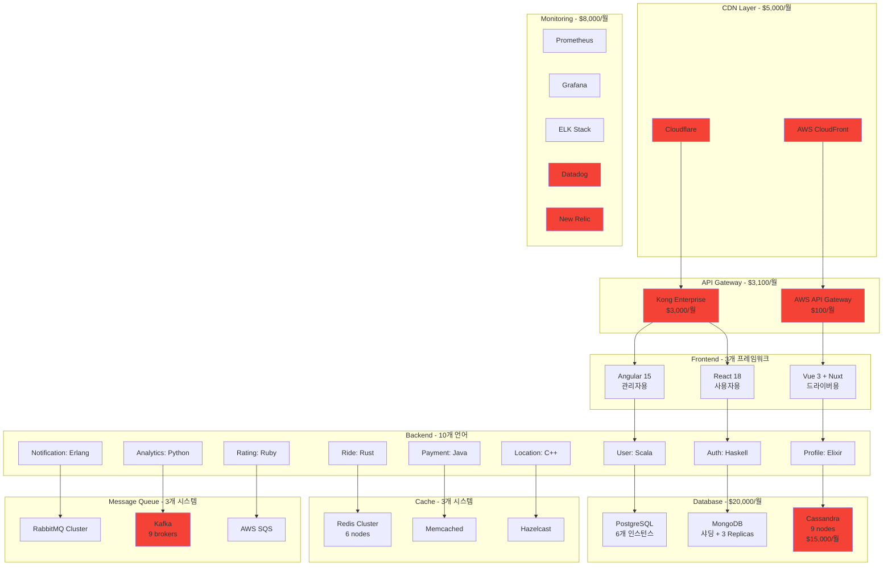
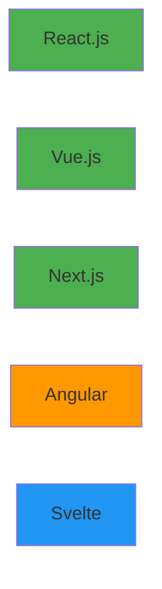
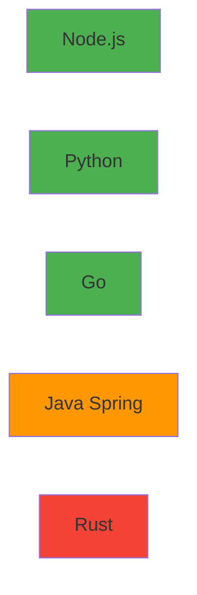
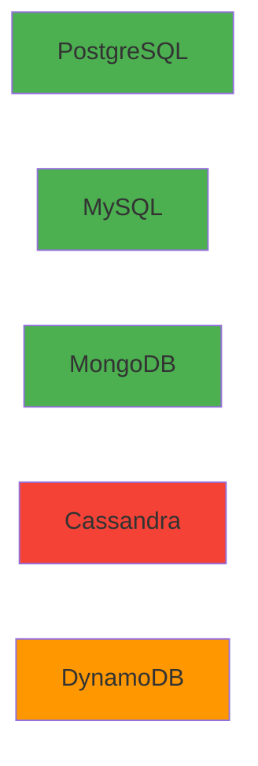
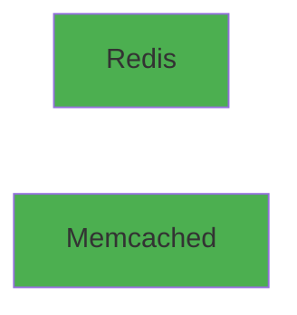
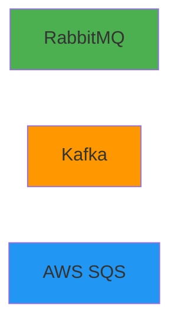
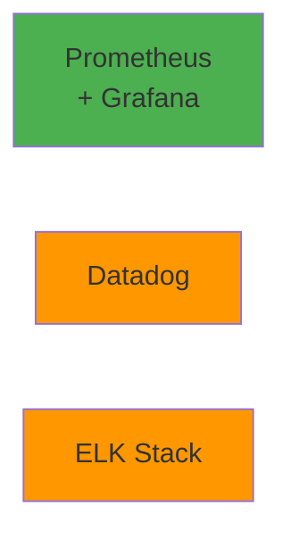
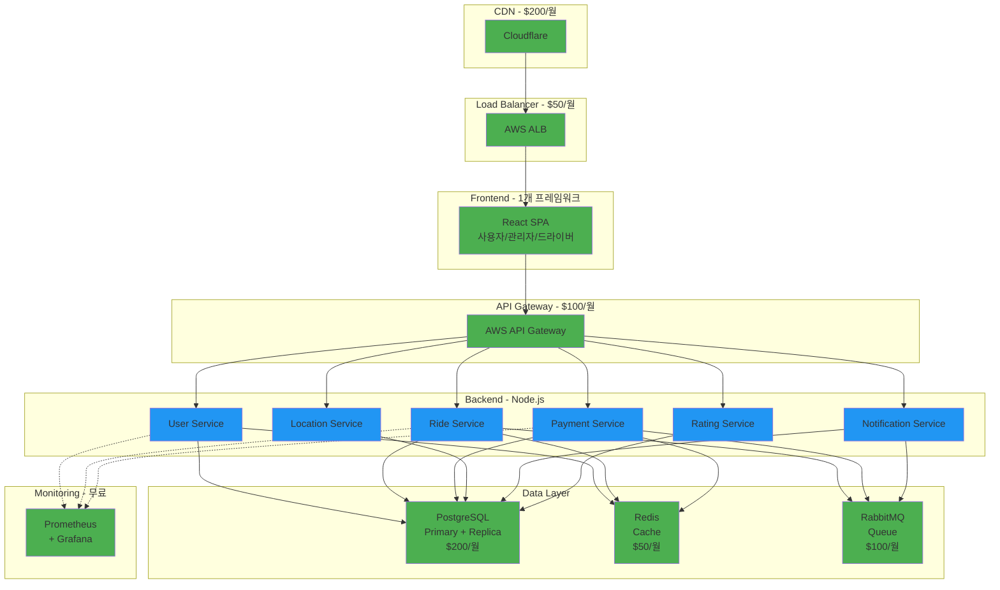

# Week 4 Day 1 Challenge 2: 마이크로서비스 아키텍처 설계

<div align="center">

**🏗️ 아키텍처 설계** • **🎯 기술 선택** • **💡 트레이드오프 분석**

*실무 시나리오 기반 마이크로서비스 아키텍처 설계 과제*

</div>

---

## 🎯 미션: 차량 공유 서비스 "CloudRide" 아키텍처 재설계

### 📖 시나리오

당신은 차량 공유 스타트업 "CloudRide"의 새로운 시니어 아키텍트로 합류했습니다.

**현재 상황:**
- 기존 아키텍트가 "최신 기술"만 추구하여 과도하게 복잡한 시스템 구축
- 월 클라우드 비용 $50,000 (실제 트래픽 대비 10배 과다)
- 신입 개발자들이 시스템 이해 못함 (러닝커브 6개월+)
- 배포 한 번에 3시간 소요
- 장애 발생 시 원인 파악 불가능

**당신의 임무:**
기존의 과도하게 복잡한 아키텍처를 분석하고, 
**실용적이고 비용 효율적인** 아키텍처로 재설계하세요.

---

## 🚨 기존 아키텍처 (안티패턴 예시)

### ❌ 문제투성이 아키텍처



**총 비용: $50,000/월**

### 🔥 주요 문제점

1. **과도한 기술 스택**: 10개 언어 (Scala, Haskell, Elixir, Rust, C++, Erlang, Ruby...)
2. **중복 인프라**: API Gateway 2개, 캐시 3개, 큐 3개
3. **과도한 DB**: Cassandra 9 노드 ($15,000/월), PostgreSQL 6개
4. **모니터링 중복**: 5개 도구 ($8,000/월)
5. **운영 복잡도**: 배포 3시간, 장애 원인 파악 불가

---

## 🎯 당신의 임무

### 1. 문제점 분석 (필수)
기존 아키텍처의 문제점을 구체적으로 분석하세요.

**분석 항목:**
- 불필요한 기술 스택
- 중복된 인프라
- 비용 낭비 요소
- 운영 복잡도 증가 원인

### 2. 개선된 아키텍처 설계 (필수)
실용적이고 비용 효율적인 아키텍처를 설계하세요.

**설계 원칙:**
- **단순성**: 꼭 필요한 기술만 사용
- **비용 효율**: 월 $10,000 이하 목표
- **유지보수성**: 신입도 2주 내 이해 가능
- **확장성**: 트래픽 10배 증가 대응 가능

### 3. 기술 선택 정당화 (필수)
왜 이 기술을 선택했는지 명확히 설명하세요.

**설명 항목:**
- 선택 이유
- 대안 기술과의 비교
- 트레이드오프
- 비용 분석

---

## 🃏 기술 스택 선택 카드

### 🎨 Frontend



### ⚙️ Backend



### 💾 Database



### ⚡ Cache



### 📨 Message Queue



### 📊 Monitoring



**색상 가이드:**
- 🟢 초록: 추천
- 🟠 주황: 주의
- 🔴 빨강: 비추천
- 🔵 파랑: 상황별

---

## 📝 제출 형식

### 1. 문제점 분석 보고서 (필수)

```markdown
## 🚨 기존 아키텍처 문제점 분석

### 1. 과도한 기술 스택
**문제:**
- 10개 이상의 프로그래밍 언어 사용
- Scala, Haskell, Elixir, Rust, C++, Erlang, Ruby 등
- 각 언어별 전문가 필요

**영향:**
- 신입 개발자 온보딩 6개월 이상
- 유지보수 비용 증가
- 버그 수정 지연

**개선 방안:**
- 2-3개 언어로 통일 (예: Node.js + Python)
- 팀 전체가 사용 가능한 기술 선택
- 러닝커브 최소화

### 2. 중복된 인프라
**문제:**
- API Gateway 2개 (Kong + AWS API Gateway)
- 캐시 3개 (Redis + Memcached + Hazelcast)
- 메시지 큐 3개 (RabbitMQ + Kafka + SQS)

**비용 영향:**
- Kong Enterprise: $3,000/월
- 중복 인프라 운영: $5,000/월
- 총 낭비: $8,000/월

**개선 방안:**
- API Gateway 1개로 통합
- 캐시 1개로 통합 (Redis)
- 메시지 큐 1개로 통합 (RabbitMQ 또는 SQS)

### 3. 과도한 데이터베이스 설정
**문제:**
- PostgreSQL 6개 인스턴스 (트래픽 대비 과다)
- Cassandra 9 노드 ($15,000/월)
- MongoDB 샤딩 (불필요)

**개선 방안:**
- PostgreSQL 2개 (Primary + Replica)
- Cassandra 제거 → PostgreSQL로 통합
- MongoDB 샤딩 제거 → 단일 인스턴스

### 4. 모니터링 중복
**문제:**
- 5개 모니터링 도구 ($8,000/월)
- Prometheus + Grafana + ELK + Datadog + New Relic

**개선 방안:**
- Prometheus + Grafana (무료)
- 또는 Datadog 하나만 ($500/월)
```

### 2. 개선된 아키텍처 다이어그램 (필수)

**Mermaid 차트로 작성**



**총 비용: $2,700/월 (94.6% 절감)**

### 3. 기술 선택 정당화 (필수)

```markdown
## 🎯 기술 스택 선택 이유

### Frontend: React.js (단일 프레임워크)
**선택 이유:**
- 기존 3개 프론트엔드(Angular, React, Vue)를 1개로 통합
- 가장 큰 생태계와 인력 풀
- React Native로 모바일 앱 개발 가능

**비교:**
| 항목 | React | Vue | Angular |
|------|-------|-----|---------|
| 생태계 | ⭐⭐⭐⭐⭐ | ⭐⭐⭐⭐ | ⭐⭐⭐ |
| 러닝커브 | 중 | 하 | 상 |
| 모바일 확장 | ⭐⭐⭐⭐⭐ | ⭐⭐⭐ | ⭐⭐ |
| 인력 채용 | 쉬움 | 보통 | 어려움 |

**트레이드오프:**
- Vue가 더 쉽지만, React의 생태계가 더 중요
- Angular는 엔터프라이즈급이지만, 과도하게 무거움

**비용 절감:**
- 3개 프론트엔드 유지보수 → 1개로 통합
- 개발자 3명 → 2명으로 감소 가능

### Backend: Node.js (Express)
**선택 이유:**
- 기존 10개 언어를 1개로 통합
- 비동기 I/O로 실시간 위치 추적에 적합
- 프론트엔드와 같은 언어 (JavaScript/TypeScript)
- 빠른 개발 속도

**비교:**
| 항목 | Node.js | Go | Python | Java |
|------|---------|----|----|------|
| 개발 속도 | ⭐⭐⭐⭐⭐ | ⭐⭐⭐ | ⭐⭐⭐⭐⭐ | ⭐⭐ |
| 성능 | ⭐⭐⭐⭐ | ⭐⭐⭐⭐⭐ | ⭐⭐⭐ | ⭐⭐⭐⭐ |
| 러닝커브 | 하 | 중 | 하 | 상 |
| 생태계 | ⭐⭐⭐⭐⭐ | ⭐⭐⭐ | ⭐⭐⭐⭐⭐ | ⭐⭐⭐⭐ |

**트레이드오프:**
- Go가 더 빠르지만, 개발 속도와 생태계 우선
- Python도 좋지만, 비동기 처리는 Node.js가 더 자연스러움

**비용 절감:**
- 10개 언어 전문가 → 1개 언어 팀으로 통합
- 온보딩 6개월 → 2주로 단축

### Database: PostgreSQL (Primary + Replica)
**선택 이유:**
- 관계형 데이터 + JSON 지원으로 범용성
- 기존 PostgreSQL + MongoDB + Cassandra를 통합
- 트랜잭션 보장
- 무료 오픈소스

**비교:**
| 항목 | PostgreSQL | MySQL | MongoDB | Cassandra |
|------|------------|-------|---------|-----------|
| 기능 | ⭐⭐⭐⭐⭐ | ⭐⭐⭐⭐ | ⭐⭐⭐⭐ | ⭐⭐⭐ |
| 트랜잭션 | ⭐⭐⭐⭐⭐ | ⭐⭐⭐⭐ | ⭐⭐⭐ | ⭐⭐ |
| JSON 지원 | ⭐⭐⭐⭐⭐ | ⭐⭐⭐ | ⭐⭐⭐⭐⭐ | ⭐⭐ |
| 운영 복잡도 | 중 | 하 | 중 | 극상 |

**트레이드오프:**
- Cassandra가 더 확장성 좋지만, 현재 트래픽에 과도
- MongoDB가 더 유연하지만, 트랜잭션 약함

**비용 절감:**
- Cassandra 9 노드 ($15,000/월) → 제거
- PostgreSQL 6개 → 2개로 감소
- 총 $14,800/월 절감

### Cache: Redis
**선택 이유:**
- 기존 3개 캐시(Redis, Memcached, Hazelcast)를 1개로 통합
- 다양한 자료구조 지원
- Pub/Sub으로 실시간 알림 구현
- 세션 관리

**비용 절감:**
- 3개 캐시 운영 → 1개로 통합
- 약 $200/월 절감

### Message Queue: RabbitMQ
**선택 이유:**
- 기존 3개 큐(RabbitMQ, Kafka, SQS)를 1개로 통합
- 범용적이고 안정적
- 현재 트래픽에 충분

**비교:**
| 항목 | RabbitMQ | Kafka | SQS |
|------|----------|-------|-----|
| 범용성 | ⭐⭐⭐⭐⭐ | ⭐⭐⭐ | ⭐⭐⭐⭐ |
| 운영 복잡도 | 중 | 상 | 하 |
| 비용 | 무료 | 무료 | 종량제 |
| 대용량 | ⭐⭐⭐ | ⭐⭐⭐⭐⭐ | ⭐⭐⭐⭐ |

**트레이드오프:**
- Kafka가 더 고성능이지만, 현재 트래픽에 과도
- SQS가 더 간단하지만, 벤더 종속

**비용 절감:**
- Kafka 9 브로커 운영 비용 제거
- 약 $1,000/월 절감

### Monitoring: Prometheus + Grafana
**선택 이유:**
- 기존 5개 도구($8,000/월)를 1개로 통합
- 무료 오픈소스
- Kubernetes 네이티브 통합
- 충분한 기능

**비교:**
| 항목 | Prometheus | Datadog | New Relic |
|------|------------|---------|-----------|
| 비용 | 무료 | $15/host | $100/월~ |
| 기능 | ⭐⭐⭐⭐ | ⭐⭐⭐⭐⭐ | ⭐⭐⭐⭐⭐ |
| 운영 | 필요 | 불필요 | 불필요 |
| 커스터마이징 | ⭐⭐⭐⭐⭐ | ⭐⭐⭐ | ⭐⭐⭐ |

**트레이드오프:**
- Datadog이 더 편하지만, 비용 대비 효과 낮음
- 자체 운영 필요하지만, 비용 절감 효과 큼

**비용 절감:**
- $8,000/월 → $0/월 (자체 호스팅)
```

### 4. 마이크로서비스 설계 (필수)

```markdown
## 🔧 마이크로서비스 분할 전략

### 서비스 목록 (6개로 단순화)

1. **User Service** - 사용자 관리
2. **Ride Service** - 차량 매칭
3. **Payment Service** - 결제 처리
4. **Location Service** - 위치 추적
5. **Notification Service** - 알림 발송
6. **Rating Service** - 평점 관리

### 1. User Service
**책임:**
- 사용자 인증/인가 (JWT)
- 프로필 관리
- 권한 관리

**기술 스택:**
- Runtime: Node.js (Express)
- Database: PostgreSQL
- Cache: Redis (세션)

**API 엔드포인트:**
```
POST   /api/users/register
POST   /api/users/login
GET    /api/users/profile
PUT    /api/users/profile
DELETE /api/users/account
```

**데이터 모델:**
```sql
users (
  id UUID PRIMARY KEY,
  email VARCHAR(255) UNIQUE,
  password_hash VARCHAR(255),
  name VARCHAR(100),
  phone VARCHAR(20),
  role VARCHAR(20),
  created_at TIMESTAMP,
  updated_at TIMESTAMP
)
```

### 2. Ride Service
**책임:**
- 차량 매칭 알고리즘
- 예약 관리
- 실시간 상태 업데이트

**기술 스택:**
- Runtime: Node.js (Express)
- Database: PostgreSQL
- Cache: Redis (실시간 위치)
- Queue: RabbitMQ (매칭 이벤트)

**API 엔드포인트:**
```
POST   /api/rides/request
GET    /api/rides/{id}
PUT    /api/rides/{id}/status
GET    /api/rides/history
POST   /api/rides/{id}/cancel
```

### 3. Payment Service
**책임:**
- 결제 처리 (Stripe/Toss 연동)
- 환불 관리
- 결제 이력

**기술 스택:**
- Runtime: Node.js (Express)
- Database: PostgreSQL (트랜잭션)
- Queue: RabbitMQ (결제 이벤트)

**API 엔드포인트:**
```
POST   /api/payments/charge
POST   /api/payments/refund
GET    /api/payments/history
GET    /api/payments/{id}
```

### 서비스 간 통신

**동기 통신 (REST API):**
```
User Service → Payment Service (결제 정보 조회)
Ride Service → User Service (사용자 정보 조회)
Ride Service → Location Service (위치 정보 조회)
```

**비동기 통신 (RabbitMQ):**
```
Ride Service → Notification Service (매칭 완료 알림)
Payment Service → Notification Service (결제 완료 알림)
Ride Service → Rating Service (라이드 완료 이벤트)
```

**실시간 통신 (WebSocket):**
```
Location Service → Frontend (실시간 위치 업데이트)
Ride Service → Frontend (매칭 상태 업데이트)
```

### 데이터 일관성 전략

**Saga 패턴 (분산 트랜잭션):**
```
1. Ride Service: 예약 생성
2. Payment Service: 결제 처리
3. 성공 → Notification Service: 알림 발송
4. 실패 → Ride Service: 예약 취소 (보상 트랜잭션)
```

### 확장성 전략

**Horizontal Scaling:**
- Kubernetes HPA로 자동 스케일링
- CPU 70% 이상 시 Pod 추가
- 최소 2개, 최대 10개 Pod

**Database Scaling:**
- Read Replica로 읽기 부하 분산
- Connection Pooling (pg-pool)
- 쿼리 최적화 및 인덱싱

**Caching Strategy:**
- L1: Application Cache (Node.js memory)
- L2: Redis Cache (분산 캐시)
- TTL: 사용자 프로필 5분, 위치 정보 10초
```

### 5. 비용 분석 (필수)

```markdown
## 💰 비용 비교 분석

### 기존 아키텍처 비용 (월)
| 항목 | 비용 | 비고 |
|------|------|------|
| CDN (Cloudflare + AWS) | $5,000 | 과도한 계약 |
| API Gateway (Kong + AWS) | $3,100 | 중복 |
| Compute (EC2/ECS) | $8,000 | 과다 프로비저닝 |
| Database (PostgreSQL 6개) | $3,000 | 불필요한 Replica |
| Database (Cassandra 9 nodes) | $15,000 | 과도한 설정 |
| Database (MongoDB Sharding) | $2,000 | 불필요 |
| Cache (3개 시스템) | $1,500 | 중복 |
| Message Queue (3개 시스템) | $2,000 | 중복 |
| Monitoring (5개 도구) | $8,000 | 중복 |
| 기타 (로드밸런서 등) | $2,400 | |
| **총계** | **$50,000** | |

### 개선된 아키텍처 비용 (월)
| 항목 | 비용 | 비고 |
|------|------|------|
| CDN (Cloudflare) | $200 | 필요한 만큼만 |
| Load Balancer (AWS ALB) | $50 | 단순화 |
| API Gateway (AWS) | $100 | 1개로 통합 |
| Compute (ECS Fargate) | $1,500 | 적정 크기 |
| Database (PostgreSQL 2개) | $400 | Primary + Replica |
| Cache (Redis 1개) | $100 | 1개로 통합 |
| Message Queue (RabbitMQ) | $150 | 1개로 통합 |
| Monitoring (Prometheus) | $0 | 자체 호스팅 |
| 기타 | $200 | |
| **총계** | **$2,700** | |

### 비용 절감 효과
- **절감액**: $47,300/월 ($567,600/년)
- **절감률**: 94.6%
- **ROI**: 첫 달부터 즉시 효과

### 트래픽 증가 시 비용 예측
| 트래픽 | 기존 | 개선 | 절감 |
|--------|------|------|------|
| 현재 (1x) | $50,000 | $2,700 | $47,300 |
| 5배 증가 | $80,000 | $8,000 | $72,000 |
| 10배 증가 | $120,000 | $15,000 | $105,000 |

**결론**: 트래픽이 10배 증가해도 기존 비용의 1/8 수준
```

---

## 🎯 평가 기준

### 문제점 분석 (25점)
- [ ] 기존 아키텍처의 문제점 정확히 파악
- [ ] 비용 낭비 요소 구체적 분석
- [ ] 운영 복잡도 증가 원인 이해
- [ ] 개선 방향 명확히 제시

### 아키텍처 설계 (30점)
- [ ] 실용적이고 단순한 설계
- [ ] 비용 효율적인 기술 선택
- [ ] 확장 가능한 구조
- [ ] 마이크로서비스 적절한 분할

### 기술 선택 정당화 (25점)
- [ ] 선택 이유 명확한 설명
- [ ] 대안 기술과의 비교
- [ ] 트레이드오프 이해
- [ ] 비용 분석 포함

### 실무 적용 가능성 (20점)
- [ ] 현실적인 해결책
- [ ] 팀 역량 고려
- [ ] 유지보수 용이성
- [ ] 점진적 마이그레이션 계획

---

## 💡 힌트 및 가이드

### 설계 원칙
1. **KISS (Keep It Simple, Stupid)**
   - 복잡한 것보다 단순한 것이 낫다
   - 꼭 필요한 기술만 사용

2. **YAGNI (You Aren't Gonna Need It)**
   - 미래를 위한 과도한 준비 금지
   - 현재 필요한 것만 구현

3. **Cost-Conscious Design**
   - 모든 기술 선택에 비용 고려
   - 무료 오픈소스 우선 검토

4. **Team Capability**
   - 팀이 사용할 수 있는 기술 선택
   - 러닝커브 최소화

### 흔한 실수
❌ **하지 말아야 할 것:**
- 최신 기술이라고 무조건 사용
- 트래픽 대비 과도한 인프라
- 중복된 기능의 도구 여러 개
- 팀이 모르는 언어/프레임워크

✅ **해야 할 것:**
- 검증된 기술 스택 사용
- 현재 트래픽에 맞는 크기
- 하나의 도구로 통합
- 팀 전체가 사용 가능한 기술

---

## 🤝 팀 발표 (선택)

### 발표 형식 (팀당 15분)
1. **문제점 분석** (5분)
   - 기존 아키텍처의 주요 문제
   - 비용 낭비 요소

2. **개선 아키텍처** (7분)
   - 새로운 설계 소개
   - 기술 선택 이유
   - 비용 절감 효과

3. **Q&A** (3분)
   - 질문 및 답변
   - 피드백 수렴

### 상호 피드백
- 다른 팀의 좋은 아이디어
- 개선 제안
- 배운 점

---

<div align="center">

**🏗️ 실용적 설계** • **💰 비용 효율** • **🎯 단순성** • **🚀 확장성**

*과도한 복잡성을 제거하고 실용적인 아키텍처를 설계하세요*

</div>
