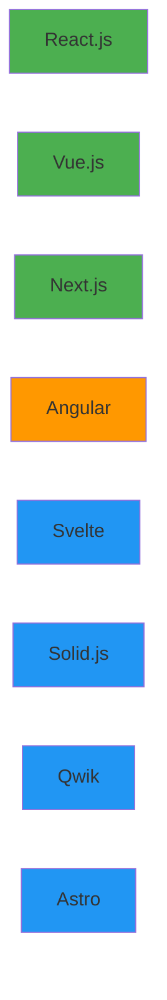
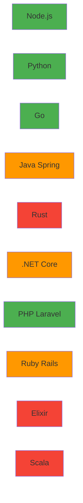
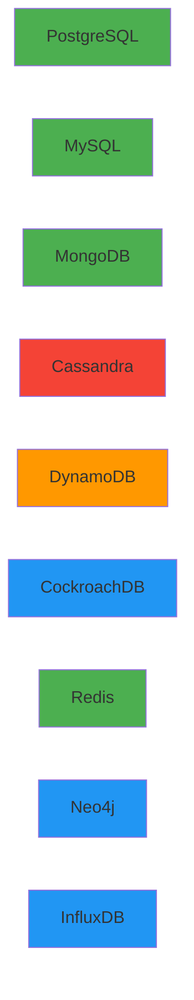
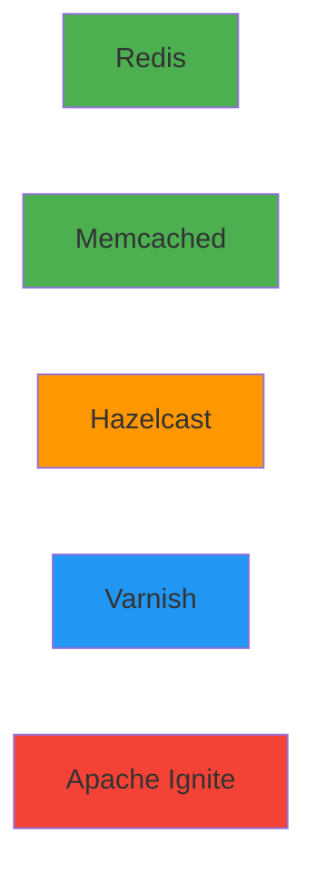
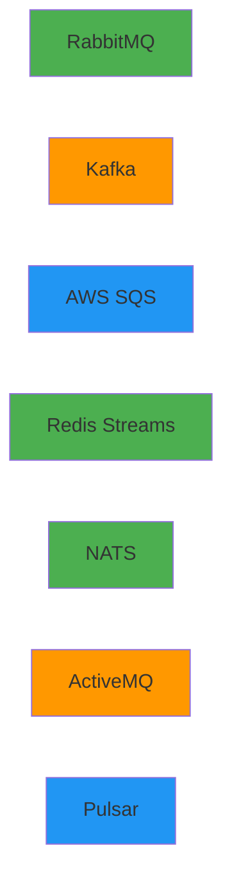
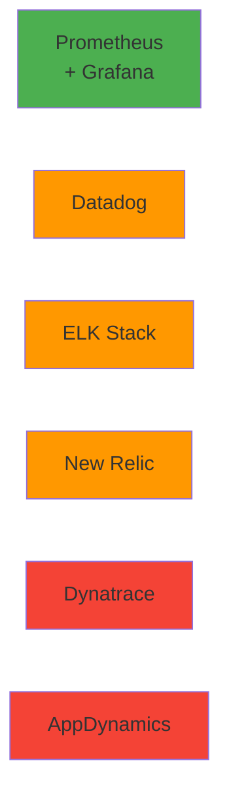
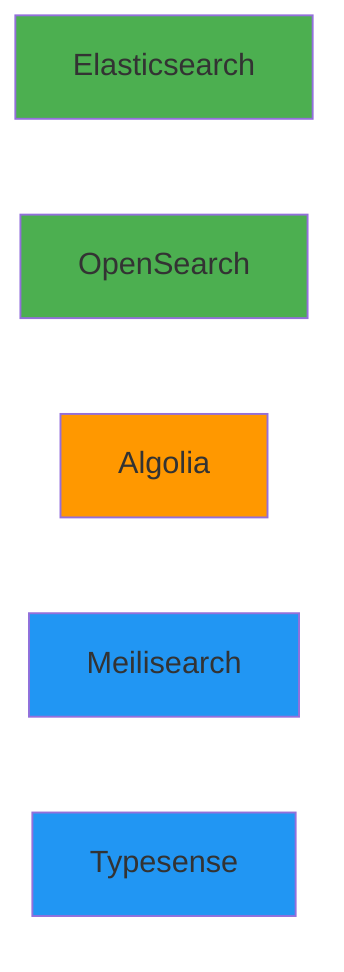
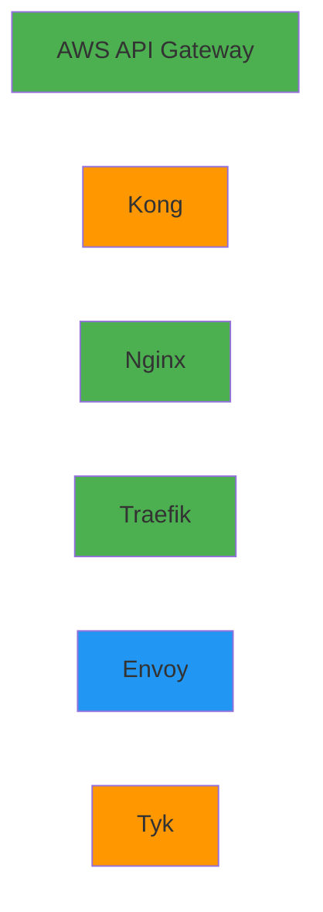

# Week 4 Day 1 Challenge 2: 마이크로서비스 아키텍처 설계

<div align="center">

**🏗️ 아키텍처 설계** • **🎯 기술 선택** • **💡 트레이드오프 분석**

*실무 시나리오 기반 마이크로서비스 아키텍처 설계 과제*

</div>

---

## 🎯 미션: 차량 공유 서비스 "CloudRide" 아키텍처 재설계

### 📖 시나리오

당신은 차량 공유 스타트업 "CloudRide"의 새로운 시니어 아키텍트로 합류했습니다.

**현재 상황:**
- 기존 아키텍트가 "최신 기술"만 추구하여 과도하게 복잡한 시스템 구축
- 월 클라우드 비용 $50,000 (실제 트래픽 대비 10배 과다)
- 신입 개발자들이 시스템 이해 못함 (러닝커브 6개월+)
- 배포 한 번에 3시간 소요
- 장애 발생 시 원인 파악 불가능

**당신의 임무:**
기존의 과도하게 복잡한 아키텍처를 분석하고, 
**실용적이고 비용 효율적인** 아키텍처로 재설계하세요.

---

## 🚨 기존 아키텍처 (안티패턴 예시)

### ❌ 문제투성이 아키텍처


**총 비용: $50,000/월**

### 🔥 주요 문제점

1. **과도한 기술 스택**: 10개 언어 (Scala, Haskell, Elixir, Rust, C++, Erlang, Ruby...)
2. **중복 인프라**: API Gateway 2개, 캐시 3개, 큐 3개
3. **과도한 DB**: Cassandra 9 노드 ($15,000/월), PostgreSQL 6개
4. **모니터링 중복**: 5개 도구 ($8,000/월)
5. **운영 복잡도**: 배포 3시간, 장애 원인 파악 불가

---

## 🎯 당신의 임무

### 1. 문제점 분석 (필수)
기존 아키텍처의 문제점을 구체적으로 분석하세요.

**분석 항목:**
- 불필요한 기술 스택
- 중복된 인프라
- 비용 낭비 요소
- 운영 복잡도 증가 원인

### 2. 개선된 아키텍처 설계 (필수)
실용적이고 비용 효율적인 아키텍처를 설계하세요.

**설계 원칙:**
- **단순성**: 꼭 필요한 기술만 사용
- **비용 효율**: 월 $10,000 이하 목표
- **유지보수성**: 신입도 2주 내 이해 가능
- **확장성**: 트래픽 10배 증가 대응 가능

### 3. 기술 선택 정당화 (필수)
왜 이 기술을 선택했는지 명확히 설명하세요.

**설명 항목:**
- 선택 이유
- 대안 기술과의 비교
- 트레이드오프
- 비용 분석

---

## 🃏 기술 스택 선택 카드

<table>
<tr>
<td width="50%">

### 🎨 Frontend



</td>
<td width="50%">

### ⚙️ Backend



</td>
</tr>
<tr>
<td>

### 💾 Database



</td>
<td>

### ⚡ Cache



</td>
</tr>
<tr>
<td>

### 📨 Message Queue



</td>
<td>

### 📊 Monitoring



</td>
</tr>
<tr>
<td>

### 🔍 Search Engine



</td>
<td>

### 🔐 API Gateway



</td>
</tr>
</table>

**색상 가이드:**
- 🟢 초록: 추천
- 🟠 주황: 주의
- 🔴 빨강: 비추천
- 🔵 파랑: 상황별

---


## 📝 제출 양식

### 1. 문제점 분석 (필수)

```markdown
## 🚨 기존 아키텍처 문제점 분석

### 1. [문제 카테고리]
**문제:**
- [구체적인 문제점]

**영향:**
- [비즈니스/기술적 영향]

**개선 방안:**
- [해결 방법]
```

### 2. 개선 아키텍처 (필수)


**총 비용: $X,XXX/월**

### 3. 기술 선택 이유 (필수)

```markdown
### [기술명]: [선택한 것]
**선택 이유:**
- [이유]

**비교:**
| 항목 | 선택 | 대안 |
|------|------|------|
| 항목 | 값 | 값 |

**트레이드오프:**
- [장단점]
```

### 4. 마이크로서비스 설계 (필수)

```markdown
### [Service Name]
**책임:** [역할]
**기술:** [스택]
**API:** [엔드포인트]
```

### 5. 비용 분석 (필수)

```markdown
| 항목 | 기존 | 개선 | 절감 |
|------|------|------|------|
| 총계 | $50,000 | $X,XXX | $XX,XXX |
```

---

## 🎯 평가 기준

### 문제점 분석 (25점)
- [ ] 기존 아키텍처의 문제점 정확히 파악
- [ ] 비용 낭비 요소 구체적 분석
- [ ] 운영 복잡도 증가 원인 이해
- [ ] 개선 방향 명확히 제시

### 아키텍처 설계 (30점)
- [ ] 실용적이고 단순한 설계
- [ ] 비용 효율적인 기술 선택
- [ ] 확장 가능한 구조
- [ ] 마이크로서비스 적절한 분할

### 기술 선택 정당화 (25점)
- [ ] 선택 이유 명확한 설명
- [ ] 대안 기술과의 비교
- [ ] 트레이드오프 이해
- [ ] 비용 분석 포함

### 실무 적용 가능성 (20점)
- [ ] 현실적인 해결책
- [ ] 팀 역량 고려
- [ ] 유지보수 용이성
- [ ] 점진적 마이그레이션 계획

---

## 💡 힌트 및 가이드

### 설계 원칙
1. **KISS (Keep It Simple, Stupid)**
   - 복잡한 것보다 단순한 것이 낫다
   - 꼭 필요한 기술만 사용

2. **YAGNI (You Aren't Gonna Need It)**
   - 미래를 위한 과도한 준비 금지
   - 현재 필요한 것만 구현

3. **Cost-Conscious Design**
   - 모든 기술 선택에 비용 고려
   - 무료 오픈소스 우선 검토

4. **Team Capability**
   - 팀이 사용할 수 있는 기술 선택
   - 러닝커브 최소화

### 흔한 실수
❌ **하지 말아야 할 것:**
- 최신 기술이라고 무조건 사용
- 트래픽 대비 과도한 인프라
- 중복된 기능의 도구 여러 개
- 팀이 모르는 언어/프레임워크

✅ **해야 할 것:**
- 검증된 기술 스택 사용
- 현재 트래픽에 맞는 크기
- 하나의 도구로 통합
- 팀 전체가 사용 가능한 기술

---

## 🤝 팀 발표 (선택)

### 발표 형식 (팀당 15분)
1. **문제점 분석** (5분)
   - 기존 아키텍처의 주요 문제
   - 비용 낭비 요소

2. **개선 아키텍처** (7분)
   - 새로운 설계 소개
   - 기술 선택 이유
   - 비용 절감 효과

3. **Q&A** (3분)
   - 질문 및 답변
   - 피드백 수렴

### 상호 피드백
- 다른 팀의 좋은 아이디어
- 개선 제안
- 배운 점

---

<div align="center">

**🏗️ 실용적 설계** • **💰 비용 효율** • **🎯 단순성** • **🚀 확장성**

*과도한 복잡성을 제거하고 실용적인 아키텍처를 설계하세요*

</div>
