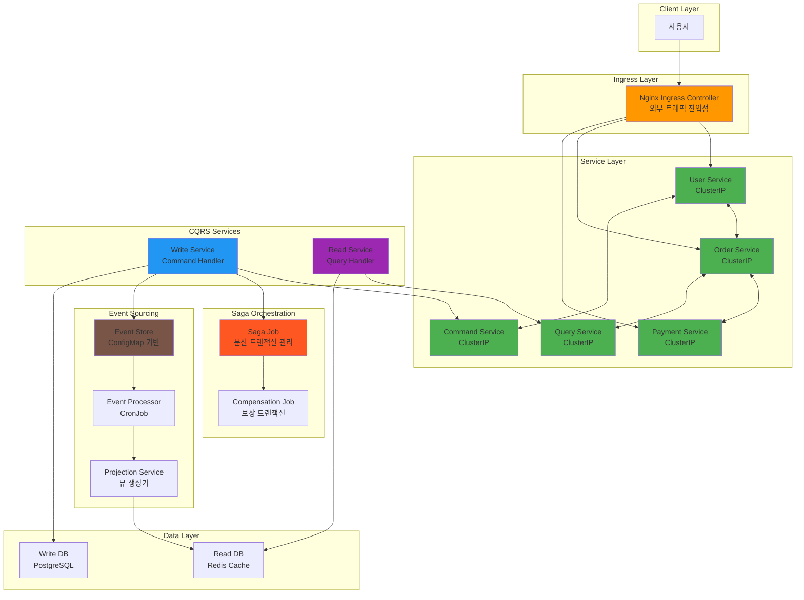
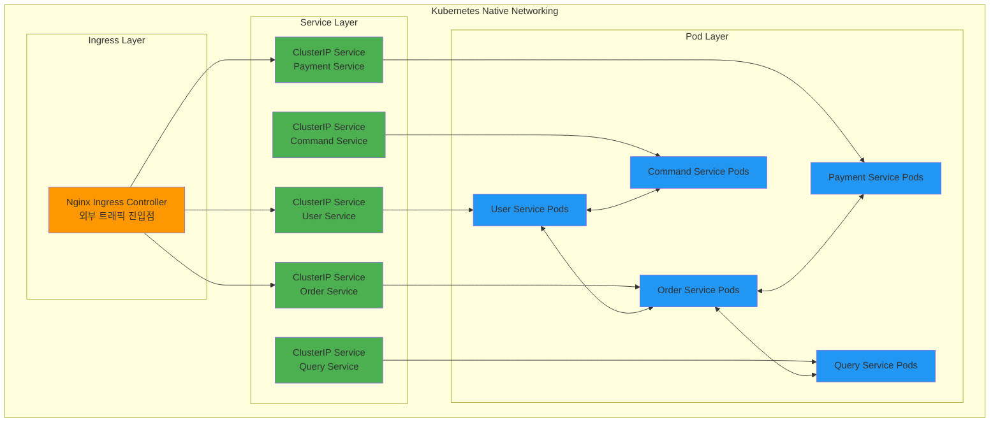

# Week 4 Day 1 Hands-on 1: 고급 마이크로서비스 패턴 구현

<div align="center">

**🔄 Saga 패턴** • **📊 CQRS** • **🎭 Event Sourcing** • **🌐 Kubernetes Native**

*Lab 1을 기반으로 Kubernetes 네이티브 고급 패턴 구현*

</div>

---

## 🕘 실습 정보
**시간**: 14:00-15:50 (110분)  
**목표**: Lab 1 기반 고급 패턴 구현 및 프로덕션급 기능 추가  
**방식**: Lab 1 확장 + 고급 패턴 + 실무 최적화

## ⚠️ 사전 준비사항
**AWS CLI 설정 필수**:
- AWS IAM Access Key가 설정되어 있지 않다면 **[AWS IAM Access Key 생성 가이드](../../guide/aws-iam-setup.md)**를 먼저 완료하고 오세요
- `aws sts get-caller-identity` 명령어가 정상 작동해야 합니다

## 🎯 실습 목표

### 📚 학습 목표
- **Saga 패턴**: 분산 트랜잭션 구현 및 보상 트랜잭션
- **CQRS**: 읽기/쓰기 분리 아키텍처 구현
- **Event Sourcing**: 이벤트 기반 상태 관리
- **Kubernetes Native**: 순수 Kubernetes 리소스로 고급 패턴 구현

### 🛠️ 구현 목표
- Kubernetes Jobs를 이용한 Saga 오케스트레이션
- 읽기 전용 서비스와 쓰기 전용 서비스 분리
- ConfigMap/Secret을 이용한 이벤트 스토어 구현
- Ingress Controller를 통한 트래픽 관리

---

## 🏗️ 전체 아키텍처

**🌐 Kubernetes Native 아키텍처**:
> Lab 1의 기본 마이크로서비스에 고급 패턴을 추가하여 순수 Kubernetes 리소스로 구현



**🎯 Kubernetes Native vs Service Mesh**:

| 기능 | Kubernetes Native | Service Mesh (Day 2) |
|------|-------------------|----------------------|
| **서비스 디스커버리** | DNS 기반 자동 발견 | 고급 서비스 레지스트리 |
| **로드밸런싱** | Service 레벨 | 네트워크 레벨 |
| **보안** | NetworkPolicy | 자동 mTLS |
| **모니터링** | 기본 메트릭 | 통합 관측성 |
| **트래픽 제어** | Ingress 규칙 | 고급 라우팅 |

---

## 🛠️ Step 1: 환경 준비 및 기본 네트워킹 (25분)

### Step 1-1: 기본 환경 설정 (10분)

**🚀 자동화 스크립트 사용**
```bash
cd theory/week_04/day1/lab_scripts/handson1
./setup-environment.sh
```

### Step 1-2: Kubernetes 네이티브 네트워킹 (15분)

**🌐 Kubernetes 네이티브 네트워킹이란?**
> **정의**: 추가 도구 없이 순수 Kubernetes 리소스만으로 마이크로서비스 간 통신 구현

**🏗️ 네이티브 네트워킹 아키텍처**:


**🔧 Kubernetes 네이티브의 장점**:
- **단순성**: 추가 도구 없이 Kubernetes 기본 기능만 사용
- **학습 용이**: 기본 개념 확실히 이해 후 고급 도구 도입
- **디버깅**: 문제 발생 시 원인 파악이 쉬움
- **호환성**: 모든 Kubernetes 환경에서 동작

**Ingress Controller 설치**
```bash
# Nginx Ingress Controller 설치
kubectl apply -f https://raw.githubusercontent.com/kubernetes/ingress-nginx/controller-v1.8.1/deploy/static/provider/cloud/deploy.yaml

# 설치 확인
kubectl get pods -n ingress-nginx
```

**기본 Ingress 설정**
```bash
cat <<EOF | kubectl apply -f -
apiVersion: networking.k8s.io/v1
kind: Ingress
metadata:
  name: ecommerce-ingress
  namespace: ecommerce-advanced
spec:
  ingressClassName: nginx
  rules:
  # localhost 지원 (브라우저에서 직접 접근)
  - host: localhost
    http:
      paths:
      - path: /api/orders
        pathType: Prefix
        backend:
          service:
            name: order-service
            port:
              number: 80
      - path: /api/payments
        pathType: Prefix
        backend:
          service:
            name: payment-service
            port:
              number: 80
      - path: /api/commands
        pathType: Prefix
        backend:
          service:
            name: command-service
            port:
              number: 80
      - path: /api/queries
        pathType: Prefix
        backend:
          service:
            name: query-service
            port:
              number: 80
      - path: /api/events
        pathType: Prefix
        backend:
          service:
            name: event-store-api
            port:
              number: 80
  # api.local 지원 (Host 헤더 사용)
  - host: api.local
    http:
      paths:
      - path: /api/orders
        pathType: Prefix
        backend:
          service:
            name: order-service
            port:
              number: 80
      - path: /api/payments
        pathType: Prefix
        backend:
          service:
            name: payment-service
            port:
              number: 80
      - path: /api/commands
        pathType: Prefix
        backend:
          service:
            name: command-service
            port:
              number: 80
      - path: /api/queries
        pathType: Prefix
        backend:
          service:
            name: query-service
            port:
              number: 80
      - path: /api/events
        pathType: Prefix
        backend:
          service:
            name: event-store-api
            port:
              number: 80
EOF
```

---

## 🔄 Step 2: Saga 패턴 구현 (30분)

### Step 2-1: Order Service 배포 (10분)

**주문 서비스 생성**
```bash
cat <<EOF | kubectl apply -f -
apiVersion: apps/v1
kind: Deployment
metadata:
  name: order-service
  namespace: ecommerce-advanced
spec:
  replicas: 2
  selector:
    matchLabels:
      app: order-service
  template:
    metadata:
      labels:
        app: order-service
    spec:
      containers:
      - name: order-service
        image: nginx:1.25
        ports:
        - containerPort: 80
        volumeMounts:
        - name: service-config
          mountPath: /etc/nginx/conf.d
      volumes:
      - name: service-config
        configMap:
          name: order-service-config
---
apiVersion: v1
kind: ConfigMap
metadata:
  name: order-service-config
  namespace: ecommerce-advanced
data:
  default.conf: |
    server {
        listen 80;
        default_type application/json;
        location /api/orders {
            return 200 '{"service": "order-service", "action": "create_order", "saga_id": "saga-001", "status": "initiated"}';
        }
        location /api/orders/compensate {
            return 200 '{"service": "order-service", "action": "cancel_order", "saga_id": "saga-001", "status": "compensated"}';
        }
    }
---
apiVersion: v1
kind: Service
metadata:
  name: order-service
  namespace: ecommerce-advanced
spec:
  selector:
    app: order-service
  ports:
  - port: 80
    targetPort: 80
EOF
```

### Step 2-2: Payment Service 배포 (10분)

**결제 서비스 생성**
```bash
cat <<EOF | kubectl apply -f -
apiVersion: apps/v1
kind: Deployment
metadata:
  name: payment-service
  namespace: ecommerce-advanced
spec:
  replicas: 2
  selector:
    matchLabels:
      app: payment-service
  template:
    metadata:
      labels:
        app: payment-service
    spec:
      containers:
      - name: payment-service
        image: nginx:1.25
        ports:
        - containerPort: 80
        volumeMounts:
        - name: service-config
          mountPath: /etc/nginx/conf.d
      volumes:
      - name: service-config
        configMap:
          name: payment-service-config
---
apiVersion: v1
kind: ConfigMap
metadata:
  name: payment-service-config
  namespace: ecommerce-advanced
data:
  default.conf: |
    server {
        listen 80;
        default_type application/json;
        location /api/payments {
            return 200 '{"service": "payment-service", "action": "process_payment", "saga_id": "saga-001", "status": "completed", "amount": 100.00}';
        }
        location /api/payments/compensate {
            return 200 '{"service": "payment-service", "action": "refund_payment", "saga_id": "saga-001", "status": "refunded", "amount": 100.00}';
        }
    }
---
apiVersion: v1
kind: Service
metadata:
  name: payment-service
  namespace: ecommerce-advanced
spec:
  selector:
    app: payment-service
  ports:
  - port: 80
    targetPort: 80
EOF
```

### Step 2-3: Saga Orchestrator Job 구현 (10분)

**Saga 오케스트레이터 Job**
```bash
cat <<EOF | kubectl apply -f -
apiVersion: batch/v1
kind: Job
metadata:
  name: saga-orchestrator
  namespace: ecommerce-advanced
spec:
  template:
    spec:
      containers:
      - name: saga-orchestrator
        image: busybox:1.35
        command: ['sh', '-c']
        args:
        - |
          echo "=== Saga Transaction Started ==="
          echo "Step 1: Validate User - SUCCESS"
          echo "Step 2: Create Order - SUCCESS"
          echo "Step 3: Process Payment - SUCCESS"
          echo "=== Saga Transaction Completed ==="
          echo '{
            "saga_id": "saga-001",
            "status": "completed",
            "steps": [
              {"service": "user-service", "action": "validate_user", "status": "success"},
              {"service": "order-service", "action": "create_order", "status": "success"},
              {"service": "payment-service", "action": "process_payment", "status": "success"}
            ]
          }' > /shared/saga-result.json
        volumeMounts:
        - name: shared-data
          mountPath: /shared
      volumes:
      - name: shared-data
        emptyDir: {}
      restartPolicy: Never
  backoffLimit: 3
EOF
```

---

## 📊 Step 3: CQRS 패턴 구현 (30분)

### Step 3-1: Command Service (쓰기 전용) 배포 (15분)

**Command Handler 서비스**
```bash
cat <<EOF | kubectl apply -f -
apiVersion: apps/v1
kind: Deployment
metadata:
  name: command-service
  namespace: ecommerce-advanced
spec:
  replicas: 2
  selector:
    matchLabels:
      app: command-service
  template:
    metadata:
      labels:
        app: command-service
    spec:
      containers:
      - name: command-service
        image: nginx:1.25
        ports:
        - containerPort: 80
        volumeMounts:
        - name: command-config
          mountPath: /etc/nginx/conf.d
      volumes:
      - name: command-config
        configMap:
          name: command-service-config
---
apiVersion: v1
kind: ConfigMap
metadata:
  name: command-service-config
  namespace: ecommerce-advanced
data:
  default.conf: |
    server {
        listen 80;
        default_type application/json;
        location /api/commands/create-user {
            return 200 '{
                "command_id": "cmd-001",
                "type": "CreateUserCommand",
                "status": "accepted",
                "event_id": "evt-001",
                "timestamp": "2024-01-01T10:00:00Z"
            }';
        }
        location /api/commands/update-user {
            return 200 '{
                "command_id": "cmd-002", 
                "type": "UpdateUserCommand",
                "status": "accepted",
                "event_id": "evt-002",
                "timestamp": "2024-01-01T10:01:00Z"
            }';
        }
    }
---
apiVersion: v1
kind: Service
metadata:
  name: command-service
  namespace: ecommerce-advanced
spec:
  selector:
    app: command-service
  ports:
  - port: 80
    targetPort: 80
EOF
```

### Step 3-2: Query Service (읽기 전용) 배포 (15분)

**Query Handler 서비스**
```bash
cat <<EOF | kubectl apply -f -
apiVersion: apps/v1
kind: Deployment
metadata:
  name: query-service
  namespace: ecommerce-advanced
spec:
  replicas: 3
  selector:
    matchLabels:
      app: query-service
  template:
    metadata:
      labels:
        app: query-service
    spec:
      containers:
      - name: query-service
        image: nginx:1.25
        ports:
        - containerPort: 80
        volumeMounts:
        - name: query-config
          mountPath: /etc/nginx/conf.d
      volumes:
      - name: query-config
        configMap:
          name: query-service-config
---
apiVersion: v1
kind: ConfigMap
metadata:
  name: query-service-config
  namespace: ecommerce-advanced
data:
  default.conf: |
    server {
        listen 80;
        default_type application/json;
        location /api/queries/users {
            return 200 '{
                "users": [
                    {"id": 1, "name": "John Doe", "email": "john@example.com", "status": "active"},
                    {"id": 2, "name": "Jane Smith", "email": "jane@example.com", "status": "active"}
                ],
                "total": 2,
                "source": "materialized_view",
                "last_updated": "2024-01-01T10:01:00Z"
            }';
        }
        location /api/queries/user-stats {
            return 200 '{
                "total_users": 1000,
                "active_users": 850,
                "new_users_today": 25,
                "source": "aggregated_view",
                "last_updated": "2024-01-01T10:00:00Z"
            }';
        }
    }
---
apiVersion: v1
kind: Service
metadata:
  name: query-service
  namespace: ecommerce-advanced
spec:
  selector:
    app: query-service
  ports:
  - port: 80
    targetPort: 80
EOF
```

---

## 📝 Step 4: Event Sourcing 구현 (25분)

### Step 4-1: Event Store ConfigMap 생성 (10분)

**Event Store 구현**
```bash
cat <<EOF | kubectl apply -f -
apiVersion: v1
kind: ConfigMap
metadata:
  name: event-store
  namespace: ecommerce-advanced
data:
  events.json: |
    {
      "events": [
        {
          "event_id": "evt-001",
          "aggregate_id": "user-123",
          "event_type": "UserCreated",
          "version": 1,
          "timestamp": "2024-01-01T10:00:00Z",
          "data": {"name": "John Doe", "email": "john@example.com"}
        },
        {
          "event_id": "evt-002",
          "aggregate_id": "user-123",
          "event_type": "UserUpdated",
          "version": 2,
          "timestamp": "2024-01-01T10:01:00Z",
          "data": {"email": "john.doe@example.com"}
        }
      ]
    }
  replay-config.json: |
    {
      "replay_settings": {
        "batch_size": 100,
        "replay_speed": "normal",
        "target_projections": ["UserProjection", "OrderProjection"]
      }
    }
EOF
```

### Step 4-2: Event Processor CronJob 생성 (15분)

**Event Processor 서비스**
```bash
cat <<EOF | kubectl apply -f -
apiVersion: batch/v1
kind: CronJob
metadata:
  name: event-processor
  namespace: ecommerce-advanced
spec:
  schedule: "*/5 * * * *"  # 5분마다 실행
  jobTemplate:
    spec:
      template:
        spec:
          containers:
          - name: event-processor
            image: busybox:1.35
            command: ['sh', '-c']
            args:
            - |
              echo "=== Event Processing Started ==="
              echo "Reading events from Event Store..."
              cat /events/events.json | head -20
              echo ""
              echo "Processing events and updating projections..."
              echo "- UserProjection: Updated 2 events"
              echo "- OrderProjection: Updated 0 events"
              echo "=== Event Processing Completed ==="
            volumeMounts:
            - name: event-store
              mountPath: /events
          volumes:
          - name: event-store
            configMap:
              name: event-store
          restartPolicy: OnFailure
---
apiVersion: apps/v1
kind: Deployment
metadata:
  name: event-store-api
  namespace: ecommerce-advanced
spec:
  replicas: 1
  selector:
    matchLabels:
      app: event-store-api
  template:
    metadata:
      labels:
        app: event-store-api
    spec:
      containers:
      - name: event-store-api
        image: nginx:1.25
        ports:
        - containerPort: 80
        volumeMounts:
        - name: eventstore-config
          mountPath: /etc/nginx/conf.d
        - name: event-data
          mountPath: /usr/share/nginx/html/events
      volumes:
      - name: eventstore-config
        configMap:
          name: event-store-api-config
      - name: event-data
        configMap:
          name: event-store
---
apiVersion: v1
kind: ConfigMap
metadata:
  name: event-store-api-config
  namespace: ecommerce-advanced
data:
  default.conf: |
    server {
        listen 80;
        default_type application/json;
        location /api/events {
            alias /usr/share/nginx/html/events/events.json;
        }
        location /api/events/replay {
            return 200 '{
                "replay_id": "replay-001",
                "status": "started",
                "events_count": 1000,
                "estimated_time": "30s"
            }';
        }
    }
---
apiVersion: v1
kind: Service
metadata:
  name: event-store-api
  namespace: ecommerce-advanced
spec:
  selector:
    app: event-store-api
  ports:
  - port: 80
    targetPort: 80
EOF
```

---

## 🚀 고급 테스트 및 검증 (20분)

### 패턴별 동작 테스트

**Saga 패턴 테스트**
```bash
# Saga Job 실행 확인
kubectl get jobs -n ecommerce-microservices

# Saga 로그 확인
kubectl logs job/saga-orchestrator -n ecommerce-microservices

# 보상 트랜잭션 테스트 (수동 실행)
kubectl create job compensation-test --from=job/saga-orchestrator -n ecommerce-microservices
```

**CQRS 패턴 테스트**
```bash
# Command 실행
kubectl exec -n testing deployment/load-tester -- curl -s -X POST http://command-service.ecommerce-microservices.svc.cluster.local/api/commands/create-user

# Query 실행
kubectl exec -n testing deployment/load-tester -- curl -s http://query-service.ecommerce-microservices.svc.cluster.local/api/queries/users
```

**Event Sourcing 테스트**
```bash
# 이벤트 조회
kubectl exec -n testing deployment/load-tester -- curl -s http://event-store-api.ecommerce-microservices.svc.cluster.local/api/events

# 이벤트 재생
kubectl exec -n testing deployment/load-tester -- curl -s -X POST http://event-store-api.ecommerce-microservices.svc.cluster.local/api/events/replay

# Event Processor 실행 확인
kubectl get cronjobs -n ecommerce-microservices
kubectl get jobs -n ecommerce-microservices | grep event-processor
```

**Kubernetes Native 기능 테스트**
```bash
# Ingress 라우팅 테스트
kubectl exec -n testing deployment/load-tester -- curl -s -H "Host: api.local" http://nginx-ingress-controller/api/users

# 서비스 디스커버리 테스트
kubectl exec -n testing deployment/load-tester -- nslookup command-service.ecommerce-microservices.svc.cluster.local
```

---

## ✅ 실습 체크포인트

### ✅ Kubernetes Native 구성 확인
- [ ] Nginx Ingress Controller 설치 및 동작 확인
- [ ] 기본 Ingress 라우팅 동작 확인
- [ ] 서비스 간 ClusterIP 통신 확인
- [ ] DNS 기반 서비스 디스커버리 동작

### ✅ Saga 패턴 동작 확인
- [ ] Saga Orchestrator Job 정상 실행
- [ ] 각 서비스별 트랜잭션 실행 확인
- [ ] 보상 트랜잭션 동작 테스트
- [ ] 분산 트랜잭션 상태 추적

### ✅ CQRS 패턴 확인
- [ ] Command Service (쓰기) 분리 확인
- [ ] Query Service (읽기) 분리 확인
- [ ] 읽기/쓰기 성능 최적화 확인
- [ ] 데이터 일관성 모델 이해

### ✅ Event Sourcing 확인
- [ ] Event Store ConfigMap 이벤트 저장 확인
- [ ] Event Processor CronJob 프로젝션 생성
- [ ] 이벤트 재생 기능 테스트
- [ ] 상태 복원 메커니즘 확인

---

## 🧹 실습 정리

**🚀 자동화 정리**
```bash
cd theory/week_04/day1/lab_scripts/handson1
./cleanup-all.sh
```

**추가 정리 (수동)**
```bash
# 네임스페이스 정리
kubectl delete namespace ecommerce-microservices

# Ingress Controller 정리 (선택사항)
kubectl delete -f https://raw.githubusercontent.com/kubernetes/ingress-nginx/controller-v1.8.1/deploy/static/provider/cloud/deploy.yaml
```

---

## 💡 실습 회고

### 🤝 팀 회고 (15분)
1. **패턴 비교**: Saga, CQRS, Event Sourcing 중 어떤 패턴이 가장 유용했나?
2. **Kubernetes Native**: 순수 Kubernetes 리소스만으로 구현한 소감은?
3. **복잡도 분석**: 각 패턴이 시스템에 추가하는 복잡도는?
4. **실무 적용**: 실제 프로젝트에서 어떤 패턴을 우선 적용할 것인가?

### 📊 학습 성과
- **고급 패턴**: 마이크로서비스의 핵심 패턴들 Kubernetes Native로 구현
- **순수 K8s**: 추가 도구 없이 Kubernetes 기본 기능만으로 고급 패턴 구현
- **분산 시스템**: 복잡한 분산 시스템 아키텍처 이해
- **운영 관점**: 각 패턴의 운영 복잡도와 트레이드오프 파악

### 🔮 다음 단계
- **Day 2**: Istio Service Mesh 도입으로 고급 네트워킹 기능 추가
- **최적화**: 성능 튜닝 및 모니터링 강화
- **실무 연계**: 프로덕션 환경에서의 패턴 적용 전략

---

<div align="center">

**🔄 고급 패턴** • **🌐 Kubernetes Native** • **📊 실증적 학습** • **🚀 단계적 발전**

*순수 Kubernetes로 마이크로서비스 고급 패턴을 구현하고 체험하는 실습*

</div>
