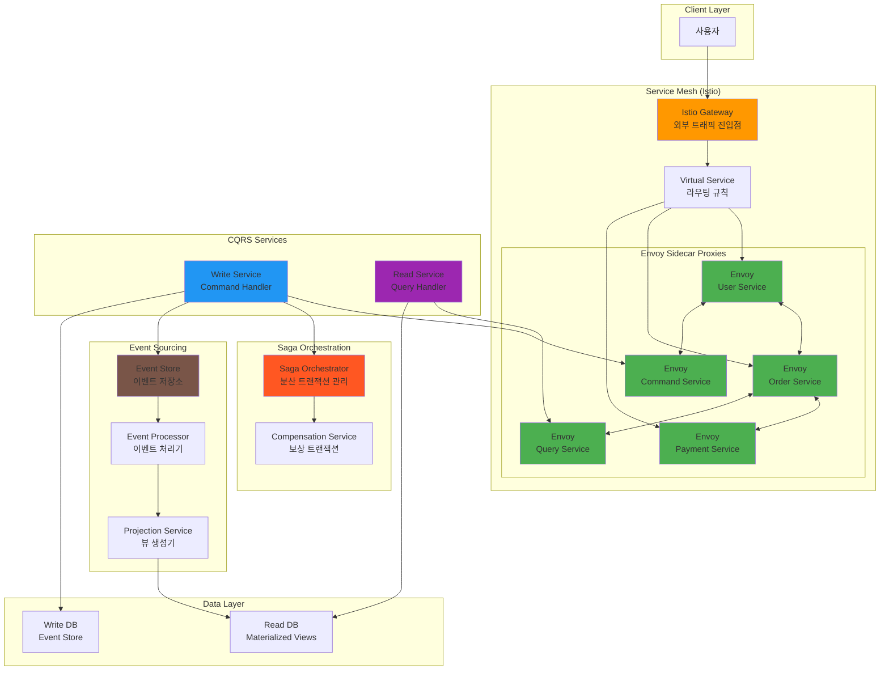
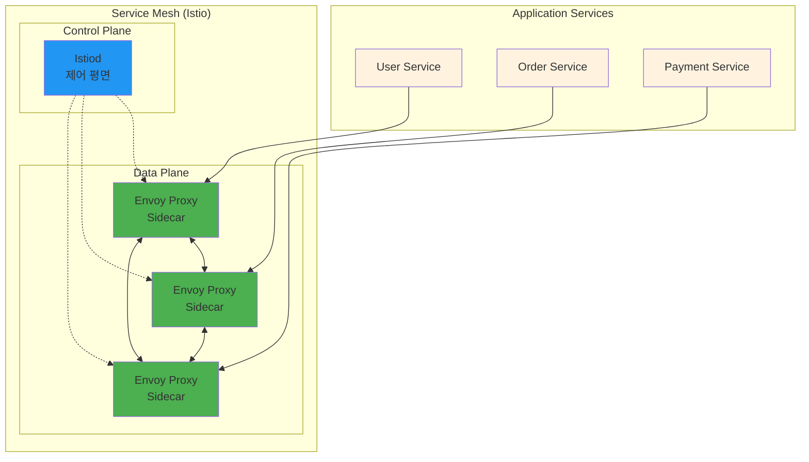

# Week 4 Day 1 Hands-on 1: 고급 마이크로서비스 패턴 구현

<div align="center">

**🔄 Saga 패턴** • **📊 CQRS** • **🎭 Event Sourcing** • **🌐 Service Mesh**

*Lab 1을 기반으로 고급 마이크로서비스 패턴 구현*

</div>

---

## 🕘 실습 정보
**시간**: 14:00-15:50 (110분)  
**목표**: Lab 1 기반 고급 패턴 구현 및 프로덕션급 기능 추가  
**방식**: Lab 1 확장 + 고급 패턴 + 실무 최적화

## 🎯 실습 목표

### 📚 학습 목표
- **Saga 패턴**: 분산 트랜잭션 구현 및 보상 트랜잭션
- **CQRS**: 읽기/쓰기 분리 아키텍처 구현
- **Event Sourcing**: 이벤트 기반 상태 관리
- **Service Mesh**: Istio를 통한 고급 네트워킹

### 🛠️ 구현 목표
- Step Functions를 이용한 Saga 오케스트레이션
- 읽기 전용 서비스와 쓰기 전용 서비스 분리
- 이벤트 스토어 구현 및 이벤트 재생
- Istio Service Mesh 적용 및 트래픽 관리

---

## 🏗️ 전체 아키텍처

**🌐 Service Mesh 통합 아키텍처**:
> Lab 1의 기본 마이크로서비스에 Istio Service Mesh를 추가하여 고급 네트워킹, 보안, 관측성 기능 구현



**🔧 Service Mesh 역할**:
- **Istio Gateway**: 외부 트래픽의 단일 진입점, AWS ALB 역할
- **Virtual Service**: 라우팅 규칙 정의, AWS API Gateway 라우팅과 유사
- **Envoy Sidecar**: 각 서비스 옆에 배치된 프록시, 모든 네트워크 트래픽 처리
- **Control Plane (Istiod)**: 설정 배포 및 인증서 관리

**🎯 Service Mesh 없이 vs 있을 때**:

| 기능 | Service Mesh 없이 | Service Mesh 있을 때 |
|------|-------------------|----------------------|
| **서비스 디스커버리** | 수동 설정 필요 | 자동 발견 |
| **로드밸런싱** | 애플리케이션 레벨 | 네트워크 레벨 |
| **보안 (mTLS)** | 각 서비스에서 구현 | 자동 적용 |
| **모니터링** | 각 서비스별 구현 | 통합 관측성 |
| **트래픽 제어** | 코드 수정 필요 | 설정으로 제어 |

---

## 🛠️ Step 1: 환경 준비 및 Service Mesh 설치 (25분)

### Step 1-1: 기본 환경 설정 (5분)

**🚀 자동화 스크립트 사용**
```bash
cd theory/week_04/day1/lab_scripts/handson1
./setup-environment.sh
```

### Step 1-2: Istio Service Mesh 설치 (15분)

**🌐 Service Mesh란?**
> **정의**: 마이크로서비스 간 통신을 관리하는 인프라 계층

**🏗️ Service Mesh 아키텍처**:


**🔧 Service Mesh가 해결하는 문제**:
- **서비스 디스커버리**: 서비스 위치 자동 발견
- **로드밸런싱**: 트래픽 분산 및 장애 조치
- **보안**: mTLS 자동 적용, 인증/인가
- **관측성**: 메트릭, 로그, 분산 추적
- **트래픽 관리**: 카나리 배포, 서킷 브레이커

**☁️ AWS에서의 Service Mesh**:
- **AWS App Mesh**: AWS 관리형 Service Mesh
- **EKS + Istio**: 오픈소스 Istio 사용
- **Fargate + App Mesh**: 서버리스 환경에서 Service Mesh

**Istio 설치**
```bash
# Istio 다운로드 및 설치
curl -L https://istio.io/downloadIstio | sh -
cd istio-*
export PATH=$PWD/bin:$PATH

# Istio 설치
istioctl install --set values.defaultRevision=default -y

# 네임스페이스에 Istio 주입 활성화
kubectl label namespace ecommerce-microservices istio-injection=enabled
kubectl label namespace ecommerce-monolith istio-injection=enabled
```

**Istio Gateway 설정**
```bash
cat <<EOF | kubectl apply -f -
apiVersion: networking.istio.io/v1beta1
kind: Gateway
metadata:
  name: ecommerce-gateway
  namespace: ecommerce-microservices
spec:
  selector:
    istio: ingressgateway
  servers:
  - port:
      number: 80
      name: http
      protocol: HTTP
    hosts:
    - "*"
---
apiVersion: networking.istio.io/v1beta1
kind: VirtualService
metadata:
  name: ecommerce-vs
  namespace: ecommerce-microservices
spec:
  hosts:
  - "*"
  gateways:
  - ecommerce-gateway
  http:
  - match:
    - uri:
        prefix: /api/users
    route:
    - destination:
        host: user-service
        port:
          number: 80
      weight: 100
  - match:
    - uri:
        prefix: /api/orders
    route:
    - destination:
        host: order-service
        port:
          number: 80
      weight: 100
EOF
```

### Step 1-3: 모니터링 도구 설치 (5분)

**Kiali 및 Prometheus 설치**
```bash
# Istio 애드온 설치
kubectl apply -f https://raw.githubusercontent.com/istio/istio/release-1.19/samples/addons/prometheus.yaml
kubectl apply -f https://raw.githubusercontent.com/istio/istio/release-1.19/samples/addons/kiali.yaml
kubectl apply -f https://raw.githubusercontent.com/istio/istio/release-1.19/samples/addons/jaeger.yaml

# 설치 확인
kubectl get pods -n istio-system
```

---

## 🔄 Step 2: Saga 패턴 구현 (30분)

### Step 2-1: Order Service 배포 (10분)

**주문 서비스 생성**
```bash
cat <<EOF | kubectl apply -f -
apiVersion: apps/v1
kind: Deployment
metadata:
  name: order-service
  namespace: ecommerce-microservices
spec:
  replicas: 2
  selector:
    matchLabels:
      app: order-service
  template:
    metadata:
      labels:
        app: order-service
    spec:
      containers:
      - name: order-service
        image: nginx:1.25
        ports:
        - containerPort: 80
        env:
        - name: SERVICE_NAME
          value: order-service
        volumeMounts:
        - name: service-config
          mountPath: /etc/nginx/conf.d
      volumes:
      - name: service-config
        configMap:
          name: order-service-config
---
apiVersion: v1
kind: ConfigMap
metadata:
  name: order-service-config
  namespace: ecommerce-microservices
data:
  default.conf: |
    server {
        listen 80;
        server_name localhost;
        
        location /api/orders {
            return 200 '{"service": "order-service", "action": "create_order", "saga_id": "saga-001", "status": "initiated"}';
            add_header Content-Type application/json;
        }
        
        location /api/orders/compensate {
            return 200 '{"service": "order-service", "action": "cancel_order", "saga_id": "saga-001", "status": "compensated"}';
            add_header Content-Type application/json;
        }
        
        location /health {
            return 200 '{"service": "order-service", "status": "healthy"}';
            add_header Content-Type application/json;
        }
    }
---
apiVersion: v1
kind: Service
metadata:
  name: order-service
  namespace: ecommerce-microservices
spec:
  selector:
    app: order-service
  ports:
  - port: 80
    targetPort: 80
EOF
```

### Step 2-2: Payment Service 배포 (10분)

**결제 서비스 생성**
```bash
cat <<EOF | kubectl apply -f -
apiVersion: apps/v1
kind: Deployment
metadata:
  name: payment-service
  namespace: ecommerce-microservices
spec:
  replicas: 2
  selector:
    matchLabels:
      app: payment-service
  template:
    metadata:
      labels:
        app: payment-service
    spec:
      containers:
      - name: payment-service
        image: nginx:1.25
        ports:
        - containerPort: 80
        env:
        - name: SERVICE_NAME
          value: payment-service
        volumeMounts:
        - name: service-config
          mountPath: /etc/nginx/conf.d
      volumes:
      - name: service-config
        configMap:
          name: payment-service-config
---
apiVersion: v1
kind: ConfigMap
metadata:
  name: payment-service-config
  namespace: ecommerce-microservices
data:
  default.conf: |
    server {
        listen 80;
        server_name localhost;
        
        location /api/payments {
            return 200 '{"service": "payment-service", "action": "process_payment", "saga_id": "saga-001", "status": "completed", "amount": 100.00}';
            add_header Content-Type application/json;
        }
        
        location /api/payments/compensate {
            return 200 '{"service": "payment-service", "action": "refund_payment", "saga_id": "saga-001", "status": "refunded", "amount": 100.00}';
            add_header Content-Type application/json;
        }
        
        location /health {
            return 200 '{"service": "payment-service", "status": "healthy"}';
            add_header Content-Type application/json;
        }
    }
---
apiVersion: v1
kind: Service
metadata:
  name: payment-service
  namespace: ecommerce-microservices
spec:
  selector:
    app: payment-service
  ports:
  - port: 80
    targetPort: 80
EOF
```

### Step 2-3: Saga Orchestrator 구현 (10분)

**Saga 오케스트레이터 서비스**
```bash
cat <<EOF | kubectl apply -f -
apiVersion: apps/v1
kind: Deployment
metadata:
  name: saga-orchestrator
  namespace: ecommerce-microservices
spec:
  replicas: 1
  selector:
    matchLabels:
      app: saga-orchestrator
  template:
    metadata:
      labels:
        app: saga-orchestrator
    spec:
      containers:
      - name: saga-orchestrator
        image: nginx:1.25
        ports:
        - containerPort: 80
        volumeMounts:
        - name: orchestrator-config
          mountPath: /etc/nginx/conf.d
      volumes:
      - name: orchestrator-config
        configMap:
          name: saga-orchestrator-config
---
apiVersion: v1
kind: ConfigMap
metadata:
  name: saga-orchestrator-config
  namespace: ecommerce-microservices
data:
  default.conf: |
    server {
        listen 80;
        server_name localhost;
        
        location /api/saga/start {
            return 200 '{
                "saga_id": "saga-001",
                "status": "started",
                "steps": [
                    {"service": "user-service", "action": "validate_user", "status": "pending"},
                    {"service": "order-service", "action": "create_order", "status": "pending"},
                    {"service": "payment-service", "action": "process_payment", "status": "pending"}
                ],
                "compensation_steps": [
                    {"service": "payment-service", "action": "refund_payment"},
                    {"service": "order-service", "action": "cancel_order"},
                    {"service": "user-service", "action": "unlock_user"}
                ]
            }';
            add_header Content-Type application/json;
        }
        
        location /api/saga/compensate {
            return 200 '{
                "saga_id": "saga-001",
                "status": "compensating",
                "message": "Executing compensation transactions"
            }';
            add_header Content-Type application/json;
        }
        
        location /health {
            return 200 '{"service": "saga-orchestrator", "status": "healthy"}';
            add_header Content-Type application/json;
        }
    }
---
apiVersion: v1
kind: Service
metadata:
  name: saga-orchestrator
  namespace: ecommerce-microservices
spec:
  selector:
    app: saga-orchestrator
  ports:
  - port: 80
    targetPort: 80
EOF
```

---

## 📊 Step 3: CQRS 패턴 구현 (30분)

### Step 3-1: Command Service (쓰기 전용) 배포 (15분)

**Command Handler 서비스**
```bash
cat <<EOF | kubectl apply -f -
apiVersion: apps/v1
kind: Deployment
metadata:
  name: command-service
  namespace: ecommerce-microservices
spec:
  replicas: 2
  selector:
    matchLabels:
      app: command-service
  template:
    metadata:
      labels:
        app: command-service
    spec:
      containers:
      - name: command-service
        image: nginx:1.25
        ports:
        - containerPort: 80
        volumeMounts:
        - name: command-config
          mountPath: /etc/nginx/conf.d
      volumes:
      - name: command-config
        configMap:
          name: command-service-config
---
apiVersion: v1
kind: ConfigMap
metadata:
  name: command-service-config
  namespace: ecommerce-microservices
data:
  default.conf: |
    server {
        listen 80;
        server_name localhost;
        
        location /api/commands/create-user {
            return 200 '{
                "command_id": "cmd-001",
                "type": "CreateUserCommand",
                "status": "accepted",
                "event_id": "evt-001",
                "timestamp": "2024-01-01T10:00:00Z"
            }';
            add_header Content-Type application/json;
        }
        
        location /api/commands/update-user {
            return 200 '{
                "command_id": "cmd-002", 
                "type": "UpdateUserCommand",
                "status": "accepted",
                "event_id": "evt-002",
                "timestamp": "2024-01-01T10:01:00Z"
            }';
            add_header Content-Type application/json;
        }
        
        location /health {
            return 200 '{"service": "command-service", "status": "healthy"}';
            add_header Content-Type application/json;
        }
    }
---
apiVersion: v1
kind: Service
metadata:
  name: command-service
  namespace: ecommerce-microservices
spec:
  selector:
    app: command-service
  ports:
  - port: 80
    targetPort: 80
EOF
```

### Step 3-2: Query Service (읽기 전용) 배포 (15분)

**Query Handler 서비스**
```bash
cat <<EOF | kubectl apply -f -
apiVersion: apps/v1
kind: Deployment
metadata:
  name: query-service
  namespace: ecommerce-microservices
spec:
  replicas: 3
  selector:
    matchLabels:
      app: query-service
  template:
    metadata:
      labels:
        app: query-service
    spec:
      containers:
      - name: query-service
        image: nginx:1.25
        ports:
        - containerPort: 80
        volumeMounts:
        - name: query-config
          mountPath: /etc/nginx/conf.d
      volumes:
      - name: query-config
        configMap:
          name: query-service-config
---
apiVersion: v1
kind: ConfigMap
metadata:
  name: query-service-config
  namespace: ecommerce-microservices
data:
  default.conf: |
    server {
        listen 80;
        server_name localhost;
        
        location /api/queries/users {
            return 200 '{
                "users": [
                    {"id": 1, "name": "John Doe", "email": "john@example.com", "status": "active"},
                    {"id": 2, "name": "Jane Smith", "email": "jane@example.com", "status": "active"}
                ],
                "total": 2,
                "source": "materialized_view",
                "last_updated": "2024-01-01T10:01:00Z"
            }';
            add_header Content-Type application/json;
        }
        
        location /api/queries/user-stats {
            return 200 '{
                "total_users": 1000,
                "active_users": 850,
                "new_users_today": 25,
                "source": "aggregated_view",
                "last_updated": "2024-01-01T10:00:00Z"
            }';
            add_header Content-Type application/json;
        }
        
        location /health {
            return 200 '{"service": "query-service", "status": "healthy"}';
            add_header Content-Type application/json;
        }
    }
---
apiVersion: v1
kind: Service
metadata:
  name: query-service
  namespace: ecommerce-microservices
spec:
  selector:
    app: query-service
  ports:
  - port: 80
    targetPort: 80
EOF
```

---

## 📝 Step 4: Event Sourcing 구현 (25분)

### Step 4-1: Event Store 서비스 배포 (15분)

**Event Store 구현**
```bash
cat <<EOF | kubectl apply -f -
apiVersion: apps/v1
kind: Deployment
metadata:
  name: event-store
  namespace: ecommerce-microservices
spec:
  replicas: 1
  selector:
    matchLabels:
      app: event-store
  template:
    metadata:
      labels:
        app: event-store
    spec:
      containers:
      - name: event-store
        image: nginx:1.25
        ports:
        - containerPort: 80
        volumeMounts:
        - name: eventstore-config
          mountPath: /etc/nginx/conf.d
      volumes:
      - name: eventstore-config
        configMap:
          name: event-store-config
---
apiVersion: v1
kind: ConfigMap
metadata:
  name: event-store-config
  namespace: ecommerce-microservices
data:
  default.conf: |
    server {
        listen 80;
        server_name localhost;
        
        location /api/events {
            return 200 '{
                "events": [
                    {
                        "event_id": "evt-001",
                        "aggregate_id": "user-123",
                        "event_type": "UserCreated",
                        "version": 1,
                        "timestamp": "2024-01-01T10:00:00Z",
                        "data": {"name": "John Doe", "email": "john@example.com"}
                    },
                    {
                        "event_id": "evt-002", 
                        "aggregate_id": "user-123",
                        "event_type": "UserUpdated",
                        "version": 2,
                        "timestamp": "2024-01-01T10:01:00Z",
                        "data": {"email": "john.doe@example.com"}
                    }
                ],
                "total": 2
            }';
            add_header Content-Type application/json;
        }
        
        location /api/events/replay {
            return 200 '{
                "replay_id": "replay-001",
                "status": "started",
                "events_count": 1000,
                "estimated_time": "30s"
            }';
            add_header Content-Type application/json;
        }
        
        location /health {
            return 200 '{"service": "event-store", "status": "healthy"}';
            add_header Content-Type application/json;
        }
    }
---
apiVersion: v1
kind: Service
metadata:
  name: event-store
  namespace: ecommerce-microservices
spec:
  selector:
    app: event-store
  ports:
  - port: 80
    targetPort: 80
EOF
```

### Step 4-2: Event Processor 배포 (10분)

**Event Processor 서비스**
```bash
cat <<EOF | kubectl apply -f -
apiVersion: apps/v1
kind: Deployment
metadata:
  name: event-processor
  namespace: ecommerce-microservices
spec:
  replicas: 2
  selector:
    matchLabels:
      app: event-processor
  template:
    metadata:
      labels:
        app: event-processor
    spec:
      containers:
      - name: event-processor
        image: nginx:1.25
        ports:
        - containerPort: 80
        volumeMounts:
        - name: processor-config
          mountPath: /etc/nginx/conf.d
      volumes:
      - name: processor-config
        configMap:
          name: event-processor-config
---
apiVersion: v1
kind: ConfigMap
metadata:
  name: event-processor-config
  namespace: ecommerce-microservices
data:
  default.conf: |
    server {
        listen 80;
        server_name localhost;
        
        location /api/projections/update {
            return 200 '{
                "projection_id": "proj-001",
                "type": "UserProjection",
                "status": "updated",
                "events_processed": 5,
                "last_event_id": "evt-002"
            }';
            add_header Content-Type application/json;
        }
        
        location /api/projections/status {
            return 200 '{
                "projections": [
                    {"name": "UserProjection", "status": "up-to-date", "last_update": "2024-01-01T10:01:00Z"},
                    {"name": "OrderProjection", "status": "processing", "last_update": "2024-01-01T10:00:30Z"}
                ]
            }';
            add_header Content-Type application/json;
        }
        
        location /health {
            return 200 '{"service": "event-processor", "status": "healthy"}';
            add_header Content-Type application/json;
        }
    }
---
apiVersion: v1
kind: Service
metadata:
  name: event-processor
  namespace: ecommerce-microservices
spec:
  selector:
    app: event-processor
  ports:
  - port: 80
    targetPort: 80
EOF
```

---

## 🌐 Step 5: Service Mesh 고급 기능 (20분)

### Step 5-1: 트래픽 분할 및 카나리 배포 (10분)

**Virtual Service 업데이트 - 카나리 배포**
```bash
cat <<EOF | kubectl apply -f -
apiVersion: networking.istio.io/v1beta1
kind: VirtualService
metadata:
  name: user-service-canary
  namespace: ecommerce-microservices
spec:
  hosts:
  - user-service
  http:
  - match:
    - headers:
        canary:
          exact: "true"
    route:
    - destination:
        host: user-service
        subset: v2
      weight: 100
  - route:
    - destination:
        host: user-service
        subset: v1
      weight: 90
    - destination:
        host: user-service
        subset: v2
      weight: 10
---
apiVersion: networking.istio.io/v1beta1
kind: DestinationRule
metadata:
  name: user-service-dr
  namespace: ecommerce-microservices
spec:
  host: user-service
  subsets:
  - name: v1
    labels:
      version: v1
  - name: v2
    labels:
      version: v2
EOF
```

### Step 5-2: 서킷 브레이커 및 재시도 정책 (10분)

**Destination Rule - 서킷 브레이커**
```bash
cat <<EOF | kubectl apply -f -
apiVersion: networking.istio.io/v1beta1
kind: DestinationRule
metadata:
  name: payment-service-cb
  namespace: ecommerce-microservices
spec:
  host: payment-service
  trafficPolicy:
    connectionPool:
      tcp:
        maxConnections: 10
      http:
        http1MaxPendingRequests: 10
        maxRequestsPerConnection: 2
    outlierDetection:
      consecutiveErrors: 3
      interval: 30s
      baseEjectionTime: 30s
      maxEjectionPercent: 50
    retryPolicy:
      attempts: 3
      perTryTimeout: 2s
EOF
```

---

## ✅ 실습 체크포인트

### ✅ Service Mesh 구성 확인
- [ ] Istio 설치 및 사이드카 주입 확인
- [ ] Gateway 및 Virtual Service 동작 확인
- [ ] Kiali 대시보드에서 서비스 메시 시각화
- [ ] Jaeger에서 분산 추적 확인

### ✅ Saga 패턴 동작 확인
- [ ] Saga 오케스트레이터 정상 동작
- [ ] 각 서비스별 트랜잭션 실행 확인
- [ ] 보상 트랜잭션 동작 테스트
- [ ] 분산 트랜잭션 상태 추적

### ✅ CQRS 패턴 확인
- [ ] Command Service (쓰기) 분리 확인
- [ ] Query Service (읽기) 분리 확인
- [ ] 읽기/쓰기 성능 최적화 확인
- [ ] 데이터 일관성 모델 이해

### ✅ Event Sourcing 확인
- [ ] Event Store 이벤트 저장 확인
- [ ] Event Processor 프로젝션 생성
- [ ] 이벤트 재생 기능 테스트
- [ ] 상태 복원 메커니즘 확인

---

## 🚀 고급 테스트 및 검증 (20분)

### 패턴별 동작 테스트

**Saga 패턴 테스트**
```bash
# Saga 시작
kubectl exec -n testing deployment/load-tester -- curl -s http://saga-orchestrator/api/saga/start

# 보상 트랜잭션 테스트
kubectl exec -n testing deployment/load-tester -- curl -s http://saga-orchestrator/api/saga/compensate
```

**CQRS 패턴 테스트**
```bash
# Command 실행
kubectl exec -n testing deployment/load-tester -- curl -s -X POST http://command-service/api/commands/create-user

# Query 실행
kubectl exec -n testing deployment/load-tester -- curl -s http://query-service/api/queries/users
```

**Event Sourcing 테스트**
```bash
# 이벤트 조회
kubectl exec -n testing deployment/load-tester -- curl -s http://event-store/api/events

# 이벤트 재생
kubectl exec -n testing deployment/load-tester -- curl -s -X POST http://event-store/api/events/replay
```

**Service Mesh 기능 테스트**
```bash
# 카나리 배포 테스트
kubectl exec -n testing deployment/load-tester -- curl -s -H "canary: true" http://user-service/api/users

# 일반 트래픽 테스트
kubectl exec -n testing deployment/load-tester -- curl -s http://user-service/api/users
```

---

## 🧹 실습 정리

**🚀 자동화 정리**
```bash
cd theory/week_04/day1/lab_scripts/handson1
./cleanup-all.sh
```

**추가 정리 (Istio)**
```bash
# Istio 제거
istioctl uninstall --purge -y
kubectl delete namespace istio-system
```

---

## 💡 실습 회고

### 🤝 팀 회고 (15분)
1. **패턴 비교**: Saga, CQRS, Event Sourcing 중 어떤 패턴이 가장 유용했나?
2. **복잡도 분석**: 각 패턴이 시스템에 추가하는 복잡도는?
3. **Service Mesh**: Istio가 제공하는 기능 중 가장 인상적인 것은?
4. **실무 적용**: 실제 프로젝트에서 어떤 패턴을 우선 적용할 것인가?

### 📊 학습 성과
- **고급 패턴**: 마이크로서비스의 핵심 패턴들 실제 구현 경험
- **Service Mesh**: 네트워크 레벨에서의 고급 기능 체험
- **분산 시스템**: 복잡한 분산 시스템 아키텍처 이해
- **운영 관점**: 각 패턴의 운영 복잡도와 트레이드오프 파악

### 🔮 다음 단계
- **Challenge**: 실제 장애 시나리오에서의 패턴 동작 확인
- **최적화**: 성능 튜닝 및 모니터링 강화
- **실무 연계**: 프로덕션 환경에서의 패턴 적용 전략

---

<div align="center">

**🔄 고급 패턴** • **🌐 Service Mesh** • **📊 실증적 학습** • **🚀 프로덕션급 구현**

*마이크로서비스의 고급 패턴을 실제로 구현하고 체험하는 실습*

</div>

---
