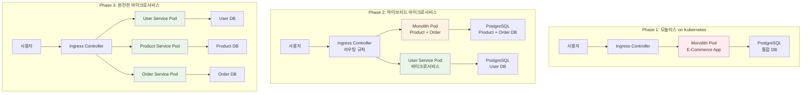

# Week 4 Day 1 Lab 1: 모놀리스에서 마이크로서비스로 전환 (Kubernetes 기반)

<div align="center">

**🏠 모놀리스** • **🏢 마이크로서비스** • **🔄 전환 전략** • **☁️ Kubernetes + AWS**

*실제 애플리케이션을 통한 아키텍처 전환 체험*

</div>

---

## 🕘 실습 정보
**시간**: 11:50-13:45 (115분, 점심시간 포함)  
**목표**: Kubernetes 환경에서 모놀리스를 마이크로서비스로 단계적 전환  
**방식**: 실제 컨테이너 기반 + AWS EKS 활용

## 🎯 실습 목표

### 📚 학습 목표
- **아키텍처 비교**: 모놀리스와 마이크로서비스 실제 차이점 체험
- **전환 전략**: Strangler Fig 패턴을 통한 점진적 마이그레이션
- **Kubernetes 구현**: EKS 환경에서의 마이크로서비스 배포
- **성능 측정**: 아키텍처별 성능 특성 비교 분석

### 🛠️ 구현 목표
- 모놀리스 E-Commerce 애플리케이션을 Kubernetes에 배포
- 사용자 서비스를 마이크로서비스로 분리
- Ingress Controller를 통한 라우팅 구현
- 성능 및 복잡도 비교 분석

---

## 🏗️ 전체 아키텍처



---

## 🛠️ 사전 준비: 환경 설정 (15분)

### Step 0-1: AWS CLI 설치 및 설정

#### 🍎 macOS 설치 가이드
```bash
# Homebrew를 이용한 설치 (권장)
brew install awscli

# 또는 직접 다운로드
curl "https://awscli.amazonaws.com/AWSCLIV2.pkg" -o "AWSCLIV2.pkg"
sudo installer -pkg AWSCLIV2.pkg -target /

# 설치 확인
aws --version
```

#### 🐧 Linux 설치 가이드
```bash
# Ubuntu/Debian 계열
sudo apt update
sudo apt install awscli

# 또는 최신 버전 직접 설치
curl "https://awscli.amazonaws.com/awscli-exe-linux-x86_64.zip" -o "awscliv2.zip"
unzip awscliv2.zip
sudo ./aws/install

# CentOS/RHEL 계열
sudo yum install awscli

# 또는 pip를 이용한 설치
pip3 install awscli --upgrade --user

# 설치 확인
aws --version
```

#### ⚙️ AWS CLI 설정 및 연동
```bash
# AWS 자격 증명 설정
aws configure
# AWS Access Key ID: [여기에 입력]
# AWS Secret Access Key: [여기에 입력]
# Default region name: ap-northeast-2
# Default output format: json

# 설정 확인 - 현재 사용자 정보 조회
aws sts get-caller-identity

# 출력 예시:
# {
#     "UserId": "AIDACKCEVSQ6C2EXAMPLE",
#     "Account": "123456789012",
#     "Arn": "arn:aws:iam::123456789012:user/your-username"
# }

# EKS 클러스터 접근 권한 설정 (실습용 클러스터가 있는 경우)
aws eks update-kubeconfig --region ap-northeast-2 --name lab-cluster

# kubectl 설치 확인
kubectl version --client
```

### Step 0-2: 로컬 Kubernetes 환경 준비 (AWS 연동 없이 실습 가능)

#### Kind (Kubernetes in Docker) 설치
```bash
# macOS
brew install kind

# Linux
curl -Lo ./kind https://kind.sigs.k8s.io/dl/v0.20.0/kind-linux-amd64
chmod +x ./kind
sudo mv ./kind /usr/local/bin/kind

# 실습용 클러스터 생성
kind create cluster --name lab-cluster --config - <<EOF
kind: Cluster
apiVersion: kind.x-k8s.io/v1alpha4
nodes:
- role: control-plane
  kubeadmConfigPatches:
  - |
    kind: InitConfiguration
    nodeRegistration:
      kubeletExtraArgs:
        node-labels: "ingress-ready=true"
  extraPortMappings:
  - containerPort: 80
    hostPort: 80
    protocol: TCP
  - containerPort: 443
    hostPort: 443
    protocol: TCP
- role: worker
- role: worker
EOF

# 클러스터 확인
kubectl cluster-info
kubectl get nodes
```

#### Ingress Controller 설치
```bash
# Nginx Ingress Controller 설치
kubectl apply -f https://raw.githubusercontent.com/kubernetes/ingress-nginx/main/deploy/static/provider/kind/deploy.yaml

# 설치 확인
kubectl wait --namespace ingress-nginx \
  --for=condition=ready pod \
  --selector=app.kubernetes.io/component=controller \
  --timeout=90s
```

---

## 🛠️ Step 1: 모놀리스 애플리케이션 배포 (25분)

### Step 1-1: 모놀리스 애플리케이션 준비 (10분)

**🚀 자동화 스크립트 사용**
```bash
cd theory/week_04/day1/lab_scripts/lab1
./setup-monolith.sh
```

**📋 스크립트 내용**: [setup-monolith.sh](./lab_scripts/lab1/setup-monolith.sh)

**1-1. 수동 실행 (학습용)**
```bash
# 네임스페이스 생성
kubectl create namespace ecommerce

# PostgreSQL 데이터베이스 배포
kubectl apply -f - <<EOF
apiVersion: apps/v1
kind: Deployment
metadata:
  name: postgres
  namespace: ecommerce
spec:
  replicas: 1
  selector:
    matchLabels:
      app: postgres
  template:
    metadata:
      labels:
        app: postgres
    spec:
      containers:
      - name: postgres
        image: postgres:13
        env:
        - name: POSTGRES_DB
          value: ecommerce
        - name: POSTGRES_USER
          value: admin
        - name: POSTGRES_PASSWORD
          value: password123
        ports:
        - containerPort: 5432
        volumeMounts:
        - name: postgres-storage
          mountPath: /var/lib/postgresql/data
      volumes:
      - name: postgres-storage
        emptyDir: {}
---
apiVersion: v1
kind: Service
metadata:
  name: postgres-service
  namespace: ecommerce
spec:
  selector:
    app: postgres
  ports:
  - port: 5432
    targetPort: 5432
EOF

# 모놀리스 애플리케이션 배포
kubectl apply -f - <<EOF
apiVersion: apps/v1
kind: Deployment
metadata:
  name: ecommerce-monolith
  namespace: ecommerce
spec:
  replicas: 2
  selector:
    matchLabels:
      app: ecommerce-monolith
  template:
    metadata:
      labels:
        app: ecommerce-monolith
    spec:
      containers:
      - name: ecommerce-app
        image: nginx:alpine  # 실습용 간단한 이미지
        ports:
        - containerPort: 80
        env:
        - name: DB_HOST
          value: postgres-service
        - name: DB_NAME
          value: ecommerce
---
apiVersion: v1
kind: Service
metadata:
  name: ecommerce-monolith-service
  namespace: ecommerce
spec:
  selector:
    app: ecommerce-monolith
  ports:
  - port: 80
    targetPort: 80
  type: ClusterIP
EOF
```

### Step 1-2: Ingress 설정 (10분)

```bash
# Ingress 리소스 생성
kubectl apply -f - <<EOF
apiVersion: networking.k8s.io/v1
kind: Ingress
metadata:
  name: ecommerce-ingress
  namespace: ecommerce
  annotations:
    nginx.ingress.kubernetes.io/rewrite-target: /
spec:
  ingressClassName: nginx
  rules:
  - host: ecommerce.local
    http:
      paths:
      - path: /
        pathType: Prefix
        backend:
          service:
            name: ecommerce-monolith-service
            port:
              number: 80
EOF

# /etc/hosts 파일 수정 (로컬 테스트용)
echo "127.0.0.1 ecommerce.local" | sudo tee -a /etc/hosts
```

### Step 1-3: 모놀리스 동작 확인 (5분)

```bash
# Pod 상태 확인
kubectl get pods -n ecommerce

# 서비스 확인
kubectl get svc -n ecommerce

# Ingress 확인
kubectl get ingress -n ecommerce

# 애플리케이션 접속 테스트
curl -H "Host: ecommerce.local" http://localhost/

# 또는 브라우저에서 http://ecommerce.local 접속
```

---

## 🛠️ Step 2: 사용자 서비스 마이크로서비스 분리 (30분)

### Step 2-1: 사용자 서비스 개발 및 배포 (20분)

**🚀 자동화 스크립트 사용**
```bash
cd theory/week_04/day1/lab_scripts/lab1
./deploy-user-service.sh
```

**📋 스크립트 내용**: [deploy-user-service.sh](./lab_scripts/lab1/deploy-user-service.sh)

**2-1. 수동 실행 (학습용)**
```bash
# 사용자 서비스용 데이터베이스 배포
kubectl apply -f - <<EOF
apiVersion: apps/v1
kind: Deployment
metadata:
  name: user-db
  namespace: ecommerce
spec:
  replicas: 1
  selector:
    matchLabels:
      app: user-db
  template:
    metadata:
      labels:
        app: user-db
    spec:
      containers:
      - name: postgres
        image: postgres:13
        env:
        - name: POSTGRES_DB
          value: userdb
        - name: POSTGRES_USER
          value: admin
        - name: POSTGRES_PASSWORD
          value: password123
        ports:
        - containerPort: 5432
        volumeMounts:
        - name: user-db-storage
          mountPath: /var/lib/postgresql/data
      volumes:
      - name: user-db-storage
        emptyDir: {}
---
apiVersion: v1
kind: Service
metadata:
  name: user-db-service
  namespace: ecommerce
spec:
  selector:
    app: user-db
  ports:
  - port: 5432
    targetPort: 5432
EOF

# 사용자 마이크로서비스 배포
kubectl apply -f - <<EOF
apiVersion: apps/v1
kind: Deployment
metadata:
  name: user-service
  namespace: ecommerce
spec:
  replicas: 2
  selector:
    matchLabels:
      app: user-service
  template:
    metadata:
      labels:
        app: user-service
    spec:
      containers:
      - name: user-service
        image: nginx:alpine  # 실습용 간단한 이미지
        ports:
        - containerPort: 80
        env:
        - name: DB_HOST
          value: user-db-service
        - name: DB_NAME
          value: userdb
        - name: SERVICE_NAME
          value: user-service
---
apiVersion: v1
kind: Service
metadata:
  name: user-service
  namespace: ecommerce
spec:
  selector:
    app: user-service
  ports:
  - port: 80
    targetPort: 80
  type: ClusterIP
EOF
```

### Step 2-2: Ingress 라우팅 규칙 업데이트 (10분)

```bash
# 하이브리드 아키텍처를 위한 Ingress 업데이트
kubectl apply -f - <<EOF
apiVersion: networking.k8s.io/v1
kind: Ingress
metadata:
  name: ecommerce-hybrid-ingress
  namespace: ecommerce
  annotations:
    nginx.ingress.kubernetes.io/rewrite-target: /
spec:
  ingressClassName: nginx
  rules:
  - host: ecommerce.local
    http:
      paths:
      # 사용자 관련 요청은 마이크로서비스로
      - path: /api/users
        pathType: Prefix
        backend:
          service:
            name: user-service
            port:
              number: 80
      - path: /users
        pathType: Prefix
        backend:
          service:
            name: user-service
            port:
              number: 80
      # 나머지 요청은 모놀리스로
      - path: /
        pathType: Prefix
        backend:
          service:
            name: ecommerce-monolith-service
            port:
              number: 80
EOF

# 기존 Ingress 삭제
kubectl delete ingress ecommerce-ingress -n ecommerce
```

---

## 🛠️ Step 3: 완전한 마이크로서비스 전환 (30분)

### Step 3-1: 상품 및 주문 서비스 분리 (20분)

**🚀 자동화 스크립트 사용**
```bash
./deploy-all-microservices.sh
```

**📋 스크립트 내용**: [deploy-all-microservices.sh](./lab_scripts/lab1/deploy-all-microservices.sh)

**3-1. 수동 실행 (학습용)**
```bash
# 상품 서비스 배포
kubectl apply -f - <<EOF
apiVersion: apps/v1
kind: Deployment
metadata:
  name: product-service
  namespace: ecommerce
spec:
  replicas: 2
  selector:
    matchLabels:
      app: product-service
  template:
    metadata:
      labels:
        app: product-service
    spec:
      containers:
      - name: product-service
        image: nginx:alpine
        ports:
        - containerPort: 80
        env:
        - name: SERVICE_NAME
          value: product-service
---
apiVersion: v1
kind: Service
metadata:
  name: product-service
  namespace: ecommerce
spec:
  selector:
    app: product-service
  ports:
  - port: 80
    targetPort: 80
EOF

# 주문 서비스 배포
kubectl apply -f - <<EOF
apiVersion: apps/v1
kind: Deployment
metadata:
  name: order-service
  namespace: ecommerce
spec:
  replicas: 2
  selector:
    matchLabels:
      app: order-service
  template:
    metadata:
      labels:
        app: order-service
    spec:
      containers:
      - name: order-service
        image: nginx:alpine
        ports:
        - containerPort: 80
        env:
        - name: SERVICE_NAME
          value: order-service
---
apiVersion: v1
kind: Service
metadata:
  name: order-service
  namespace: ecommerce
spec:
  selector:
    app: order-service
  ports:
  - port: 80
    targetPort: 80
EOF
```

### Step 3-2: 최종 Ingress 설정 (10분)

```bash
# 완전한 마이크로서비스 Ingress 설정
kubectl apply -f - <<EOF
apiVersion: networking.k8s.io/v1
kind: Ingress
metadata:
  name: ecommerce-microservices-ingress
  namespace: ecommerce
  annotations:
    nginx.ingress.kubernetes.io/rewrite-target: /
spec:
  ingressClassName: nginx
  rules:
  - host: ecommerce.local
    http:
      paths:
      - path: /api/users
        pathType: Prefix
        backend:
          service:
            name: user-service
            port:
              number: 80
      - path: /api/products
        pathType: Prefix
        backend:
          service:
            name: product-service
            port:
              number: 80
      - path: /api/orders
        pathType: Prefix
        backend:
          service:
            name: order-service
            port:
              number: 80
      - path: /
        pathType: Prefix
        backend:
          service:
            name: user-service  # 기본 라우팅
            port:
              number: 80
EOF

# 기존 하이브리드 Ingress 삭제
kubectl delete ingress ecommerce-hybrid-ingress -n ecommerce
```

---

## ✅ 실습 체크포인트

### ✅ Phase 1: 모놀리스 확인
- [ ] PostgreSQL 데이터베이스 정상 동작
- [ ] 모놀리스 애플리케이션 Pod 실행 중
- [ ] Ingress를 통한 외부 접근 가능
- [ ] http://ecommerce.local 접속 성공

### ✅ Phase 2: 하이브리드 확인
- [ ] 사용자 서비스 마이크로서비스 배포 완료
- [ ] 사용자 전용 데이터베이스 분리
- [ ] 라우팅 규칙 적용 (/api/users → 마이크로서비스)
- [ ] 나머지 경로는 모놀리스로 라우팅

### ✅ Phase 3: 완전한 마이크로서비스 확인
- [ ] 모든 서비스 독립적으로 배포
- [ ] 각 서비스별 라우팅 규칙 적용
- [ ] 서비스 간 독립적 확장 가능
- [ ] 장애 격리 테스트 성공

---

## 🔍 성능 및 복잡도 비교 분석 (15분)

### 성능 테스트

```bash
# 부하 테스트 도구 설치 (Apache Bench)
# macOS: brew install httpie
# Linux: sudo apt install apache2-utils

# 모놀리스 성능 테스트
ab -n 1000 -c 10 http://ecommerce.local/

# 마이크로서비스 성능 테스트
ab -n 1000 -c 10 http://ecommerce.local/api/users/
ab -n 1000 -c 10 http://ecommerce.local/api/products/
ab -n 1000 -c 10 http://ecommerce.local/api/orders/

# 리소스 사용량 확인
kubectl top pods -n ecommerce
kubectl top nodes
```

### 복잡도 분석

| 측면 | 모놀리스 | 마이크로서비스 | 비교 |
|------|----------|----------------|------|
| **배포 복잡도** | 1개 Deployment | 3개 Deployment | 3배 증가 |
| **네트워크 호출** | 함수 호출 | HTTP 호출 | 지연시간 증가 |
| **데이터 일관성** | ACID 트랜잭션 | 분산 트랜잭션 | 복잡도 증가 |
| **모니터링** | 1개 서비스 | 3개 서비스 | 모니터링 포인트 증가 |
| **장애 격리** | 전체 영향 | 부분 영향 | 안정성 향상 |
| **독립 배포** | 불가능 | 가능 | 개발 속도 향상 |

---

## 🧹 실습 정리

```bash
# 실습 환경 정리
cd theory/week_04/day1/lab_scripts/lab1
./cleanup.sh

# 또는 Kind 클러스터 완전 삭제
kind delete cluster --name lab-cluster
```

---

## 💡 실습 회고

### 🤝 페어 회고 (5분)
1. **가장 어려웠던 부분**: Kubernetes 배포 과정에서 어떤 부분이 가장 어려웠나요?
2. **아키텍처 차이점**: 모놀리스와 마이크로서비스의 실제 차이를 체감했나요?
3. **운영 복잡도**: 마이크로서비스의 운영 복잡도를 어떻게 느꼈나요?
4. **실무 적용**: 실제 프로젝트에서 어떤 방식을 선택하겠나요?

### 📊 학습 성과
- **Kubernetes 기반 배포**: 컨테이너 오케스트레이션 환경에서의 마이크로서비스 구현
- **점진적 전환**: Strangler Fig 패턴을 통한 안전한 아키텍처 마이그레이션
- **라우팅 전략**: Ingress Controller를 활용한 트래픽 라우팅
- **성능 트레이드오프**: 아키텍처 선택에 따른 성능과 복잡도 변화 이해

---

<div align="center">

**🏗️ 실무 기반 학습** • **🔄 점진적 전환** • **☁️ 클라우드 네이티브** • **📊 성능 분석**

*Kubernetes 환경에서의 마이크로서비스 아키텍처 전환 완료*

</div>
