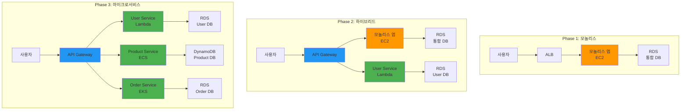

# Week 4 Day 1 Lab 1: 모놀리스에서 마이크로서비스로 전환

<div align="center">

**🏠 모놀리스** • **🏢 마이크로서비스** • **🔄 전환 전략** • **☁️ AWS 구현**

*실제 애플리케이션을 통한 아키텍처 전환 체험*

</div>

---

## 🕘 실습 정보
**시간**: 12:00-13:50 (110분, 점심시간 포함)  
**목표**: 모놀리스 애플리케이션을 마이크로서비스로 단계적 전환  
**방식**: 실제 코드 기반 + AWS 서비스 활용

## 🎯 실습 목표

### 📚 학습 목표
- **아키텍처 비교**: 모놀리스와 마이크로서비스 실제 차이점 체험
- **전환 전략**: Strangler Fig 패턴을 통한 점진적 마이그레이션
- **AWS 구현**: 실제 클라우드 환경에서의 아키텍처 구현
- **성능 측정**: 아키텍처별 성능 특성 비교 분석

### 🛠️ 구현 목표
- 모놀리스 E-Commerce 애플리케이션 배포
- 사용자 서비스를 마이크로서비스로 분리
- API Gateway를 통한 라우팅 구현
- 성능 및 복잡도 비교 분석

---

## 🏗️ 전체 아키텍처



---

## 🛠️ Step 1: 모놀리스 애플리케이션 배포 (25분)

### Step 1-1: 환경 준비 (5분)

**🚀 자동화 스크립트 사용**
```bash
cd theory/week_04/day1/lab_scripts/lab1
./setup-environment.sh
```

**📋 스크립트 내용**: [setup-environment.sh](./lab_scripts/lab1/setup-environment.sh)

**1-1. 수동 실행 (학습용)**
```bash
# AWS CLI 설정 확인
aws sts get-caller-identity

# 필요한 도구 설치 확인
kubectl version --client
docker --version
```

### Step 1-2: 모놀리스 애플리케이션 배포 (15분)

**🚀 자동화 스크립트 사용**
```bash
./deploy-monolith.sh
```

**📋 스크립트 내용**: [deploy-monolith.sh](./lab_scripts/lab1/deploy-monolith.sh)

**1-2. 수동 실행 (학습용)**
```bash
# 모놀리스 애플리케이션 배포
kubectl apply -f manifests/monolith/

# 배포 상태 확인
kubectl get pods -n ecommerce-monolith
kubectl get services -n ecommerce-monolith
```

### Step 1-3: 모놀리스 동작 확인 (5분)

**애플리케이션 테스트**
```bash
# 서비스 엔드포인트 확인
kubectl get svc -n ecommerce-monolith

# 기능 테스트
curl http://<EXTERNAL-IP>/api/users
curl http://<EXTERNAL-IP>/api/products
curl http://<EXTERNAL-IP>/api/orders
```

---

## 🔄 Step 2: 사용자 서비스 분리 (30분)

### Step 2-1: 마이크로서비스 준비 (10분)

**🚀 자동화 스크립트 사용**
```bash
./prepare-microservice.sh user-service
```

**📋 스크립트 내용**: [prepare-microservice.sh](./lab_scripts/lab1/prepare-microservice.sh)

**2-1. 수동 실행 (학습용)**
```bash
# 사용자 서비스용 네임스페이스 생성
kubectl create namespace ecommerce-microservices

# 사용자 서비스 데이터베이스 생성
kubectl apply -f manifests/microservices/user-db.yaml
```

### Step 2-2: API Gateway 설정 (10분)

**🚀 자동화 스크립트 사용**
```bash
./setup-api-gateway.sh
```

**📋 스크립트 내용**: [setup-api-gateway.sh](./lab_scripts/lab1/setup-api-gateway.sh)

**2-2. 수동 실행 (학습용)**
```bash
# Ingress Controller 설치
kubectl apply -f https://raw.githubusercontent.com/kubernetes/ingress-nginx/controller-v1.8.1/deploy/static/provider/cloud/deploy.yaml

# API Gateway 설정
kubectl apply -f manifests/gateway/api-gateway.yaml
```

### Step 2-3: 사용자 서비스 배포 (10분)

**🚀 자동화 스크립트 사용**
```bash
./deploy-user-service.sh
```

**📋 스크립트 내용**: [deploy-user-service.sh](./lab_scripts/lab1/deploy-user-service.sh)

**2-3. 수동 실행 (학습용)**
```bash
# 사용자 마이크로서비스 배포
kubectl apply -f manifests/microservices/user-service.yaml

# 라우팅 규칙 설정
kubectl apply -f manifests/gateway/user-routing.yaml
```

---

## 📊 Step 3: 성능 비교 및 분석 (25분)

### Step 3-1: 부하 테스트 실행 (15분)

**🚀 자동화 스크립트 사용**
```bash
./run-performance-test.sh
```

**📋 스크립트 내용**: [run-performance-test.sh](./lab_scripts/lab1/run-performance-test.sh)

**3-1. 수동 실행 (학습용)**
```bash
# 부하 테스트 도구 설치
kubectl apply -f manifests/testing/load-tester.yaml

# 모놀리스 성능 테스트
kubectl exec -it load-tester -- ab -n 1000 -c 10 http://monolith-service/api/users

# 마이크로서비스 성능 테스트
kubectl exec -it load-tester -- ab -n 1000 -c 10 http://api-gateway/api/users
```

### Step 3-2: 메트릭 수집 및 분석 (10분)

**성능 메트릭 확인**
```bash
# 응답 시간 비교
echo "=== 모놀리스 응답 시간 ==="
kubectl logs -n ecommerce-monolith deployment/monolith-app | grep "response_time"

echo "=== 마이크로서비스 응답 시간 ==="
kubectl logs -n ecommerce-microservices deployment/user-service | grep "response_time"

# 리소스 사용량 확인
kubectl top pods -n ecommerce-monolith
kubectl top pods -n ecommerce-microservices
```

---

## 🔬 Step 4: 아키텍처 분석 및 최적화 (20분)

### Step 4-1: 복잡도 분석 (10분)

**🚀 자동화 스크립트 사용**
```bash
./analyze-architecture.sh
```

**📋 스크립트 내용**: [analyze-architecture.sh](./lab_scripts/lab1/analyze-architecture.sh)

**4-1. 수동 실행 (학습용)**
```bash
# 네트워크 호출 분석
kubectl exec -it network-analyzer -- tcpdump -i eth0 -c 100

# 서비스 의존성 매핑
kubectl get services --all-namespaces -o wide
```

### Step 4-2: 비용 및 운영 복잡도 비교 (10분)

**운영 메트릭 비교**
```bash
# 배포된 리소스 수 비교
echo "=== 모놀리스 리소스 ==="
kubectl get all -n ecommerce-monolith

echo "=== 마이크로서비스 리소스 ==="
kubectl get all -n ecommerce-microservices

# 설정 파일 복잡도 비교
find manifests/monolith/ -name "*.yaml" | wc -l
find manifests/microservices/ -name "*.yaml" | wc -l
```

---

## ✅ 실습 체크포인트

### ✅ 기본 구성 확인
- [ ] 모놀리스 애플리케이션 정상 배포 및 동작
- [ ] 사용자 마이크로서비스 분리 완료
- [ ] API Gateway를 통한 라우팅 동작
- [ ] 두 아키텍처 모두 정상 응답

### ✅ 성능 분석 완료
- [ ] 부하 테스트 실행 및 결과 수집
- [ ] 응답 시간 비교 분석
- [ ] 리소스 사용량 측정
- [ ] 네트워크 오버헤드 확인

### ✅ 아키텍처 이해
- [ ] 모놀리스와 마이크로서비스 차이점 체험
- [ ] 전환 과정의 복잡성 이해
- [ ] 운영 관점에서의 트레이드오프 파악

---

## 🚀 심화 실습 (선택사항)

### 고급 기능 추가
1. **분산 추적**: Jaeger를 이용한 요청 추적
2. **서킷 브레이커**: Hystrix 패턴 구현
3. **카나리 배포**: 점진적 트래픽 전환
4. **모니터링**: Prometheus + Grafana 대시보드

### AWS 네이티브 구현
1. **Lambda 함수**: 서버리스 마이크로서비스
2. **API Gateway**: AWS 관리형 게이트웨이
3. **RDS vs DynamoDB**: 데이터베이스 선택 기준
4. **CloudWatch**: 통합 모니터링

---

## 🧹 실습 정리

**🚀 자동화 정리**
```bash
./cleanup-all.sh
```

**수동 정리**
```bash
# 모든 리소스 삭제
kubectl delete namespace ecommerce-monolith
kubectl delete namespace ecommerce-microservices
kubectl delete namespace ingress-nginx
```

---

## 💡 실습 회고

### 🤝 페어 회고 (10분)
1. **아키텍처 비교**: 모놀리스와 마이크로서비스의 실제 차이점은?
2. **성능 분석**: 예상했던 성능 차이와 실제 결과는?
3. **복잡도**: 어떤 부분에서 복잡도가 증가했나?
4. **실무 적용**: 실제 프로젝트에서는 어떤 선택을 할 것인가?

### 📊 학습 성과
- **실제 체험**: 이론이 아닌 실제 구현을 통한 차이점 이해
- **성능 측정**: 정량적 데이터를 통한 객관적 비교
- **운영 관점**: 개발뿐만 아니라 운영 복잡도까지 고려
- **의사결정**: 상황에 따른 아키텍처 선택 기준 습득

### 🔮 다음 단계
- **Lab 2**: DDD 기반 서비스 분해 실습
- **실무 연계**: 실제 프로젝트에서의 마이그레이션 전략
- **고급 패턴**: Saga, CQRS, Event Sourcing 구현

---

<div align="center">

**🏠→🏢 아키텍처 전환** • **📊 성능 분석** • **🔬 실증적 학습** • **☁️ 클라우드 네이티브**

*이론과 실무를 연결하는 실습 경험*

</div>
