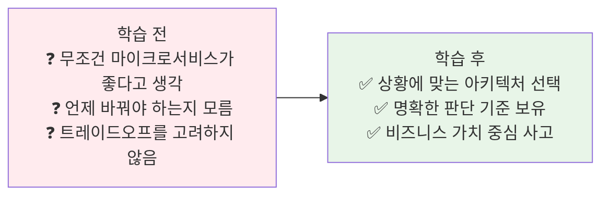
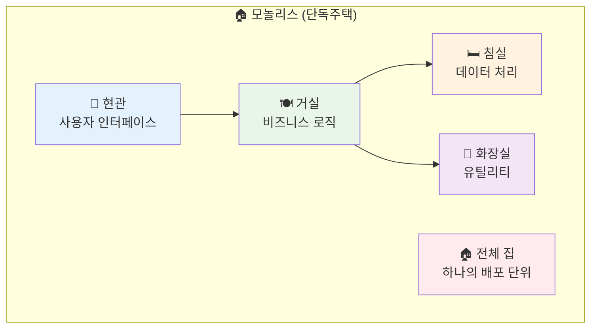
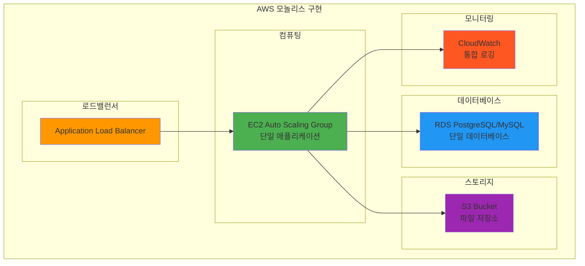
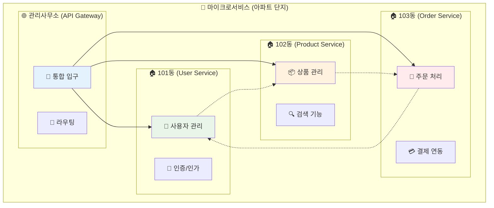
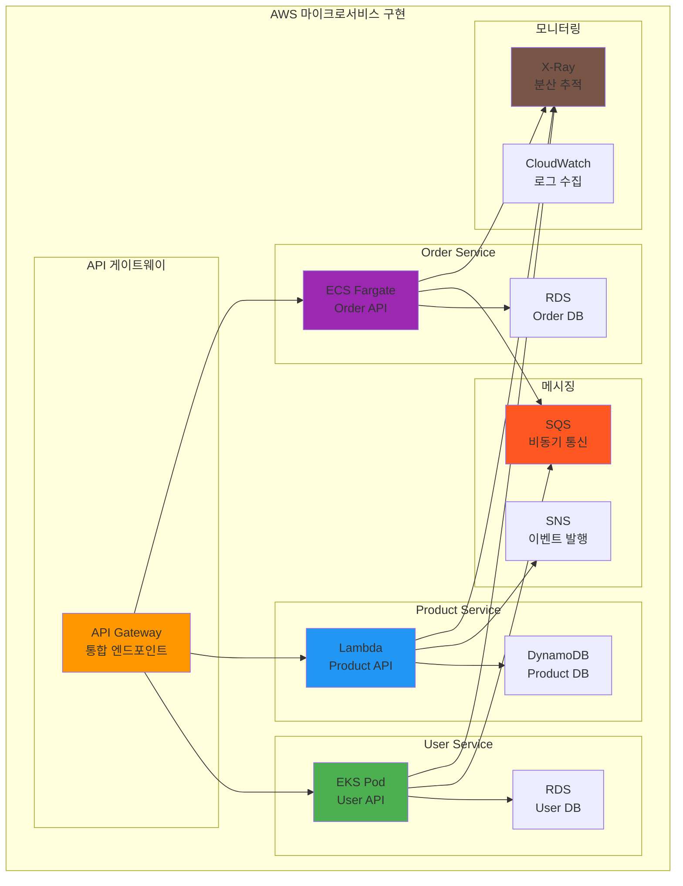
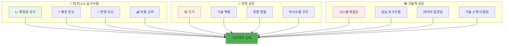
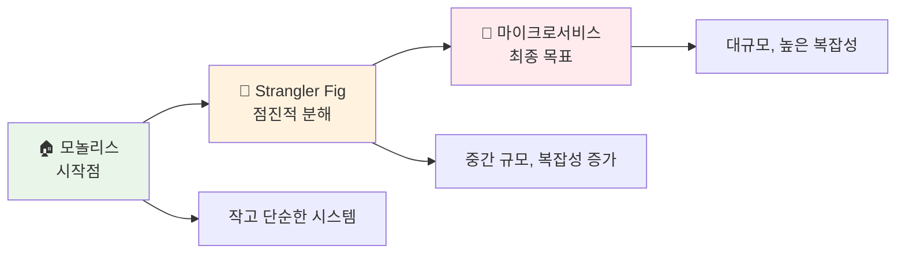
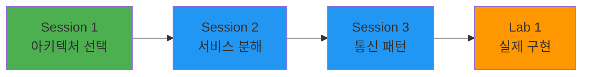

# Week 4 Day 1 Session 1: 마이크로서비스 vs 모놀리스

<div align="center">

**🏗️ 아키텍처 선택** • **⚖️ 트레이드오프** • **🎯 의사결정**

*언제, 왜 마이크로서비스를 선택해야 하는가?*

</div>

---

## 🕘 세션 정보
**시간**: 09:00-09:50 (50분)  
**목표**: 마이크로서비스와 모놀리스의 차이점과 선택 기준 완전 이해  
**방식**: 이론 설명 + 실제 사례 분석 + 페어 토론

## 🎯 세션 목표

### 📚 학습 목표
- **이해 목표**: 마이크로서비스와 모놀리스 아키텍처의 본질적 차이점
- **적용 목표**: 비즈니스 상황에 따른 아키텍처 선택 기준
- **협업 목표**: 팀과 함께 아키텍처 의사결정 과정 체험

### 🤔 왜 필요한가? (5분)

**현실 문제 상황**:
- 💼 **실무 시나리오**: "우리 서비스도 마이크로서비스로 바꿔야 하나요?"
- 🏠 **일상 비유**: 아파트 vs 단독주택 - 각각의 장단점
- ☁️ **AWS 아키텍처**: "EKS + API Gateway + Lambda로 마이크로서비스 구현"
- 📊 **시장 현실**: Netflix, Amazon은 마이크로서비스, 하지만 모든 회사가 그럴 필요는 없다

**학습 전후 비교**:


---

## 📖 핵심 개념 (35분)

### 📐 이론적 배경: Conway's Law와 아키텍처 진화 (3분)

**Conway's Law (1968)**:
> "시스템을 설계하는 조직은 그 조직의 커뮤니케이션 구조를 복사한 설계를 만들어낸다"

**수학적 표현**:
```
Architecture_Complexity ∝ Organization_Communication_Paths
Communication_Paths = n(n-1)/2  (n = 팀 수)
```

**아키텍처 진화 이론**:
- **단일체 → 분산**: 조직 성장에 따른 자연스러운 진화
- **임계점**: 팀 규모 7±2명 (Miller's Rule)
- **분산 시스템 복잡도**: O(n²) vs O(n log n) 트레이드오프

### 🔍 개념 1: 모놀리스 아키텍처 - 하나로 통합된 시스템 (12분)

> **정의**: 모든 기능이 하나의 배포 단위로 구성된 전통적인 아키텍처

**🏠 실생활 비유 - 단독주택**:


**☁️ AWS 모놀리스 아키텍처**:


**🔧 AWS 서비스 매핑**:
- **로드밸런싱** → **ALB**: HTTP/HTTPS 트래픽 분산
- **애플리케이션** → **EC2 Auto Scaling**: 단일 JAR/WAR 파일 배포
- **데이터베이스** → **RDS**: 모든 데이터를 하나의 DB에 저장
- **파일 저장** → **S3**: 정적 파일 및 업로드 파일 관리
- **모니터링** → **CloudWatch**: 애플리케이션 전체 로그 통합 관리

**모놀리스의 특징**:

1. **단일 배포 단위**:
   - 전체 애플리케이션이 하나의 실행 파일
   - 한 번에 전체 시스템 배포
   - 모든 기능이 같은 프로세스에서 실행

2. **공유 데이터베이스**:
   - 하나의 데이터베이스 사용
   - 트랜잭션 관리 용이
   - 데이터 일관성 보장

3. **내부 함수 호출**:
   - 컴포넌트 간 직접 함수 호출
   - 네트워크 오버헤드 없음
   - 빠른 내부 통신

**📊 모놀리스 장점**:
- ✅ **개발 단순성**: 하나의 코드베이스, 간단한 개발 환경
- ✅ **배포 용이성**: 단일 배포 단위로 관리 간편
- ✅ **성능**: 내부 함수 호출로 빠른 통신
- ✅ **트랜잭션**: ACID 트랜잭션 쉽게 구현
- ✅ **디버깅**: 전체 시스템을 한 번에 디버깅 가능

**📐 성능 분석 (이론적)**:
```
모놀리스 통신 비용: O(1) - 메모리 내 함수 호출
- 함수 호출 지연시간: ~1-10 nanoseconds
- 메모리 접근 시간: ~100 nanoseconds
- 캐시 적중률: 95%+ (단일 프로세스)
```

**❌ 모놀리스 단점**:
- ❌ **확장성 제한**: 전체 시스템을 함께 확장해야 함
- ❌ **기술 스택 고정**: 하나의 기술 스택에 종속
- ❌ **팀 확장 어려움**: 여러 팀이 같은 코드베이스 작업 시 충돌
- ❌ **장애 전파**: 한 부분의 오류가 전체 시스템 영향
- ❌ **배포 위험**: 작은 변경도 전체 시스템 재배포

**📊 확장성 한계 (Amdahl's Law 적용)**:
```
Speedup = 1 / ((1-P) + P/N)
P = 병렬화 가능한 부분 비율
N = 프로세서 수

모놀리스 한계: 단일 인스턴스 수직 확장만 가능
이론적 최대 성능 = 하드웨어 물리적 한계
```

### 🔍 개념 2: 마이크로서비스 아키텍처 - 독립적인 서비스들 (12분)

> **정의**: 비즈니스 기능별로 독립적으로 배포 가능한 작은 서비스들의 집합

**🏢 실생활 비유 - 아파트 단지**:


**☁️ AWS 마이크로서비스 아키텍처**:


**🔧 AWS 서비스 매핑**:
- **API 통합** → **API Gateway**: 모든 서비스의 통합 엔드포인트
- **User Service** → **EKS + RDS**: 컨테이너 기반 사용자 관리
- **Product Service** → **Lambda + DynamoDB**: 서버리스 상품 관리
- **Order Service** → **ECS Fargate + RDS**: 컨테이너 기반 주문 처리
- **서비스 통신** → **SQS/SNS**: 비동기 메시징 및 이벤트 처리
- **분산 추적** → **X-Ray**: 마이크로서비스 간 요청 추적

**마이크로서비스의 특징**:

**📐 분산 시스템 이론 적용**:
```
CAP 정리 (Brewer's Theorem):
- Consistency (일관성)
- Availability (가용성)  
- Partition tolerance (분할 내성)

마이크로서비스 = AP 시스템 (최종 일관성 선택)
```

1. **독립적 배포**:
   - 각 서비스별 독립적 배포 가능
   - 서비스별 다른 배포 주기
   - 장애 격리 및 빠른 복구

**📊 장애 격리 수학적 모델**:
```
전체 시스템 가용성 = ∏(개별 서비스 가용성)
모놀리스: 99.9% (단일 장애점)
마이크로서비스: 99.9%^n (n개 서비스, 하지만 Circuit Breaker로 보완)
```

2. **기술 다양성**:
   - 서비스별 최적 기술 스택 선택
   - 언어, 데이터베이스, 프레임워크 자유 선택
   - 기술 실험 및 혁신 용이

**🔬 네트워크 통신 오버헤드 분석**:
```
마이크로서비스 통신 비용:
- 네트워크 지연시간: 0.1-10ms (동일 AZ)
- 직렬화/역직렬화: 0.1-1ms
- HTTP/gRPC 오버헤드: 10-100μs

총 통신 비용: 모놀리스 대비 100-1000배 증가
```

3. **팀 자율성**:
   - 서비스별 전담 팀 구성
   - 팀별 독립적 의사결정
   - Conway's Law 활용

**📊 마이크로서비스 장점**:
- ✅ **독립적 확장**: 필요한 서비스만 선택적 확장
- ✅ **기술 자유도**: 서비스별 최적 기술 스택 선택
- ✅ **팀 자율성**: 작은 팀이 독립적으로 개발
- ✅ **장애 격리**: 한 서비스 장애가 전체에 영향 최소화
- ✅ **빠른 배포**: 작은 단위의 빠른 배포 가능

**❌ 마이크로서비스 단점**:
- ❌ **복잡성 증가**: 분산 시스템의 복잡성
- ❌ **네트워크 오버헤드**: 서비스 간 네트워크 통신 비용
- ❌ **데이터 일관성**: 분산 트랜잭션 관리 어려움
- ❌ **운영 복잡성**: 여러 서비스 모니터링 및 관리
- ❌ **초기 오버헤드**: 인프라 구축 비용 증가

### 🔍 개념 3: 아키텍처 선택 기준 - 언제, 왜 선택하는가? (11분)

> **정의**: 비즈니스 상황, 팀 규모, 기술적 요구사항에 따른 아키텍처 의사결정 프레임워크

**⚖️ 의사결정 매트릭스**:


**📊 선택 기준표**:

| 요소 | 모놀리스 선택 | 마이크로서비스 선택 |
|------|---------------|---------------------|
| **팀 크기** | 5-10명 이하 | 10명 이상 다중 팀 |
| **시스템 복잡도** | 단순-중간 | 복잡한 도메인 |
| **배포 빈도** | 주/월 단위 | 일/시간 단위 |
| **확장 요구** | 균등한 확장 | 선택적 확장 필요 |
| **기술 역량** | 제한적 | 높은 DevOps 역량 |
| **데이터 일관성** | 강한 일관성 필요 | 최종 일관성 허용 |
| **초기 비용** | 낮음 | 높음 |
| **운영 복잡성** | 낮음 | 높음 |

**🚀 실제 기업 사례**:

**모놀리스 성공 사례**:
- **Shopify**: 수십억 달러 거래를 모놀리스로 처리
- **GitHub**: 대부분의 기능을 모놀리스로 운영
- **Basecamp**: 간단하고 효율적인 모놀리스 아키텍처

**마이크로서비스 성공 사례**:
- **Netflix**: 700개 이상의 마이크로서비스
- **Amazon**: 서비스별 독립적인 팀과 배포
- **Uber**: 지역별, 기능별 독립적 서비스

**🎯 마이그레이션 전략**:


**📈 진화 경로**:
1. **Phase 1**: 모놀리스로 시작 (MVP, 빠른 검증)
2. **Phase 2**: 모듈화된 모놀리스 (경계 명확화)
3. **Phase 3**: 하이브리드 (핵심 기능만 분리)
4. **Phase 4**: 완전한 마이크로서비스 (필요시)

---

## 💭 함께 생각해보기 (10분)

### 🤝 페어 토론 (7분)
**토론 주제**:
1. **현실 적용**: "여러분이 스타트업을 창업한다면 어떤 아키텍처를 선택하시겠어요?"
2. **사례 분석**: "Netflix가 마이크로서비스를 선택한 이유는 무엇일까요?"
3. **의사결정**: "모놀리스에서 마이크로서비스로 전환하는 시점은 언제일까요?"

**페어 활동 가이드**:
- 👥 **역할 분담**: 한 명은 모놀리스 옹호, 다른 한 명은 마이크로서비스 옹호
- 🎯 **시나리오 기반**: 구체적인 비즈니스 상황 가정
- 📊 **근거 제시**: 선택 이유를 명확한 기준으로 설명

### 🎯 전체 공유 (3분)
- **인사이트 공유**: 페어 토론에서 나온 흥미로운 관점
- **질문 수집**: 아직 궁금한 점들 정리
- **다음 연결**: Session 2 서비스 분해 전략과의 연결고리

---

## 🔑 핵심 키워드 정리

### 🆕 새로운 용어
- **모놀리스(Monolith)**: 단일 배포 단위의 통합 아키텍처
- **마이크로서비스(Microservices)**: 독립적으로 배포 가능한 작은 서비스들
- **Conway's Law**: 조직 구조가 시스템 아키텍처에 반영되는 법칙
- **Strangler Fig Pattern**: 기존 시스템을 점진적으로 대체하는 패턴
- **분산 시스템(Distributed System)**: 네트워크로 연결된 독립적 컴포넌트들
- **서비스 경계(Service Boundary)**: 마이크로서비스 간의 논리적 분리선

### 🔤 중요 개념
- **트레이드오프(Trade-off)**: 장단점을 고려한 균형적 선택
- **확장성(Scalability)**: 시스템이 증가하는 부하를 처리하는 능력
- **장애 격리(Fault Isolation)**: 한 부분의 장애가 전체에 미치는 영향 최소화
- **기술 다양성(Technology Diversity)**: 서비스별 최적 기술 스택 선택

---

## 📊 이해도 체크

### 💡 즉석 퀴즈
1. **Q**: 모놀리스의 가장 큰 장점은?
   **A**: 개발과 배포의 단순성, 트랜잭션 관리 용이성

2. **Q**: 마이크로서비스를 선택해야 하는 상황은?
   **A**: 대규모 팀, 빈번한 배포, 선택적 확장 필요 시

3. **Q**: Conway's Law란?
   **A**: 조직의 의사소통 구조가 시스템 아키텍처에 반영된다는 법칙

### ✅ 이해도 확인 질문
- "모놀리스와 마이크로서비스의 핵심 차이점을 설명할 수 있나요?"
- "우리 회사 상황에서 어떤 아키텍처가 적합한지 판단할 수 있나요?"
- "아키텍처 선택 시 고려해야 할 요소들을 나열할 수 있나요?"

---

## 🎯 다음 세션 연결

### 📚 Session 2 준비
이제 아키텍처 선택 기준을 이해했으니, Session 2에서는:
- **서비스 분해 전략**: 모놀리스를 어떻게 마이크로서비스로 나눌 것인가
- **Domain-Driven Design**: 비즈니스 도메인 기반 서비스 경계 설정
- **실제 분해 실습**: 구체적인 E-Commerce 시스템 분해

### 🔗 학습 연결고리


---

## 📝 세션 마무리

### ✅ 오늘 Session 1 성과
- [ ] **아키텍처 이해**: 모놀리스와 마이크로서비스의 본질적 차이점 파악
- [ ] **선택 기준**: 상황에 맞는 아키텍처 선택 기준 습득
- [ ] **실무 연계**: 실제 기업 사례를 통한 현실적 이해
- [ ] **의사결정 능력**: 트레이드오프를 고려한 균형적 판단력

### 🎯 다음 학습 준비
- **호기심**: 실제로 어떻게 서비스를 나누는지 궁금해질 것
- **실무 적용**: 현재 회사나 프로젝트에 어떻게 적용할지 고민
- **기술적 깊이**: DDD와 서비스 분해 전략에 대한 관심 증가

---

<div align="center">

**🏗️ 아키텍처 선택 마스터** • **⚖️ 트레이드오프 이해** • **🎯 의사결정 능력**

*이제 상황에 맞는 최적의 아키텍처를 선택할 수 있습니다!*

</div>
