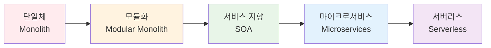
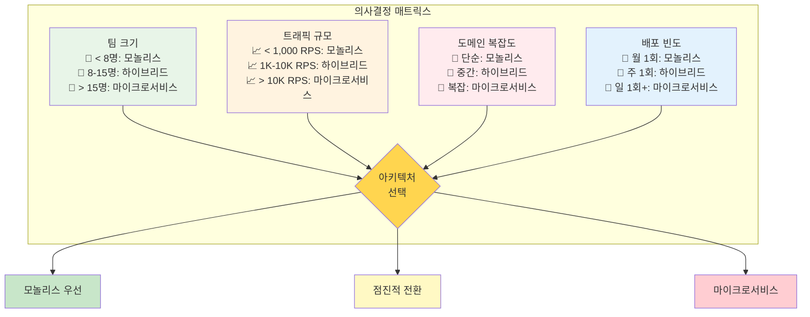
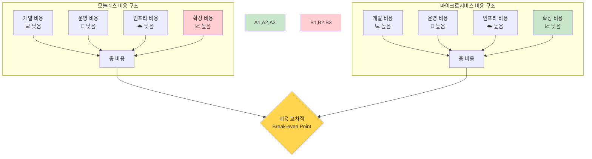
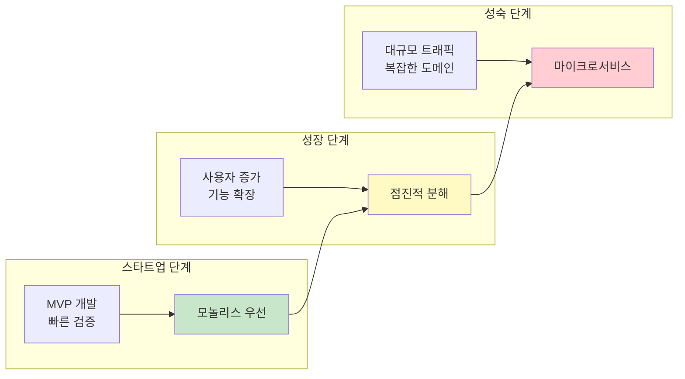
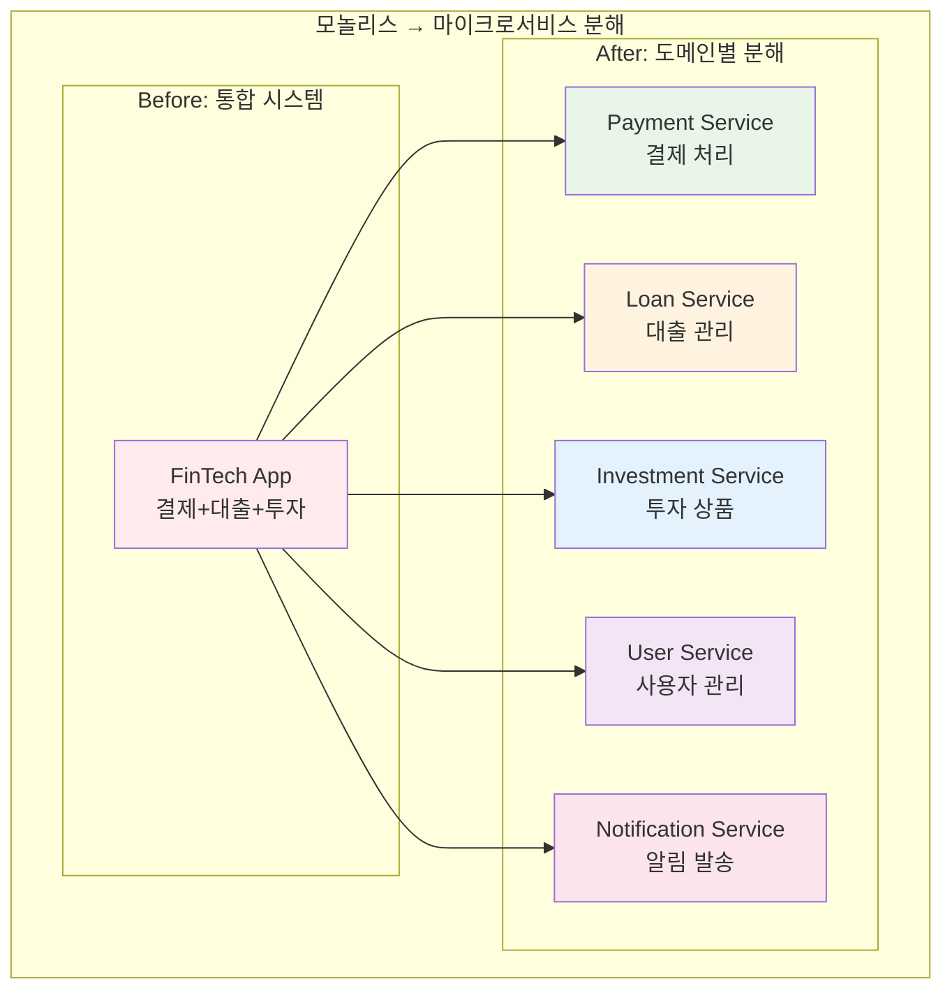

# Week 4 Day 1 Session 1: 마이크로서비스 vs 모놀리스 - 의사결정 프레임워크 (개선 버전)

<div align="center">

**🏗️ 아키텍처 선택** • **📊 정량적 판단** • **💰 ROI 분석** • **🎯 의사결정**

*정량적 기준으로 언제, 왜 마이크로서비스를 선택해야 하는가?*

</div>

---

## 🕘 세션 정보
**시간**: 09:00-09:45 (45분, 5분 단축)  
**목표**: 정량적 기준 기반 아키텍처 의사결정 역량 습득  
**방식**: 이론 설명 + 의사결정 매트릭스 실습 + ROI 계산

## 🎯 세션 목표

### 📚 학습 목표
- **정량적 판단**: 팀 크기, 트래픽, 복잡도 기반 아키텍처 선택
- **ROI 분석**: 마이크로서비스 전환의 비용 대비 효과 계산
- **의사결정 프레임워크**: 체계적인 아키텍처 선택 방법론

### 🤔 왜 필요한가? (3분)

**현실 문제 상황**:
- 💼 **실무 딜레마**: "우리도 Netflix처럼 마이크로서비스 해야 하나요?"
- 📊 **잘못된 선택 비용**: Segment는 마이크로서비스에서 모놀리스로 되돌아감 (개발 속도 3배 향상)
- 💰 **비용 폭증**: 무분별한 마이크로서비스로 인프라 비용 10배 증가 사례
- ⚖️ **트레이드오프 무시**: 장점만 보고 단점을 간과하는 실수

---

## 📖 이론적 기반과 핵심 개념 (25분)

### 📐 소프트웨어 아키텍처 진화론 (8분)

**소프트웨어 복잡도 이론 (Software Complexity Theory)**:
```
복잡도 = f(컴포넌트 수, 상호작용 수, 변경 빈도)

Brooks의 법칙 (1975):
- Essential Complexity: 문제 자체의 본질적 복잡도
- Accidental Complexity: 해결 방법으로 인한 부수적 복잡도

목표: Essential Complexity는 유지하되, Accidental Complexity 최소화
```

**Conway's Law (1968) - 조직과 아키텍처의 상관관계**:
> "시스템을 설계하는 조직은 그 조직의 커뮤니케이션 구조를 복사한 설계를 만들어낸다"

**수학적 표현**:
```
Architecture_Complexity ∝ Organization_Communication_Paths
Communication_Paths = n(n-1)/2  (n = 팀 수)

예시:
- 4개 팀 → 6개 통신 경로 → 복잡한 아키텍처
- 2개 팀 → 1개 통신 경로 → 단순한 아키텍처
```

**아키텍처 진화 단계**:


### 🔍 모놀리스 vs 마이크로서비스 - 이론적 비교 (12분)

**1. 응집도와 결합도 관점**:
```
모놀리스:
- High Cohesion: 관련 기능들이 물리적으로 가까이 위치
- High Coupling: 모든 컴포넌트가 같은 프로세스 공간
- 함수 호출로 직접 통신 (낮은 통신 비용)

마이크로서비스:
- Bounded Cohesion: 도메인별 응집도
- Low Coupling: 서비스 간 독립성
- 네트워크 통신 (높은 통신 비용)
```

**2. CAP 정리 적용**:
```
모놀리스 (CA 선택):
- Consistency: ACID 트랜잭션으로 강한 일관성
- Availability: 단일 장애점으로 가용성 제한
- Partition tolerance: 분산 환경 고려 안함

마이크로서비스 (AP 선택):
- Consistency: Eventual Consistency (최종 일관성)
- Availability: 서비스별 독립적 가용성
- Partition tolerance: 네트워크 분할 허용
```

**3. 확장성 이론**:
```
모놀리스 확장:
- Vertical Scaling: CPU, Memory 증가 (비용 O(n²))
- Horizontal Scaling: 전체 애플리케이션 복제

마이크로서비스 확장:
- Service-specific Scaling: 필요한 서비스만 확장
- 비용 효율성: O(n log n)
- 기술 다양성: 서비스별 최적 기술 선택
```

**4. 장애 전파 모델**:
```
모놀리스:
- Blast Radius = 100% (전체 시스템)
- 단일 장애점 (Single Point of Failure)
- 복구 시간 = 전체 시스템 재시작

마이크로서비스:
- Blast Radius = 1/n (서비스 수에 반비례)
- 장애 격리 (Fault Isolation)
- 부분적 성능 저하 (Graceful Degradation)
```

### 🔍 의사결정 이론 적용 (5분)

**Multi-Criteria Decision Analysis (MCDA)**:
```
아키텍처 선택 = f(비즈니스 요구사항, 기술적 제약, 조직 역량)

평가 기준:
1. 개발 속도 (Time to Market)
2. 확장성 (Scalability)
3. 운영 복잡도 (Operational Complexity)
4. 팀 생산성 (Team Productivity)
5. 기술 부채 (Technical Debt)
```

**임계점 이론 (Tipping Point Theory)**:
```
아키텍처 전환의 임계점:
- 팀 크기: 8-12명 (Dunbar's Number)
- 코드베이스: 100K-500K LOC
- 배포 빈도: 주 1회 → 일 1회 요구
- 장애 복구: 1시간 → 15분 요구

Hysteresis Effect:
전환 비용으로 인한 지연 현상
임계점 도달 후에도 기존 아키텍처 유지 경향
```

---

## 📊 정량적 의사결정 매트릭스 (12분)

### 🔢 핵심 판단 기준



### 📋 의사결정 체크리스트

**모놀리스를 선택해야 하는 경우**:
- [ ] 팀 크기 8명 미만
- [ ] 트래픽 1,000 RPS 미만
- [ ] 단순한 CRUD 애플리케이션
- [ ] 빠른 MVP 개발 필요
- [ ] 제한된 운영 인력

**마이크로서비스를 고려해야 하는 경우**:
- [ ] 팀 크기 15명 이상
- [ ] 트래픽 10,000 RPS 이상
- [ ] 복잡한 비즈니스 로직
- [ ] 독립적 배포 필요
- [ ] 다양한 기술 스택 활용

---

## 💰 ROI 분석 프레임워크 (12분)

### 📊 비용 구조 분석



### 💡 실제 기업 ROI 사례

**Netflix 사례**:
- **전환 비용**: 7년간 $100M+ 투자
- **운영 효율**: 배포 시간 6시간 → 16분 (95% 단축)
- **확장성**: 1억 사용자 → 2억 사용자 (인프라 비용 선형 증가)
- **ROI**: 3년 후 투자 회수, 이후 연간 30% 비용 절감

**Segment 역전환 사례**:
- **문제**: 마이크로서비스로 개발 속도 70% 감소
- **해결**: 모놀리스 복귀로 개발 속도 3배 향상
- **교훈**: 팀 크기 < 10명일 때는 모놀리스가 효율적

### 🧮 ROI 계산 공식

```
ROI = (이익 - 투자비용) / 투자비용 × 100

이익 = 개발 속도 향상 + 운영 효율성 + 확장성 가치
투자비용 = 초기 개발 + 인프라 + 운영 + 교육 비용
```

**실습 예제**:
- 현재 모놀리스: 월 개발비 $50K, 인프라 $10K
- 마이크로서비스 전환: 초기 투자 $500K, 월 운영비 $80K
- 예상 이익: 배포 속도 2배, 장애 복구 시간 50% 단축
- Break-even Point: 18개월

---

## ⚖️ 트레이드오프 분석 (10분)

### 📈 아키텍처별 특성 비교

| 특성 | 모놀리스 | 마이크로서비스 | 승자 |
|------|----------|----------------|------|
| **개발 속도** (초기) | ⭐⭐⭐⭐⭐ | ⭐⭐ | 🏆 모놀리스 |
| **개발 속도** (장기) | ⭐⭐ | ⭐⭐⭐⭐ | 🏆 마이크로서비스 |
| **운영 복잡도** | ⭐⭐ | ⭐⭐⭐⭐⭐ | 🏆 모놀리스 |
| **확장성** | ⭐⭐ | ⭐⭐⭐⭐⭐ | 🏆 마이크로서비스 |
| **장애 격리** | ⭐ | ⭐⭐⭐⭐⭐ | 🏆 마이크로서비스 |
| **데이터 일관성** | ⭐⭐⭐⭐⭐ | ⭐⭐ | 🏆 모놀리스 |
| **테스트 복잡도** | ⭐⭐ | ⭐⭐⭐⭐ | 🏆 모놀리스 |
| **기술 다양성** | ⭐ | ⭐⭐⭐⭐⭐ | 🏆 마이크로서비스 |

### 🎯 상황별 최적 선택



---

## 🛠️ 실습: 의사결정 매트릭스 적용 + 간단한 분해 체험 (8분)

### 📋 시나리오 기반 실습 (5분)

**시나리오 1: 핀테크 스타트업**
- 팀 크기: 12명 (개발 8명, 운영 2명, 기획 2명)
- 예상 트래픽: 5,000 RPS (피크 시간)
- 도메인: 결제, 대출, 투자 (중간 복잡도)
- 배포 빈도: 주 2-3회
- **결정**: ?

**시나리오 2: 대기업 내부 시스템**
- 팀 크기: 25명 (여러 팀 협업)
- 예상 트래픽: 500 RPS (내부 사용자)
- 도메인: HR, 회계, 구매 (높은 복잡도)
- 배포 빈도: 월 1회
- **결정**: ?

### 🔍 간단한 분해 체험 (3분)

**"만약 마이크로서비스를 선택한다면?"**

**핀테크 스타트업 분해 예시**:


**분해 기준 (간단 버전)**:
1. **비즈니스 기능**: 결제, 대출, 투자는 서로 다른 도메인
2. **팀 구조**: 각 도메인별로 2-3명씩 담당 가능
3. **변경 빈도**: 결제는 자주 변경, 투자는 상대적으로 안정적
4. **데이터 특성**: 각각 다른 데이터베이스 기술 최적

**💡 핵심 인사이트**:
- **"완벽한 분해는 없다"**: 비즈니스 변화에 따라 지속적 조정
- **"점진적 접근"**: 한 번에 모든 것을 나누지 말고 단계적 분해
- **"팀 역량 고려"**: 운영할 수 있는 수준에서 시작

### 🤝 페어 토론 (5분)
1. **각 시나리오의 최적 아키텍처는?**
2. **만약 마이크로서비스로 간다면 어떻게 나눌 것인가?**
3. **분해 시 가장 어려운 부분은 무엇일까?**
4. **Session 2에서 더 자세히 배우고 싶은 것은?**

**💭 Session 2 예고**:
> "다음 시간에는 Domain-Driven Design으로 더 체계적이고 정확한 서비스 분해 방법을 배워보겠습니다!"

---

## 🔑 핵심 키워드

- **Conway's Law**: 조직 구조가 시스템 아키텍처를 결정
- **Break-even Point**: 마이크로서비스 투자 회수 시점
- **Distributed Monolith**: 잘못 설계된 마이크로서비스의 안티패턴
- **Strangler Fig Pattern**: 점진적 마이크로서비스 전환 전략
- **Two Pizza Team**: Amazon의 팀 크기 원칙 (8명 이하)

---

## 📝 세션 마무리

### ✅ 오늘 세션 성과
- [ ] **정량적 판단 기준** 습득: 팀 크기, 트래픽, 복잡도 기반 선택
- [ ] **ROI 분석 능력** 확보: 비용 대비 효과 계산 방법
- [ ] **의사결정 프레임워크** 이해: 체계적 아키텍처 선택 과정
- [ ] **실무 사례** 학습: Netflix, Segment 등 실제 기업 경험

### 🎯 다음 세션 준비
- **Domain-Driven Design**: 체계적인 서비스 분해 방법론
- **Bounded Context**: 정확한 서비스 경계 설정 기법
- **실습 준비**: 실제 E-Commerce 도메인 분해 체험

### 💡 실무 적용 팁
1. **단계적 접근**: 모놀리스 → 하이브리드 → 마이크로서비스
2. **비용 모니터링**: 전환 과정에서 지속적인 ROI 측정
3. **팀 역량 고려**: 운영 능력에 맞는 아키텍처 선택
4. **비즈니스 가치 우선**: 기술적 멋보다 비즈니스 목표 중심

**🔮 Session 2 연결고리**:
> "오늘은 '언제' 마이크로서비스를 선택할지 배웠다면, 다음 시간에는 '어떻게' 정확하게 나누는지 Domain-Driven Design으로 배워보겠습니다!"

---

<div align="center">

**📊 데이터 기반 의사결정** • **💰 비용 효율성** • **⚖️ 균형잡힌 판단** • **🎯 실무 적용**

*정량적 기준으로 올바른 아키텍처 선택하기*

</div>
