# Week 4 Day 1 Session 2: 서비스 분해 전략 - Domain-Driven Design

<div align="center">

**🎯 도메인 모델링** • **✂️ 서비스 분해** • **🏗️ 경계 설정**

*Domain-Driven Design으로 마이크로서비스 경계 정의하기*

</div>

---

## 🕘 세션 정보
**시간**: 10:00-10:50 (50분)  
**목표**: DDD 기반 서비스 분해 전략과 경계 설정 방법 완전 이해  
**방식**: 이론 설명 + 실제 도메인 모델링 + 팀 워크샵

## 🎯 세션 목표

### 📚 학습 목표
- **이해 목표**: Domain-Driven Design의 핵심 개념과 서비스 분해 원칙
- **적용 목표**: 실제 비즈니스 도메인을 마이크로서비스로 분해하는 능력
- **협업 목표**: 팀과 함께 도메인 모델링 및 서비스 경계 설정

### 🤔 왜 필요한가? (5분)

**현실 문제 상황**:
- 💼 **실무 시나리오**: "어떻게 서비스를 나눠야 할지 모르겠어요"
- 🧩 **일상 비유**: 퍼즐 조각 맞추기 - 올바른 경계가 중요
- ☁️ **AWS 아키텍처**: "DDD + EKS Namespace + API Gateway로 서비스 경계 구현"
- 📊 **실패 사례**: 잘못된 서비스 분해로 인한 분산 모놀리스

**학습 전후 비교**:
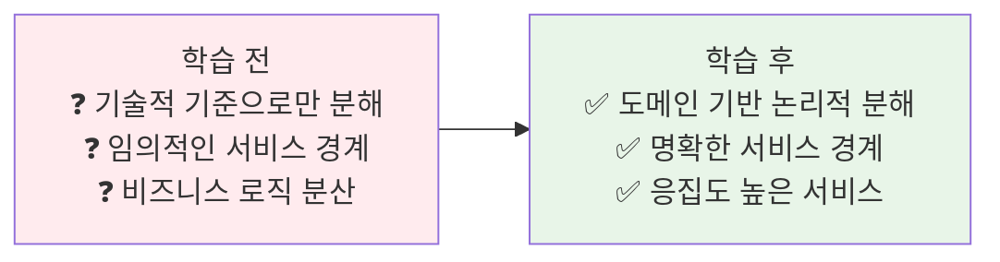

---

## 📖 핵심 개념 (35분)

### 📐 이론적 배경: 복잡성 이론과 모듈화 (3분)

**복잡성 이론 (Complexity Theory)**:
```
시스템 복잡도 = f(컴포넌트 수, 상호작용 수)
Essential Complexity vs Accidental Complexity (Fred Brooks)

모듈화 원칙:
- High Cohesion (높은 응집도): 관련 기능들의 집중
- Low Coupling (낮은 결합도): 모듈 간 의존성 최소화
```

**정보 은닉 이론 (David Parnas, 1972)**:
```
모듈 분해 기준:
1. 변경 가능성에 따른 분해
2. 설계 결정의 은닉
3. 인터페이스를 통한 추상화

DDD = 정보 은닉 + 도메인 지식의 체계적 적용
```

### 🔍 개념 1: Domain-Driven Design 기초 (12분)

> **정의**: 복잡한 소프트웨어의 핵심을 도메인과 도메인 로직에 집중하여 설계하는 방법론

**🏢 실생활 비유 - 백화점 구조**:
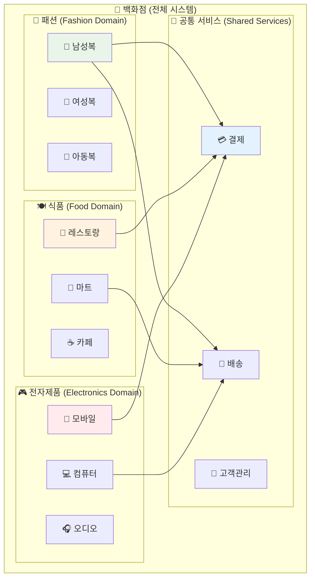

**DDD 핵심 개념**:

**📐 수학적 모델링**:
```
Domain = {Entities, Value Objects, Aggregates, Services}
Bounded Context = Domain ∩ Language ∩ Team

Context Mapping 관계:
- Shared Kernel: BC₁ ∩ BC₂ ≠ ∅
- Customer-Supplier: BC₁ → BC₂ (단방향 의존)
- Conformist: BC₁ ⊆ BC₂ (완전 종속)
```

1. **도메인(Domain)**:
   - 비즈니스 영역의 지식과 활동
   - 해결하고자 하는 문제 공간
   - 전문가의 지식이 집약된 영역

**🔬 인지 과학적 접근**:
```
도메인 모델링 = 인간의 인지 구조 모방
- 청킹(Chunking): 관련 정보의 그룹화
- 추상화(Abstraction): 핵심 개념 추출
- 패턴 인식(Pattern Recognition): 반복되는 구조 식별
```

2. **바운디드 컨텍스트(Bounded Context)**:
   - 도메인 모델이 적용되는 경계
   - 같은 용어가 다른 의미를 가질 수 있는 범위
   - 마이크로서비스의 논리적 경계

**📊 경계 설정 알고리즘**:
```
응집도 측정: Cohesion(C) = Σ(intra-module connections) / total connections
결합도 측정: Coupling(C) = Σ(inter-module connections) / total connections

최적 경계: max(Cohesion) ∧ min(Coupling)
```

3. **유비쿼터스 언어(Ubiquitous Language)**:
   - 도메인 전문가와 개발자가 공유하는 공통 언어
   - 코드와 대화에서 동일한 용어 사용
   - 오해와 소통 오류 최소화

**📊 DDD 전략적 설계**:
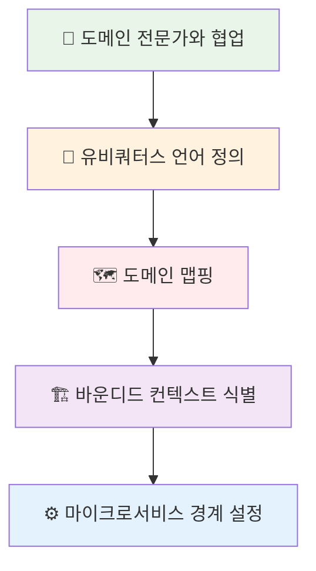

**☁️ AWS DDD 구현 아키텍처**:
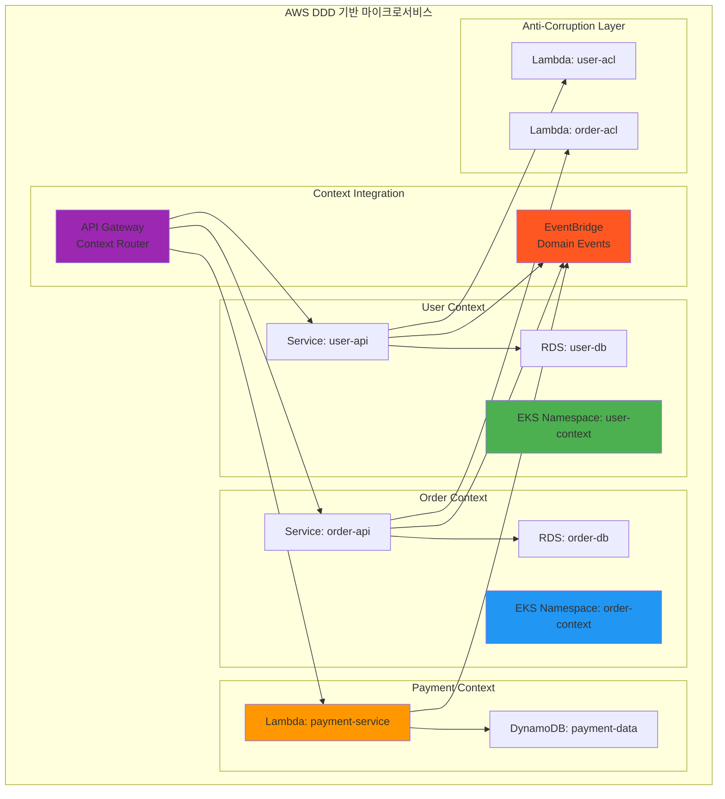

**🔧 AWS DDD 서비스 매핑**:
- **Bounded Context** → **EKS Namespace**: 컨텍스트별 격리된 환경
- **Domain Service** → **Kubernetes Service**: 도메인 로직 캡슐화
- **Aggregate** → **RDS/DynamoDB**: 데이터 일관성 경계
- **Domain Events** → **EventBridge**: 컨텍스트 간 이벤트 통신
- **Anti-Corruption Layer** → **Lambda**: 외부 시스템 격리 계층
- **Context Map** → **API Gateway**: 컨텍스트 간 통신 라우팅

### 🔍 개념 2: 서비스 분해 패턴과 전략 (12분)

> **정의**: 모놀리스를 마이크로서비스로 분해하는 체계적인 방법과 패턴들

**✂️ 분해 전략 비교**:

| 분해 기준 | 설명 | 장점 | 단점 | 적용 상황 |
|-----------|------|------|------|-----------|
| **비즈니스 기능** | 도메인별 분해 | 높은 응집도 | 초기 분석 복잡 | 명확한 도메인 |
| **데이터** | 데이터 소유권 기준 | 데이터 일관성 | 트랜잭션 복잡 | 데이터 중심 시스템 |
| **트랜잭션** | 트랜잭션 경계 기준 | 일관성 보장 | 성능 제약 | 금융, 결제 시스템 |
| **팀 구조** | Conway's Law 활용 | 팀 자율성 | 기술적 최적화 제한 | 대규모 조직 |

**🎯 분해 패턴들**:

**1. Decompose by Business Capability**:
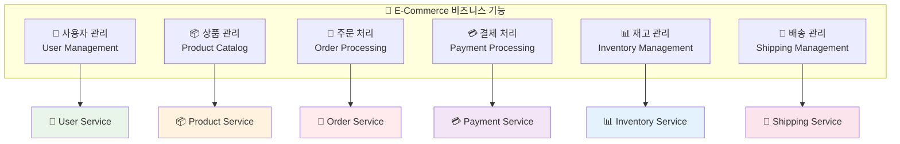

**2. Decompose by Data**:
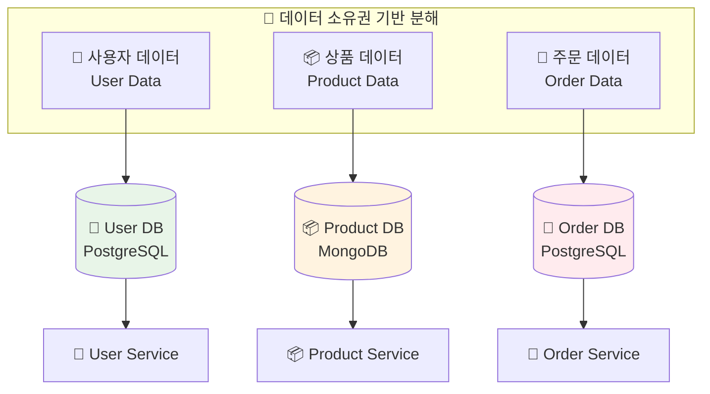

**🚨 안티패턴 - 피해야 할 분해 방식**:

**❌ 기술 계층별 분해**:
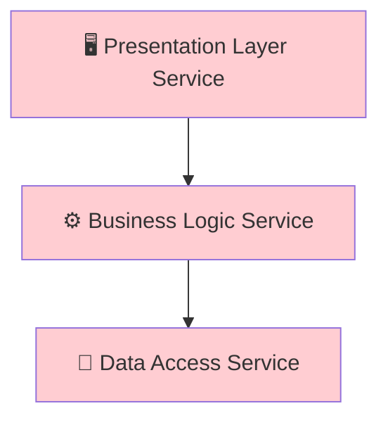
*문제점: 모든 기능 변경 시 3개 서비스 모두 수정 필요*

**❌ 데이터베이스 테이블별 분해**:
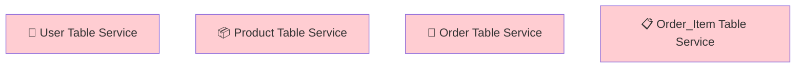
*문제점: 비즈니스 로직이 여러 서비스에 분산*

### 🔍 개념 3: 실제 분해 실습 - E-Commerce 시스템 (11분)

> **정의**: CloudMart E-Commerce 시스템을 DDD 원칙에 따라 마이크로서비스로 분해

**🛒 CloudMart 도메인 분석**:

**1단계: 도메인 전문가 인터뷰 결과**
```
핵심 비즈니스 프로세스:
1. 고객이 상품을 검색하고 선택한다
2. 장바구니에 담고 주문을 생성한다
3. 결제를 진행하고 주문을 확정한다
4. 재고를 확인하고 상품을 준비한다
5. 배송을 시작하고 고객에게 알림을 보낸다
6. 고객이 상품을 받고 리뷰를 작성한다
```

**2단계: 바운디드 컨텍스트 식별**:
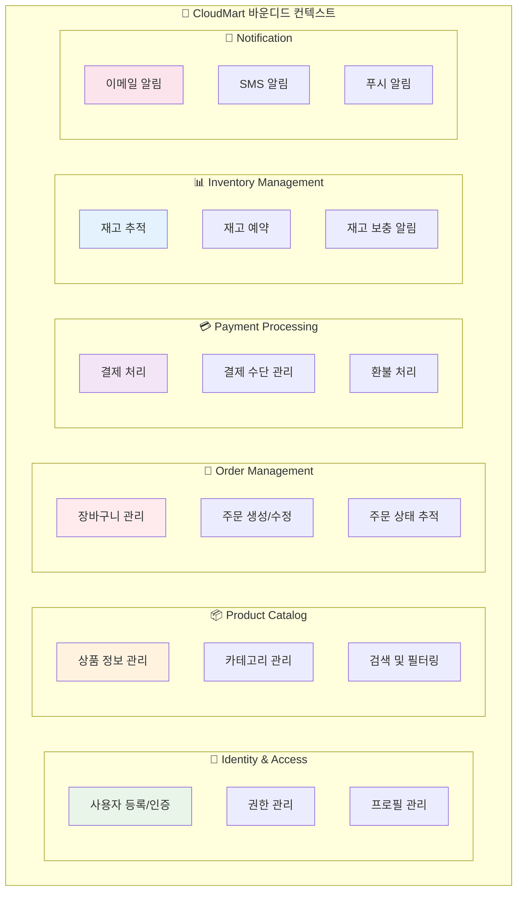

**3단계: 서비스 경계 및 API 설계**:

**👤 User Service**:
```yaml
책임:
  - 사용자 등록, 인증, 인가
  - 프로필 관리
  - 사용자 기본 정보 제공

API:
  - POST /users (회원가입)
  - POST /auth/login (로그인)
  - GET /users/{id} (프로필 조회)
  - PUT /users/{id} (프로필 수정)

데이터:
  - User: id, email, name, phone, address
  - UserCredential: userId, hashedPassword
```

**📦 Product Service**:
```yaml
책임:
  - 상품 카탈로그 관리
  - 검색 및 필터링
  - 카테고리 관리

API:
  - GET /products (상품 목록)
  - GET /products/{id} (상품 상세)
  - GET /products/search (상품 검색)
  - GET /categories (카테고리 목록)

데이터:
  - Product: id, name, description, price, categoryId
  - Category: id, name, parentId
```

**🛒 Order Service**:
```yaml
책임:
  - 주문 생성 및 관리
  - 장바구니 기능
  - 주문 상태 추적

API:
  - POST /orders (주문 생성)
  - GET /orders/{id} (주문 조회)
  - PUT /orders/{id}/status (상태 변경)
  - POST /cart/items (장바구니 추가)

데이터:
  - Order: id, userId, status, totalAmount, createdAt
  - OrderItem: orderId, productId, quantity, price
  - Cart: userId, items[]
```

**4단계: 서비스 간 통신 설계**:
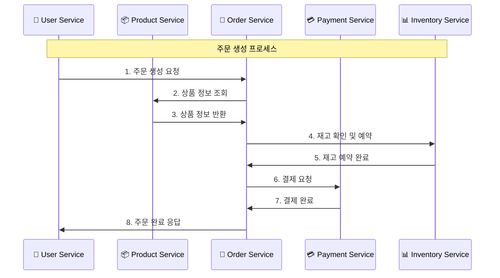

---

## 💭 함께 생각해보기 (10분)

### 🤝 팀 워크샵 (7분)
**워크샵 주제**: "우리만의 E-Commerce 서비스 분해하기"

**활동 내용**:
1. **도메인 정의** (2분): 팀별로 특화된 E-Commerce 도메인 선택
   - 예: 패션몰, 도서쇼핑몰, 식품배달, 중고거래 등

2. **바운디드 컨텍스트 식별** (3분): 선택한 도메인의 핵심 비즈니스 기능 도출

3. **서비스 경계 설정** (2분): 마이크로서비스 후보 식별 및 책임 정의

**팀 구성**:
- 👥 **3-4명씩 팀 구성**
- 🎯 **역할 분담**: 도메인 전문가, 아키텍트, 개발자, 운영자

### 🎯 전체 공유 (3분)
- **팀별 발표**: 각 팀의 서비스 분해 결과 간단 발표 (1분씩)
- **피드백**: 다른 팀의 아이디어에서 배운 점
- **다음 연결**: Session 3 마이크로서비스 패턴과의 연결

---

## 🔑 핵심 키워드 정리

### 🆕 새로운 용어
- **Domain-Driven Design (DDD)**: 도메인 중심 설계 방법론
- **바운디드 컨텍스트(Bounded Context)**: 도메인 모델의 적용 경계
- **유비쿼터스 언어(Ubiquitous Language)**: 도메인 전문가와 개발자의 공통 언어
- **애그리게이트(Aggregate)**: 데이터 변경의 단위가 되는 객체 집합
- **도메인 서비스(Domain Service)**: 특정 엔티티에 속하지 않는 비즈니스 로직
- **안티 부패 계층(Anti-Corruption Layer)**: 외부 시스템과의 격리 계층

### 🔤 중요 개념
- **응집도(Cohesion)**: 관련된 기능들이 함께 모여있는 정도
- **결합도(Coupling)**: 서비스 간 의존성의 정도
- **서비스 경계(Service Boundary)**: 마이크로서비스의 책임 범위
- **컨텍스트 맵(Context Map)**: 바운디드 컨텍스트 간의 관계도

---

## 📊 이해도 체크

### 💡 즉석 퀴즈
1. **Q**: DDD에서 바운디드 컨텍스트란?
   **A**: 도메인 모델이 적용되는 명확한 경계, 마이크로서비스의 논리적 경계

2. **Q**: 서비스 분해 시 가장 중요한 기준은?
   **A**: 비즈니스 기능과 도메인 경계, 높은 응집도와 낮은 결합도

3. **Q**: 유비쿼터스 언어의 목적은?
   **A**: 도메인 전문가와 개발자 간의 소통 오류 최소화

### ✅ 이해도 확인 질문
- "DDD의 핵심 개념들을 설명할 수 있나요?"
- "실제 비즈니스 도메인을 마이크로서비스로 분해할 수 있나요?"
- "서비스 경계를 설정하는 기준을 말할 수 있나요?"

---

## 🎯 다음 세션 연결

### 📚 Session 3 준비
이제 서비스 분해 방법을 이해했으니, Session 3에서는:
- **마이크로서비스 패턴**: Saga, CQRS, Event Sourcing 등
- **서비스 간 통신**: 동기/비동기 통신 패턴
- **데이터 일관성**: 분산 환경에서의 트랜잭션 관리

### 🔗 학습 연결고리
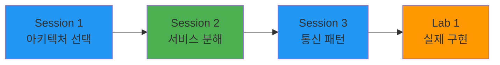

---

## 📝 세션 마무리

### ✅ 오늘 Session 2 성과
- [ ] **DDD 이해**: Domain-Driven Design 핵심 개념 습득
- [ ] **분해 전략**: 체계적인 서비스 분해 방법론 학습
- [ ] **실습 경험**: 실제 도메인을 마이크로서비스로 분해 체험
- [ ] **팀워크**: 협업을 통한 도메인 모델링 경험

### 🎯 다음 학습 준비
- **패턴 학습**: 마이크로서비스 구현 패턴에 대한 관심
- **통신 설계**: 서비스 간 효율적 통신 방법 궁금증
- **실제 구현**: 설계한 서비스를 실제로 구현해보고 싶은 욕구

---

<div align="center">

**🎯 도메인 모델링 전문가** • **✂️ 서비스 분해 마스터** • **🏗️ 아키텍처 설계자**

*이제 비즈니스 도메인을 완벽한 마이크로서비스로 분해할 수 있습니다!*

</div>
