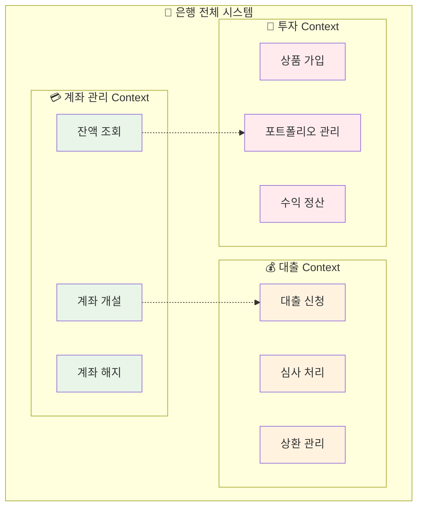
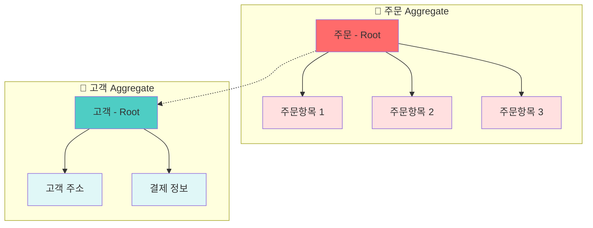
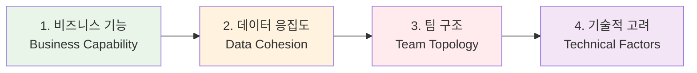
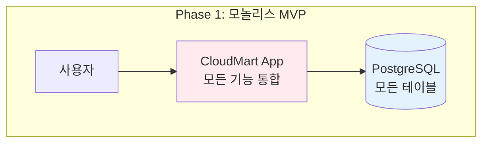
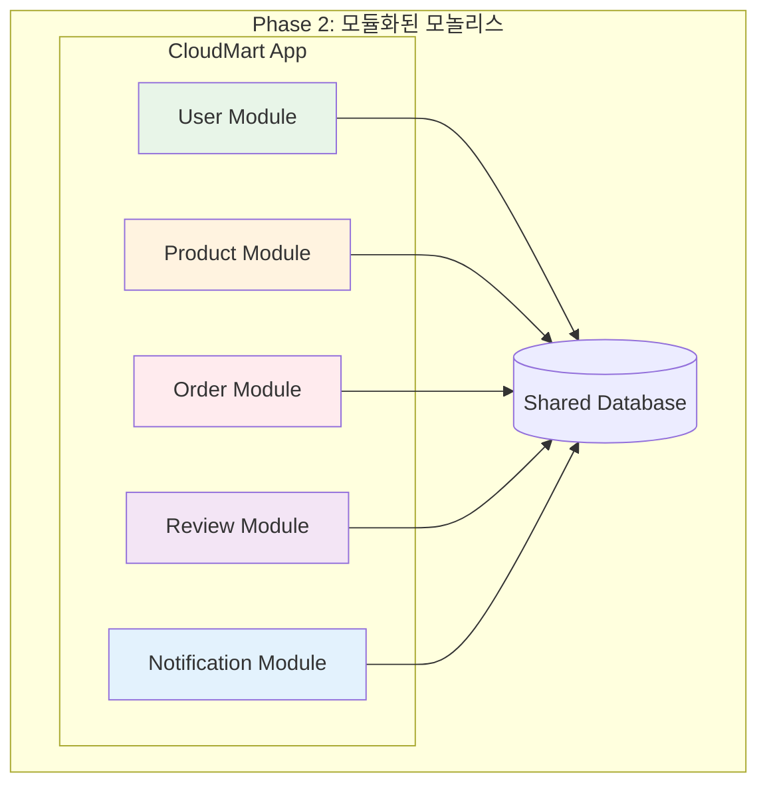
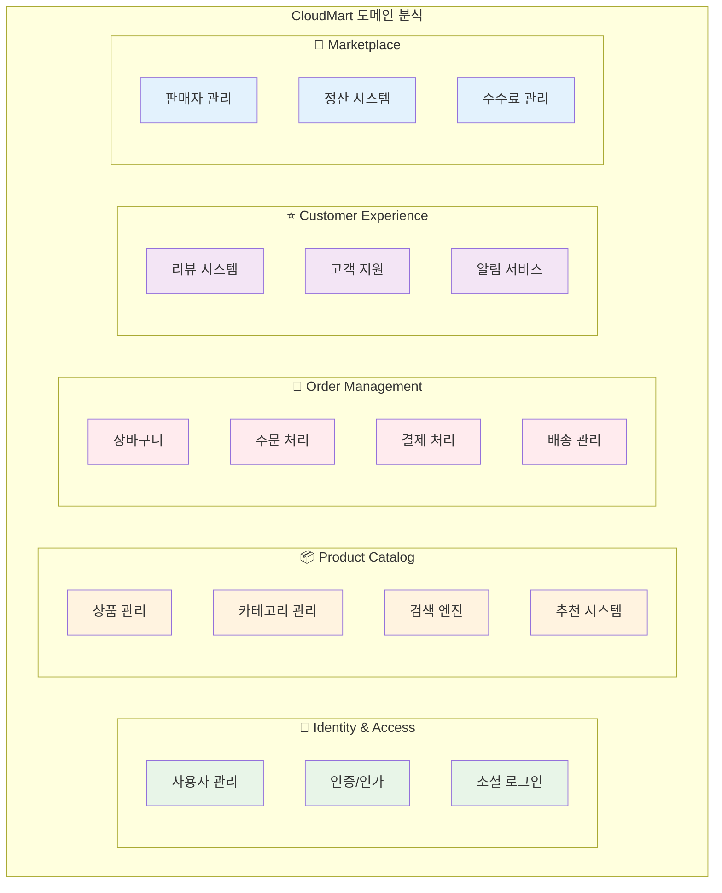
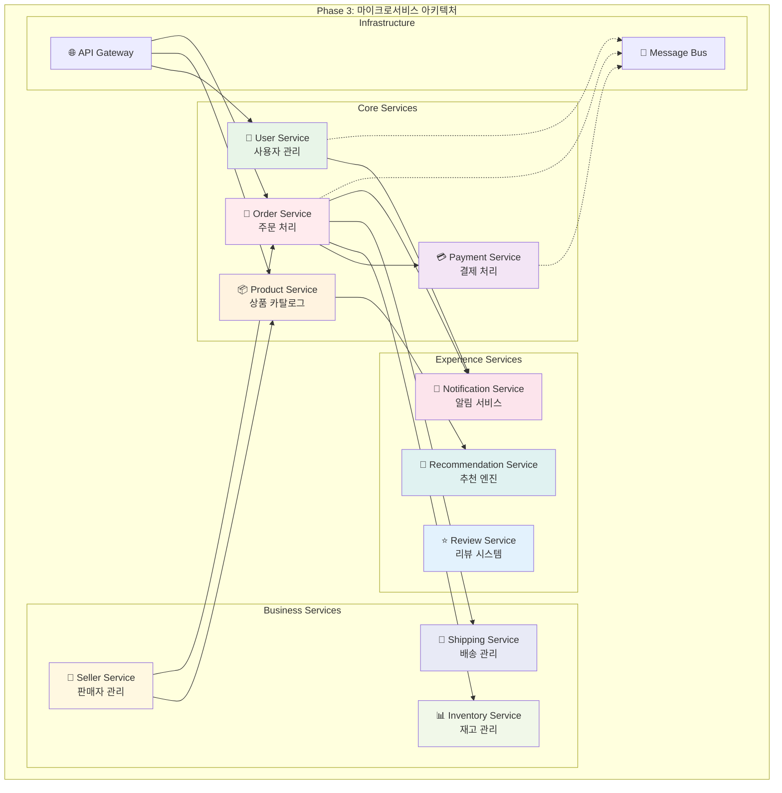

# Week 4 Day 1 Session 2: 서비스 분해 전략 - DDD 핵심 (개선 버전)

<div align="center">

**🎯 도메인 중심** • **✂️ 서비스 분해** • **🏗️ 경계 설정** • **🛠️ 실습 중심**

*비즈니스 도메인 기반으로 마이크로서비스 경계 정의하기*

</div>

---

## 🕘 세션 정보
**시간**: 09:55-10:40 (45분)  
**목표**: DDD 핵심 개념으로 서비스 경계 설정 능력 습득  
**방식**: 핵심 이론 (20분) + 실습 (20분) + 공유 (5분)

## 🎯 세션 목표

### 📚 학습 목표
- **핵심 개념**: Bounded Context와 Aggregate 이해
- **실무 적용**: 실제 도메인을 서비스로 분해하는 능력
- **경계 설정**: 명확한 서비스 경계 식별 방법

### 🤔 왜 필요한가? (3분)

**현실 문제 상황**:
- 💼 **잘못된 분해**: 기술적 기준으로만 나눠서 "분산 모놀리스" 생성
- 🔄 **끝없는 수정**: 서비스 경계가 모호해서 지속적인 API 변경
- 💸 **비용 폭증**: 불필요한 서비스 간 통신으로 성능 저하
- 👥 **팀 갈등**: 서비스 책임이 불분명해서 협업 어려움

---

## 📖 이론적 기반과 핵심 개념 (30분)

### 📐 Domain-Driven Design 이론적 배경 (8분)

**복잡성 관리 이론 (Complexity Management Theory)**:
```
소프트웨어 복잡성 = Essential Complexity + Accidental Complexity

Essential Complexity: 비즈니스 도메인 자체의 복잡성
- 고객의 실제 문제와 요구사항
- 비즈니스 규칙과 정책
- 도메인 전문가의 지식

Accidental Complexity: 기술적 구현으로 인한 복잡성
- 프레임워크, 라이브러리 선택
- 아키텍처 패턴
- 기술적 제약사항

DDD 목표: Essential Complexity에 집중, Accidental Complexity 최소화
```

**인지 과학적 접근 (Cognitive Science Approach)**:
```
인간의 인지 한계 (Miller's Rule, 1956):
- 단기 기억: 7±2개 항목만 동시 처리 가능
- 청킹(Chunking): 관련 정보를 그룹화하여 인지 부담 감소

DDD 적용:
- Bounded Context = 인지적 경계
- Aggregate = 관련 객체들의 청킹
- Ubiquitous Language = 팀 내 공통 인지 모델
```

**정보 은닉 이론 (Information Hiding, David Parnas, 1972)**:
```
모듈 분해 원칙:
1. 변경 가능성에 따른 분해
2. 설계 결정의 은닉
3. 인터페이스를 통한 추상화

DDD = 정보 은닉 + 도메인 지식의 체계적 적용
```

### 🔍 Bounded Context - 서비스 경계의 이론 (10분)

> **정의**: 특정 도메인 모델이 적용되는 명확한 경계

**언어학적 접근 (Linguistic Approach)**:
```
Sapir-Whorf 가설 적용: "언어가 사고를 결정한다"

소프트웨어에서:
- 같은 용어, 다른 의미 = 다른 Context
- 언어 경계 = 모델 경계 = 서비스 경계

예시: "고객(Customer)"
- 판매 Context: 구매 이력, 선호도
- 지원 Context: 문의 이력, 만족도
- 배송 Context: 주소, 연락처
```

**집합론적 정의 (Set Theory Definition)**:
```
Bounded Context BC = {Model, Language, Team, Code}

Context Mapping 관계:
- Shared Kernel: BC₁ ∩ BC₂ ≠ ∅
- Customer-Supplier: BC₁ → BC₂ (단방향 의존)
- Conformist: BC₁ ⊆ BC₂ (완전 종속)
- Anti-corruption Layer: BC₁ ↔ Translation ↔ BC₂
```

### 🔍 Aggregate - 일관성 경계의 이론 (8분)

> **정의**: 데이터 변경의 단위가 되는 연관된 객체들의 집합

**트랜잭션 이론 (Transaction Theory)**:
```
ACID 속성과 Aggregate:
- Atomicity: Aggregate 내부는 원자적 변경
- Consistency: Aggregate 불변식 보장
- Isolation: Aggregate 간 독립적 변경
- Durability: Aggregate 단위 영속화

Aggregate = Transaction Boundary
```

**그래프 이론 적용 (Graph Theory)**:
```
도메인 모델 = 객체 그래프
Aggregate = 강하게 연결된 부분 그래프

연결 강도 측정:
- 참조 빈도 (Reference Frequency)
- 변경 동시성 (Change Concurrency)
- 비즈니스 응집도 (Business Cohesion)

Aggregate Root = 그래프의 진입점
```

### 🔍 서비스 분해 전략 - 체계적 방법론 (4분)

**분해 우선순위 이론**:
```
1차: 비즈니스 기능 (Business Capability)
2차: 데이터 응집도 (Data Cohesion)  
3차: 팀 구조 (Team Topology)
4차: 기술적 고려사항 (Technical Factors)
```

**분해 품질 메트릭**:
```
응집도 측정: LCOM, 기능적 응집도 점수
결합도 측정: Afferent/Efferent Coupling
목표: High Cohesion (>0.8), Low Coupling (<0.3)
```

---

## 🛠️ 실습: E-Commerce 도메인 분해 (15분)

### 🔍 개념 1: Bounded Context - 서비스 경계의 핵심 (8분)

> **정의**: 특정 도메인 모델이 적용되는 명확한 경계

**🏢 실생활 비유 - 은행 업무**:


**핵심 원칙**:
1. **언어 통일**: 같은 Context 내에서는 동일한 용어 사용
2. **모델 일관성**: 하나의 도메인 모델만 존재
3. **팀 책임**: 하나의 팀이 하나의 Context 담당

**실무 식별 방법**:
- **언어 경계**: "고객"이 다른 의미로 사용되는 지점
- **데이터 경계**: 같은 엔티티가 다른 속성을 가지는 지점
- **팀 경계**: 서로 다른 팀이 관리하는 영역

### 🔍 개념 2: Aggregate - 데이터 일관성 경계 (8분)

> **정의**: 데이터 변경의 단위가 되는 연관된 객체들의 집합

**🛒 실생활 비유 - 온라인 쇼핑**:


**Aggregate 설계 원칙**:
1. **Root Entity**: 외부에서 접근하는 유일한 진입점
2. **트랜잭션 경계**: 하나의 Aggregate = 하나의 트랜잭션
3. **참조 방식**: 다른 Aggregate는 ID로만 참조

### 🔍 개념 3: 서비스 분해 전략 (4분)

**분해 우선순위**:


**실무 체크리스트**:
- [ ] **단일 책임**: 하나의 비즈니스 기능만 담당
- [ ] **높은 응집도**: 관련 기능들이 함께 변경됨
- [ ] **낮은 결합도**: 다른 서비스와 최소한의 의존성
- [ ] **독립 배포**: 다른 서비스 영향 없이 배포 가능

---

## 🛠️ 실습: E-Commerce 도메인 분해 - 성장 단계별 진화 (15분)

### 📋 실습 시나리오: "CloudMart"의 성장 여정

**배경**: 온라인 쇼핑몰 "CloudMart"가 스타트업에서 대기업으로 성장하면서 기능이 점진적으로 추가되는 과정을 통해 서비스 분해 전략을 학습

### 🚀 Phase 1: MVP 스타트업 (팀 5명, 사용자 1K명)

**초기 기능 목록**:
```yaml
기본 기능:
  - 사용자 회원가입/로그인
  - 상품 목록 조회
  - 장바구니 담기
  - 간단한 주문 처리
  - 기본 결제 (신용카드만)
  
기술 스택:
  - 단일 데이터베이스 (PostgreSQL)
  - 단일 애플리케이션 (Spring Boot)
  - 파일 업로드 (로컬 스토리지)
```

**아키텍처**: 모놀리스


### 📈 Phase 2: 성장기 (팀 12명, 사용자 50K명)

**추가된 기능들**:
```yaml
새로운 요구사항:
  - 상품 리뷰 및 평점 시스템
  - 다양한 결제 수단 (카카오페이, 네이버페이)
  - 쿠폰 및 할인 시스템
  - 기본 재고 관리
  - 이메일/SMS 알림
  - 관리자 대시보드
  
성능 이슈:
  - 상품 검색 속도 저하
  - 주문 처리 지연
  - 동시 접속자 증가로 인한 응답 지연
```

**문제점 발생**:
- 🐌 **성능 저하**: 모든 기능이 하나의 DB를 공유하여 병목
- 🔄 **배포 리스크**: 리뷰 기능 수정이 결제 시스템에 영향
- 👥 **팀 충돌**: 여러 팀이 같은 코드베이스 수정으로 충돌

**해결책**: 도메인별 모듈 분리 (Modular Monolith)


### 🚀 Phase 3: 확장기 (팀 25명, 사용자 500K명)

**대규모 기능 추가**:
```yaml
비즈니스 확장:
  - 다중 판매자 마켓플레이스
  - 실시간 채팅 고객지원
  - 개인화 추천 시스템
  - 소셜 로그인 (구글, 페이스북)
  - 모바일 앱 API
  - 국제 배송 및 다중 통화
  - 구독 서비스
  
운영 요구사항:
  - 99.9% 가용성 필요
  - 실시간 재고 동기화
  - 대용량 이미지 처리
  - 개인정보보호 강화
```

**심각한 문제들**:
- 💥 **장애 전파**: 추천 시스템 오류가 전체 사이트 다운
- 🐌 **성능 한계**: 단일 DB로는 500K 사용자 처리 불가
- 🔄 **배포 지옥**: 하나의 기능 배포가 전체 시스템 위험
- 👥 **팀 병목**: 25명이 하나의 코드베이스에서 작업하며 충돌

**해결책**: 마이크로서비스 전환 결정!

### 🎯 실습 단계: DDD 기반 서비스 분해 (8분)

#### Step 1: Bounded Context 식별 (3분)
**팀별 워크샵** (4명씩 그룹):

**도메인 전문가 역할 분담**:
- **마케팅 담당자**: 고객 관점에서 기능 분석
- **운영 담당자**: 주문/배송/재고 관점
- **상품 담당자**: 카탈로그/검색/추천 관점
- **기술 담당자**: 시스템 통합 관점

**Context 후보 도출**:


#### Step 2: 언어 통일성 확인 (2분)

**용어 충돌 분석**:
```yaml
"고객" 의미 분석:
  - Identity Context: 로그인 사용자
  - Order Context: 주문자 정보
  - Support Context: 문의자
  - Marketing Context: 타겟 세그먼트

"상품" 의미 분석:
  - Catalog Context: 판매 가능한 아이템
  - Inventory Context: 재고 관리 단위
  - Order Context: 주문 항목
  - Review Context: 평가 대상

"주문" 의미 분석:
  - Order Context: 구매 요청
  - Payment Context: 결제 대상
  - Shipping Context: 배송 단위
  - Seller Context: 판매 실적
```

#### Step 3: 최종 마이크로서비스 구조 확정 (3분)

**진화된 마이크로서비스 아키텍처**:


### 📊 성장 단계별 아키텍처 진화 요약

| 단계 | 팀 크기 | 사용자 | 서비스 수 | 주요 도전과제 | 아키텍처 선택 |
|------|---------|--------|-----------|---------------|---------------|
| **Phase 1** | 5명 | 1K | 1개 | 빠른 MVP 개발 | 모놀리스 |
| **Phase 2** | 12명 | 50K | 1개 (모듈화) | 팀 협업, 성능 | 모듈화된 모놀리스 |
| **Phase 3** | 25명 | 500K | 10개 | 확장성, 가용성 | 마이크로서비스 |

### 💡 핵심 학습 포인트

**1. 점진적 진화의 중요성**:
- 처음부터 마이크로서비스로 시작하지 않음
- 비즈니스 성장과 팀 규모에 맞춰 진화
- 각 단계마다 최적의 아키텍처 선택

**2. 도메인 경계의 자연스러운 발견**:
- 기능 추가 과정에서 자연스럽게 경계 드러남
- 팀 구조와 서비스 경계의 일치 (Conway's Law)
- 비즈니스 요구사항이 기술 결정을 주도

**3. 실무적 고려사항**:
- 용어의 다의성 → Bounded Context 필요성
- 데이터 일관성 vs 서비스 독립성 트레이드오프
- 운영 복잡도 증가에 대한 준비 필요

---

## 🤝 결과 공유 및 피드백 (5분)

### 📊 팀별 발표 (3분)
**각 팀 1분씩 발표**:
1. **Context 분해 결과**: 몇 개의 서비스로 나눴는지
2. **핵심 판단 기준**: 어떤 기준으로 경계를 설정했는지
3. **어려웠던 점**: 애매했던 경계나 고민 지점

### 💡 강사 피드백 (2분)
**공통 패턴 정리**:
- ✅ **좋은 분해**: 비즈니스 기능 중심, 명확한 책임
- ⚠️ **주의 사항**: 너무 세분화, 기술적 분해
- 🔄 **개선 방향**: 점진적 분해, 운영 복잡도 고려

---

## 🔑 핵심 키워드

- **Bounded Context**: 도메인 모델의 적용 경계
- **Aggregate**: 데이터 일관성의 트랜잭션 경계  
- **Domain Expert**: 비즈니스 지식을 가진 도메인 전문가
- **Ubiquitous Language**: 팀 내 공통 언어
- **Context Mapping**: Context 간 관계 정의

---

## 📝 세션 마무리

### ✅ 오늘 세션 성과
- [ ] **Bounded Context** 개념 이해 및 식별 능력
- [ ] **Aggregate** 설계 원칙 습득
- [ ] **실제 도메인** 분해 경험
- [ ] **팀 협업**을 통한 서비스 경계 설정

### 🎯 다음 세션 준비
- **마이크로서비스 패턴**: API Gateway, Circuit Breaker 등
- **통신 방식**: 동기 vs 비동기 통신 선택 기준
- **데이터 관리**: Database per Service 패턴

### 💡 실무 적용 팁
1. **점진적 분해**: 한 번에 모든 것을 나누지 말고 단계적 접근
2. **팀과 함께**: 도메인 전문가와 개발자가 함께 경계 설정
3. **지속적 개선**: 서비스 경계는 비즈니스 변화에 따라 조정
4. **운영 고려**: 분해 후 운영 복잡도 증가를 미리 고려

---

<div align="center">

**🎯 도메인 중심** • **✂️ 논리적 분해** • **🛠️ 실습 강화** • **🤝 협업 학습**

*비즈니스 가치 중심의 마이크로서비스 설계*

</div>
