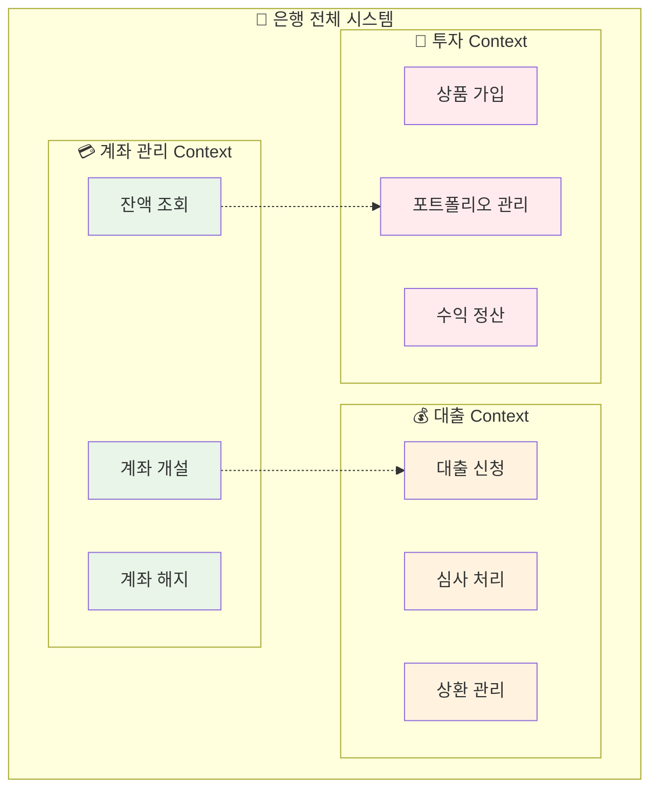
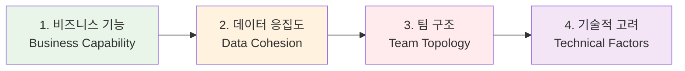
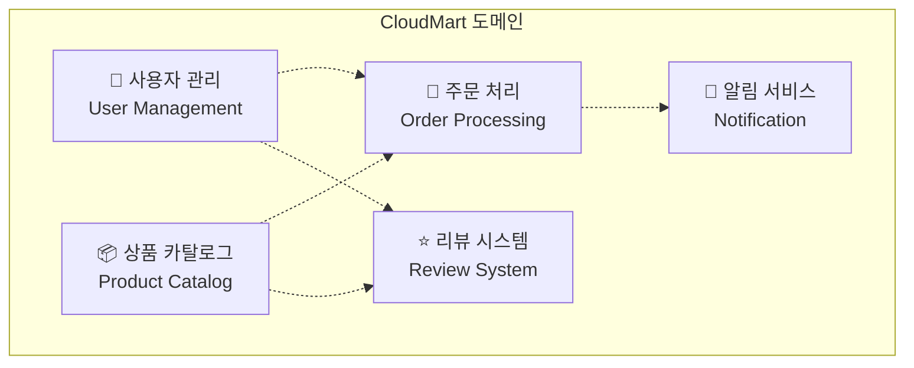
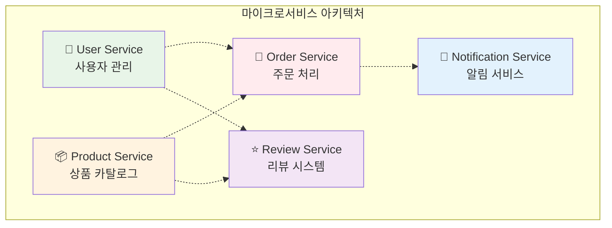

# Week 4 Day 1 Session 2: 서비스 분해 전략 - DDD 핵심 (개선 버전)

<div align="center">

**🎯 도메인 중심** • **✂️ 서비스 분해** • **🏗️ 경계 설정** • **🛠️ 실습 중심**

*비즈니스 도메인 기반으로 마이크로서비스 경계 정의하기*

</div>

---

## 🕘 세션 정보
**시간**: 09:55-10:40 (45분)  
**목표**: DDD 핵심 개념으로 서비스 경계 설정 능력 습득  
**방식**: 핵심 이론 (20분) + 실습 (20분) + 공유 (5분)

## 🎯 세션 목표

### 📚 학습 목표
- **핵심 개념**: Bounded Context와 Aggregate 이해
- **실무 적용**: 실제 도메인을 서비스로 분해하는 능력
- **경계 설정**: 명확한 서비스 경계 식별 방법

### 🤔 왜 필요한가? (3분)

**현실 문제 상황**:
- 💼 **잘못된 분해**: 기술적 기준으로만 나눠서 "분산 모놀리스" 생성
- 🔄 **끝없는 수정**: 서비스 경계가 모호해서 지속적인 API 변경
- 💸 **비용 폭증**: 불필요한 서비스 간 통신으로 성능 저하
- 👥 **팀 갈등**: 서비스 책임이 불분명해서 협업 어려움

---

## 📖 핵심 개념 (20분)

### 🔍 개념 1: Bounded Context - 서비스 경계의 핵심 (8분)

> **정의**: 특정 도메인 모델이 적용되는 명확한 경계

**🏢 실생활 비유 - 은행 업무**:


**핵심 원칙**:
1. **언어 통일**: 같은 Context 내에서는 동일한 용어 사용
2. **모델 일관성**: 하나의 도메인 모델만 존재
3. **팀 책임**: 하나의 팀이 하나의 Context 담당

**실무 식별 방법**:
- **언어 경계**: "고객"이 다른 의미로 사용되는 지점
- **데이터 경계**: 같은 엔티티가 다른 속성을 가지는 지점
- **팀 경계**: 서로 다른 팀이 관리하는 영역

### 🔍 개념 2: Aggregate - 데이터 일관성 경계 (8분)

> **정의**: 데이터 변경의 단위가 되는 연관된 객체들의 집합

**🛒 실생활 비유 - 온라인 쇼핑**:
```mermaid
graph TB
    subgraph "🛒 주문 Aggregate"
        O[주문 (Root)]
        OI1[주문항목 1]
        OI2[주문항목 2]
        OI3[주문항목 3]
        
        O --> OI1
        O --> OI2
        O --> OI3
    end
    
    subgraph "👤 고객 Aggregate"
        C[고객 (Root)]
        CA[고객 주소]
        CP[결제 정보]
        
        C --> CA
        C --> CP
    end
    
    O -.-> C
    
    style O fill:#ff6b6b
    style C fill:#4ecdc4
    style OI1 fill:#ffe0e0
    style OI2 fill:#ffe0e0
    style OI3 fill:#ffe0e0
    style CA fill:#e0f7f7
    style CP fill:#e0f7f7
```

**Aggregate 설계 원칙**:
1. **Root Entity**: 외부에서 접근하는 유일한 진입점
2. **트랜잭션 경계**: 하나의 Aggregate = 하나의 트랜잭션
3. **참조 방식**: 다른 Aggregate는 ID로만 참조

### 🔍 개념 3: 서비스 분해 전략 (4분)

**분해 우선순위**:


**실무 체크리스트**:
- [ ] **단일 책임**: 하나의 비즈니스 기능만 담당
- [ ] **높은 응집도**: 관련 기능들이 함께 변경됨
- [ ] **낮은 결합도**: 다른 서비스와 최소한의 의존성
- [ ] **독립 배포**: 다른 서비스 영향 없이 배포 가능

---

## 🛠️ 실습: E-Commerce 도메인 분해 (20분)

### 📋 실습 시나리오
**온라인 쇼핑몰 "CloudMart" 서비스 분해**

**현재 모놀리스 기능**:
- 사용자 관리 (회원가입, 로그인, 프로필)
- 상품 관리 (카탈로그, 재고, 가격)
- 주문 처리 (장바구니, 결제, 배송)
- 리뷰 시스템 (평점, 댓글, 추천)
- 알림 서비스 (이메일, SMS, 푸시)

### 🎯 실습 단계

#### Step 1: Bounded Context 식별 (8분)
**팀별 워크샵** (4명씩 그룹):

1. **도메인 전문가 역할 분담**:
   - 마케팅 담당자: 고객 관점
   - 운영 담당자: 주문/배송 관점
   - 상품 담당자: 카탈로그 관점
   - 기술 담당자: 시스템 관점

2. **Context 후보 도출**:


3. **언어 통일성 확인**:
   - "고객" vs "사용자" vs "회원"
   - "상품" vs "아이템" vs "제품"
   - "주문" vs "구매" vs "거래"

#### Step 2: Aggregate 설계 (8분)

**각 Context별 Aggregate 식별**:

**사용자 관리 Context**:
```yaml
User Aggregate:
  Root: User
  Entities: 
    - UserProfile
    - UserPreferences
  Value Objects:
    - Email
    - Address
```

**주문 처리 Context**:
```yaml
Order Aggregate:
  Root: Order
  Entities:
    - OrderItem
    - Payment
  Value Objects:
    - Money
    - OrderStatus
```

#### Step 3: 서비스 경계 확정 (4분)

**최종 마이크로서비스 구조**:


---

## 🤝 결과 공유 및 피드백 (5분)

### 📊 팀별 발표 (3분)
**각 팀 1분씩 발표**:
1. **Context 분해 결과**: 몇 개의 서비스로 나눴는지
2. **핵심 판단 기준**: 어떤 기준으로 경계를 설정했는지
3. **어려웠던 점**: 애매했던 경계나 고민 지점

### 💡 강사 피드백 (2분)
**공통 패턴 정리**:
- ✅ **좋은 분해**: 비즈니스 기능 중심, 명확한 책임
- ⚠️ **주의 사항**: 너무 세분화, 기술적 분해
- 🔄 **개선 방향**: 점진적 분해, 운영 복잡도 고려

---

## 🔑 핵심 키워드

- **Bounded Context**: 도메인 모델의 적용 경계
- **Aggregate**: 데이터 일관성의 트랜잭션 경계  
- **Domain Expert**: 비즈니스 지식을 가진 도메인 전문가
- **Ubiquitous Language**: 팀 내 공통 언어
- **Context Mapping**: Context 간 관계 정의

---

## 📝 세션 마무리

### ✅ 오늘 세션 성과
- [ ] **Bounded Context** 개념 이해 및 식별 능력
- [ ] **Aggregate** 설계 원칙 습득
- [ ] **실제 도메인** 분해 경험
- [ ] **팀 협업**을 통한 서비스 경계 설정

### 🎯 다음 세션 준비
- **마이크로서비스 패턴**: API Gateway, Circuit Breaker 등
- **통신 방식**: 동기 vs 비동기 통신 선택 기준
- **데이터 관리**: Database per Service 패턴

### 💡 실무 적용 팁
1. **점진적 분해**: 한 번에 모든 것을 나누지 말고 단계적 접근
2. **팀과 함께**: 도메인 전문가와 개발자가 함께 경계 설정
3. **지속적 개선**: 서비스 경계는 비즈니스 변화에 따라 조정
4. **운영 고려**: 분해 후 운영 복잡도 증가를 미리 고려

---

<div align="center">

**🎯 도메인 중심** • **✂️ 논리적 분해** • **🛠️ 실습 강화** • **🤝 협업 학습**

*비즈니스 가치 중심의 마이크로서비스 설계*

</div>
