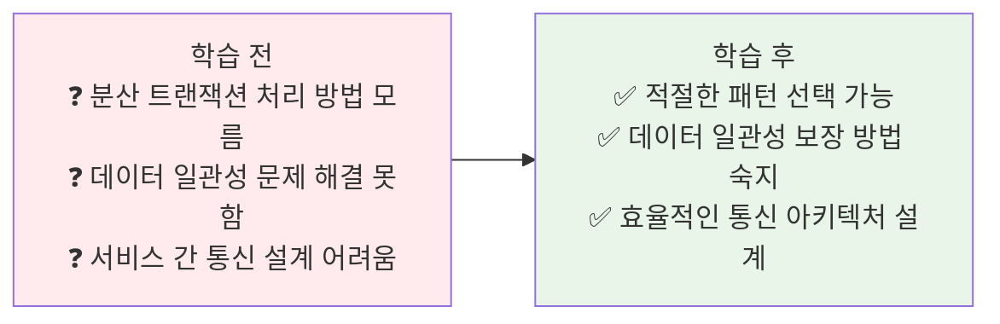
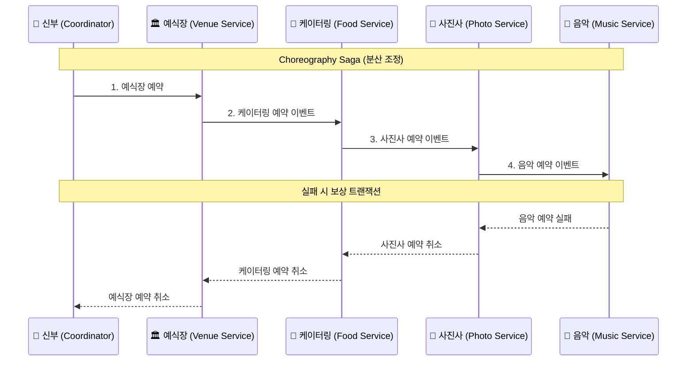
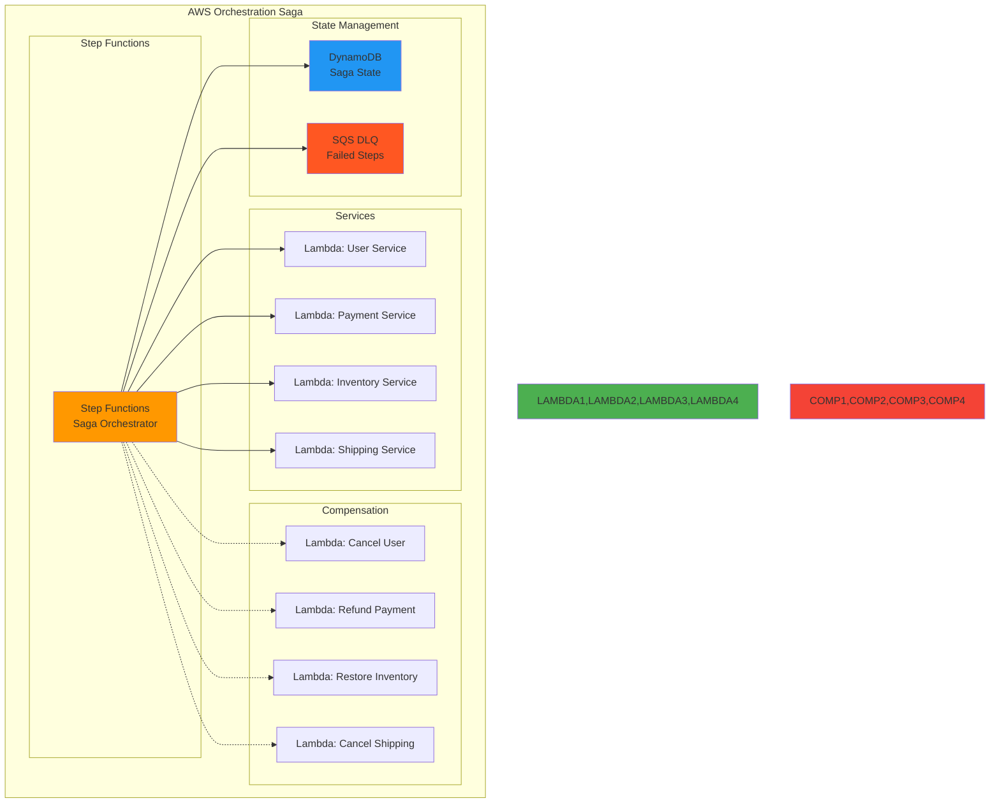
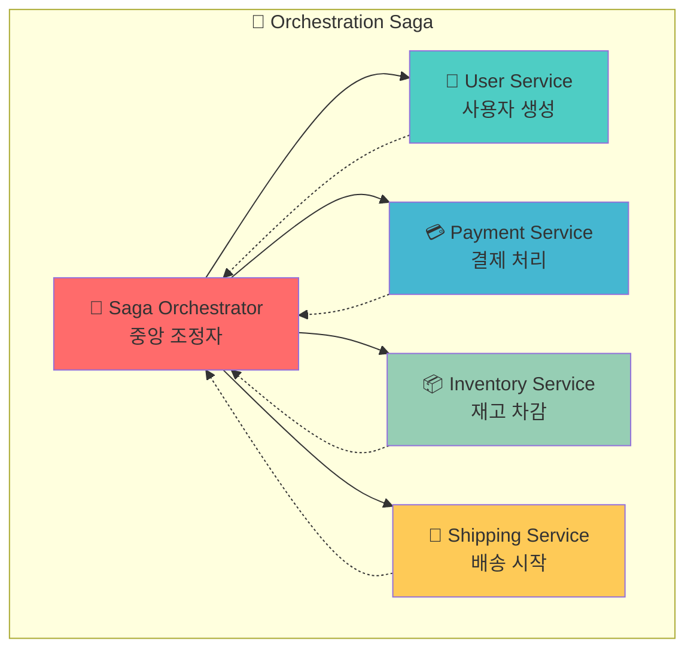
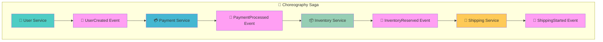
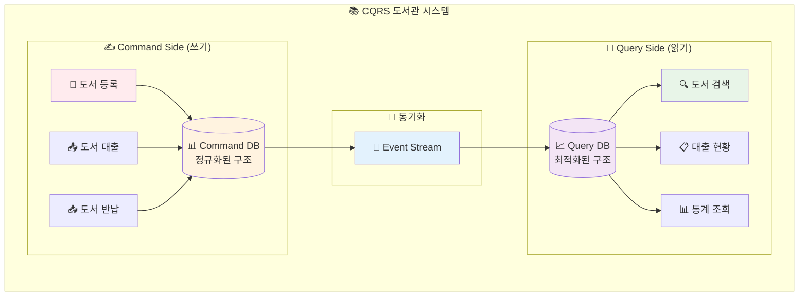
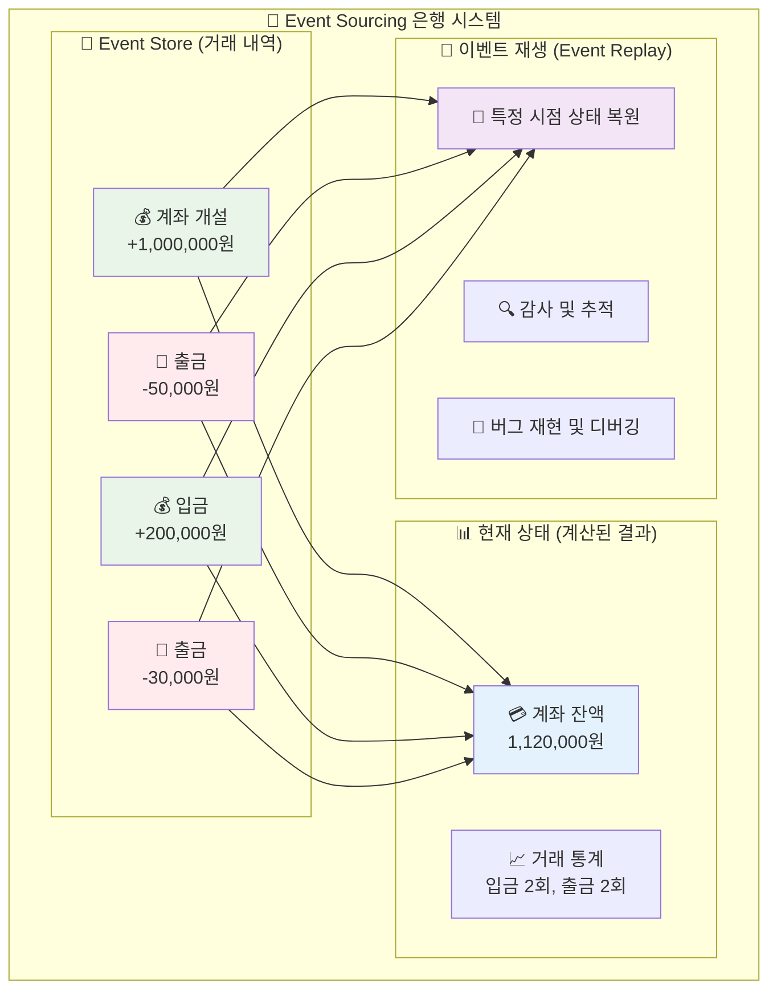
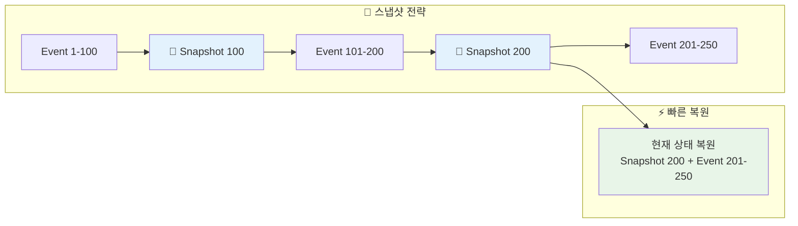
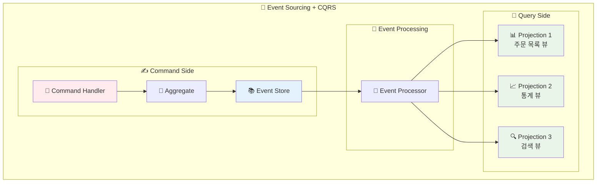
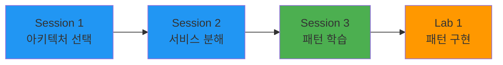

# Week 4 Day 1 Session 3: 마이크로서비스 패턴 - Saga, CQRS, Event Sourcing

<div align="center">

**🔄 Saga 패턴** • **📊 CQRS** • **📝 Event Sourcing** • **🎭 통신 패턴**

*마이크로서비스 구현을 위한 핵심 패턴들*

</div>

---

## 🕘 세션 정보
**시간**: 11:00-11:50 (50분)  
**목표**: 마이크로서비스 구현의 핵심 패턴들과 통신 방식 완전 이해  
**방식**: 패턴별 상세 설명 + 실제 구현 예시 + 패턴 선택 가이드

## 🎯 세션 목표

### 📚 학습 목표
- **이해 목표**: Saga, CQRS, Event Sourcing 패턴의 원리와 적용 시점
- **적용 목표**: 실제 마이크로서비스에서 패턴을 선택하고 구현하는 능력
- **협업 목표**: 팀과 함께 패턴 기반 아키텍처 설계

### 🤔 왜 필요한가? (5분)

**현실 문제 상황**:
- 💼 **실무 시나리오**: "분산 트랜잭션을 어떻게 처리해야 하나요?"
- 🧩 **일상 비유**: 오케스트라 연주 - 각 악기(서비스)의 조화로운 협연
- ☁️ **AWS 아키텍처**: "Step Functions + SQS + EventBridge로 분산 트랜잭션 구현"
- 📊 **기술적 도전**: 데이터 일관성, 성능, 복잡성 관리

**학습 전후 비교**:


---

## 📖 핵심 개념 (35분)

### 📐 이론적 배경: 분산 시스템 이론과 합의 알고리즘 (3분)

**ACID vs BASE 트레이드오프**:
```
ACID (전통적 RDBMS):
- Atomicity: 원자성 (All or Nothing)
- Consistency: 일관성 (데이터 무결성)
- Isolation: 격리성 (동시성 제어)
- Durability: 지속성 (영구 저장)

BASE (분산 시스템):
- Basically Available: 기본적 가용성
- Soft state: 유연한 상태
- Eventual consistency: 최종 일관성
```

**분산 합의 문제 (Consensus Problem)**:
```
FLP 불가능성 정리 (1985):
비동기 분산 시스템에서 단일 프로세스 장애가 있을 때
결정론적 합의 알고리즘은 불가능

해결책: 부분 동기 모델 + 확률적 알고리즘
- Paxos (1989): 이론적 완전성
- Raft (2013): 실용적 구현
- PBFT (1999): 비잔틴 장애 허용
```

### 🔍 개념 1: Saga 패턴 - 분산 트랜잭션 관리 (12분)

> **정의**: 마이크로서비스 환경에서 여러 서비스에 걸친 트랜잭션을 관리하는 패턴

**🎭 실생활 비유 - 결혼식 준비**:


**🔄 Saga 패턴 유형**:

**📐 수학적 모델링**:
```
Saga Transaction = {T₁, T₂, ..., Tₙ, C₁, C₂, ..., Cₙ}
- Tᵢ: i번째 트랜잭션
- Cᵢ: i번째 보상 트랜잭션 (Compensating Transaction)

성공 시나리오: T₁ → T₂ → ... → Tₙ
실패 시나리오: T₁ → ... → Tₖ (실패) → Cₖ₋₁ → ... → C₁

보상 가능성 조건: ∀i, Tᵢ ∘ Cᵢ = Identity (멱등성)
```

**🔬 복잡도 분석**:
```
Orchestration Saga:
- 시간 복잡도: O(n) - 순차 실행
- 공간 복잡도: O(n) - 상태 저장
- 장애 복구: O(k) - k개 보상 트랜잭션

Choreography Saga:
- 시간 복잡도: O(log n) - 병렬 실행 가능
- 공간 복잡도: O(1) - 분산 상태
- 장애 복구: O(n) - 전체 체인 추적 필요
```

**☁️ AWS Saga 패턴 구현**:


**🔧 AWS Saga 서비스 매핑**:
- **Saga Orchestrator** → **Step Functions**: 워크플로우 상태 머신
- **Service Tasks** → **Lambda Functions**: 각 비즈니스 로직 실행
- **Compensation Tasks** → **Lambda Functions**: 실패 시 보상 트랜잭션
- **State Storage** → **DynamoDB**: Saga 실행 상태 저장
- **Error Handling** → **SQS DLQ**: 실패한 단계 재처리

**1. Orchestration Saga (중앙 집중식)**:


**장점**: 중앙 집중 제어, 명확한 흐름, 쉬운 모니터링  
**단점**: 단일 장애점, 복잡성 증가, 성능 병목

**2. Choreography Saga (분산 조정식)**:


**장점**: 느슨한 결합, 확장성, 장애 격리  
**단점**: 복잡한 디버깅, 순환 의존성 위험

**🔧 보상 트랜잭션 (Compensating Transaction)**:
```yaml
주문 처리 Saga:
  1. 재고 예약 (Inventory Service)
     보상: 재고 예약 취소
  
  2. 결제 처리 (Payment Service)
     보상: 결제 취소 및 환불
  
  3. 배송 시작 (Shipping Service)
     보상: 배송 취소

실패 시나리오:
  - 3단계에서 실패 → 2, 1단계 보상 트랜잭션 실행
  - 최종 상태: 모든 변경사항 롤백 완료
```

### 🔍 개념 2: CQRS 패턴 - 읽기/쓰기 분리 (12분)

> **정의**: Command Query Responsibility Segregation - 명령(쓰기)과 조회(읽기)의 책임을 분리하는 패턴

**📚 실생활 비유 - 도서관 시스템**:


**🎯 CQRS 적용 시나리오**:

**전통적 방식 (문제점)**:
```yaml
User 엔티티:
  - id, name, email, phone, address
  - createdAt, updatedAt, lastLoginAt
  - preferences, settings, metadata

문제점:
  - 읽기 쿼리가 복잡함 (JOIN 다수)
  - 쓰기 성능 저하 (인덱스 오버헤드)
  - 읽기/쓰기 요구사항 충돌
```

**CQRS 적용 후**:
```yaml
Command Side (쓰기 최적화):
  UserAggregate:
    - 비즈니스 로직 중심
    - 트랜잭션 일관성 보장
    - 정규화된 구조

Query Side (읽기 최적화):
  UserView:
    - 비정규화된 구조
    - 검색 최적화 인덱스
    - 캐시 친화적 설계
  
  UserStatistics:
    - 집계 데이터 미리 계산
    - 대시보드 전용 뷰
    - 실시간 업데이트
```

**📊 CQRS 장단점 분석**:

| 측면 | 장점 | 단점 |
|------|------|------|
| **성능** | 읽기/쓰기 독립 최적화 | 동기화 오버헤드 |
| **확장성** | 독립적 스케일링 | 복잡성 증가 |
| **유연성** | 서로 다른 데이터 모델 | 일관성 관리 어려움 |
| **개발** | 관심사 분리 | 코드 중복 가능성 |

### 🔍 개념 3: Event Sourcing - 이벤트 기반 상태 관리 (11분)

> **정의**: 애플리케이션 상태를 이벤트의 시퀀스로 저장하고 관리하는 패턴

**🏦 실생활 비유 - 은행 거래 내역**:


**📝 Event Sourcing 핵심 개념**:

**1. 이벤트 스토어 구조**:
```yaml
Event 구조:
  eventId: UUID
  aggregateId: UUID (어떤 엔티티의 이벤트인가)
  eventType: "OrderCreated" | "PaymentProcessed"
  eventData: JSON (이벤트 상세 데이터)
  eventVersion: 1 (스키마 버전)
  timestamp: ISO8601
  userId: UUID (누가 발생시켰는가)

예시 이벤트:
  eventId: "550e8400-e29b-41d4-a716-446655440000"
  aggregateId: "order-123"
  eventType: "OrderCreated"
  eventData: {
    "customerId": "user-456",
    "items": [{"productId": "prod-789", "quantity": 2}],
    "totalAmount": 50000
  }
  eventVersion: 1
  timestamp: "2024-10-07T12:00:00Z"
  userId: "user-456"
```

**2. 상태 재구성 (Event Replay)**:
```yaml
주문 상태 재구성 과정:
  초기 상태: Order = null
  
  Event 1 - OrderCreated:
    Order = {id: "123", status: "CREATED", amount: 50000}
  
  Event 2 - PaymentProcessed:
    Order = {id: "123", status: "PAID", amount: 50000}
  
  Event 3 - OrderShipped:
    Order = {id: "123", status: "SHIPPED", amount: 50000}
  
  최종 상태: Order = {id: "123", status: "SHIPPED", amount: 50000}
```

**3. 스냅샷 최적화**:


**📊 Event Sourcing + CQRS 조합**:


**🎯 패턴 선택 가이드**:

| 요구사항 | Saga | CQRS | Event Sourcing |
|----------|------|------|----------------|
| **분산 트랜잭션** | ✅ 필수 | ❌ 해당없음 | ⚠️ 보완적 | 
| **읽기 성능 최적화** | ❌ 해당없음 | ✅ 필수 | ⚠️ 보완적 |
| **감사 추적** | ⚠️ 부분적 | ❌ 해당없음 | ✅ 필수 |
| **복잡도** | 🟡 중간 | 🟡 중간 | 🔴 높음 |
| **학습 곡선** | 🟡 중간 | 🟡 중간 | 🔴 가파름 |

---

## 💭 함께 생각해보기 (10분)

### 🤝 패턴 선택 워크샵 (7분)
**워크샵 주제**: "CloudMart에 적합한 패턴 선택하기"

**시나리오별 패턴 선택**:

**시나리오 1**: 주문 처리 시스템
- 여러 서비스 (재고, 결제, 배송) 연동 필요
- 데이터 일관성 중요
- **선택할 패턴**: ?

**시나리오 2**: 상품 검색 시스템
- 복잡한 검색 쿼리 (카테고리, 가격, 평점 등)
- 높은 읽기 성능 요구
- **선택할 패턴**: ?

**시나리오 3**: 사용자 활동 추적
- 모든 사용자 행동 기록 필요
- 개인화 추천을 위한 데이터 분석
- 규정 준수를 위한 감사 로그
- **선택할 패턴**: ?

### 🎯 전체 공유 (3분)
- **패턴 조합**: 여러 패턴을 함께 사용하는 방법
- **실무 경험**: 실제 프로젝트에서의 패턴 적용 사례
- **다음 연결**: Lab 1에서 실제 구현할 패턴들

---

## 🔑 핵심 키워드 정리

### 🆕 새로운 용어
- **Saga 패턴**: 분산 트랜잭션 관리 패턴
- **Orchestration**: 중앙 집중식 워크플로우 관리
- **Choreography**: 분산 이벤트 기반 워크플로우
- **보상 트랜잭션(Compensating Transaction)**: 실패 시 롤백을 위한 역방향 작업
- **CQRS**: Command Query Responsibility Segregation
- **Event Sourcing**: 이벤트 기반 상태 관리
- **Event Store**: 이벤트를 저장하는 전용 데이터베이스
- **Projection**: 이벤트로부터 생성되는 읽기 전용 뷰
- **Aggregate**: 비즈니스 규칙을 캡슐화하는 도메인 객체

### 🔤 중요 개념
- **최종 일관성(Eventual Consistency)**: 시간이 지나면 일관성이 보장되는 모델
- **이벤트 재생(Event Replay)**: 과거 이벤트를 다시 실행하여 상태 복원
- **스냅샷(Snapshot)**: 성능 최적화를 위한 상태 저장
- **이벤트 버전 관리**: 스키마 변경에 대한 호환성 관리

---

## 📊 이해도 체크

### 💡 즉석 퀴즈
1. **Q**: Saga 패턴의 두 가지 유형은?
   **A**: Orchestration (중앙 집중식)과 Choreography (분산 조정식)

2. **Q**: CQRS의 주요 목적은?
   **A**: 읽기와 쓰기 작업을 분리하여 각각 최적화

3. **Q**: Event Sourcing의 핵심 아이디어는?
   **A**: 상태 변경을 이벤트로 저장하고 이벤트 재생으로 현재 상태 복원

### ✅ 이해도 확인 질문
- "각 패턴이 해결하는 문제와 적용 시점을 설명할 수 있나요?"
- "CloudMart 시스템에 어떤 패턴들을 적용할지 결정할 수 있나요?"
- "패턴들을 조합해서 사용하는 방법을 이해했나요?"

---

## 🎯 다음 실습 연결

### 🛠️ Lab 1 준비
이제 마이크로서비스 패턴을 이해했으니, Lab 1에서는:
- **모놀리스 분해**: 실제 E-Commerce 애플리케이션 분해
- **Saga 구현**: 주문 처리 워크플로우 구현
- **CQRS 적용**: 상품 검색 시스템 최적화
- **이벤트 기반 통신**: 서비스 간 비동기 통신 구현

### 🔗 학습 연결고리


---

## 📝 세션 마무리

### ✅ 오늘 Session 3 성과
- [ ] **패턴 이해**: Saga, CQRS, Event Sourcing 패턴 완전 이해
- [ ] **적용 기준**: 각 패턴의 적용 시점과 선택 기준 습득
- [ ] **실무 연계**: 실제 시스템에서의 패턴 조합 방법 학습
- [ ] **구현 준비**: Lab에서 실제 구현할 패턴들 선택 완료

### 🎯 다음 학습 준비
- **실습 기대**: 이론으로 배운 패턴들을 실제로 구현해보고 싶은 욕구
- **문제 해결**: 복잡한 분산 시스템 문제를 패턴으로 해결하는 자신감
- **아키텍처 설계**: 전체적인 마이크로서비스 아키텍처 설계 능력

---

<div align="center">

**🔄 Saga 마스터** • **📊 CQRS 전문가** • **📝 Event Sourcing 아키텍트** • **🎭 패턴 선택 전문가**

*이제 마이크로서비스의 핵심 패턴들을 완벽하게 활용할 수 있습니다!*

</div>
