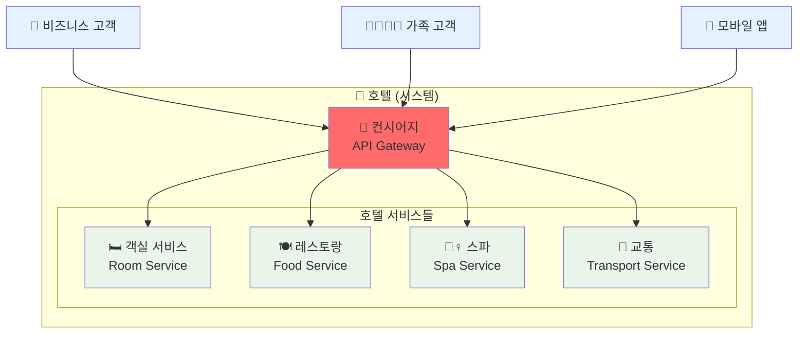
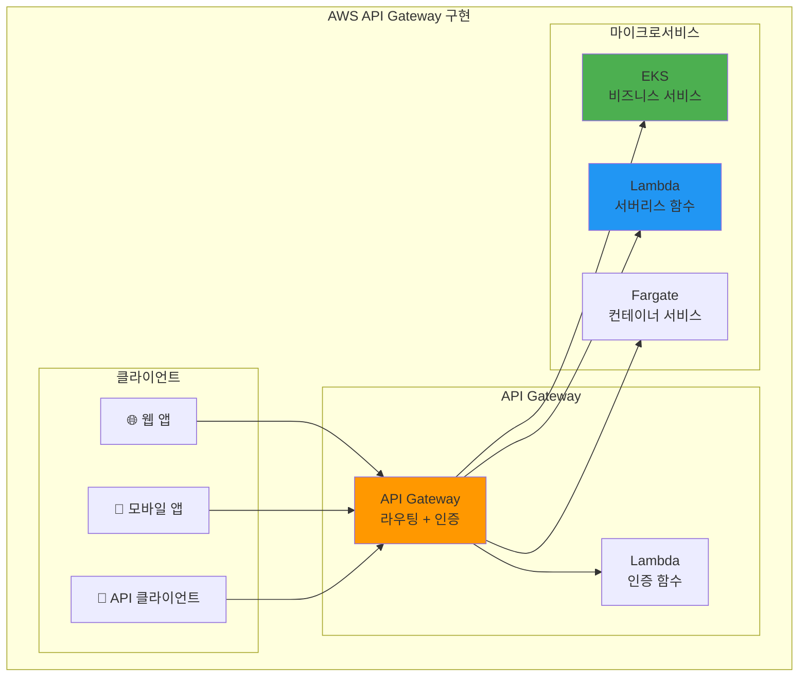
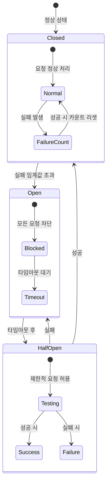
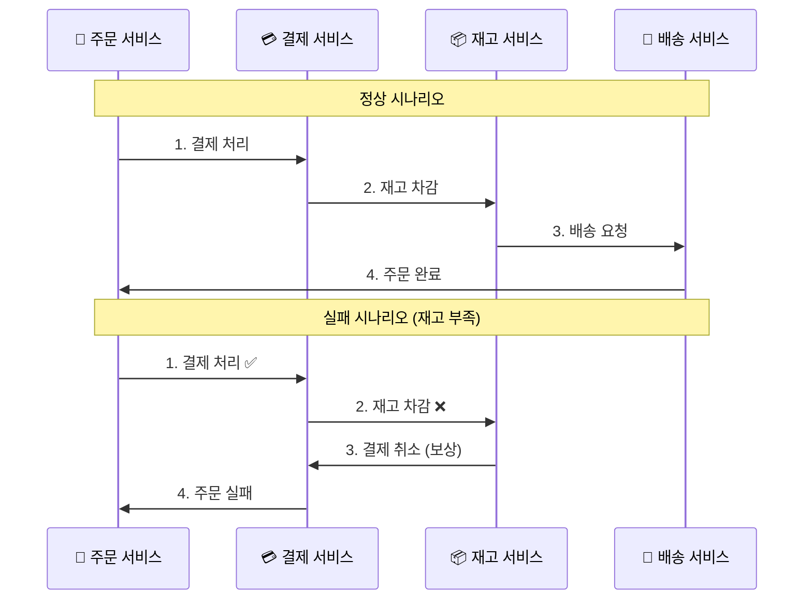
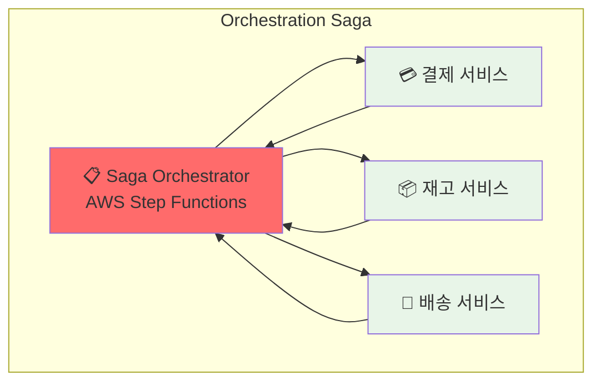
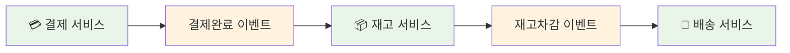
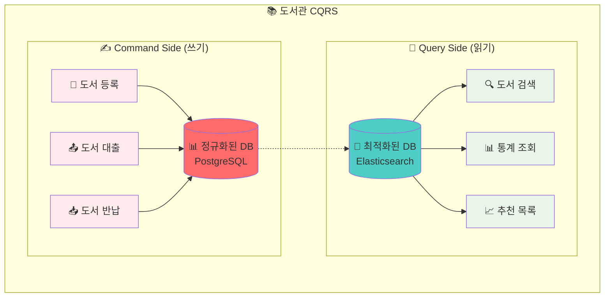
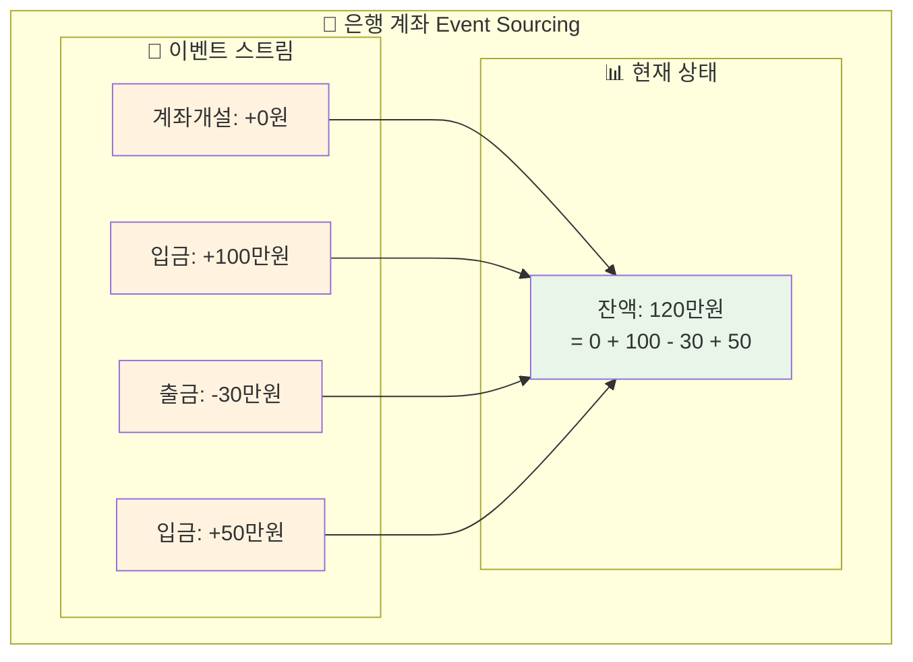
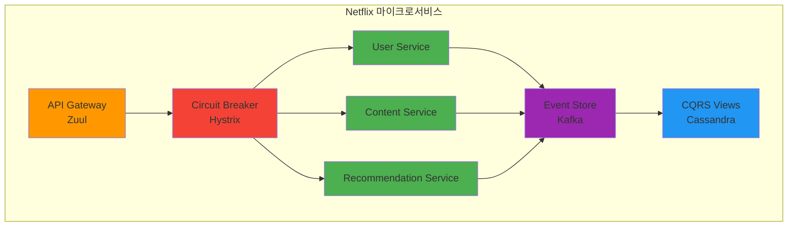

# Week 4 Day 1 Session 3: 마이크로서비스 패턴 - 실무 중심 (개선 버전)

<div align="center">

**🔧 핵심 패턴** • **⚖️ 선택 기준** • **🛠️ 실무 적용** • **📊 성능 비교**

*언제, 어떤 패턴을 사용해야 하는가?*

</div>

---

## 🕘 세션 정보
**시간**: 10:50-11:40 (50분)  
**목표**: 실무에서 검증된 마이크로서비스 패턴과 선택 기준 습득  
**방식**: 패턴별 실무 사례 + 선택 기준 + 트레이드오프 분석

## 🎯 세션 목표

### 📚 학습 목표
- **패턴 이해**: 5가지 핵심 패턴의 목적과 동작 원리
- **선택 기준**: 상황별 최적 패턴 선택 능력
- **트레이드오프**: 각 패턴의 장단점과 비용 분석

### 🤔 왜 필요한가? (3분)

**현실 문제 상황**:
- 🔥 **장애 전파**: 하나의 서비스 장애가 전체 시스템 마비
- 🐌 **성능 저하**: 서비스 간 호출이 많아져서 응답 시간 증가
- 💸 **비용 폭증**: 불필요한 동기 호출로 인프라 비용 상승
- 🔄 **데이터 불일치**: 분산 트랜잭션 실패로 데이터 정합성 문제

---

## 📊 패턴 선택 매트릭스 (5분)

### 🎯 상황별 패턴 선택 가이드

| 상황 | 추천 패턴 | 복잡도 | 성능 영향 | 운영 부담 | 비용 |
|------|----------|--------|----------|----------|------|
| **외부 API 호출** | Circuit Breaker | ⭐⭐ | ⭐ | ⭐⭐ | 💰 |
| **여러 서비스 조합** | API Gateway | ⭐⭐⭐ | ⭐⭐ | ⭐⭐⭐ | 💰💰 |
| **분산 트랜잭션** | Saga | ⭐⭐⭐⭐ | ⭐⭐⭐ | ⭐⭐⭐⭐ | 💰💰💰 |
| **읽기/쓰기 분리** | CQRS | ⭐⭐⭐⭐⭐ | ⭐⭐⭐⭐ | ⭐⭐⭐⭐⭐ | 💰💰💰💰 |
| **이벤트 기반 통신** | Event Sourcing | ⭐⭐⭐⭐⭐ | ⭐⭐⭐⭐⭐ | ⭐⭐⭐⭐⭐ | 💰💰💰💰💰 |

---

## 📖 핵심 패턴 (35분)

### 🔍 패턴 1: API Gateway - 단일 진입점 (8분)

> **정의**: 모든 클라이언트 요청을 받아 적절한 마이크로서비스로 라우팅하는 패턴

**🏢 실생활 비유 - 호텔 컨시어지**:


**핵심 기능**:
1. **라우팅**: 요청을 적절한 서비스로 전달
2. **인증/인가**: 통합 보안 처리
3. **요청/응답 변환**: 클라이언트별 데이터 형식 변환
4. **모니터링**: 통합 로깅 및 메트릭 수집

**☁️ AWS 구현**:


**실무 적용 기준**:
- ✅ **사용해야 할 때**: 클라이언트 종류가 다양할 때
- ⚠️ **주의할 점**: 단일 장애점이 될 수 있음
- 💰 **비용**: 요청당 과금, 월 $3-10/1M requests

### 🔍 패턴 2: Circuit Breaker - 장애 전파 방지 (8분)

> **정의**: 외부 서비스 호출 실패 시 자동으로 차단하여 시스템 안정성을 보장하는 패턴

**⚡ 실생활 비유 - 전기 차단기**:


**Netflix Hystrix 사례**:
- **문제**: 외부 API 지연으로 전체 시스템 응답 시간 증가
- **해결**: Circuit Breaker로 장애 서비스 차단
- **결과**: 99.99% 가용성 달성, 평균 응답시간 50% 개선

**☁️ AWS 구현 방법**:
```yaml
# AWS App Mesh Circuit Breaker 설정
apiVersion: appmesh.k8s.aws/v1beta2
kind: VirtualNode
spec:
  listeners:
  - outlierDetection:
      maxServerErrors: 5      # 최대 실패 횟수
      interval: 30s           # 측정 간격
      baseEjectionDuration: 15s # 차단 시간
      maxEjectionPercent: 50  # 최대 차단 비율
```

**실무 적용 기준**:
- ✅ **필수 적용**: 외부 API, 데이터베이스 호출
- 📊 **임계값 설정**: 실패율 50%, 응답시간 5초
- 🔄 **복구 전략**: 점진적 트래픽 증가

### 🔍 패턴 3: Saga - 분산 트랜잭션 관리 (8분)

> **정의**: 여러 서비스에 걸친 트랜잭션을 보상 트랜잭션으로 관리하는 패턴

**🛒 실생활 비유 - 온라인 주문 처리**:


**Saga 패턴 유형**:

**1. Orchestration (중앙 집중)**:


**2. Choreography (분산 조정)**:


**☁️ AWS Step Functions 구현**:
```json
{
  "Comment": "주문 처리 Saga",
  "StartAt": "ProcessPayment",
  "States": {
    "ProcessPayment": {
      "Type": "Task",
      "Resource": "arn:aws:lambda:us-east-1:123456789012:function:ProcessPayment",
      "Catch": [{
        "ErrorEquals": ["States.ALL"],
        "Next": "PaymentFailed"
      }],
      "Next": "UpdateInventory"
    },
    "UpdateInventory": {
      "Type": "Task", 
      "Resource": "arn:aws:lambda:us-east-1:123456789012:function:UpdateInventory",
      "Catch": [{
        "ErrorEquals": ["States.ALL"],
        "Next": "CompensatePayment"
      }],
      "Next": "CreateShipment"
    }
  }
}
```

**실무 적용 기준**:
- ✅ **사용 시기**: 2개 이상 서비스의 데이터 변경
- ⚖️ **패턴 선택**: 단순한 경우 Choreography, 복잡한 경우 Orchestration
- 💰 **비용**: Step Functions $25/1M transitions

### 🔍 패턴 4: CQRS - 읽기/쓰기 분리 (6분)

> **정의**: Command(쓰기)와 Query(읽기)를 별도 모델로 분리하는 패턴

**📚 실생활 비유 - 도서관 시스템**:


**적용 기준**:
- ✅ **사용해야 할 때**: 읽기와 쓰기 패턴이 크게 다를 때
- 📊 **성능 개선**: 읽기 성능 10-100배 향상 가능
- ⚠️ **복잡도 증가**: 데이터 동기화 복잡성

### 🔍 패턴 5: Event Sourcing - 이벤트 기반 상태 관리 (5분)

> **정의**: 상태 변경을 이벤트 스트림으로 저장하고 재생하여 현재 상태를 구성하는 패턴

**🏦 실생활 비유 - 은행 거래 내역**:


**장점과 단점**:
- ✅ **완전한 감사 추적**: 모든 변경 이력 보존
- ✅ **시점별 상태 복원**: 과거 임의 시점 상태 재구성
- ⚠️ **복잡한 쿼리**: 현재 상태 조회 시 이벤트 재생 필요
- ⚠️ **스토리지 증가**: 모든 이벤트 영구 저장

---

## 🎯 패턴 조합 전략 (7분)

### 📊 실무 패턴 조합 사례

**Netflix 아키텍처**:


**패턴 조합 가이드**:
1. **기본 조합**: API Gateway + Circuit Breaker
2. **트랜잭션 필요**: + Saga Pattern
3. **고성능 읽기**: + CQRS
4. **완전한 감사**: + Event Sourcing

### 💰 비용 대비 효과 분석

| 패턴 조합 | 개발 비용 | 운영 비용 | 성능 향상 | 안정성 향상 |
|----------|----------|----------|----------|------------|
| **Gateway + Circuit Breaker** | 💰💰 | 💰💰 | ⭐⭐⭐ | ⭐⭐⭐⭐ |
| **+ Saga** | 💰💰💰 | 💰💰💰 | ⭐⭐ | ⭐⭐⭐⭐⭐ |
| **+ CQRS** | 💰💰💰💰 | 💰💰💰💰 | ⭐⭐⭐⭐⭐ | ⭐⭐⭐ |
| **+ Event Sourcing** | 💰💰💰💰💰 | 💰💰💰💰💰 | ⭐⭐⭐⭐ | ⭐⭐⭐⭐⭐ |

---

## 🔑 핵심 키워드

- **API Gateway**: 단일 진입점, 라우팅, 인증/인가
- **Circuit Breaker**: 장애 전파 방지, 자동 복구
- **Saga Pattern**: 분산 트랜잭션, 보상 트랜잭션
- **CQRS**: Command Query Responsibility Segregation
- **Event Sourcing**: 이벤트 기반 상태 관리

---

## 📝 세션 마무리

### ✅ 오늘 세션 성과
- [ ] **5가지 핵심 패턴** 이해 및 적용 기준 습득
- [ ] **패턴 선택 매트릭스**로 상황별 최적 패턴 선택 능력
- [ ] **실무 사례**를 통한 패턴 조합 전략 이해
- [ ] **비용 대비 효과** 분석으로 현실적 적용 방안 도출

### 🎯 다음 실습 준비
- **모놀리스 분해**: 오늘 배운 패턴들을 실제 적용
- **통신 구현**: API Gateway, Circuit Breaker 직접 구현
- **Saga 패턴**: Step Functions를 이용한 분산 트랜잭션

### 💡 실무 적용 팁
1. **단계적 도입**: API Gateway → Circuit Breaker → Saga 순서
2. **측정 기반**: 성능과 안정성 지표로 패턴 효과 검증
3. **비용 고려**: 복잡한 패턴일수록 운영 비용 증가 고려
4. **팀 역량**: 팀의 기술 수준에 맞는 패턴 선택

---

<div align="center">

**🔧 실무 검증 패턴** • **⚖️ 명확한 선택 기준** • **📊 비용 효율성** • **🚀 점진적 적용**

*상황에 맞는 최적 패턴으로 안정적인 마이크로서비스 구축*

</div>
