# Week 4 Day 1 Session 3: 마이크로서비스 패턴 - 실무 중심 (개선 버전)

<div align="center">

**🔧 핵심 패턴** • **⚖️ 선택 기준** • **🛠️ 실무 적용** • **📊 성능 비교**

*언제, 어떤 패턴을 사용해야 하는가?*

</div>

---

## 🕘 세션 정보
**시간**: 10:50-11:40 (50분)  
**목표**: 실무에서 검증된 마이크로서비스 패턴과 선택 기준 습득  
**방식**: 패턴별 실무 사례 + 선택 기준 + 트레이드오프 분석

## 🎯 세션 목표

### 📚 학습 목표
- **패턴 이해**: 5가지 핵심 패턴의 목적과 동작 원리
- **선택 기준**: 상황별 최적 패턴 선택 능력
- **트레이드오프**: 각 패턴의 장단점과 비용 분석

### 🤔 왜 필요한가? (3분)

**현실 문제 상황**:
- 🔥 **장애 전파**: 하나의 서비스 장애가 전체 시스템 마비
- 🐌 **성능 저하**: 서비스 간 호출이 많아져서 응답 시간 증가
- 💸 **비용 폭증**: 불필요한 동기 호출로 인프라 비용 상승
- 🔄 **데이터 불일치**: 분산 트랜잭션 실패로 데이터 정합성 문제

---

## 📖 이론적 기반과 핵심 개념 (25분)

### 📐 분산 시스템 패턴 이론 (8분)

**분산 시스템의 근본적 문제들**:
```
Byzantine Generals Problem (1982):
- 분산 환경에서의 합의 문제
- 일부 노드의 악의적/오류 행동 가능성
- 해결책: 2/3 이상의 정상 노드 필요

Two Generals Problem:
- 네트워크 통신의 불확실성
- 메시지 전달 보장 불가능
- 완벽한 해결책 존재하지 않음

결론: 분산 시스템은 본질적으로 불완전
→ 패턴을 통한 위험 완화 필요
```

**패턴 이론 (Pattern Theory)**:
```
Christopher Alexander의 패턴 언어 (1977):
- 반복되는 문제에 대한 검증된 해결책
- 컨텍스트 + 문제 + 해결책 + 결과

소프트웨어 패턴 적용:
- Gang of Four (GoF) 디자인 패턴 (1994)
- 엔터프라이즈 통합 패턴 (2003)
- 마이크로서비스 패턴 (2018)

패턴의 가치: 집단 지성의 결정체
```

### 🔍 통신 패턴 이론 (8분)

**동기 vs 비동기 통신 이론**:
```
동기 통신 (Synchronous):
- Blocking I/O: 응답 대기 중 스레드 블록
- 장점: 단순한 프로그래밍 모델
- 단점: 연쇄 장애 (Cascading Failure)
- 적용: 실시간 응답 필요, 강한 일관성

비동기 통신 (Asynchronous):
- Non-blocking I/O: 응답 대기 중 다른 작업 수행
- 장점: 높은 처리량, 장애 격리
- 단점: 복잡한 프로그래밍 모델
- 적용: 높은 처리량, 최종 일관성 허용
```

**메시지 패턴 분류**:
```
Request-Response Pattern: 1:1 동기 통신
Publish-Subscribe Pattern: 1:N 비동기 통신
Message Queue Pattern: 1:1 비동기 통신
```

### 🔍 장애 처리 패턴 이론 (9분)

**장애 모델 (Failure Models)**:
```
Crash Failure: 프로세스 중단 (감지 가능)
Omission Failure: 메시지 누락 (타임아웃으로 감지)
Byzantine Failure: 임의적 오동작 (가장 복잡)

장애 처리 전략:
- Fail-Fast: 빠른 실패 감지
- Fail-Safe: 안전한 상태로 전환
- Fail-Over: 대체 시스템으로 전환
```

**회복력 패턴 (Resilience Patterns)**:
```
Circuit Breaker Pattern:
- 전기 회로 차단기에서 영감
- 상태 기계: Closed → Open → Half-Open
- 장애 전파 방지

Bulkhead Pattern:
- 선박의 격벽에서 영감
- 리소스 격리로 장애 영향 범위 제한

Timeout Pattern:
- 무한 대기 방지
- 시스템 응답성 보장
```

**데이터 일관성 패턴 이론**:
```
일관성 모델 스펙트럼:
Strong Consistency → Weak Consistency

Saga 패턴의 이론적 기반:
- Long Running Transaction의 한계
- Compensating Transaction 개념
- 비즈니스적 보상 vs 기술적 롤백

Saga 수학적 모델:
T = T₁ → T₂ → ... → Tₙ (정상)
실패 시: T₁ → ... → Tₖ → Cₖ₋₁ → ... → C₁
```

---

## 📊 패턴 선택 매트릭스 (10분)

### 🎯 상황별 패턴 선택 가이드

| 상황 | 추천 패턴 | 복잡도 | 성능 영향 | 운영 부담 | 비용 |
|------|----------|--------|----------|----------|------|
| **외부 API 호출** | Circuit Breaker | ⭐⭐ | ⭐ | ⭐⭐ | 💰 |
| **여러 서비스 조합** | API Gateway | ⭐⭐⭐ | ⭐⭐ | ⭐⭐⭐ | 💰💰 |
| **분산 트랜잭션** | Saga | ⭐⭐⭐⭐ | ⭐⭐⭐ | ⭐⭐⭐⭐ | 💰💰💰 |
| **읽기/쓰기 분리** | CQRS | ⭐⭐⭐⭐⭐ | ⭐⭐⭐⭐ | ⭐⭐⭐⭐⭐ | 💰💰💰💰 |
| **이벤트 기반 통신** | Event Sourcing | ⭐⭐⭐⭐⭐ | ⭐⭐⭐⭐⭐ | ⭐⭐⭐⭐⭐ | 💰💰💰💰💰 |

---

## 📖 핵심 패턴과 산업별 적용 사례 (25분)

### 🔍 패턴 1: API Gateway - 단일 진입점 (8분)

> **정의**: 모든 클라이언트 요청을 받아 적절한 마이크로서비스로 라우팅하는 패턴

#### 🏦 금융업 사례: "FinanceBank" 디지털 뱅킹

**비즈니스 요구사항**:
- 웹/모바일/ATM 다양한 채널 지원
- 강력한 보안 및 인증 필요
- 거래별 로깅 및 감사 추적

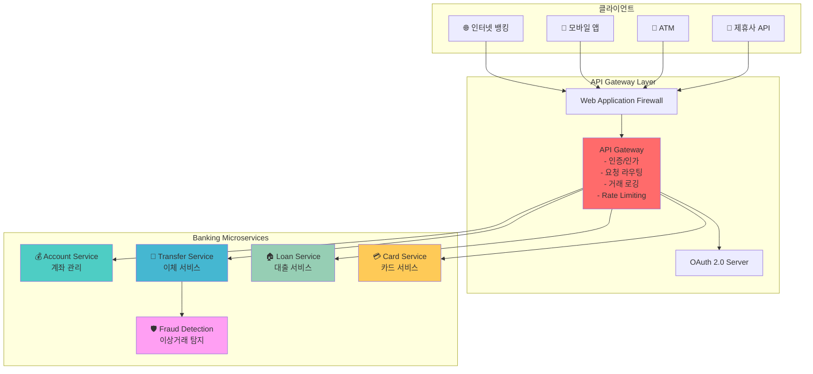

**핵심 구현 요소**:
```yaml
API Gateway 기능:
  인증/인가:
    - JWT 토큰 검증
    - OAuth 2.0 통합
    - 2FA (Two-Factor Authentication)
  
  라우팅 규칙:
    - /api/v1/accounts/* → Account Service
    - /api/v1/transfers/* → Transfer Service
    - /api/v1/loans/* → Loan Service
  
  보안 정책:
    - Rate Limiting: 사용자당 분당 100회
    - IP 화이트리스트
    - 거래 금액별 추가 인증
  
  감사 로깅:
    - 모든 거래 요청/응답 로깅
    - 개인정보 마스킹
    - 실시간 이상 거래 알림
```

#### 🛒 이커머스 사례: "GlobalMart" 글로벌 쇼핑몰

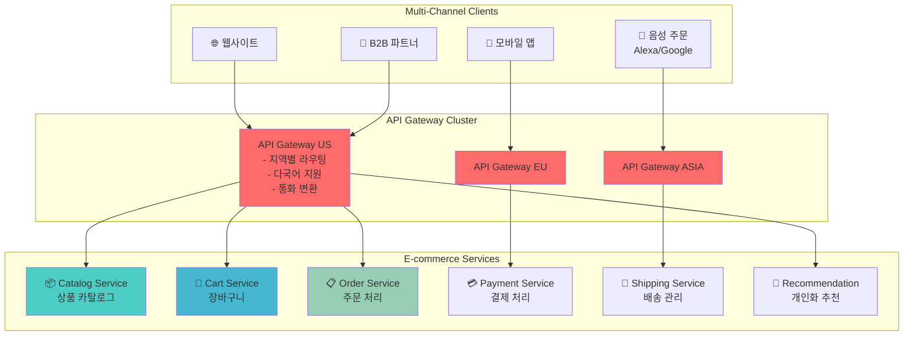

### 🔍 패턴 2: Circuit Breaker - 장애 전파 방지 (8분)

#### 🎬 스트리밍 서비스 사례: "StreamFlix" 동영상 플랫폼

**비즈니스 요구사항**:
- 99.99% 가용성 필요
- 외부 CDN 및 결제 서비스 의존
- 피크 시간 트래픽 급증 대응

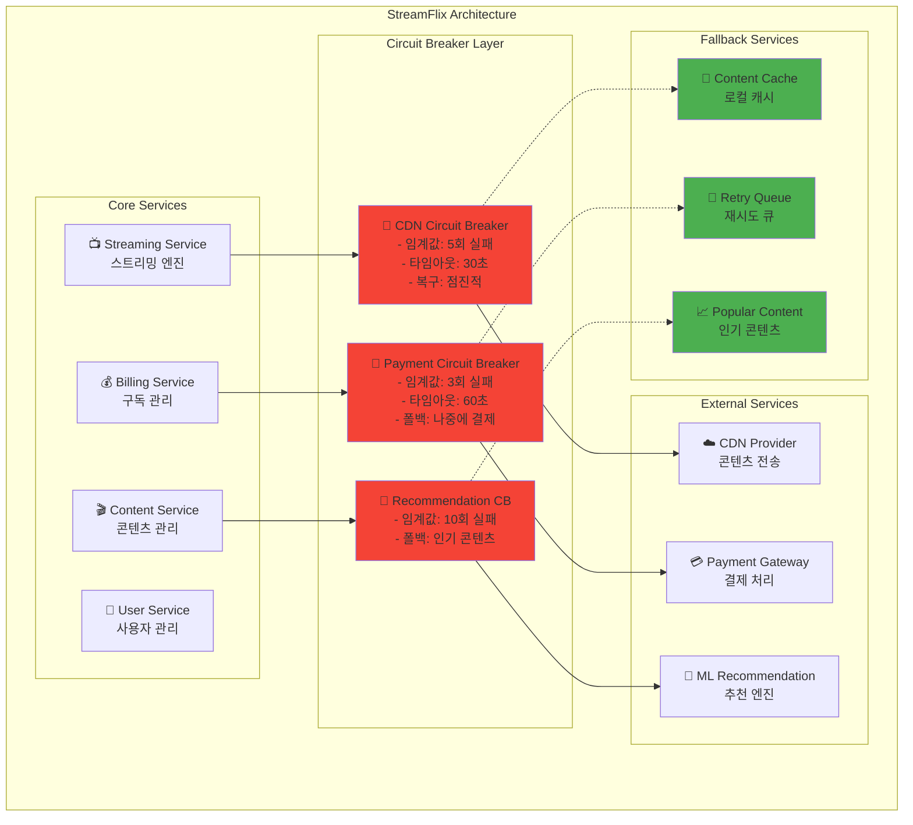

**Circuit Breaker 설정**:
```yaml
CDN Circuit Breaker:
  실패 임계값: 5회 연속 실패
  타임아웃: 30초
  복구 전략: 점진적 트래픽 증가 (10% → 50% → 100%)
  폴백 동작: 로컬 캐시에서 콘텐츠 제공
  
Payment Circuit Breaker:
  실패 임계값: 3회 연속 실패
  타임아웃: 60초
  폴백 동작: "나중에 결제" 큐에 저장
  알림: 즉시 운영팀에 알림 발송
  
Recommendation Circuit Breaker:
  실패 임계값: 10회 연속 실패
  타임아웃: 15초
  폴백 동작: 인기 콘텐츠 목록 반환
  성능 영향: 사용자 경험 저하 최소화
```

### 🔍 패턴 3: Saga - 분산 트랜잭션 관리 (9분)

#### 🚗 모빌리티 서비스 사례: "RideShare" 차량 공유

**비즈니스 요구사항**:
- 실시간 차량 매칭
- 복잡한 요금 계산
- 다중 결제 수단 지원

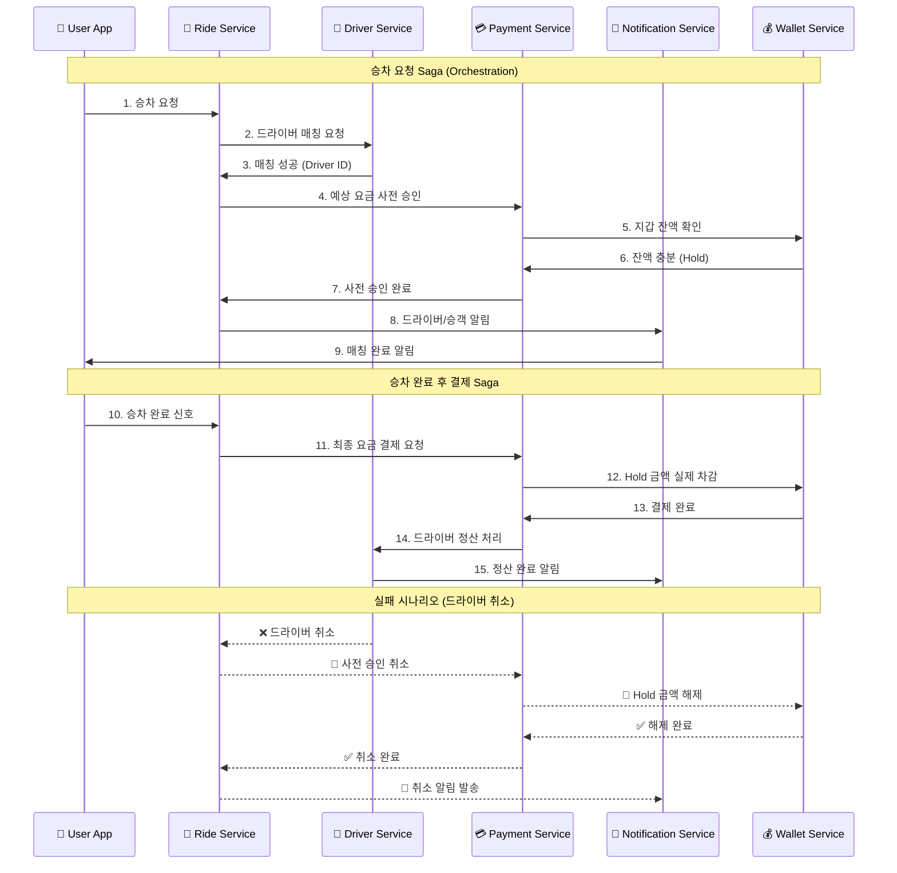

**Saga 패턴 구현**:
```yaml
Ride Booking Saga:
  단계:
    1. 승차 요청 생성
    2. 드라이버 매칭
    3. 요금 사전 승인
    4. 알림 발송
  
  보상 트랜잭션:
    1. 승차 요청 취소
    2. 드라이버 매칭 해제
    3. 사전 승인 취소
    4. 취소 알림 발송
  
  타임아웃 정책:
    - 드라이버 매칭: 5분
    - 결제 승인: 30초
    - 전체 Saga: 10분
```

#### 🏥 헬스케어 사례: "MediCare" 의료 예약 시스템

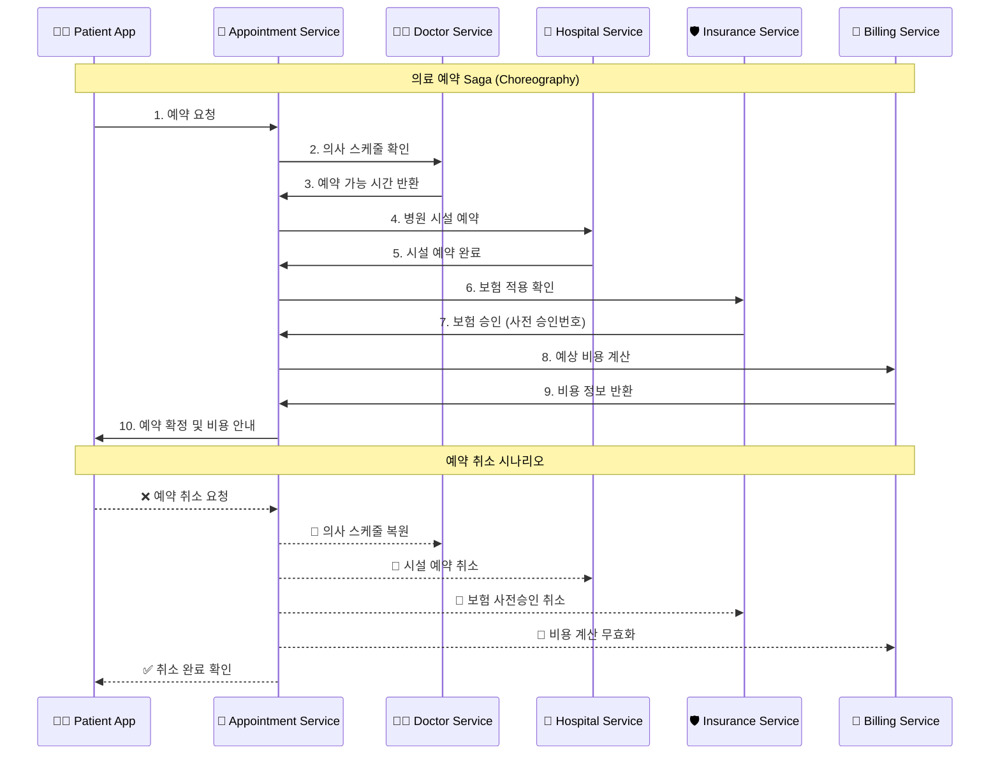

### 🔍 패턴 4: CQRS - 읽기/쓰기 분리 (실시간 분석이 중요한 산업) (5분)

#### 📊 핀테크 사례: "TradingPro" 주식 거래 플랫폼

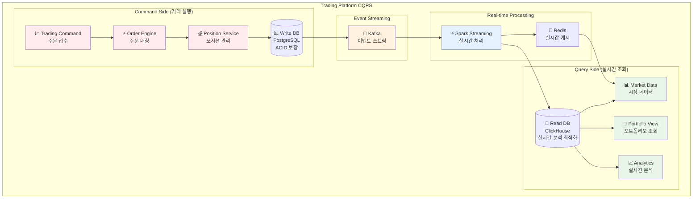

**CQRS 구현 세부사항**:
```yaml
Command Side (쓰기):
  - 주문 접수 및 검증
  - 실시간 매칭 엔진
  - 포지션 업데이트
  - 강한 일관성 (ACID)
  
Query Side (읽기):
  - 실시간 차트 데이터
  - 포트폴리오 현황
  - 수익률 분석
  - 최종 일관성 (수초 지연 허용)
  
성능 최적화:
  - 쓰기: 초당 10만 건 주문 처리
  - 읽기: 밀리초 단위 응답시간
  - 캐싱: Redis로 핫 데이터 캐싱
```

---

### 🔍 패턴 1: API Gateway - 단일 진입점 (8분)

> **정의**: 모든 클라이언트 요청을 받아 적절한 마이크로서비스로 라우팅하는 패턴

**🏢 실생활 비유 - 호텔 컨시어지**:
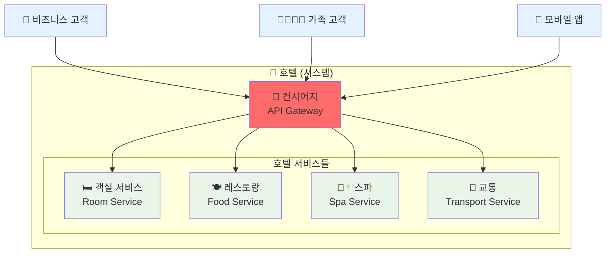

**핵심 기능**:
1. **라우팅**: 요청을 적절한 서비스로 전달
2. **인증/인가**: 통합 보안 처리
3. **요청/응답 변환**: 클라이언트별 데이터 형식 변환
4. **모니터링**: 통합 로깅 및 메트릭 수집

**☁️ AWS 구현**:
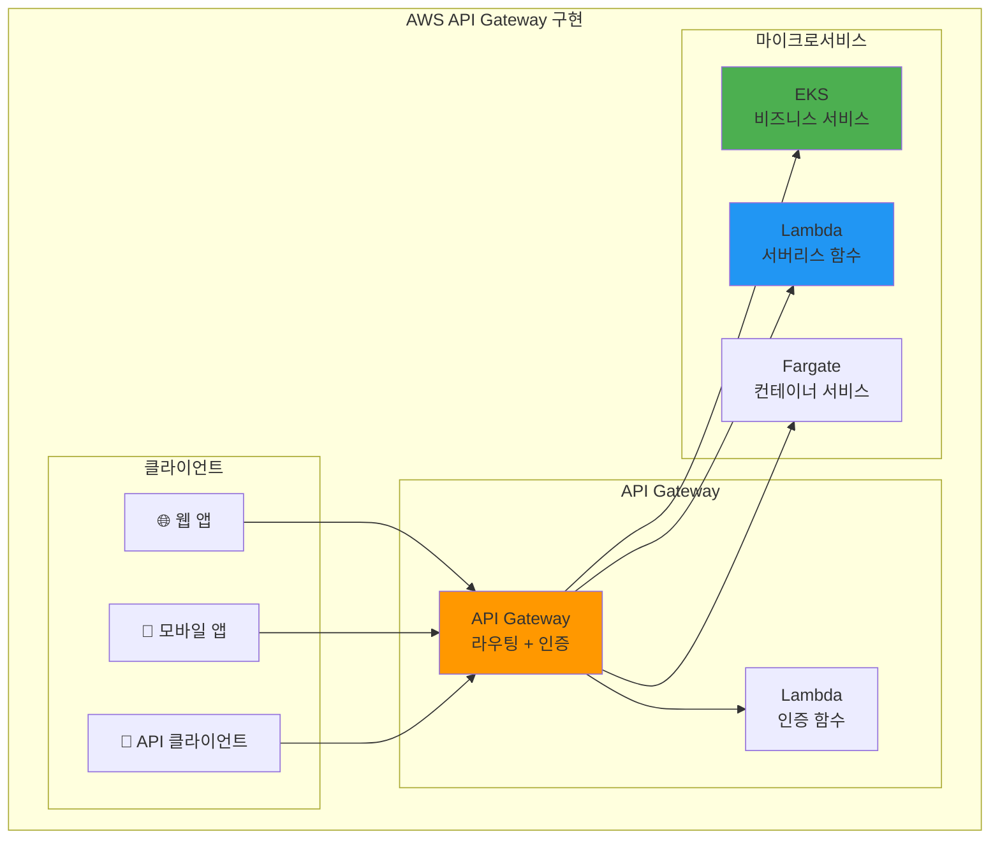

**실무 적용 기준**:
- ✅ **사용해야 할 때**: 클라이언트 종류가 다양할 때
- ⚠️ **주의할 점**: 단일 장애점이 될 수 있음
- 💰 **비용**: 요청당 과금, 월 $3-10/1M requests

### 🔍 패턴 2: Circuit Breaker - 장애 전파 방지 (8분)

> **정의**: 외부 서비스 호출 실패 시 자동으로 차단하여 시스템 안정성을 보장하는 패턴

**⚡ 실생활 비유 - 전기 차단기**:
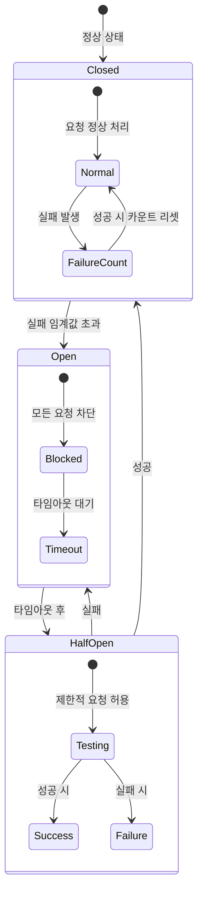

**Netflix Hystrix 사례**:
- **문제**: 외부 API 지연으로 전체 시스템 응답 시간 증가
- **해결**: Circuit Breaker로 장애 서비스 차단
- **결과**: 99.99% 가용성 달성, 평균 응답시간 50% 개선

**☁️ AWS 구현 방법**:
```yaml
# AWS App Mesh Circuit Breaker 설정
apiVersion: appmesh.k8s.aws/v1beta2
kind: VirtualNode
spec:
  listeners:
  - outlierDetection:
      maxServerErrors: 5      # 최대 실패 횟수
      interval: 30s           # 측정 간격
      baseEjectionDuration: 15s # 차단 시간
      maxEjectionPercent: 50  # 최대 차단 비율
```

**실무 적용 기준**:
- ✅ **필수 적용**: 외부 API, 데이터베이스 호출
- 📊 **임계값 설정**: 실패율 50%, 응답시간 5초
- 🔄 **복구 전략**: 점진적 트래픽 증가

### 🔍 패턴 3: Saga - 분산 트랜잭션 관리 (8분)

> **정의**: 여러 서비스에 걸친 트랜잭션을 보상 트랜잭션으로 관리하는 패턴

**🛒 실생활 비유 - 온라인 주문 처리**:
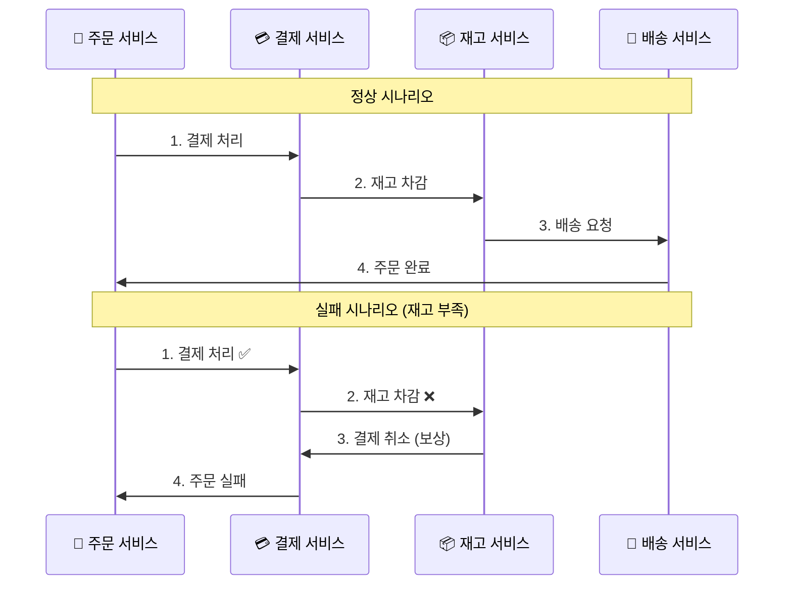

**Saga 패턴 유형**:

**1. Orchestration (중앙 집중)**:
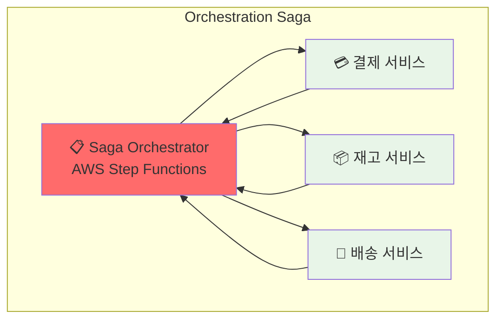

**2. Choreography (분산 조정)**:
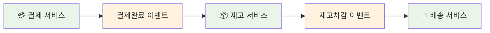

**☁️ AWS Step Functions 구현**:
```json
{
  "Comment": "주문 처리 Saga",
  "StartAt": "ProcessPayment",
  "States": {
    "ProcessPayment": {
      "Type": "Task",
      "Resource": "arn:aws:lambda:us-east-1:123456789012:function:ProcessPayment",
      "Catch": [{
        "ErrorEquals": ["States.ALL"],
        "Next": "PaymentFailed"
      }],
      "Next": "UpdateInventory"
    },
    "UpdateInventory": {
      "Type": "Task", 
      "Resource": "arn:aws:lambda:us-east-1:123456789012:function:UpdateInventory",
      "Catch": [{
        "ErrorEquals": ["States.ALL"],
        "Next": "CompensatePayment"
      }],
      "Next": "CreateShipment"
    }
  }
}
```

**실무 적용 기준**:
- ✅ **사용 시기**: 2개 이상 서비스의 데이터 변경
- ⚖️ **패턴 선택**: 단순한 경우 Choreography, 복잡한 경우 Orchestration
- 💰 **비용**: Step Functions $25/1M transitions

### 🔍 패턴 4: CQRS - 읽기/쓰기 분리 (6분)

> **정의**: Command(쓰기)와 Query(읽기)를 별도 모델로 분리하는 패턴

**📚 실생활 비유 - 도서관 시스템**:
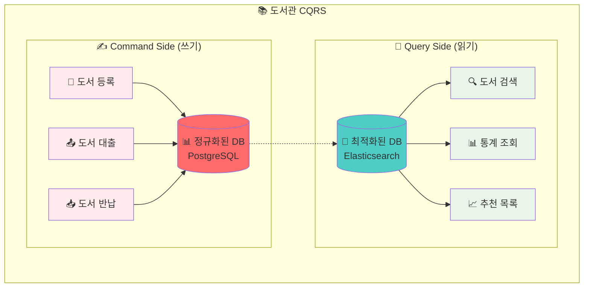

**적용 기준**:
- ✅ **사용해야 할 때**: 읽기와 쓰기 패턴이 크게 다를 때
- 📊 **성능 개선**: 읽기 성능 10-100배 향상 가능
- ⚠️ **복잡도 증가**: 데이터 동기화 복잡성

### 🔍 패턴 5: Event Sourcing - 이벤트 기반 상태 관리 (5분)

> **정의**: 상태 변경을 이벤트 스트림으로 저장하고 재생하여 현재 상태를 구성하는 패턴

**🏦 실생활 비유 - 은행 거래 내역**:
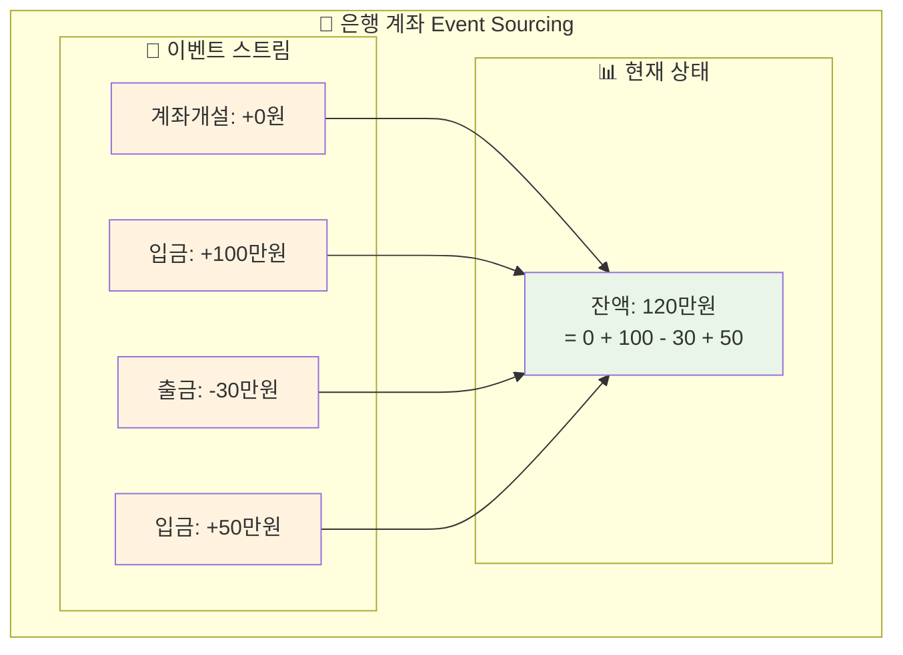

**장점과 단점**:
- ✅ **완전한 감사 추적**: 모든 변경 이력 보존
- ✅ **시점별 상태 복원**: 과거 임의 시점 상태 재구성
- ⚠️ **복잡한 쿼리**: 현재 상태 조회 시 이벤트 재생 필요
- ⚠️ **스토리지 증가**: 모든 이벤트 영구 저장

---

## 🎯 산업별 패턴 조합 전략 (10분)

### 📊 산업별 패턴 적용 매트릭스

| 산업군 | 주요 패턴 | 핵심 요구사항 | 아키텍처 특징 |
|--------|----------|---------------|---------------|
| **🏦 금융** | API Gateway + Circuit Breaker + Saga | 보안, 규제준수, 정확성 | 강한 일관성, 감사 추적 |
| **🛒 이커머스** | API Gateway + CQRS + Event Sourcing | 확장성, 개인화, 글로벌 | 최종 일관성, 높은 처리량 |
| **🎬 미디어** | Circuit Breaker + CDN + Cache | 가용성, 성능, 글로벌 배포 | 지역별 분산, 캐싱 중심 |
| **🚗 모빌리티** | Saga + Event-Driven + Real-time | 실시간성, 위치기반, 매칭 | 이벤트 기반, 지리적 분산 |
| **🏥 헬스케어** | Saga + RBAC + Audit | 규제준수, 개인정보보호 | 강한 보안, 완전한 감사 |
| **🎮 게임** | Event Sourcing + CQRS + Cache | 실시간성, 상태 관리 | 이벤트 기반, 빠른 응답 |

### 🏗️ 통합 아키텍처 예시: "SuperApp" 슈퍼앱

**비즈니스 요구사항**: 금융 + 이커머스 + 모빌리티 통합 서비스

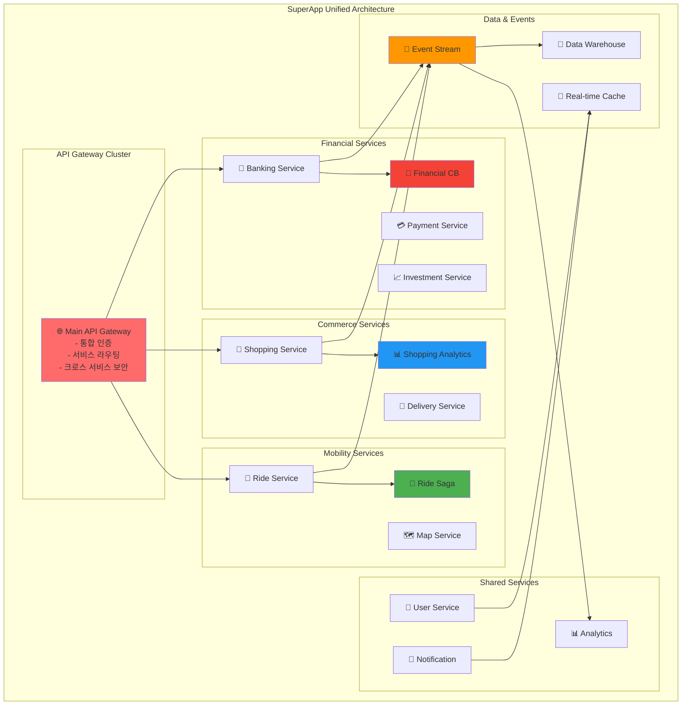

**패턴 조합 전략**:
```yaml
Cross-Service Patterns:
  API Gateway:
    - 통합 인증 (SSO)
    - 서비스 간 라우팅
    - 크로스 도메인 보안
  
  Event-Driven Integration:
    - 서비스 간 느슨한 결합
    - 실시간 데이터 동기화
    - 크로스 서비스 분석
  
  Shared Data Strategy:
    - User Profile 공유
    - 통합 알림 시스템
    - 크로스 서비스 추천

Service-Specific Patterns:
  Financial: Circuit Breaker + Saga
  Commerce: CQRS + Event Sourcing  
  Mobility: Saga + Real-time Processing
```

### 💡 패턴 선택 가이드라인

**1. 비즈니스 특성 기반 선택**:
```
높은 정확성 요구 → Saga Pattern
실시간 분석 필요 → CQRS Pattern
외부 의존성 많음 → Circuit Breaker
다양한 클라이언트 → API Gateway
완전한 감사 필요 → Event Sourcing
```

**2. 기술적 제약 고려**:
```
팀 규모 < 10명 → 단순한 패턴 (API Gateway + Circuit Breaker)
팀 규모 > 20명 → 복합 패턴 (CQRS + Event Sourcing + Saga)
레거시 시스템 → 점진적 패턴 도입
클라우드 네이티브 → 모든 패턴 활용 가능
```

**3. 운영 복잡도 관리**:
```
패턴 복잡도 순서:
API Gateway < Circuit Breaker < Saga < CQRS < Event Sourcing

권장 도입 순서:
1단계: API Gateway + Circuit Breaker
2단계: + Saga Pattern  
3단계: + CQRS (필요시)
4단계: + Event Sourcing (고급 요구사항)
```

---

### 📊 실무 패턴 조합 사례

**Netflix 아키텍처**:
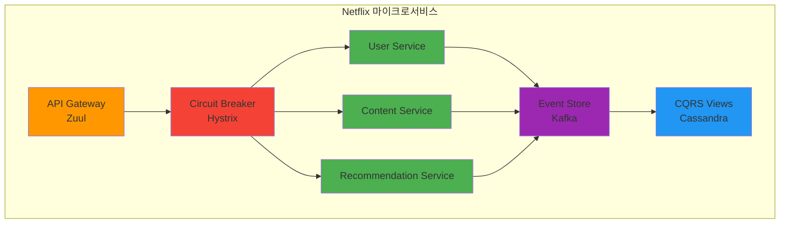

**패턴 조합 가이드**:
1. **기본 조합**: API Gateway + Circuit Breaker
2. **트랜잭션 필요**: + Saga Pattern
3. **고성능 읽기**: + CQRS
4. **완전한 감사**: + Event Sourcing

### 💰 비용 대비 효과 분석

| 패턴 조합 | 개발 비용 | 운영 비용 | 성능 향상 | 안정성 향상 |
|----------|----------|----------|----------|------------|
| **Gateway + Circuit Breaker** | 💰💰 | 💰💰 | ⭐⭐⭐ | ⭐⭐⭐⭐ |
| **+ Saga** | 💰💰💰 | 💰💰💰 | ⭐⭐ | ⭐⭐⭐⭐⭐ |
| **+ CQRS** | 💰💰💰💰 | 💰💰💰💰 | ⭐⭐⭐⭐⭐ | ⭐⭐⭐ |
| **+ Event Sourcing** | 💰💰💰💰💰 | 💰💰💰💰💰 | ⭐⭐⭐⭐ | ⭐⭐⭐⭐⭐ |

---

## 🔑 핵심 키워드

- **API Gateway**: 단일 진입점, 라우팅, 인증/인가
- **Circuit Breaker**: 장애 전파 방지, 자동 복구
- **Saga Pattern**: 분산 트랜잭션, 보상 트랜잭션
- **CQRS**: Command Query Responsibility Segregation
- **Event Sourcing**: 이벤트 기반 상태 관리

---

## 📝 세션 마무리

### ✅ 오늘 세션 성과
- [ ] **5가지 핵심 패턴** 이해 및 적용 기준 습득
- [ ] **패턴 선택 매트릭스**로 상황별 최적 패턴 선택 능력
- [ ] **실무 사례**를 통한 패턴 조합 전략 이해
- [ ] **비용 대비 효과** 분석으로 현실적 적용 방안 도출

### 🎯 다음 실습 준비
- **모놀리스 분해**: 오늘 배운 패턴들을 실제 적용
- **통신 구현**: API Gateway, Circuit Breaker 직접 구현
- **Saga 패턴**: Step Functions를 이용한 분산 트랜잭션

### 💡 실무 적용 팁
1. **단계적 도입**: API Gateway → Circuit Breaker → Saga 순서
2. **측정 기반**: 성능과 안정성 지표로 패턴 효과 검증
3. **비용 고려**: 복잡한 패턴일수록 운영 비용 증가 고려
4. **팀 역량**: 팀의 기술 수준에 맞는 패턴 선택

---

<div align="center">

**🔧 실무 검증 패턴** • **⚖️ 명확한 선택 기준** • **📊 비용 효율성** • **🚀 점진적 적용**

*상황에 맞는 최적 패턴으로 안정적인 마이크로서비스 구축*

</div>
