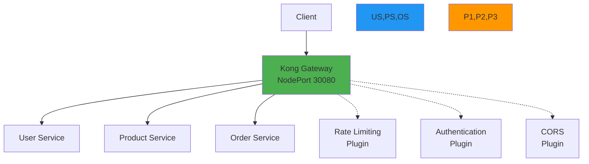
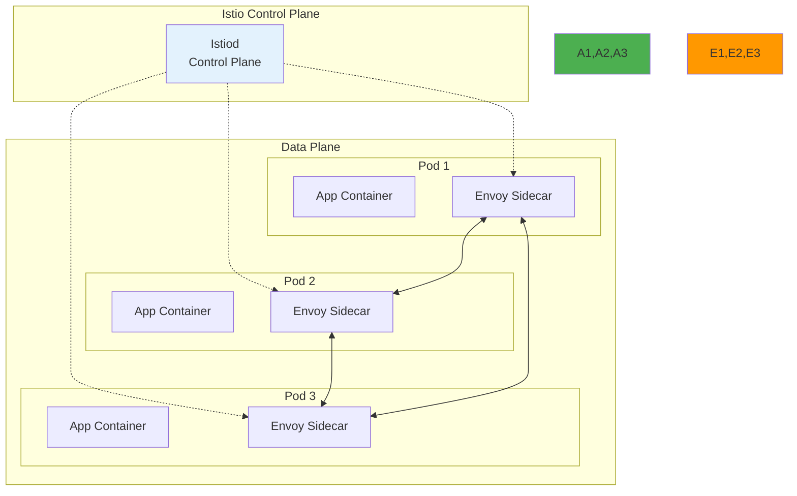

# Week 4 Day 2: API Gateway와 Service Mesh

<div align="center">

**🌐 단일 진입점** • **🦍 Kong** • **⛵ Istio** • **🎯 트래픽 관리**

*Ingress에서 전문 Gateway로, 그리고 Service Mesh까지*

</div>

---

## 🕘 일일 스케줄

### 📊 시간 배분
```
📚 이론 강의: 2.5시간 (50분×3세션) - 오전 집중 학습
🛠️ 실습 세션: 2시간 (50분×2세션) - Kong과 Istio 체험
🍽️ 점심시간: 1시간
👥 학생 케어: 개별 맞춤 지원 (필요시)
```

### 🗓️ 상세 스케줄
| 시간 | 구분 | 내용 | 목적 |
|------|------|------|------|
| **09:00-09:50** | 📚 이론 1 | [API Gateway 기초](./session_1.md) (50분) | Ingress → Gateway 진화 |
| **09:50-10:00** | ☕ 휴식 | 10분 휴식 | |
| **10:00-10:50** | 📚 이론 2 | [Kong vs Istio 비교](./session_2.md) (50분) | 구현체 선택 기준 |
| **10:50-11:00** | ☕ 휴식 | 10분 휴식 | |
| **11:00-11:50** | 📚 이론 3 | [고급 트래픽 관리](./session_3.md) (50분) | 카나리, A/B, 서킷 브레이커 |
| **11:50-12:00** | ☕ 휴식 | 10분 휴식 | |
| **12:00-12:50** | 🛠️ Lab 1 | [Kong API Gateway 구축](./lab_1.md) (50분) | Kong 실습 |
| **12:50-13:00** | ☕ 휴식 | 10분 휴식 | |
| **13:00-14:00** | 🍽️ 점심 | 점심시간 (60분) | |
| **14:00-14:50** | 🛠️ Hands-on 1 | [Istio Service Mesh 구축](./handson_1.md) (50분) | Istio 실습 |

---

## 🎯 일일 학습 목표

### 📚 이론 학습 목표
- **진화 이해**: Ingress → Kong/Istio로의 기술 진화 과정
- **비교 분석**: Kong (API Gateway) vs Istio (Service Mesh) 차이점
- **패턴 습득**: 카나리 배포, A/B 테스팅, 서킷 브레이커 등 고급 패턴
- **선택 기준**: 상황에 맞는 Gateway/Mesh 선택 능력

### 🛠️ 실습 학습 목표
- **Kong 구축**: API Gateway 설치 및 라우팅 구성
- **Istio 구축**: Service Mesh 설치 및 트래픽 관리
- **비교 체험**: Kong과 Istio의 실제 차이점 체감
- **실무 적용**: 프로덕션급 트래픽 관리 기법 습득

### 🤝 협업 학습 목표
- **아키텍처 토론**: Gateway vs Mesh 선택 토론
- **페어 실습**: Kong과 Istio 함께 구축
- **경험 공유**: 각자의 실습 결과 및 인사이트 공유

---

## 📚 이론 세션 개요

### Session 1: API Gateway 기초 - Ingress에서 전문 Gateway로 (50분)
> **핵심 질문**: "Ingress만으로는 왜 부족한가?"

**🔄 기술 진화 스토리**:
```
문제: 마이크로서비스 간 통신 복잡도 폭발
  ↓
해결 1: Nginx/HAProxy (리버스 프록시)
  ↓ 하지만 설정 파일 관리 복잡
해결 2: Kubernetes Ingress
  ↓ 하지만 기능 제한적 (L7 라우팅만)
해결 3: 전문 API Gateway (Kong, AWS API Gateway)
  ↓ 강력하지만 학습 곡선
해결 4: Service Mesh (Istio, Linkerd)
  ↓ 전체 인프라 관리
```

**학습 내용**:
- **Ingress의 한계**: Rate Limiting, 인증, 변환 등 불가
- **API Gateway 필요성**: 외부 트래픽 관리 전문화
- **주요 구현체**: Kong, AWS API Gateway, Nginx Plus
- **선택 기준**: 기능, 성능, 비용, 학습 곡선

**실무 연계**:
- Netflix, Uber의 Gateway 진화 과정
- 스타트업 vs 대기업의 선택 차이

### Session 2: Kong vs Istio 비교 - 올바른 선택 (50분)
> **핵심 질문**: "Kong과 Istio, 무엇이 다르고 언제 사용하는가?"

**🔄 핵심 차이점**:
```yaml
Kong (API Gateway):
  위치: 클러스터 경계 (Edge)
  역할: 외부 트래픽 관리 (North-South)
  특징:
    - 플러그인 기반 확장
    - API 관리 중심
    - 단일 진입점
  
  사용 시기:
    ✅ 외부 API 관리 필요
    ✅ Rate Limiting, 인증 필요
    ✅ 빠른 도입 원함

Istio (Service Mesh):
  위치: 클러스터 내부 (Mesh)
  역할: 서비스 간 통신 관리 (East-West)
  특징:
    - Sidecar 패턴
    - mTLS 자동화
    - 전체 관측성
  
  사용 시기:
    ✅ 마이크로서비스 20개 이상
    ✅ 서비스 간 보안 필요
    ✅ 복잡한 트래픽 제어
```

**학습 내용**:
- **Kong 아키텍처**: Plugin 기반, 단일 Gateway
- **Istio 아키텍처**: Sidecar 패턴, Control Plane
- **Service Discovery**: 각각의 구현 방식
- **실무 조합**: Kong (외부) + Istio (내부)

**실무 연계**:
- 대기업의 Kong + Istio 조합 사례
- 도입 순서: Kong 먼저 → Istio 나중

### Session 3: 고급 트래픽 관리 - 실전 패턴 (50분)
> **핵심 질문**: "카나리 배포, A/B 테스팅을 어떻게 구현하는가?"

**🔄 고급 패턴**:
```yaml
1. 카나리 배포 (Canary Deployment):
   목적: 안전한 배포
   방법: 10% → 50% → 100% 점진적 전환
   
   Kong 구현:
     - Upstream 가중치 조정
   
   Istio 구현:
     - VirtualService weight 설정

2. A/B 테스팅:
   목적: 기능 비교 실험
   방법: 헤더/쿠키 기반 라우팅
   
   Kong 구현:
     - Route 조건 설정
   
   Istio 구현:
     - VirtualService match 규칙

3. 서킷 브레이커 (Circuit Breaker):
   목적: 장애 격리
   방법: 연속 실패 시 차단
   
   Kong 구현:
     - Circuit Breaker 플러그인
   
   Istio 구현:
     - DestinationRule outlierDetection
```

**학습 내용**:
- **카나리 배포**: 점진적 트래픽 전환 전략
- **A/B 테스팅**: 사용자 그룹별 라우팅
- **서킷 브레이커**: 장애 전파 방지
- **Retry & Timeout**: 안전한 재시도 정책

**실무 연계**:
- Netflix의 카나리 배포 (하루 4,000번)
- Spotify의 A/B 테스팅 사례

---

## 🛠️ 실습 세션 개요

### Lab 1: Kong API Gateway 구축 (50분)
> **목표**: Kong으로 API Gateway 구축 및 기본 기능 체험

**실습 아키텍처**:


**실습 단계**:
1. **Kong 설치** (10분)
   - Kong Gateway 배포
   - PostgreSQL 데이터베이스 설정
   - Kong Manager 접근

2. **Service & Route 설정** (15분)
   - 3개 마이크로서비스 배포
   - Kong Service 생성
   - Route 경로 설정

3. **플러그인 적용** (15분)
   - Rate Limiting (API 호출 제한)
   - Key Authentication (API Key 인증)
   - CORS (크로스 도메인 허용)

4. **카나리 배포** (10분)
   - Upstream 가중치 설정
   - 트래픽 분할 테스트

**학습 효과**:
- Kong의 직관적인 구조 체험
- 플러그인 기반 확장성 이해
- API Gateway 기본 기능 습득

### Hands-on 1: Istio Service Mesh 구축 (50분)
> **목표**: Istio로 Service Mesh 구축 및 고급 트래픽 관리

**실습 아키텍처**:


**실습 단계**:
1. **Istio 설치** (10분)
   - Istio Control Plane 배포
   - Sidecar Injection 활성화
   - Ingress Gateway 설정

2. **VirtualService 라우팅** (15분)
   - 경로 기반 라우팅
   - 헤더 기반 라우팅
   - 가중치 기반 트래픽 분할

3. **고급 기능** (15분)
   - Fault Injection (장애 주입)
   - Circuit Breaker 설정
   - Retry & Timeout 정책

4. **관측성** (10분)
   - Kiali 대시보드
   - Jaeger 분산 추적
   - Prometheus 메트릭

**학습 효과**:
- Sidecar 패턴 이해
- Service Mesh의 강력함 체험
- 고급 트래픽 관리 기법 습득

---

## ✅ 일일 체크포인트

### 📚 이론 이해도 체크
- [ ] **진화 과정**: Ingress → Kong/Istio 진화 이유 설명 가능
- [ ] **차이점**: Kong과 Istio의 핵심 차이 3가지 이상 설명
- [ ] **선택 기준**: 상황별 적절한 도구 선택 가능
- [ ] **고급 패턴**: 카나리 배포, A/B 테스팅 개념 이해

### 🛠️ 실습 완성도 체크
- [ ] **Kong 구축**: Service, Route, Plugin 설정 완료
- [ ] **Istio 구축**: VirtualService, DestinationRule 설정 완료
- [ ] **트래픽 분할**: 가중치 기반 라우팅 동작 확인
- [ ] **비교 체험**: Kong과 Istio의 실제 차이 체감

### 🤝 협업 활동 체크
- [ ] **페어 토론**: Gateway 선택 기준 토론 참여
- [ ] **실습 협업**: Kong과 Istio 함께 구축
- [ ] **경험 공유**: 실습 결과 및 인사이트 공유

---

## 🎯 다음 학습 준비

### 📖 예습 키워드 (Day 3)
- **Database per Service**: 서비스별 데이터베이스 분리
- **Event Sourcing**: 이벤트 기반 상태 관리
- **CQRS**: Command Query Responsibility Segregation
- **Saga Pattern**: 분산 트랜잭션 관리

### 🔧 환경 준비
```bash
# Kong 설치 준비
kubectl create namespace kong

# Istio 설치 준비
curl -L https://istio.io/downloadIstio | sh -
```

### 📚 추천 학습 자료
- **[Kong Documentation](https://docs.konghq.com/)**: Kong 공식 문서
- **[Istio Documentation](https://istio.io/)**: Istio 공식 문서
- **[Kong vs Istio](https://konghq.com/blog/kong-vs-istio)**: 비교 블로그

---

## 💡 학습 회고

### 🤝 페어 회고 (10분)
1. **기술 선택**: Kong과 Istio 중 어떤 것이 더 유용했나요? 왜?
2. **실습 경험**: 가장 인상 깊었던 기능은?
3. **실무 적용**: 현재/미래 프로젝트에 어떤 것을 선택하시겠어요?
4. **학습 난이도**: 어떤 부분이 가장 어려웠나요?

### 📊 학습 성과 자가 평가
**5점 척도로 평가해보세요**:
- [ ] API Gateway 개념 이해: ⭐⭐⭐⭐⭐
- [ ] Kong vs Istio 차이 이해: ⭐⭐⭐⭐⭐
- [ ] Kong 구축 능력: ⭐⭐⭐⭐⭐
- [ ] Istio 구축 능력: ⭐⭐⭐⭐⭐

---

## 📚 참고 자료

### 🔗 공식 문서
- **[Kong Gateway](https://docs.konghq.com/gateway/)**: Kong 공식 문서
- **[Istio](https://istio.io/latest/docs/)**: Istio 공식 문서
- **[Kubernetes Ingress](https://kubernetes.io/docs/concepts/services-networking/ingress/)**: Ingress 문서

### 📖 추천 블로그
- **[Kong Blog](https://konghq.com/blog)**: Kong 기술 블로그
- **[Istio Blog](https://istio.io/latest/blog/)**: Istio 기술 블로그
- **[CNCF Blog](https://www.cncf.io/blog/)**: 클라우드 네이티브 블로그

---

<div align="center">

**🦍 Kong** • **⛵ Istio** • **🎯 올바른 선택** • **🚀 실무 적용**

*API Gateway와 Service Mesh, 함께 경험하고 비교합니다*

</div>
