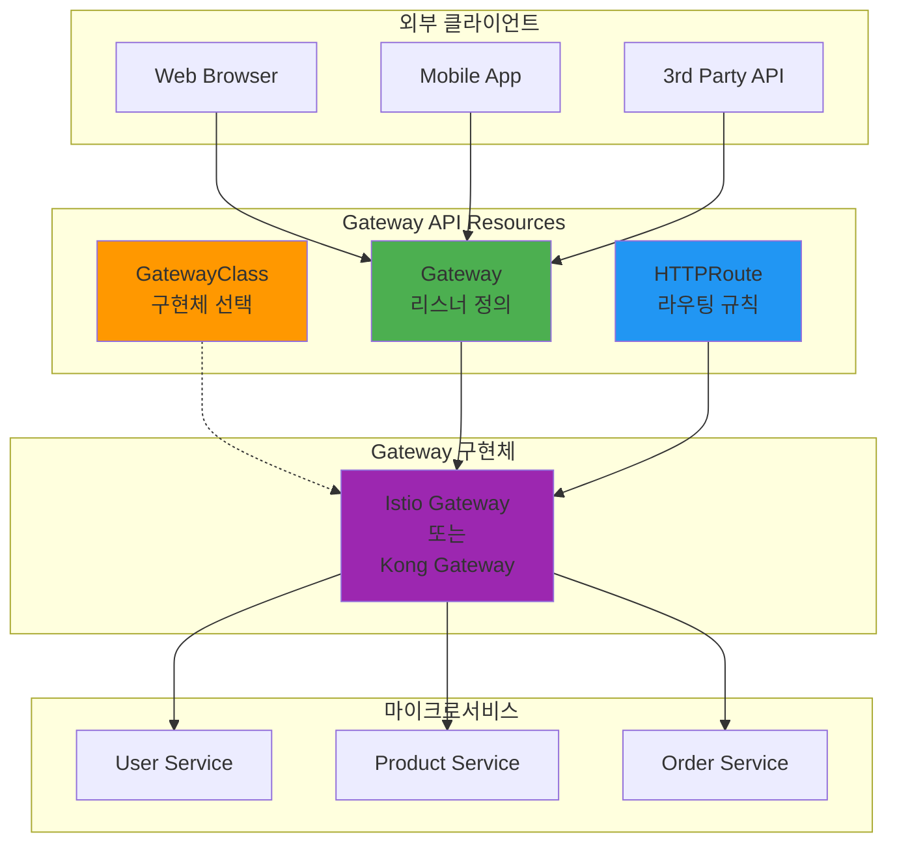
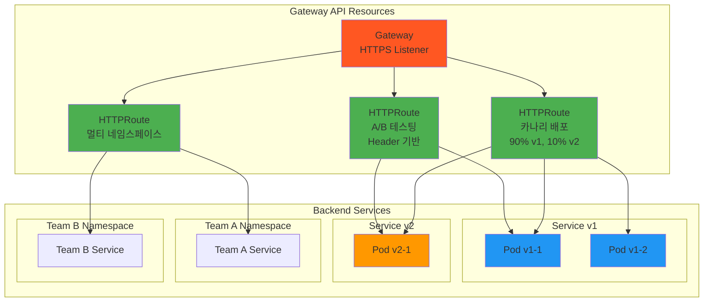

# Week 4 Day 2: API Gateway와 서비스 디스커버리

<div align="center">

**🌐 단일 진입점** • **🔍 동적 발견** • **⚖️ 트래픽 분산**

*마이크로서비스 간 통신의 진화 - 혼돈에서 질서로*

</div>

---

## 🕘 일일 스케줄

### 📊 시간 배분
```
📚 이론 강의: 2.5시간 (50분×3세션) - 오전 집중 학습
🛠️ 실습 세션: 3.5시간 (110분×2세션 + 120분 Challenge) - 당일 학습 적용
🍽️ 점심시간: 1시간 (실습 1 중간에 포함)
👥 학생 케어: 개별 맞춤 지원 (필요시)
```

### 🗓️ 상세 스케줄
| 시간 | 구분 | 내용 | 목적 |
|------|------|------|------|
| **09:00-09:50** | 📚 이론 1 | [API Gateway 패턴](./session_1.md) (50분) | 단일 진입점의 힘 |
| **09:50-10:00** | ☕ 휴식 | 10분 휴식 | |
| **10:00-10:50** | 📚 이론 2 | [서비스 디스커버리](./session_2.md) (50분) | 동적 서비스 찾기 |
| **10:50-11:00** | ☕ 휴식 | 10분 휴식 | |
| **11:00-11:50** | 📚 이론 3 | [로드밸런싱과 라우팅](./session_3.md) (50분) | 트래픽 분산 전략 |
| **11:50-12:00** | ☕ 휴식 | 10분 휴식 | |
| **12:00-13:50** | 🛠️ 실습 1 | [Kong Gateway 구축](./lab_1.md) (110분) | API Gateway 구현 |
| **13:00-14:00** | 🍽️ 점심 | 점심시간 (실습 중 60분) | |
| **14:00-15:50** | 🛠️ 실습 2 | [Service Mesh 구성](./handson_1.md) (110분) | 트래픽 관리 |
| **15:50-16:00** | ☕ 휴식 | 10분 휴식 | |
| **16:00-18:00** | 🎮 Challenge | [Gateway 장애 대응](./challenge_1.md) (120분) | 실전 문제 해결 |

---

## 🎯 일일 학습 목표

### 📚 이론 학습 목표
- **진화 이해**: 왜 API Gateway가 필요하게 되었는가? (문제 → 해결 스토리)
- **비교 분석**: Kong vs Istio vs AWS API Gateway - 언제 무엇을 선택하는가?
- **패턴 습득**: 서비스 디스커버리의 다양한 접근법과 트레이드오프
- **실무 연계**: Netflix, Uber의 실제 Gateway 아키텍처 진화 과정

### 🛠️ 실습 학습 목표
- **Gateway 구축**: Kong API Gateway 설치 및 라우팅 구성
- **인증/인가**: OAuth2, JWT 기반 보안 구현
- **Service Mesh**: Istio를 이용한 고급 트래픽 관리
- **장애 대응**: Circuit Breaker, Retry, Timeout 정책 적용

### 🤝 협업 학습 목표
- **아키텍처 설계**: 팀별 Gateway 전략 수립
- **역할 분담**: Gateway/Backend/Frontend 담당자 협업
- **통합 테스트**: 전체 시스템 통합 및 성능 테스트
- **문제 해결**: 실제 장애 상황 팀 대응

---

## 📚 이론 세션 개요

### Session 1: API Gateway 패턴 - 단일 진입점의 힘 (50분)
> **핵심 질문**: "Kubernetes Gateway API vs 구현체들 - 무엇이 다른가?"

**🔄 기술 진화 스토리**:
```
문제 1: 클라이언트가 수십 개 마이크로서비스 직접 호출
  ↓ 복잡성 폭발, 보안 취약, 중복 코드
해결 1: Nginx/HAProxy - 리버스 프록시
  ↓ 하지만 설정 파일 관리 복잡
해결 2: Ingress - Kubernetes 표준
  ↓ 하지만 표현력 부족, 어노테이션 난립
해결 3: Kong/Istio/AWS ALB - 강력하지만 각자 다른 방식
  ↓ 학습 곡선, 벤더 종속, 이식성 문제
해결 4: Gateway API - 표준 인터페이스 (★ 우리의 선택)
  ↓ 구현체는 선택, 인터페이스는 표준
```

**학습 내용**:

**1. Gateway API란 무엇인가?**
- **표준 인터페이스**: Kubernetes SIG-Network의 공식 표준
- **구현체 독립**: Kong, Istio, AWS ALB 등이 구현
- **역할 분리**: GatewayClass(구현체) / Gateway(인프라) / Route(앱)

**2. 주요 구현체 비교**:

| 구현체 | 특징 | 장점 | 단점 | 사용 시기 |
|--------|------|------|------|----------|
| **Kubernetes Gateway API** | 표준 인터페이스 | 이식성, 표준화 | 구현체 필요 | 모든 경우 (인터페이스) |
| **Istio** | Service Mesh 통합 | 전체 기능, mTLS | 복잡도 높음 | 대규모 마이크로서비스 |
| **Kong** | API 관리 플랫폼 | 플러그인 풍부 | 상용 기능 유료 | API 관리 필요 시 |
| **AWS ALB** | AWS 네이티브 | AWS 통합 완벽 | AWS 종속 | AWS 환경 |
| **Nginx** | 경량 프록시 | 단순, 빠름 | 기능 제한적 | 간단한 라우팅 |

**3. Gateway API의 핵심 개념**:

```yaml
# GatewayClass - 구현체 선택
apiVersion: gateway.networking.k8s.io/v1
kind: GatewayClass
metadata:
  name: istio  # 또는 kong, aws-alb 등
spec:
  controllerName: istio.io/gateway-controller

---
# Gateway - 인프라 리소스 (Ops 팀)
apiVersion: gateway.networking.k8s.io/v1
kind: Gateway
metadata:
  name: production-gateway
spec:
  gatewayClassName: istio
  listeners:
  - name: http
    port: 80
    protocol: HTTP

---
# HTTPRoute - 애플리케이션 라우팅 (Dev 팀)
apiVersion: gateway.networking.k8s.io/v1
kind: HTTPRoute
metadata:
  name: my-app-route
spec:
  parentRefs:
  - name: production-gateway
  rules:
  - matches:
    - path:
        value: /api
    backendRefs:
    - name: api-service
      port: 80
```

**4. 왜 Gateway API를 선택하는가?**

**표준화의 이점**:
- 구현체 교체 가능 (Istio → Kong 전환 시 Route만 유지)
- 멀티 클라우드 이식성
- 역할 기반 접근 제어 (RBAC)
- 커뮤니티 표준 (Kubernetes SIG)

**구현체별 선택 기준**:
```
간단한 라우팅 → Nginx Gateway
API 관리 필요 → Kong Gateway
Service Mesh 전체 → Istio Gateway
AWS 환경 → AWS Load Balancer Controller
```

**실무 연계**:
- Kubernetes 1.29+ Gateway API GA
- 주요 클라우드 제공자 모두 지원
- CNCF 프로젝트들의 표준 채택

### Session 2: 서비스 디스커버리 - 동적 서비스 찾기 (50분)
> **핵심 질문**: "수백 개의 서비스가 서로를 어떻게 찾는가?"

**🔄 기술 진화 스토리**:
```
문제 1: 하드코딩된 IP 주소와 포트
  ↓ 배포마다 설정 변경, 장애 시 수동 대응
해결 1: 설정 파일 외부화 (Config Server)
  ↓ 하지만 여전히 정적, 실시간 변경 불가
해결 2: 서비스 레지스트리 (Consul, Eureka)
  ↓ 동적 등록/해제, Health Check
해결 3: Kubernetes DNS + Service
  ↓ 플랫폼 네이티브 디스커버리
```

**학습 내용**:
- **문제의 시작**: 정적 설정의 한계
  - IP 변경, 스케일링, 장애 대응 어려움
  - 초기 마이크로서비스의 고통
  
- **Client-side Discovery**: Eureka, Consul
  - 클라이언트가 직접 레지스트리 조회
  - 장점: 유연성, 단점: 클라이언트 복잡도
  
- **Server-side Discovery**: Kubernetes Service
  - 플랫폼이 디스커버리 담당
  - 장점: 단순성, 단점: 플랫폼 종속

**실무 연계**:
- Netflix Eureka의 탄생 배경
- Kubernetes 환경에서의 선택
- 하이브리드 접근법

### Session 3: 로드밸런싱과 라우팅 - 트래픽 분산 전략 (50분)
> **핵심 질문**: "어떻게 트래픽을 똑똑하게 분산하는가?"

**🔄 기술 진화 스토리**:
```
문제 1: 단순 Round Robin
  ↓ 서버 성능 차이 무시, 세션 유지 불가
해결 1: Weighted Round Robin + Sticky Session
  ↓ 하지만 서버 상태 실시간 반영 안됨
해결 2: Dynamic Load Balancing
  ↓ Health Check 기반 동적 가중치
해결 3: Intelligent Routing
  ↓ 지연시간, 에러율 기반 라우팅
```

**학습 내용**:
- **L4 vs L7 로드밸런싱**: 계층별 차이
  - L4: TCP/UDP 레벨, 빠르지만 제한적
  - L7: HTTP 레벨, 느리지만 강력
  
- **라우팅 전략 비교**:
  - Round Robin: 단순하지만 공평하지 않음
  - Least Connection: 연결 수 기반
  - Weighted: 서버 성능 고려
  - Consistent Hashing: 캐시 친화적
  
- **고급 패턴**:
  - 카나리 배포: 점진적 트래픽 전환
  - 블루-그린: 즉시 전환
  - A/B 테스팅: 사용자 기반 라우팅

**실무 연계**:
- AWS ALB vs NLB 선택 기준
- Istio의 트래픽 분할 기능
- 실제 카나리 배포 사례

---
## 🛠️ 실습 세션 개요

### Lab 1: Kubernetes Gateway API 구축 실습 (110분)
> **목표**: Gateway API를 이용한 프로덕션급 API Gateway 구축

**실습 구성**:


**실습 단계**:
1. **Gateway API 설치 및 구성** (25분)
   - Gateway API CRDs 설치
   - GatewayClass 선택 (Istio 또는 Kong)
   - Gateway 리소스 생성

2. **HTTPRoute 라우팅 규칙** (25분)
   - Path 기반 라우팅
   - Header 기반 라우팅
   - 가중치 기반 트래픽 분할 (카나리)

3. **고급 기능 구현** (30분)
   - TLS 인증서 자동 관리
   - Request/Response 헤더 조작
   - Timeout 및 Retry 정책
   - Rate Limiting (구현체별)

4. **통합 테스트 및 비교** (30분)
   - Gateway API vs Ingress 비교
   - 성능 테스트
   - 관측성 (메트릭, 로그, 트레이스)

**학습 효과**:
- Kubernetes 네이티브 Gateway 구성 경험
- 표준 기반 접근법의 장점 체험
- 역할 기반 리소스 관리 이해
- 미래 지향적 아키텍처 패턴 습득

### Hands-on 1: Gateway API 고급 기능 구현 (110분)
> **목표**: Gateway API를 이용한 카나리 배포, A/B 테스팅, 멀티 테넌시

**실습 구성**:


**실습 단계**:
1. **카나리 배포 구현** (30분)
   - HTTPRoute 가중치 기반 트래픽 분할
   - 점진적 트래픽 전환 (10% → 30% → 50% → 100%)
   - 메트릭 모니터링 및 롤백 시나리오

2. **A/B 테스팅 구현** (25분)
   - Header 기반 라우팅 (User-Agent, X-Version)
   - Query Parameter 기반 라우팅
   - Cookie 기반 사용자 그룹 분리

3. **고급 라우팅 패턴** (30분)
   - URL Rewrite 및 Redirect
   - Request/Response Header 조작
   - Timeout 및 Retry 정책
   - Mirror Traffic (트래픽 복제)

4. **멀티 테넌시 구성** (25분)
   - ReferenceGrant를 이용한 크로스 네임스페이스 라우팅
   - 팀별 HTTPRoute 권한 분리 (RBAC)
   - 네임스페이스별 Gateway 공유

**학습 효과**:
- Gateway API의 강력한 표현력 체험
- 무중단 배포 전략 실무 적용
- 표준 기반 고급 기능 구현
- 멀티 테넌시 아키텍처 실습

---

## 🎮 Challenge: Gateway 구현체 비교 및 장애 대응 (120분)

### 🎯 Challenge 목표
**시나리오**: 
대규모 이커머스 플랫폼 "CloudMart"가 Gateway API를 도입했습니다.
현재 Nginx 구현체를 사용 중이지만, Istio로 전환을 고려하고 있습니다.
두 구현체를 비교하고, 실제 장애 상황에 대응해야 합니다.

### Part 1: 구현체 비교 실습 (60분)

**미션 1: Nginx Gateway 구성** (20분)
```yaml
# Nginx Gateway 구현
apiVersion: gateway.networking.k8s.io/v1
kind: GatewayClass
metadata:
  name: nginx
spec:
  controllerName: gateway.nginx.org/nginx-gateway-controller

# 동일한 HTTPRoute 사용
```

**미션 2: Istio Gateway 구성** (20분)
```yaml
# Istio Gateway 구현
apiVersion: gateway.networking.k8s.io/v1
kind: GatewayClass
metadata:
  name: istio
spec:
  controllerName: istio.io/gateway-controller

# 동일한 HTTPRoute 재사용 (이식성 확인)
```

**미션 3: 성능 및 기능 비교** (20분)
| 비교 항목 | Nginx Gateway | Istio Gateway | 결과 |
|----------|---------------|---------------|------|
| 응답 시간 | 측정 | 측정 | ? |
| 처리량 (RPS) | 측정 | 측정 | ? |
| 메모리 사용량 | 측정 | 측정 | ? |
| mTLS 지원 | ❌ | ✅ | Istio 우세 |
| 관측성 | 기본 | 풍부 | Istio 우세 |
| 설정 복잡도 | 낮음 | 높음 | Nginx 우세 |

### Part 2: 장애 대응 시나리오 (60분)

**시나리오 1: 트래픽 급증으로 인한 Gateway 과부하** (15분)
```
증상:
- Gateway 응답 시간 급증 (50ms → 5초)
- 일부 요청 타임아웃
- CPU 사용률 95%

해결 과제:
1. Gateway Pod HPA 설정
2. Rate Limiting 적용
3. 백엔드 서비스 Circuit Breaker
```

**시나리오 2: 카나리 배포 중 신규 버전 오류** (15분)
```
증상:
- 10% 트래픽에서 500 에러
- 신규 버전 API 호환성 문제
- 긴급 롤백 필요

해결 과제:
1. HTTPRoute 가중치 즉시 조정 (10% → 0%)
2. 오류 원인 분석 (로그, 메트릭)
3. 안전한 재배포 전략 수립
```

**시나리오 3: TLS 인증서 만료** (15분)
```
증상:
- HTTPS 요청 실패
- 인증서 만료 경고
- 사용자 접근 불가

해결 과제:
1. cert-manager를 이용한 자동 갱신 설정
2. Gateway TLS 설정 업데이트
3. 인증서 만료 모니터링 알림
```

**시나리오 4: 구현체 전환 (Nginx → Istio)** (15분)
```
요구사항:
- 무중단으로 Nginx에서 Istio로 전환
- 기존 HTTPRoute 재사용
- 트래픽 점진적 전환

해결 과제:
1. Istio Gateway 병렬 배포
2. DNS/LoadBalancer 트래픽 분할
3. 모니터링 및 검증 후 완전 전환
```

### 🏆 평가 기준
- **구현체 이해** (25점): Nginx vs Istio 차이점 명확히 이해
- **문제 진단** (25점): 근본 원인 파악 속도와 정확성
- **해결 방법** (25점): 효과적인 해결책 적용
- **이식성 검증** (15점): Gateway API 표준의 이식성 확인
- **팀워크** (10점): 역할 분담 및 협업

### 💡 학습 포인트
1. **표준의 힘**: 동일한 HTTPRoute가 다른 구현체에서 동작
2. **구현체 선택**: 요구사항에 따른 적절한 구현체 선택
3. **전환 전략**: 무중단 구현체 전환 방법
4. **트레이드오프**: 성능 vs 기능 vs 복잡도

---

## ✅ 일일 체크포인트

### 📚 이론 이해도 체크
- [ ] **진화 이해**: 각 기술이 등장한 배경과 해결한 문제 설명 가능
- [ ] **비교 분석**: Kong vs Istio vs AWS API Gateway 차이점 이해
- [ ] **패턴 선택**: 상황에 맞는 디스커버리 패턴 선택 능력
- [ ] **트레이드오프**: 각 접근법의 장단점 명확히 이해

### 🛠️ 실습 완성도 체크
- [ ] **Kong Gateway**: 라우팅, 인증, Rate Limiting 구현
- [ ] **Istio Mesh**: 트래픽 분할 및 카나리 배포 성공
- [ ] **회복성 패턴**: Circuit Breaker, Retry 동작 확인
- [ ] **장애 대응**: 4가지 시나리오 모두 해결

### 🤝 협업 활동 체크
- [ ] **아키텍처 설계**: Gateway 전략 팀 토론 참여
- [ ] **역할 수행**: 담당 영역 구현 완료
- [ ] **장애 대응**: 팀 협업으로 문제 해결
- [ ] **지식 공유**: 학습 내용 및 해결 방법 공유

---

## 🎯 다음 학습 준비

### 📖 예습 키워드
- **Database per Service**: 서비스별 데이터베이스 분리
- **Event Sourcing**: 이벤트 기반 상태 관리
- **CQRS**: Command Query Responsibility Segregation
- **Saga Pattern**: 분산 트랜잭션 관리

### 🔧 환경 준비
```bash
# Gateway API CRDs 설치
kubectl apply -f https://github.com/kubernetes-sigs/gateway-api/releases/download/v1.0.0/standard-install.yaml

# Gateway 구현체 선택 (택 1)
# Option 1: Istio (추천)
istioctl install --set profile=minimal -y

# Option 2: Kong
kubectl apply -f https://bit.ly/kong-gateway-operator

# 관측성 도구
kubectl apply -f https://bit.ly/prometheus-operator
kubectl apply -f https://bit.ly/grafana-operator
```

### 📚 추천 학습 자료
- **[Gateway API Documentation](https://gateway-api.sigs.k8s.io/)**: 공식 문서
- **[Gateway API Implementations](https://gateway-api.sigs.k8s.io/implementations/)**: 구현체 목록
- **[Istio Gateway API](https://istio.io/latest/docs/tasks/traffic-management/ingress/gateway-api/)**: Istio 가이드
- **[Kong Gateway API](https://docs.konghq.com/kubernetes-ingress-controller/latest/guides/using-gateway-api/)**: Kong 가이드

---

## 💡 학습 회고

### 🤝 페어 회고 (10분)
1. **기술 진화 이해**: 각 기술이 등장한 배경에서 가장 인상 깊었던 것은?
2. **실습 경험**: Kong과 Istio 중 어떤 것이 더 유용했나요? 왜?
3. **장애 대응**: Challenge에서 가장 어려웠던 시나리오와 해결 방법은?
4. **실무 적용**: 현재 또는 미래 프로젝트에 어떤 Gateway를 선택하시겠어요?

### 📊 학습 성과 자가 평가
**5점 척도로 평가해보세요**:
- [ ] API Gateway 개념 및 필요성 이해: ⭐⭐⭐⭐⭐
- [ ] 서비스 디스커버리 패턴 이해: ⭐⭐⭐⭐⭐
- [ ] Kong/Istio 구현 능력: ⭐⭐⭐⭐⭐
- [ ] 장애 대응 능력: ⭐⭐⭐⭐⭐

### 🎯 개선 포인트
- **더 학습이 필요한 부분**: 
- **다음에 시도해볼 것**: 
- **팀에게 공유하고 싶은 것**: 

---

## 📚 참고 자료

### 🔗 공식 문서
- **[Gateway API](https://gateway-api.sigs.k8s.io/)**: Kubernetes Gateway API 공식 문서
- **[Gateway API Spec](https://gateway-api.sigs.k8s.io/reference/spec/)**: API 스펙 상세
- **[Istio](https://istio.io/)**: Istio Service Mesh
- **[Kong](https://docs.konghq.com/)**: Kong Gateway
- **[AWS Load Balancer Controller](https://kubernetes-sigs.github.io/aws-load-balancer-controller/)**: AWS Gateway API 지원

### 📖 추천 도서
- **Building Microservices** (Sam Newman) - Chapter 4: Integration
- **Microservices Patterns** (Chris Richardson) - API Gateway Pattern
- **Kubernetes Patterns** (Bilgin Ibryam) - Gateway Pattern

### 🎥 추천 영상
- **[Gateway API Introduction](https://www.youtube.com/results?search_query=kubernetes+gateway+api)**: Gateway API 소개
- **[Istio Gateway API](https://www.youtube.com/results?search_query=istio+gateway+api)**: Istio 구현
- **[Netflix API Gateway Evolution](https://www.youtube.com/watch?v=CZ3wIuvmHeM)**: Netflix 사례

### 🌐 기업 기술 블로그
- **[Kubernetes Blog - Gateway API](https://kubernetes.io/blog/2023/08/29/gateway-api-v0-8/)**: GA 발표
- **[Istio Blog](https://istio.io/latest/blog/)**: Istio 기술 블로그
- **[Kong Blog](https://konghq.com/blog)**: Kong 기술 블로그

---

<div align="center">

**🌐 단일 진입점** • **🔍 동적 발견** • **⚖️ 똑똑한 분산** • **🛡️ 회복성**

*마이크로서비스 통신의 진화, 함께 경험합니다*

</div>
