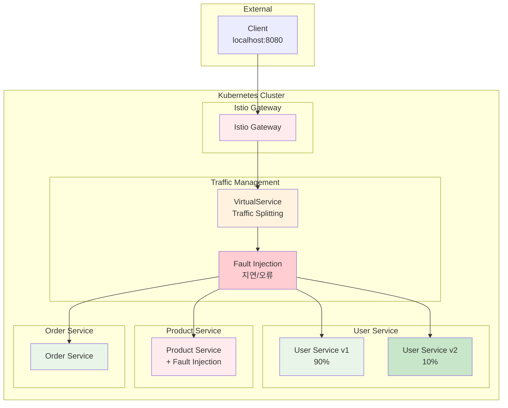

# Week 4 Day 2 Hands-on 1: Istio 고급 트래픽 관리

<div align="center">

**🔄 Traffic Splitting** • **💥 Fault Injection** • **🎯 Canary Deployment**

*Istio를 활용한 고급 트래픽 제어 및 장애 테스트*

</div>

---

## 🕘 실습 정보
**시간**: 14:00-14:50 (50분)
**목표**: 카나리 배포와 장애 주입으로 실무 시나리오 체험
**방식**: Lab 1 기반 심화 실습 (수동 실행)
**작업 위치**: `theory/week_04/day2/lab_scripts/handson1`

## 🎯 실습 목표

### 📚 학습 목표
- **Traffic Splitting**: 가중치 기반 트래픽 분할
- **Canary Deployment**: 점진적 배포 전략
- **Fault Injection**: 장애 상황 시뮬레이션
- **Resilience Testing**: 시스템 복원력 테스트

### 🛠️ 구현 목표
- **v2 서비스 배포**: 새 버전 서비스 추가
- **90/10 트래픽 분할**: v1 90%, v2 10%
- **장애 주입**: 지연 및 오류 시뮬레이션
- **실시간 테스트**: 브라우저로 결과 확인

---

## 🏗️ 전체 아키텍처



---

## 🛠️ Step 1: 환경 준비 (5분)

### Step 1-1: 작업 디렉토리 이동

```bash
cd theory/week_04/day2/lab_scripts/handson1
```

### Step 1-2: Lab 1 환경 확인

**🚀 자동 확인 스크립트**
```bash
./setup-environment.sh
```

**📋 스크립트 내용**: [setup-environment.sh](./lab_scripts/handson1/setup-environment.sh)

**💡 빠른 전체 설정 (선택사항)**
```bash
# 수동 실행을 건너뛰고 싶다면
./setup-all.sh
# 그리고 Step 5 테스트로 이동
```

---

## 🚀 Step 2: User Service v2 배포 (10분)

### Step 2-1: v2 Deployment 생성

```bash
kubectl apply -f - <<EOF
apiVersion: apps/v1
kind: Deployment
metadata:
  name: user-service-v2
spec:
  replicas: 2
  selector:
    matchLabels:
      app: user-service
      version: v2
  template:
    metadata:
      labels:
        app: user-service
        version: v2
    spec:
      containers:
      - name: user-service
        image: hashicorp/http-echo
        args:
        - "-text=User Service v2 🚀"
        - "-listen=:8080"
        ports:
        - containerPort: 8080
EOF
```

### Step 2-2: 배포 확인

```bash
# Pod 확인
kubectl get pods -l app=user-service

# v1과 v2 모두 Running 상태 확인
# user-service-xxx (v1) - 2개
# user-service-v2-xxx (v2) - 2개
```

---

## 🔄 Step 3: Traffic Splitting 설정 (15분)

### Step 3-1: DestinationRule 업데이트 (subset 정의)

```bash
kubectl apply -f - <<EOF
apiVersion: networking.istio.io/v1beta1
kind: DestinationRule
metadata:
  name: user-service
spec:
  host: user-service
  subsets:
  - name: v1
    labels:
      version: v1
  - name: v2
    labels:
      version: v2
  trafficPolicy:
    loadBalancer:
      simple: ROUND_ROBIN
EOF
```

### Step 3-2: VirtualService 업데이트 (90/10 분할)

```bash
kubectl apply -f - <<EOF
apiVersion: networking.istio.io/v1beta1
kind: VirtualService
metadata:
  name: api-routes
spec:
  hosts:
  - "*"
  gateways:
  - api-gateway
  http:
  - match:
    - uri:
        prefix: /users
    route:
    - destination:
        host: user-service
        subset: v1
      weight: 90
    - destination:
        host: user-service
        subset: v2
      weight: 10
  - match:
    - uri:
        prefix: /products
    route:
    - destination:
        host: product-service
        port:
          number: 80
  - match:
    - uri:
        prefix: /orders
    route:
    - destination:
        host: order-service
        port:
          number: 80
EOF
```

### Step 3-3: Traffic Splitting 테스트

```bash
# 100번 호출하여 v1/v2 비율 확인
for i in {1..100}; do
  curl -s http://localhost:808080/users
done | sort | uniq -c
```

**예상 결과:**
```
  90 User Service v1
  10 User Service v2 🚀
```

**브라우저 테스트:**
- http://localhost:808080/users 를 10번 새로고침
- 대부분 "User Service v1"
- 가끔 "User Service v2 🚀" 표시

---

## 💥 Step 4: Fault Injection 설정 (10분)

### Step 4-1: VirtualService에 Fault Injection 추가

```bash
kubectl apply -f - <<EOF
apiVersion: networking.istio.io/v1beta1
kind: VirtualService
metadata:
  name: api-routes
spec:
  hosts:
  - "*"
  gateways:
  - api-gateway
  http:
  - match:
    - uri:
        prefix: /users
    route:
    - destination:
        host: user-service
        subset: v1
      weight: 90
    - destination:
        host: user-service
        subset: v2
      weight: 10
  - match:
    - uri:
        prefix: /products
    fault:
      delay:
        percentage:
          value: 50
        fixedDelay: 3s
      abort:
        percentage:
          value: 20
        httpStatus: 503
    route:
    - destination:
        host: product-service
        port:
          number: 80
  - match:
    - uri:
        prefix: /orders
    route:
    - destination:
        host: order-service
        port:
          number: 80
EOF
```

### Step 4-2: Fault Injection 테스트

**지연 테스트:**
```bash
# 응답 시간 측정
time curl http://localhost:808080/products

# 여러 번 실행하여 50% 확률로 3초 지연 확인
```

**오류 테스트:**
```bash
# 20번 호출하여 오류율 확인
for i in {1..20}; do
  echo -n "요청 $i: "
  curl -s -o /dev/null -w "%{http_code}\n" http://localhost:808080/products
done
```

**예상 결과:**
- 약 50%는 3초 후 200 응답
- 약 20%는 즉시 503 오류
- 나머지 30%는 즉시 200 응답

**브라우저 테스트:**
- http://localhost:808080/products 를 여러 번 새로고침
- 가끔 느린 응답 (3초 대기)
- 가끔 "503 Service Unavailable" 오류

---

## ✅ Step 5: 종합 테스트 (10분)

### Step 5-1: 전체 시스템 테스트

```bash
# 1. Traffic Splitting 확인
echo "=== Traffic Splitting 테스트 ==="
for i in {1..20}; do
  curl -s http://localhost:808080/users
done | sort | uniq -c

# 2. Fault Injection 확인
echo ""
echo "=== Fault Injection 테스트 ==="
for i in {1..10}; do
  echo -n "요청 $i: "
  time curl -s http://localhost:808080/products
  echo ""
done

# 3. 정상 서비스 확인
echo ""
echo "=== Order Service (정상) ==="
curl http://localhost:808080/orders
```

### Step 5-2: 브라우저 종합 테스트

**테스트 시나리오:**
1. **http://localhost:808080/users** - 10번 새로고침
   - v1과 v2가 약 9:1 비율로 표시되는지 확인

2. **http://localhost:808080/products** - 10번 새로고침
   - 느린 응답 (3초) 발생 확인
   - 503 오류 발생 확인

3. **http://localhost:808080/orders** - 정상 동작 확인

---

## ✅ 실습 체크포인트

### ✅ Traffic Splitting 확인
- [ ] User Service v2 배포 완료 (2개 Pod)
- [ ] DestinationRule subset 정의 (v1, v2)
- [ ] VirtualService weight 설정 (90/10)
- [ ] curl 테스트로 비율 확인
- [ ] 브라우저에서 v1/v2 번갈아 표시

### ✅ Fault Injection 확인
- [ ] Product Service에 지연 주입 (50%, 3초)
- [ ] Product Service에 오류 주입 (20%, 503)
- [ ] curl 테스트로 지연/오류 확인
- [ ] 브라우저에서 느린 응답 체험
- [ ] 브라우저에서 503 오류 확인

---

## 🚀 추가 실험 (선택사항)

### 실험 1: 트래픽 비율 변경

**v2를 50%로 증가:**
```bash
kubectl apply -f - <<EOF
apiVersion: networking.istio.io/v1beta1
kind: VirtualService
metadata:
  name: api-routes
spec:
  hosts:
  - "*"
  gateways:
  - api-gateway
  http:
  - match:
    - uri:
        prefix: /users
    route:
    - destination:
        host: user-service
        subset: v1
      weight: 50
    - destination:
        host: user-service
        subset: v2
      weight: 50
  # ... (나머지 동일)
EOF
```

### 실험 2: 장애 비율 조정

**지연을 100%, 5초로 변경:**
```bash
fault:
  delay:
    percentage:
      value: 100
    fixedDelay: 5s
```

### 실험 3: 헤더 기반 라우팅

**특정 헤더가 있으면 v2로 라우팅:**
```bash
http:
- match:
  - headers:
      version:
        exact: v2
    uri:
      prefix: /users
  route:
  - destination:
      host: user-service
      subset: v2
```

**테스트:**
```bash
curl -H "version: v2" http://localhost:808080/users
```

---

## 🧹 실습 정리

**🚀 자동 정리 스크립트**
```bash
./cleanup.sh
```

**📋 스크립트 내용**: [cleanup.sh](./lab_scripts/handson1/cleanup.sh)

**수동 정리:**
```bash
# v2 삭제
kubectl delete deployment user-service-v2

# VirtualService 복원 (Lab 1 상태)
kubectl apply -f - <<EOF
apiVersion: networking.istio.io/v1beta1
kind: VirtualService
metadata:
  name: api-routes
spec:
  hosts:
  - "*"
  gateways:
  - api-gateway
  http:
  - match:
    - uri:
        prefix: /users
    route:
    - destination:
        host: user-service
        port:
          number: 80
  # ... (나머지 서비스)
EOF
```

---

## 💡 실습 회고

### 🤝 페어 회고 (5분)
1. **Canary Deployment**: 실무에서 어떤 상황에 유용할까요?
2. **Fault Injection**: 장애 테스트가 왜 중요한가요?
3. **Traffic Splitting**: 90/10 비율을 어떻게 결정하나요?
4. **실무 적용**: 이 기능들을 어떤 프로젝트에 적용하고 싶나요?

### 📊 학습 성과
- **Canary Deployment**: 점진적 배포 전략 이해 및 구현
- **Traffic Splitting**: 가중치 기반 트래픽 제어 습득
- **Fault Injection**: 장애 상황 시뮬레이션 및 테스트
- **실무 패턴**: Netflix, Google 등에서 사용하는 배포 전략 체험

### 🌟 실무 인사이트
- **Netflix**: 카나리 배포로 수천 개 마이크로서비스 안전하게 배포
- **Google**: Chaos Engineering으로 시스템 복원력 지속 검증
- **Uber**: 트래픽 분할로 A/B 테스트 및 점진적 기능 출시

---

<div align="center">

**🔄 Canary Deployment** • **💥 Chaos Engineering** • **🎯 Production Ready**

*실무 배포 전략과 장애 테스트 완벽 마스터*

</div>
