```mermaid
graph TB
    subgraph "Istio Control Plane"
        Istiod[Istiod<br/>Pilot + Citadel + Galley]
    end
    
    subgraph "Istio Ingress"
        IG[Istio Ingress Gateway<br/>NodePort 30080]
    end
    
    subgraph "Application Pods"
        subgraph "User Service v1"
            U1A[User App v1]
            U1E[Envoy Sidecar]
        end
        
        subgraph "User Service v2"
            U2A[User App v2]
            U2E[Envoy Sidecar]
        end
        
        subgraph "Product Service"
            PA[Product App]
            PE[Envoy Sidecar]
        end
        
        subgraph "Order Service"
            OA[Order App]
            OE[Envoy Sidecar]
        end
    end
    
    subgraph "Observability"
        K[Kiali<br/>Service Graph]
        J[Jaeger<br/>Tracing]
        P[Prometheus<br/>Metrics]
        G[Grafana<br/>Dashboard]
    end
    
    C[Client] --> IG
    IG --> U1E
    IG --> U2E
    
    U1E <--> U1A
    U2E <--> U2A
    PE <--> PA
    OE <--> OA
    
    U1E <--> PE
    U2E <--> PE
    PE <--> OE
    
    Istiod -.-> U1E
    Istiod -.-> U2E
    Istiod -.-> PE
    Istiod -.-> OE
    
    U1E -.-> P
    U2E -.-> P
    PE -.-> P
    OE -.-> P
    
    P --> G
    U1E -.-> J
    U2E -.-> J
    
    K -.-> Istiod
    
    style Istiod fill:#e3f2fd
    style IG fill:#4caf50
    style U1A,U2A,PA,OA fill:#2196f3
    style U1E,U2E,PE,OE fill:#ff9800
    style K,J,P,G fill:#9c27b0
```

# Week 4 Day 2 Hands-on 1: Istio Service Mesh 구축

<div align="center">

**⛵ Istio** • **🔀 트래픽 관리** • **🔐 mTLS** • **📊 관측성**

*Service Mesh로 마이크로서비스 통신 완전 제어*

</div>

---

## 🕘 실습 정보
**시간**: 14:00-14:50 (50분)  
**목표**: Istio Service Mesh 설치 및 고급 트래픽 관리  
**방식**: Lab 1 클러스터 활용 + Istio 추가 설치  
**작업 위치**: `theory/week_04/day2/lab_scripts/handson1`

## 🎯 실습 목표

### 📚 학습 목표
- **Istio 아키텍처**: Control Plane과 Data Plane 이해
- **Sidecar 패턴**: Envoy Proxy 자동 주입 체험
- **트래픽 관리**: VirtualService와 DestinationRule 활용
- **관측성**: Kiali, Jaeger, Prometheus 통합

### 🛠️ 구현 목표
- **Istio 설치**: Control Plane 배포 및 Sidecar 주입
- **카나리 배포**: 가중치 기반 트래픽 분할
- **Fault Injection**: 장애 주입 테스트
- **Circuit Breaker**: 장애 격리 및 복구

---

## 🏗️ 전체 아키텍처



---

## 🛠️ Step 1: Istio 설치 (10분)

### Step 1-1: Istio 다운로드 및 설치

**🚀 자동화 스크립트 사용**
```bash
cd theory/week_04/day2/lab_scripts/handson1
./install-istio.sh
```

**📋 스크립트 내용**: [install-istio.sh](./lab_scripts/handson1/install-istio.sh)

**수동 실행 (학습용)**:
```bash
# Istio 다운로드
curl -L https://istio.io/downloadIstio | ISTIO_VERSION=1.20.0 sh -
cd istio-1.20.0
export PATH=$PWD/bin:$PATH

# Istio 설치 (demo 프로파일)
istioctl install --set profile=demo -y

# Istio 설치 확인
kubectl get pods -n istio-system

# Sidecar 자동 주입 활성화
kubectl label namespace default istio-injection=enabled
```

### Step 1-2: Istio 상태 확인

```bash
# Istio 컴포넌트 확인
kubectl get all -n istio-system

# Sidecar 주입 확인
kubectl get namespace -L istio-injection
```

**예상 결과**:
```
NAME                ISTIO-INJECTION
default             enabled
istio-system        disabled
kong                disabled
kube-system         disabled
```

---

## 🚀 Step 2: 애플리케이션 재배포 (10분)

### Step 2-1: Sidecar 주입된 애플리케이션 배포

**🚀 자동화 스크립트 사용**
```bash
./deploy-with-istio.sh
```

**📋 스크립트 내용**: [deploy-with-istio.sh](./lab_scripts/handson1/deploy-with-istio.sh)

**수동 실행 (학습용)**:
```bash
# 기존 서비스 삭제 (Kong Lab에서 배포한 것)
kubectl delete deployment user-service product-service order-service

# User Service v1 배포
kubectl apply -f - <<EOF
apiVersion: apps/v1
kind: Deployment
metadata:
  name: user-service-v1
  labels:
    app: user-service
    version: v1
spec:
  replicas: 2
  selector:
    matchLabels:
      app: user-service
      version: v1
  template:
    metadata:
      labels:
        app: user-service
        version: v1
    spec:
      containers:
      - name: user-service
        image: hashicorp/http-echo:latest
        args:
        - "-text=User Service v1 Response"
        - "-listen=:8080"
        ports:
        - containerPort: 8080
EOF

# User Service v2 배포 (카나리용)
kubectl apply -f - <<EOF
apiVersion: apps/v1
kind: Deployment
metadata:
  name: user-service-v2
  labels:
    app: user-service
    version: v2
spec:
  replicas: 1
  selector:
    matchLabels:
      app: user-service
      version: v2
  template:
    metadata:
      labels:
        app: user-service
        version: v2
    spec:
      containers:
      - name: user-service
        image: hashicorp/http-echo:latest
        args:
        - "-text=User Service v2 Response (NEW)"
        - "-listen=:8080"
        ports:
        - containerPort: 8080
EOF

# Product Service 배포
kubectl apply -f - <<EOF
apiVersion: apps/v1
kind: Deployment
metadata:
  name: product-service
  labels:
    app: product-service
    version: v1
spec:
  replicas: 2
  selector:
    matchLabels:
      app: product-service
      version: v1
  template:
    metadata:
      labels:
        app: product-service
        version: v1
    spec:
      containers:
      - name: product-service
        image: hashicorp/http-echo:latest
        args:
        - "-text=Product Service Response"
        - "-listen=:8080"
        ports:
        - containerPort: 8080
EOF

# Order Service 배포
kubectl apply -f - <<EOF
apiVersion: apps/v1
kind: Deployment
metadata:
  name: order-service
  labels:
    app: order-service
    version: v1
spec:
  replicas: 2
  selector:
    matchLabels:
      app: order-service
      version: v1
  template:
    metadata:
      labels:
        app: order-service
        version: v1
    spec:
      containers:
      - name: order-service
        image: hashicorp/http-echo:latest
        args:
        - "-text=Order Service Response"
        - "-listen=:8080"
        ports:
        - containerPort: 8080
EOF

# Pod 준비 대기
kubectl wait --for=condition=ready pod -l app=user-service --timeout=120s
kubectl wait --for=condition=ready pod -l app=product-service --timeout=120s
kubectl wait --for=condition=ready pod -l app=order-service --timeout=120s
```

### Step 2-2: Sidecar 주입 확인

```bash
# Pod 상세 정보 확인 (2개 컨테이너 확인)
kubectl get pods -l app=user-service

# Sidecar 컨테이너 확인
kubectl describe pod -l app=user-service | grep -A 5 "Containers:"
```

**예상 결과**: 각 Pod에 2개 컨테이너 (app + istio-proxy)

---

## 🔀 Step 3: 트래픽 관리 (15분)

### Step 3-1: Istio Gateway 및 VirtualService 설정

**🚀 자동화 스크립트 사용**
```bash
./configure-istio.sh
```

**📋 스크립트 내용**: [configure-istio.sh](./lab_scripts/handson1/configure-istio.sh)

**수동 실행 (학습용)**:
```bash
# Istio Gateway 생성
kubectl apply -f - <<EOF
apiVersion: networking.istio.io/v1beta1
kind: Gateway
metadata:
  name: app-gateway
spec:
  selector:
    istio: ingressgateway
  servers:
  - port:
      number: 80
      name: http
      protocol: HTTP
    hosts:
    - "*"
EOF

# VirtualService 생성 (카나리 배포: v1 90%, v2 10%)
kubectl apply -f - <<EOF
apiVersion: networking.istio.io/v1beta1
kind: VirtualService
metadata:
  name: user-service
spec:
  hosts:
  - "*"
  gateways:
  - app-gateway
  http:
  - match:
    - uri:
        prefix: /users
    route:
    - destination:
        host: user-service
        subset: v1
      weight: 90
    - destination:
        host: user-service
        subset: v2
      weight: 10
EOF

# DestinationRule 생성 (버전별 subset 정의)
kubectl apply -f - <<EOF
apiVersion: networking.istio.io/v1beta1
kind: DestinationRule
metadata:
  name: user-service
spec:
  host: user-service
  subsets:
  - name: v1
    labels:
      version: v1
  - name: v2
    labels:
      version: v2
EOF
```

### Step 3-2: 카나리 배포 테스트

```bash
# Istio Ingress Gateway 주소 확인
export INGRESS_HOST=$(kubectl get svc istio-ingressgateway -n istio-system -o jsonpath='{.status.loadBalancer.ingress[0].ip}')
export INGRESS_PORT=$(kubectl get svc istio-ingressgateway -n istio-system -o jsonpath='{.spec.ports[?(@.name=="http2")].nodePort}')

# 100번 호출하여 트래픽 분산 확인
for i in {1..100}; do
  curl -s http://localhost:8000/users
done | sort | uniq -c
```

**예상 결과**:
```
  90 User Service v1 Response
  10 User Service v2 Response (NEW)
```

---

## 🔧 Step 4: 고급 기능 (15분)

### Step 4-1: Fault Injection (장애 주입)

**지연 주입 (Delay Injection)**:
```bash
kubectl apply -f - <<EOF
apiVersion: networking.istio.io/v1beta1
kind: VirtualService
metadata:
  name: product-service
spec:
  hosts:
  - product-service
  http:
  - fault:
      delay:
        percentage:
          value: 50
        fixedDelay: 5s
    route:
    - destination:
        host: product-service
EOF
```

**테스트**:
```bash
# 50% 확률로 5초 지연 발생
time curl http://localhost:8000/products
```

**에러 주입 (Abort Injection)**:
```bash
kubectl apply -f - <<EOF
apiVersion: networking.istio.io/v1beta1
kind: VirtualService
metadata:
  name: order-service
spec:
  hosts:
  - order-service
  http:
  - fault:
      abort:
        percentage:
          value: 30
        httpStatus: 500
    route:
    - destination:
        host: order-service
EOF
```

**테스트**:
```bash
# 30% 확률로 500 에러 발생
for i in {1..10}; do
  curl -s -o /dev/null -w "%{http_code}\n" http://localhost:8000/orders
done
```

### Step 4-2: Circuit Breaker 설정

```bash
kubectl apply -f - <<EOF
apiVersion: networking.istio.io/v1beta1
kind: DestinationRule
metadata:
  name: product-service
spec:
  host: product-service
  trafficPolicy:
    connectionPool:
      tcp:
        maxConnections: 1
      http:
        http1MaxPendingRequests: 1
        maxRequestsPerConnection: 1
    outlierDetection:
      consecutiveErrors: 1
      interval: 1s
      baseEjectionTime: 3m
      maxEjectionPercent: 100
EOF
```

**테스트**:
```bash
# 동시 요청으로 Circuit Breaker 트리거
for i in {1..20}; do
  curl -s http://localhost:8000/products &
done
wait
```

### Step 4-3: Retry & Timeout 정책

```bash
kubectl apply -f - <<EOF
apiVersion: networking.istio.io/v1beta1
kind: VirtualService
metadata:
  name: user-service
spec:
  hosts:
  - user-service
  http:
  - route:
    - destination:
        host: user-service
    retries:
      attempts: 3
      perTryTimeout: 2s
      retryOn: 5xx
    timeout: 10s
EOF
```

---

## 📊 Step 5: 관측성 (선택사항)

### Step 5-1: Kiali 대시보드

```bash
# Kiali 설치
kubectl apply -f https://raw.githubusercontent.com/istio/istio/release-1.20/samples/addons/kiali.yaml

# Kiali 접근
kubectl port-forward -n istio-system svc/kiali 20001:20001

# 브라우저에서 접근
# http://localhost:20001
```

### Step 5-2: Jaeger 분산 추적

```bash
# Jaeger 설치
kubectl apply -f https://raw.githubusercontent.com/istio/istio/release-1.20/samples/addons/jaeger.yaml

# Jaeger 접근
kubectl port-forward -n istio-system svc/tracing 16686:80

# 브라우저에서 접근
# http://localhost:16686
```

### Step 5-3: Prometheus & Grafana

```bash
# Prometheus 설치
kubectl apply -f https://raw.githubusercontent.com/istio/istio/release-1.20/samples/addons/prometheus.yaml

# Grafana 설치
kubectl apply -f https://raw.githubusercontent.com/istio/istio/release-1.20/samples/addons/grafana.yaml

# Grafana 접근
kubectl port-forward -n istio-system svc/grafana 3000:3000

# 브라우저에서 접근
# http://localhost:3000
```

---

## ✅ 실습 체크포인트

### ✅ Istio 설치 확인
- [ ] Istiod 배포 완료
- [ ] Istio Ingress Gateway 실행 중
- [ ] default 네임스페이스 Sidecar 주입 활성화
- [ ] 모든 Pod에 2개 컨테이너 (app + istio-proxy)

### ✅ 트래픽 관리 확인
- [ ] Gateway 생성 완료
- [ ] VirtualService 설정 완료
- [ ] DestinationRule 설정 완료
- [ ] 카나리 배포 동작 확인 (90:10 비율)

### ✅ 고급 기능 확인
- [ ] Fault Injection 동작 확인
- [ ] Circuit Breaker 트리거 확인
- [ ] Retry & Timeout 정책 적용

### ✅ 관측성 확인 (선택)
- [ ] Kiali 서비스 그래프 확인
- [ ] Jaeger 분산 추적 확인
- [ ] Grafana 대시보드 확인

---

## 🧹 실습 정리

**🚀 자동화 스크립트 사용**
```bash
./cleanup.sh
```

**수동 정리**:
```bash
# Istio 리소스 삭제
kubectl delete gateway app-gateway
kubectl delete virtualservice --all
kubectl delete destinationrule --all

# 애플리케이션 삭제
kubectl delete deployment user-service-v1 user-service-v2 product-service order-service

# Istio 언인스톨
istioctl uninstall --purge -y

# Istio 네임스페이스 삭제
kubectl delete namespace istio-system

# Sidecar 주입 비활성화
kubectl label namespace default istio-injection-
```

---

## 💡 실습 회고

### 🤝 페어 회고 (5분)
1. **Kong vs Istio**: 두 도구의 가장 큰 차이점은?
2. **Sidecar 패턴**: Sidecar 주입의 장단점은?
3. **트래픽 관리**: 가장 유용한 기능은?
4. **실무 적용**: 어떤 상황에서 Istio를 선택하시겠어요?

### 📊 학습 성과
- **Istio 아키텍처**: Control Plane과 Data Plane 이해
- **Sidecar 패턴**: 자동 주입 및 투명한 프록시 체험
- **고급 트래픽 관리**: 카나리, Fault Injection, Circuit Breaker
- **관측성**: Kiali, Jaeger, Prometheus 통합 경험

### 🎯 Kong vs Istio 비교 정리

| 구분 | Kong | Istio |
|------|------|-------|
| **위치** | 클러스터 경계 (Edge) | 클러스터 내부 (Mesh) |
| **역할** | 외부 트래픽 관리 | 서비스 간 통신 관리 |
| **설치** | 간단 (단일 Gateway) | 복잡 (Control Plane + Sidecar) |
| **학습 곡선** | 낮음 ⭐⭐ | 높음 ⭐⭐⭐⭐⭐ |
| **기능** | API 관리 중심 | 전체 관측성 + 보안 |
| **성능 영향** | 낮음 (단일 홉) | 중간 (Sidecar 오버헤드) |
| **사용 시기** | API Gateway 필요 시 | 마이크로서비스 20개 이상 |

---

## ❓ FAQ (자주 묻는 질문)

### Q1. Sidecar가 자동 주입되지 않으면?
**A**: 
```bash
# 네임스페이스 라벨 확인
kubectl get namespace default -o yaml | grep istio-injection

# 라벨 추가
kubectl label namespace default istio-injection=enabled

# Pod 재시작 (Deployment 재배포)
kubectl rollout restart deployment user-service-v1
```

### Q2. Istio Ingress Gateway 포트가 충돌하면?
**A**: 
- Kong과 Istio가 모두 30080 포트 사용
- Kong cleanup 후 Istio 설치 권장
- 또는 Istio Ingress Gateway 포트 변경

### Q3. VirtualService가 작동하지 않으면?
**A**: 
```bash
# Gateway 확인
kubectl get gateway

# VirtualService 확인
kubectl get virtualservice

# DestinationRule 확인
kubectl get destinationrule

# Istio 설정 검증
istioctl analyze
```

### Q4. Circuit Breaker가 트리거되지 않으면?
**A**: 
- `consecutiveErrors` 값 낮추기 (1로 설정)
- `maxConnections` 값 낮추기 (1로 설정)
- 충분한 동시 요청 생성 (20개 이상)

### Q5. Kiali 대시보드가 비어있으면?
**A**: 
- 트래픽 생성 필요 (서비스 호출)
- Prometheus 메트릭 수집 대기 (1-2분)
- 네임스페이스 필터 확인 (default 선택)

### Q6. Istio 제거 후에도 Sidecar가 남아있으면?
**A**: 
```bash
# Deployment 재배포
kubectl rollout restart deployment --all

# 또는 Pod 삭제 (자동 재생성)
kubectl delete pods --all
```

---

<div align="center">

**⛵ Istio Service Mesh** • **🔀 고급 트래픽 관리** • **📊 완전한 관측성**

*Service Mesh로 마이크로서비스 통신을 완전히 제어했습니다!*

</div>
