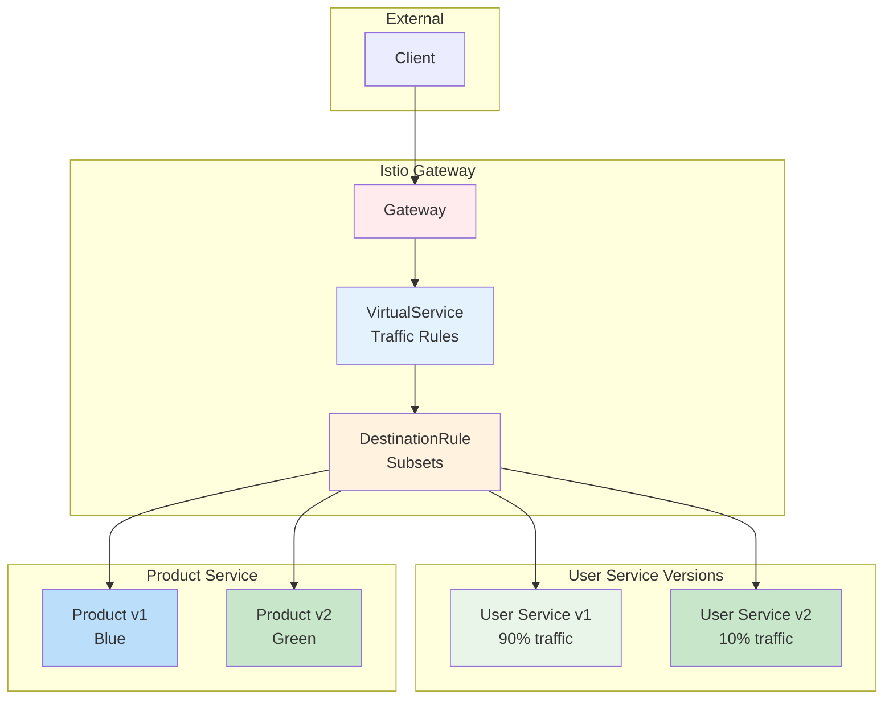

# Week 4 Day 2 Hands-on 1: Istio 고급 트래픽 관리 & 배포 전략

<div align="center">

**🚀 Canary 배포** • **🔄 Blue-Green 배포** • **📊 트래픽 분할** • **🔐 보안**

*Lab 1을 기반으로 프로덕션급 배포 전략 구현*

</div>

---

## 🕘 실습 정보
**시간**: 14:00-15:50 (110분)
**목표**: Istio를 활용한 고급 트래픽 관리 및 무중단 배포
**방식**: Lab 1 기반 확장
**작업 위치**: `theory/week_04/day2/lab_scripts/handson1`

## 🎯 실습 목표

### 📚 학습 목표
- **Canary 배포**: 점진적 트래픽 전환으로 안전한 배포
- **Blue-Green 배포**: 즉시 전환 및 롤백 전략
- **트래픽 분할**: 가중치 기반 트래픽 제어
- **실무 배포**: Netflix, Google의 실제 배포 전략

### 🛠️ 구현 목표
- **v1 → v2 Canary**: 10% → 50% → 100% 점진적 전환
- **Blue-Green 전환**: 즉시 전환 및 롤백 테스트
- **A/B 테스팅**: 헤더 기반 트래픽 라우팅
- **모니터링**: Kiali로 트래픽 시각화

---

## 🏗️ 확장된 아키텍처



---

## 🛠️ Step 1: 환경 준비 (5분)

### Step 1-1: 작업 디렉토리 이동

```bash
cd theory/week_04/day2/lab_scripts/handson1
```

### Step 1-2: 환경 설정

```bash
./setup-environment.sh
```

> **💡 참고**: Lab 1이 완료되어 있어야 합니다. Istio와 기본 서비스가 배포되어 있어야 합니다.

---

## 🚀 Step 2: Canary 배포 구현 (30분)

### Step 2-1: User Service v2 배포 (10분)

```bash
cat <<EOF | kubectl apply -f -
apiVersion: apps/v1
kind: Deployment
metadata:
  name: user-service-v2
spec:
  replicas: 1
  selector:
    matchLabels:
      app: user-service
      version: v2
  template:
    metadata:
      labels:
        app: user-service
        version: v2
    spec:
      containers:
      - name: user-service
        image: hashicorp/http-echo:latest
        args:
        - "-text=User Service v2 - New Features!"
        - "-listen=:8080"
        ports:
        - containerPort: 8080
EOF
```

**배포 확인**
```bash
kubectl get pods -l app=user-service
# v1: 2개, v2: 1개 Pod 확인
```

### Step 2-2: DestinationRule 생성 (5분)

```bash
cat <<EOF | kubectl apply -f -
apiVersion: networking.istio.io/v1beta1
kind: DestinationRule
metadata:
  name: user-service
spec:
  host: user-service
  subsets:
  - name: v1
    labels:
      version: v1
  - name: v2
    labels:
      version: v2
EOF
```

### Step 2-3: VirtualService로 트래픽 분할 (15분)

**Phase 1: v2에 10% 트래픽**
```bash
cat <<EOF | kubectl apply -f -
apiVersion: networking.istio.io/v1beta1
kind: VirtualService
metadata:
  name: user-service
spec:
  hosts:
  - user-service
  http:
  - match:
    - uri:
        prefix: /users
    route:
    - destination:
        host: user-service
        subset: v1
      weight: 90
    - destination:
        host: user-service
        subset: v2
      weight: 10
EOF
```

**Canary 테스트 (10% v2)**
```bash
echo "=== Canary 배포 테스트 (v1: 90%, v2: 10%) ==="
for i in {1..20}; do
  curl -s -H "Host: api.example.com" http://localhost:8080/users
done | sort | uniq -c
```

**Phase 2: v2에 50% 트래픽**
```bash
kubectl patch virtualservice user-service --type merge -p '
{
  "spec": {
    "http": [{
      "match": [{"uri": {"prefix": "/users"}}],
      "route": [
        {"destination": {"host": "user-service", "subset": "v1"}, "weight": 50},
        {"destination": {"host": "user-service", "subset": "v2"}, "weight": 50}
      ]
    }]
  }
}'

# 테스트
for i in {1..20}; do
  curl -s -H "Host: api.example.com" http://localhost:8080/users
done | sort | uniq -c
```

**Phase 3: v2에 100% 트래픽**
```bash
kubectl patch virtualservice user-service --type merge -p '
{
  "spec": {
    "http": [{
      "match": [{"uri": {"prefix": "/users"}}],
      "route": [
        {"destination": {"host": "user-service", "subset": "v2"}, "weight": 100}
      ]
    }]
  }
}'

# 테스트
for i in {1..10}; do
  curl -s -H "Host: api.example.com" http://localhost:8080/users
done
```

---

## 🔄 Step 3: Blue-Green 배포 구현 (25분)

### Step 3-1: Product Service v2 배포 (Green) (10분)

```bash
cat <<EOF | kubectl apply -f -
apiVersion: apps/v1
kind: Deployment
metadata:
  name: product-service-v2
spec:
  replicas: 2
  selector:
    matchLabels:
      app: product-service
      version: v2
  template:
    metadata:
      labels:
        app: product-service
        version: v2
    spec:
      containers:
      - name: product-service
        image: hashicorp/http-echo:latest
        args:
        - "-text=Product Service v2 - Green Deployment"
        - "-listen=:8080"
        ports:
        - containerPort: 8080
EOF
```

### Step 3-2: DestinationRule 생성 (5분)

```bash
cat <<EOF | kubectl apply -f -
apiVersion: networking.istio.io/v1beta1
kind: DestinationRule
metadata:
  name: product-service
spec:
  host: product-service
  subsets:
  - name: blue
    labels:
      version: v1
  - name: green
    labels:
      version: v2
EOF
```

### Step 3-3: Blue-Green 전환 (10분)

**현재 상태: Blue (v1) 활성**
```bash
cat <<EOF | kubectl apply -f -
apiVersion: networking.istio.io/v1beta1
kind: VirtualService
metadata:
  name: product-service
spec:
  hosts:
  - product-service
  http:
  - match:
    - uri:
        prefix: /products
    route:
    - destination:
        host: product-service
        subset: blue
EOF

# 테스트
curl -s -H "Host: api.example.com" http://localhost:8080/products
```

**Green으로 즉시 전환**
```bash
kubectl patch virtualservice product-service --type merge -p '
{
  "spec": {
    "http": [{
      "match": [{"uri": {"prefix": "/products"}}],
      "route": [
        {"destination": {"host": "product-service", "subset": "green"}}
      ]
    }]
  }
}'

# 테스트
for i in {1..5}; do
  curl -s -H "Host: api.example.com" http://localhost:8080/products
done
```

**롤백 (Blue로 복귀)**
```bash
kubectl patch virtualservice product-service --type merge -p '
{
  "spec": {
    "http": [{
      "match": [{"uri": {"prefix": "/products"}}],
      "route": [
        {"destination": {"host": "product-service", "subset": "blue"}}
      ]
    }]
  }
}'

# 테스트
curl -s -H "Host: api.example.com" http://localhost:8080/products
```

---

## 🎯 Step 4: A/B 테스팅 구현 (20분)

### Step 4-1: 헤더 기반 라우팅

```bash
cat <<EOF | kubectl apply -f -
apiVersion: networking.istio.io/v1beta1
kind: VirtualService
metadata:
  name: user-service
spec:
  hosts:
  - user-service
  http:
  # Beta 사용자는 v2로
  - match:
    - headers:
        x-user-type:
          exact: beta
      uri:
        prefix: /users
    route:
    - destination:
        host: user-service
        subset: v2
  # 일반 사용자는 v1로
  - match:
    - uri:
        prefix: /users
    route:
    - destination:
        host: user-service
        subset: v1
EOF
```

**A/B 테스트**
```bash
# 일반 사용자 (v1)
echo "=== 일반 사용자 ==="
curl -s -H "Host: api.example.com" http://localhost:8080/users

# Beta 사용자 (v2)
echo -e "\n=== Beta 사용자 ==="
curl -s -H "Host: api.example.com" -H "x-user-type: beta" http://localhost:8080/users
```

### Step 4-2: 지역 기반 라우팅

```bash
cat <<EOF | kubectl apply -f -
apiVersion: networking.istio.io/v1beta1
kind: VirtualService
metadata:
  name: product-service
spec:
  hosts:
  - product-service
  http:
  # 한국 사용자는 v2로
  - match:
    - headers:
        x-region:
          exact: kr
      uri:
        prefix: /products
    route:
    - destination:
        host: product-service
        subset: green
  # 기타 지역은 v1로
  - match:
    - uri:
        prefix: /products
    route:
    - destination:
        host: product-service
        subset: blue
EOF
```

**지역 기반 테스트**
```bash
# 기타 지역 (Blue)
echo "=== 기타 지역 ==="
curl -s -H "Host: api.example.com" http://localhost:8080/products

# 한국 (Green)
echo -e "\n=== 한국 지역 ==="
curl -s -H "Host: api.example.com" -H "x-region: kr" http://localhost:8080/products
```

---

## 📊 Step 5: Kiali로 트래픽 시각화 (15분)

### Step 5-1: Kiali 설치

```bash
kubectl apply -f https://raw.githubusercontent.com/istio/istio/release-1.20/samples/addons/kiali.yaml

# Kiali 대시보드 실행
istioctl dashboard kiali &
```

### Step 5-2: 트래픽 생성

```bash
# 지속적인 트래픽 생성
while true; do
  curl -s -H "Host: api.example.com" http://localhost:8080/users > /dev/null
  curl -s -H "Host: api.example.com" http://localhost:8080/products > /dev/null
  curl -s -H "Host: api.example.com" -H "x-user-type: beta" http://localhost:8080/users > /dev/null
  sleep 0.5
done &

TRAFFIC_PID=$!
```

### Step 5-3: Kiali에서 확인

**Kiali 대시보드에서 확인할 항목**:
1. **Graph**: 서비스 간 트래픽 흐름
2. **Versioned App Graph**: v1, v2 트래픽 분할 시각화
3. **Traffic Distribution**: 가중치 기반 분산 확인
4. **Request Rate**: 초당 요청 수

```bash
# 트래픽 생성 중지
kill $TRAFFIC_PID
```

---

## 🔐 Step 6: 보안 정책 (선택사항, 15분)

### Step 6-1: mTLS 활성화

```bash
cat <<EOF | kubectl apply -f -
apiVersion: security.istio.io/v1beta1
kind: PeerAuthentication
metadata:
  name: default
  namespace: default
spec:
  mtls:
    mode: STRICT
EOF
```

### Step 6-2: Authorization Policy

```bash
cat <<EOF | kubectl apply -f -
apiVersion: security.istio.io/v1beta1
kind: AuthorizationPolicy
metadata:
  name: user-service-policy
spec:
  selector:
    matchLabels:
      app: user-service
  action: ALLOW
  rules:
  - from:
    - source:
        principals: ["cluster.local/ns/default/sa/default"]
    to:
    - operation:
        methods: ["GET"]
EOF
```

---

## ✅ 통합 테스트 (10분)

### 전체 배포 전략 테스트

```bash
echo "=== 1. Canary 배포 테스트 ==="
kubectl patch virtualservice user-service --type merge -p '
{
  "spec": {
    "http": [{
      "match": [{"uri": {"prefix": "/users"}}],
      "route": [
        {"destination": {"host": "user-service", "subset": "v1"}, "weight": 70},
        {"destination": {"host": "user-service", "subset": "v2"}, "weight": 30}
      ]
    }]
  }
}'

for i in {1..10}; do
  curl -s -H "Host: api.example.com" http://localhost:8080/users
done | sort | uniq -c

echo -e "\n=== 2. Blue-Green 전환 테스트 ==="
kubectl patch virtualservice product-service --type merge -p '
{
  "spec": {
    "http": [{
      "match": [{"uri": {"prefix": "/products"}}],
      "route": [
        {"destination": {"host": "product-service", "subset": "green"}}
      ]
    }]
  }
}'

curl -s -H "Host: api.example.com" http://localhost:8080/products

echo -e "\n=== 3. A/B 테스팅 ==="
curl -s -H "Host: api.example.com" http://localhost:8080/users
curl -s -H "Host: api.example.com" -H "x-user-type: beta" http://localhost:8080/users

echo -e "\n✅ 전체 테스트 완료"
```

---

## 🧹 실습 정리

```bash
./cleanup.sh
```

**📋 스크립트 내용**: [cleanup.sh](./lab_scripts/handson1/cleanup.sh)

---

## 💡 실습 회고

### 🤝 팀 회고 (10분)
1. **Canary vs Blue-Green**: 각 배포 전략의 장단점은?
2. **트래픽 분할**: 실무에서 어떤 비율로 시작하는 것이 안전할까?
3. **A/B 테스팅**: 헤더 기반 라우팅의 실무 활용 사례는?
4. **롤백 전략**: 문제 발생 시 얼마나 빠르게 롤백할 수 있나?

### 📊 학습 성과
- **Canary 배포**: 점진적 트래픽 전환으로 안전한 배포
- **Blue-Green 배포**: 즉시 전환 및 빠른 롤백
- **A/B 테스팅**: 헤더 기반 트래픽 라우팅
- **실무 배포**: Netflix, Google의 실제 배포 전략 체험

### 🏢 실무 적용 사례

**Netflix**:
- Canary: 1% → 10% → 50% → 100% (각 단계 1시간)
- 자동 롤백: 에러율 5% 초과 시

**Google**:
- Blue-Green: 새 버전 완전 배포 후 트래픽 전환
- Shadow Traffic: 실제 트래픽 복제하여 테스트

**Uber**:
- A/B 테스팅: 지역별, 사용자 그룹별 기능 테스트
- 점진적 확대: 1개 도시 → 10개 도시 → 전체

---

<div align="center">

**🚀 Canary** • **🔄 Blue-Green** • **🎯 A/B Testing** • **📊 Traffic Management**

*프로덕션급 배포 전략 구현 완료*

</div>
