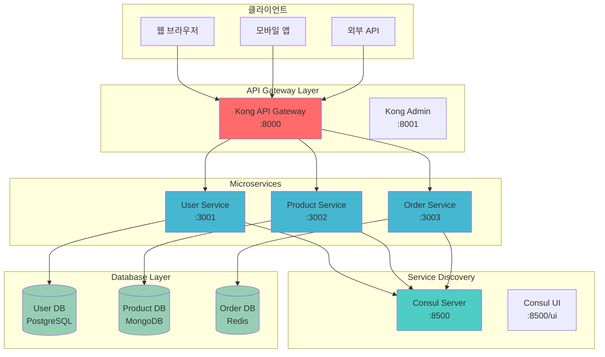
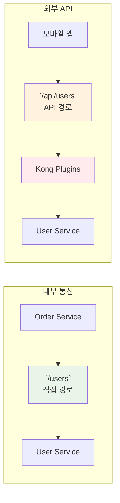

# Week 4 Day 2 Lab 1: API Gateway & 서비스 디스커버리 구축

<div align="center">

**🌐 API Gateway** • **🔍 Service Discovery** • **🔄 Load Balancing**

*마이크로서비스 간 통신과 외부 접근을 위한 통합 게이트웨이 구축*

</div>

---

## 🕘 실습 정보
**시간**: 12:00-13:50 (110분, 점심시간 포함)
**목표**: Kong API Gateway와 Consul을 이용한 서비스 메시 구축
**방식**: 페어 프로그래밍으로 단계별 구현

## 🎯 실습 목표

### 📚 학습 목표
- **API Gateway 패턴**: 단일 진입점을 통한 마이크로서비스 접근
- **서비스 디스커버리**: 동적 서비스 등록 및 발견 메커니즘
- **로드 밸런싱**: 트래픽 분산과 장애 복구 전략

### 🛠️ 구현 목표
- **Kong API Gateway**: 통합 API 관리 플랫폼 구축
- **Consul**: 서비스 레지스트리 및 헬스체크 시스템
- **마이크로서비스**: 3개 서비스 간 통신 구현

---

## 🏗️ 전체 아키텍처



### 🔍 API Gateway 라우팅 전략

이 실습에서는 **두 가지 접근 방식**을 구현하여 API Gateway의 다양한 활용법을 학습합니다:

#### **1. 직접 경로 (Direct Path)**
```bash
# 클라이언트 → Kong → 백엔드 서비스 (1:1 매핑)
GET /users     → user-service:3001/users
GET /products  → product-service:3002/products
GET /orders    → order-service:3003/orders
```

**특징**:
- ⚡ **빠른 성능**: 최소한의 오버헤드
- 🔧 **단순함**: 직접적인 프록시 역할
- 🏠 **내부 통신**: 마이크로서비스 간 통신에 적합

#### **2. API 경로 (API Path)**
```bash
# 클라이언트 → Kong → Request Transformer → 백엔드 서비스
GET /api/users     → (변환) → user-service:3001/users
GET /api/products  → (변환) → product-service:3002/products  
GET /api/orders    → (변환) → order-service:3003/orders
```

**특징**:
- 🛡️ **보안 강화**: 백엔드 구조 숨김
- 📈 **확장성**: 버전 관리 가능 (`/api/v1/users`, `/api/v2/users`)
- 🔍 **중앙 관리**: 통합 로깅, 인증, 모니터링
- 🌐 **외부 API**: 클라이언트 애플리케이션용

### 💡 실무 적용 시나리오



**실제 기업 사례**:
- **Netflix**: 내부 통신은 직접 경로, 외부 API는 `/api/v1/` 형태
- **Uber**: `/api/rider/users` (승객용), `/api/driver/users` (운전자용)

이러한 **이중 접근 방식**을 통해 **성능과 보안을 모두 확보**하는 현대적인 API Gateway 패턴을 학습할 수 있습니다.

---

## 🛠️ Step 1: 환경 준비 및 네트워크 구성 (15분)

### 🔧 시스템 환경 준비 (필수)

**환경 확인 및 필수 도구 설치**
```bash
cd theory/week_04/day2/lab_scripts/lab1
./setup-environment.sh
```

**📋 스크립트 내용**: [setup-environment.sh](./lab_scripts/lab1/setup-environment.sh)

> 💡 **필수 도구**: Docker, jq, curl이 설치되어 있어야 합니다.  
> 환경 준비 스크립트가 자동으로 확인하고 설치 가이드를 제공합니다.

### 🚀 전체 서비스 자동 구축 (권장)

**원클릭 설치**
```bash
./setup-all-services.sh
```

**📋 스크립트 내용**: [setup-all-services.sh](./lab_scripts/lab1/setup-all-services.sh)

> 💡 **자동 구축 스크립트**는 아래 모든 단계를 자동으로 실행합니다.  
> 학습 목적으로 각 단계를 이해하고 싶다면 아래 수동 실행을 따라하세요.

### Step 1-1: Docker 네트워크 생성 (수동 실행)

**🚀 자동화 스크립트 사용**
```bash
cd theory/week_04/day2/lab_scripts/lab1
./setup-network.sh
```

**📋 스크립트 내용**: [setup-network.sh](./lab_scripts/lab1/setup-network.sh)

**1-1. 수동 실행 (학습용)**
```bash
# 마이크로서비스 전용 네트워크 생성
docker network create --driver bridge microservices-net

# 네트워크 정보 확인
docker network ls
docker network inspect microservices-net
```

### Step 1-2: 기본 디렉토리 구조 생성

```bash
# 프로젝트 디렉토리 생성
mkdir -p ~/microservices-lab/{services,gateway,discovery,data}
cd ~/microservices-lab

# 각 서비스별 디렉토리
mkdir -p services/{user-service,product-service,order-service}
mkdir -p gateway/kong
mkdir -p discovery/consul
mkdir -p data/{postgres,mongo,redis}
```

---

## 🛠️ Step 2: Consul 서비스 디스커버리 구축 (20분)

### Step 2-1: Consul 서버 배포

**🚀 자동화 스크립트 사용**
```bash
./setup-consul.sh
```

**📋 스크립트 내용**: [setup-consul.sh](./lab_scripts/lab1/setup-consul.sh)

**2-1. 수동 실행 (학습용)**
```bash
# Consul 서버 실행
docker run -d \
  --name consul-server \
  --network microservices-net \
  -p 8500:8500 \
  -p 8600:8600/udp \
  consul:1.15 \
  agent -server -ui -node=server-1 -bootstrap-expect=1 -client=0.0.0.0

# Consul 상태 확인
docker logs consul-server
curl http://localhost:8500/v1/status/leader
```

### Step 2-2: Consul 설정 및 확인

```bash
# Consul UI 접속 확인
echo "Consul UI: http://localhost:8500/ui"

# API를 통한 노드 정보 확인
curl -s http://localhost:8500/v1/catalog/nodes | jq '.'

# 서비스 목록 확인 (아직 비어있음)
curl -s http://localhost:8500/v1/catalog/services | jq '.'
```

---

## 🛠️ Step 3: 마이크로서비스 구축 (30분)

### Step 3-1: User Service 구축

**🚀 자동화 스크립트 사용**
```bash
./deploy-user-service.sh
```

**📋 스크립트 내용**: [deploy-user-service.sh](./lab_scripts/lab1/deploy-user-service.sh)

**3-1. 수동 실행 (학습용)**
```bash
# PostgreSQL 데이터베이스
docker run -d \
  --name user-db \
  --network microservices-net \
  -e POSTGRES_DB=userdb \
  -e POSTGRES_USER=admin \
  -e POSTGRES_PASSWORD=password \
  -v ~/microservices-lab/data/postgres:/var/lib/postgresql/data \
  postgres:13

# User Service (Node.js)
cat > ~/microservices-lab/services/user-service/app.js << 'EOF'
const express = require('express');
const consul = require('consul')();
const app = express();
const PORT = 3001;

app.use(express.json());

// 사용자 목록 (임시 데이터)
let users = [
  { id: 1, name: 'Alice', email: 'alice@example.com' },
  { id: 2, name: 'Bob', email: 'bob@example.com' }
];

// 헬스체크 엔드포인트
app.get('/health', (req, res) => {
  res.json({ status: 'healthy', service: 'user-service' });
});

// 사용자 목록 조회
app.get('/users', (req, res) => {
  res.json(users);
});

// 사용자 상세 조회
app.get('/users/:id', (req, res) => {
  const user = users.find(u => u.id === parseInt(req.params.id));
  if (!user) return res.status(404).json({ error: 'User not found' });
  res.json(user);
});

// 서버 시작 및 Consul 등록
app.listen(PORT, () => {
  console.log(`User Service running on port ${PORT}`);
  
  // Consul에 서비스 등록
  consul.agent.service.register({
    id: 'user-service-1',
    name: 'user-service',
    tags: ['api', 'users'],
    address: 'user-service',
    port: PORT,
    check: {
      http: `http://user-service:${PORT}/health`,
      interval: '10s'
    }
  }, (err) => {
    if (err) console.error('Consul registration failed:', err);
    else console.log('Service registered with Consul');
  });
});
EOF

# User Service 컨테이너 실행
docker run -d \
  --name user-service \
  --network microservices-net \
  -p 3001:3001 \
  -v ~/microservices-lab/services/user-service:/app \
  -w /app \
  node:16-alpine \
  sh -c "npm init -y && npm install express consul && node app.js"
```

### Step 3-2: Product Service 구축

**🚀 자동화 스크립트 사용**
```bash
./deploy-product-service.sh
```

**3-2. 수동 실행 (학습용)**
```bash
# MongoDB 데이터베이스
docker run -d \
  --name product-db \
  --network microservices-net \
  -e MONGO_INITDB_ROOT_USERNAME=admin \
  -e MONGO_INITDB_ROOT_PASSWORD=password \
  -v ~/microservices-lab/data/mongo:/data/db \
  mongo:5

# Product Service 코드 생성
cat > ~/microservices-lab/services/product-service/app.js << 'EOF'
const express = require('express');
const consul = require('consul')();
const app = express();
const PORT = 3002;

app.use(express.json());

// 상품 목록 (임시 데이터)
let products = [
  { id: 1, name: 'Laptop', price: 999.99, category: 'Electronics' },
  { id: 2, name: 'Book', price: 19.99, category: 'Education' }
];

app.get('/health', (req, res) => {
  res.json({ status: 'healthy', service: 'product-service' });
});

app.get('/products', (req, res) => {
  res.json(products);
});

app.get('/products/:id', (req, res) => {
  const product = products.find(p => p.id === parseInt(req.params.id));
  if (!product) return res.status(404).json({ error: 'Product not found' });
  res.json(product);
});

app.listen(PORT, () => {
  console.log(`Product Service running on port ${PORT}`);
  
  consul.agent.service.register({
    id: 'product-service-1',
    name: 'product-service',
    tags: ['api', 'products'],
    address: 'product-service',
    port: PORT,
    check: {
      http: `http://product-service:${PORT}/health`,
      interval: '10s'
    }
  });
});
EOF

# Product Service 실행
docker run -d \
  --name product-service \
  --network microservices-net \
  -p 3002:3002 \
  -v ~/microservices-lab/services/product-service:/app \
  -w /app \
  node:16-alpine \
  sh -c "npm init -y && npm install express consul && node app.js"
```

### Step 3-3: Order Service 구축

**🚀 자동화 스크립트 사용**
```bash
./deploy-order-service.sh
```

**3-3. 수동 실행 (학습용)**
```bash
# Redis 캐시
docker run -d \
  --name order-cache \
  --network microservices-net \
  -v ~/microservices-lab/data/redis:/data \
  redis:7-alpine

# Order Service 코드 생성
cat > ~/microservices-lab/services/order-service/app.js << 'EOF'
const express = require('express');
const consul = require('consul')();
const axios = require('axios');
const app = express();
const PORT = 3003;

app.use(express.json());

let orders = [
  { id: 1, userId: 1, productId: 1, quantity: 2, status: 'completed' }
];

app.get('/health', (req, res) => {
  res.json({ status: 'healthy', service: 'order-service' });
});

app.get('/orders', (req, res) => {
  res.json(orders);
});

// 주문 상세 정보 (다른 서비스 호출)
app.get('/orders/:id/details', async (req, res) => {
  try {
    const order = orders.find(o => o.id === parseInt(req.params.id));
    if (!order) return res.status(404).json({ error: 'Order not found' });

    // 서비스 디스커버리를 통한 다른 서비스 호출
    const userResponse = await axios.get(`http://user-service:3001/users/${order.userId}`);
    const productResponse = await axios.get(`http://product-service:3002/products/${order.productId}`);

    res.json({
      ...order,
      user: userResponse.data,
      product: productResponse.data
    });
  } catch (error) {
    res.status(500).json({ error: 'Failed to fetch order details' });
  }
});

app.listen(PORT, () => {
  console.log(`Order Service running on port ${PORT}`);
  
  consul.agent.service.register({
    id: 'order-service-1',
    name: 'order-service',
    tags: ['api', 'orders'],
    address: 'order-service',
    port: PORT,
    check: {
      http: `http://order-service:${PORT}/health`,
      interval: '10s'
    }
  });
});
EOF

# Order Service 실행
docker run -d \
  --name order-service \
  --network microservices-net \
  -p 3003:3003 \
  -v ~/microservices-lab/services/order-service:/app \
  -w /app \
  node:16-alpine \
  sh -c "npm init -y && npm install express consul axios && node app.js"
```

---

## 🛠️ Step 4: Kong API Gateway 구축 (25분)

### Step 4-1: Kong 데이터베이스 준비

**🚀 자동화 스크립트 사용**
```bash
./setup-kong.sh
```

**📋 스크립트 내용**: [setup-kong.sh](./lab_scripts/lab1/setup-kong.sh)

**4-1. 수동 실행 (학습용)**
```bash
# Kong 전용 PostgreSQL
docker run -d \
  --name kong-database \
  --network microservices-net \
  -e POSTGRES_USER=kong \
  -e POSTGRES_DB=kong \
  -e POSTGRES_PASSWORD=kong \
  postgres:13

# Kong 데이터베이스 마이그레이션
docker run --rm \
  --network microservices-net \
  -e KONG_DATABASE=postgres \
  -e KONG_PG_HOST=kong-database \
  -e KONG_PG_USER=kong \
  -e KONG_PG_PASSWORD=kong \
  kong:3.4 kong migrations bootstrap
```

### Step 4-2: Kong Gateway 실행

```bash
# Kong Gateway 실행
docker run -d \
  --name kong-gateway \
  --network microservices-net \
  -e KONG_DATABASE=postgres \
  -e KONG_PG_HOST=kong-database \
  -e KONG_PG_USER=kong \
  -e KONG_PG_PASSWORD=kong \
  -e KONG_PROXY_ACCESS_LOG=/dev/stdout \
  -e KONG_ADMIN_ACCESS_LOG=/dev/stdout \
  -e KONG_PROXY_ERROR_LOG=/dev/stderr \
  -e KONG_ADMIN_ERROR_LOG=/dev/stderr \
  -e KONG_ADMIN_LISTEN=0.0.0.0:8001 \
  -p 8000:8000 \
  -p 8001:8001 \
  kong:3.4

# Kong 상태 확인
sleep 10
curl -i http://localhost:8001/
```

### Step 4-3: 서비스 및 라우트 등록

**🚀 자동화 스크립트 사용**
```bash
./configure-kong-routes.sh
```

**4-3. 수동 실행 (학습용)**
```bash
# User Service 등록
curl -i -X POST http://localhost:8001/services/ \
  --data "name=user-service" \
  --data "url=http://user-service:3001"

curl -i -X POST http://localhost:8001/services/user-service/routes \
  --data "paths[]=/api/users"

# Product Service 등록
curl -i -X POST http://localhost:8001/services/ \
  --data "name=product-service" \
  --data "url=http://product-service:3002"

curl -i -X POST http://localhost:8001/services/product-service/routes \
  --data "paths[]=/api/products"

# Order Service 등록
curl -i -X POST http://localhost:8001/services/ \
  --data "name=order-service" \
  --data "url=http://order-service:3003"

curl -i -X POST http://localhost:8001/services/order-service/routes \
  --data "paths[]=/api/orders"

# 등록된 서비스 확인
curl -s http://localhost:8001/services | jq '.'
curl -s http://localhost:8001/routes | jq '.'
```

---

## 🛠️ Step 5: 통합 테스트 및 검증 (20분)

### Step 5-1: 서비스 디스커버리 확인

**🚀 자동화 스크립트 사용**
```bash
./test-service-discovery.sh
```

**📋 스크립트 내용**: [test-service-discovery.sh](./lab_scripts/lab1/test-service-discovery.sh)

**5-1. 수동 실행 (학습용)**
```bash
# Consul에 등록된 서비스 확인
echo "=== Consul 서비스 목록 ==="
curl -s http://localhost:8500/v1/catalog/services | jq '.'

# 각 서비스의 헬스체크 상태 확인
echo "=== User Service 헬스체크 ==="
curl -s http://localhost:8500/v1/health/service/user-service | jq '.'

echo "=== Product Service 헬스체크 ==="
curl -s http://localhost:8500/v1/health/service/product-service | jq '.'

echo "=== Order Service 헬스체크 ==="
curl -s http://localhost:8500/v1/health/service/order-service | jq '.'
```

### Step 5-2: API Gateway 테스트

```bash
# Kong을 통한 서비스 접근 테스트
echo "=== API Gateway 테스트 ==="

# 사용자 목록 조회
echo "1. 사용자 목록:"
curl -s http://localhost:8000/api/users | jq '.'

# 상품 목록 조회
echo "2. 상품 목록:"
curl -s http://localhost:8000/api/products | jq '.'

# 주문 목록 조회
echo "3. 주문 목록:"
curl -s http://localhost:8000/api/orders | jq '.'

# 주문 상세 정보 (서비스 간 통신)
echo "4. 주문 상세 정보:"
curl -s http://localhost:8000/api/orders/1/details | jq '.'
```

### Step 5-3: 로드 밸런싱 테스트

```bash
# User Service 추가 인스턴스 생성
docker run -d \
  --name user-service-2 \
  --network microservices-net \
  -v ~/microservices-lab/services/user-service:/app \
  -w /app \
  node:16-alpine \
  sh -c "npm init -y && npm install express consul && node app.js"

# 로드 밸런싱 확인 (여러 번 호출)
for i in {1..5}; do
  echo "Request $i:"
  curl -s http://localhost:8000/api/users | jq '.[] | select(.id==1) | .name'
done
```

---

## ✅ 실습 체크포인트

### ✅ 기본 구성 확인
- [ ] **Consul 서비스 디스커버리**: 3개 서비스 모두 등록됨
- [ ] **Kong API Gateway**: 모든 라우트 정상 동작
- [ ] **마이크로서비스**: 각 서비스 독립적 실행
- [ ] **서비스 간 통신**: Order Service에서 다른 서비스 호출 성공

### ✅ 고급 기능 확인
- [ ] **헬스체크**: 모든 서비스 헬스체크 통과
- [ ] **로드 밸런싱**: 다중 인스턴스 트래픽 분산
- [ ] **서비스 디스커버리**: 동적 서비스 등록/해제
- [ ] **API 게이트웨이**: 통합 엔드포인트 제공

### ✅ 모니터링 확인
- [ ] **Consul UI**: http://localhost:8500/ui 접속 가능
- [ ] **Kong Admin**: http://localhost:8001 API 응답
- [ ] **서비스 로그**: 각 컨테이너 로그 정상 출력
- [ ] **네트워크 통신**: 컨테이너 간 통신 정상

---

## 🚀 심화 실습 (선택사항)

### 1. Kong 플러그인 적용
```bash
# Rate Limiting 플러그인 적용
curl -X POST http://localhost:8001/services/user-service/plugins \
  --data "name=rate-limiting" \
  --data "config.minute=10"

# JWT 인증 플러그인 적용
curl -X POST http://localhost:8001/services/product-service/plugins \
  --data "name=jwt"
```

### 2. Consul Connect (Service Mesh)
```bash
# Consul Connect 활성화
docker exec consul-server consul connect ca get-config

# 서비스 메시 프록시 설정
# (고급 기능으로 별도 실습에서 다룸)
```

### 3. 모니터링 대시보드
```bash
# Prometheus + Grafana 연동
# Kong 메트릭 수집 설정
curl -X POST http://localhost:8001/plugins \
  --data "name=prometheus"
```

---

## 🧹 실습 정리

**🚀 자동화 스크립트 사용**
```bash
./cleanup.sh
```

**📋 스크립트 내용**: [cleanup.sh](./lab_scripts/lab1/cleanup.sh)

**수동 정리**
```bash
# 모든 컨테이너 중지 및 제거
docker stop kong-gateway kong-database order-service product-service user-service order-cache product-db user-db consul-server user-service-2
docker rm kong-gateway kong-database order-service product-service user-service order-cache product-db user-db consul-server user-service-2

# 네트워크 제거
docker network rm microservices-net

# 볼륨 정리 (선택사항)
docker volume prune -f
```

---

## 💡 실습 회고

### 🤝 페어 회고 (5분)
1. **API Gateway의 장점**: 단일 진입점의 이점은 무엇인가요?
2. **서비스 디스커버리**: 수동 설정 대비 어떤 장점이 있나요?
3. **마이크로서비스 통신**: 서비스 간 호출에서 고려할 점은?
4. **실무 적용**: 실제 프로덕션에서 추가로 필요한 기능은?

### 📊 학습 성과
- **아키텍처 이해**: API Gateway 패턴과 서비스 메시 기초 개념
- **실무 도구**: Kong과 Consul을 이용한 실제 구현 경험
- **마이크로서비스**: 서비스 간 통신과 의존성 관리 체험
- **운영 관점**: 서비스 등록, 헬스체크, 로드밸런싱 이해

### 🔗 다음 단계 연결
- **Lab 2**: 고급 API Gateway 기능 (인증, 인가, 모니터링)
- **Day 3**: 데이터 관리와 상태 관리 전략
- **실무 연계**: 클라우드 네이티브 환경에서의 서비스 메시 구축
