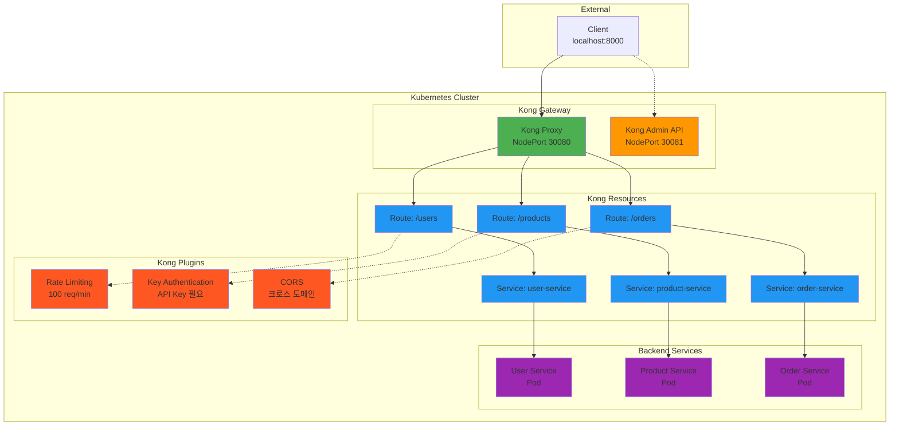

# Week 4 Day 2 Lab 1: Kong API Gateway 구축

<div align="center">

**🦍 Kong Gateway** • **🔌 플러그인** • **🎯 API 관리**

*Kong으로 프로덕션급 API Gateway 구축하기*

</div>

---

## 🕘 실습 정보
**시간**: 12:00-12:50 (50분)  
**목표**: Kong API Gateway 설치 및 기본 기능 체험  
**방식**: 단계별 실습 + 플러그인 적용  
**작업 위치**: `theory/week_04/day2/lab_scripts/lab1`

## 🎯 실습 목표

### 📚 학습 목표
- **Kong 기초**: API Gateway의 핵심 개념 이해
- **Service & Route**: Kong의 라우팅 구조 습득
- **플러그인**: Rate Limiting, Authentication 적용
- **실무 연계**: 간단하고 직관적인 API 관리 체험

### 🛠️ 구현 목표
- **Kong 설치**: DB-less 모드로 빠른 설치
- **3개 서비스**: User, Product, Order 서비스 배포
- **라우팅 설정**: 경로 기반 라우팅 구성
- **플러그인 적용**: Rate Limiting, Key Auth, CORS

---

## 🏗️ 전체 아키텍처



---

## 🛠️ Step 1: 환경 준비 (5분)

### Step 1-1: 작업 디렉토리 이동

```bash
cd theory/week_04/day2/lab_scripts/lab1
```

### Step 1-2: Kind 클러스터 생성

**🚀 자동화 스크립트 사용**
```bash
./setup-cluster.sh
```

**📋 스크립트 내용**: [setup-cluster.sh](./lab_scripts/lab1/setup-cluster.sh)

**수동 실행 (학습용)**:
```bash
# 기존 클러스터 삭제
kind delete cluster --name lab-cluster

# 포트 매핑 포함 클러스터 생성
cat <<EOF | kind create cluster --name lab-cluster --config=-
kind: Cluster
apiVersion: kind.x-k8s.io/v1alpha4
nodes:
- role: control-plane
  extraPortMappings:
  - containerPort: 30080  # Kong Proxy
    hostPort: 8000
  - containerPort: 30081  # Kong Admin
    hostPort: 8001
EOF
```

---

## 🦍 Step 2: Kong 설치 (10분)

### Step 2-1: Kong Gateway 배포

**🚀 자동화 스크립트 사용**
```bash
./install-kong.sh
```

**📋 스크립트 내용**: [install-kong.sh](./lab_scripts/lab1/install-kong.sh)

**수동 실행 (학습용)**:
```bash
# Kong 네임스페이스 생성
kubectl create namespace kong

# Kong Gateway 배포 (DB-less 모드)
kubectl apply -f - <<EOF
apiVersion: v1
kind: Service
metadata:
  name: kong-proxy
  namespace: kong
spec:
  type: NodePort
  ports:
  - name: proxy
    port: 80
    targetPort: 8000
    nodePort: 30080
  - name: proxy-ssl
    port: 443
    targetPort: 8443
  selector:
    app: kong
---
apiVersion: v1
kind: Service
metadata:
  name: kong-admin
  namespace: kong
spec:
  type: NodePort
  ports:
  - name: admin
    port: 8001
    targetPort: 8001
    nodePort: 30081
  selector:
    app: kong
---
apiVersion: apps/v1
kind: Deployment
metadata:
  name: kong
  namespace: kong
spec:
  replicas: 1
  selector:
    matchLabels:
      app: kong
  template:
    metadata:
      labels:
        app: kong
    spec:
      containers:
      - name: kong
        image: kong:3.4
        env:
        - name: KONG_DATABASE
          value: "off"
        - name: KONG_PROXY_ACCESS_LOG
          value: "/dev/stdout"
        - name: KONG_ADMIN_ACCESS_LOG
          value: "/dev/stdout"
        - name: KONG_PROXY_ERROR_LOG
          value: "/dev/stderr"
        - name: KONG_ADMIN_ERROR_LOG
          value: "/dev/stderr"
        - name: KONG_ADMIN_LISTEN
          value: "0.0.0.0:8001"
        ports:
        - containerPort: 8000
          name: proxy
        - containerPort: 8443
          name: proxy-ssl
        - containerPort: 8001
          name: admin
EOF

# Kong 준비 대기
kubectl wait --for=condition=ready pod -l app=kong -n kong --timeout=120s
```

### Step 2-2: Kong 상태 확인

```bash
# Kong Pod 확인
kubectl get pods -n kong

# Kong 서비스 확인
kubectl get svc -n kong

# Kong Admin API 테스트
curl http://localhost:8001
```

---

## 🚀 Step 3: 백엔드 서비스 배포 (10분)

### Step 3-1: 마이크로서비스 배포

**🚀 자동화 스크립트 사용**
```bash
./deploy-services.sh
```

**📋 스크립트 내용**: [deploy-services.sh](./lab_scripts/lab1/deploy-services.sh)

**수동 실행 (학습용)**:
```bash
# User Service
kubectl apply -f - <<EOF
apiVersion: apps/v1
kind: Deployment
metadata:
  name: user-service
spec:
  replicas: 2
  selector:
    matchLabels:
      app: user-service
  template:
    metadata:
      labels:
        app: user-service
    spec:
      containers:
      - name: user-service
        image: hashicorp/http-echo:latest
        args:
        - "-text=User Service Response"
        - "-listen=:8080"
        ports:
        - containerPort: 8080
---
apiVersion: v1
kind: Service
metadata:
  name: user-service
spec:
  selector:
    app: user-service
  ports:
  - port: 80
    targetPort: 8080
EOF

# Product Service
kubectl apply -f - <<EOF
apiVersion: apps/v1
kind: Deployment
metadata:
  name: product-service
spec:
  replicas: 2
  selector:
    matchLabels:
      app: product-service
  template:
    metadata:
      labels:
        app: product-service
    spec:
      containers:
      - name: product-service
        image: hashicorp/http-echo:latest
        args:
        - "-text=Product Service Response"
        - "-listen=:8080"
        ports:
        - containerPort: 8080
---
apiVersion: v1
kind: Service
metadata:
  name: product-service
spec:
  selector:
    app: product-service
  ports:
  - port: 80
    targetPort: 8080
EOF

# Order Service
kubectl apply -f - <<EOF
apiVersion: apps/v1
kind: Deployment
metadata:
  name: order-service
spec:
  replicas: 2
  selector:
    matchLabels:
      app: order-service
  template:
    metadata:
      labels:
        app: order-service
    spec:
      containers:
      - name: order-service
        image: hashicorp/http-echo:latest
        args:
        - "-text=Order Service Response"
        - "-listen=:8080"
        ports:
        - containerPort: 8080
---
apiVersion: v1
kind: Service
metadata:
  name: order-service
spec:
  selector:
    app: order-service
  ports:
  - port: 80
    targetPort: 8080
EOF

# 서비스 준비 대기
kubectl wait --for=condition=ready pod -l app=user-service --timeout=60s
kubectl wait --for=condition=ready pod -l app=product-service --timeout=60s
kubectl wait --for=condition=ready pod -l app=order-service --timeout=60s
```

---

## 🔀 Step 4: Kong Service & Route 설정 (15분)

### Step 4-1: Kong Service 생성

**🚀 자동화 스크립트 사용**
```bash
./configure-kong.sh
```

**📋 스크립트 내용**: [configure-kong.sh](./lab_scripts/lab1/configure-kong.sh)

**수동 실행 (학습용)**:
```bash
# User Service 등록
curl -i -X POST http://localhost:8001/services \
  --data name=user-service \
  --data url='http://user-service.default.svc.cluster.local:80'

# User Route 생성
curl -i -X POST http://localhost:8001/services/user-service/routes \
  --data 'paths[]=/users' \
  --data name=user-route

# Product Service 등록
curl -i -X POST http://localhost:8001/services \
  --data name=product-service \
  --data url='http://product-service.default.svc.cluster.local:80'

# Product Route 생성
curl -i -X POST http://localhost:8001/services/product-service/routes \
  --data 'paths[]=/products' \
  --data name=product-route

# Order Service 등록
curl -i -X POST http://localhost:8001/services \
  --data name=order-service \
  --data url='http://order-service.default.svc.cluster.local:80'

# Order Route 생성
curl -i -X POST http://localhost:8001/services/order-service/routes \
  --data 'paths[]=/orders' \
  --data name=order-route
```

### Step 4-2: 라우팅 테스트

```bash
# User Service 테스트
curl http://localhost:8000/users

# Product Service 테스트
curl http://localhost:8000/products

# Order Service 테스트
curl http://localhost:8000/orders
```

**예상 결과**:
```
User Service Response
Product Service Response
Order Service Response
```

---

## 🔌 Step 5: 플러그인 적용 (10분)

### Step 5-1: Rate Limiting 플러그인

**User Service에 Rate Limiting 적용**:
```bash
curl -i -X POST http://localhost:8001/services/user-service/plugins \
  --data name=rate-limiting \
  --data config.minute=10 \
  --data config.policy=local
```

**테스트**:
```bash
# 10번 이상 호출하면 429 에러
for i in {1..15}; do
  echo "Request $i:"
  curl -i http://localhost:8000/users
  sleep 1
done
```

### Step 5-2: Key Authentication 플러그인

**Product Service에 Key Auth 적용**:
```bash
# Key Auth 플러그인 활성화
curl -i -X POST http://localhost:8001/services/product-service/plugins \
  --data name=key-auth

# Consumer 생성
curl -i -X POST http://localhost:8001/consumers \
  --data username=testuser

# API Key 생성
curl -i -X POST http://localhost:8001/consumers/testuser/key-auth \
  --data key=my-secret-key
```

**테스트**:
```bash
# 인증 없이 호출 (실패)
curl http://localhost:8000/products

# API Key로 호출 (성공)
curl -H "apikey: my-secret-key" http://localhost:8000/products
```

### Step 5-3: CORS 플러그인

**Order Service에 CORS 적용**:
```bash
curl -i -X POST http://localhost:8001/services/order-service/plugins \
  --data name=cors \
  --data config.origins=* \
  --data config.methods=GET,POST,PUT,DELETE \
  --data config.headers=Accept,Content-Type,Authorization
```

**테스트**:
```bash
# CORS 헤더 확인
curl -i -X OPTIONS http://localhost:8000/orders \
  -H "Origin: http://example.com" \
  -H "Access-Control-Request-Method: GET"
```

---

## ✅ 실습 체크포인트

### ✅ 기본 구성 확인
- [ ] Kind 클러스터 생성 (포트 8000, 8001 매핑)
- [ ] Kong Gateway 배포 완료
- [ ] Kong Admin API 접근 가능 (localhost:8001)
- [ ] Kong Proxy 접근 가능 (localhost:8000)

### ✅ 서비스 배포 확인
- [ ] 3개 마이크로서비스 배포 완료
- [ ] 모든 Pod Running 상태
- [ ] Kubernetes Service 생성 확인

### ✅ Kong 설정 확인
- [ ] 3개 Kong Service 생성
- [ ] 3개 Kong Route 생성
- [ ] 경로별 라우팅 동작 확인

### ✅ 플러그인 확인
- [ ] Rate Limiting 동작 확인 (10회 제한)
- [ ] Key Authentication 동작 확인
- [ ] CORS 헤더 확인

---

## 🧹 실습 정리

**🚀 자동화 스크립트 사용**
```bash
./cleanup.sh
```

**수동 정리**:
```bash
# 클러스터 삭제
kind delete cluster --name lab-cluster
```

---

## 💡 실습 회고

### 🤝 페어 회고 (5분)
1. **Kong의 장점**: 가장 인상 깊었던 Kong의 특징은?
2. **플러그인 경험**: 어떤 플러그인이 가장 유용해 보이나요?
3. **Ingress 비교**: Ingress와 비교했을 때 Kong의 장점은?
4. **실무 적용**: 어떤 상황에서 Kong을 사용하고 싶나요?

### 📊 학습 성과
- **Kong 기초**: Service, Route, Plugin 개념 이해
- **API 관리**: 간단하고 직관적인 API Gateway 체험
- **플러그인**: Rate Limiting, Authentication, CORS 적용
- **실무 준비**: 프로덕션급 API Gateway 구축 경험

### 🎯 다음 단계
**Hands-on 1 예고**: Istio Service Mesh 구축
- Istio 설치 및 Sidecar 주입
- VirtualService 트래픽 관리
- Kong과 Istio 비교 체험

---

<div align="center">

**🦍 Kong Gateway** • **🔌 플러그인 생태계** • **🎯 간단한 API 관리**

*Kong으로 API Gateway의 기본을 마스터했습니다!*

</div>
