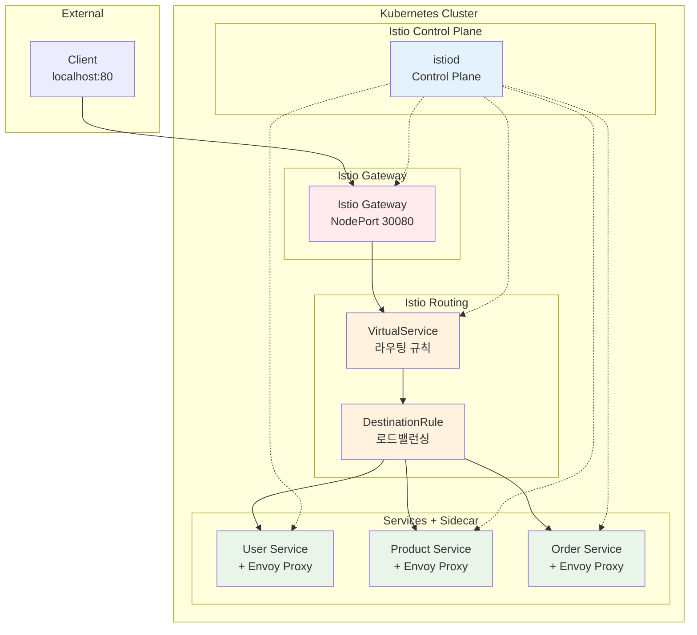

# Week 4 Day 2 Lab 1: Istio Service Mesh 구축

<div align="center">

**🌐 Service Mesh** • **🔍 Istio** • **🔄 Traffic Management**

*Istio VirtualService를 활용한 마이크로서비스 라우팅*

</div>

---

## 🕘 실습 정보
**시간**: 12:00-12:50 (50분)
**목표**: Istio + VirtualService로 마이크로서비스 플랫폼 구축
**방식**: 실무 표준 Service Mesh 패턴 활용
**작업 위치**: `theory/week_04/day2/lab_scripts/lab1`

## 🎯 실습 목표

### 📚 학습 목표
- **Istio 기초**: Service Mesh의 개념과 구조
- **VirtualService**: Istio 라우팅 규칙 설정
- **DestinationRule**: 로드밸런싱 정책 구성
- **실무 연계**: 대기업에서 실제 사용하는 기술 스택

### 🛠️ 구현 목표
- **Istio 설치**: Service Mesh 플랫폼 구축
- **Gateway 구성**: 외부 트래픽 진입점 설정
- **VirtualService**: 경로 기반 라우팅 구현
- **마이크로서비스**: 3개 서비스 배포 및 테스트

---

## 🏗️ 전체 아키텍처



---

## 🛠️ Step 1: 환경 준비 (5분)

### Step 1-1: 작업 디렉토리 이동

```bash
cd theory/week_04/day2/lab_scripts/lab1
```

### Step 1-2: Kind 클러스터 생성 (포트 매핑 포함)

**🚀 자동화 스크립트 사용**
```bash
./setup-environment.sh
```

**📋 스크립트 내용**: [setup-environment.sh](./lab_scripts/lab1/setup-environment.sh)

---

## 🚀 Step 2: Istio 설치 (10분)

**🚀 자동화 스크립트 사용**
```bash
./step2-install-istio.sh
```

**📋 스크립트 내용**: [step2-install-istio.sh](./lab_scripts/lab1/step2-install-istio.sh)

---

## 🚀 Step 3: 마이크로서비스 배포 (10분)

**🚀 자동화 스크립트 사용**
```bash
./step3-deploy-services.sh
```

**📋 스크립트 내용**: [step3-deploy-services.sh](./lab_scripts/lab1/step3-deploy-services.sh)

---

## 🔀 Step 4: Gateway & VirtualService 설정 (15분)

**🚀 자동화 스크립트 사용**
```bash
./step4-setup-routing.sh
```

**📋 스크립트 내용**: [step4-setup-routing.sh](./lab_scripts/lab1/step4-setup-routing.sh)

---

## ✅ Step 5: 통합 테스트 (10분)

**🚀 자동화 스크립트 사용**
```bash
./step5-test.sh
```

**📋 스크립트 내용**: [step5-test.sh](./lab_scripts/lab1/step5-test.sh)

**5-1. 브라우저 테스트**
- http://localhost/users
- http://localhost/products
- http://localhost/orders

---

## ✅ 실습 체크포인트

### ✅ 기본 구성 확인
- [ ] Kind 클러스터 생성 (포트 80 매핑)
- [ ] Istio 설치 완료
- [ ] Ingress Gateway NodePort 30080 설정
- [ ] Sidecar Injection 활성화

### ✅ 서비스 배포 확인
- [ ] 3개 서비스 배포 완료
- [ ] 각 Pod에 2개 컨테이너 (앱 + Envoy)
- [ ] 모든 Pod Running 상태

### ✅ 라우팅 설정 확인
- [ ] Istio Gateway 생성
- [ ] VirtualService 라우팅 규칙 설정
- [ ] DestinationRule 로드밸런싱 설정

### ✅ 통합 테스트 확인
- [ ] localhost/users 정상 응답
- [ ] localhost/products 정상 응답
- [ ] localhost/orders 정상 응답
- [ ] 로드밸런싱 동작 확인

---

## 🧹 실습 정리

**🚀 자동화 스크립트 사용**
```bash
./cleanup.sh
```

---

## 💡 실습 회고

### 🤝 페어 회고 (5분)
1. **Istio vs Ingress**: VirtualService의 장점은 무엇인가요?
2. **Sidecar 패턴**: Envoy Proxy가 각 Pod에 주입되는 이유는?
3. **Service Mesh**: 실무에서 Service Mesh가 필요한 상황은?
4. **포트 매핑**: Kind 클러스터에서 포트 매핑이 필요한 이유는?

### 📊 학습 성과
- **Istio 기초**: Service Mesh 개념과 Sidecar 패턴 이해
- **VirtualService**: Istio 라우팅 규칙 설정 방법 습득
- **실무 기술**: 대기업에서 실제 사용하는 기술 스택 경험
- **트래픽 관리**: Istio를 통한 고급 트래픽 제어 기초

---

<div align="center">

**🌐 Istio Service Mesh** • **🔍 VirtualService 라우팅** • **🔄 Traffic Management**

*실무 표준 기술로 마이크로서비스 플랫폼 구축 완료*

</div>
