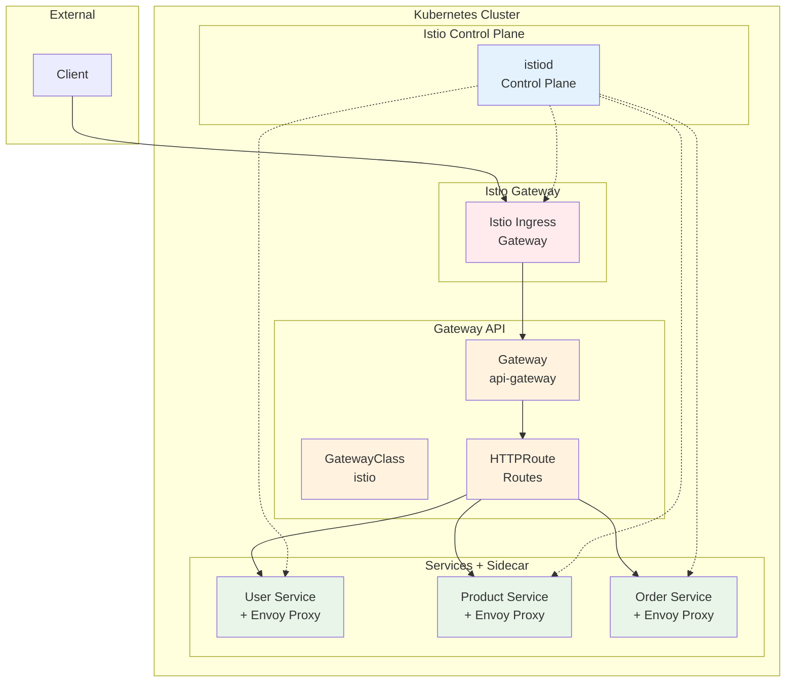

# Week 4 Day 2 Lab 1: Istio Gateway API 구축

<div align="center">

**🌐 Gateway API** • **🔍 Service Mesh** • **🔄 Traffic Management**

*Istio를 활용한 Kubernetes Gateway API 표준 구현*

</div>

---

## 🕘 실습 정보
**시간**: 12:00-13:50 (110분, 점심시간 포함)
**목표**: Istio + Gateway API로 마이크로서비스 플랫폼 구축
**방식**: 실무 표준 기술 스택 활용
**작업 위치**: `theory/week_04/day2/lab_scripts/lab1`

## 🎯 실습 목표

### 📚 학습 목표
- **Istio 기초**: Service Mesh의 개념과 구조
- **Gateway API**: Kubernetes 표준 Gateway API 활용
- **Traffic Management**: 라우팅, 로드밸런싱, 트래픽 분할
- **실무 연계**: 대기업에서 실제 사용하는 기술 스택

### 🛠️ 구현 목표
- **Istio 설치**: Service Mesh 플랫폼 구축
- **Gateway 구성**: Gateway API 리소스 생성
- **마이크로서비스**: 3개 서비스 배포 및 라우팅
- **테스트**: 전체 시스템 통합 테스트

---

## 🏗️ 전체 아키텍처



---

## 🛠️ Step 1: 환경 준비 (5분)

### Step 1-1: 작업 디렉토리 이동

```bash
cd theory/week_04/day2/lab_scripts/lab1
```

### Step 1-2: 환경 설정

```bash
./setup-environment.sh
```

---

## 🚀 Step 2: Istio 설치 (15분)

**🚀 자동화 스크립트 사용**
```bash
./step2-install-istio.sh
```

**📋 스크립트 내용**: [step2-install-istio.sh](./lab_scripts/lab1/step2-install-istio.sh)

---

## 🌐 Step 3: Gateway API 설치 (5분)

**🚀 자동화 스크립트 사용**
```bash
./step3-install-gateway-api.sh
```

**📋 스크립트 내용**: [step3-install-gateway-api.sh](./lab_scripts/lab1/step3-install-gateway-api.sh)

---

## 🚀 Step 4: 마이크로서비스 배포 (15분)

**🚀 자동화 스크립트 사용**
```bash
./step4-deploy-services.sh
```

**📋 스크립트 내용**: [step4-deploy-services.sh](./lab_scripts/lab1/step4-deploy-services.sh)

---

## 🔀 Step 5: Gateway & HTTPRoute 설정 (20분)

**🚀 자동화 스크립트 사용**
```bash
./step5-setup-gateway.sh
```

**📋 스크립트 내용**: [step5-setup-gateway.sh](./lab_scripts/lab1/step5-setup-gateway.sh)

---

## ✅ Step 6: 통합 테스트 (30분)

**🚀 자동화 스크립트 사용**
```bash
./step6-test.sh
```

**📋 스크립트 내용**: [step6-test.sh](./lab_scripts/lab1/step6-test.sh)

---

## 🧹 실습 정리

**🚀 자동화 스크립트 사용**
```bash
./cleanup.sh
```

**📋 스크립트 내용**: [cleanup.sh](./lab_scripts/lab1/cleanup.sh)

---

## 💡 실습 회고

### 🤝 페어 회고 (10분)
1. **Istio vs 기본 Kubernetes**: Sidecar 패턴의 장단점은?
2. **Gateway API**: Ingress와 비교했을 때 어떤 점이 개선되었나요?
3. **Service Mesh**: 실무에서 Service Mesh가 필요한 상황은?
4. **운영**: Istio 도입 시 고려해야 할 점은?

### 📊 학습 성과
- **Istio 기초**: Service Mesh 개념과 Sidecar 패턴 이해
- **Gateway API**: Kubernetes 표준 Gateway API 활용
- **실무 기술**: 대기업에서 실제 사용하는 기술 스택 경험
- **트래픽 관리**: Istio를 통한 고급 트래픽 제어 기초

---

<div align="center">

**🌐 Istio Service Mesh** • **🔍 Gateway API 표준** • **🔄 Traffic Management**

*실무 표준 기술로 마이크로서비스 플랫폼 구축 완료*

</div>
