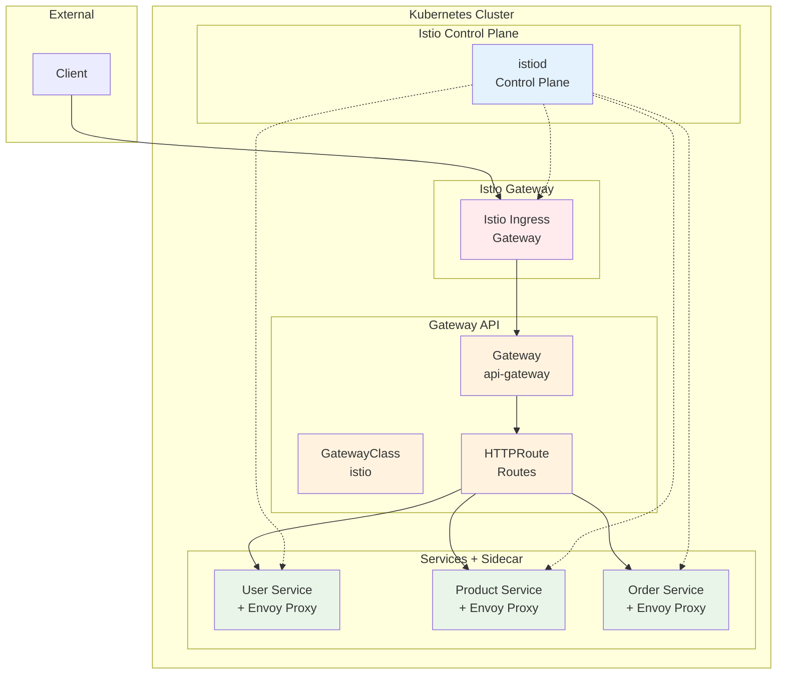

# Week 4 Day 2 Lab 1: Istio Gateway API 구축

<div align="center">

**🌐 Gateway API** • **🔍 Service Mesh** • **🔄 Traffic Management**

*Istio를 활용한 Kubernetes Gateway API 표준 구현*

</div>

---

## 🕘 실습 정보
**시간**: 12:00-13:50 (110분, 점심시간 포함)
**목표**: Istio + Gateway API로 마이크로서비스 플랫폼 구축
**방식**: 실무 표준 기술 스택 활용
**작업 위치**: `theory/week_04/day2/lab_scripts/lab1`

## 🎯 실습 목표

### 📚 학습 목표
- **Istio 기초**: Service Mesh의 개념과 구조
- **Gateway API**: Kubernetes 표준 Gateway API 활용
- **Traffic Management**: 라우팅, 로드밸런싱, 트래픽 분할
- **실무 연계**: 대기업에서 실제 사용하는 기술 스택

### 🛠️ 구현 목표
- **Istio 설치**: Service Mesh 플랫폼 구축
- **Gateway 구성**: Gateway API 리소스 생성
- **마이크로서비스**: 3개 서비스 배포 및 라우팅
- **테스트**: 전체 시스템 통합 테스트

---

## 🏗️ 전체 아키텍처



---

## 🛠️ Step 1: 환경 준비 (5분)

### Step 1-1: 작업 디렉토리 이동

```bash
cd theory/week_04/day2/lab_scripts/lab1
```

### Step 1-2: 환경 설정

```bash
./setup-environment.sh
```

---

## 🚀 Step 2: Istio 설치 (15분)

### Step 2-1: Istio 다운로드 및 설치

```bash
# Istio 다운로드
curl -L https://istio.io/downloadIstio | ISTIO_VERSION=1.20.0 sh -

# PATH 추가
cd istio-1.20.0
export PATH=$PWD/bin:$PATH

# Istio 설치 (minimal profile)
istioctl install --set profile=minimal -y
```

**설치 확인**
```bash
kubectl get pods -n istio-system
kubectl get svc -n istio-system
```

**예상 출력**:
```
NAME                      READY   STATUS    RESTARTS   AGE
istiod-xxxxxxxxxx-xxxxx   1/1     Running   0          30s

NAME            TYPE           CLUSTER-IP      EXTERNAL-IP   PORT(S)
istio-ingressgateway   LoadBalancer   10.96.xxx.xxx   <pending>     15021:xxxxx/TCP,80:xxxxx/TCP,443:xxxxx/TCP
istiod          ClusterIP      10.96.xxx.xxx   <none>        15010/TCP,15012/TCP,443/TCP,15014/TCP
```

### Step 2-2: Default Namespace에 Sidecar Injection 활성화

```bash
kubectl label namespace default istio-injection=enabled

# 확인
kubectl get namespace default --show-labels
```

---

## 🌐 Step 3: Gateway API 설치 (5분)

### Step 3-1: Gateway API CRDs 설치

```bash
kubectl get crd gateways.gateway.networking.k8s.io &> /dev/null || \
  { kubectl kustomize "github.com/kubernetes-sigs/gateway-api/config/crd?ref=v1.0.0" | kubectl apply -f -; }
```

**설치 확인**
```bash
kubectl get crd | grep gateway
```

---

## 🚀 Step 4: 마이크로서비스 배포 (15분)

### Step 4-1: User Service 배포

```bash
cat <<EOF | kubectl apply -f -
apiVersion: apps/v1
kind: Deployment
metadata:
  name: user-service
spec:
  replicas: 2
  selector:
    matchLabels:
      app: user-service
      version: v1
  template:
    metadata:
      labels:
        app: user-service
        version: v1
    spec:
      containers:
      - name: user-service
        image: hashicorp/http-echo:latest
        args:
        - "-text=User Service v1"
        - "-listen=:8080"
        ports:
        - containerPort: 8080
---
apiVersion: v1
kind: Service
metadata:
  name: user-service
spec:
  selector:
    app: user-service
  ports:
  - port: 80
    targetPort: 8080
EOF
```

### Step 4-2: Product Service 배포

```bash
cat <<EOF | kubectl apply -f -
apiVersion: apps/v1
kind: Deployment
metadata:
  name: product-service
spec:
  replicas: 2
  selector:
    matchLabels:
      app: product-service
      version: v1
  template:
    metadata:
      labels:
        app: product-service
        version: v1
    spec:
      containers:
      - name: product-service
        image: hashicorp/http-echo:latest
        args:
        - "-text=Product Service v1"
        - "-listen=:8080"
        ports:
        - containerPort: 8080
---
apiVersion: v1
kind: Service
metadata:
  name: product-service
spec:
  selector:
    app: product-service
  ports:
  - port: 80
    targetPort: 8080
EOF
```

### Step 4-3: Order Service 배포

```bash
cat <<EOF | kubectl apply -f -
apiVersion: apps/v1
kind: Deployment
metadata:
  name: order-service
spec:
  replicas: 2
  selector:
    matchLabels:
      app: order-service
      version: v1
  template:
    metadata:
      labels:
        app: order-service
        version: v1
    spec:
      containers:
      - name: order-service
        image: hashicorp/http-echo:latest
        args:
        - "-text=Order Service v1"
        - "-listen=:8080"
        ports:
        - containerPort: 8080
---
apiVersion: v1
kind: Service
metadata:
  name: order-service
spec:
  selector:
    app: order-service
  ports:
  - port: 80
    targetPort: 8080
EOF
```

### Step 4-4: Sidecar Injection 확인

```bash
# Pod 확인 (2/2 READY = 앱 컨테이너 + Envoy Sidecar)
kubectl get pods

# Sidecar 상세 확인
kubectl describe pod -l app=user-service | grep -A 5 "Containers:"
```

**예상 출력**:
```
NAME                              READY   STATUS    RESTARTS   AGE
user-service-xxxxxxxxxx-xxxxx     2/2     Running   0          30s
user-service-xxxxxxxxxx-xxxxx     2/2     Running   0          30s
product-service-xxxxxxxxxx-xxxxx  2/2     Running   0          30s
...
```

---

## 🔀 Step 5: Gateway & HTTPRoute 설정 (20분)

### Step 5-1: Gateway 생성

```bash
cat <<EOF | kubectl apply -f -
apiVersion: gateway.networking.k8s.io/v1
kind: Gateway
metadata:
  name: api-gateway
  namespace: default
spec:
  gatewayClassName: istio
  listeners:
  - name: http
    hostname: "*.example.com"
    port: 80
    protocol: HTTP
    allowedRoutes:
      namespaces:
        from: Same
EOF
```

**Gateway 확인**
```bash
kubectl get gateway api-gateway
kubectl describe gateway api-gateway
```

### Step 5-2: HTTPRoute 생성

```bash
cat <<EOF | kubectl apply -f -
apiVersion: gateway.networking.k8s.io/v1
kind: HTTPRoute
metadata:
  name: user-route
spec:
  parentRefs:
  - name: api-gateway
  hostnames:
  - "api.example.com"
  rules:
  - matches:
    - path:
        type: PathPrefix
        value: /users
    backendRefs:
    - name: user-service
      port: 80
---
apiVersion: gateway.networking.k8s.io/v1
kind: HTTPRoute
metadata:
  name: product-route
spec:
  parentRefs:
  - name: api-gateway
  hostnames:
  - "api.example.com"
  rules:
  - matches:
    - path:
        type: PathPrefix
        value: /products
    backendRefs:
    - name: product-service
      port: 80
---
apiVersion: gateway.networking.k8s.io/v1
kind: HTTPRoute
metadata:
  name: order-route
spec:
  parentRefs:
  - name: api-gateway
  hostnames:
  - "api.example.com"
  rules:
  - matches:
    - path:
        type: PathPrefix
        value: /orders
    backendRefs:
    - name: order-service
      port: 80
EOF
```

**HTTPRoute 확인**
```bash
kubectl get httproute
```

---

## ✅ Step 6: 통합 테스트 (30분)

### Step 6-1: Ingress Gateway 접근 설정

```bash
# Ingress Gateway Service 확인
kubectl get svc -n istio-system istio-ingressgateway

# Port-forward 설정
kubectl port-forward -n istio-system svc/istio-ingressgateway 8080:80 &
```

### Step 6-2: 기본 라우팅 테스트

```bash
# User Service 테스트
curl -H "Host: api.example.com" http://localhost:8080/users

# Product Service 테스트
curl -H "Host: api.example.com" http://localhost:8080/products

# Order Service 테스트
curl -H "Host: api.example.com" http://localhost:8080/orders
```

**예상 출력**:
```
User Service v1
Product Service v1
Order Service v1
```

### Step 6-3: 로드밸런싱 테스트

```bash
echo "=== 로드밸런싱 테스트 (10회 요청) ==="
for i in {1..10}; do
  echo "Request $i:"
  curl -s -H "Host: api.example.com" http://localhost:8080/users
done
```

### Step 6-4: Istio Sidecar 확인

```bash
# Envoy 설정 확인
kubectl exec -it deploy/user-service -c istio-proxy -- pilot-agent request GET config_dump | head -50

# Istio Proxy 상태 확인
istioctl proxy-status
```

### Step 6-5: Service Mesh 트래픽 확인

```bash
# Kiali 대시보드 (선택사항)
istioctl dashboard kiali &

# 또는 Prometheus 메트릭 확인
kubectl exec -it deploy/user-service -c istio-proxy -- curl localhost:15000/stats/prometheus | grep istio
```

---

## 🧹 실습 정리

```bash
# HTTPRoute 삭제
kubectl delete httproute user-route product-route order-route

# Gateway 삭제
kubectl delete gateway api-gateway

# 서비스 삭제
kubectl delete deployment,service user-service product-service order-service

# Istio 삭제 (선택사항)
istioctl uninstall --purge -y
kubectl delete namespace istio-system

# Gateway API CRDs 삭제 (선택사항)
kubectl kustomize "github.com/kubernetes-sigs/gateway-api/config/crd?ref=v1.0.0" | kubectl delete -f -

# Namespace label 제거
kubectl label namespace default istio-injection-

# Port-forward 종료
pkill -f "kubectl port-forward"
```

---

## 💡 실습 회고

### 🤝 페어 회고 (10분)
1. **Istio vs 기본 Kubernetes**: Sidecar 패턴의 장단점은?
2. **Gateway API**: Ingress와 비교했을 때 어떤 점이 개선되었나요?
3. **Service Mesh**: 실무에서 Service Mesh가 필요한 상황은?
4. **운영**: Istio 도입 시 고려해야 할 점은?

### 📊 학습 성과
- **Istio 기초**: Service Mesh 개념과 Sidecar 패턴 이해
- **Gateway API**: Kubernetes 표준 Gateway API 활용
- **실무 기술**: 대기업에서 실제 사용하는 기술 스택 경험
- **트래픽 관리**: Istio를 통한 고급 트래픽 제어 기초

---

<div align="center">

**🌐 Istio Service Mesh** • **🔍 Gateway API 표준** • **🔄 Traffic Management**

*실무 표준 기술로 마이크로서비스 플랫폼 구축 완료*

</div>
