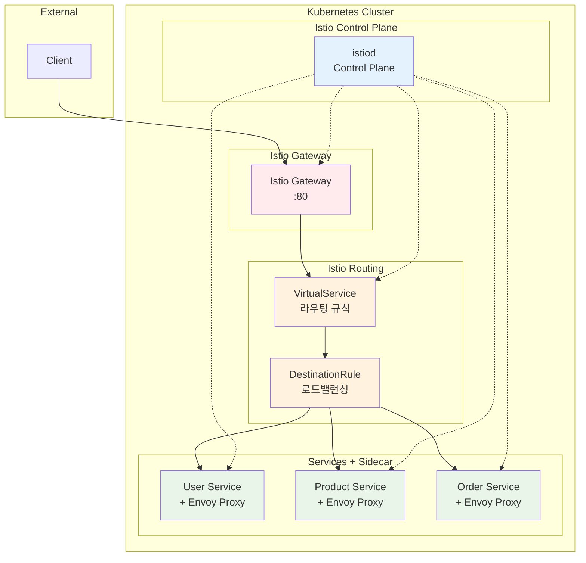

# Week 4 Day 2 Lab 1: Istio Service Mesh 구축

<div align="center">

**🌐 Service Mesh** • **🔍 Istio** • **🔄 Traffic Management**

*Istio VirtualService를 활용한 마이크로서비스 라우팅*

</div>

---

## 🕘 실습 정보
**시간**: 12:00-13:50 (110분, 점심시간 포함)
**목표**: Istio + VirtualService로 마이크로서비스 플랫폼 구축
**방식**: 실무 표준 Service Mesh 패턴 활용
**작업 위치**: `theory/week_04/day2/lab_scripts/lab1`

## 🎯 실습 목표

### 📚 학습 목표
- **Istio 기초**: Service Mesh의 개념과 구조
- **VirtualService**: Istio 라우팅 규칙 설정
- **DestinationRule**: 로드밸런싱 정책 구성
- **실무 연계**: 대기업에서 실제 사용하는 기술 스택

### 🛠️ 구현 목표
- **Istio 설치**: Service Mesh 플랫폼 구축
- **Gateway 구성**: 외부 트래픽 진입점 설정
- **VirtualService**: 경로 기반 라우팅 구현
- **마이크로서비스**: 3개 서비스 배포 및 테스트

---

## 🏗️ 전체 아키텍처



---

## 🛠️ Step 1: 환경 준비 (5분)

### Step 1-1: 작업 디렉토리 이동

```bash
cd theory/week_04/day2/lab_scripts/lab1
```

### Step 1-2: 환경 설정

```bash
./setup-environment.sh
```

---

## 🚀 Step 2: Istio 설치 (15분)

**🚀 자동화 스크립트 사용**
```bash
./step2-install-istio.sh
```

**📋 스크립트 내용**: [step2-install-istio.sh](./lab_scripts/lab1/step2-install-istio.sh)

**2-1. 수동 실행 (학습용)**
```bash
# Istio 다운로드 및 설치
curl -L https://istio.io/downloadIstio | sh -
cd istio-*
export PATH=$PWD/bin:$PATH

# Istio 설치 (demo 프로파일)
istioctl install --set profile=demo -y

# 네임스페이스에 자동 사이드카 주입 활성화
kubectl label namespace default istio-injection=enabled
```

---

## 🚀 Step 3: 마이크로서비스 배포 (15분)

**🚀 자동화 스크립트 사용**
```bash
./step3-deploy-services.sh
```

**📋 스크립트 내용**: [step3-deploy-services.sh](./lab_scripts/lab1/step3-deploy-services.sh)

**3-1. 수동 실행 (학습용)**
```bash
# User Service 배포
kubectl apply -f - <<EOF
apiVersion: v1
kind: Service
metadata:
  name: user-service
spec:
  selector:
    app: user-service
  ports:
  - port: 80
    targetPort: 8080
---
apiVersion: apps/v1
kind: Deployment
metadata:
  name: user-service
spec:
  replicas: 2
  selector:
    matchLabels:
      app: user-service
  template:
    metadata:
      labels:
        app: user-service
        version: v1
    spec:
      containers:
      - name: user-service
        image: hashicorp/http-echo
        args:
        - "-text=User Service v1"
        ports:
        - containerPort: 8080
