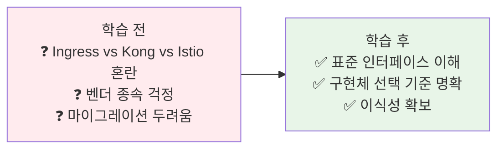
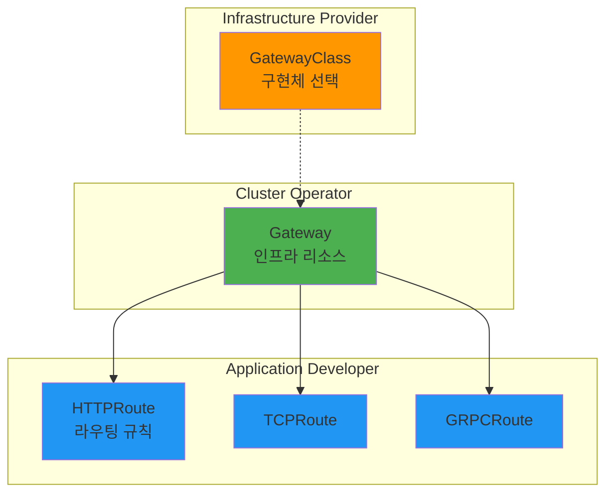
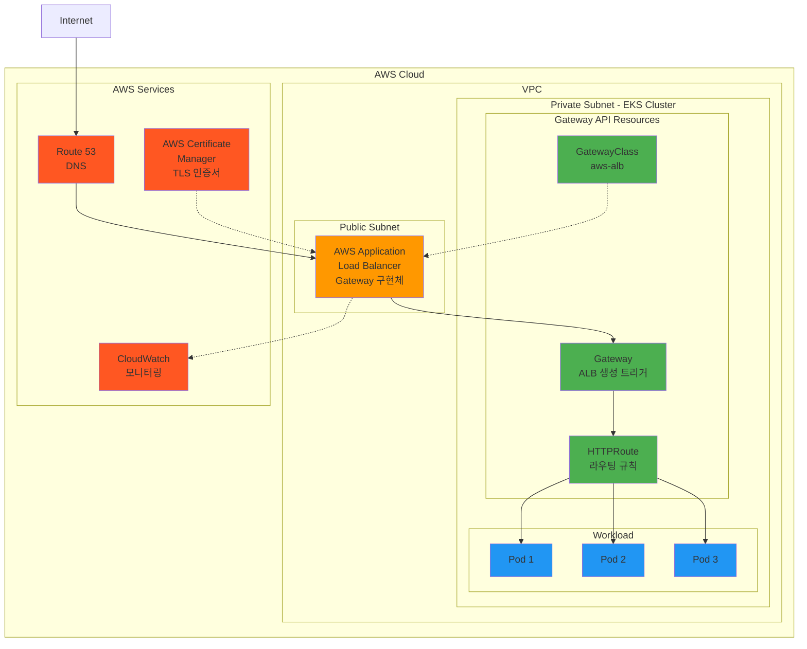
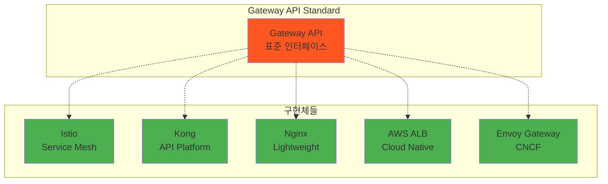
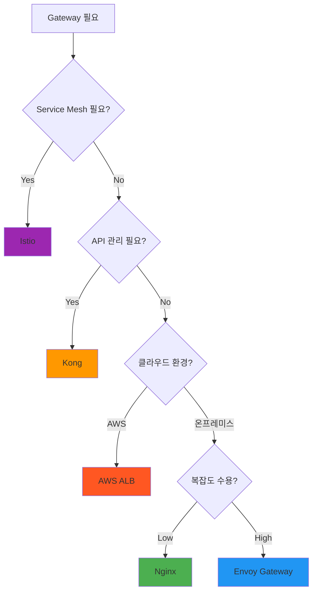

# Week 4 Day 2 Session 1: Gateway API vs 구현체들

<div align="center">

**🌐 표준 인터페이스** • **🔧 다양한 구현체** • **⚖️ 선택 기준**

*Kubernetes Gateway API - 표준의 힘*

</div>

---

## 🕘 세션 정보
**시간**: 09:00-09:50 (50분)  
**목표**: Gateway API와 구현체들의 관계 완전 이해  
**방식**: 이론 설명 + 비교 분석 + 페어 토론

## 🎯 세션 목표

### 📚 학습 목표
- **이해 목표**: Gateway API = 표준 인터페이스, 구현체 = 실제 구현
- **적용 목표**: 요구사항에 따른 적절한 구현체 선택 능력
- **협업 목표**: 팀과 함께 Gateway 전략 수립

### 🤔 왜 필요한가? (5분)

**현실 문제 상황**:
- 💼 **실무 시나리오**: "Ingress는 부족하고, Istio는 너무 복잡해요. 뭘 써야 하죠?"
- 🏠 **일상 비유**: USB-C 포트(표준) vs 다양한 충전기(구현체)
- ☁️ **AWS 아키텍처**: ALB, API Gateway, App Mesh - 각각 언제 쓰나?
- 📊 **시장 현실**: 2024년 Gateway API GA, 모든 주요 벤더 지원

**학습 전후 비교**:


---

## 📖 핵심 개념 (35분)

### 🔍 개념 1: 기술 진화의 역사 (10분)

**왜 Gateway API가 탄생했는가?**

**Phase 1: Nginx/HAProxy 시대 (2010~2015)**
```
문제:
- 설정 파일 기반 (nginx.conf)
- 수동 배포 및 리로드
- Kubernetes 통합 없음

예시:
upstream backend {
    server 10.0.1.1:8080;
    server 10.0.1.2:8080;
}
```

**Phase 2: Ingress 등장 (2015~2020)**
```yaml
# Kubernetes 네이티브, 하지만 제한적
apiVersion: networking.k8s.io/v1
kind: Ingress
metadata:
  annotations:
    nginx.ingress.kubernetes.io/rewrite-target: /  # 벤더 종속!
    cert-manager.io/cluster-issuer: letsencrypt
spec:
  rules:
  - host: api.example.com
    http:
      paths:
      - path: /v1
        pathType: Prefix
        backend:
          service:
            name: api-v1
            port:
              number: 80
```

**문제점**:
- 표현력 부족 (가중치 라우팅 불가)
- 어노테이션 난립 (벤더별 다름)
- 역할 분리 불가능
- 확장성 제한

**Phase 3: Kong/Istio 등장 (2018~2023)**
```
강점:
- 강력한 기능 (트래픽 분할, mTLS, 관측성)
- 풍부한 플러그인/확장

문제:
- 각자 다른 API (이식성 없음)
- 높은 학습 곡선
- 벤더 종속 위험
```

**Phase 4: Gateway API (2023~현재)**
```
해결:
✅ Kubernetes 표준 (SIG-Network)
✅ 강력한 표현력 (Ingress 한계 극복)
✅ 구현체 독립 (이식성 확보)
✅ 역할 기반 설계 (RBAC 통합)
```

### 🔍 개념 2: Gateway API 핵심 개념 (12분)

**3계층 리소스 모델**



**1. GatewayClass - 구현체 선택**
```yaml
apiVersion: gateway.networking.k8s.io/v1
kind: GatewayClass
metadata:
  name: istio
spec:
  controllerName: istio.io/gateway-controller
  description: Istio-based implementation
```

**역할**: Infrastructure Provider가 제공
- 어떤 구현체를 사용할지 정의
- 구현체별 설정 (파라미터)

**2. Gateway - 인프라 리소스**
```yaml
apiVersion: gateway.networking.k8s.io/v1
kind: Gateway
metadata:
  name: production-gateway
  namespace: infra
spec:
  gatewayClassName: istio
  listeners:
  - name: http
    port: 80
    protocol: HTTP
  - name: https
    port: 443
    protocol: HTTPS
    tls:
      mode: Terminate
      certificateRefs:
      - name: example-com-cert
```

**역할**: Cluster Operator가 관리
- 리스너 정의 (포트, 프로토콜)
- TLS 설정
- 인프라 수준 정책

**3. HTTPRoute - 애플리케이션 라우팅**
```yaml
apiVersion: gateway.networking.k8s.io/v1
kind: HTTPRoute
metadata:
  name: my-app-route
  namespace: my-app
spec:
  parentRefs:
  - name: production-gateway
    namespace: infra
  hostnames:
  - "api.example.com"
  rules:
  - matches:
    - path:
        type: PathPrefix
        value: /api/v1
    backendRefs:
    - name: api-v1-service
      port: 80
      weight: 90
    - name: api-v2-service
      port: 80
      weight: 10  # 카나리 배포!
```

**역할**: Application Developer가 작성
- 라우팅 규칙
- 트래픽 분할
- 헤더 조작

**핵심 장점**:
- **역할 분리**: 각자의 책임 명확
- **RBAC 통합**: Kubernetes 네이티브 권한 관리
- **네임스페이스 격리**: 팀별 독립적 관리

### 🔍 개념 3: 주요 구현체 비교 (13분)

**AWS 환경에서의 Gateway API 구현**



**AWS Load Balancer Controller 동작**:
```yaml
# GatewayClass - AWS ALB 선택
apiVersion: gateway.networking.k8s.io/v1
kind: GatewayClass
metadata:
  name: aws-alb
spec:
  controllerName: gateway.aws/alb-controller

---
# Gateway 생성 시 실제 AWS ALB 생성
apiVersion: gateway.networking.k8s.io/v1
kind: Gateway
metadata:
  name: production-gateway
  annotations:
    gateway.aws/certificate-arn: arn:aws:acm:...  # ACM 인증서
spec:
  gatewayClassName: aws-alb
  listeners:
  - name: https
    port: 443
    protocol: HTTPS

# 결과: AWS 콘솔에 실제 ALB 생성됨
# - Target Group 자동 생성
# - Security Group 자동 설정
# - Route 53 연동 가능
```

**AWS 통합 장점**:
- **자동 프로비저닝**: Gateway 생성 시 ALB 자동 생성
- **ACM 통합**: TLS 인증서 자동 관리
- **CloudWatch**: 메트릭 자동 수집
- **WAF 통합**: 웹 방화벽 적용 가능
- **관리형 서비스**: AWS가 ALB 운영 담당

**구현체 생태계**



**상세 비교표**

| 구현체 | 특징 | 장점 | 단점 | 적합한 경우 |
|--------|------|------|------|------------|
| **Istio** | Service Mesh 통합 | • mTLS 자동<br/>• 풍부한 관측성<br/>• 고급 트래픽 제어 | • 복잡도 높음<br/>• 리소스 많이 사용<br/>• 학습 곡선 가파름 | • 대규모 마이크로서비스<br/>• 보안 중요<br/>• Service Mesh 필요 |
| **Kong** | API 관리 플랫폼 | • 플러그인 풍부<br/>• API 관리 기능<br/>• 성능 우수 | • 고급 기능 유료<br/>• 설정 복잡 | • API 관리 필요<br/>• Rate Limiting<br/>• Analytics 필요 |
| **Nginx** | 경량 프록시 | • 단순하고 빠름<br/>• 리소스 적게 사용<br/>• 검증된 안정성 | • 기능 제한적<br/>• 고급 기능 부족 | • 간단한 라우팅<br/>• 리소스 제약<br/>• 빠른 시작 |
| **AWS ALB** | AWS 네이티브 | • AWS 통합 완벽<br/>• 관리형 서비스<br/>• Auto Scaling | • AWS 종속<br/>• 비용 발생<br/>• 온프레미스 불가 | • AWS 환경<br/>• 관리 부담 최소화<br/>• AWS 서비스 통합 |
| **Envoy Gateway** | CNCF 프로젝트 | • 표준 준수<br/>• 커뮤니티 활발<br/>• 확장성 좋음 | • 상대적으로 신생<br/>• 생태계 성장 중 | • 표준 중시<br/>• 커뮤니티 지원<br/>• 장기 투자 |

**실무 선택 가이드**



**구체적 시나리오**

**시나리오 1: 스타트업 초기**
```
요구사항:
- 간단한 L7 라우팅
- 빠른 구축
- 리소스 제약

선택: Nginx Gateway
이유: 단순, 빠름, 리소스 효율적
```

**시나리오 2: 성장하는 SaaS**
```
요구사항:
- API Rate Limiting
- Analytics 필요
- 다양한 인증 방식

선택: Kong Gateway
이유: API 관리 기능, 플러그인 생태계
```

**시나리오 3: 대규모 마이크로서비스**
```
요구사항:
- 수백 개 서비스
- mTLS 필수
- 분산 추적

선택: Istio Gateway
이유: Service Mesh 통합, 보안, 관측성
```

**시나리오 4: AWS 환경**
```
요구사항:
- AWS 서비스 통합
- 관리 부담 최소화
- Auto Scaling

선택: AWS Load Balancer Controller
이유: AWS 네이티브, 관리형
```

**🎉 Fun Facts**:
- **Gateway API GA**: 2023년 10월 Kubernetes 1.29
- **구현체 수**: 20개 이상의 공식 구현체
- **이식성**: 동일한 HTTPRoute가 모든 구현체에서 동작
- **표준 채택**: CNCF 프로젝트들의 표준으로 채택

---

## 💭 함께 생각해보기 (10분)

### 🤝 페어 토론 (7분)

**토론 주제 1**: "우리 프로젝트에 적합한 구현체는?"
```
상황: 
- Kubernetes 기반 마이크로서비스 10개
- 월간 활성 사용자 10만 명
- 팀 규모 5명 (DevOps 1명)

질문:
1. 어떤 구현체를 선택하시겠습니까?
2. 그 이유는 무엇인가요?
3. 트레이드오프는 무엇인가요?
```

**토론 주제 2**: "구현체 전환 시나리오"
```
상황:
- 현재 Nginx Ingress 사용 중
- Gateway API로 전환 고려
- 무중단 마이그레이션 필요

질문:
1. 어떤 구현체로 전환하시겠습니까?
2. 마이그레이션 전략은?
3. 위험 요소와 대응 방안은?
```

### 🎯 전체 공유 (3분)
- 각 페어의 선택과 이유 공유
- 다양한 관점 비교
- 실무 적용 가능성 토론

### 💡 이해도 체크 질문
- ✅ "Gateway API와 구현체의 관계를 설명할 수 있나요?"
- ✅ "각 구현체의 장단점을 비교할 수 있나요?"
- ✅ "프로젝트 요구사항에 맞는 구현체를 선택할 수 있나요?"

---

## 🔑 핵심 키워드

### 🔤 표준 및 인터페이스
- **Gateway API**: Kubernetes SIG-Network의 공식 표준
- **GatewayClass**: 구현체 선택 리소스
- **Gateway**: 인프라 수준 리소스
- **HTTPRoute**: 애플리케이션 라우팅 규칙

### 🔤 구현체
- **Istio**: Service Mesh 통합 구현체
- **Kong**: API 관리 플랫폼
- **Nginx**: 경량 프록시
- **AWS ALB**: AWS 네이티브 구현
- **Envoy Gateway**: CNCF 표준 구현

### 🔤 핵심 개념
- **역할 분리**: Infrastructure/Cluster/Application
- **이식성**: 구현체 독립적 Route
- **표준화**: 벤더 종속 탈피

---

## 📝 세션 마무리

### ✅ 오늘 세션 성과
- [ ] Gateway API = 표준 인터페이스 이해
- [ ] 주요 구현체 특징 및 차이점 파악
- [ ] 요구사항 기반 구현체 선택 기준 습득
- [ ] 실무 적용 시나리오 분석

### 🎯 다음 세션 준비
**Session 2 예고**: 서비스 디스커버리
- Client-side vs Server-side Discovery
- Kubernetes DNS의 동작 원리
- Health Check와 Circuit Breaker

### 🔗 참고 자료
- **[Gateway API 공식 문서](https://gateway-api.sigs.k8s.io/)**
- **[구현체 목록](https://gateway-api.sigs.k8s.io/implementations/)**
- **[Istio Gateway API](https://istio.io/latest/docs/tasks/traffic-management/ingress/gateway-api/)**
- **[Kong Gateway API](https://docs.konghq.com/kubernetes-ingress-controller/latest/guides/using-gateway-api/)**

---

<div align="center">

**🌐 표준의 힘** • **🔧 구현체 선택** • **⚖️ 트레이드오프** • **🚀 실무 적용**

*Gateway API - 이식성과 강력함을 동시에*

</div>
