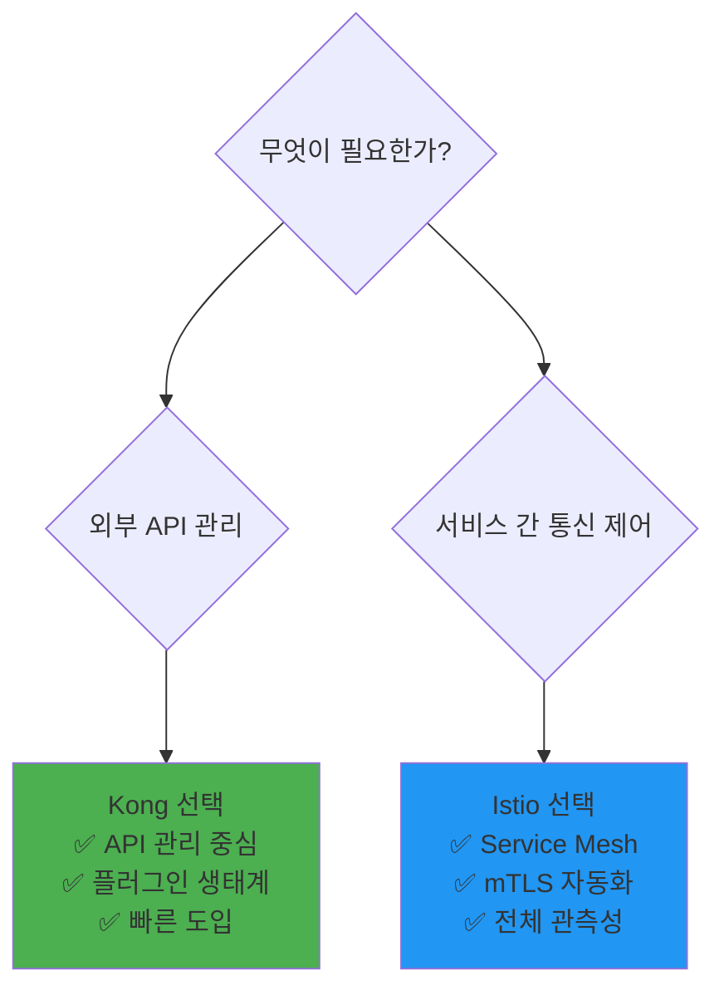
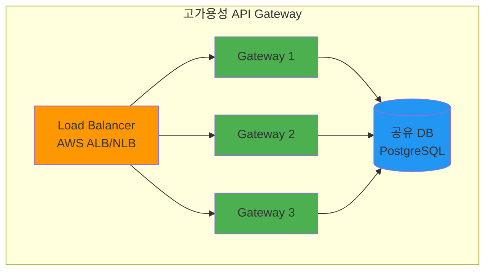
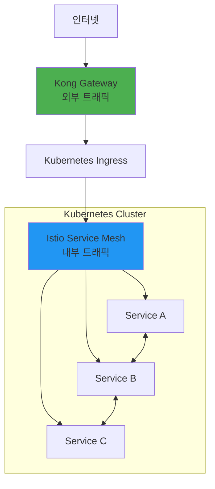

# Week 4 Day 2 Session 1: API Gateway 기본 개념

<div align="center">

**🌐 단일 진입점** • **🚪 Gateway 패턴** • **🔧 주요 구현체**

*마이크로서비스의 혼돈을 질서로 - API Gateway의 탄생*

</div>

---

## 🕘 세션 정보
**시간**: 09:00-09:50 (50분)  
**목표**: API Gateway가 왜 필요한지, 어떤 문제를 해결하는지 완전 이해  
**방식**: 문제 중심 학습 + 진화 스토리 + 페어 토론

## 🎯 세션 목표

### 📚 학습 목표
- **이해 목표**: 마이크로서비스 환경에서 API Gateway의 필요성
- **적용 목표**: Ingress의 한계와 전문 Gateway의 장점 파악
- **협업 목표**: 팀과 함께 Gateway 전략 수립

### 🤔 왜 필요한가? (5분)

**현실 문제 상황**:
- 💼 **실무 시나리오**: "클라이언트가 20개 마이크로서비스를 직접 호출해요. 인증은 어디서 하죠?"
- 🏠 **일상 비유**: 아파트 단지 - 각 집 직접 방문 vs 관리사무소 경유
- ☁️ **AWS 아키텍처**: ALB + API Gateway - 왜 두 개나 있을까?
- 📊 **시장 현실**: Netflix는 Zuul로 하루 수십억 요청 처리

**학습 전후 비교**:


---

## 📖 핵심 개념 (35분)

### 🔍 개념 1: 문제의 시작 - 마이크로서비스의 복잡성 (10분)

**Phase 1: 모놀리스 시대 (단순했던 시절)**


**장점**: 단순, 명확, 관리 쉬움  
**단점**: 확장 어려움, 배포 위험, 기술 스택 고정

---

**Phase 2: 마이크로서비스 초기 (혼돈의 시작)**


**문제점**:
1. **클라이언트 복잡도**: 5개 서비스 = 5개 엔드포인트 관리
2. **인증 중복**: 각 서비스마다 인증 로직 구현
3. **CORS 설정**: 모든 서비스에 CORS 설정 필요
4. **버전 관리**: API 버전 변경 시 클라이언트 수정
5. **보안 취약**: 내부 서비스가 외부에 직접 노출

**실제 코드 예시 (클라이언트 지옥)**:
```javascript
// 클라이언트가 모든 서비스 알아야 함
const userService = 'https://user.example.com';
const productService = 'https://product.example.com';
const orderService = 'https://order.example.com';

// 각 서비스마다 인증 토큰 전송
const user = await fetch(`${userService}/api/users/me`, {
  headers: { 'Authorization': `Bearer ${token}` }
});

const products = await fetch(`${productService}/api/products`, {
  headers: { 'Authorization': `Bearer ${token}` }
});

const orders = await fetch(`${orderService}/api/orders`, {
  headers: { 'Authorization': `Bearer ${token}` }
});
```

---

**Phase 3: Nginx/HAProxy 도입 (첫 번째 해결책)**


**개선점**:
- ✅ 단일 엔드포인트
- ✅ 기본 라우팅

**여전한 문제**:
- ❌ 설정 파일 관리 복잡
- ❌ 인증/인가 기능 부족
- ❌ 동적 라우팅 어려움

**Nginx 설정 예시**:
```nginx
# nginx.conf - 설정 파일 지옥
location /api/users {
    proxy_pass http://user-service:8080;
}

location /api/products {
    proxy_pass http://product-service:8080;
}

location /api/orders {
    proxy_pass http://order-service:8080;
}

# 서비스 추가마다 설정 파일 수정 필요
```

---

### 🔍 개념 2: Kubernetes Ingress - 표준의 등장 (12분)

**Phase 4: Kubernetes Ingress (Kubernetes 표준)**


**Ingress의 장점**:
- ✅ Kubernetes 네이티브
- ✅ YAML로 선언적 관리
- ✅ TLS 자동 관리

**Ingress 예시**:
```yaml
apiVersion: networking.k8s.io/v1
kind: Ingress
metadata:
  name: api-ingress
spec:
  rules:
  - host: api.example.com
    http:
      paths:
      - path: /api/users
        pathType: Prefix
        backend:
          service:
            name: user-service
            port:
              number: 80
      - path: /api/products
        pathType: Prefix
        backend:
          service:
            name: product-service
            port:
              number: 80
```

**Ingress의 한계**:
1. **표현력 부족**: 복잡한 라우팅 규칙 표현 어려움
2. **어노테이션 난립**: 고급 기능은 어노테이션으로 (비표준)
3. **인증/인가 제한**: 기본 기능 부족
4. **Rate Limiting 없음**: API 보호 기능 부족
5. **모니터링 약함**: 상세한 메트릭 수집 어려움

**어노테이션 지옥 예시**:
```yaml
apiVersion: networking.k8s.io/v1
kind: Ingress
metadata:
  name: api-ingress
  annotations:
    nginx.ingress.kubernetes.io/rewrite-target: /
    nginx.ingress.kubernetes.io/rate-limit: "100"
    nginx.ingress.kubernetes.io/auth-url: "http://auth-service/verify"
    nginx.ingress.kubernetes.io/cors-allow-origin: "*"
    # 어노테이션이 계속 늘어남...
```

---

### 🔍 개념 3: 전문 API Gateway - 완전한 해결책 (13분)

**Phase 5: Kong/Istio/AWS API Gateway (전문 Gateway)**


**API Gateway가 제공하는 기능**:

1. **인증/인가**
   - OAuth2, JWT, API Key
   - 중앙화된 인증 처리

2. **Rate Limiting**
   - API 호출 제한
   - DDoS 방어

3. **라우팅**
   - Path-based, Header-based
   - Canary, Blue-Green 배포

4. **변환**
   - Request/Response 변환
   - Protocol 변환 (REST ↔ gRPC)

5. **모니터링**
   - 상세한 메트릭
   - 분산 추적

6. **보안**
   - TLS Termination
   - IP Whitelist/Blacklist

**주요 구현체 비교**:

| 구현체 | 타입 | 특징 | 장점 | 단점 | 사용 시기 |
|--------|------|------|------|------|----------|
| **Kong** | API Gateway | 플러그인 기반 | 풍부한 기능, 쉬운 확장 | 상용 기능 유료 | API 관리 중심 |
| **Istio** | Service Mesh | 전체 트래픽 관리 | mTLS, 고급 라우팅 | 복잡도 높음 | 대규모 MSA |
| **AWS API Gateway** | Managed Service | AWS 네이티브 | 관리 불필요, AWS 통합 | AWS 종속 | AWS 환경 |
| **Nginx Ingress** | Ingress Controller | 경량 프록시 | 단순, 빠름 | 기능 제한적 | 간단한 라우팅 |
| **Traefik** | Ingress Controller | 자동 설정 | 동적 설정, 쉬움 | 대규모 제한 | 중소규모 |

**Kong 예시**:
```yaml
apiVersion: configuration.konghq.com/v1
kind: KongPlugin
metadata:
  name: rate-limiting
config:
  minute: 100
  policy: local
---
apiVersion: networking.k8s.io/v1
kind: Ingress
metadata:
  name: api-ingress
  annotations:
    konghq.com/plugins: rate-limiting
spec:
  ingressClassName: kong
  rules:
  - host: api.example.com
    http:
      paths:
      - path: /api
        pathType: Prefix
        backend:
          service:
            name: backend-service
            port:
              number: 80
```

**Istio 예시**:
```yaml
apiVersion: networking.istio.io/v1beta1
kind: Gateway
metadata:
  name: api-gateway
spec:
  selector:
    istio: ingressgateway
  servers:
  - port:
      number: 80
      name: http
      protocol: HTTP
    hosts:
    - "api.example.com"
---
apiVersion: networking.istio.io/v1beta1
kind: VirtualService
metadata:
  name: api-routes
spec:
  hosts:
  - "api.example.com"
  gateways:
  - api-gateway
  http:
  - match:
    - uri:
        prefix: /api/users
    route:
    - destination:
        host: user-service
        port:
          number: 80
```

---

## 💭 함께 생각해보기 (10분)

### 🤝 페어 토론 (5분)

**토론 주제**:
1. **선택 기준**: "우리 프로젝트에는 Kong과 Istio 중 무엇이 적합할까?"
2. **마이그레이션**: "Ingress에서 Kong으로 전환 시 고려사항은?"
3. **비용**: "AWS API Gateway vs 자체 호스팅 Kong - 어떤 게 저렴할까?"

**페어 활동 가이드**:
- 👥 **자유 페어링**: 관심사가 비슷한 사람끼리
- 🔄 **역할 교대**: 각자 의견 제시 후 토론
- 📝 **핵심 정리**: 결론 메모

### 🎯 전체 공유 (5분)

**공유 내용**:
- 각 팀의 선택과 이유
- 고려했던 트레이드오프
- 다음 세션 기대사항

---

## ❓ 자주 묻는 질문 (FAQ)

### Q1: "Ingress만으로는 왜 부족한가요?"

**A**: Ingress는 기본적인 L7 라우팅만 제공합니다.

**Ingress의 한계**:
```yaml
# Ingress로 할 수 없는 것들
❌ Rate Limiting (API 호출 제한)
❌ Authentication (인증/인가)
❌ Request/Response 변환
❌ Circuit Breaker (장애 격리)
❌ 고급 트래픽 분할 (카나리 배포)
❌ 서비스 간 통신 제어 (East-West)
```

**실무 예시**:
```
상황: API 서비스에 DDoS 공격
Ingress: 모든 요청 그대로 전달 → 서버 다운
Gateway: Rate Limiting으로 차단 → 서비스 보호
```

### Q2: "Kong과 Istio 중 뭘 선택해야 하나요?"

**A**: 사용 목적에 따라 다릅니다.

**선택 가이드**:


**실무 조합**:
```
많은 기업이 둘 다 사용:
- Kong: 외부 트래픽 (North-South)
- Istio: 내부 트래픽 (East-West)
```

### Q3: "API Gateway가 SPOF(단일 장애점)가 되지 않나요?"

**A**: 맞습니다. 하지만 고가용성 구성으로 해결합니다.

**고가용성 구성**:


**실무 전략**:
```yaml
1. 다중 인스턴스 배포 (최소 3개)
2. Health Check 설정
3. Auto Scaling 구성
4. 다중 AZ 배포 (AWS)
5. 모니터링 및 알람
```

### Q4: "Gateway 추가하면 성능이 떨어지지 않나요?"

**A**: 약간의 지연은 있지만, 얻는 이점이 훨씬 큽니다.

**성능 영향**:
```
직접 연결: 10ms
Gateway 경유: 11-12ms (1-2ms 추가)

추가 지연 < 1-2ms
얻는 이점:
✅ 보안 강화
✅ 모니터링
✅ Rate Limiting
✅ 장애 격리
✅ 트래픽 제어
```

**성능 최적화 방법**:
```yaml
1. Gateway 캐싱 활용
2. Connection Pooling
3. 적절한 리소스 할당
4. 불필요한 플러그인 제거
5. 비동기 처리 활용
```

### Q5: "Nginx Ingress Controller도 플러그인 있지 않나요?"

**A**: 있지만, 전문 Gateway에 비해 제한적입니다.

**비교**:
```yaml
Nginx Ingress Controller:
  장점:
    - Kubernetes 네이티브
    - 빠른 성능
    - 간단한 설정
  단점:
    - 플러그인 생태계 작음
    - API 관리 기능 부족
    - 확장성 제한

Kong/Istio:
  장점:
    - 풍부한 플러그인
    - 전문 API 관리
    - 엔터프라이즈 기능
  단점:
    - 복잡한 설정
    - 학습 곡선
    - 리소스 사용 많음
```

**실무 선택**:
```
소규모/간단한 서비스: Nginx Ingress
대규모/복잡한 서비스: Kong/Istio
```

### Q6: "Service Mesh는 꼭 필요한가요?"

**A**: 마이크로서비스가 많아지면 필수입니다.

**Service Mesh 필요 시점**:
```
마이크로서비스 개수:
- 5개 이하: 불필요 (오버엔지니어링)
- 10-20개: 고려 시작
- 20개 이상: 강력 권장
- 50개 이상: 필수

추가 고려사항:
✅ 서비스 간 통신 복잡도
✅ 보안 요구사항 (mTLS)
✅ 관측성 필요성
✅ 팀 규모 및 역량
```

**도입 전 체크리스트**:
```yaml
준비 사항:
- [ ] Kubernetes 운영 경험 충분
- [ ] 마이크로서비스 아키텍처 안정
- [ ] 모니터링 시스템 구축
- [ ] 팀 학습 시간 확보
- [ ] 점진적 도입 계획 수립
```

### Q7: "Kong과 Istio를 함께 쓸 수 있나요?"

**A**: 네, 많은 기업이 함께 사용합니다.

**조합 패턴**:


**역할 분담**:
```yaml
Kong (North-South):
  - 외부 API 관리
  - Rate Limiting
  - API Key 인증
  - 외부 트래픽 모니터링

Istio (East-West):
  - 서비스 간 통신
  - mTLS 자동화
  - 트래픽 분할
  - 내부 관측성
```

### Q8: "Gateway API는 뭔가요? Ingress와 다른가요?"

**A**: Kubernetes의 차세대 Ingress 표준입니다.

**진화 과정**:
```
Ingress (2015)
  ↓ (기능 부족)
Ingress + Annotations (2018)
  ↓ (표준화 필요)
Gateway API (2023) ← 현재
```

**Gateway API 장점**:
```yaml
Ingress 문제점:
  - Annotation 남용
  - 벤더별 비표준
  - 표현력 부족

Gateway API 해결:
  ✅ 표준화된 API
  ✅ 역할 기반 분리
  ✅ 풍부한 표현력
  ✅ 확장 가능한 구조
```

**언제 사용?**:
```
현재 (2024-2025):
- 새 프로젝트: Gateway API 권장
- 기존 프로젝트: Ingress 유지 가능
- 점진적 마이그레이션 가능

미래 (2026+):
- Gateway API가 표준
- Ingress는 레거시
```

### Q9: "실무에서 가장 많이 쓰는 Gateway는?"

**A**: 상황에 따라 다르지만, 통계를 보면:

**시장 점유율 (2024)**:
```
API Gateway:
1. Kong: 35%
2. AWS API Gateway: 25%
3. Nginx: 20%
4. Traefik: 10%
5. 기타: 10%

Service Mesh:
1. Istio: 60%
2. Linkerd: 20%
3. Consul: 15%
4. 기타: 5%
```

**기업 규모별 선호도**:
```yaml
스타트업:
  - Traefik (간단)
  - Nginx Ingress

중견기업:
  - Kong (기능 풍부)
  - AWS API Gateway (관리형)

대기업:
  - Kong + Istio (조합)
  - 자체 개발 Gateway
```

### Q10: "Gateway 없이 Service만으로는 안 되나요?"

**A**: 기술적으로는 가능하지만, 실무에서는 비추천입니다.

**Service만 사용 시 문제점**:
```yaml
문제 1: 보안
  - 모든 서비스가 외부 노출
  - 인증/인가 각 서비스에서 중복 구현
  - 보안 정책 일관성 없음

문제 2: 관리
  - 각 서비스마다 설정 필요
  - 모니터링 분산
  - 로그 수집 어려움

문제 3: 확장성
  - 서비스 추가 시마다 설정 변경
  - 트래픽 제어 어려움
  - 버전 관리 복잡
```

**Gateway 사용 시 해결**:
```yaml
✅ 단일 진입점으로 보안 강화
✅ 중앙화된 정책 관리
✅ 통합 모니터링 및 로깅
✅ 유연한 트래픽 제어
✅ 쉬운 서비스 추가/제거
```

---

## 🔑 핵심 키워드

### 🔤 기본 용어
- **API Gateway**: 마이크로서비스의 단일 진입점
- **Reverse Proxy**: 클라이언트 요청을 백엔드로 전달
- **Ingress**: Kubernetes의 L7 로드밸런서
- **Service Mesh**: 서비스 간 통신 관리 인프라

### 🔤 기술 용어
- **Rate Limiting**: API 호출 횟수 제한
- **Circuit Breaker**: 장애 전파 방지 패턴
- **TLS Termination**: Gateway에서 SSL/TLS 처리
- **Path-based Routing**: URL 경로 기반 라우팅

---

## 📝 세션 마무리

### ✅ 오늘 세션 성과
- [ ] API Gateway의 필요성 이해
- [ ] Ingress의 한계점 파악
- [ ] 주요 구현체 특징 비교
- [ ] 선택 기준 수립

### 🎯 다음 세션 준비
- **Session 2**: Kong vs Istio 실전 비교
- **예습**: Kong과 Istio 공식 문서 훑어보기
- **질문 준비**: 궁금한 점 정리

---

<div align="center">

**🌐 단일 진입점** • **🔧 전문 Gateway** • **🚀 실무 적용**

*다음 세션에서는 Kong과 Istio를 실전에서 어떻게 사용하는지 배웁니다*

</div>
