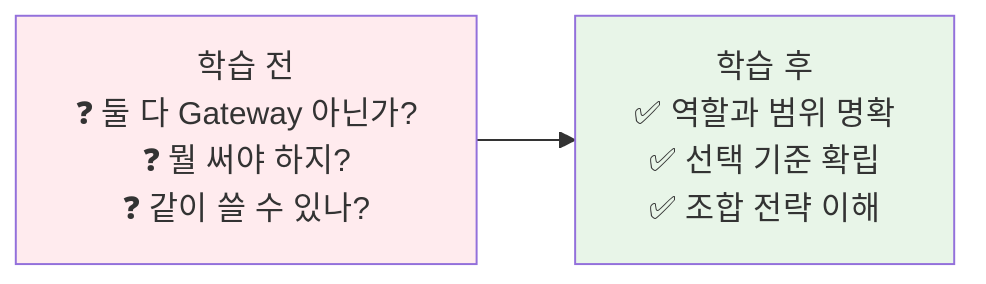
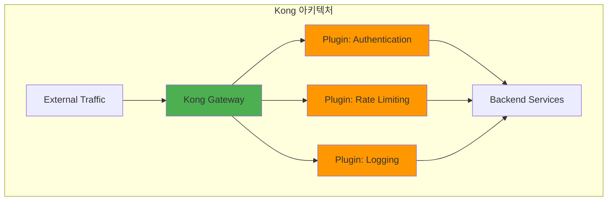
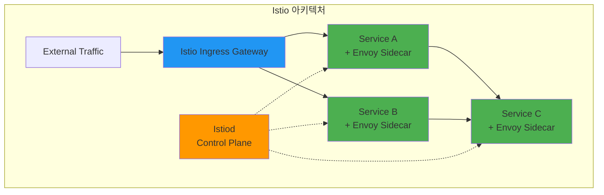
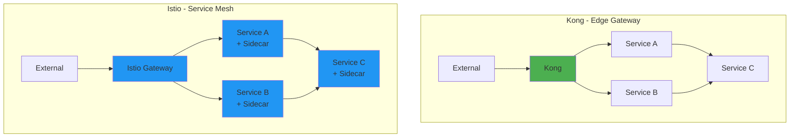
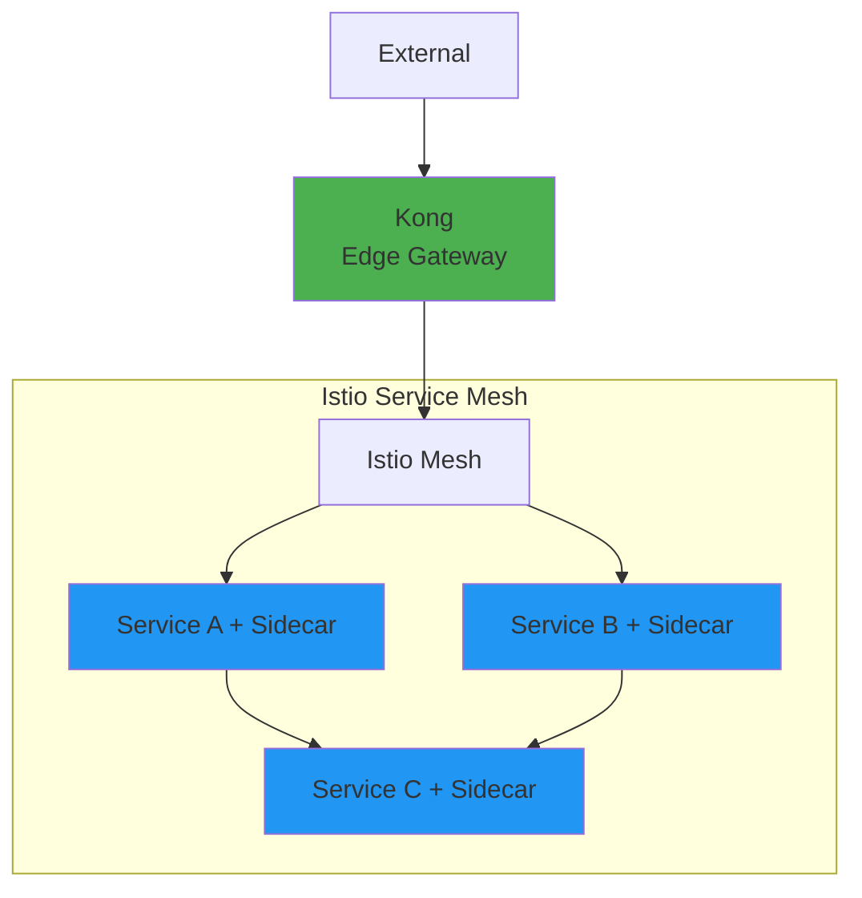

# Week 4 Day 2 Session 2: Kong vs Istio 실전 비교

<div align="center">

**🦍 Kong Gateway** • **⛵ Istio Service Mesh** • **🔍 서비스 디스커버리**

*API 관리 vs 서비스 메시 - 무엇을 선택할 것인가?*

</div>

---

## 🕘 세션 정보
**시간**: 10:00-10:50 (50분)  
**목표**: Kong과 Istio의 차이점 이해 및 선택 기준 수립  
**방식**: 실전 비교 + 아키텍처 분석 + 페어 토론

## 🎯 세션 목표

### 📚 학습 목표
- **이해 목표**: API Gateway vs Service Mesh의 본질적 차이
- **적용 목표**: 프로젝트 요구사항에 맞는 도구 선택
- **협업 목표**: 팀과 함께 아키텍처 결정

### 🤔 왜 필요한가? (5분)

**현실 문제 상황**:
- 💼 **실무 시나리오**: "Kong 쓰다가 Istio로 바꾸래요. 뭐가 다른데요?"
- 🏠 **일상 비유**: 아파트 경비실(Kong) vs CCTV 전체 시스템(Istio)
- ☁️ **AWS 아키텍처**: ALB(Kong 유사) vs App Mesh(Istio 유사)
- 📊 **시장 현실**: Uber는 Envoy, Netflix는 Zuul → 각자 다른 선택

**학습 전후 비교**:


---

## 📖 핵심 개념 (35분)

### 🔍 개념 1: Kong - API 관리 플랫폼 (12분)

**Kong의 정체성: "API Gateway + 관리 기능"**



**Kong의 핵심 특징**:

1. **플러그인 아키텍처**
   - 50+ 공식 플러그인
   - 커스텀 플러그인 개발 가능
   - 요청/응답 변환

2. **관리 기능**
   - Admin API로 동적 설정
   - Kong Manager (GUI)
   - 개발자 포털

3. **배포 위치**
   - **Edge Gateway**: 클러스터 외부 (주로 사용)
   - 클라이언트 → Kong → 서비스

**Kong 플러그인 예시**:
```yaml
# JWT 인증 플러그인
apiVersion: configuration.konghq.com/v1
kind: KongPlugin
metadata:
  name: jwt-auth
plugin: jwt
---
# Rate Limiting 플러그인
apiVersion: configuration.konghq.com/v1
kind: KongPlugin
metadata:
  name: rate-limit
plugin: rate-limiting
config:
  minute: 100
  hour: 1000
---
# Ingress에 플러그인 적용
apiVersion: networking.k8s.io/v1
kind: Ingress
metadata:
  name: api-ingress
  annotations:
    konghq.com/plugins: jwt-auth, rate-limit
```

**Kong의 서비스 디스커버리**:
- Kubernetes Service 자동 발견
- DNS 기반 라우팅
- Upstream 헬스체크

---

### 🔍 개념 2: Istio - Service Mesh 플랫폼 (12분)

**Istio의 정체성: "모든 서비스 간 통신 관리"**



**Istio의 핵심 특징**:

1. **Sidecar 패턴**
   - 모든 Pod에 Envoy Proxy 주입
   - 서비스 코드 변경 없이 기능 추가
   - 투명한 트래픽 가로채기

2. **전체 트래픽 관리**
   - **North-South**: 외부 → 내부 (Ingress Gateway)
   - **East-West**: 서비스 간 통신 (Sidecar)

3. **고급 기능**
   - mTLS 자동 적용
   - 분산 추적 (Jaeger)
   - 트래픽 분할 (Canary)
   - Fault Injection (장애 테스트)

**Istio 예시**:
```yaml
# Gateway (외부 진입점)
apiVersion: networking.istio.io/v1beta1
kind: Gateway
metadata:
  name: api-gateway
spec:
  selector:
    istio: ingressgateway
  servers:
  - port:
      number: 80
      name: http
      protocol: HTTP
    hosts:
    - "api.example.com"
---
# VirtualService (라우팅 규칙)
apiVersion: networking.istio.io/v1beta1
kind: VirtualService
metadata:
  name: user-service
spec:
  hosts:
  - "api.example.com"
  gateways:
  - api-gateway
  http:
  - match:
    - uri:
        prefix: /api/users
    route:
    - destination:
        host: user-service
        port:
          number: 80
      weight: 90  # 90% 트래픽
    - destination:
        host: user-service-v2
        port:
          number: 80
      weight: 10  # 10% 트래픽 (Canary)
```

**Istio의 서비스 디스커버리**:
- Kubernetes Service 자동 통합
- Envoy가 모든 서비스 엔드포인트 추적
- 동적 로드밸런싱

---

### 🔍 개념 3: Kong vs Istio 선택 가이드 (11분)

**핵심 차이점**:



**비교표**:

| 항목 | Kong | Istio |
|------|------|-------|
| **주요 역할** | API 관리 | 서비스 간 통신 관리 |
| **배포 위치** | Edge (외부 경계) | Mesh (전체 서비스) |
| **트래픽 범위** | North-South (외부↔내부) | North-South + East-West (서비스간) |
| **설치 복잡도** | 낮음 | 높음 |
| **리소스 사용** | 낮음 | 높음 (모든 Pod에 Sidecar) |
| **학습 곡선** | 낮음 | 높음 |
| **인증/인가** | 플러그인 | 기본 제공 |
| **mTLS** | 플러그인 | 자동 적용 |
| **분산 추적** | 플러그인 | 기본 제공 |
| **비용** | 무료 (OSS) / 유료 (Enterprise) | 무료 (OSS) |

**선택 기준**:

**Kong을 선택하는 경우**:
- ✅ API 관리가 주 목적
- ✅ 외부 트래픽만 관리
- ✅ 빠른 도입 필요
- ✅ 리소스 제약
- ✅ 간단한 아키텍처

**Istio를 선택하는 경우**:
- ✅ 서비스 간 통신 관리 필요
- ✅ mTLS 필수
- ✅ 고급 트래픽 제어 (Canary, A/B)
- ✅ 분산 추적 필요
- ✅ 대규모 마이크로서비스 (20개+)

**함께 사용하는 경우**:


**조합 전략**:
- Kong: 외부 API 관리, 인증, Rate Limiting
- Istio: 내부 서비스 간 mTLS, 트래픽 분할, 모니터링

**실제 기업 사례**:

| 기업 | 선택 | 이유 |
|------|------|------|
| **Uber** | Envoy (Istio 기반) | 수천 개 서비스, mTLS 필수 |
| **Netflix** | Zuul (자체 개발) | 특수 요구사항, 레거시 통합 |
| **Airbnb** | Istio | 서비스 간 보안, 관측성 |
| **Spotify** | Envoy | 고성능, 동적 설정 |

---

## 💭 함께 생각해보기 (10분)

### 🤝 페어 토론 (5분)

**토론 주제**:
1. **프로젝트 적용**: "우리 E-Commerce 프로젝트에는 Kong과 Istio 중 무엇이 적합할까?"
2. **마이그레이션**: "Kong에서 Istio로 전환하려면 무엇을 준비해야 할까?"
3. **비용 vs 기능**: "Istio의 복잡도를 감수할 만한 가치가 있을까?"

**페어 활동 가이드**:
- 👥 **시나리오 기반**: 구체적인 요구사항 가정
- 🔄 **장단점 비교**: 각 도구의 트레이드오프 분석
- 📝 **결정 기록**: 선택과 이유 문서화

### 🎯 전체 공유 (5분)

**공유 내용**:
- 각 팀의 선택과 근거
- 고려했던 제약사항
- 실무 적용 시 주의사항

---

## 🔑 핵심 키워드

### 🔤 기본 용어
- **Edge Gateway**: 클러스터 외부 경계의 Gateway
- **Service Mesh**: 서비스 간 통신 관리 인프라 계층
- **Sidecar Proxy**: 각 Pod에 주입되는 프록시 컨테이너
- **Control Plane**: 설정 관리 및 정책 배포

### 🔤 기술 용어
- **Envoy Proxy**: Istio의 데이터 플레인 (실제 트래픽 처리)
- **Istiod**: Istio의 컨트롤 플레인 (설정 관리)
- **mTLS**: 서비스 간 상호 TLS 인증
- **Traffic Splitting**: 트래픽 비율 분할 (Canary 배포)

---

## 📝 세션 마무리

### ✅ 오늘 세션 성과
- [ ] Kong과 Istio의 차이점 명확히 이해
- [ ] 각 도구의 적합한 사용 시나리오 파악
- [ ] 서비스 디스커버리 메커니즘 이해
- [ ] 선택 기준 수립

### 🎯 다음 세션 준비
- **Session 3**: 고급 트래픽 관리 (로드밸런싱, 라우팅 패턴)
- **예습**: Canary 배포, Blue-Green 배포 개념
- **질문 준비**: 실습에서 시도해볼 시나리오

---

<div align="center">

**🦍 Kong** • **⛵ Istio** • **🎯 올바른 선택**

*다음 세션에서는 고급 트래픽 관리 기법을 배웁니다*

</div>
