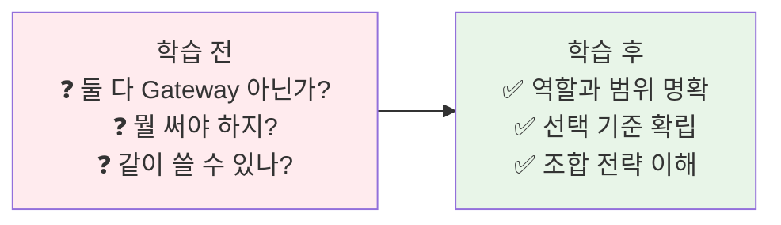
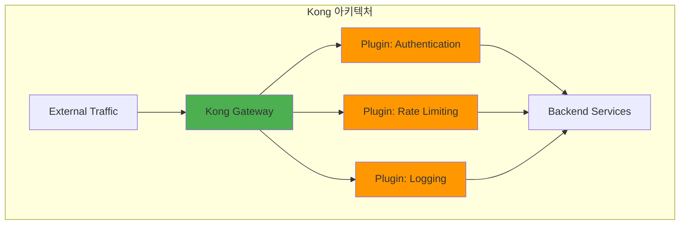
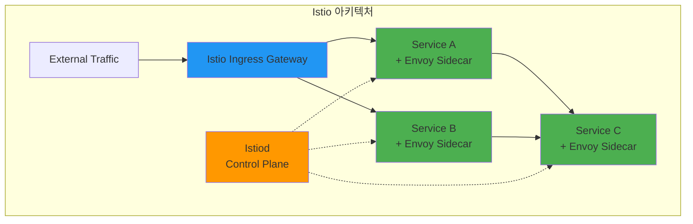
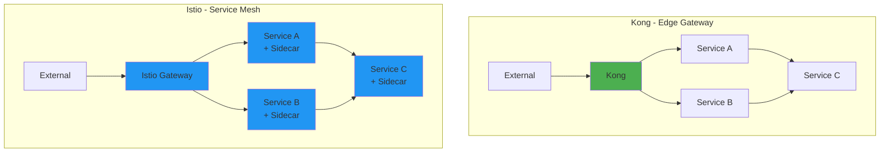
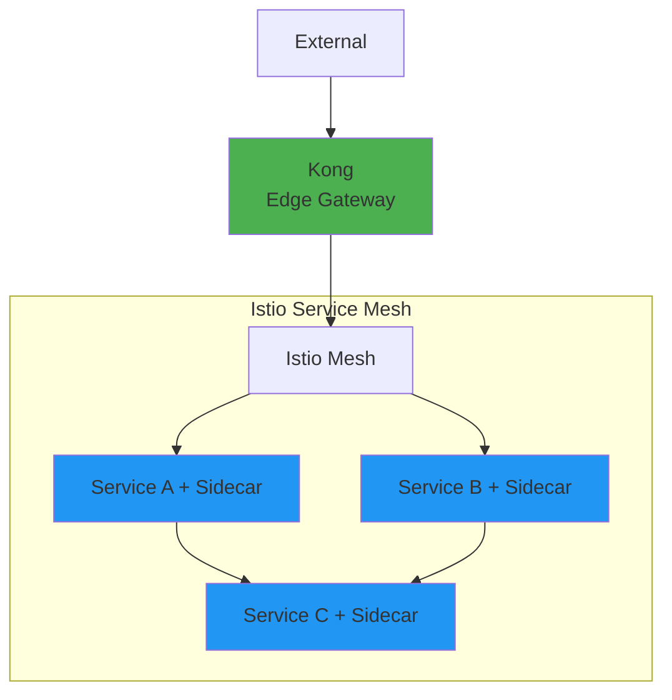
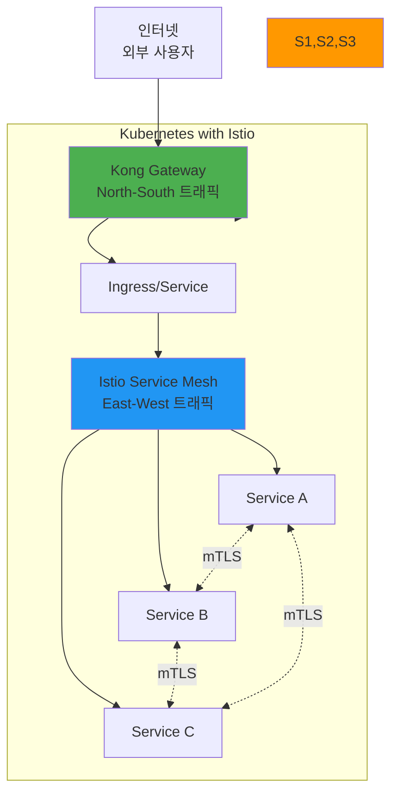
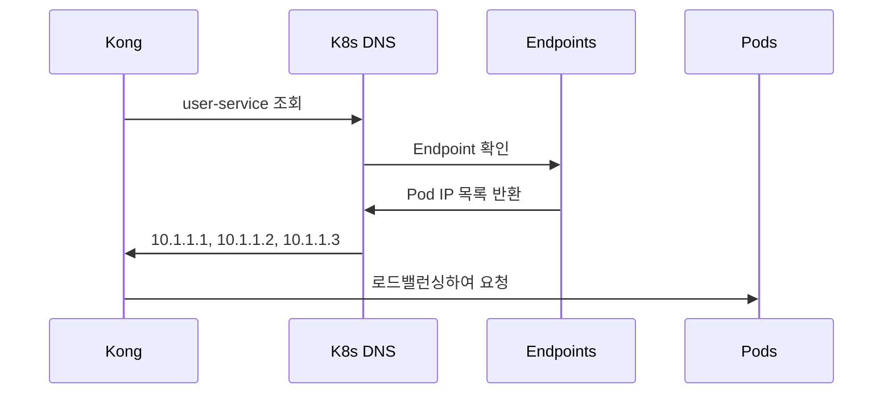
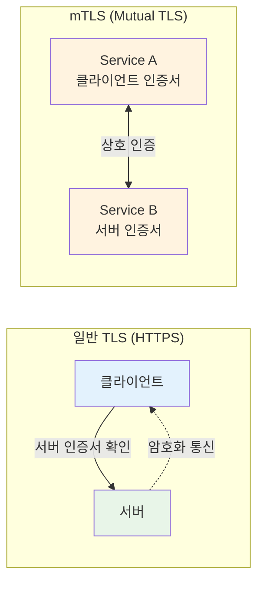

# Week 4 Day 2 Session 2: Kong vs Istio 실전 비교

<div align="center">

**🦍 Kong Gateway** • **⛵ Istio Service Mesh** • **🔍 서비스 디스커버리**

*API 관리 vs 서비스 메시 - 무엇을 선택할 것인가?*

</div>

---

## 🕘 세션 정보
**시간**: 10:00-10:50 (50분)  
**목표**: Kong과 Istio의 차이점 이해 및 선택 기준 수립  
**방식**: 실전 비교 + 아키텍처 분석 + 페어 토론

## 🎯 세션 목표

### 📚 학습 목표
- **이해 목표**: API Gateway vs Service Mesh의 본질적 차이
- **적용 목표**: 프로젝트 요구사항에 맞는 도구 선택
- **협업 목표**: 팀과 함께 아키텍처 결정

### 🤔 왜 필요한가? (5분)

**현실 문제 상황**:
- 💼 **실무 시나리오**: "Kong 쓰다가 Istio로 바꾸래요. 뭐가 다른데요?"
- 🏠 **일상 비유**: 아파트 경비실(Kong) vs CCTV 전체 시스템(Istio)
- ☁️ **AWS 아키텍처**: ALB(Kong 유사) vs App Mesh(Istio 유사)
- 📊 **시장 현실**: Uber는 Envoy, Netflix는 Zuul → 각자 다른 선택

**학습 전후 비교**:


---

## 📖 핵심 개념 (35분)

### 🔍 개념 1: Kong - API 관리 플랫폼 (12분)

**Kong의 정체성: "API Gateway + 관리 기능"**



**Kong의 핵심 특징**:

1. **플러그인 아키텍처**
   - 50+ 공식 플러그인
   - 커스텀 플러그인 개발 가능
   - 요청/응답 변환

2. **관리 기능**
   - Admin API로 동적 설정
   - Kong Manager (GUI)
   - 개발자 포털

3. **배포 위치**
   - **Edge Gateway**: 클러스터 외부 (주로 사용)
   - 클라이언트 → Kong → 서비스

**Kong 플러그인 예시**:
```yaml
# JWT 인증 플러그인
apiVersion: configuration.konghq.com/v1
kind: KongPlugin
metadata:
  name: jwt-auth
plugin: jwt
---
# Rate Limiting 플러그인
apiVersion: configuration.konghq.com/v1
kind: KongPlugin
metadata:
  name: rate-limit
plugin: rate-limiting
config:
  minute: 100
  hour: 1000
---
# Ingress에 플러그인 적용
apiVersion: networking.k8s.io/v1
kind: Ingress
metadata:
  name: api-ingress
  annotations:
    konghq.com/plugins: jwt-auth, rate-limit
```

**Kong의 서비스 디스커버리**:
- Kubernetes Service 자동 발견
- DNS 기반 라우팅
- Upstream 헬스체크

---

### 🔍 개념 2: Istio - Service Mesh 플랫폼 (12분)

**Istio의 정체성: "모든 서비스 간 통신 관리"**



**Istio의 핵심 특징**:

1. **Sidecar 패턴**
   - 모든 Pod에 Envoy Proxy 주입
   - 서비스 코드 변경 없이 기능 추가
   - 투명한 트래픽 가로채기

2. **전체 트래픽 관리**
   - **North-South**: 외부 → 내부 (Ingress Gateway)
   - **East-West**: 서비스 간 통신 (Sidecar)

3. **고급 기능**
   - mTLS 자동 적용
   - 분산 추적 (Jaeger)
   - 트래픽 분할 (Canary)
   - Fault Injection (장애 테스트)

**Istio 예시**:
```yaml
# Gateway (외부 진입점)
apiVersion: networking.istio.io/v1beta1
kind: Gateway
metadata:
  name: api-gateway
spec:
  selector:
    istio: ingressgateway
  servers:
  - port:
      number: 80
      name: http
      protocol: HTTP
    hosts:
    - "api.example.com"
---
# VirtualService (라우팅 규칙)
apiVersion: networking.istio.io/v1beta1
kind: VirtualService
metadata:
  name: user-service
spec:
  hosts:
  - "api.example.com"
  gateways:
  - api-gateway
  http:
  - match:
    - uri:
        prefix: /api/users
    route:
    - destination:
        host: user-service
        port:
          number: 80
      weight: 90  # 90% 트래픽
    - destination:
        host: user-service-v2
        port:
          number: 80
      weight: 10  # 10% 트래픽 (Canary)
```

**Istio의 서비스 디스커버리**:
- Kubernetes Service 자동 통합
- Envoy가 모든 서비스 엔드포인트 추적
- 동적 로드밸런싱

---

### 🔍 개념 3: Kong vs Istio 선택 가이드 (11분)

**핵심 차이점**:



**비교표**:

| 항목 | Kong | Istio |
|------|------|-------|
| **주요 역할** | API 관리 | 서비스 간 통신 관리 |
| **배포 위치** | Edge (외부 경계) | Mesh (전체 서비스) |
| **트래픽 범위** | North-South (외부↔내부) | North-South + East-West (서비스간) |
| **설치 복잡도** | 낮음 | 높음 |
| **리소스 사용** | 낮음 | 높음 (모든 Pod에 Sidecar) |
| **학습 곡선** | 낮음 | 높음 |
| **인증/인가** | 플러그인 | 기본 제공 |
| **mTLS** | 플러그인 | 자동 적용 |
| **분산 추적** | 플러그인 | 기본 제공 |
| **비용** | 무료 (OSS) / 유료 (Enterprise) | 무료 (OSS) |

**선택 기준**:

**Kong을 선택하는 경우**:
- ✅ API 관리가 주 목적
- ✅ 외부 트래픽만 관리
- ✅ 빠른 도입 필요
- ✅ 리소스 제약
- ✅ 간단한 아키텍처

**Istio를 선택하는 경우**:
- ✅ 서비스 간 통신 관리 필요
- ✅ mTLS 필수
- ✅ 고급 트래픽 제어 (Canary, A/B)
- ✅ 분산 추적 필요
- ✅ 대규모 마이크로서비스 (20개+)

**함께 사용하는 경우**:


**조합 전략**:
- Kong: 외부 API 관리, 인증, Rate Limiting
- Istio: 내부 서비스 간 mTLS, 트래픽 분할, 모니터링

**실제 기업 사례**:

| 기업 | 선택 | 이유 |
|------|------|------|
| **Uber** | Envoy (Istio 기반) | 수천 개 서비스, mTLS 필수 |
| **Netflix** | Zuul (자체 개발) | 특수 요구사항, 레거시 통합 |
| **Airbnb** | Istio | 서비스 간 보안, 관측성 |
| **Spotify** | Envoy | 고성능, 동적 설정 |

---

## 💭 함께 생각해보기 (10분)

### 🤝 페어 토론 (5분)

**토론 주제**:
1. **프로젝트 적용**: "우리 E-Commerce 프로젝트에는 Kong과 Istio 중 무엇이 적합할까?"
2. **마이그레이션**: "Kong에서 Istio로 전환하려면 무엇을 준비해야 할까?"
3. **비용 vs 기능**: "Istio의 복잡도를 감수할 만한 가치가 있을까?"

**페어 활동 가이드**:
- 👥 **시나리오 기반**: 구체적인 요구사항 가정
- 🔄 **장단점 비교**: 각 도구의 트레이드오프 분석
- 📝 **결정 기록**: 선택과 이유 문서화

### 🎯 전체 공유 (5분)

**공유 내용**:
- 각 팀의 선택과 근거
- 고려했던 제약사항
- 실무 적용 시 주의사항

---

## ❓ 자주 묻는 질문 (FAQ)

### Q1: "Kong과 Istio를 함께 사용할 수 있나요?"

**A**: 네, 실제로 많은 기업이 함께 사용합니다.

**조합 아키텍처**:


**역할 분담**:
```yaml
Kong (외부 경계):
  책임:
    - 외부 API 관리
    - API Key/OAuth 인증
    - Rate Limiting
    - 외부 트래픽 모니터링
  
  처리 트래픽:
    - 모바일 앱 → API
    - 웹 브라우저 → API
    - 파트너 시스템 → API

Istio (내부 메시):
  책임:
    - 서비스 간 통신 제어
    - mTLS 자동화
    - 카나리 배포
    - 내부 관측성
  
  처리 트래픽:
    - Service A → Service B
    - Service B → Service C
    - Service C → Database
```

**실무 예시 (Netflix 스타일)**:
```
1. 사용자 → Kong → Frontend Service
2. Frontend → Istio → User Service
3. User Service → Istio → Order Service
4. Order Service → Istio → Payment Service
```

### Q2: "Istio가 너무 복잡한데, 더 간단한 Service Mesh는 없나요?"

**A**: Linkerd를 고려해보세요.

**Service Mesh 복잡도 비교**:
```yaml
Linkerd:
  복잡도: ⭐⭐ (낮음)
  장점:
    - 설치 간단 (5분)
    - 리소스 사용 적음
    - 학습 곡선 완만
  단점:
    - 기능 제한적
    - 플러그인 생태계 작음
  
  적합:
    - Kubernetes 초보
    - 간단한 마이크로서비스
    - 빠른 도입 필요

Istio:
  복잡도: ⭐⭐⭐⭐⭐ (높음)
  장점:
    - 기능 매우 풍부
    - 엔터프라이즈급
    - 강력한 트래픽 제어
  단점:
    - 학습 곡선 가파름
    - 리소스 사용 많음
  
  적합:
    - 대규모 마이크로서비스
    - 복잡한 트래픽 관리
    - 엔터프라이즈 환경

Consul Connect:
  복잡도: ⭐⭐⭐ (중간)
  장점:
    - HashiCorp 생태계 통합
    - 멀티 클라우드 지원
  단점:
    - Kubernetes 네이티브 아님
  
  적합:
    - HashiCorp 사용 중
    - 멀티 클라우드 환경
```

**선택 가이드**:
```
시작 단계: Linkerd
성장 단계: Istio 고려
대규모: Istio 필수
```

### Q3: "Kong 플러그인은 유료인가요?"

**A**: 기본 플러그인은 무료, 고급 기능은 유료입니다.

**Kong 라이선스 구조**:
```yaml
Kong Gateway OSS (무료):
  포함 플러그인:
    ✅ Rate Limiting (기본)
    ✅ Authentication (Key, Basic, OAuth2)
    ✅ Logging
    ✅ Request/Response Transformation
    ✅ CORS
    ✅ IP Restriction
  
  제한사항:
    ❌ 고급 Rate Limiting
    ❌ RBAC
    ❌ OpenID Connect
    ❌ GraphQL
    ❌ 기술 지원

Kong Gateway Enterprise (유료):
  추가 플러그인:
    ✅ Advanced Rate Limiting
    ✅ RBAC
    ✅ OpenID Connect
    ✅ GraphQL
    ✅ Canary Release
    ✅ Request Validator
  
  추가 혜택:
    ✅ 24/7 기술 지원
    ✅ Kong Manager (GUI)
    ✅ Dev Portal
    ✅ Analytics
```

**실무 선택**:
```
스타트업/중소기업:
  → Kong OSS로 시작
  → 필요시 Enterprise 전환

대기업:
  → 처음부터 Enterprise
  → 기술 지원 필수
```

### Q4: "Istio 사이드카가 리소스를 많이 먹지 않나요?"

**A**: 맞습니다. 하지만 최적화 방법이 있습니다.

**리소스 사용량 (Pod당)**:
```yaml
애플리케이션 컨테이너:
  CPU: 100m
  Memory: 128Mi

Istio Sidecar (Envoy):
  CPU: 100m (기본)
  Memory: 128Mi (기본)

총 리소스:
  CPU: 200m (2배)
  Memory: 256Mi (2배)
```

**최적화 방법**:

```yaml
# 1. 리소스 제한 조정
apiVersion: v1
kind: ConfigMap
metadata:
  name: istio-sidecar-injector
data:
  values: |
    global:
      proxy:
        resources:
          requests:
            cpu: 50m      # 기본 100m → 50m
            memory: 64Mi  # 기본 128Mi → 64Mi
          limits:
            cpu: 200m
            memory: 256Mi

# 2. 선택적 사이드카 주입
apiVersion: v1
kind: Namespace
metadata:
  name: production
  labels:
    istio-injection: enabled  # 이 네임스페이스만

---
# 특정 Pod는 제외
apiVersion: v1
kind: Pod
metadata:
  annotations:
    sidecar.istio.io/inject: "false"
```

**Ambient Mesh (Istio 신기능)**:
```
기존 Sidecar 방식:
  - 모든 Pod에 Envoy 주입
  - 리소스 2배 사용

Ambient Mesh (2024+):
  - 노드 레벨 프록시
  - 리소스 절약 (30-50%)
  - 점진적 도입 가능
```

### Q5: "Service Discovery는 어떻게 동작하나요?"

**A**: Kubernetes DNS와 통합되어 자동으로 동작합니다.

**Kong의 Service Discovery**:
```yaml
# Kong Service 정의
apiVersion: configuration.konghq.com/v1
kind: KongService
metadata:
  name: user-service
spec:
  host: user-service.default.svc.cluster.local
  port: 80

# Kubernetes가 자동으로:
# 1. DNS 레코드 생성
# 2. Endpoint 업데이트
# 3. Kong이 DNS 조회로 Pod IP 발견
```

**동작 과정**:


**Istio의 Service Discovery**:
```yaml
# Istio는 더 고급:
# 1. Kubernetes Service 자동 감지
# 2. Envoy에 실시간 업데이트
# 3. 헬스체크 자동 수행
# 4. 장애 Pod 자동 제외

# 개발자는 그냥 Service 이름만 사용:
apiVersion: v1
kind: Service
metadata:
  name: user-service
# Istio가 나머지 자동 처리
```

### Q6: "Kong과 Istio 중 성능이 더 좋은 건 뭔가요?"

**A**: 단순 처리량은 Kong이 빠르지만, 상황에 따라 다릅니다.

**벤치마크 비교**:
```yaml
Kong (단일 인스턴스):
  처리량: 50,000 RPS
  지연시간: 1-2ms
  CPU 사용: 낮음
  메모리: 낮음

Istio (Sidecar):
  처리량: 30,000 RPS
  지연시간: 2-3ms
  CPU 사용: 높음
  메모리: 높음

하지만:
  Kong: North-South만
  Istio: North-South + East-West
```

**실무 고려사항**:
```
성능만 중요: Kong
기능 + 관측성: Istio

대부분의 경우:
  - 네트워크 지연 > Gateway 지연
  - 데이터베이스 쿼리 > Gateway 처리
  - 비즈니스 로직 > Gateway 오버헤드

결론: Gateway 성능은 큰 문제 아님
```

### Q7: "mTLS가 뭐고 왜 필요한가요?"

**A**: 서비스 간 상호 인증 및 암호화입니다.

**일반 TLS vs mTLS**:


**왜 필요한가?**:
```yaml
문제 상황:
  - 악의적인 Pod가 내부 서비스 호출
  - 네트워크 스니핑으로 데이터 탈취
  - 서비스 위조 공격

mTLS 해결:
  ✅ 서비스 신원 확인
  ✅ 통신 암호화
  ✅ 중간자 공격 방지
  ✅ 컴플라이언스 충족
```

**Istio mTLS 자동화**:
```yaml
# 설정 한 줄로 전체 클러스터 mTLS
apiVersion: security.istio.io/v1beta1
kind: PeerAuthentication
metadata:
  name: default
  namespace: istio-system
spec:
  mtls:
    mode: STRICT  # 모든 통신 mTLS 강제

# Istio가 자동으로:
# 1. 인증서 생성 및 배포
# 2. 인증서 자동 갱신
# 3. 서비스 간 인증
# 4. 트래픽 암호화
```

### Q8: "Kong에서 카나리 배포를 어떻게 하나요?"

**A**: Upstream 가중치로 구현합니다.

**Kong 카나리 배포**:
```yaml
# Phase 1: 10% 카나리
apiVersion: configuration.konghq.com/v1
kind: KongUpstream
metadata:
  name: api-backend
spec:
  targets:
    - target: api-v1:80
      weight: 90  # 기존 버전 90%
    - target: api-v2:80
      weight: 10  # 카나리 10%

---
# Phase 2: 50% 카나리
spec:
  targets:
    - target: api-v1:80
      weight: 50
    - target: api-v2:80
      weight: 50

---
# Phase 3: 100% 전환
spec:
  targets:
    - target: api-v2:80
      weight: 100
```

**Istio 카나리 배포**:
```yaml
# 더 세밀한 제어 가능
apiVersion: networking.istio.io/v1beta1
kind: VirtualService
metadata:
  name: api-service
spec:
  http:
  # 베타 사용자는 v2로
  - match:
    - headers:
        X-User-Group:
          exact: beta
    route:
    - destination:
        host: api-service
        subset: v2
  
  # 일반 사용자는 가중치 기반
  - route:
    - destination:
        host: api-service
        subset: v1
      weight: 90
    - destination:
        host: api-service
        subset: v2
      weight: 10
```

### Q9: "Istio 없이 mTLS를 구현할 수 있나요?"

**A**: 가능하지만 매우 복잡합니다.

**수동 mTLS 구현**:
```yaml
# 1. 인증서 생성 (각 서비스마다)
openssl req -x509 -newkey rsa:4096 \
  -keyout service-a-key.pem \
  -out service-a-cert.pem \
  -days 365

# 2. Secret 생성
kubectl create secret tls service-a-tls \
  --cert=service-a-cert.pem \
  --key=service-a-key.pem

# 3. 애플리케이션 코드 수정
# - TLS 설정 추가
# - 인증서 로딩
# - 클라이언트 인증 검증

# 4. 인증서 갱신 자동화
# - CronJob 생성
# - 인증서 만료 모니터링
# - 자동 갱신 스크립트

# 5. 모든 서비스에 반복...
```

**Istio 자동화**:
```yaml
# 설정 한 줄
apiVersion: security.istio.io/v1beta1
kind: PeerAuthentication
spec:
  mtls:
    mode: STRICT

# Istio가 자동으로:
# ✅ 인증서 생성
# ✅ 배포 및 갱신
# ✅ 서비스 간 인증
# ✅ 트래픽 암호화
# ✅ 인증서 로테이션
```

**결론**:
```
수동 구현: 가능하지만 비추천
  - 복잡도 높음
  - 유지보수 어려움
  - 실수 가능성 높음

Istio 사용: 강력 권장
  - 자동화
  - 검증된 구현
  - 운영 부담 감소
```

### Q10: "실무에서 Kong과 Istio 중 어떤 걸 먼저 도입하나요?"

**A**: 일반적으로 Kong을 먼저 도입합니다.

**도입 순서 및 이유**:
```yaml
Phase 1: Kong 도입 (3-6개월)
  이유:
    - 외부 API 관리 급선무
    - 학습 곡선 낮음
    - 빠른 가치 실현
  
  달성:
    ✅ API 보안 강화
    ✅ Rate Limiting
    ✅ 모니터링 기본 구축
    ✅ 팀 역량 향상

Phase 2: Istio 검토 (6-12개월)
  조건:
    - 마이크로서비스 20개 이상
    - 서비스 간 통신 복잡
    - 보안 요구사항 증가
    - 팀 Kubernetes 숙련
  
  준비:
    - Istio 학습 (2-3개월)
    - 파일럿 프로젝트
    - 점진적 도입 계획

Phase 3: 통합 운영 (12개월+)
  구조:
    - Kong: 외부 트래픽
    - Istio: 내부 트래픽
    - 통합 모니터링
```

**실무 타임라인**:
```
Month 1-3: Kong 도입
  - 설치 및 기본 설정
  - 주요 API 마이그레이션
  - 모니터링 구축

Month 4-6: Kong 안정화
  - 플러그인 추가
  - 성능 최적화
  - 운영 프로세스 확립

Month 7-9: Istio 학습
  - 개념 학습
  - 테스트 환경 구축
  - 파일럿 프로젝트

Month 10-12: Istio 도입
  - 일부 서비스 적용
  - 모니터링 통합
  - 점진적 확대

Month 13+: 통합 운영
  - Kong + Istio 조합
  - 고급 기능 활용
  - 지속적 최적화
```

---

## 🔑 핵심 키워드

### 🔤 기본 용어
- **Edge Gateway**: 클러스터 외부 경계의 Gateway
- **Service Mesh**: 서비스 간 통신 관리 인프라 계층
- **Sidecar Proxy**: 각 Pod에 주입되는 프록시 컨테이너
- **Control Plane**: 설정 관리 및 정책 배포

### 🔤 기술 용어
- **Envoy Proxy**: Istio의 데이터 플레인 (실제 트래픽 처리)
- **Istiod**: Istio의 컨트롤 플레인 (설정 관리)
- **mTLS**: 서비스 간 상호 TLS 인증
- **Traffic Splitting**: 트래픽 비율 분할 (Canary 배포)

---

## 📝 세션 마무리

### ✅ 오늘 세션 성과
- [ ] Kong과 Istio의 차이점 명확히 이해
- [ ] 각 도구의 적합한 사용 시나리오 파악
- [ ] 서비스 디스커버리 메커니즘 이해
- [ ] 선택 기준 수립

### 🎯 다음 세션 준비
- **Session 3**: 고급 트래픽 관리 (로드밸런싱, 라우팅 패턴)
- **예습**: Canary 배포, Blue-Green 배포 개념
- **질문 준비**: 실습에서 시도해볼 시나리오

---

<div align="center">

**🦍 Kong** • **⛵ Istio** • **🎯 올바른 선택**

*다음 세션에서는 고급 트래픽 관리 기법을 배웁니다*

</div>
