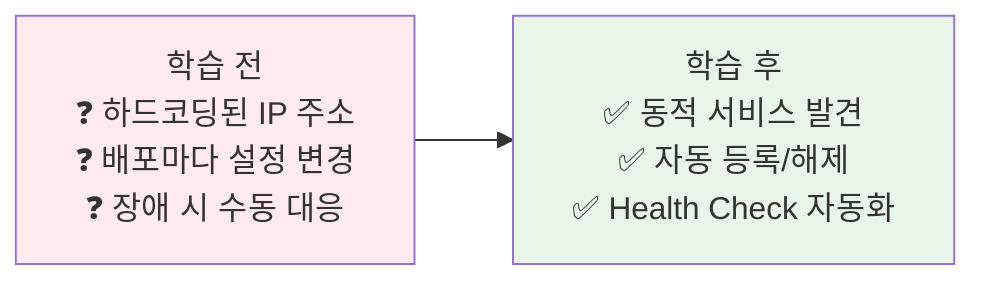
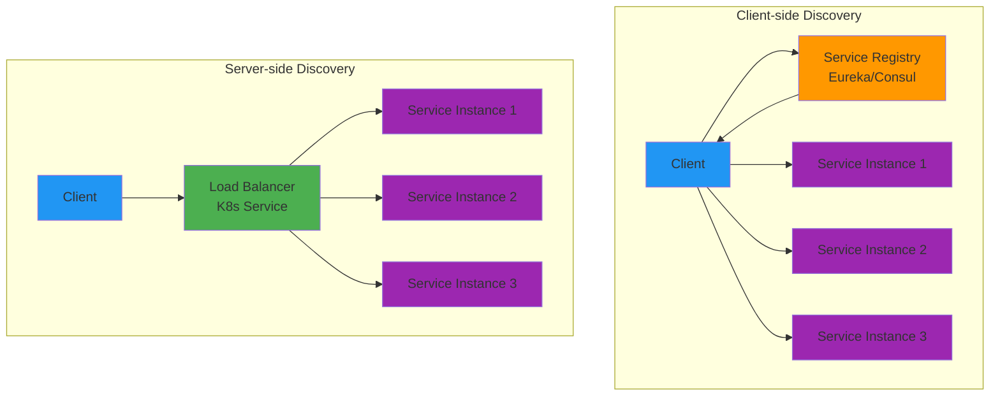
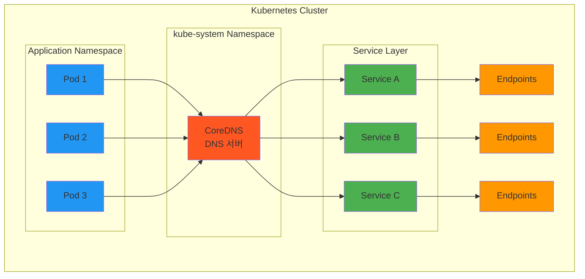

# Week 4 Day 2 Session 2: 서비스 디스커버리

<div align="center">

**🔍 동적 발견** • **🗺️ 서비스 레지스트리** • **💓 Health Check**

*수백 개의 서비스가 서로를 어떻게 찾는가?*

</div>

---

## 🕘 세션 정보
**시간**: 10:00-10:50 (50분)  
**목표**: 서비스 디스커버리 패턴과 Kubernetes DNS 완전 이해  
**방식**: 이론 설명 + 실제 동작 분석 + 페어 토론

## 🎯 세션 목표

### 📚 학습 목표
- **이해 목표**: Client-side vs Server-side Discovery 차이점
- **적용 목표**: Kubernetes 환경에서의 서비스 디스커버리 구현
- **협업 목표**: 팀과 함께 디스커버리 전략 수립

### 🤔 왜 필요한가? (5분)

**현실 문제 상황**:
- 💼 **실무 시나리오**: "서비스 IP가 계속 바뀌는데 어떻게 찾죠?"
- 🏠 **일상 비유**: 전화번호부 vs 114 안내 서비스
- ☁️ **AWS 아키텍처**: ELB + Auto Scaling - 동적 인스턴스 관리
- 📊 **시장 현실**: Netflix는 Eureka로 수천 개 서비스 관리

**학습 전후 비교**:


---

## 📖 핵심 개념 (35분)

### 🔍 개념 1: 서비스 디스커버리의 진화 (10분)

**문제의 시작: 정적 설정의 한계**

**Phase 1: 하드코딩 시대**
```java
// 최악의 방법
String apiUrl = "http://192.168.1.100:8080/api";
```

**문제점**:
- IP 변경 시 코드 수정 필요
- 스케일링 불가능
- 장애 대응 수동

**Phase 2: 설정 파일 외부화**
```yaml
# config.yaml
services:
  api:
    host: api-server.example.com
    port: 8080
```

**문제점**:
- 여전히 정적
- 배포마다 설정 변경
- 실시간 변경 불가

**Phase 3: 설정 서버 (Spring Cloud Config)**
```
문제 해결:
✅ 중앙화된 설정 관리
✅ 런타임 설정 변경

여전한 문제:
❌ 수동 업데이트 필요
❌ Health Check 없음
❌ 자동 장애 대응 불가
```

**Phase 4: 서비스 레지스트리 (Eureka, Consul)**
```
완전한 해결:
✅ 자동 등록/해제
✅ Health Check 통합
✅ 동적 서비스 발견
✅ 로드밸런싱 통합
```

**Phase 5: Kubernetes 네이티브 (Service + DNS)**
```
플랫폼 통합:
✅ 플랫폼 레벨 디스커버리
✅ 추가 컴포넌트 불필요
✅ 선언적 설정
✅ 자동 Health Check
```

### 🔍 개념 2: Client-side vs Server-side Discovery (12분)

**두 가지 접근 방식**



**Client-side Discovery (Netflix Eureka)**

**동작 방식**:
```
1. 서비스 시작 시 Eureka에 등록
2. 클라이언트가 Eureka에서 서비스 목록 조회
3. 클라이언트가 직접 로드밸런싱
4. 주기적으로 목록 갱신
```

**코드 예시**:
```java
// Spring Cloud Netflix Eureka
@EnableEurekaClient
public class ApiClient {
    @Autowired
    private DiscoveryClient discoveryClient;
    
    public String callService() {
        // 1. 서비스 인스턴스 목록 조회
        List<ServiceInstance> instances = 
            discoveryClient.getInstances("user-service");
        
        // 2. 클라이언트가 직접 선택 (로드밸런싱)
        ServiceInstance instance = instances.get(0);
        
        // 3. 직접 호출
        String url = instance.getUri() + "/api/users";
        return restTemplate.getForObject(url, String.class);
    }
}
```

**장점**:
- 클라이언트가 로드밸런싱 제어
- 유연한 라우팅 전략
- 중앙 로드밸런서 불필요

**단점**:
- 클라이언트 복잡도 증가
- 언어별 라이브러리 필요
- 서비스 레지스트리 운영 부담

**Server-side Discovery (Kubernetes Service)**

**동작 방식**:
```
1. 서비스가 Kubernetes에 배포
2. Service 리소스 자동 생성
3. 클라이언트는 Service 이름으로 호출
4. kube-proxy가 로드밸런싱
```

**Kubernetes 예시**:
```yaml
# Service 정의
apiVersion: v1
kind: Service
metadata:
  name: user-service
spec:
  selector:
    app: user
  ports:
  - port: 80
    targetPort: 8080

---
# 클라이언트에서 호출
apiVersion: v1
kind: Pod
spec:
  containers:
  - name: api-client
    env:
    - name: USER_SERVICE_URL
      value: "http://user-service"  # Service 이름으로 호출!
```

**장점**:
- 클라이언트 단순
- 플랫폼 통합
- 언어 독립적

**단점**:
- 로드밸런싱 제어 제한
- 플랫폼 종속
- 고급 라우팅 어려움

**비교표**:

| 항목 | Client-side | Server-side |
|------|-------------|-------------|
| **복잡도** | 클라이언트 높음 | 클라이언트 낮음 |
| **유연성** | 높음 | 제한적 |
| **언어 지원** | 라이브러리 필요 | 독립적 |
| **운영 부담** | 레지스트리 관리 | 플랫폼 관리 |
| **성능** | 직접 호출 (빠름) | 프록시 경유 (약간 느림) |
| **장애 격리** | 클라이언트 책임 | 플랫폼 책임 |

### 🔍 개념 3: Kubernetes DNS와 Service Discovery (13분)

**AWS 환경에서의 서비스 디스커버리**

```mermaid
graph TB
    subgraph "AWS Cloud"
        subgraph "EKS Cluster"
            subgraph "Control Plane (AWS 관리)"
                APISERV[API Server]
                COREDNS[CoreDNS]
            end
            
            subgraph "Data Plane (고객 관리)"
                subgraph "Namespace: production"
                    SVC1[Service: user-service<br/>ClusterIP: 10.100.0.10]
                    P1[Pod: user-1<br/>10.244.1.5]
                    P2[Pod: user-2<br/>10.244.2.3]
                end
                
                subgraph "Namespace: default"
                    CLIENT[Client Pod]
                end
            end
        end
        
        subgraph "AWS Services"
            R53[Route 53<br/>External DNS]
            CW[CloudWatch<br/>Container Insights]
            SM[AWS Service Mesh<br/>App Mesh (선택)]
        end
    end
    
    CLIENT -->|1. DNS Query<br/>user-service.production| COREDNS
    COREDNS -->|2. Return ClusterIP<br/>10.100.0.10| CLIENT
    CLIENT -->|3. HTTP Request| SVC1
    SVC1 -->|4. Load Balance| P1
    SVC1 -->|4. Load Balance| P2
    
    COREDNS -.-> R53
    P1 -.-> CW
    P2 -.-> CW
    SM -.-> P1
    SM -.-> P2
    
    style COREDNS fill:#ff5722
    style SVC1 fill:#4caf50
    style P1,P2 fill:#2196f3
    style CLIENT fill:#ff9800
    style R53 fill:#9c27b0
    style CW fill:#9c27b0
    style SM fill:#9c27b0
```

**AWS EKS의 서비스 디스커버리 특징**:

**1. CoreDNS (EKS 기본 제공)**:
```yaml
# EKS에서 자동 구성됨
apiVersion: v1
kind: ConfigMap
metadata:
  name: coredns
  namespace: kube-system
data:
  Corefile: |
    .:53 {
        errors
        health
        kubernetes cluster.local in-addr.arpa ip6.arpa {
          pods insecure
          fallthrough in-addr.arpa ip6.arpa
        }
        prometheus :9153
        forward . /etc/resolv.conf
        cache 30
        loop
        reload
        loadbalance
    }
```

**2. AWS Cloud Map 통합 (선택)**:
```yaml
# External DNS로 Route 53 자동 업데이트
apiVersion: v1
kind: Service
metadata:
  name: api-service
  annotations:
    external-dns.alpha.kubernetes.io/hostname: api.example.com
spec:
  type: LoadBalancer
  # AWS가 ELB 생성 및 Route 53 레코드 자동 생성
```

**3. AWS App Mesh 통합**:
```yaml
# Service Mesh로 고급 디스커버리
apiVersion: appmesh.k8s.aws/v1beta2
kind: VirtualService
metadata:
  name: user-service
spec:
  provider:
    virtualRouter:
      virtualRouterRef:
        name: user-router
```

**AWS 통합 장점**:
- **관리형 Control Plane**: AWS가 API Server, CoreDNS 관리
- **CloudWatch 통합**: 자동 로그 및 메트릭 수집
- **VPC 네이티브**: AWS VPC CNI로 Pod에 VPC IP 할당
- **IAM 통합**: IRSA로 Pod별 IAM 역할 부여
- **App Mesh**: AWS 네이티브 Service Mesh

**Kubernetes의 통합 솔루션**

**CoreDNS 아키텍처**:


**DNS 이름 규칙**:
```
<service-name>.<namespace>.svc.cluster.local

예시:
- user-service.default.svc.cluster.local
- api-gateway.production.svc.cluster.local
- database.data.svc.cluster.local

단축형:
- 같은 네임스페이스: user-service
- 다른 네임스페이스: user-service.production
```

**동작 과정 상세**:

**1. Service 생성**:
```yaml
apiVersion: v1
kind: Service
metadata:
  name: user-service
  namespace: production
spec:
  selector:
    app: user
  ports:
  - port: 80
    targetPort: 8080
```

**2. Endpoints 자동 생성**:
```yaml
# Kubernetes가 자동 생성
apiVersion: v1
kind: Endpoints
metadata:
  name: user-service
  namespace: production
subsets:
- addresses:
  - ip: 10.244.1.5  # Pod IP
  - ip: 10.244.2.3
  - ip: 10.244.3.7
  ports:
  - port: 8080
```

**3. CoreDNS 레코드 등록**:
```
user-service.production.svc.cluster.local -> 10.96.0.10 (ClusterIP)
```

**4. 클라이언트 DNS 조회**:
```bash
# Pod 내부에서
nslookup user-service.production

# 결과
Name:   user-service.production.svc.cluster.local
Address: 10.96.0.10
```

**5. kube-proxy 로드밸런싱**:
```
ClusterIP (10.96.0.10) -> iptables 규칙
  -> 10.244.1.5:8080 (33%)
  -> 10.244.2.3:8080 (33%)
  -> 10.244.3.7:8080 (34%)
```

**Service 타입별 디스커버리**:

**ClusterIP (기본)**:
```yaml
spec:
  type: ClusterIP  # 클러스터 내부만
  clusterIP: 10.96.0.10
```

**NodePort**:
```yaml
spec:
  type: NodePort
  ports:
  - port: 80
    nodePort: 30080  # 모든 노드의 30080 포트
```

**LoadBalancer**:
```yaml
spec:
  type: LoadBalancer
  # 클라우드 제공자가 외부 IP 할당
```

**Headless Service (StatefulSet용)**:
```yaml
spec:
  clusterIP: None  # IP 없음
  # 각 Pod의 DNS 레코드 생성
  # user-0.user-service.default.svc.cluster.local
  # user-1.user-service.default.svc.cluster.local
```

**Health Check 통합**:

**Readiness Probe**:
```yaml
spec:
  containers:
  - name: user-service
    readinessProbe:
      httpGet:
        path: /health/ready
        port: 8080
      initialDelaySeconds: 5
      periodSeconds: 10
```

**동작**:
- Readiness 실패 → Endpoints에서 제거
- 트래픽 받지 않음
- 복구 시 자동으로 다시 추가

**Liveness Probe**:
```yaml
spec:
  containers:
  - name: user-service
    livenessProbe:
      httpGet:
        path: /health/live
        port: 8080
      initialDelaySeconds: 15
      periodSeconds: 20
```

**동작**:
- Liveness 실패 → Pod 재시작
- 자동 복구 시도

**🎉 Fun Facts**:
- **CoreDNS**: Go로 작성된 경량 DNS 서버
- **DNS 캐싱**: Pod 내부에서 DNS 캐시 (ndots=5)
- **Service Mesh**: Istio는 DNS를 우회하고 Envoy가 직접 라우팅
- **External DNS**: 외부 DNS와 자동 동기화 가능

---

## 💭 함께 생각해보기 (10분)

### 🤝 페어 토론 (7분)

**토론 주제 1**: "Client-side vs Server-side 선택"
```
상황:
- 마이크로서비스 20개
- 다양한 언어 (Java, Python, Go)
- Kubernetes 환경

질문:
1. 어떤 방식을 선택하시겠습니까?
2. 하이브리드 접근은 가능한가요?
3. Service Mesh는 어떤 역할을 하나요?
```

**토론 주제 2**: "Health Check 전략"
```
상황:
- 데이터베이스 연결 필요한 서비스
- 시작 시간 30초 소요
- 외부 API 의존성

질문:
1. Readiness vs Liveness 어떻게 구분?
2. initialDelaySeconds는 얼마로?
3. 의존성 체크는 어디까지?
```

### 🎯 전체 공유 (3분)
- 각 페어의 선택과 이유
- 실무 경험 공유
- 베스트 프랙티스 도출

### 💡 이해도 체크 질문
- ✅ "Client-side와 Server-side Discovery의 차이를 설명할 수 있나요?"
- ✅ "Kubernetes DNS가 어떻게 동작하는지 설명할 수 있나요?"
- ✅ "Readiness와 Liveness Probe의 차이를 아시나요?"

---

## 🔑 핵심 키워드

### 🔤 디스커버리 패턴
- **Client-side Discovery**: 클라이언트가 직접 서비스 찾기
- **Server-side Discovery**: 로드밸런서가 대신 찾기
- **Service Registry**: 서비스 목록 저장소
- **Health Check**: 서비스 상태 확인

### 🔤 Kubernetes 리소스
- **Service**: 서비스 추상화 및 로드밸런싱
- **Endpoints**: 실제 Pod IP 목록
- **CoreDNS**: Kubernetes DNS 서버
- **kube-proxy**: 네트워크 프록시 및 로드밸런서

### 🔤 Health Check
- **Readiness Probe**: 트래픽 받을 준비 확인
- **Liveness Probe**: 프로세스 살아있는지 확인
- **Startup Probe**: 초기 시작 완료 확인

---

## 📝 세션 마무리

### ✅ 오늘 세션 성과
- [ ] 서비스 디스커버리 패턴 이해
- [ ] Kubernetes DNS 동작 원리 파악
- [ ] Health Check 전략 수립 능력
- [ ] 실무 적용 시나리오 분석

### 🎯 다음 세션 준비
**Session 3 예고**: 로드밸런싱과 라우팅
- L4 vs L7 로드밸런싱
- 다양한 라우팅 전략
- 카나리 배포와 블루-그린 배포

### 🔗 참고 자료
- **[Kubernetes Service](https://kubernetes.io/docs/concepts/services-networking/service/)**
- **[CoreDNS](https://coredns.io/)**
- **[Netflix Eureka](https://github.com/Netflix/eureka)**
- **[Consul](https://www.consul.io/)**

---

<div align="center">

**🔍 동적 발견** • **🗺️ 자동 등록** • **💓 Health Check** • **🚀 실무 적용**

*서비스 디스커버리 - 마이크로서비스의 필수 요소*

</div>
