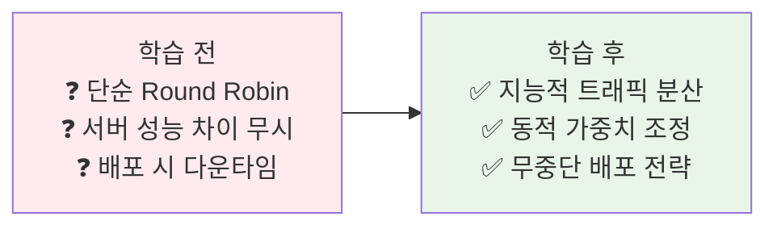
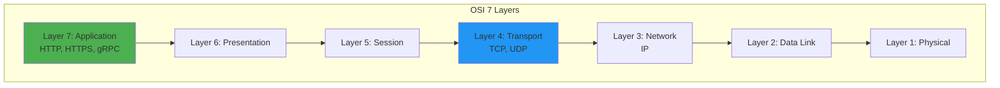
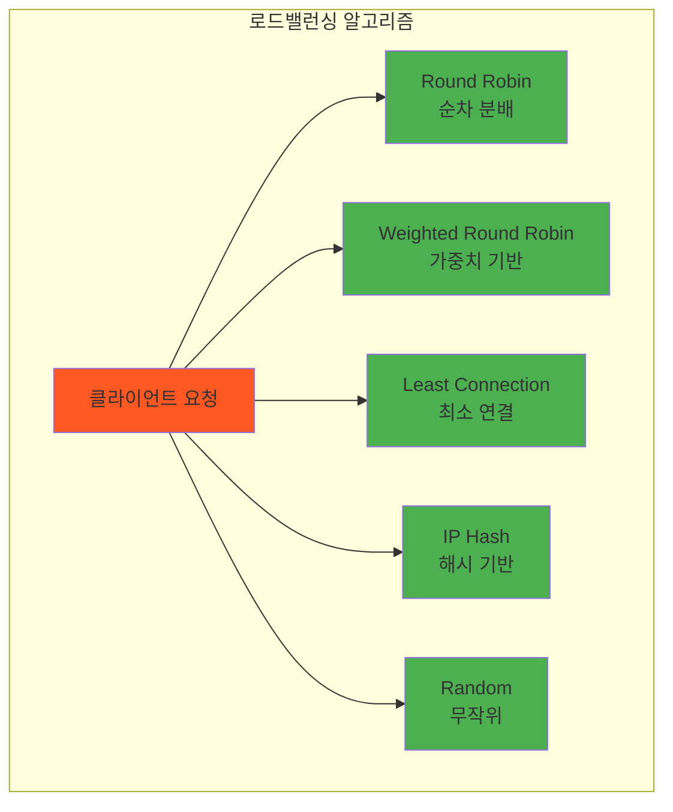
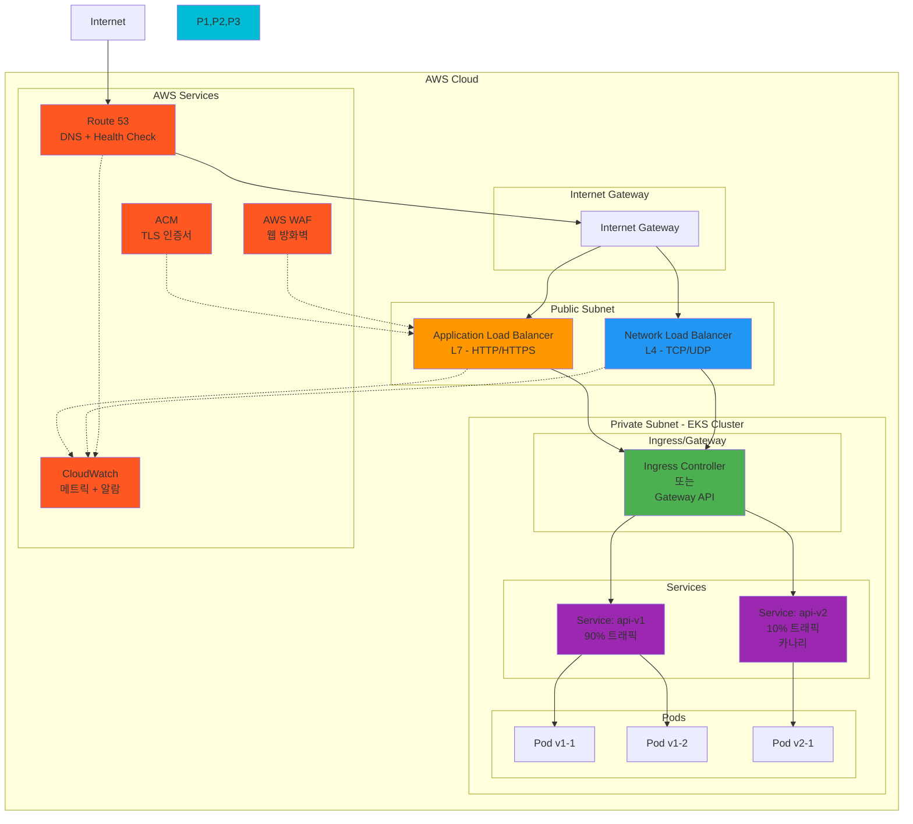
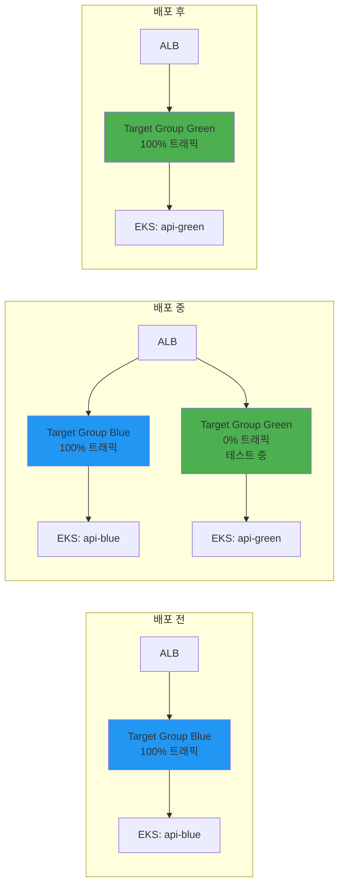
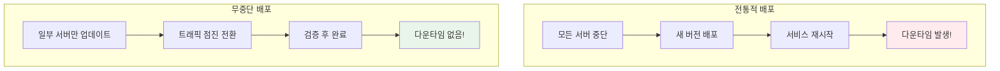

# Week 4 Day 2 Session 3: 로드밸런싱과 라우팅

<div align="center">

**⚖️ 트래픽 분산** • **🎯 똑똑한 라우팅** • **🚀 무중단 배포**

*어떻게 트래픽을 효율적으로 분산하는가?*

</div>

---

## 🕘 세션 정보
**시간**: 11:00-11:50 (50분)  
**목표**: 로드밸런싱 전략과 고급 라우팅 패턴 완전 이해  
**방식**: 이론 설명 + 패턴 비교 + 페어 토론

## 🎯 세션 목표

### 📚 학습 목표
- **이해 목표**: L4 vs L7 로드밸런싱의 본질적 차이
- **적용 목표**: 상황에 맞는 라우팅 전략 선택 능력
- **협업 목표**: 팀과 함께 배포 전략 수립

### 🤔 왜 필요한가? (5분)

**현실 문제 상황**:
- 💼 **실무 시나리오**: "서버 3대인데 한 대만 과부하예요"
- 🏠 **일상 비유**: 마트 계산대 - 줄이 짧은 곳 vs 빈 계산원
- ☁️ **AWS 아키텍처**: ALB vs NLB - 언제 무엇을 쓰나?
- 📊 **시장 현실**: Netflix는 하루 수천 번 무중단 배포

**학습 전후 비교**:


---

## 📖 핵심 개념 (35분)

### 🔍 개념 1: L4 vs L7 로드밸런싱 (12분)

**OSI 7계층과 로드밸런싱**



**L4 로드밸런싱 (Transport Layer)**

**동작 방식**:
```
클라이언트 → L4 LB → 서버
  TCP/UDP 레벨에서 분산
  IP 주소와 포트만 확인
  패킷 내용은 보지 않음
```

**특징**:
```yaml
장점:
  - 매우 빠름 (패킷 검사 최소)
  - 낮은 지연시간
  - 높은 처리량
  - 프로토콜 독립적

단점:
  - HTTP 헤더 확인 불가
  - URL 기반 라우팅 불가
  - 세션 유지 제한적
  - 고급 기능 부족
```

**AWS NLB 예시**:
```yaml
# Network Load Balancer (L4)
Type: network
Scheme: internet-facing
IpAddressType: ipv4
Subnets:
  - subnet-abc123
  - subnet-def456

Listeners:
  - Protocol: TCP
    Port: 80
    DefaultActions:
      - Type: forward
        TargetGroupArn: arn:aws:...
```

**L7 로드밸런싱 (Application Layer)**

**동작 방식**:
```
클라이언트 → L7 LB → 서버
  HTTP/HTTPS 레벨에서 분산
  URL, 헤더, 쿠키 확인
  콘텐츠 기반 라우팅
```

**특징**:
```yaml
장점:
  - URL 기반 라우팅
  - 헤더 기반 라우팅
  - 쿠키 기반 세션 유지
  - SSL/TLS 종료
  - 콘텐츠 압축
  - WAF 통합

단점:
  - 상대적으로 느림
  - 높은 CPU 사용
  - HTTP/HTTPS만 지원
  - 복잡한 설정
```

**AWS ALB 예시**:
```yaml
# Application Load Balancer (L7)
Type: application
Scheme: internet-facing
IpAddressType: ipv4

Listeners:
  - Protocol: HTTPS
    Port: 443
    Certificates:
      - CertificateArn: arn:aws:acm:...
    DefaultActions:
      - Type: forward
        TargetGroupArn: arn:aws:...
    
    Rules:
      - Conditions:
          - Field: path-pattern
            Values: ["/api/*"]
        Actions:
          - Type: forward
            TargetGroupArn: arn:aws:...api
      
      - Conditions:
          - Field: host-header
            Values: ["admin.example.com"]
        Actions:
          - Type: forward
            TargetGroupArn: arn:aws:...admin
```

**비교표**:

| 항목 | L4 (NLB) | L7 (ALB) |
|------|----------|----------|
| **계층** | Transport (TCP/UDP) | Application (HTTP/HTTPS) |
| **속도** | 매우 빠름 | 상대적으로 느림 |
| **지연시간** | < 1ms | 1-5ms |
| **처리량** | 수백만 RPS | 수만 RPS |
| **라우팅** | IP:Port | URL, Header, Cookie |
| **SSL 종료** | 불가 (Pass-through) | 가능 |
| **세션 유지** | Source IP | Cookie 기반 |
| **비용** | 저렴 | 비쌈 |
| **사용 사례** | TCP/UDP 서비스 | HTTP/HTTPS 웹 서비스 |

**선택 가이드**:
```
L4 (NLB) 선택:
✅ 최고 성능 필요
✅ TCP/UDP 프로토콜
✅ 단순 포트 포워딩
✅ 비용 최소화

L7 (ALB) 선택:
✅ HTTP/HTTPS 서비스
✅ URL 기반 라우팅
✅ 마이크로서비스 아키텍처
✅ SSL 종료 필요
```

### 🔍 개념 2: 로드밸런싱 알고리즘 (11분)

**다양한 분산 전략**



**1. Round Robin (라운드 로빈)**

**동작**:
```
요청 1 → 서버 A
요청 2 → 서버 B
요청 3 → 서버 C
요청 4 → 서버 A (반복)
```

**장점**:
- 단순하고 공평
- 구현 쉬움
- 예측 가능

**단점**:
- 서버 성능 차이 무시
- 요청 처리 시간 차이 무시
- 세션 유지 어려움

**사용 사례**:
- 동일한 성능의 서버들
- 상태 없는(Stateless) 서비스
- 간단한 웹 서비스

**2. Weighted Round Robin (가중치 라운드 로빈)**

**동작**:
```
서버 A (가중치 3): 60%
서버 B (가중치 2): 40%

요청 1 → 서버 A
요청 2 → 서버 A
요청 3 → 서버 A
요청 4 → 서버 B
요청 5 → 서버 B
```

**Gateway API 예시**:
```yaml
apiVersion: gateway.networking.k8s.io/v1
kind: HTTPRoute
spec:
  rules:
  - backendRefs:
    - name: service-v1
      port: 80
      weight: 90  # 90%
    - name: service-v2
      port: 80
      weight: 10  # 10% (카나리)
```

**사용 사례**:
- 서버 성능 차이 있을 때
- 카나리 배포
- 점진적 트래픽 전환

**3. Least Connection (최소 연결)**

**동작**:
```
서버 A: 5개 연결
서버 B: 3개 연결  ← 선택
서버 C: 7개 연결

새 요청 → 서버 B (연결 수 가장 적음)
```

**장점**:
- 동적 부하 분산
- 긴 연결에 효과적
- 실시간 상태 반영

**단점**:
- 복잡한 구현
- 상태 추적 필요
- 오버헤드 증가

**사용 사례**:
- WebSocket 연결
- 데이터베이스 연결
- 처리 시간이 긴 요청

**4. IP Hash (Consistent Hashing)**

**동작**:
```
hash(Client IP) % 서버 수 = 서버 선택

Client 192.168.1.100 → 항상 서버 A
Client 192.168.1.101 → 항상 서버 B
```

**장점**:
- 세션 유지 자동
- 캐시 효율적
- 서버 추가/제거 시 일부만 재분배

**단점**:
- 불균등 분산 가능
- 클라이언트 IP 변경 시 문제
- NAT 환경에서 제한

**사용 사례**:
- 세션 기반 애플리케이션
- 캐시 서버
- Stateful 서비스

**5. Least Response Time (최소 응답 시간)**

**동작**:
```
서버 A: 평균 50ms
서버 B: 평균 30ms  ← 선택
서버 C: 평균 80ms

새 요청 → 서버 B (응답 시간 가장 빠름)
```

**사용 사례**:
- 성능 최적화 중요
- 서버 성능 차이 큼
- 실시간 서비스

**알고리즘 선택 가이드**:

| 상황 | 추천 알고리즘 | 이유 |
|------|--------------|------|
| 동일 성능 서버 | Round Robin | 단순하고 공평 |
| 성능 차이 있음 | Weighted RR | 가중치로 조정 |
| 긴 연결 (WebSocket) | Least Connection | 연결 수 기반 |
| 세션 유지 필요 | IP Hash | 동일 서버 보장 |
| 카나리 배포 | Weighted RR | 트래픽 비율 제어 |
| 성능 최적화 | Least Response Time | 빠른 서버 우선 |

### 🔍 개념 3: 고급 라우팅 패턴 - 무중단 배포 (12분)

**AWS 환경에서의 로드밸런싱 아키텍처**



**AWS 로드밸런싱 계층 구조**:

**Layer 1: Route 53 (DNS)**
```yaml
# Weighted Routing으로 리전별 트래픽 분산
Type: A
Name: api.example.com
Routing Policy: Weighted
Records:
  - us-east-1 ALB: 70%
  - ap-northeast-2 ALB: 30%
```

**Layer 2: ALB/NLB (AWS 관리형)**
```yaml
# ALB - L7 로드밸런싱
Type: application
Scheme: internet-facing
Listeners:
  - Protocol: HTTPS
    Port: 443
    Rules:
      - Condition: path-pattern /api/v1/*
        Action: forward to target-group-v1 (90%)
      - Condition: path-pattern /api/v2/*
        Action: forward to target-group-v2 (10%)

# NLB - L4 로드밸런싱 (고성능)
Type: network
Scheme: internet-facing
Listeners:
  - Protocol: TCP
    Port: 443
    Action: forward to target-group
```

**Layer 3: Kubernetes Service (클러스터 내부)**
```yaml
# kube-proxy가 iptables/IPVS로 로드밸런싱
apiVersion: v1
kind: Service
metadata:
  name: api-service
spec:
  type: NodePort  # ALB/NLB가 NodePort로 연결
  ports:
  - port: 80
    targetPort: 8080
    nodePort: 30080
  selector:
    app: api
```

**AWS 블루-그린 배포 아키텍처**:



**AWS 카나리 배포 with ALB**:
```yaml
# ALB Listener Rule로 가중치 기반 라우팅
Listener: HTTPS:443
Rules:
  - Priority: 1
    Conditions:
      - Field: path-pattern
        Values: ["/api/*"]
    Actions:
      - Type: forward
        ForwardConfig:
          TargetGroups:
            - TargetGroupArn: arn:aws:...target-group-v1
              Weight: 90  # 기존 버전
            - TargetGroupArn: arn:aws:...target-group-v2
              Weight: 10  # 카나리
          TargetGroupStickinessConfig:
            Enabled: true
            DurationSeconds: 3600
```

**AWS 통합 장점**:
- **다층 로드밸런싱**: Route 53 → ALB/NLB → K8s Service
- **관리형 서비스**: AWS가 ALB/NLB 운영 및 확장
- **Auto Scaling**: Target Group 자동 확장
- **Health Check**: 다층 헬스체크 (ALB + K8s)
- **CloudWatch**: 통합 모니터링 및 알람
- **WAF 통합**: L7 보안 (ALB만)
- **Global Accelerator**: 글로벌 트래픽 최적화

**배포 전략의 진화**



**1. 블루-그린 배포 (Blue-Green Deployment)**

**개념**:
```
Blue (현재 버전) ← 100% 트래픽
Green (새 버전) ← 0% 트래픽

검증 완료 후:
Blue (현재 버전) ← 0% 트래픽
Green (새 버전) ← 100% 트래픽 (즉시 전환)
```

**Gateway API 구현**:
```yaml
# 초기 상태: Blue에 100%
apiVersion: gateway.networking.k8s.io/v1
kind: HTTPRoute
metadata:
  name: app-route
spec:
  rules:
  - backendRefs:
    - name: app-blue
      port: 80
      weight: 100
    - name: app-green
      port: 80
      weight: 0

---
# 전환 후: Green에 100%
spec:
  rules:
  - backendRefs:
    - name: app-blue
      port: 80
      weight: 0
    - name: app-green
      port: 80
      weight: 100
```

**장점**:
- 즉시 전환 가능
- 즉시 롤백 가능
- 테스트 환경 동일
- 다운타임 없음

**단점**:
- 2배 리소스 필요
- 데이터베이스 마이그레이션 복잡
- 비용 증가

**사용 사례**:
- 중요한 프로덕션 배포
- 대규모 변경
- 빠른 롤백 필요

**2. 카나리 배포 (Canary Deployment)**

**개념**:
```
Phase 1: 새 버전 10%
Phase 2: 새 버전 30%
Phase 3: 새 버전 50%
Phase 4: 새 버전 100%

각 단계에서 메트릭 확인 후 진행
```

**Gateway API 구현**:
```yaml
# Phase 1: 10% 카나리
apiVersion: gateway.networking.k8s.io/v1
kind: HTTPRoute
spec:
  rules:
  - backendRefs:
    - name: app-v1
      port: 80
      weight: 90
    - name: app-v2
      port: 80
      weight: 10  # 카나리

---
# Phase 2: 30% 카나리
spec:
  rules:
  - backendRefs:
    - name: app-v1
      port: 80
      weight: 70
    - name: app-v2
      port: 80
      weight: 30

---
# Phase 4: 100% 전환
spec:
  rules:
  - backendRefs:
    - name: app-v2
      port: 80
      weight: 100
```

**장점**:
- 점진적 위험 감소
- 실시간 모니터링
- 문제 조기 발견
- 부분 롤백 가능

**단점**:
- 배포 시간 길어짐
- 복잡한 모니터링 필요
- 버전 관리 복잡

**사용 사례**:
- 위험한 변경
- 대규모 사용자
- 점진적 검증 필요

**3. A/B 테스팅**

**개념**:
```
특정 사용자 그룹별로 다른 버전 제공
- 헤더 기반
- 쿠키 기반
- 지역 기반
```

**Gateway API 구현**:
```yaml
apiVersion: gateway.networking.k8s.io/v1
kind: HTTPRoute
spec:
  rules:
  # 베타 사용자 → v2
  - matches:
    - headers:
      - name: X-User-Group
        value: beta
    backendRefs:
    - name: app-v2
      port: 80
  
  # 일반 사용자 → v1
  - backendRefs:
    - name: app-v1
      port: 80
```

**장점**:
- 사용자 그룹별 테스트
- 기능 플래그 통합
- 데이터 기반 의사결정

**단점**:
- 복잡한 라우팅 로직
- 세션 관리 어려움
- 분석 도구 필요

**사용 사례**:
- 새 기능 테스트
- UI/UX 실험
- 비즈니스 메트릭 비교

**4. 롤링 업데이트 (Rolling Update)**

**Kubernetes 기본 전략**:
```yaml
apiVersion: apps/v1
kind: Deployment
spec:
  replicas: 10
  strategy:
    type: RollingUpdate
    rollingUpdate:
      maxUnavailable: 1  # 최대 1개 중단
      maxSurge: 1        # 최대 1개 추가
```

**동작 과정**:
```
초기: v1 Pod 10개

Step 1: v2 Pod 1개 생성 (총 11개)
Step 2: v1 Pod 1개 종료 (총 10개)
Step 3: v2 Pod 1개 생성 (총 11개)
Step 4: v1 Pod 1개 종료 (총 10개)
...
최종: v2 Pod 10개
```

**장점**:
- 추가 리소스 최소
- 자동화 쉬움
- Kubernetes 네이티브

**단점**:
- 두 버전 동시 실행
- 호환성 필요
- 롤백 느림

**배포 전략 비교**:

| 전략 | 다운타임 | 리소스 | 롤백 속도 | 위험도 | 복잡도 |
|------|---------|--------|----------|--------|--------|
| **블루-그린** | 없음 | 2배 | 즉시 | 중간 | 중간 |
| **카나리** | 없음 | 1.1배 | 빠름 | 낮음 | 높음 |
| **A/B 테스팅** | 없음 | 1.5배 | 빠름 | 낮음 | 높음 |
| **롤링** | 없음 | 1.1배 | 느림 | 중간 | 낮음 |

**🎉 Fun Facts**:
- **카나리 유래**: 탄광의 카나리아 (위험 감지)
- **블루-그린**: IBM에서 1960년대 시작
- **Netflix**: 하루 4,000번 이상 배포
- **Facebook**: 하루 2번 전체 배포

---

## 💭 함께 생각해보기 (10분)

### 🤝 페어 토론 (7분)

**토론 주제 1**: "배포 전략 선택"
```
상황:
- E-Commerce 플랫폼
- 결제 시스템 업데이트
- 월간 거래 100만 건

질문:
1. 어떤 배포 전략을 선택하시겠습니까?
2. 모니터링할 메트릭은?
3. 롤백 기준은?
```

**토론 주제 2**: "로드밸런싱 알고리즘"
```
상황:
- 서버 3대 (성능 다름)
  - 서버 A: 16 Core, 32GB
  - 서버 B: 8 Core, 16GB
  - 서버 C: 8 Core, 16GB
- WebSocket 연결 많음

질문:
1. 어떤 알고리즘을 선택하시겠습니까?
2. 가중치는 어떻게 설정하시겠습니까?
3. 세션 유지는 어떻게 하시겠습니까?
```

### 🎯 전체 공유 (3분)
- 각 페어의 전략과 이유
- 실무 경험 공유
- 베스트 프랙티스 도출

### 💡 이해도 체크 질문
- ✅ "L4와 L7 로드밸런싱의 차이를 설명할 수 있나요?"
- ✅ "카나리 배포와 블루-그린 배포의 차이를 아시나요?"
- ✅ "상황에 맞는 로드밸런싱 알고리즘을 선택할 수 있나요?"

---

## 🔑 핵심 키워드

### 🔤 로드밸런싱
- **L4 Load Balancing**: Transport Layer 로드밸런싱
- **L7 Load Balancing**: Application Layer 로드밸런싱
- **Round Robin**: 순차적 분배
- **Weighted Round Robin**: 가중치 기반 분배
- **Least Connection**: 최소 연결 수 기반
- **IP Hash**: 해시 기반 분배

### 🔤 배포 전략
- **Blue-Green Deployment**: 즉시 전환 배포
- **Canary Deployment**: 점진적 배포
- **A/B Testing**: 사용자 그룹별 테스트
- **Rolling Update**: 순차적 업데이트

### 🔤 AWS 서비스
- **NLB**: Network Load Balancer (L4)
- **ALB**: Application Load Balancer (L7)
- **Target Group**: 백엔드 서버 그룹

---

## 📝 세션 마무리

### ✅ 오늘 세션 성과
- [ ] L4 vs L7 로드밸런싱 차이 이해
- [ ] 다양한 로드밸런싱 알고리즘 비교
- [ ] 무중단 배포 전략 습득
- [ ] 실무 적용 시나리오 분석

### 🎯 오후 실습 준비
**Lab 1 예고**: Kubernetes Gateway API 구축
- GatewayClass, Gateway, HTTPRoute 생성
- 가중치 기반 트래픽 분할
- TLS 인증서 자동 관리

**Hands-on 1 예고**: 고급 트래픽 관리
- 카나리 배포 구현
- A/B 테스팅 설정
- 멀티 네임스페이스 라우팅

### 🔗 참고 자료
- **[AWS Load Balancer](https://docs.aws.amazon.com/elasticloadbalancing/)**
- **[Kubernetes Service](https://kubernetes.io/docs/concepts/services-networking/service/)**
- **[Gateway API Traffic Splitting](https://gateway-api.sigs.k8s.io/guides/traffic-splitting/)**
- **[Martin Fowler - Canary Release](https://martinfowler.com/bliki/CanaryRelease.html)**

---

<div align="center">

**⚖️ 똑똑한 분산** • **🎯 전략적 라우팅** • **🚀 무중단 배포** • **📊 실무 적용**

*로드밸런싱과 라우팅 - 안정적인 서비스의 핵심*

</div>
