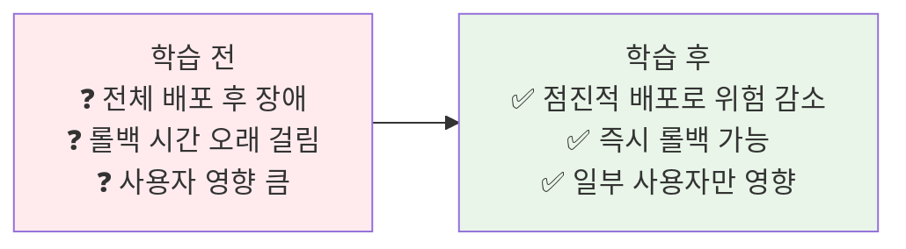
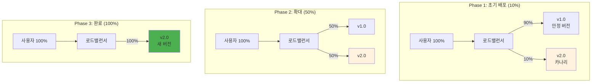
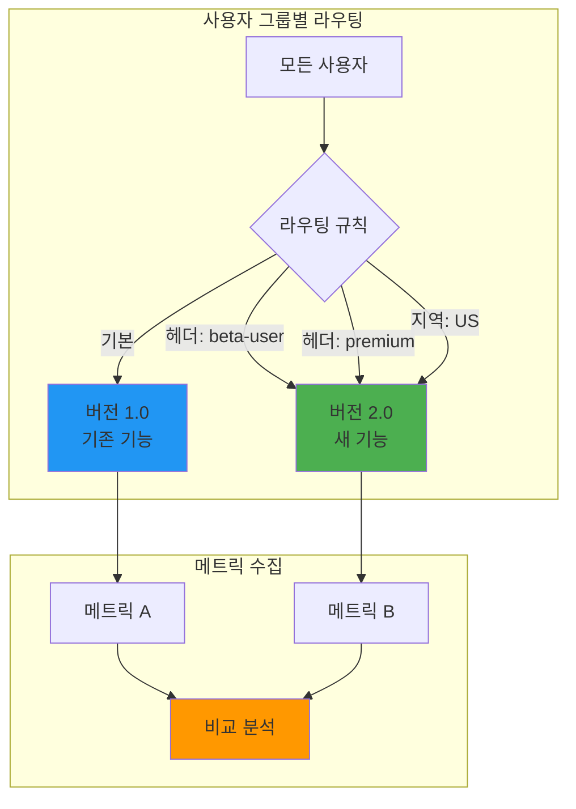
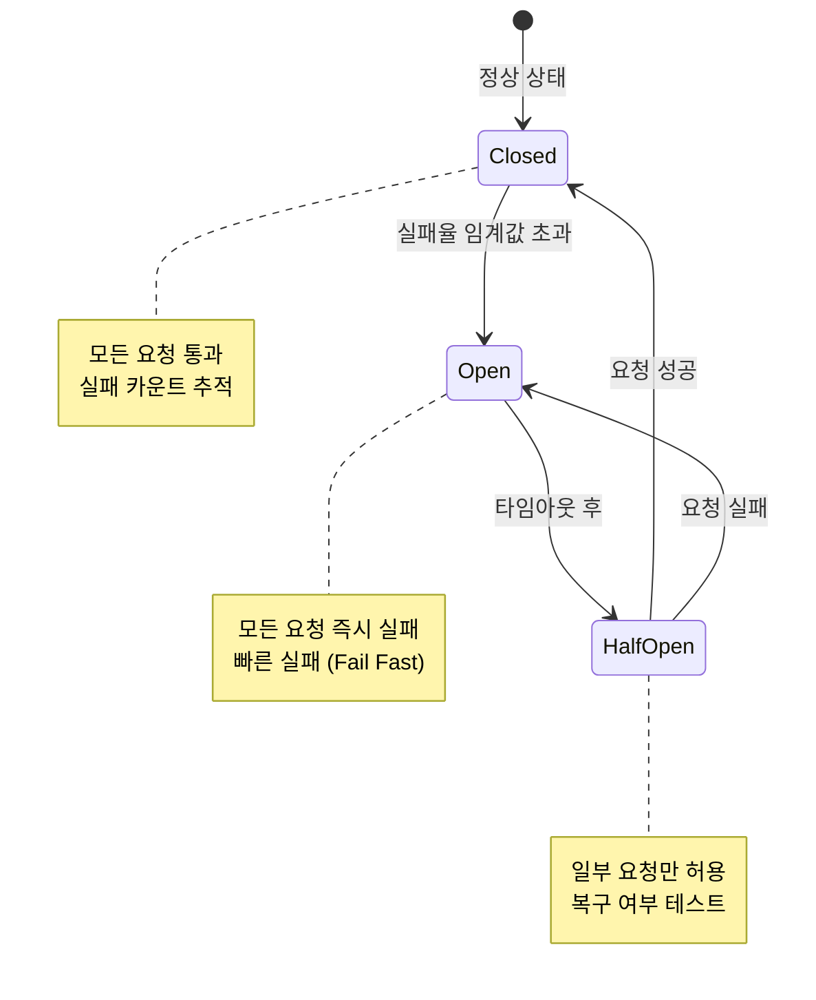
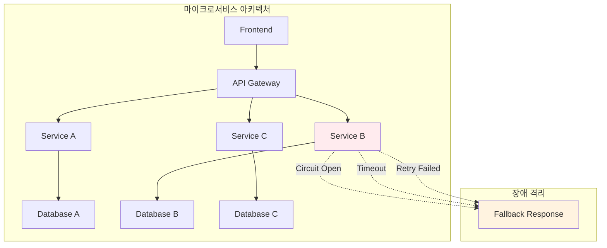

# Week 4 Day 2 Session 3: 고급 트래픽 관리 및 실전 패턴

<div align="center">

**🎯 카나리 배포** • **🔄 A/B 테스팅** • **🛡️ 장애 격리** • **📊 관측성**

*Kong과 Istio의 고급 기능으로 프로덕션급 트래픽 관리*

</div>

---

## 🕘 세션 정보
**시간**: 11:00-11:50 (50분)  
**목표**: Kong과 Istio의 고급 트래픽 관리 패턴 실전 적용  
**방식**: 실전 패턴 학습 + 아키텍처 비교 + 페어 토론

## 🎯 세션 목표

### 📚 학습 목표
- **이해 목표**: 카나리 배포, A/B 테스팅, 서킷 브레이커 등 고급 패턴 이해
- **적용 목표**: Kong과 Istio로 각 패턴을 구현하는 방법 습득
- **협업 목표**: 실무 시나리오에서 적절한 패턴 선택 능력

### 🤔 왜 필요한가? (5분)

**현실 문제 상황**:
- 💼 **실무 시나리오**: "새 버전 배포했는데 장애 발생! 어떻게 빠르게 롤백하죠?"
- 🏠 **일상 비유**: 새 메뉴 출시 - 일부 고객에게만 먼저 제공하고 반응 확인
- ☁️ **AWS 아키텍처**: ALB 가중치 라우팅 vs Istio VirtualService
- 📊 **시장 현실**: Netflix는 카나리 배포로 하루 4,000번 배포

**학습 전후 비교**:


---

## 📖 핵심 개념 (35분)

### 🔍 개념 1: 카나리 배포 (Canary Deployment) (12분)

**카나리 배포란?**



**Kong으로 카나리 배포 구현**:

```yaml
# Kong Service 정의
apiVersion: configuration.konghq.com/v1
kind: KongService
metadata:
  name: api-service
spec:
  protocol: http
  host: api-backend
  port: 80

---
# Upstream 정의 (가중치 기반)
apiVersion: configuration.konghq.com/v1
kind: KongUpstream
metadata:
  name: api-backend
spec:
  targets:
    - target: api-v1:80
      weight: 90  # 기존 버전 90%
    - target: api-v2:80
      weight: 10  # 카나리 10%
  algorithm: weighted-round-robin

---
# Route 정의
apiVersion: configuration.konghq.com/v1
kind: KongRoute
metadata:
  name: api-route
spec:
  service: api-service
  paths:
    - /api
```

**Istio로 카나리 배포 구현**:

```yaml
# VirtualService로 트래픽 분할
apiVersion: networking.istio.io/v1beta1
kind: VirtualService
metadata:
  name: api-service
spec:
  hosts:
    - api-service
  http:
  - match:
    - uri:
        prefix: /api
    route:
    - destination:
        host: api-service
        subset: v1
      weight: 90  # 기존 버전 90%
    - destination:
        host: api-service
        subset: v2
      weight: 10  # 카나리 10%

---
# DestinationRule로 버전 정의
apiVersion: networking.istio.io/v1beta1
kind: DestinationRule
metadata:
  name: api-service
spec:
  host: api-service
  subsets:
  - name: v1
    labels:
      version: v1
  - name: v2
    labels:
      version: v2
```

**카나리 배포 모니터링**:

```yaml
# Prometheus 메트릭 수집
- name: canary_success_rate
  query: |
    sum(rate(http_requests_total{version="v2", status=~"2.."}[5m])) /
    sum(rate(http_requests_total{version="v2"}[5m]))

- name: canary_error_rate
  query: |
    sum(rate(http_requests_total{version="v2", status=~"5.."}[5m])) /
    sum(rate(http_requests_total{version="v2"}[5m]))

- name: canary_latency_p95
  query: |
    histogram_quantile(0.95,
      rate(http_request_duration_seconds_bucket{version="v2"}[5m]))
```

**자동 롤백 조건**:
```yaml
# Flagger를 이용한 자동 카나리 배포
apiVersion: flagger.app/v1beta1
kind: Canary
metadata:
  name: api-service
spec:
  targetRef:
    apiVersion: apps/v1
    kind: Deployment
    name: api-service
  service:
    port: 80
  analysis:
    interval: 1m
    threshold: 5
    maxWeight: 50
    stepWeight: 10
    metrics:
    - name: request-success-rate
      thresholdRange:
        min: 99  # 성공률 99% 이상
      interval: 1m
    - name: request-duration
      thresholdRange:
        max: 500  # 응답시간 500ms 이하
      interval: 1m
  # 조건 미달 시 자동 롤백
```

**장점**:
- ✅ 점진적 위험 감소
- ✅ 실시간 모니터링으로 문제 조기 발견
- ✅ 빠른 롤백 가능
- ✅ 일부 사용자만 영향

**단점**:
- ❌ 배포 시간 증가
- ❌ 복잡한 모니터링 필요
- ❌ 두 버전 동시 운영

### 🔍 개념 2: A/B 테스팅 및 헤더 기반 라우팅 (11분)

**A/B 테스팅이란?**



**Kong으로 A/B 테스팅 구현**:

```yaml
# 헤더 기반 라우팅
apiVersion: configuration.konghq.com/v1
kind: KongRoute
metadata:
  name: api-beta-route
spec:
  service: api-v2-service
  paths:
    - /api
  headers:
    X-User-Group:
      - beta
      - premium

---
# 기본 라우팅
apiVersion: configuration.konghq.com/v1
kind: KongRoute
metadata:
  name: api-default-route
spec:
  service: api-v1-service
  paths:
    - /api
```

**Istio로 A/B 테스팅 구현**:

```yaml
apiVersion: networking.istio.io/v1beta1
kind: VirtualService
metadata:
  name: api-service
spec:
  hosts:
    - api-service
  http:
  # 베타 사용자 → v2
  - match:
    - headers:
        X-User-Group:
          exact: beta
    route:
    - destination:
        host: api-service
        subset: v2
  
  # 프리미엄 사용자 → v2
  - match:
    - headers:
        X-User-Type:
          exact: premium
    route:
    - destination:
        host: api-service
        subset: v2
  
  # 특정 지역 → v2
  - match:
    - headers:
        X-Region:
          regex: "us-.*"
    route:
    - destination:
        host: api-service
        subset: v2
  
  # 기본 사용자 → v1
  - route:
    - destination:
        host: api-service
        subset: v1
```

**쿠키 기반 라우팅**:

```yaml
# Istio - 쿠키 기반
apiVersion: networking.istio.io/v1beta1
kind: VirtualService
metadata:
  name: api-service
spec:
  http:
  - match:
    - headers:
        cookie:
          regex: ".*experiment=new-ui.*"
    route:
    - destination:
        host: api-service
        subset: v2
  - route:
    - destination:
        host: api-service
        subset: v1
```

**실무 A/B 테스팅 시나리오**:

```yaml
# 시나리오 1: 새 UI 테스트
# - 10% 사용자에게 새 UI 제공
# - 전환율, 체류시간 비교

# 시나리오 2: 알고리즘 테스트
# - 추천 알고리즘 A vs B
# - 클릭률, 구매율 비교

# 시나리오 3: 가격 테스트
# - 가격 정책 A vs B
# - 매출, 전환율 비교
```

**메트릭 수집 및 분석**:

```yaml
# Prometheus 메트릭
- name: conversion_rate_v1
  query: |
    sum(rate(conversions_total{version="v1"}[1h])) /
    sum(rate(page_views_total{version="v1"}[1h]))

- name: conversion_rate_v2
  query: |
    sum(rate(conversions_total{version="v2"}[1h])) /
    sum(rate(page_views_total{version="v2"}[1h]))

# Grafana 대시보드로 실시간 비교
```

### 🔍 개념 3: 서킷 브레이커 및 장애 격리 (12분)

**서킷 브레이커란?**



**Kong으로 서킷 브레이커 구현**:

```yaml
# Kong Circuit Breaker 플러그인
apiVersion: configuration.konghq.com/v1
kind: KongPlugin
metadata:
  name: circuit-breaker
plugin: circuit-breaker
config:
  # 실패 임계값
  failure_threshold: 5
  # 타임아웃 (초)
  timeout: 30
  # 복구 시도 간격 (초)
  recovery_timeout: 60
  # 모니터링 윈도우 (초)
  window_size: 60

---
# Service에 플러그인 적용
apiVersion: configuration.konghq.com/v1
kind: KongService
metadata:
  name: api-service
  annotations:
    konghq.com/plugins: circuit-breaker
```

**Istio로 서킷 브레이커 구현**:

```yaml
apiVersion: networking.istio.io/v1beta1
kind: DestinationRule
metadata:
  name: api-service
spec:
  host: api-service
  trafficPolicy:
    connectionPool:
      tcp:
        maxConnections: 100
      http:
        http1MaxPendingRequests: 50
        http2MaxRequests: 100
        maxRequestsPerConnection: 2
    outlierDetection:
      consecutiveErrors: 5
      interval: 30s
      baseEjectionTime: 30s
      maxEjectionPercent: 50
      minHealthPercent: 50
```

**Retry 정책**:

```yaml
# Istio Retry 설정
apiVersion: networking.istio.io/v1beta1
kind: VirtualService
metadata:
  name: api-service
spec:
  http:
  - route:
    - destination:
        host: api-service
    retries:
      attempts: 3
      perTryTimeout: 2s
      retryOn: 5xx,reset,connect-failure,refused-stream
```

**Timeout 설정**:

```yaml
# Istio Timeout
apiVersion: networking.istio.io/v1beta1
kind: VirtualService
metadata:
  name: api-service
spec:
  http:
  - route:
    - destination:
        host: api-service
    timeout: 5s
```

**장애 주입 테스트 (Chaos Engineering)**:

```yaml
# Istio Fault Injection
apiVersion: networking.istio.io/v1beta1
kind: VirtualService
metadata:
  name: api-service
spec:
  http:
  - fault:
      delay:
        percentage:
          value: 10  # 10% 요청에 지연
        fixedDelay: 5s
      abort:
        percentage:
          value: 5  # 5% 요청 실패
        httpStatus: 500
    route:
    - destination:
        host: api-service
```

**실무 장애 격리 패턴**:



**Fallback 전략**:
```yaml
# 1. 캐시된 데이터 반환
# 2. 기본값 반환
# 3. 다른 서비스로 우회
# 4. 사용자에게 친절한 오류 메시지
```

---

## 💭 함께 생각해보기 (10분)

### 🤝 페어 토론 (7분)

**토론 주제 1**: "배포 전략 선택"
```
상황:
- E-Commerce 플랫폼
- 결제 시스템 업데이트
- 월간 거래 100만 건
- 장애 시 큰 손실

질문:
1. 카나리 배포 vs 블루-그린 배포?
2. 트래픽 비율은 어떻게?
3. 롤백 기준은?
4. 모니터링할 메트릭은?
```

**토론 주제 2**: "장애 대응 전략"
```
상황:
- 마이크로서비스 10개
- 외부 API 의존성 높음
- 간헐적 타임아웃 발생

질문:
1. 서킷 브레이커 설정은?
2. Retry 정책은?
3. Fallback 전략은?
4. 어떻게 테스트할 것인가?
```

### 🎯 전체 공유 (3분)
- 각 페어의 전략과 이유
- 실무 경험 공유
- 베스트 프랙티스 도출

### 💡 이해도 체크 질문
- ✅ "카나리 배포와 A/B 테스팅의 차이를 설명할 수 있나요?"
- ✅ "서킷 브레이커가 왜 필요한지 아시나요?"
- ✅ "Kong과 Istio 중 어떤 것을 선택하시겠습니까?"

---

## 🔑 핵심 키워드

### 🔤 배포 전략
- **Canary Deployment**: 점진적 배포
- **A/B Testing**: 사용자 그룹별 테스트
- **Blue-Green Deployment**: 즉시 전환
- **Rolling Update**: 순차적 업데이트

### 🔤 장애 관리
- **Circuit Breaker**: 서킷 브레이커
- **Retry**: 재시도 정책
- **Timeout**: 타임아웃 설정
- **Fallback**: 대체 응답

### 🔤 트래픽 관리
- **Traffic Splitting**: 트래픽 분할
- **Header-based Routing**: 헤더 기반 라우팅
- **Weight-based Routing**: 가중치 기반 라우팅
- **Fault Injection**: 장애 주입

---

## 📝 세션 마무리

### ✅ 오늘 세션 성과
- [ ] 카나리 배포 패턴 이해
- [ ] A/B 테스팅 구현 방법 습득
- [ ] 서킷 브레이커 동작 원리 이해
- [ ] Kong vs Istio 고급 기능 비교

### 🎯 오후 실습 준비
**Lab 1 예고**: Kong API Gateway 구축
- Kong 설치 및 기본 설정
- Service, Route, Plugin 구성
- 카나리 배포 실습

**Lab 2 예고**: Istio Service Mesh 구축
- Istio 설치 및 사이드카 주입
- VirtualService, DestinationRule 구성
- 고급 트래픽 관리 실습

### 🔗 참고 자료
- **[Kong Traffic Control](https://docs.konghq.com/gateway/latest/)**
- **[Istio Traffic Management](https://istio.io/latest/docs/concepts/traffic-management/)**
- **[Flagger Progressive Delivery](https://flagger.app/)**
- **[Martin Fowler - Canary Release](https://martinfowler.com/bliki/CanaryRelease.html)**

---

<div align="center">

**🎯 점진적 배포** • **🔄 지능적 라우팅** • **🛡️ 장애 격리** • **📊 실시간 모니터링**

*고급 트래픽 관리 - 안정적인 프로덕션 운영의 핵심*

</div>
