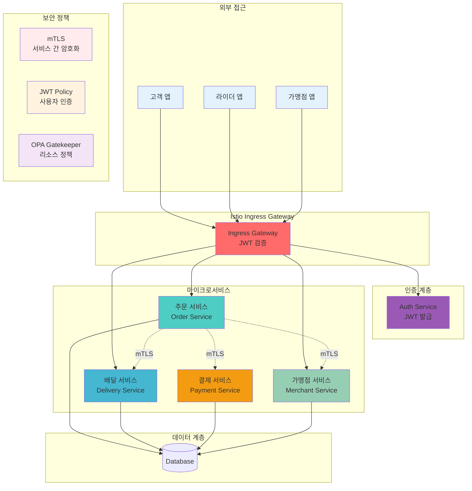

# Week 4 Day 3 Challenge 1: 배달 플랫폼 보안 장애 복구

<div align="center">

**🚨 긴급 장애** • **🔍 보안 진단** • **🛠️ 신속 복구**

*배달의민족 스타일 마이크로서비스 보안 장애 시나리오*

</div>

---

## 🕘 Challenge 정보
**시간**: 16:00-17:30 (90분)  
**목표**: 실무 보안 장애 진단 및 해결  
**방식**: 문제 배포 → 진단 → 해결 → 검증  
**난이도**: ⭐⭐⭐⭐ (고급)

---

## 🎯 Challenge 목표

### 📚 학습 목표
- **보안 정책 디버깅**: mTLS, JWT, OPA 정책 오류 진단
- **시스템 장애 분석**: 로그 분석 및 근본 원인 파악
- **신속한 복구**: 제한 시간 내 서비스 정상화

### 🛠️ 실무 역량
- **장애 대응 프로세스**: 체계적 문제 해결 방법론
- **보안 정책 검증**: 정책 적용 및 테스트
- **팀 협업**: 역할 분담 및 효율적 커뮤니케이션

---

## 🚨 Challenge 시나리오: "배달 플랫폼 보안 장애"

### 📖 배경 상황

**시나리오**: 
배달 플랫폼 "DeliveryHub"가 새로운 보안 정책을 적용한 후 여러 서비스에서 장애가 발생했습니다.
- 고객 주문이 처리되지 않음
- 라이더 앱에서 배달 정보 조회 실패
- 결제 서비스 연동 오류
- 가맹점 관리 시스템 접근 불가

보안팀이 적용한 mTLS, JWT, OPA Gatekeeper 정책에 문제가 있는 것으로 추정됩니다.
DevOps 엔지니어로서 신속하게 문제를 진단하고 해결해야 합니다.

**긴급도**: 🔴 **Critical** (서비스 중단)  
**영향도**: 💰 **High** (전체 주문 처리 불가)  
**제한시간**: ⏰ **90분**

---

## 🏗️ 전체 아키텍처



---

## 🔧 Challenge 환경 배포

### Step 1: 클러스터 및 모니터링 설치
```bash
cd theory/week_04/day3/lab_scripts/challenge1
./setup-cluster.sh
```

**설치 내용**:
- Kind 클러스터 (1 control-plane + 2 worker)
- Metrics Server
- Prometheus (모니터링)
- Grafana (시각화)
- Istio Service Mesh
- OPA Gatekeeper

**예상 시간**: 5-7분

### Step 2: 문제 시스템 배포
```bash
./deploy-broken-services.sh
```

**배포 내용**:
- Auth Service (JWT 발급)
- Order Service (주문 처리)
- Delivery Service (배달 관리)
- Payment Service (결제 처리)
- Merchant Service (가맹점 관리)

**포함된 문제**:
- 시나리오 1: mTLS PERMISSIVE 설정 오류
- 시나리오 2: JWT issuer 불일치
- 시나리오 3: OPA 리소스 제한 누락
- 시나리오 4: Service 연결 실패

---

## 🚨 문제 상황 1: mTLS 통신 실패 (25분)

### 증상
```bash
# Order Service에서 Payment Service 호출 실패
kubectl logs -n delivery-platform deployment/order-service
```

**에러 메시지**:
```
upstream connect error or disconnect/reset before headers. reset reason: connection failure
```

### 🔍 진단 과정

**1단계: Pod 상태 확인**
```bash
kubectl get pods -n delivery-platform
kubectl get peerauthentication -n delivery-platform
```

**2단계: mTLS 설정 확인**
```bash
kubectl describe peerauthentication -n delivery-platform
istioctl proxy-config secret deployment/order-service -n delivery-platform
```

**3단계: 서비스 간 통신 테스트**
```bash
kubectl exec -it deployment/order-service -n delivery-platform -c order -- \
  curl -v http://payment-service:8080/health
```

### 💡 힌트
- PeerAuthentication의 mTLS 모드 확인
- DestinationRule의 TLS 설정 확인
- 서비스 간 인증서 발급 상태 확인

**문제 파일**: [broken-scenario1.yaml](./lab_scripts/challenge1/broken-scenario1.yaml)

---

## 🚨 문제 상황 2: JWT 인증 실패 (25분)

### 증상
```bash
# 고객 앱에서 주문 생성 시 401 Unauthorized
curl -X POST http://localhost:30080/api/orders \
  -H "Authorization: Bearer $TOKEN" \
  -H "Content-Type: application/json" \
  -d '{"item":"치킨","quantity":1}'
```

**에러 메시지**:
```
Jwt issuer is not configured
```

### 🔍 진단 과정

**1단계: JWT 토큰 발급 확인**
```bash
# Auth Service에서 토큰 발급
kubectl exec -it deployment/auth-service -n delivery-platform -c auth -- \
  python3 -c "import urllib.request, json; ..."
```

**2단계: RequestAuthentication 확인**
```bash
kubectl get requestauthentication -n delivery-platform
kubectl describe requestauthentication jwt-auth -n delivery-platform
```

**3단계: JWT 토큰 디코딩**
```bash
echo $TOKEN | cut -d'.' -f2 | base64 -d | jq
```

### 💡 힌트
- RequestAuthentication의 issuer 설정 확인
- jwksUri 엔드포인트 접근 가능 여부 확인
- JWT 토큰의 issuer 클레임 확인

**문제 파일**: [broken-scenario2.yaml](./lab_scripts/challenge1/broken-scenario2.yaml)

---

## 🚨 문제 상황 3: OPA 정책 위반 (20분)

### 증상
```bash
# Delivery Service Pod 생성 실패
kubectl get pods -n delivery-platform | grep delivery
```

**에러 메시지**:
```
Error from server (Forbidden): admission webhook "validation.gatekeeper.sh" denied the request
```

### 🔍 진단 과정

**1단계: Gatekeeper 정책 확인**
```bash
kubectl get constraints -n delivery-platform
kubectl describe k8scontainerresourcelimits require-resource-limits
```

**2단계: Pod 스펙 확인**
```bash
kubectl get deployment delivery-service -n delivery-platform -o yaml | grep -A 10 resources
```

**3단계: 정책 위반 상세 확인**
```bash
kubectl get k8scontainerresourcelimits require-resource-limits -o yaml | grep -A 20 violations
```

### 💡 힌트
- Deployment의 resources 설정 확인
- Constraint의 enforcementAction 확인
- 정책 요구사항과 실제 설정 비교

**문제 파일**: [broken-scenario3.yaml](./lab_scripts/challenge1/broken-scenario3.yaml)

---

## 🚨 문제 상황 4: Authorization Policy 오류 (20분)

### 증상
```bash
# Merchant Service 접근 거부
kubectl logs -n delivery-platform deployment/order-service | grep merchant
```

**에러 메시지**:
```
RBAC: access denied
```

### 🔍 진단 과정

**1단계: AuthorizationPolicy 확인**
```bash
kubectl get authorizationpolicy -n delivery-platform
kubectl describe authorizationpolicy merchant-policy -n delivery-platform
```

**2단계: ServiceAccount 확인**
```bash
kubectl get serviceaccount -n delivery-platform
kubectl get pod -n delivery-platform -o yaml | grep serviceAccountName
```

**3단계: 정책 테스트**
```bash
kubectl exec -it deployment/order-service -n delivery-platform -c order -- \
  curl -v http://merchant-service:8080/api/stores
```

### 💡 힌트
- AuthorizationPolicy의 principals 설정 확인
- ServiceAccount 이름 일치 여부 확인
- 네임스페이스 포함 전체 principal 형식 확인

**문제 파일**: [broken-scenario4.yaml](./lab_scripts/challenge1/broken-scenario4.yaml)

---

## ✅ 해결 검증

### 자동 검증 스크립트
```bash
./verify-solution.sh
```

### 수동 검증 체크리스트

**✅ 시나리오 1: mTLS 통신**
```bash
# Order → Payment 통신 확인
kubectl exec -it deployment/order-service -n delivery-platform -c order -- \
  curl -s http://payment-service:8080/health | grep OK
```

**✅ 시나리오 2: JWT 인증**
```bash
# JWT 토큰으로 주문 생성
TOKEN=$(kubectl exec -n delivery-platform deployment/auth-service -c auth -- \
  python3 -c "..." | grep -o 'eyJ[^"]*')
curl -H "Authorization: Bearer $TOKEN" http://localhost:30080/api/orders
```

**✅ 시나리오 3: OPA 정책**
```bash
# Delivery Service Pod Running 확인
kubectl get pods -n delivery-platform | grep delivery-service | grep Running
```

**✅ 시나리오 4: Authorization Policy**
```bash
# Order → Merchant 통신 확인
kubectl exec -it deployment/order-service -n delivery-platform -c order -- \
  curl -s http://merchant-service:8080/api/stores | grep stores
```

---

## 🎯 성공 기준

### 📊 기능적 요구사항
- [ ] 모든 서비스 Pod가 Running 상태
- [ ] mTLS 서비스 간 통신 성공
- [ ] JWT 인증을 통한 API 접근 성공
- [ ] OPA 정책 준수하는 Pod 배포 성공
- [ ] Authorization Policy에 따른 접근 제어 동작

### ⏱️ 성능 요구사항
- [ ] API 응답 시간 < 500ms
- [ ] 서비스 간 통신 지연 < 100ms
- [ ] Pod 재시작 없음 (RESTARTS = 0)

### 🔒 보안 요구사항
- [ ] mTLS STRICT 모드 적용
- [ ] JWT 토큰 검증 성공
- [ ] 리소스 제한 정책 적용
- [ ] 최소 권한 원칙 준수

---

## 🏆 도전 과제 (보너스)

### 고급 문제 해결 (+20점)
1. **Grafana 대시보드**: 서비스 메트릭 시각화
2. **분산 추적**: Jaeger로 요청 흐름 추적
3. **자동 복구**: Liveness/Readiness Probe 최적화
4. **성능 최적화**: 리소스 사용량 20% 절감

### 창의적 해결책 (+10점)
1. **모니터링 알림**: Prometheus AlertManager 설정
2. **보안 강화**: Network Policy 추가 적용
3. **문서화**: 장애 대응 플레이북 작성

---

## 💡 문제 해결 가이드

### 🔍 체계적 진단 방법
1. **증상 파악**: 에러 메시지 및 로그 수집
2. **범위 축소**: 문제 발생 지점 특정
3. **가설 수립**: 가능한 원인 나열
4. **검증**: 각 가설 테스트
5. **해결**: 근본 원인 제거
6. **확인**: 정상 동작 검증

### 🛠️ 유용한 디버깅 명령어
```bash
# Pod 상태 확인
kubectl get pods -n delivery-platform
kubectl describe pod [pod-name] -n delivery-platform

# 로그 확인
kubectl logs -n delivery-platform deployment/[service-name]
kubectl logs -n delivery-platform deployment/[service-name] -c istio-proxy

# Istio 설정 확인
istioctl proxy-status
istioctl proxy-config cluster deployment/[service-name] -n delivery-platform

# 정책 확인
kubectl get peerauthentication,destinationrule,requestauthentication,authorizationpolicy -n delivery-platform

# Gatekeeper 확인
kubectl get constraints
kubectl describe constrainttemplate [template-name]

# 서비스 통신 테스트
kubectl exec -it deployment/[service-name] -n delivery-platform -c [container] -- curl -v [url]
```

### 📋 문제 해결 체크리스트
- [ ] 모든 Pod가 2/2 Ready 상태인가?
- [ ] Istio Sidecar가 주입되었는가?
- [ ] mTLS 인증서가 발급되었는가?
- [ ] JWT 토큰이 유효한가?
- [ ] 정책 설정이 올바른가?
- [ ] ServiceAccount가 올바르게 설정되었는가?

---

## 🤝 팀워크 가이드

### 👥 역할 분담 제안
- **보안 전문가**: mTLS, JWT 정책 분석
- **네트워크 엔지니어**: 서비스 간 통신 디버깅
- **정책 관리자**: OPA Gatekeeper 정책 검증
- **모니터링 담당**: Prometheus/Grafana 메트릭 분석

### 🔄 협업 프로세스
1. **문제 분담**: 4개 시나리오를 팀원에게 분배
2. **병렬 진단**: 각자 담당 문제 분석
3. **정보 공유**: 발견 사항 실시간 공유
4. **통합 검증**: 전체 시스템 동작 확인

---

## 🧹 Challenge 정리
```bash
./cleanup.sh
```

---

## 💡 Challenge 회고

### 🤝 팀 회고 (15분)
1. **가장 어려웠던 문제**: 어떤 시나리오가 가장 도전적이었나요?
2. **효과적인 디버깅 방법**: 어떤 접근법이 가장 유용했나요?
3. **팀워크 경험**: 협업이 문제 해결에 어떻게 도움이 되었나요?
4. **실무 적용 방안**: 실제 업무에서 어떻게 활용할 수 있을까요?

### 📊 학습 성과
- **보안 정책 디버깅**: mTLS, JWT, OPA 정책 오류 진단 능력
- **시스템 사고**: 마이크로서비스 전체 흐름 이해
- **문제 해결 속도**: 체계적 접근으로 신속한 해결
- **실무 역량**: 실제 장애 대응 경험

### 🔗 실무 연계
- **장애 대응**: 실제 프로덕션 장애 시 적용 가능한 프로세스
- **보안 강화**: 보안 정책 설계 및 검증 방법론
- **모니터링**: 문제 조기 발견을 위한 관측성 구축

---

<div align="center">

**🚨 실무 장애** • **🔍 체계적 진단** • **🛠️ 신속 복구** • **🎯 팀 협업**

*Challenge를 통한 실전 대응 능력 강화*

</div>
