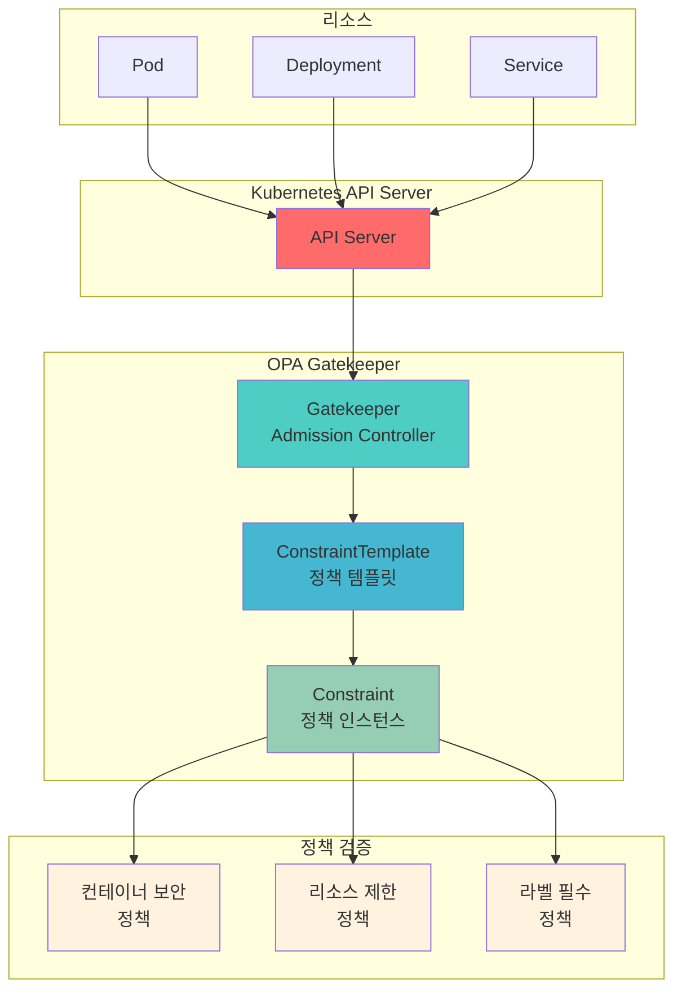

# Week 4 Day 3 Hands-on 1: OPA Gatekeeper 정책 엔진

<div align="center">

**⚖️ Policy as Code** • **🔒 정책 자동화** • **🛡️ 컴플라이언스**

*Lab 1 기반 고급 정책 엔진 구축*

</div>

---

## 🕘 실습 정보
**시간**: 15:00-15:50 (50분)  
**목표**: OPA Gatekeeper를 통한 정책 기반 보안 강화  
**방식**: 직접 코드 작성 및 실행  
**전제조건**: 없음 (독립 실습)

---

## 🎯 실습 목표

### 📚 학습 목표
- OPA Gatekeeper 아키텍처 이해
- ConstraintTemplate과 Constraint 작성
- Rego 정책 언어 기초 학습
- 정책 위반 시나리오 테스트

### 🛠️ 구현 목표
- Gatekeeper 설치 및 구성
- 컨테이너 보안 정책 구현
- 리소스 제한 정책 적용
- 정책 위반 감지 및 차단

---

## 🏗️ 전체 아키텍처



---

## 🛠️ Step 0: 클러스터 초기화 (5분)

### 📝 직접 작성하기

**0-1. 기존 클러스터 삭제**
```bash
kind delete cluster --name lab-cluster
```

**0-2. 새 클러스터 생성**
```bash
cat <<EOF | kind create cluster --config=-
kind: Cluster
apiVersion: kind.x-k8s.io/v1alpha4
name: lab-cluster
nodes:
- role: control-plane
  extraPortMappings:
  - containerPort: 30080
    hostPort: 30080
    protocol: TCP
  - containerPort: 30081
    hostPort: 30081
    protocol: TCP
  - containerPort: 30082
    hostPort: 30082
    protocol: TCP
  - containerPort: 443
    hostPort: 443
    protocol: TCP
  - containerPort: 80
    hostPort: 80
    protocol: TCP
- role: worker
- role: worker
EOF
```

**0-3. 클러스터 확인**
```bash
kubectl get nodes
```

### 📊 예상 결과
```
NAME                        STATUS   ROLES           AGE   VERSION
lab-cluster-control-plane   Ready    control-plane   1m    v1.27.3
lab-cluster-worker          Ready    <none>          1m    v1.27.3
lab-cluster-worker2         Ready    <none>          1m    v1.27.3
```

**0-4. secure-app 네임스페이스 생성**
```bash
kubectl create namespace secure-app
```

### 💡 설명
- **3-node 클러스터**: 1 control-plane + 2 worker
- **포트 매핑**: 30080-30082, 443, 80
- **secure-app**: Lab 1과 동일한 네임스페이스 사용

---

## 🛠️ Step 1: OPA Gatekeeper 설치 (10분)

### 📝 직접 작성하기

**1-1. Gatekeeper 설치**
```bash
# Gatekeeper 최신 버전 설치
kubectl apply -f https://raw.githubusercontent.com/open-policy-agent/gatekeeper/master/deploy/gatekeeper.yaml
```

**1-2. 설치 확인**
```bash
# Gatekeeper 네임스페이스 확인
kubectl get namespace gatekeeper-system

# Gatekeeper Pod 상태 확인
kubectl get pods -n gatekeeper-system

# Webhook 설정 확인
kubectl get validatingwebhookconfigurations | grep gatekeeper
```

### 📊 예상 결과
```
NAME                                         READY   STATUS    RESTARTS   AGE
gatekeeper-audit-7d9f8b5c4d-x7k2m           1/1     Running   0          30s
gatekeeper-controller-manager-0              1/1     Running   0          30s
gatekeeper-controller-manager-1              1/1     Running   0          30s
gatekeeper-controller-manager-2              1/1     Running   0          30s
```

### 💡 개념 설명
- **Gatekeeper**: Kubernetes Admission Controller로 동작
- **Audit**: 기존 리소스의 정책 위반 검사
- **Controller Manager**: 정책 검증 및 적용
- **Webhook**: API Server와 통합하여 리소스 생성 시 검증

---

## 🛠️ Step 2: 컨테이너 보안 정책 (15분)

### 📝 직접 작성하기

**2-1. ConstraintTemplate 작성 - 권한 상승 금지**
```bash
cat <<EOF > container-no-privilege-escalation.yaml
apiVersion: templates.gatekeeper.sh/v1
kind: ConstraintTemplate
metadata:
  name: k8scontainernoprivilegeescalation
  annotations:
    description: "컨테이너의 권한 상승을 금지합니다"
spec:
  crd:
    spec:
      names:
        kind: K8sContainerNoPrivilegeEscalation
  targets:
    - target: admission.k8s.gatekeeper.sh
      rego: |
        package k8scontainernoprivilegeescalation

        violation[{"msg": msg}] {
          container := input.review.object.spec.containers[_]
          not has_field(container, "securityContext")
          msg := sprintf("컨테이너 '%v'에 securityContext가 없습니다", [container.name])
        }

        violation[{"msg": msg}] {
          container := input.review.object.spec.containers[_]
          container.securityContext.allowPrivilegeEscalation == true
          msg := sprintf("컨테이너 '%v'에서 권한 상승이 허용되어 있습니다", [container.name])
        }

        has_field(obj, field) {
          obj[field]
        }
EOF

kubectl apply -f container-no-privilege-escalation.yaml
```

**2-2. Constraint 생성 - 정책 적용**
```bash
cat <<EOF > require-no-privilege-escalation.yaml
apiVersion: constraints.gatekeeper.sh/v1beta1
kind: K8sContainerNoPrivilegeEscalation
metadata:
  name: require-no-privilege-escalation
spec:
  match:
    kinds:
      - apiGroups: [""]
        kinds: ["Pod"]
    namespaces:
      - "secure-app"
  enforcementAction: deny
EOF

kubectl apply -f require-no-privilege-escalation.yaml
```

**2-3. 정책 테스트 - 위반 케이스**
```bash
# 권한 상승을 허용하는 Pod 생성 시도 (실패해야 함)
cat <<EOF > bad-pod.yaml
apiVersion: v1
kind: Pod
metadata:
  name: bad-pod
  namespace: secure-app
spec:
  containers:
  - name: nginx
    image: nginx:alpine
    securityContext:
      allowPrivilegeEscalation: true
EOF

kubectl apply -f bad-pod.yaml
```

### 📊 예상 결과
```
Error from server (Forbidden): error when creating "bad-pod.yaml": 
admission webhook "validation.gatekeeper.sh" denied the request: 
[require-no-privilege-escalation] 컨테이너 'nginx'에서 권한 상승이 허용되어 있습니다
```

**2-4. 정책 준수 케이스**
```bash
# 권한 상승을 금지하는 Pod 생성 (성공해야 함)
cat <<EOF > good-pod.yaml
apiVersion: v1
kind: Pod
metadata:
  name: good-pod
  namespace: secure-app
spec:
  containers:
  - name: nginx
    image: nginx:alpine
    securityContext:
      allowPrivilegeEscalation: false
      runAsNonRoot: true
      runAsUser: 1000
EOF

kubectl apply -f good-pod.yaml
kubectl get pod good-pod -n secure-app
```

### 💡 코드 설명
- **ConstraintTemplate**: 재사용 가능한 정책 템플릿
- **Rego 언어**: OPA의 정책 언어 (선언적)
- **violation**: 정책 위반 조건 정의
- **Constraint**: 템플릿을 특정 리소스에 적용
- **enforcementAction**: deny (차단) 또는 dryrun (경고만)

---

## 🛠️ Step 3: 리소스 제한 정책 (15분)

### 📝 직접 작성하기

**3-1. ConstraintTemplate - 리소스 제한 필수**
```bash
cat <<EOF > container-resource-limits.yaml
apiVersion: templates.gatekeeper.sh/v1
kind: ConstraintTemplate
metadata:
  name: k8scontainerresourcelimits
  annotations:
    description: "모든 컨테이너에 리소스 제한을 강제합니다"
spec:
  crd:
    spec:
      names:
        kind: K8sContainerResourceLimits
      validation:
        openAPIV3Schema:
          type: object
          properties:
            cpu:
              type: string
            memory:
              type: string
  targets:
    - target: admission.k8s.gatekeeper.sh
      rego: |
        package k8scontainerresourcelimits

        violation[{"msg": msg}] {
          container := input.review.object.spec.containers[_]
          not container.resources.limits.cpu
          msg := sprintf("컨테이너 '%v'에 CPU 제한이 없습니다", [container.name])
        }

        violation[{"msg": msg}] {
          container := input.review.object.spec.containers[_]
          not container.resources.limits.memory
          msg := sprintf("컨테이너 '%v'에 메모리 제한이 없습니다", [container.name])
        }

        violation[{"msg": msg}] {
          container := input.review.object.spec.containers[_]
          not container.resources.requests.cpu
          msg := sprintf("컨테이너 '%v'에 CPU 요청이 없습니다", [container.name])
        }

        violation[{"msg": msg}] {
          container := input.review.object.spec.containers[_]
          not container.resources.requests.memory
          msg := sprintf("컨테이너 '%v'에 메모리 요청이 없습니다", [container.name])
        }
EOF

kubectl apply -f container-resource-limits.yaml
```

**3-2. Constraint 생성**
```bash
cat <<EOF > require-resource-limits.yaml
apiVersion: constraints.gatekeeper.sh/v1beta1
kind: K8sContainerResourceLimits
metadata:
  name: require-resource-limits
spec:
  match:
    kinds:
      - apiGroups: ["apps"]
        kinds: ["Deployment", "StatefulSet"]
    namespaces:
      - "secure-app"
  parameters:
    cpu: "1000m"
    memory: "1Gi"
EOF

kubectl apply -f require-resource-limits.yaml
```

**3-3. 정책 테스트**
```bash
# 리소스 제한 없는 Deployment (실패)
cat <<EOF > bad-deployment.yaml
apiVersion: apps/v1
kind: Deployment
metadata:
  name: bad-deployment
  namespace: secure-app
spec:
  replicas: 1
  selector:
    matchLabels:
      app: test
  template:
    metadata:
      labels:
        app: test
    spec:
      containers:
      - name: nginx
        image: nginx:alpine
EOF

kubectl apply -f bad-deployment.yaml
```

### 📊 예상 결과
```
Error from server (Forbidden): error when creating "bad-deployment.yaml": 
admission webhook "validation.gatekeeper.sh" denied the request: 
[require-resource-limits] 컨테이너 'nginx'에 CPU 제한이 없습니다
[require-resource-limits] 컨테이너 'nginx'에 메모리 제한이 없습니다
```

**3-4. 올바른 Deployment**
```bash
cat <<EOF > good-deployment.yaml
apiVersion: apps/v1
kind: Deployment
metadata:
  name: good-deployment
  namespace: secure-app
spec:
  replicas: 1
  selector:
    matchLabels:
      app: test
  template:
    metadata:
      labels:
        app: test
    spec:
      containers:
      - name: nginx
        image: nginx:alpine
        resources:
          requests:
            cpu: 100m
            memory: 128Mi
          limits:
            cpu: 500m
            memory: 512Mi
        securityContext:
          allowPrivilegeEscalation: false
          runAsNonRoot: true
          runAsUser: 1000
EOF

kubectl apply -f good-deployment.yaml
kubectl get deployment good-deployment -n secure-app
```

### 💡 코드 설명
- **resources.requests**: 최소 보장 리소스
- **resources.limits**: 최대 사용 리소스
- **CPU 단위**: m (밀리코어), 1000m = 1 CPU
- **메모리 단위**: Mi (메비바이트), Gi (기비바이트)
- **정책 조합**: 보안 + 리소스 정책 동시 적용

---

## 🛠️ Step 4: 정책 감사 및 모니터링 (10분)

### 📝 직접 작성하기

**4-1. 기존 리소스 감사**
```bash
# Gatekeeper Audit 결과 확인
kubectl get constraints

# 특정 Constraint 상세 확인
kubectl describe k8scontainernoprivilegeescalation require-no-privilege-escalation

# 위반 사항 확인
kubectl get k8scontainernoprivilegeescalation require-no-privilege-escalation -o yaml | grep -A 10 violations
```

**4-2. 정책 위반 리포트**
```bash
# 모든 정책 위반 요약
cat <<'SCRIPT' > audit-report.sh
#!/bin/bash

echo "=== OPA Gatekeeper 정책 감사 리포트 ==="
echo ""

echo "1. 설치된 ConstraintTemplate:"
kubectl get constrainttemplates

echo ""
echo "2. 활성화된 Constraint:"
kubectl get constraints --all-namespaces

echo ""
echo "3. 정책 위반 상세:"
for constraint in $(kubectl get constraints -o name); do
  echo "--- $constraint ---"
  kubectl get $constraint -o jsonpath='{.status.totalViolations}' 2>/dev/null
  echo " violations"
done

echo ""
echo "=== 감사 완료 ==="
SCRIPT

chmod +x audit-report.sh
./audit-report.sh
```

**4-3. 정책 예외 처리**
```bash
# 특정 네임스페이스 제외
cat <<EOF > constraint-with-exclusion.yaml
apiVersion: constraints.gatekeeper.sh/v1beta1
kind: K8sContainerNoPrivilegeEscalation
metadata:
  name: require-no-privilege-escalation-with-exclusion
spec:
  match:
    kinds:
      - apiGroups: [""]
        kinds: ["Pod"]
    namespaces:
      - "secure-app"
    excludedNamespaces:
      - "kube-system"
      - "gatekeeper-system"
  enforcementAction: deny
EOF

kubectl apply -f constraint-with-exclusion.yaml
```

### 📊 예상 결과
```
=== OPA Gatekeeper 정책 감사 리포트 ===

1. 설치된 ConstraintTemplate:
NAME                                    AGE
k8scontainernoprivilegeescalation      5m
k8scontainerresourcelimits             3m

2. 활성화된 Constraint:
NAME                                    ENFORCEMENT-ACTION   TOTAL-VIOLATIONS
require-no-privilege-escalation        deny                  0
require-resource-limits                deny                  0

3. 정책 위반 상세:
--- k8scontainernoprivilegeescalation/require-no-privilege-escalation ---
0 violations
--- k8scontainerresourcelimits/require-resource-limits ---
0 violations

=== 감사 완료 ===
```

### 💡 코드 설명
- **Audit**: 주기적으로 기존 리소스 검사
- **totalViolations**: 정책 위반 총 개수
- **excludedNamespaces**: 시스템 네임스페이스 제외
- **enforcementAction**: deny (차단) vs dryrun (경고)

---

## ✅ 실습 체크포인트

### ✅ Step 0: 클러스터 초기화
- [ ] 기존 클러스터 삭제 완료
- [ ] 새 클러스터 생성 (1 control-plane + 2 worker)
- [ ] 포트 매핑 확인 (30080-30082, 443, 80)
- [ ] secure-app 네임스페이스 생성

### ✅ Step 1: Gatekeeper 설치
- [ ] Gatekeeper Pod 3개 Running 상태
- [ ] ValidatingWebhookConfiguration 생성 확인
- [ ] gatekeeper-system 네임스페이스 생성

### ✅ Step 2: 컨테이너 보안 정책
- [ ] ConstraintTemplate 생성 완료
- [ ] Constraint 적용 완료
- [ ] 권한 상승 허용 Pod 차단 확인
- [ ] 정책 준수 Pod 생성 성공

### ✅ Step 3: 리소스 제한 정책
- [ ] 리소스 제한 ConstraintTemplate 생성
- [ ] Constraint 적용 완료
- [ ] 리소스 제한 없는 Deployment 차단
- [ ] 올바른 Deployment 생성 성공

### ✅ Step 4: 정책 감사
- [ ] Audit 리포트 생성 성공
- [ ] 정책 위반 사항 확인
- [ ] 예외 처리 설정 완료

---

## 🔍 트러블슈팅

### 문제 1: Gatekeeper Pod가 시작되지 않음
```bash
# 증상
gatekeeper-controller-manager-0   0/1     CrashLoopBackOff

# 원인 확인
kubectl logs -n gatekeeper-system gatekeeper-controller-manager-0

# 해결: 리소스 부족 시 노드 확인
kubectl describe node
```

### 문제 2: 정책이 적용되지 않음
```bash
# Constraint 상태 확인
kubectl get constraint require-no-privilege-escalation -o yaml

# Webhook 설정 확인
kubectl get validatingwebhookconfigurations gatekeeper-validating-webhook-configuration -o yaml

# Gatekeeper 로그 확인
kubectl logs -n gatekeeper-system deployment/gatekeeper-controller-manager
```

### 문제 3: Rego 정책 오류
```bash
# ConstraintTemplate 상태 확인
kubectl describe constrainttemplate k8scontainernoprivilegeescalation

# 문법 오류 확인
# status.byPod 섹션에서 오류 메시지 확인
```

---

## 🧹 실습 정리

```bash
# 1. 생성한 리소스 삭제
kubectl delete pod good-pod -n secure-app 2>/dev/null
kubectl delete deployment good-deployment -n secure-app 2>/dev/null

# 2. Constraint 삭제
kubectl delete k8scontainernoprivilegeescalation --all
kubectl delete k8scontainerresourcelimits --all

# 3. ConstraintTemplate 삭제
kubectl delete constrainttemplate k8scontainernoprivilegeescalation
kubectl delete constrainttemplate k8scontainerresourcelimits

# 4. Gatekeeper 삭제
kubectl delete -f https://raw.githubusercontent.com/open-policy-agent/gatekeeper/master/deploy/gatekeeper.yaml

# 5. 네임스페이스 삭제
kubectl delete namespace secure-app

# 6. 클러스터 삭제
kind delete cluster --name lab-cluster

# 7. 생성한 파일 정리
rm -f *.yaml *.sh
```

---

## 💡 실습 회고

### 🤝 페어 회고 (5분)
1. **Policy as Code**: 정책을 코드로 관리하는 장점은?
2. **Rego 언어**: 선언적 정책 언어의 학습 곡선은?
3. **실무 적용**: 어떤 정책을 우선 적용하고 싶은가?
4. **Lab 1 연계**: mTLS/JWT와 Gatekeeper의 시너지는?

### 📊 학습 성과
- **정책 자동화**: 수동 검토 → 자동 검증
- **컴플라이언스**: PCI-DSS, GDPR 등 규정 준수
- **보안 강화**: 컨테이너 보안 정책 적용
- **운영 효율**: 정책 위반 사전 차단

### 🔗 실무 적용 시나리오
- **금융권**: PCI-DSS 컴플라이언스 자동화
- **의료**: HIPAA 규정 준수 검증
- **공공**: 보안 가이드라인 강제 적용
- **스타트업**: 초기부터 보안 정책 내재화

---

<div align="center">

**⚖️ Policy as Code** • **🔒 자동 검증** • **🛡️ 컴플라이언스** • **🚀 운영 효율**

*정책 기반 보안의 완성*

</div>
