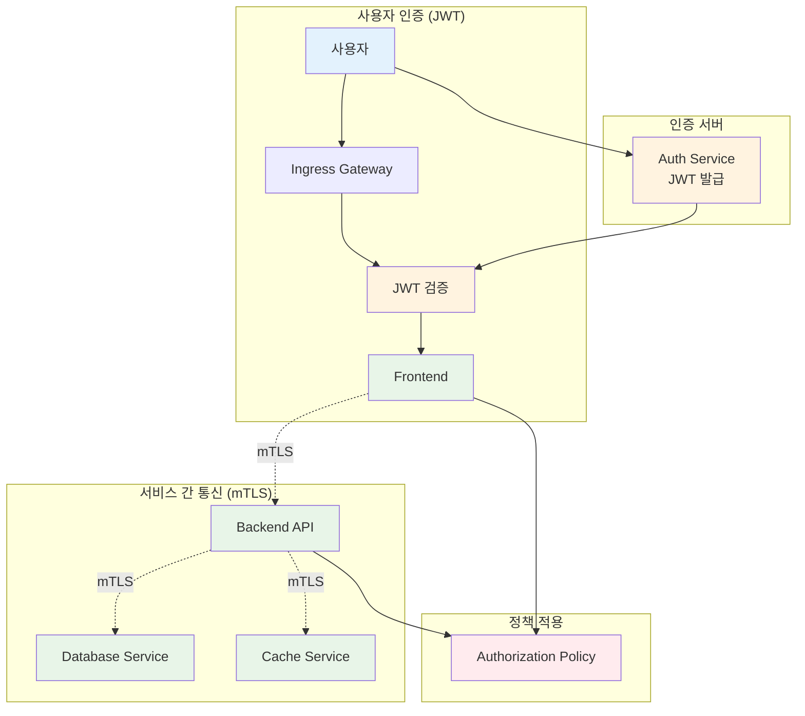

# Week 4 Day 3 Lab 1: mTLS + JWT 통합 인증

<div align="center">

**🔒 Istio mTLS** • **🎫 JWT 인증** • **🔐 통합 보안**

*서비스 간 안전한 통신 구현*

</div>

---

## 🕘 실습 정보
**시간**: 12:00-12:50 (50분)  
**목표**: Istio mTLS와 JWT를 통합한 인증 시스템 구축  
**방식**: 단계별 구현 + 검증

---

## 🎯 실습 목표

### 📚 학습 목표
- Istio mTLS 자동 구성 이해
- JWT 토큰 기반 사용자 인증 구현
- 서비스 간 인증/인가 통합
- 보안 통신 검증 및 테스트

### 🛠️ 구현 목표
- mTLS STRICT 모드 적용
- JWT 발급 및 검증 서비스 구축
- Authorization Policy 설정
- 통합 인증 시스템 완성

---

## 🏗️ 전체 아키텍처



---

## 🛠️ Step 1: Istio 설치 및 mTLS 구성 (15분)

### Step 1-1: Istio 설치

```bash
# Istio 다운로드
curl -L https://istio.io/downloadIstio | sh -
cd istio-*
export PATH=$PWD/bin:$PATH

# Istio 설치 (demo 프로파일)
istioctl install --set profile=demo -y

# 네임스페이스에 Istio 자동 주입 활성화
kubectl create namespace secure-app
kubectl label namespace secure-app istio-injection=enabled
```

### Step 1-2: mTLS STRICT 모드 설정

```yaml
# mtls-strict.yaml
apiVersion: security.istio.io/v1beta1
kind: PeerAuthentication
metadata:
  name: default
  namespace: istio-system
spec:
  mtls:
    mode: STRICT  # 모든 서비스 간 mTLS 필수

---
# 네임스페이스별 mTLS 설정
apiVersion: security.istio.io/v1beta1
kind: PeerAuthentication
metadata:
  name: default
  namespace: secure-app
spec:
  mtls:
    mode: STRICT
```

```bash
# mTLS 정책 적용
kubectl apply -f mtls-strict.yaml

# 확인
kubectl get peerauthentication -A
```

### Step 1-3: mTLS 동작 확인

```bash
# 테스트 Pod 배포
kubectl run test-pod --image=curlimages/curl -n secure-app -- sleep 3600

# mTLS 인증서 확인
kubectl exec -it test-pod -n secure-app -- sh
ls /etc/certs/  # Istio가 자동 주입한 인증서

# 인증서 정보 확인
openssl x509 -in /etc/certs/cert-chain.pem -text -noout
```

---

## 🛠️ Step 2: JWT 인증 서비스 구축 (15분)

### Step 2-1: 간단한 JWT 발급 서비스

```python
# auth-service.py
from flask import Flask, request, jsonify
import jwt
import datetime

app = Flask(__name__)
SECRET_KEY = "your-secret-key-change-in-production"

@app.route('/login', methods=['POST'])
def login():
    data = request.get_json()
    username = data.get('username')
    password = data.get('password')
    
    # 실제로는 데이터베이스 검증 필요
    if username == "admin" and password == "password":
        token = jwt.encode({
            'sub': username,
            'iss': 'https://auth.example.com',
            'aud': 'api.example.com',
            'exp': datetime.datetime.utcnow() + datetime.timedelta(minutes=15),
            'iat': datetime.datetime.utcnow(),
            'roles': ['admin', 'user']
        }, SECRET_KEY, algorithm='HS256')
        
        return jsonify({'token': token})
    
    return jsonify({'error': 'Invalid credentials'}), 401

@app.route('/verify', methods=['POST'])
def verify():
    token = request.headers.get('Authorization', '').replace('Bearer ', '')
    
    try:
        payload = jwt.decode(token, SECRET_KEY, algorithms=['HS256'])
        return jsonify({'valid': True, 'payload': payload})
    except jwt.ExpiredSignatureError:
        return jsonify({'valid': False, 'error': 'Token expired'}), 401
    except jwt.InvalidTokenError:
        return jsonify({'valid': False, 'error': 'Invalid token'}), 401

if __name__ == '__main__':
    app.run(host='0.0.0.0', port=8080)
```

### Step 2-2: Auth Service 배포

```yaml
# auth-service-deployment.yaml
apiVersion: apps/v1
kind: Deployment
metadata:
  name: auth-service
  namespace: secure-app
spec:
  replicas: 2
  selector:
    matchLabels:
      app: auth-service
  template:
    metadata:
      labels:
        app: auth-service
        version: v1
    spec:
      containers:
      - name: auth-service
        image: your-registry/auth-service:v1
        ports:
        - containerPort: 8080
        env:
        - name: SECRET_KEY
          valueFrom:
            secretKeyRef:
              name: jwt-secret
              key: secret-key

---
apiVersion: v1
kind: Service
metadata:
  name: auth-service
  namespace: secure-app
spec:
  selector:
    app: auth-service
  ports:
  - port: 8080
    targetPort: 8080
```

```bash
# Secret 생성
kubectl create secret generic jwt-secret \
  --from-literal=secret-key='your-secret-key-change-in-production' \
  -n secure-app

# 배포
kubectl apply -f auth-service-deployment.yaml
```

### Step 2-3: JWT 검증 설정

```yaml
# jwt-authentication.yaml
apiVersion: security.istio.io/v1beta1
kind: RequestAuthentication
metadata:
  name: jwt-auth
  namespace: secure-app
spec:
  selector:
    matchLabels:
      app: frontend
  jwtRules:
  - issuer: "https://auth.example.com"
    jwksUri: "https://auth.example.com/.well-known/jwks.json"
    # 또는 로컬 검증
    audiences:
    - "api.example.com"
```

```bash
kubectl apply -f jwt-authentication.yaml
```

---

## 🛠️ Step 3: Authorization Policy 설정 (10분)

### Step 3-1: 기본 Authorization Policy

```yaml
# authorization-policy.yaml
# 1. 기본 거부 정책
apiVersion: security.istio.io/v1beta1
kind: AuthorizationPolicy
metadata:
  name: deny-all
  namespace: secure-app
spec:
  {}  # 빈 spec = 모든 요청 거부

---
# 2. Frontend 접근 허용
apiVersion: security.istio.io/v1beta1
kind: AuthorizationPolicy
metadata:
  name: allow-frontend
  namespace: secure-app
spec:
  selector:
    matchLabels:
      app: frontend
  action: ALLOW
  rules:
  - from:
    - source:
        principals: ["cluster.local/ns/istio-system/sa/istio-ingressgateway-service-account"]
    to:
    - operation:
        methods: ["GET", "POST"]

---
# 3. Backend API 접근 제어
apiVersion: security.istio.io/v1beta1
kind: AuthorizationPolicy
metadata:
  name: backend-policy
  namespace: secure-app
spec:
  selector:
    matchLabels:
      app: backend
  action: ALLOW
  rules:
  # JWT 토큰이 있는 요청만 허용
  - from:
    - source:
        principals: ["cluster.local/ns/secure-app/sa/frontend"]
    to:
    - operation:
        methods: ["GET", "POST", "PUT", "DELETE"]
    when:
    - key: request.auth.claims[roles]
      values: ["admin", "user"]

---
# 4. Database 접근 제어
apiVersion: security.istio.io/v1beta1
kind: AuthorizationPolicy
metadata:
  name: database-policy
  namespace: secure-app
spec:
  selector:
    matchLabels:
      app: database
  action: ALLOW
  rules:
  - from:
    - source:
        principals: ["cluster.local/ns/secure-app/sa/backend"]
    to:
    - operation:
        methods: ["*"]
```

```bash
kubectl apply -f authorization-policy.yaml
```

### Step 3-2: 역할 기반 접근 제어

```yaml
# rbac-policy.yaml
apiVersion: security.istio.io/v1beta1
kind: AuthorizationPolicy
metadata:
  name: admin-only
  namespace: secure-app
spec:
  selector:
    matchLabels:
      app: backend
  action: ALLOW
  rules:
  - to:
    - operation:
        paths: ["/api/admin/*"]
        methods: ["*"]
    when:
    - key: request.auth.claims[roles]
      values: ["admin"]

---
apiVersion: security.istio.io/v1beta1
kind: AuthorizationPolicy
metadata:
  name: user-read-only
  namespace: secure-app
spec:
  selector:
    matchLabels:
      app: backend
  action: ALLOW
  rules:
  - to:
    - operation:
        paths: ["/api/users/*"]
        methods: ["GET"]
    when:
    - key: request.auth.claims[roles]
      values: ["user"]
```

```bash
kubectl apply -f rbac-policy.yaml
```

---

## 🛠️ Step 4: 통합 테스트 (10분)

### Step 4-1: JWT 토큰 발급 테스트

```bash
# 1. 로그인 및 토큰 발급
TOKEN=$(curl -X POST http://auth-service.secure-app.svc.cluster.local:8080/login \
  -H "Content-Type: application/json" \
  -d '{"username":"admin","password":"password"}' | jq -r '.token')

echo $TOKEN

# 2. 토큰 검증
curl -X POST http://auth-service.secure-app.svc.cluster.local:8080/verify \
  -H "Authorization: Bearer $TOKEN"
```

### Step 4-2: mTLS 통신 검증

```bash
# 1. mTLS 연결 확인
kubectl exec -it test-pod -n secure-app -- \
  curl -v https://backend.secure-app.svc.cluster.local:8080/health

# 2. 인증서 정보 확인
kubectl exec -it test-pod -n secure-app -- \
  openssl s_client -connect backend.secure-app.svc.cluster.local:8080 \
  -showcerts

# 3. mTLS 없이 접근 시도 (실패해야 정상)
kubectl run plain-pod --image=curlimages/curl -- sleep 3600
kubectl exec -it plain-pod -- \
  curl http://backend.secure-app.svc.cluster.local:8080/health
# 예상: 연결 거부
```

### Step 4-3: Authorization Policy 테스트

```bash
# 1. JWT 없이 API 호출 (거부되어야 함)
kubectl exec -it test-pod -n secure-app -- \
  curl -v http://backend.secure-app.svc.cluster.local:8080/api/users

# 예상 응답: 403 Forbidden

# 2. JWT와 함께 API 호출 (허용되어야 함)
kubectl exec -it test-pod -n secure-app -- \
  curl -v http://backend.secure-app.svc.cluster.local:8080/api/users \
  -H "Authorization: Bearer $TOKEN"

# 예상 응답: 200 OK

# 3. Admin 전용 API 테스트
kubectl exec -it test-pod -n secure-app -- \
  curl -v http://backend.secure-app.svc.cluster.local:8080/api/admin/settings \
  -H "Authorization: Bearer $TOKEN"

# 예상 응답: admin 역할이면 200 OK, 아니면 403 Forbidden
```

---

## ✅ 실습 체크포인트

### ✅ mTLS 구성 확인
- [ ] Istio 설치 완료
- [ ] mTLS STRICT 모드 적용
- [ ] 서비스 간 mTLS 통신 확인
- [ ] 인증서 자동 발급 및 갱신 동작

### ✅ JWT 인증 확인
- [ ] Auth Service 배포 완료
- [ ] JWT 토큰 발급 성공
- [ ] JWT 검증 동작 확인
- [ ] RequestAuthentication 적용

### ✅ Authorization Policy 확인
- [ ] 기본 거부 정책 동작
- [ ] 서비스별 접근 제어 적용
- [ ] 역할 기반 권한 검증
- [ ] 정책 위반 시 거부 확인

---

## 🔍 트러블슈팅

### 문제 1: mTLS 연결 실패
```bash
# 증상: connection refused 또는 TLS handshake failed

# 해결:
# 1. PeerAuthentication 확인
kubectl get peerauthentication -A

# 2. Sidecar 주입 확인
kubectl get pod -n secure-app -o jsonpath='{.items[*].spec.containers[*].name}'
# istio-proxy가 있어야 함

# 3. mTLS 모드 확인
istioctl x describe pod <pod-name> -n secure-app
```

### 문제 2: JWT 검증 실패
```bash
# 증상: 401 Unauthorized

# 해결:
# 1. RequestAuthentication 확인
kubectl get requestauthentication -n secure-app -o yaml

# 2. JWT 토큰 디코딩
echo $TOKEN | cut -d'.' -f2 | base64 -d | jq

# 3. 만료 시간 확인
# exp 클레임이 현재 시간보다 미래인지 확인
```

### 문제 3: Authorization Policy 오류
```bash
# 증상: 403 Forbidden

# 해결:
# 1. AuthorizationPolicy 확인
kubectl get authorizationpolicy -n secure-app

# 2. 정책 상세 확인
kubectl get authorizationpolicy backend-policy -n secure-app -o yaml

# 3. 로그 확인
kubectl logs -n secure-app <pod-name> -c istio-proxy
```

---

## 🧹 실습 정리

```bash
# 리소스 삭제
kubectl delete namespace secure-app

# Istio 제거
istioctl uninstall --purge -y
kubectl delete namespace istio-system
```

---

## 💡 실습 회고

### 🤝 페어 회고 (5분)
1. **mTLS 자동화**: Istio의 자동 인증서 관리가 얼마나 편리했나요?
2. **JWT 통합**: JWT와 mTLS를 함께 사용하는 이유는?
3. **정책 관리**: Authorization Policy의 장점과 단점은?

### 📊 학습 성과
- **mTLS 이해**: 서비스 간 자동 암호화 통신
- **JWT 인증**: 토큰 기반 사용자 인증 시스템
- **통합 보안**: 사용자 인증 + 서비스 인증 조합
- **정책 적용**: 세밀한 접근 제어 구현

---

<div align="center">

**🔒 mTLS 자동화** • **🎫 JWT 인증** • **🔐 통합 보안** • **⚖️ 정책 제어**

*서비스 간 안전한 통신의 완성*

</div>
