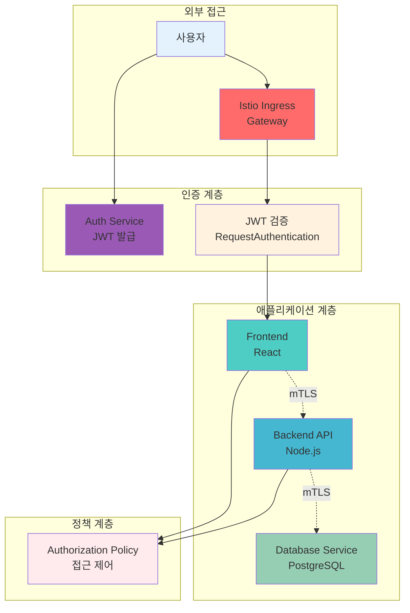
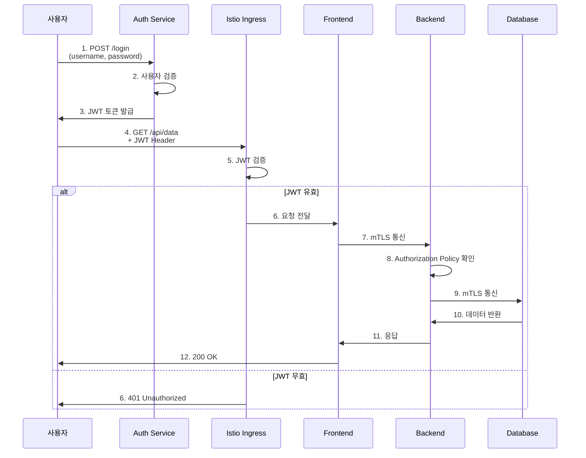

# Week 4 Day 3 Lab 1: mTLS + JWT 통합 인증

<div align="center">

**🔒 Istio mTLS** • **🎫 JWT 인증** • **🔐 통합 보안**

*서비스 간 안전한 통신 구현*

</div>

---

## 🕘 실습 정보
**시간**: 12:00-12:50 (50분)  
**목표**: Istio mTLS와 JWT를 통합한 인증 시스템 구축  
**방식**: 단계별 구현 + 검증

---

## 🎯 실습 목표

### 📚 학습 목표
- Istio mTLS 자동 구성 이해
- JWT 토큰 기반 사용자 인증 구현
- 서비스 간 인증/인가 통합
- 보안 통신 검증 및 테스트

### 🛠️ 구현 목표
- mTLS STRICT 모드 적용
- JWT 발급 및 검증 서비스 구축
- Authorization Policy 설정
- 통합 인증 시스템 완성

---

## 🏗️ 전체 아키텍처



---

## 📋 역할별 상세 설명

### 🔐 인증 서비스 (Auth Service)
```yaml
역할:
- JWT 토큰 발급
- 사용자 인증 (ID/PW)
- 토큰 검증 API 제공

기술:
- Flask (Python)
- PyJWT 라이브러리
- HS256 서명 알고리즘
```

### 🌐 Istio Ingress Gateway
```yaml
역할:
- 외부 트래픽 진입점
- TLS 종료
- JWT 검증 (RequestAuthentication)

기능:
- 인증되지 않은 요청 차단
- 유효한 JWT만 통과
- 로깅 및 모니터링
```

### 🎨 Frontend Service
```yaml
역할:
- 사용자 인터페이스
- JWT 토큰 포함하여 Backend 호출

보안:
- JWT 토큰 필수
- mTLS로 Backend 통신
- Authorization Policy 적용
```

### ⚙️ Backend API Service
```yaml
역할:
- 비즈니스 로직 처리
- 데이터베이스 접근

보안:
- Frontend로부터만 접근 허용
- mTLS 필수
- 최소 권한 원칙
```

---

## 🔄 트래픽 흐름 예시



---

## 🛠️ Step 1: 클러스터 초기화 (5분)

### 🚀 자동화 스크립트 사용
```bash
cd theory/week_04/day3/lab_scripts/lab1
./step1-setup-cluster.sh
```

**📋 스크립트 내용**: [step1-setup-cluster.sh](./lab_scripts/lab1/step1-setup-cluster.sh)

**스크립트 핵심 부분**:
```bash
# 기존 클러스터 삭제
kind delete cluster --name lab-cluster 2>/dev/null || true

# 새 클러스터 생성
cat <<EOF | kind create cluster --config=-
kind: Cluster
apiVersion: kind.x-k8s.io/v1alpha4
name: lab-cluster
nodes:
- role: control-plane
  extraPortMappings:
  - containerPort: 30080
    hostPort: 30080
  # ... 중략 ...
- role: worker
- role: worker
EOF
```

### 📊 예상 결과
```
Creating cluster "lab-cluster" ...
 ✓ Ensuring node image (kindest/node:v1.27.3) 🖼
 ✓ Preparing nodes 📦 📦 📦
 ✓ Writing configuration 📜
 ✓ Starting control-plane 🕹️
 ✓ Installing CNI 🔌
 ✓ Installing StorageClass 💾
 ✓ Joining worker nodes 🚜
Set kubectl context to "kind-lab-cluster"
```

### ✅ 검증
```bash
kubectl get nodes
```

**예상 출력**:
```
NAME                        STATUS   ROLES           AGE   VERSION
lab-cluster-control-plane   Ready    control-plane   1m    v1.27.3
lab-cluster-worker          Ready    <none>          1m    v1.27.3
lab-cluster-worker2         Ready    <none>          1m    v1.27.3
```

---

## 🛠️ Step 2: Istio 설치 (10분)

### 🚀 자동화 스크립트 사용
```bash
./step2-install-istio.sh
```

**📋 스크립트 내용**: [step2-install-istio.sh](./lab_scripts/lab1/step2-install-istio.sh)

**스크립트 핵심 부분**:
```bash
# Istio 다운로드 및 설치
curl -L https://istio.io/downloadIstio | sh -
istioctl install --set profile=demo -y

# 네임스페이스 생성 및 자동 주입 활성화
kubectl create namespace secure-app
kubectl label namespace secure-app istio-injection=enabled
```

### 📊 예상 결과
```
✔ Istio core installed
✔ Istiod installed
✔ Ingress gateways installed
✔ Installation complete
```

### ✅ 검증
```bash
kubectl get pods -n istio-system
```

**예상 출력**:
```
NAME                                    READY   STATUS    RESTARTS   AGE
istio-ingressgateway-xxx                1/1     Running   0          2m
istiod-xxx                              1/1     Running   0          2m
```

---

## 🛠️ Step 3: mTLS 설정 (10분)

### 🚀 자동화 스크립트 사용
```bash
./step3-configure-mtls.sh
```

**📋 스크립트 내용**: [step3-configure-mtls.sh](./lab_scripts/lab1/step3-configure-mtls.sh)

**스크립트 핵심 부분**:
```bash
# mTLS STRICT 모드 적용
kubectl apply -f - <<EOF
apiVersion: security.istio.io/v1beta1
kind: PeerAuthentication
metadata:
  name: default
  namespace: secure-app
spec:
  mtls:
    mode: STRICT
EOF
```

### 📊 예상 결과
```
peerauthentication.security.istio.io/default created
```

### ✅ 검증
```bash
kubectl get peerauthentication -n secure-app
```

**예상 출력**:
```
NAME      MODE     AGE
default   STRICT   30s
```

---

## 🛠️ Step 4: 애플리케이션 배포 (15분)

### 🚀 자동화 스크립트 사용
```bash
./step4-deploy-services.sh
```

**📋 스크립트 내용**: [step4-deploy-services.sh](./lab_scripts/lab1/step4-deploy-services.sh)

**스크립트 핵심 부분**:
```bash
# Auth Service 배포
kubectl apply -f auth-service.yaml

# Frontend 배포
kubectl apply -f frontend.yaml

# Backend 배포
kubectl apply -f backend.yaml
```

### 📊 예상 결과
```
deployment.apps/auth-service created
service/auth-service created
deployment.apps/frontend created
service/frontend created
deployment.apps/backend created
service/backend created
```

### ✅ 검증
```bash
kubectl get pods -n secure-app
```

**예상 출력**:
```
NAME                            READY   STATUS    RESTARTS   AGE
auth-service-xxx                2/2     Running   0          1m
frontend-xxx                    2/2     Running   0          1m
backend-xxx                     2/2     Running   0          1m
```

**설명**:
- `READY 2/2`: 애플리케이션 컨테이너 + Istio Sidecar
- `STATUS Running`: 정상 실행 중

---

## 🛠️ Step 5: JWT 인증 설정 (10분)

### 🚀 자동화 스크립트 사용
```bash
./step5-setup-jwt.sh
```

**📋 스크립트 내용**: [step5-setup-jwt.sh](./lab_scripts/lab1/step5-setup-jwt.sh)

**스크립트 핵심 부분**:
```bash
# RequestAuthentication 설정
kubectl apply -f - <<EOF
apiVersion: security.istio.io/v1beta1
kind: RequestAuthentication
metadata:
  name: jwt-auth
  namespace: secure-app
spec:
  selector:
    matchLabels:
      app: frontend
  jwtRules:
  - issuer: "auth-service.secure-app.svc.cluster.local"
    # ... 중략 ...
EOF

# Authorization Policy 설정
kubectl apply -f authorization-policy.yaml
```

### 📊 예상 결과
```
requestauthentication.security.istio.io/jwt-auth created
authorizationpolicy.security.istio.io/require-jwt created
authorizationpolicy.security.istio.io/backend-policy created
```

---

## ✅ 실습 체크포인트

### ✅ Step 1: 클러스터 초기화
- [ ] 기존 클러스터 삭제 완료
- [ ] 새 클러스터 생성 완료
- [ ] 노드 3개 정상 실행 (1 control-plane + 2 worker)
- [ ] 포트 매핑 확인 (30080-30082, 443, 80)

### ✅ Step 2: Istio 설치
- [ ] Istio 설치 완료
- [ ] istio-system 네임스페이스 생성
- [ ] Istiod, Ingress Gateway Pod 실행
- [ ] secure-app 네임스페이스 생성 및 자동 주입 활성화

### ✅ Step 3: mTLS 구성
- [ ] PeerAuthentication STRICT 모드 적용
- [ ] 서비스 간 mTLS 통신 확인
- [ ] 인증서 자동 발급 확인

### ✅ Step 4: 애플리케이션 배포
- [ ] Auth Service 배포 완료
- [ ] Frontend 배포 완료
- [ ] Backend 배포 완료
- [ ] 모든 Pod에 Sidecar 주입 확인 (2/2 Ready)

### ✅ Step 5: JWT 인증 설정
- [ ] RequestAuthentication 적용
- [ ] Authorization Policy 적용
- [ ] JWT 없는 요청 차단 확인
- [ ] JWT 있는 요청 허용 확인

---

## 🔍 트러블슈팅

### 문제 1: Pod가 2/2 Ready가 되지 않음
```bash
# 증상
NAME                     READY   STATUS    RESTARTS   AGE
frontend-xxx             1/2     Running   0          2m
```

**원인**:
- Istio Sidecar 주입 실패
- 네임스페이스 라벨 누락

**해결 방법**:
```bash
# 네임스페이스 라벨 확인
kubectl get namespace secure-app --show-labels

# 라벨 추가
kubectl label namespace secure-app istio-injection=enabled --overwrite

# Pod 재시작
kubectl rollout restart deployment -n secure-app
```

**검증**:
```bash
kubectl get pods -n secure-app
# 예상: READY 2/2
```

---

### 문제 2: mTLS 연결 실패
```bash
# 증상
connection refused 또는 TLS handshake failed
```

**원인**:
- PeerAuthentication 설정 오류
- 인증서 미발급

**해결 방법**:
```bash
# PeerAuthentication 확인
kubectl get peerauthentication -n secure-app -o yaml

# 인증서 확인
kubectl exec -it deployment/frontend -n secure-app -c istio-proxy -- \
  ls /etc/certs/

# 예상: cert-chain.pem, key.pem, root-cert.pem
```

---

### 문제 3: JWT 검증 실패
```bash
# 증상
401 Unauthorized
```

**원인**:
- JWT 토큰 만료
- 잘못된 issuer 설정

**해결 방법**:
```bash
# JWT 토큰 디코딩
echo $TOKEN | cut -d'.' -f2 | base64 -d | jq

# exp 클레임 확인 (현재 시간보다 미래여야 함)
date +%s  # 현재 Unix timestamp

# RequestAuthentication 확인
kubectl get requestauthentication -n secure-app -o yaml
```

---

## 🧹 실습 정리

### 🚀 정리 스크립트 사용
```bash
./cleanup.sh
```

**📋 스크립트 내용**: [cleanup.sh](./lab_scripts/lab1/cleanup.sh)

**스크립트 핵심 부분**:
```bash
# 네임스페이스 삭제
kubectl delete namespace secure-app --ignore-not-found=true

# Istio 제거
istioctl uninstall --purge -y
kubectl delete namespace istio-system --ignore-not-found=true

# 클러스터 삭제 (선택)
read -p "클러스터를 삭제하시겠습니까? (y/N): " -n 1 -r
if [[ $REPLY =~ ^[Yy]$ ]]; then
    kind delete cluster --name lab-cluster
fi
```

---

## 💡 실습 회고

### 🤝 페어 회고 (5분)
1. **mTLS 자동화**: Istio의 자동 인증서 관리가 얼마나 편리했나요?
2. **JWT 통합**: JWT와 mTLS를 함께 사용하는 이유는?
3. **정책 관리**: Authorization Policy의 장점과 단점은?

### 📊 학습 성과
- **mTLS 이해**: 서비스 간 자동 암호화 통신
- **JWT 인증**: 토큰 기반 사용자 인증 시스템
- **통합 보안**: 사용자 인증 + 서비스 인증 조합
- **정책 적용**: 세밀한 접근 제어 구현

### 🔗 다음 Lab 준비
- **Lab 2 주제**: OPA Gatekeeper 정책 엔진
- **연계 내용**: Authorization Policy → Policy as Code 확장

---

<div align="center">

**🔒 mTLS 자동화** • **🎫 JWT 인증** • **🔐 통합 보안** • **⚖️ 정책 제어**

*서비스 간 안전한 통신의 완성*

</div>
