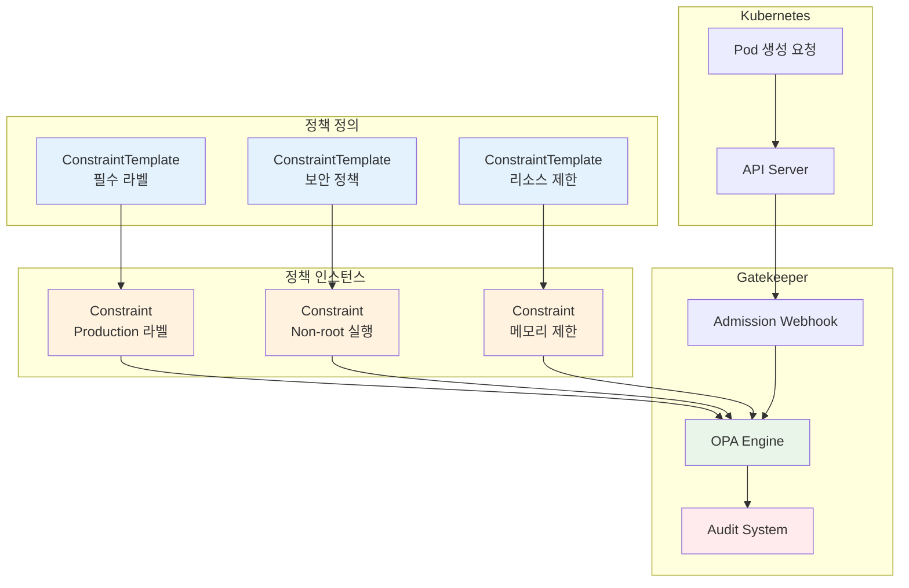

# Week 4 Day 3 Lab 2: OPA Gatekeeper 정책 엔진

<div align="center">

**📋 Policy as Code** • **🤖 OPA** • **⚖️ Gatekeeper**

*Kubernetes 정책 자동화 구축*

</div>

---

## 🕘 실습 정보
**시간**: 14:00-14:50 (50분)  
**목표**: OPA Gatekeeper를 통한 정책 기반 거버넌스 구축  
**방식**: 정책 작성 + 적용 + 검증

---

## 🎯 실습 목표

### 📚 학습 목표
- Gatekeeper 설치 및 구성
- ConstraintTemplate 작성 방법
- Rego 언어 실전 활용
- 실무 정책 시나리오 구현

### 🛠️ 구현 목표
- 필수 라벨 정책 구현
- 컨테이너 보안 정책 적용
- 리소스 제한 강제
- 정책 위반 감사 및 보고

---

## 🏗️ 전체 아키텍처



---

## 🛠️ Step 1: Gatekeeper 설치 (10분)

### Step 1-1: Gatekeeper 설치

```bash
# Helm으로 설치
helm repo add gatekeeper https://open-policy-agent.github.io/gatekeeper/charts
helm repo update

# Gatekeeper 설치
helm install gatekeeper/gatekeeper \
  --name-template=gatekeeper \
  --namespace gatekeeper-system \
  --create-namespace \
  --set auditInterval=60

# 또는 kubectl로 설치
kubectl apply -f https://raw.githubusercontent.com/open-policy-agent/gatekeeper/release-3.14/deploy/gatekeeper.yaml
```

### Step 1-2: 설치 확인

```bash
# Pod 상태 확인
kubectl get pods -n gatekeeper-system

# 예상 출력:
# NAME                                             READY   STATUS
# gatekeeper-audit-xxx                             1/1     Running
# gatekeeper-controller-manager-xxx                1/1     Running
# gatekeeper-controller-manager-yyy                1/1     Running

# CRD 확인
kubectl get crd | grep gatekeeper

# 예상 출력:
# configs.config.gatekeeper.sh
# constrainttemplates.templates.gatekeeper.sh
# ...
```

### Step 1-3: 테스트 네임스페이스 생성

```bash
# 정책 테스트용 네임스페이스
kubectl create namespace policy-test
kubectl create namespace production
```

---

## 🛠️ Step 2: 필수 라벨 정책 구현 (15분)

### Step 2-1: ConstraintTemplate 작성

```yaml
# required-labels-template.yaml
apiVersion: templates.gatekeeper.sh/v1
kind: ConstraintTemplate
metadata:
  name: k8srequiredlabels
  annotations:
    description: "Requires resources to have specified labels"
spec:
  crd:
    spec:
      names:
        kind: K8sRequiredLabels
      validation:
        openAPIV3Schema:
          type: object
          properties:
            labels:
              type: array
              description: "필수 라벨 목록"
              items:
                type: string
            message:
              type: string
              description: "위반 시 표시할 메시지"
  targets:
    - target: admission.k8s.gatekeeper.sh
      rego: |
        package k8srequiredlabels
        
        # 위반 규칙
        violation[{"msg": msg, "details": {"missing_labels": missing}}] {
          # 현재 리소스의 라벨
          provided := {label | input.review.object.metadata.labels[label]}
          
          # 필수 라벨
          required := {label | label := input.parameters.labels[_]}
          
          # 누락된 라벨
          missing := required - provided
          count(missing) > 0
          
          # 메시지 생성
          msg := sprintf("Missing required labels: %v", [missing])
        }
```

```bash
kubectl apply -f required-labels-template.yaml

# 확인
kubectl get constrainttemplate
```

### Step 2-2: Constraint 생성 (정책 인스턴스)

```yaml
# production-labels-constraint.yaml
apiVersion: constraints.gatekeeper.sh/v1beta1
kind: K8sRequiredLabels
metadata:
  name: production-must-have-labels
spec:
  match:
    kinds:
      - apiGroups: [""]
        kinds: ["Pod"]
      - apiGroups: ["apps"]
        kinds: ["Deployment", "StatefulSet"]
    namespaces:
      - "production"
  parameters:
    labels:
      - "app"
      - "version"
      - "owner"
      - "environment"
    message: "Production resources must have app, version, owner, and environment labels"
```

```bash
kubectl apply -f production-labels-constraint.yaml

# 확인
kubectl get k8srequiredlabels
```

### Step 2-3: 정책 테스트

```yaml
# test-pod-no-labels.yaml (정책 위반)
apiVersion: v1
kind: Pod
metadata:
  name: test-pod-no-labels
  namespace: production
spec:
  containers:
  - name: nginx
    image: nginx:1.20
```

```bash
# 정책 위반 테스트 (실패해야 정상)
kubectl apply -f test-pod-no-labels.yaml

# 예상 출력:
# Error from server: admission webhook "validation.gatekeeper.sh" denied the request:
# [production-must-have-labels] Missing required labels: {app, environment, owner, version}
```

```yaml
# test-pod-with-labels.yaml (정책 준수)
apiVersion: v1
kind: Pod
metadata:
  name: test-pod-with-labels
  namespace: production
  labels:
    app: nginx
    version: "1.0"
    owner: "devops-team"
    environment: "production"
spec:
  containers:
  - name: nginx
    image: nginx:1.20
```

```bash
# 정책 준수 테스트 (성공해야 정상)
kubectl apply -f test-pod-with-labels.yaml

# 예상 출력:
# pod/test-pod-with-labels created
```

---

## 🛠️ Step 3: 컨테이너 보안 정책 (15분)

### Step 3-1: 보안 컨텍스트 정책

```yaml
# security-context-template.yaml
apiVersion: templates.gatekeeper.sh/v1
kind: ConstraintTemplate
metadata:
  name: k8scontainersecurity
spec:
  crd:
    spec:
      names:
        kind: K8sContainerSecurity
  targets:
    - target: admission.k8s.gatekeeper.sh
      rego: |
        package k8scontainersecurity
        
        # 1. Root 사용자 실행 금지
        violation[{"msg": msg}] {
          container := input.review.object.spec.containers[_]
          not container.securityContext.runAsNonRoot
          msg := sprintf("Container '%v' must run as non-root user", [container.name])
        }
        
        # 2. Privileged 모드 금지
        violation[{"msg": msg}] {
          container := input.review.object.spec.containers[_]
          container.securityContext.privileged
          msg := sprintf("Container '%v' cannot run in privileged mode", [container.name])
        }
        
        # 3. 읽기 전용 루트 파일시스템 강제
        violation[{"msg": msg}] {
          container := input.review.object.spec.containers[_]
          not container.securityContext.readOnlyRootFilesystem
          msg := sprintf("Container '%v' must have read-only root filesystem", [container.name])
        }
        
        # 4. Capability 제한
        violation[{"msg": msg}] {
          container := input.review.object.spec.containers[_]
          capabilities := container.securityContext.capabilities.add[_]
          not allowed_capability(capabilities)
          msg := sprintf("Container '%v' uses disallowed capability: %v", [container.name, capabilities])
        }
        
        allowed_capability(cap) {
          cap == "NET_BIND_SERVICE"
        }
        
        allowed_capability(cap) {
          cap == "CHOWN"
        }
```

```bash
kubectl apply -f security-context-template.yaml
```

### Step 3-2: 보안 정책 적용

```yaml
# security-constraint.yaml
apiVersion: constraints.gatekeeper.sh/v1beta1
kind: K8sContainerSecurity
metadata:
  name: container-security-policy
spec:
  match:
    kinds:
      - apiGroups: [""]
        kinds: ["Pod"]
    namespaces:
      - "production"
      - "staging"
```

```bash
kubectl apply -f security-constraint.yaml
```

### Step 3-3: 보안 정책 테스트

```yaml
# insecure-pod.yaml (정책 위반)
apiVersion: v1
kind: Pod
metadata:
  name: insecure-pod
  namespace: production
  labels:
    app: test
    version: "1.0"
    owner: "test"
    environment: "production"
spec:
  containers:
  - name: nginx
    image: nginx:1.20
    securityContext:
      privileged: true  # 위반!
```

```bash
# 정책 위반 테스트
kubectl apply -f insecure-pod.yaml

# 예상 출력:
# Error: Container 'nginx' cannot run in privileged mode
```

```yaml
# secure-pod.yaml (정책 준수)
apiVersion: v1
kind: Pod
metadata:
  name: secure-pod
  namespace: production
  labels:
    app: nginx
    version: "1.0"
    owner: "devops-team"
    environment: "production"
spec:
  securityContext:
    runAsNonRoot: true
    runAsUser: 1000
    fsGroup: 2000
  containers:
  - name: nginx
    image: nginx:1.20
    securityContext:
      allowPrivilegeEscalation: false
      readOnlyRootFilesystem: true
      runAsNonRoot: true
      capabilities:
        drop:
          - ALL
        add:
          - NET_BIND_SERVICE
    volumeMounts:
    - name: cache
      mountPath: /var/cache/nginx
    - name: run
      mountPath: /var/run
  volumes:
  - name: cache
    emptyDir: {}
  - name: run
    emptyDir: {}
```

```bash
kubectl apply -f secure-pod.yaml
```

---

## 🛠️ Step 4: 리소스 제한 정책 (10분)

### Step 4-1: 리소스 제한 정책

```yaml
# resource-limits-template.yaml
apiVersion: templates.gatekeeper.sh/v1
kind: ConstraintTemplate
metadata:
  name: k8sresourcelimits
spec:
  crd:
    spec:
      names:
        kind: K8sResourceLimits
      validation:
        openAPIV3Schema:
          type: object
          properties:
            maxMemory:
              type: string
            maxCpu:
              type: string
  targets:
    - target: admission.k8s.gatekeeper.sh
      rego: |
        package k8sresourcelimits
        
        # 메모리 제한 필수
        violation[{"msg": msg}] {
          container := input.review.object.spec.containers[_]
          not container.resources.limits.memory
          msg := sprintf("Container '%v' must have memory limit", [container.name])
        }
        
        # CPU 제한 필수
        violation[{"msg": msg}] {
          container := input.review.object.spec.containers[_]
          not container.resources.limits.cpu
          msg := sprintf("Container '%v' must have CPU limit", [container.name])
        }
        
        # 메모리 제한 초과 검사
        violation[{"msg": msg}] {
          container := input.review.object.spec.containers[_]
          memory_limit := container.resources.limits.memory
          max_memory := input.parameters.maxMemory
          memory_limit > max_memory
          msg := sprintf("Container '%v' memory limit %v exceeds maximum %v", 
                        [container.name, memory_limit, max_memory])
        }
```

```bash
kubectl apply -f resource-limits-template.yaml
```

### Step 4-2: 리소스 제한 적용

```yaml
# resource-limits-constraint.yaml
apiVersion: constraints.gatekeeper.sh/v1beta1
kind: K8sResourceLimits
metadata:
  name: resource-limits-policy
spec:
  match:
    kinds:
      - apiGroups: [""]
        kinds: ["Pod"]
    namespaces:
      - "production"
  parameters:
    maxMemory: "2Gi"
    maxCpu: "2000m"
```

```bash
kubectl apply -f resource-limits-constraint.yaml
```

---

## ✅ 실습 체크포인트

### ✅ Gatekeeper 설치 확인
- [ ] Gatekeeper Pod 정상 실행
- [ ] CRD 생성 확인
- [ ] Webhook 등록 확인

### ✅ 정책 구현 확인
- [ ] ConstraintTemplate 3개 생성
- [ ] Constraint 3개 적용
- [ ] 정책 위반 시 차단 동작
- [ ] 정책 준수 시 허용 동작

### ✅ 감사 기능 확인
- [ ] 기존 리소스 정책 위반 검사
- [ ] 위반 사항 조회
- [ ] 정책 위반 보고서 생성

---

## 🔍 감사 및 보고

### 감사 실행

```bash
# 1. 기존 리소스 감사 (자동 실행)
# Gatekeeper가 주기적으로 클러스터 스캔

# 2. 위반 사항 확인
kubectl get k8srequiredlabels production-must-have-labels -o yaml

# 3. 위반 리소스 목록
kubectl get k8srequiredlabels production-must-have-labels -o json | \
  jq '.status.violations[] | {name, namespace, message}'

# 4. 전체 정책 위반 요약
kubectl get constraints -A -o json | \
  jq '.items[] | {name: .metadata.name, violations: .status.totalViolations}'
```

### 보고서 생성

```bash
# 정책 위반 보고서
cat > policy-report.sh << 'EOF'
#!/bin/bash

echo "=== Gatekeeper Policy Violation Report ==="
echo "Generated: $(date)"
echo ""

for constraint in $(kubectl get constraints -A -o name); do
  name=$(echo $constraint | cut -d'/' -f2)
  violations=$(kubectl get $constraint -o json | jq '.status.totalViolations // 0')
  
  echo "Policy: $name"
  echo "Total Violations: $violations"
  
  if [ "$violations" -gt 0 ]; then
    echo "Details:"
    kubectl get $constraint -o json | \
      jq -r '.status.violations[] | "  - \(.kind)/\(.name) in \(.namespace): \(.message)"'
  fi
  echo ""
done
EOF

chmod +x policy-report.sh
./policy-report.sh
```

---

## 🧹 실습 정리

```bash
# Constraint 삭제
kubectl delete k8srequiredlabels --all
kubectl delete k8scontainersecurity --all
kubectl delete k8sresourcelimits --all

# ConstraintTemplate 삭제
kubectl delete constrainttemplate --all

# 테스트 리소스 삭제
kubectl delete namespace policy-test production

# Gatekeeper 제거
helm uninstall gatekeeper -n gatekeeper-system
kubectl delete namespace gatekeeper-system
```

---

## 💡 실습 회고

### 🤝 페어 회고 (5분)
1. **정책 작성**: Rego 언어가 얼마나 직관적이었나요?
2. **정책 적용**: 실시간 정책 적용의 장점은?
3. **감사 기능**: 기존 리소스 검사의 유용성은?

### 📊 학습 성과
- **Policy as Code**: 정책의 코드화와 버전 관리
- **Rego 언어**: 선언적 정책 작성 언어 습득
- **자동화**: 수동 검토 없는 자동 정책 적용
- **컴플라이언스**: 지속적인 규정 준수 보장

---

<div align="center">

**📋 Policy as Code** • **🤖 OPA** • **⚖️ Gatekeeper** • **🔍 자동 감사**

*코드로 관리하는 Kubernetes 거버넌스*

</div>
