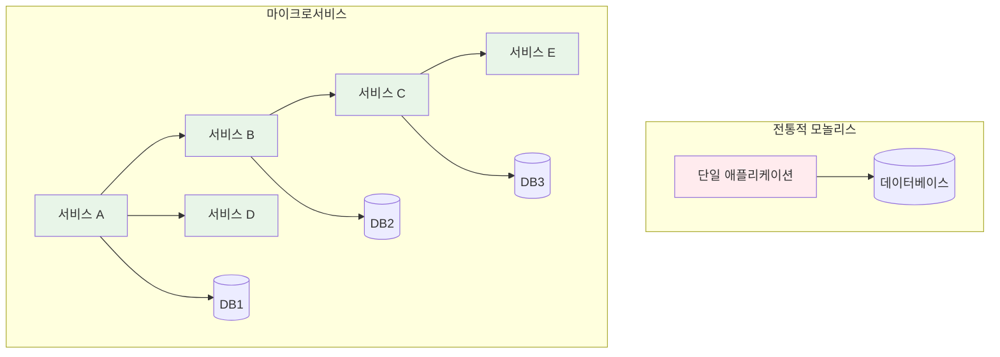
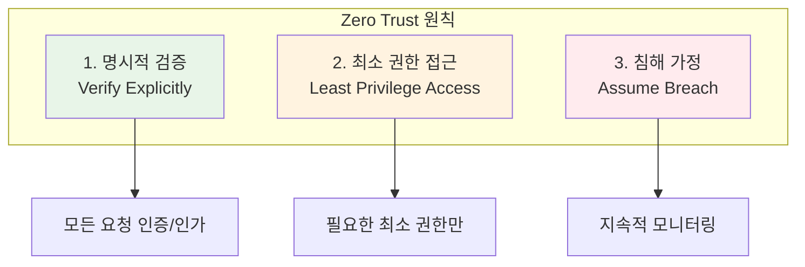
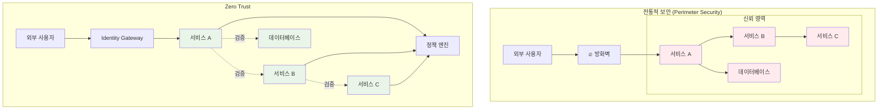
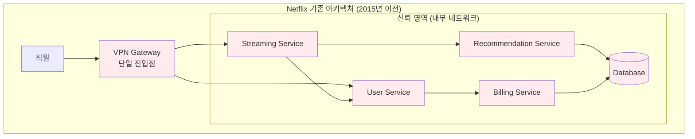
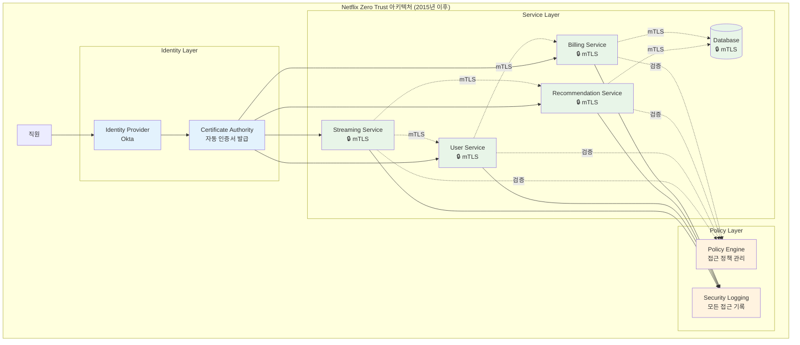
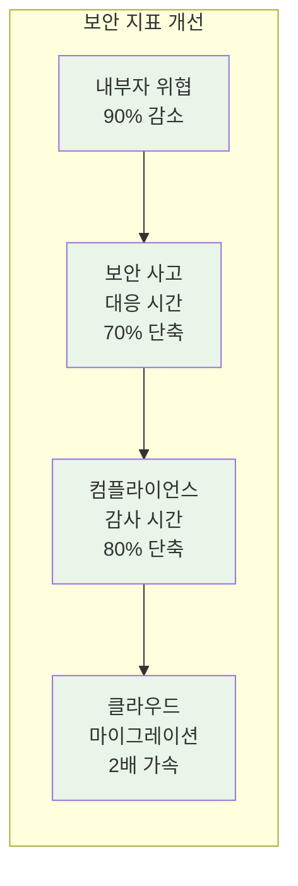
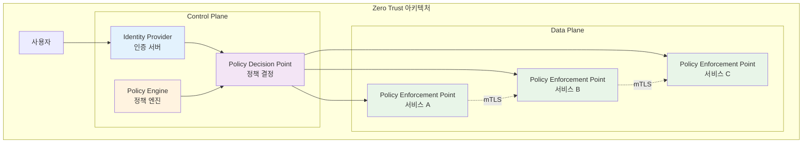
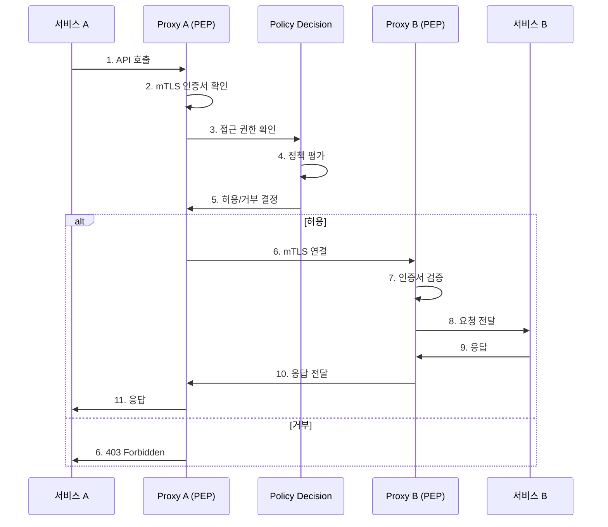
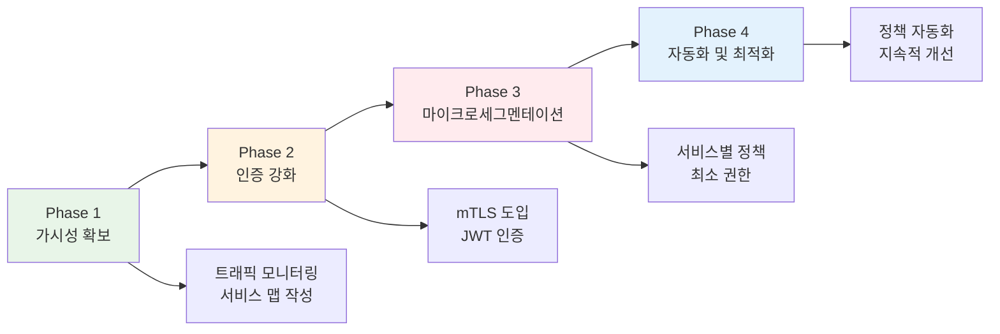

# Week 4 Day 3 Session 1: Zero Trust 아키텍처

<div align="center">

**🔒 Zero Trust** • **🛡️ 마이크로세그멘테이션** • **🔍 지속적 검증**

*"절대 신뢰하지 말고, 항상 검증하라"*

</div>

---

## 🕘 세션 정보
**시간**: 09:00-09:50 (50분)  
**목표**: Zero Trust 보안 모델의 완전한 이해와 마이크로서비스 적용  
**방식**: 이론 설명 + 실무 사례 + 아키텍처 설계

---

## 🎯 학습 목표

### 📚 이해 목표
- **Zero Trust 개념**: 전통적 보안과의 근본적 차이 이해
- **보안 경계 변화**: 네트워크 경계에서 서비스 경계로의 전환
- **마이크로서비스 보안**: 분산 환경의 보안 과제와 해결책

### 🛠️ 적용 목표
- **Zero Trust 아키텍처 설계**: 마이크로서비스 환경 보안 설계
- **보안 정책 수립**: 서비스별 접근 제어 정책
- **실무 적용 전략**: 단계적 Zero Trust 도입 방법

### 🤝 협업 목표
- **보안 요구사항 도출**: 팀별 보안 시나리오 분석
- **아키텍처 리뷰**: 상호 보안 설계 검토

---

## 🤔 왜 필요한가? (5분)

### 💼 실무 시나리오
**"내부 네트워크는 안전하다"는 신화의 붕괴**

<div align="center">
  
</div>

**핵심 문제점**:
- ❌ **한 번 침투하면 내부 전체 접근 가능**: 방화벽만 통과하면 모든 서버 접근
- ❌ **내부자 위협에 취약**: 내부 직원의 악의적 행동 방어 불가
- ❌ **클라우드/원격 근무 환경에 부적합**: 명확한 경계가 없는 환경
- ❌ **측면 이동(Lateral Movement)**: 한 서버에서 다른 서버로 자유롭게 이동

### 🏠 실생활 비유
**아파트 보안 vs 개별 집 보안**

```
전통적 보안 = 아파트 정문 경비
- 정문만 통과하면 모든 집 접근 가능
- 한 집이 뚫리면 전체 위험

Zero Trust = 각 집마다 개별 보안
- 매번 신분 확인
- 집마다 독립적 보안
- 한 집 침입이 다른 집에 영향 없음
```

### ☁️ 마이크로서비스 환경의 보안 과제



**보안 복잡도 증가**:
- 서비스 간 통신 경로 폭발적 증가
- 각 서비스마다 독립적 보안 필요
- 동적 환경에서 고정 IP 기반 보안 불가능

---

## 📖 핵심 개념 (35분)

### 🔍 개념 1: Zero Trust 핵심 원칙 (12분)

> **정의**: "절대 신뢰하지 말고, 항상 검증하라 (Never Trust, Always Verify)"

#### Zero Trust 3대 원칙



#### 1. 명시적 검증 (Verify Explicitly)
```yaml
# 모든 요청에 대한 검증
요청 → 인증 → 인가 → 접근

검증 요소:
- 신원 (Identity): 누구인가?
- 디바이스 (Device): 어떤 기기인가?
- 위치 (Location): 어디서 접속하는가?
- 시간 (Time): 언제 접속하는가?
- 행동 (Behavior): 정상적인 패턴인가?
```

#### 2. 최소 권한 접근 (Least Privilege Access)
```yaml
# Just-In-Time & Just-Enough-Access

예시:
서비스 A → 서비스 B 호출
- ✅ 허용: GET /api/users/{id}
- ❌ 거부: POST /api/users
- ❌ 거부: DELETE /api/users/{id}

시간 제한:
- 토큰 유효기간: 15분
- 재인증 주기: 1시간
```

#### 3. 침해 가정 (Assume Breach)
```yaml
# 이미 침해당했다고 가정하고 설계

방어 전략:
1. 마이크로세그멘테이션
   - 서비스별 격리
   - 최소 통신 경로만 허용

2. 지속적 모니터링
   - 모든 접근 로깅
   - 이상 행동 탐지

3. 빠른 대응
   - 자동 차단
   - 즉시 격리
```

### 🔍 개념 2: 전통적 보안 vs Zero Trust (12분)

#### 비교 분석

| 구분 | 전통적 보안 | Zero Trust |
|------|-------------|------------|
| **신뢰 모델** | 내부 = 신뢰 | 모두 검증 |
| **보안 경계** | 네트워크 경계 | 서비스 경계 |
| **접근 제어** | 네트워크 기반 | 신원 기반 |
| **검증 시점** | 최초 1회 | 지속적 |
| **권한 범위** | 광범위 | 최소 권한 |
| **모니터링** | 경계 중심 | 전체 트래픽 |

#### 아키텍처 비교



#### 실무 사례: Netflix의 Zero Trust 전환

**Before: 전통적 VPN 기반 보안**


**문제점**:
- ❌ VPN 통과 후 모든 서비스 접근 가능
- ❌ 내부자 위협에 취약
- ❌ 서비스 간 무제한 통신
- ❌ 보안 사고 추적 어려움

**After: Zero Trust 아키텍처**


**개선 사항**:
```yaml
1. 인증 강화:
   - 모든 서비스에 고유 인증서 발급
   - 24시간마다 자동 갱신
   - 인증서 기반 서비스 식별

2. 세밀한 권한 관리:
   - Streaming Service → User Service: GET /api/users/{id} 만 허용
   - Recommendation Service → Database: READ 권한만
   - Billing Service → Database: READ/WRITE 권한

3. 지속적 검증:
   - 모든 요청마다 인증서 검증
   - 정책 엔진에서 실시간 권한 확인
   - 이상 행동 자동 탐지

4. 완전한 가시성:
   - 모든 서비스 간 통신 로깅
   - 실시간 보안 대시보드
   - 자동 알림 및 차단
```

**측정 가능한 결과**:


**구체적 수치**:
- **보안 사고 감지**: 평균 30일 → 3일
- **권한 관리**: 수동 검토 → 자동 정책 적용
- **감사 준비**: 3개월 → 1주일
- **서비스 수**: 700개 이상 마이크로서비스에 적용

### 🔍 개념 3: 마이크로서비스 Zero Trust 구현 (11분)

#### Zero Trust 아키텍처 구성 요소



#### 핵심 구성 요소 설명

**1. Identity Provider (IDP)**
```yaml
역할: 신원 인증 및 토큰 발급
구현: Keycloak, Auth0, Okta

기능:
- 사용자 인증 (OAuth2/OIDC)
- 서비스 인증 (Service Account)
- 토큰 발급 및 관리
- 다중 인증 (MFA)
```

**2. Policy Engine**
```yaml
역할: 보안 정책 정의 및 관리
구현: OPA (Open Policy Agent)

정책 예시:
- 서비스 A는 서비스 B의 GET만 허용
- 관리자만 DELETE 작업 가능
- 업무 시간에만 접근 허용
```

**3. Policy Enforcement Point (PEP)**
```yaml
역할: 실제 정책 적용 및 트래픽 제어
구현: Istio Sidecar, Envoy Proxy

동작:
1. 요청 가로채기
2. 정책 결정 요청
3. 허용/거부 적용
4. 로깅 및 모니터링
```

#### 서비스 간 통신 흐름



#### 실무 구현 패턴

**패턴 1: Service Mesh 기반 Zero Trust**
```yaml
# Istio를 활용한 구현
구성:
- Sidecar Proxy: 모든 서비스에 Envoy 배포
- Control Plane: Istiod (정책 관리)
- mTLS: 자동 인증서 관리

장점:
✅ 애플리케이션 코드 변경 없음
✅ 자동 mTLS 구성
✅ 세밀한 트래픽 제어

단점:
❌ 복잡도 증가
❌ 리소스 오버헤드
```

**패턴 2: API Gateway 기반 Zero Trust**
```yaml
# Kong + OPA 조합
구성:
- API Gateway: Kong (진입점)
- Policy Engine: OPA (정책 평가)
- Identity: Keycloak (인증)

장점:
✅ 중앙 집중식 관리
✅ 기존 시스템 통합 용이
✅ 성능 오버헤드 적음

단점:
❌ 서비스 간 통신 제어 제한적
❌ 단일 장애점 가능성
```

#### 단계적 Zero Trust 도입 전략



---

## 💭 함께 생각해보기 (10분)

### 🤝 페어 토론 (5분)

**토론 주제**:
1. **현재 시스템 분석**: "우리 시스템에서 Zero Trust가 필요한 부분은?"
2. **도입 우선순위**: "어떤 서비스부터 Zero Trust를 적용해야 할까?"
3. **예상 과제**: "Zero Trust 도입 시 예상되는 어려움은?"

**페어 활동 가이드**:
- 👥 **시나리오 분석**: 실제 서비스 구조 그려보기
- 🔍 **취약점 식별**: 현재 보안 약점 찾기
- 📝 **전환 계획**: 단계적 도입 로드맵 작성

### 🎯 전체 공유 (5분)

**공유 내용**:
- 각 팀의 Zero Trust 도입 전략
- 예상되는 기술적 과제
- 해결 방안 아이디어

**💡 이해도 체크 질문**:
- ✅ "Zero Trust의 3대 원칙을 설명할 수 있나요?"
- ✅ "전통적 보안과 Zero Trust의 핵심 차이는?"
- ✅ "마이크로서비스에서 Zero Trust가 중요한 이유는?"

---

## 🔑 핵심 키워드

### 🆕 새로운 용어
- **Zero Trust**: 모든 접근을 검증하는 보안 모델
- **마이크로세그멘테이션**: 서비스 단위 보안 격리
- **Policy Engine**: 보안 정책 평가 엔진
- **PEP (Policy Enforcement Point)**: 정책 적용 지점

### 🔤 기술 용어
- **mTLS (Mutual TLS)**: 양방향 인증서 검증
- **RBAC (Role-Based Access Control)**: 역할 기반 접근 제어
- **ABAC (Attribute-Based Access Control)**: 속성 기반 접근 제어
- **Service Mesh**: 서비스 간 통신 관리 인프라

### 🔤 실무 용어
- **Assume Breach**: 침해 가정 원칙
- **Least Privilege**: 최소 권한 원칙
- **Defense in Depth**: 심층 방어
- **Continuous Verification**: 지속적 검증

---

## 📝 세션 마무리

### ✅ 오늘 세션 성과
- [ ] Zero Trust 개념과 필요성 이해
- [ ] 전통적 보안과의 차이점 파악
- [ ] 마이크로서비스 Zero Trust 아키텍처 이해
- [ ] 단계적 도입 전략 수립

### 🎯 다음 세션 준비
**Session 2: 인증/인가 패턴**
- OAuth2, JWT, mTLS 상세 학습
- 실제 인증 시스템 구현 방법
- 통합 인증 아키텍처 설계

### 🔗 실습 연계
- **Lab 1**: Istio mTLS + JWT 통합 구현
- **Lab 2**: OPA 정책 엔진 구축
- **Challenge**: 보안 취약점 해결

---

<div align="center">

**🔒 Zero Trust 원칙** • **🛡️ 마이크로세그멘테이션** • **🔍 지속적 검증**

*"절대 신뢰하지 말고, 항상 검증하라"*

</div>
