# Week 4 Day 3 Session 2: 인증/인가 패턴

<div align="center">

**🔐 OAuth2** • **🎫 JWT** • **🔒 mTLS**

*마이크로서비스 환경의 통합 인증 시스템*

</div>

---

## 🕘 세션 정보
**시간**: 10:00-10:50 (50분)  
**목표**: OAuth2, JWT, mTLS를 통합한 인증/인가 시스템 완전 이해  
**방식**: 프로토콜 상세 분석 + 실무 패턴 + 통합 아키텍처

---

## 🎯 학습 목표

### 📚 이해 목표
- **OAuth2 프로토콜**: 4가지 Grant Type 완전 이해
- **JWT 구조**: 토큰 기반 인증 메커니즘
- **mTLS 동작**: 상호 인증서 검증 원리
- **통합 전략**: 사용자 vs 서비스 인증 분리

### 🛠️ 적용 목표
- **OAuth2 Flow 구현**: Authorization Code, Client Credentials
- **JWT 토큰 관리**: 발급, 검증, 갱신 전략
- **mTLS 설정**: 서비스 간 안전한 통신
- **통합 아키텍처**: 실무 인증 시스템 설계

### 🤝 협업 목표
- **인증 시나리오 분석**: 팀별 인증 요구사항 도출
- **보안 리뷰**: 상호 인증 설계 검토

---

## 🤔 왜 필요한가? (5분)

### 💼 실무 시나리오
**"누가 무엇을 할 수 있는가?"**

<div align="center">
  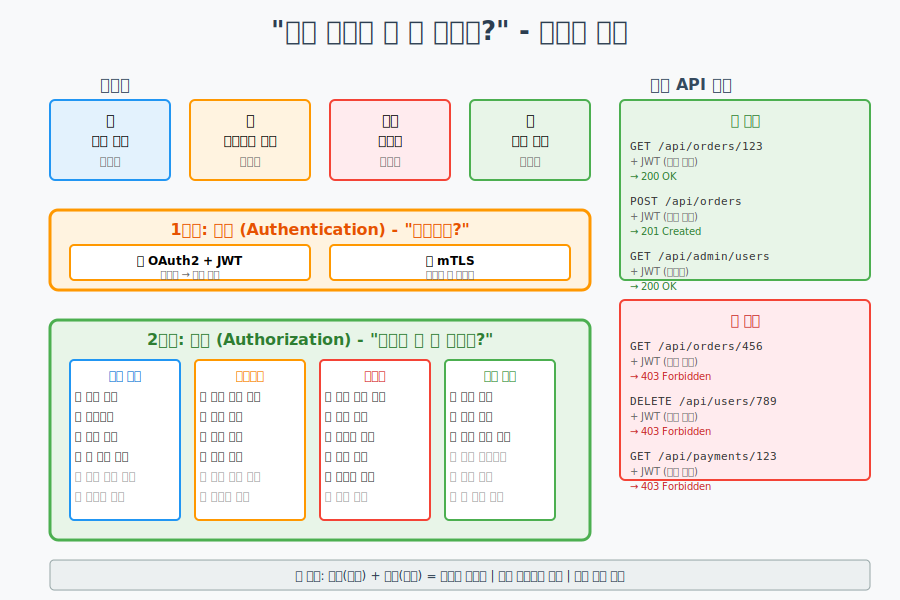
</div>

**핵심 개념**:
```yaml
인증 (Authentication) - "누구인가?":
- 사용자 신원 확인
- OAuth2 + JWT (사용자)
- mTLS (서비스 간)

인가 (Authorization) - "무엇을 할 수 있는가?":
- 권한 확인
- 역할 기반 접근 제어 (RBAC)
- 최소 권한 원칙
- 리소스별 세밀한 제어
```

### 🏠 실생활 비유
**신분증 vs 출입증 vs 지문 인식**

```
OAuth2 = 신분증 발급소
- 신원 확인 후 신분증 발급
- 신분증으로 여러 곳 출입

JWT = 신분증
- 신분 정보 포함
- 위조 방지 기능
- 유효기간 존재

mTLS = 지문 인식
- 양방향 신원 확인
- 위조 불가능
- 자동 인증
```

### ☁️ 인증 복잡도 증가

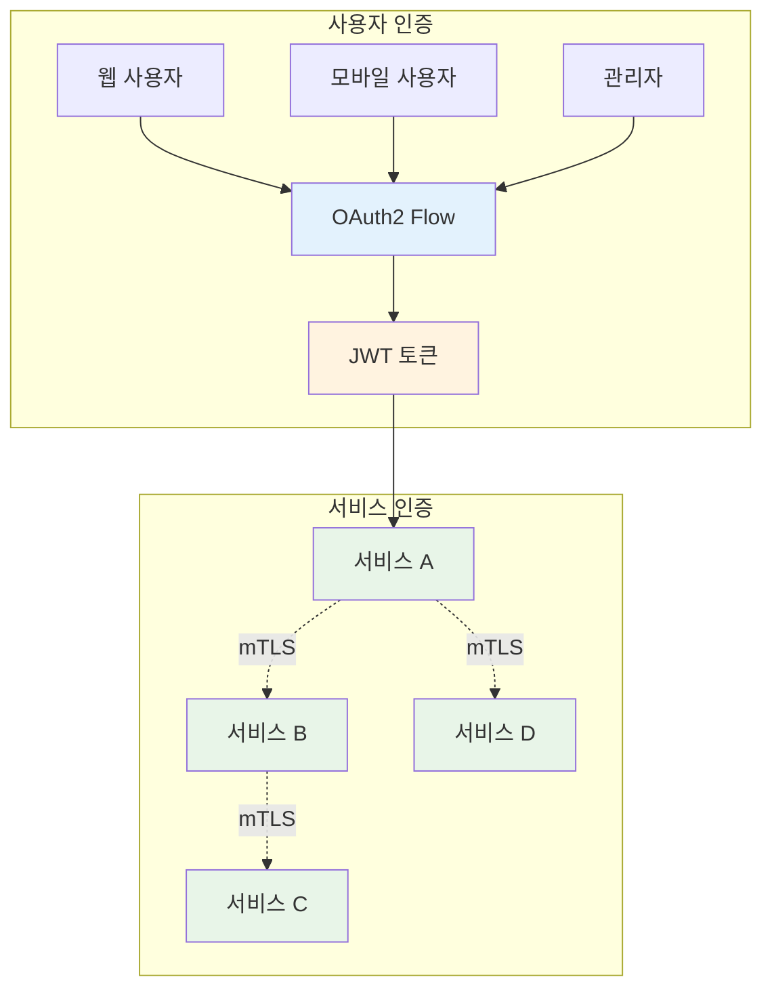

---

## 📖 핵심 개념 (35분)

### 🔍 개념 1: OAuth 2.0 프로토콜 (12분)

> **정의**: 안전한 권한 위임을 위한 개방형 표준 프로토콜

#### OAuth 2.0 역할 (Roles)

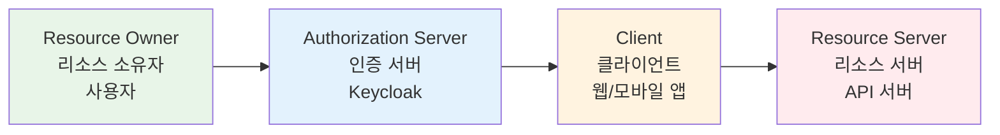

#### Grant Type 1: Authorization Code (가장 안전)

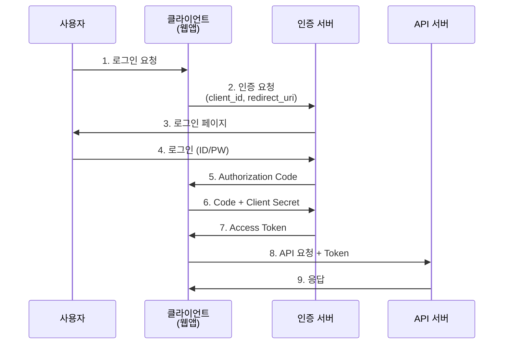

**사용 사례**: 웹 애플리케이션, 모바일 앱

```yaml
# Authorization Code Flow
장점:
✅ 가장 안전한 방식
✅ Refresh Token 지원
✅ 사용자 동의 과정 포함

단점:
❌ 복잡한 구현
❌ 리다이렉트 필요

적용:
- 사용자 대면 애플리케이션
- 웹/모바일 앱
```

#### Grant Type 2: Client Credentials (서비스 간)

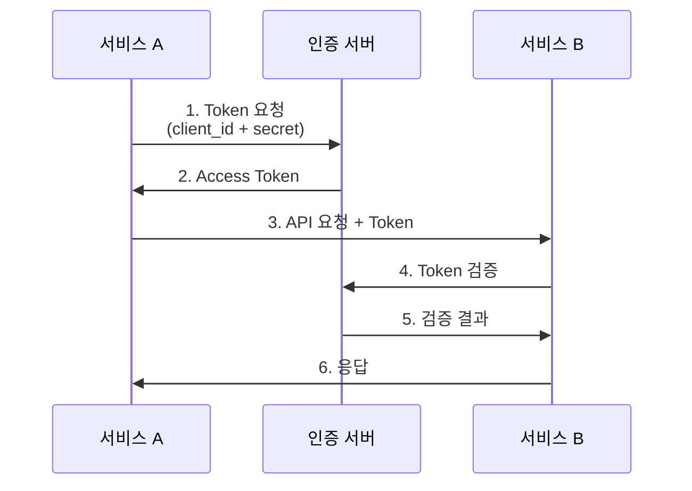

**사용 사례**: 서비스 간 통신, 백그라운드 작업

```yaml
# Client Credentials Flow
장점:
✅ 간단한 구현
✅ 사용자 개입 불필요
✅ 서비스 간 통신에 최적

단점:
❌ 사용자 컨텍스트 없음
❌ Refresh Token 미지원

적용:
- 서비스 간 API 호출
- 배치 작업
- 백그라운드 프로세스
```

#### 실무 OAuth 2.0 구현

**실제 E-Commerce 시스템 예시**:
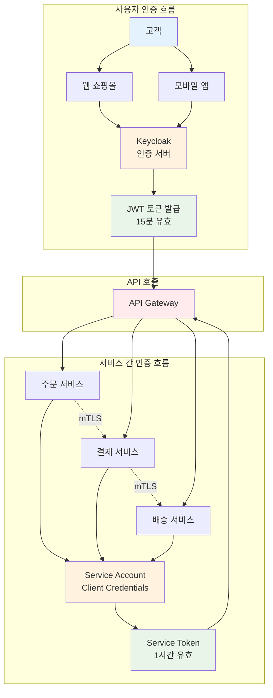

**구체적 설정 예시**:
```yaml
# Keycloak 설정 예시
Realm: ecommerce-prod

# 1. 웹 애플리케이션 클라이언트
Clients:
  - web-shop:
      Client ID: web-shop
      Grant Type: Authorization Code
      Valid Redirect URIs: 
        - https://shop.example.com/callback
        - https://shop.example.com/silent-check-sso.html
      Web Origins: https://shop.example.com
      Access Token Lifespan: 15 minutes
      Refresh Token: enabled
      
  # 2. 모바일 앱 클라이언트
  - mobile-app:
      Client ID: mobile-app
      Grant Type: Authorization Code + PKCE
      Valid Redirect URIs: 
        - myapp://callback
      Access Token Lifespan: 15 minutes
      Refresh Token: enabled
      Refresh Token Lifespan: 7 days
      
  # 3. 주문 서비스 (서비스 간 통신)
  - order-service:
      Client ID: order-service
      Grant Type: Client Credentials
      Service Account: enabled
      Service Account Roles:
        - payment:create
        - shipping:create
      Access Token Lifespan: 1 hour
      
  # 4. 결제 서비스
  - payment-service:
      Client ID: payment-service
      Grant Type: Client Credentials
      Service Account: enabled
      Service Account Roles:
        - payment:process
        - order:update
      Access Token Lifespan: 1 hour

# 역할 및 권한 매핑
Roles:
  - customer:
      Permissions:
        - order:create
        - order:read:own
        - payment:read:own
        
  - admin:
      Permissions:
        - order:*
        - payment:*
        - shipping:*
        - user:*
```

**실제 토큰 예시**:
```json
// 고객용 JWT 토큰
{
  "header": {
    "alg": "RS256",
    "typ": "JWT",
    "kid": "ecommerce-key-2025"
  },
  "payload": {
    "iss": "https://auth.example.com/realms/ecommerce-prod",
    "sub": "customer-12345",
    "aud": "web-shop",
    "exp": 1735690500,  // 15분 후
    "iat": 1735689600,
    "auth_time": 1735689600,
    "name": "홍길동",
    "email": "hong@example.com",
    "roles": ["customer"],
    "permissions": [
      "order:create",
      "order:read:own",
      "payment:read:own"
    ]
  }
}

// 서비스용 토큰 (Client Credentials)
{
  "header": {
    "alg": "RS256",
    "typ": "JWT"
  },
  "payload": {
    "iss": "https://auth.example.com/realms/ecommerce-prod",
    "sub": "service-account-order-service",
    "aud": "payment-service",
    "exp": 1735693200,  // 1시간 후
    "iat": 1735689600,
    "azp": "order-service",
    "scope": "payment:create shipping:create",
    "client_id": "order-service"
  }
}
```

### 🔍 개념 2: JWT (JSON Web Token) (12분)

> **정의**: JSON 기반의 자체 포함형(Self-contained) 토큰

#### JWT 구조

```
JWT = Header.Payload.Signature

예시:
eyJhbGciOiJIUzI1NiIsInR5cCI6IkpXVCJ9.
eyJzdWIiOiIxMjM0NTY3ODkwIiwibmFtZSI6IkpvaG4gRG9lIiwiaWF0IjoxNTE2MjM5MDIyfQ.
SflKxwRJSMeKKF2QT4fwpMeJf36POk6yJV_adQssw5c
```

#### JWT 3부분 상세

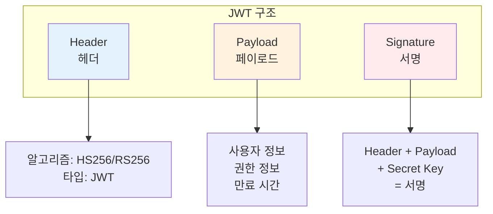

**1. Header (헤더)**
```json
{
  "alg": "RS256",  // 서명 알고리즘
  "typ": "JWT",    // 토큰 타입
  "kid": "key-1"   // Key ID
}
```

**2. Payload (페이로드)**
```json
{
  // 표준 클레임
  "iss": "https://auth.example.com",  // 발급자
  "sub": "user123",                    // 주체 (사용자 ID)
  "aud": "api.example.com",            // 대상
  "exp": 1735689600,                   // 만료 시간
  "iat": 1735686000,                   // 발급 시간
  "nbf": 1735686000,                   // 유효 시작 시간
  
  // 커스텀 클레임
  "name": "John Doe",
  "email": "john@example.com",
  "roles": ["user", "admin"],
  "permissions": ["read:users", "write:users"]
}
```

**3. Signature (서명)**
```javascript
// HMAC SHA256
HMACSHA256(
  base64UrlEncode(header) + "." +
  base64UrlEncode(payload),
  secret
)

// RSA SHA256
RSASHA256(
  base64UrlEncode(header) + "." +
  base64UrlEncode(payload),
  privateKey
)
```

#### JWT 검증 프로세스

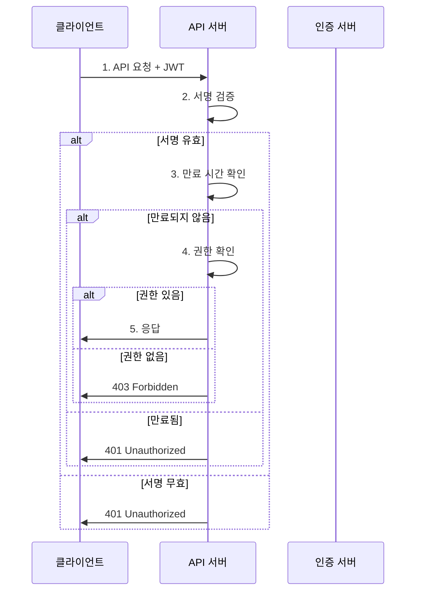

#### JWT 보안 고려사항

```yaml
# 보안 베스트 프랙티스

1. 짧은 만료 시간:
   - Access Token: 15분
   - Refresh Token: 7일

2. 민감 정보 제외:
   ❌ 비밀번호
   ❌ 신용카드 정보
   ❌ 개인 식별 정보 (PII)

3. HTTPS 필수:
   - 토큰 전송 시 암호화
   - 중간자 공격 방지

4. 토큰 저장:
   - 웹: HttpOnly Cookie
   - 모바일: Secure Storage
   ❌ LocalStorage (XSS 취약)

5. Refresh Token 전략:
   - Rotation: 사용 시마다 새 토큰 발급
   - Revocation: 즉시 무효화 가능
```

### 🔍 개념 3: mTLS (Mutual TLS) (11분)

> **정의**: 클라이언트와 서버가 서로의 인증서를 검증하는 양방향 TLS

#### 일반 TLS vs mTLS

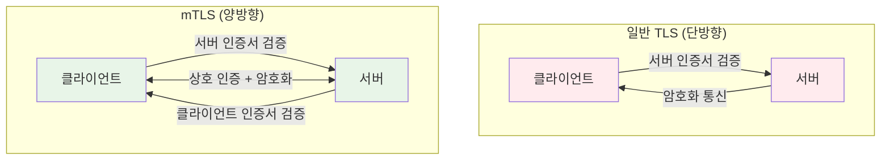

#### mTLS 핸드셰이크 과정

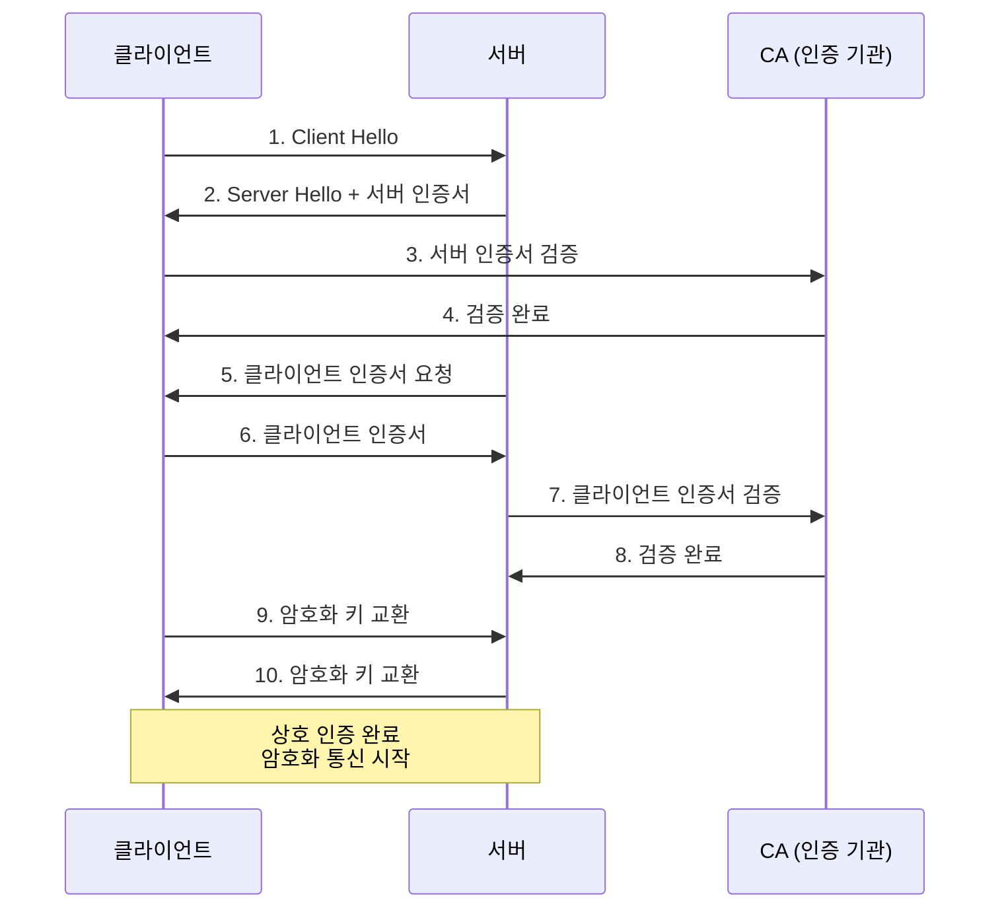

#### 인증서 구조

```yaml
# X.509 인증서 구조
Certificate:
  Version: 3
  Serial Number: 12345
  
  Signature Algorithm: SHA256-RSA
  
  Issuer: 
    CN: Istio CA
    O: cluster.local
  
  Validity:
    Not Before: 2025-01-01 00:00:00
    Not After:  2025-01-02 00:00:00  # 짧은 유효기간
  
  Subject:
    CN: service-a.default.svc.cluster.local
    O: cluster.local
  
  Subject Alternative Names:
    - service-a.default.svc.cluster.local
    - service-a.default
    - service-a
  
  Public Key: RSA 2048 bit
  
  Extensions:
    - Key Usage: Digital Signature, Key Encipherment
    - Extended Key Usage: TLS Web Server, TLS Web Client
```

#### Istio mTLS 자동화

```yaml
# Istio의 자동 mTLS 관리

1. 인증서 자동 발급:
   - Citadel (Istio CA)가 자동 발급
   - 각 서비스마다 고유 인증서
   - 짧은 유효기간 (기본 24시간)

2. 자동 갱신:
   - 만료 전 자동 갱신
   - 무중단 갱신
   - 애플리케이션 코드 변경 불필요

3. 투명한 적용:
   - Sidecar Proxy가 자동 처리
   - 애플리케이션은 HTTP 통신
   - Proxy 간 mTLS 통신

4. 정책 기반 제어:
   - STRICT: mTLS 필수
   - PERMISSIVE: mTLS + Plain 허용
   - DISABLE: mTLS 비활성화
```

#### mTLS 실무 패턴

```yaml
# 패턴 1: 전체 Mesh mTLS
apiVersion: security.istio.io/v1beta1
kind: PeerAuthentication
metadata:
  name: default
  namespace: istio-system
spec:
  mtls:
    mode: STRICT  # 모든 서비스 간 mTLS 필수

---
# 패턴 2: 네임스페이스별 mTLS
apiVersion: security.istio.io/v1beta1
kind: PeerAuthentication
metadata:
  name: default
  namespace: production
spec:
  mtls:
    mode: STRICT

---
# 패턴 3: 서비스별 mTLS
apiVersion: security.istio.io/v1beta1
kind: PeerAuthentication
metadata:
  name: service-a
  namespace: default
spec:
  selector:
    matchLabels:
      app: service-a
  mtls:
    mode: STRICT
  portLevelMtls:
    8080:
      mode: DISABLE  # 특정 포트만 Plain 허용
```

#### 통합 인증 아키텍처

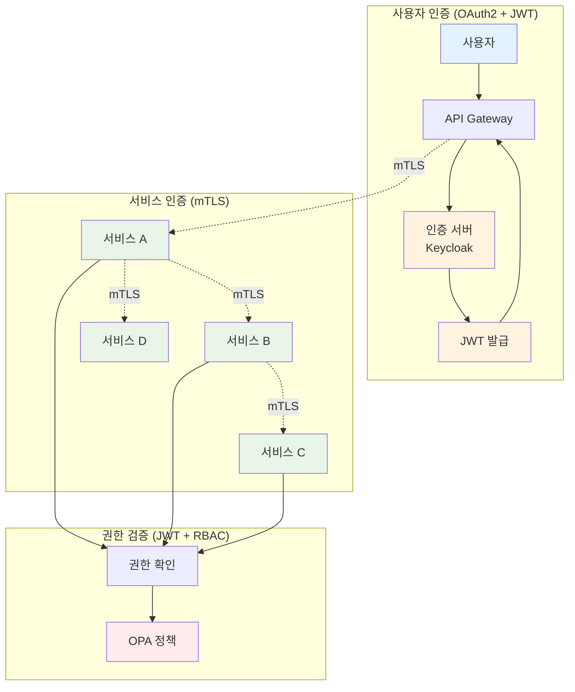

---

## 💭 함께 생각해보기 (10분)

### 🤝 페어 토론 (5분)

**토론 주제**:
1. **인증 전략**: "사용자 인증과 서비스 인증을 어떻게 분리할까?"
2. **토큰 관리**: "JWT 만료 시간을 얼마로 설정해야 할까?"
3. **보안 vs 편의성**: "mTLS의 복잡도를 어떻게 관리할까?"

**페어 활동 가이드**:
- 👥 **시나리오 설계**: 실제 인증 플로우 그려보기
- 🔍 **보안 분석**: 각 방식의 장단점 비교
- 📝 **통합 전략**: OAuth2 + JWT + mTLS 조합

### 🎯 전체 공유 (5분)

**공유 내용**:
- 각 팀의 인증 아키텍처 설계
- 토큰 관리 전략
- mTLS 도입 계획

**💡 이해도 체크 질문**:
- ✅ "OAuth2의 4가지 Grant Type을 설명할 수 있나요?"
- ✅ "JWT의 3부분 구조와 역할은?"
- ✅ "mTLS와 일반 TLS의 차이점은?"

---

## 🔑 핵심 키워드

### 🆕 새로운 용어
- **OAuth 2.0**: 권한 위임 프로토콜
- **JWT (JSON Web Token)**: 자체 포함형 토큰
- **mTLS (Mutual TLS)**: 양방향 TLS 인증
- **Grant Type**: OAuth 인증 방식

### 🔤 기술 용어
- **Authorization Code**: 인증 코드 방식
- **Client Credentials**: 클라이언트 자격증명 방식
- **Access Token**: 접근 토큰
- **Refresh Token**: 갱신 토큰
- **X.509 Certificate**: 디지털 인증서

### 🔤 실무 용어
- **PKCE**: Proof Key for Code Exchange
- **JWKS**: JSON Web Key Set
- **SAN**: Subject Alternative Name
- **CA**: Certificate Authority

---

## 📝 세션 마무리

### ✅ 오늘 세션 성과
- [ ] OAuth 2.0 프로토콜 완전 이해
- [ ] JWT 구조와 검증 프로세스 파악
- [ ] mTLS 동작 원리 이해
- [ ] 통합 인증 아키텍처 설계 능력

### 🎯 다음 세션 준비
**Session 3: 컴플라이언스 자동화**
- Policy as Code 개념
- OPA (Open Policy Agent) 학습
- Gatekeeper를 통한 정책 적용

### 🔗 실습 연계
- **Lab 1**: Istio mTLS + JWT 통합 구현
- **Lab 2**: OPA Gatekeeper 정책 엔진
- **Challenge**: 보안 취약점 진단 및 해결

---

<div align="center">

**🔐 OAuth2** • **🎫 JWT** • **🔒 mTLS** • **🔗 통합 인증**

*마이크로서비스 환경의 완벽한 인증/인가 시스템*

</div>
