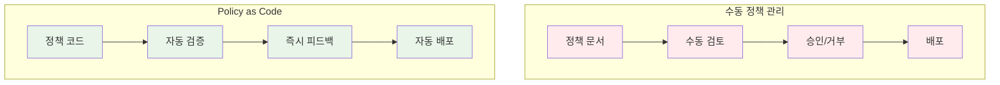
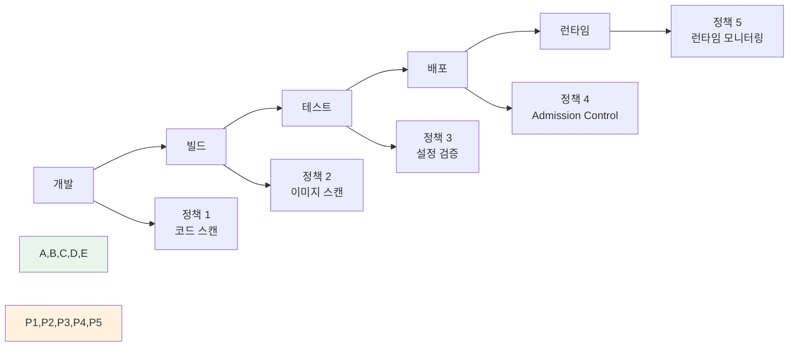
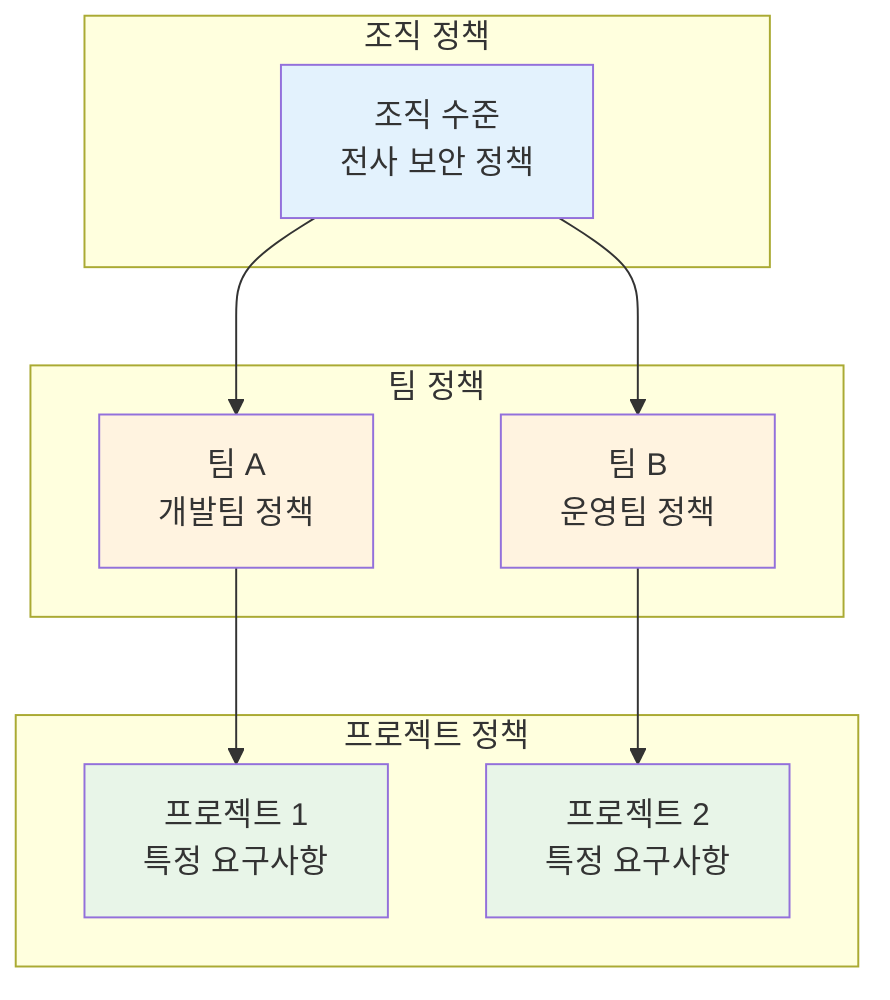
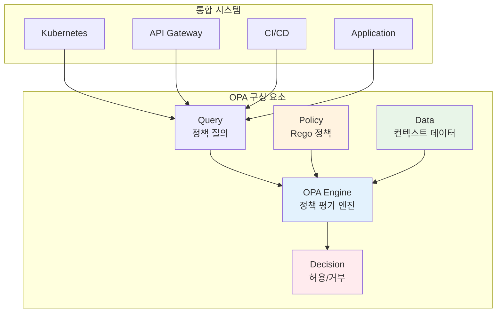
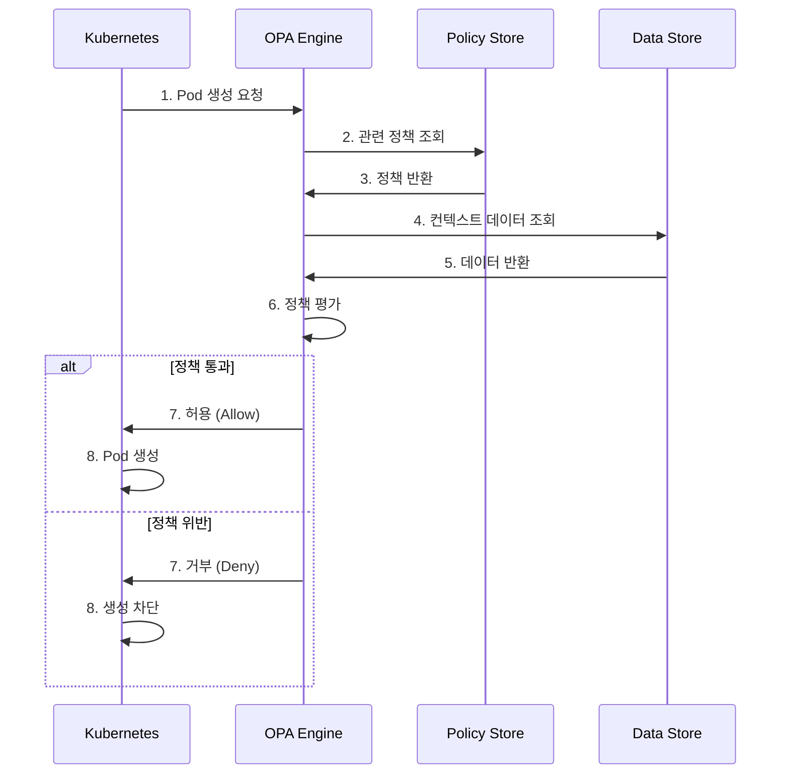
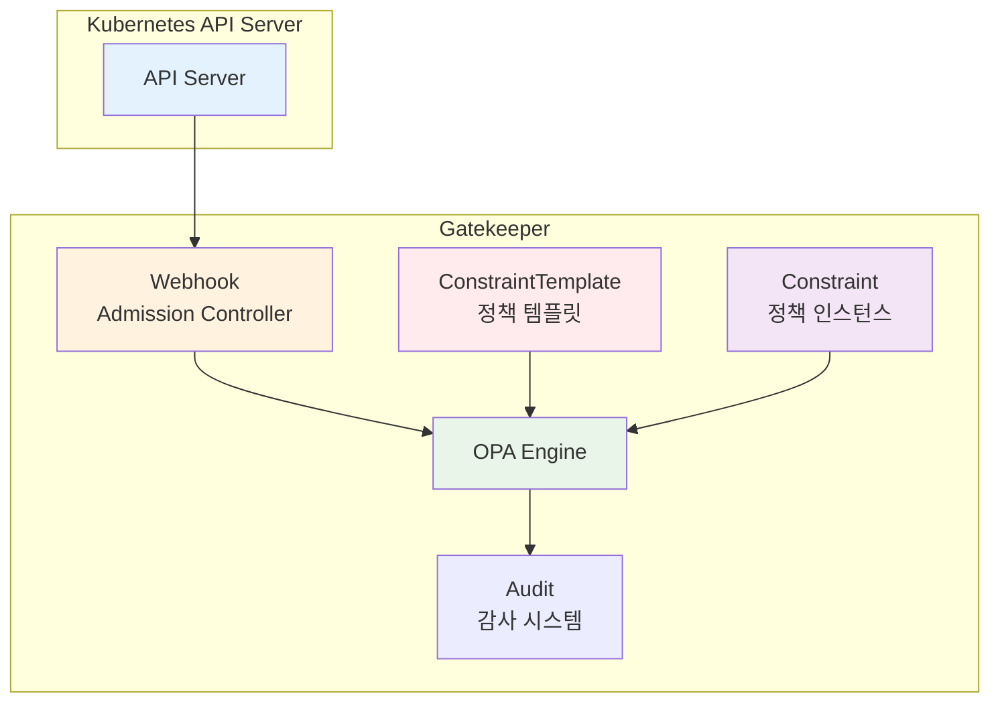
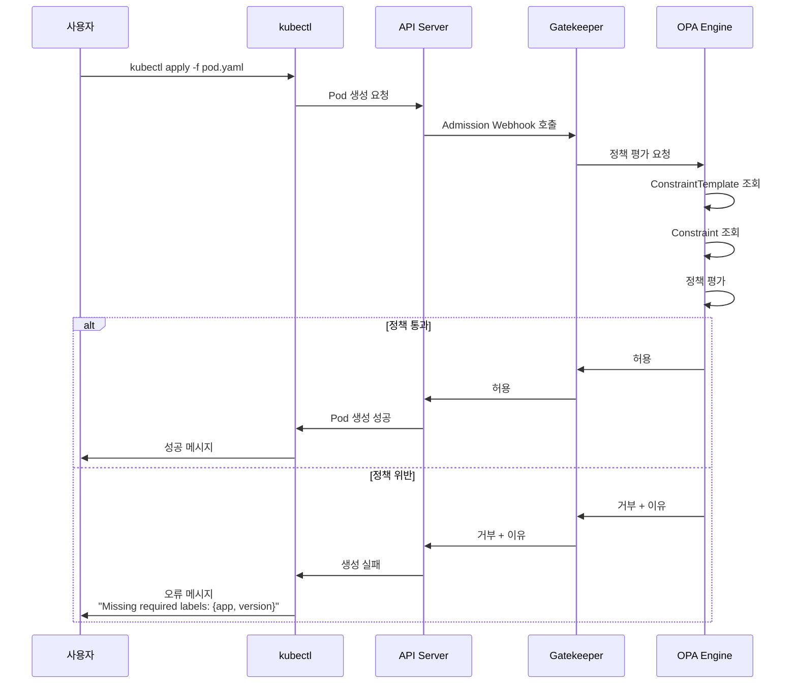

# Week 4 Day 3 Session 3: 컴플라이언스 자동화

<div align="center">

**📋 Policy as Code** • **🤖 OPA** • **⚖️ Gatekeeper**

*코드로 관리하는 보안 정책과 컴플라이언스*

</div>

---

## 🕘 세션 정보
**시간**: 11:00-11:50 (50분)  
**목표**: Policy as Code를 통한 컴플라이언스 자동화 완전 이해  
**방식**: OPA 아키텍처 + Rego 언어 + Gatekeeper 실무

---

## 🎯 학습 목표

### 📚 이해 목표
- **Policy as Code 개념**: 정책의 코드화와 자동화
- **OPA 아키텍처**: 정책 엔진의 동작 원리
- **Rego 언어**: 정책 작성 언어 기초
- **Gatekeeper**: Kubernetes 정책 적용

### 🛠️ 적용 목표
- **정책 작성**: Rego로 보안 정책 구현
- **정책 적용**: Gatekeeper를 통한 자동 적용
- **컴플라이언스 검증**: 자동화된 규정 준수
- **감사 및 보고**: 정책 위반 추적

### 🤝 협업 목표
- **정책 요구사항 도출**: 팀별 컴플라이언스 시나리오
- **정책 라이브러리 구축**: 재사용 가능한 정책 패턴

---

## 🤔 왜 필요한가? (5분)

### 💼 실무 시나리오
**"수동 보안 검토의 한계"**

```
전통적 보안 검토:
┌─────────────────────────────────────┐
│  개발자 → 배포 요청                 │
│     ↓                               │
│  보안팀 → 수동 검토 (1-3일)         │
│     ↓                               │
│  승인/거부 → 피드백                 │
│     ↓                               │
│  수정 → 재검토 (반복)               │
└─────────────────────────────────────┘

문제점:
❌ 느린 배포 속도
❌ 사람의 실수 가능성
❌ 일관성 없는 정책 적용
❌ 확장성 부족
```

### 🏠 실생활 비유
**교통 신호등 vs 교통 경찰**

```
교통 경찰 (수동 검토):
- 사람이 직접 통제
- 피곤하면 실수
- 24시간 불가능
- 비용 높음

교통 신호등 (자동화):
- 규칙 기반 자동 제어
- 일관된 적용
- 24시간 작동
- 확장 가능
```

### ☁️ Policy as Code의 필요성



---

## 📖 핵심 개념 (35분)

### 🔍 개념 1: Policy as Code 개념 (12분)

> **정의**: 보안 정책과 컴플라이언스 규칙을 코드로 작성하고 자동화하는 접근법

#### Policy as Code 원칙

```yaml
1. 코드로 정의:
   - 정책을 코드로 작성
   - 버전 관리 (Git)
   - 코드 리뷰 프로세스

2. 자동화:
   - CI/CD 파이프라인 통합
   - 배포 전 자동 검증
   - 즉시 피드백

3. 재사용성:
   - 정책 라이브러리
   - 템플릿화
   - 조직 전체 공유

4. 감사 가능:
   - 모든 변경 이력 추적
   - 정책 위반 로깅
   - 컴플라이언스 보고
```

#### 정책 적용 시점



#### 정책 계층 구조



### 🔍 개념 2: OPA (Open Policy Agent) (12분)

> **정의**: 범용 정책 엔진으로, 다양한 시스템에서 정책을 통합 관리

#### OPA 아키텍처



#### OPA 동작 방식



#### Rego 언어 기초

**Rego 구조**:
```rego
# 패키지 선언
package kubernetes.admission

# 기본 정책: 거부
default allow = false

# 허용 규칙
allow {
    input.request.kind.kind == "Pod"
    input.request.object.spec.containers[_].image
    not contains(input.request.object.spec.containers[_].image, "latest")
}

# 거부 이유
deny[msg] {
    input.request.kind.kind == "Pod"
    image := input.request.object.spec.containers[_].image
    contains(image, "latest")
    msg := sprintf("Image tag 'latest' is not allowed: %v", [image])
}
```

**Rego 핵심 개념**:
```rego
# 1. 변수 할당
x := 10
name := "service-a"

# 2. 배열/객체 접근
containers := input.spec.containers
first_container := containers[0]
all_images := [c.image | c := containers[_]]

# 3. 조건문
allow {
    input.user == "admin"  # AND 조건
    input.action == "delete"
}

allow {
    input.user == "admin"  # OR 조건 (별도 규칙)
}

allow {
    input.user == "operator"
}

# 4. 부정
deny {
    not input.user == "admin"  # admin이 아니면
}

# 5. 반복
deny[msg] {
    container := input.spec.containers[_]  # 모든 컨테이너
    not container.securityContext.runAsNonRoot
    msg := sprintf("Container %v must run as non-root", [container.name])
}

# 6. 함수
is_admin(user) {
    user.roles[_] == "admin"
}

allow {
    is_admin(input.user)
}
```

#### 실무 정책 예시

**정책 1: 이미지 레지스트리 제한**
```rego
package kubernetes.admission

deny[msg] {
    input.request.kind.kind == "Pod"
    image := input.request.object.spec.containers[_].image
    not startswith(image, "myregistry.io/")
    msg := sprintf("Image must be from myregistry.io: %v", [image])
}
```

**정책 2: 리소스 제한 필수**
```rego
package kubernetes.admission

deny[msg] {
    input.request.kind.kind == "Pod"
    container := input.request.object.spec.containers[_]
    not container.resources.limits.memory
    msg := sprintf("Container %v must have memory limit", [container.name])
}

deny[msg] {
    input.request.kind.kind == "Pod"
    container := input.request.object.spec.containers[_]
    not container.resources.limits.cpu
    msg := sprintf("Container %v must have CPU limit", [container.name])
}
```

**정책 3: 보안 컨텍스트 강제**
```rego
package kubernetes.admission

deny[msg] {
    input.request.kind.kind == "Pod"
    container := input.request.object.spec.containers[_]
    not container.securityContext.runAsNonRoot
    msg := sprintf("Container %v must run as non-root", [container.name])
}

deny[msg] {
    input.request.kind.kind == "Pod"
    container := input.request.object.spec.containers[_]
    container.securityContext.privileged
    msg := sprintf("Container %v cannot run as privileged", [container.name])
}
```

### 🔍 개념 3: Gatekeeper (11분)

> **정의**: Kubernetes를 위한 OPA 기반 정책 엔진

#### Gatekeeper 아키텍처



#### ConstraintTemplate vs Constraint

```yaml
# ConstraintTemplate: 재사용 가능한 정책 템플릿
apiVersion: templates.gatekeeper.sh/v1
kind: ConstraintTemplate
metadata:
  name: k8srequiredlabels
spec:
  crd:
    spec:
      names:
        kind: K8sRequiredLabels
      validation:
        openAPIV3Schema:
          properties:
            labels:
              type: array
              items:
                type: string
  targets:
    - target: admission.k8s.gatekeeper.sh
      rego: |
        package k8srequiredlabels
        
        violation[{"msg": msg}] {
          provided := {label | input.review.object.metadata.labels[label]}
          required := {label | label := input.parameters.labels[_]}
          missing := required - provided
          count(missing) > 0
          msg := sprintf("Missing required labels: %v", [missing])
        }

---
# Constraint: 정책 인스턴스 (실제 적용)
apiVersion: constraints.gatekeeper.sh/v1beta1
kind: K8sRequiredLabels
metadata:
  name: require-app-label
spec:
  match:
    kinds:
      - apiGroups: [""]
        kinds: ["Pod"]
    namespaces:
      - "production"
  parameters:
    labels:
      - "app"
      - "version"
      - "owner"
```

#### Gatekeeper 동작 흐름



#### 실무 Gatekeeper 정책

**정책 1: 컨테이너 이미지 제한**
```yaml
apiVersion: templates.gatekeeper.sh/v1
kind: ConstraintTemplate
metadata:
  name: k8sallowedrepos
spec:
  crd:
    spec:
      names:
        kind: K8sAllowedRepos
      validation:
        openAPIV3Schema:
          properties:
            repos:
              type: array
              items:
                type: string
  targets:
    - target: admission.k8s.gatekeeper.sh
      rego: |
        package k8sallowedrepos
        
        violation[{"msg": msg}] {
          container := input.review.object.spec.containers[_]
          satisfied := [good | repo = input.parameters.repos[_]
                              good = startswith(container.image, repo)]
          not any(satisfied)
          msg := sprintf("Image '%v' not from allowed repos: %v", 
                        [container.image, input.parameters.repos])
        }

---
apiVersion: constraints.gatekeeper.sh/v1beta1
kind: K8sAllowedRepos
metadata:
  name: allowed-repos
spec:
  match:
    kinds:
      - apiGroups: [""]
        kinds: ["Pod"]
  parameters:
    repos:
      - "myregistry.io/"
      - "gcr.io/myproject/"
```

**정책 2: 리소스 제한 강제**
```yaml
apiVersion: templates.gatekeeper.sh/v1
kind: ConstraintTemplate
metadata:
  name: k8scontainerlimits
spec:
  crd:
    spec:
      names:
        kind: K8sContainerLimits
  targets:
    - target: admission.k8s.gatekeeper.sh
      rego: |
        package k8scontainerlimits
        
        violation[{"msg": msg}] {
          container := input.review.object.spec.containers[_]
          not container.resources.limits.memory
          msg := sprintf("Container '%v' must have memory limit", 
                        [container.name])
        }
        
        violation[{"msg": msg}] {
          container := input.review.object.spec.containers[_]
          not container.resources.limits.cpu
          msg := sprintf("Container '%v' must have CPU limit", 
                        [container.name])
        }

---
apiVersion: constraints.gatekeeper.sh/v1beta1
kind: K8sContainerLimits
metadata:
  name: container-limits
spec:
  match:
    kinds:
      - apiGroups: [""]
        kinds: ["Pod"]
    namespaces:
      - "production"
```

#### 감사 및 보고

```yaml
# Gatekeeper Audit 기능
# 기존 리소스의 정책 위반 검사

# 1. Audit 실행 (자동, 주기적)
# Gatekeeper가 자동으로 클러스터 스캔

# 2. 위반 사항 확인
kubectl get constraint k8srequiredlabels -o yaml

# 출력:
status:
  totalViolations: 5
  violations:
    - enforcementAction: deny
      kind: Pod
      message: "Missing required labels: {app, version}"
      name: nginx-pod
      namespace: default

# 3. 위반 리소스 조회
kubectl get constraint k8srequiredlabels -o json | \
  jq '.status.violations[] | {name, namespace, message}'
```

---

## 💭 함께 생각해보기 (10분)

### 🤝 페어 토론 (5분)

**토론 주제**:
1. **정책 우선순위**: "어떤 정책부터 적용해야 할까?"
2. **정책 예외**: "정책 예외를 어떻게 관리할까?"
3. **감사 전략**: "정책 위반을 어떻게 추적하고 보고할까?"

**페어 활동 가이드**:
- 👥 **정책 설계**: 실무 정책 시나리오 작성
- 🔍 **Rego 작성**: 간단한 정책 코드 작성
- 📝 **적용 계획**: 단계적 정책 도입 로드맵

### 🎯 전체 공유 (5분)

**공유 내용**:
- 각 팀의 정책 라이브러리
- Rego 코드 리뷰
- 정책 적용 전략

**💡 이해도 체크 질문**:
- ✅ "Policy as Code의 장점을 설명할 수 있나요?"
- ✅ "OPA와 Gatekeeper의 관계는?"
- ✅ "ConstraintTemplate과 Constraint의 차이는?"

---

## 🔑 핵심 키워드

### 🆕 새로운 용어
- **Policy as Code**: 정책의 코드화
- **OPA (Open Policy Agent)**: 범용 정책 엔진
- **Rego**: OPA 정책 작성 언어
- **Gatekeeper**: Kubernetes 정책 엔진

### 🔤 기술 용어
- **ConstraintTemplate**: 정책 템플릿
- **Constraint**: 정책 인스턴스
- **Admission Controller**: 승인 제어기
- **Audit**: 감사 시스템

### 🔤 실무 용어
- **Compliance**: 컴플라이언스, 규정 준수
- **Governance**: 거버넌스, 통제
- **Violation**: 정책 위반
- **Enforcement**: 정책 적용

---

## 📝 세션 마무리

### ✅ 오늘 세션 성과
- [ ] Policy as Code 개념 이해
- [ ] OPA 아키텍처 파악
- [ ] Rego 언어 기초 학습
- [ ] Gatekeeper 동작 원리 이해

### 🎯 실습 준비
**Lab 1 (12:00-12:50)**: mTLS + JWT 통합 인증
- Istio mTLS 자동 구성
- JWT 토큰 발급 및 검증
- Authorization Policy 설정

**Lab 2 (14:00-14:50)**: OPA Gatekeeper 정책 엔진
- Gatekeeper 설치
- ConstraintTemplate 작성
- 실무 정책 시나리오 구현

**Challenge (15:00-15:50)**: 보안 취약점 해결
- 인증 우회 취약점 수정
- 권한 상승 공격 차단
- 정책 위반 해결

---

<div align="center">

**📋 Policy as Code** • **🤖 OPA** • **⚖️ Gatekeeper** • **🔍 자동화**

*코드로 관리하는 보안 정책과 컴플라이언스*

</div>
