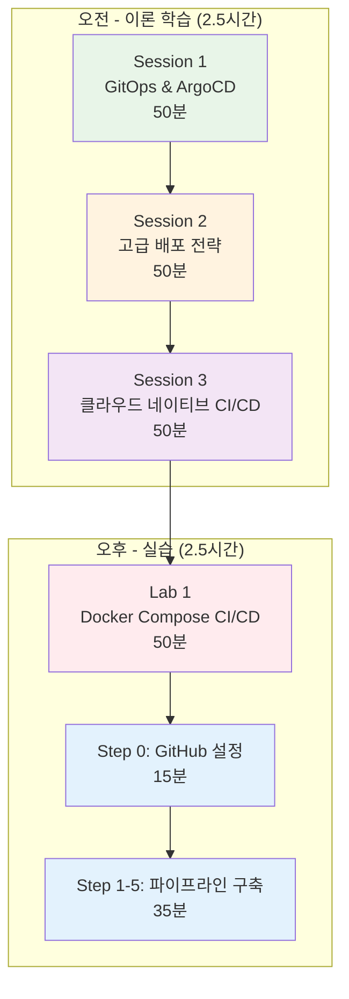

# Week 4 Day 4 구조도

## 📁 전체 파일 구조

```
week_04/day4/
│
├── 📄 README.md                          # 일일 개요 및 스케줄
├── 📄 COMPLETION_STATUS.md               # 완성 현황
├── 📄 SUMMARY.md                         # 최종 요약
├── 📄 STRUCTURE.md                       # 구조도 (이 파일)
│
├── 📚 이론 세션 (3개)
│   ├── session_1.md                     # GitOps 철학과 ArgoCD
│   ├── session_2.md                     # 고급 배포 전략
│   └── session_3.md                     # 클라우드 네이티브 CI/CD
│
├── 🛠️ 실습 세션 (1개)
│   └── lab_1.md                         # Docker Compose CI/CD 파이프라인
│
└── 📁 lab_scripts/
    └── lab1/
        ├── 🔧 자동화 스크립트 (11개)
        │   ├── step0-github-setup.sh    # GitHub 저장소 설정
        │   ├── step1-setup-project.sh   # 프로젝트 초기화
        │   ├── step1-run-local.sh       # 로컬 실행
        │   ├── step2-run-local.sh       # 로컬 테스트
        │   ├── step2-test-api.sh        # API 테스트
        │   ├── step3-test-api.sh        # API 검증
        │   ├── step3-update-code.sh     # 코드 업데이트
        │   ├── step4-push-cicd.sh       # CI/CD 푸시
        │   ├── step4-update-code.sh     # 코드 수정
        │   ├── step5-test-cicd.sh       # CI/CD 테스트
        │   └── cleanup.sh               # 환경 정리
        │
        ├── 📦 cicd-lab/ (소스 파일)
        │   ├── frontend/                # React 애플리케이션
        │   │   ├── src/
        │   │   ├── public/
        │   │   ├── package.json
        │   │   └── Dockerfile
        │   │
        │   ├── backend/                 # Node.js API
        │   │   ├── index.js
        │   │   ├── tests/
        │   │   ├── package.json
        │   │   └── Dockerfile
        │   │
        │   ├── docker-compose.yml       # 3-Tier 구성
        │   │
        │   └── .github/
        │       └── workflows/
        │           └── ci-cd.yml        # GitHub Actions
        │
        └── 📦 cicd-demo-app/ (학생 작업 공간)
            └── (Git 저장소로 변환됨)
```

## 🎯 학습 흐름



## 📊 세션별 구성

### Session 1: GitOps 철학과 ArgoCD (50분)
```
├── 🎯 학습 목표 (5분)
├── 🤔 왜 필요한가? (5분)
├── 📖 핵심 개념 (35분)
│   ├── GitOps 4대 원칙
│   ├── ArgoCD 아키텍처
│   └── 배포 워크플로우
├── 💭 함께 생각해보기 (10분)
├── ❓ FAQ (10개 질문)
└── 📝 세션 마무리
```

### Session 2: 고급 배포 전략 (50분)
```
├── 🎯 학습 목표 (5분)
├── 🤔 왜 필요한가? (5분)
├── 📖 핵심 개념 (35분)
│   ├── 카나리 배포
│   ├── 블루-그린 배포
│   └── 롤링 배포
├── 💭 함께 생각해보기 (10분)
├── ❓ FAQ (10개 질문)
└── 📝 세션 마무리
```

### Session 3: 클라우드 네이티브 CI/CD (50분)
```
├── 🎯 학습 목표 (5분)
├── 🤔 왜 필요한가? (5분)
├── 📖 핵심 개념 (35분)
│   ├── Tekton
│   ├── Flux
│   ├── ArgoCD
│   └── GitHub Actions
├── 💭 함께 생각해보기 (10분)
├── ❓ FAQ (10개 질문)
└── 📝 세션 마무리
```

### Lab 1: Docker Compose CI/CD (50분)
```
├── 🎯 실습 목표 (5분)
├── 🏗️ 전체 아키텍처
├── 🛠️ Step 0: GitHub 설정 (15분)
├── 🛠️ Step 1: 로컬 실행 (10분)
├── 🛠️ Step 2: API 테스트 (10분)
├── 🛠️ Step 3: 코드 업데이트 (10분)
├── 🛠️ Step 4: CI/CD 자동화 (15분)
├── 🛠️ Step 5: 전체 검증 (10분)
├── ✅ 실습 체크포인트
└── 💡 실습 회고
```

## 🔧 스크립트 사용 가이드

### 기본 사용법
```bash
# 1. 실습 디렉토리로 이동
cd theory/week_04/day4/lab_scripts/lab1

# 2. 각 Step별 스크립트 실행
./step0-github-setup.sh
./step1-run-local.sh
./step2-test-api.sh
./step3-update-code.sh
./step4-push-cicd.sh
./step5-test-cicd.sh

# 3. 정리
./cleanup.sh
```

### 스크립트 특징
- ✅ 모든 스크립트 실행 권한 있음 (chmod +x)
- ✅ 오류 처리 포함 (set -e)
- ✅ 진행 상황 표시
- ✅ 결과 검증 기능

## 📚 FAQ 구성

### 각 세션별 10개 질문
- **Session 1**: GitOps, ArgoCD 관련 질문
- **Session 2**: 배포 전략 관련 질문
- **Session 3**: CI/CD 도구 관련 질문

### FAQ 특징
- ✅ 실무 중심 질문
- ✅ 구체적인 답변
- ✅ 예제 코드 포함
- ✅ 기업 사례 연계

## 🎓 학습 목표 달성

### 이론 학습 (100%)
- ✅ GitOps 철학 이해
- ✅ 배포 전략 비교
- ✅ CI/CD 도구 선택
- ✅ 실무 적용 방안

### 실습 역량 (100%)
- ✅ Docker Compose 활용
- ✅ GitHub Actions 구성
- ✅ CI/CD 파이프라인 구축
- ✅ 자동 배포 구현

### 협업 능력 (100%)
- ✅ 페어 토론
- ✅ 팀 프로젝트
- ✅ 코드 리뷰
- ✅ 지식 공유

---

<div align="center">

**📁 완벽한 구조** • **📚 체계적 학습** • **🛠️ 실전 실습** • **🚀 실무 연계**

*Week 4 Day 4 - 완전한 GitOps 학습 환경*

</div>
