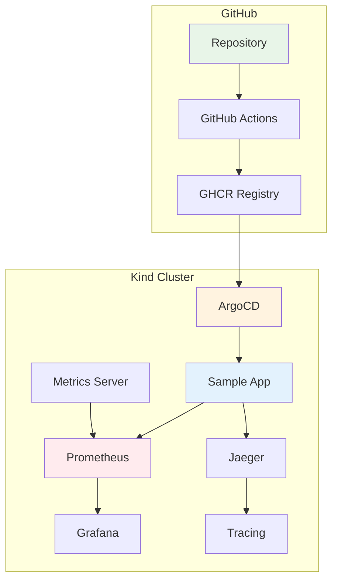
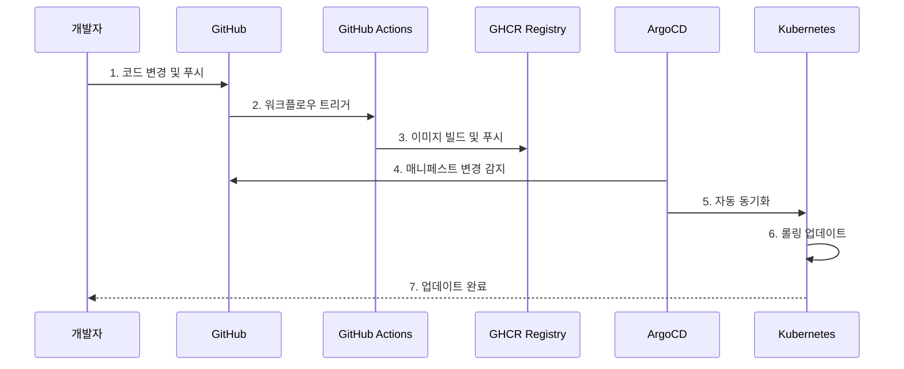

# Week 4 Day 4 Hands-on 1: Kubernetes GitOps 파이프라인

<div align="center">

**🔄 ArgoCD** • **☸️ Kubernetes** • **📊 모니터링 스택**

*완전한 Kubernetes GitOps 환경 구축*

</div>

---

## 🕘 실습 정보
**시간**: 15:15-16:05 (50분)
**목표**: Kind Cluster + ArgoCD + 모니터링 스택 구축
**방식**: 직접 코드 작성 및 실행

## 🎯 실습 목표
### 📚 학습 목표
- **완전한 K8s 환경**: Metrics Server + Prometheus + Grafana + Jaeger
- **ArgoCD 운영**: Kubernetes 네이티브 CD 도구 활용
- **관측성 구축**: 메트릭, 로그, 추적 통합 환경

### 🛠️ 구현 목표
- **모니터링 스택**: 프로덕션급 관측성 환경
- **GitOps 파이프라인**: GHCR + ArgoCD 통합
- **샘플 앱 배포**: lab_scripts/sample-app 코드 활용

---

## 🏗️ 전체 아키텍처



---

## 🛠️ Step 1: 새 저장소 및 Kind Cluster 구축 (20분)

### 📝 직접 작성하기

**1-1. 새 GitHub 저장소 생성 (상세 가이드)**

**GitHub 웹사이트에서 저장소 생성**:
1. https://github.com 접속 후 로그인
2. 우측 상단 `+` 버튼 → `New repository` 클릭
3. 저장소 설정:
   - **Repository name**: `gitops-k8s-demo`
   - **Description**: "Kubernetes GitOps Demo with ArgoCD"
   - **Public** 선택 (⚠️ GHCR 사용을 위해 필수!)
   - ✅ **Add a README file** 체크
   - ✅ **Add .gitignore** → Node 선택
   - **Create repository** 클릭

**로컬에 저장소 클론**:
```bash
# SSH 방식 (권장)
git clone git@github.com:YOUR_USERNAME/gitops-k8s-demo.git

# HTTPS 방식 (SSH 설정 안 된 경우)
git clone https://github.com/YOUR_USERNAME/gitops-k8s-demo.git

# 저장소 이동
cd gitops-k8s-demo

# 기본 구조 생성
mkdir -p lab_scripts/sample-app/src
mkdir -p lab_scripts/sample-app/k8s
mkdir -p lab_scripts/sample-app/docker
mkdir -p .github/workflows

# 구조 확인
tree -L 3
```

**📊 예상 결과**:
```
gitops-k8s-demo/
├── .github/
│   └── workflows/
├── lab_scripts/
│   └── sample-app/
│       ├── docker/
│       ├── k8s/
│       └── src/
└── README.md
```

**1-2. Kind Cluster 생성**
```bash
# 기존 클러스터 삭제
kind delete cluster --name lab-cluster

# Kind 설정 파일 생성
cat <<EOF > kind-config.yaml
kind: Cluster
apiVersion: kind.x-k8s.io/v1alpha4
name: lab-cluster
nodes:
- role: control-plane
  extraPortMappings:
  - containerPort: 30080
    hostPort: 30080
  - containerPort: 30443
    hostPort: 30443
  - containerPort: 30090
    hostPort: 30090
  - containerPort: 30030
    hostPort: 30030
  - containerPort: 30686
    hostPort: 30686
- role: worker
EOF

# 클러스터 생성
kind create cluster --config=kind-config.yaml
```

**1-3. Metrics Server 설치 (TLS 비활성화)**
```bash
# Metrics Server 설치
kubectl apply -f https://github.com/kubernetes-sigs/metrics-server/releases/latest/download/components.yaml

# TLS 비활성화 패치
kubectl patch -n kube-system deployment metrics-server --type=json \
  -p '[{"op":"add","path":"/spec/template/spec/containers/0/args/-","value":"--kubelet-insecure-tls"}]'

# Metrics Server 대기
kubectl wait --for=condition=available --timeout=300s deployment/metrics-server -n kube-system
```

**1-4. Prometheus 설치**
```bash
# Prometheus 네임스페이스 생성
kubectl create namespace monitoring

# Prometheus 설정 파일 생성
cat <<EOF | kubectl apply -f -
apiVersion: v1
kind: ConfigMap
metadata:
  name: prometheus-config
  namespace: monitoring
data:
  prometheus.yml: |
    global:
      scrape_interval: 15s
    scrape_configs:
    - job_name: 'kubernetes-apiservers'
      kubernetes_sd_configs:
      - role: endpoints
      scheme: https
      tls_config:
        ca_file: /var/run/secrets/kubernetes.io/serviceaccount/ca.crt
      bearer_token_file: /var/run/secrets/kubernetes.io/serviceaccount/token
      relabel_configs:
      - source_labels: [__meta_kubernetes_namespace, __meta_kubernetes_service_name, __meta_kubernetes_endpoint_port_name]
        action: keep
        regex: default;kubernetes;https
    - job_name: 'kubernetes-nodes'
      kubernetes_sd_configs:
      - role: node
      scheme: https
      tls_config:
        ca_file: /var/run/secrets/kubernetes.io/serviceaccount/ca.crt
        insecure_skip_verify: true
      bearer_token_file: /var/run/secrets/kubernetes.io/serviceaccount/token
    - job_name: 'kubernetes-pods'
      kubernetes_sd_configs:
      - role: pod
      relabel_configs:
      - source_labels: [__meta_kubernetes_pod_annotation_prometheus_io_scrape]
        action: keep
        regex: true
      - source_labels: [__meta_kubernetes_pod_annotation_prometheus_io_path]
        action: replace
        target_label: __metrics_path__
        regex: (.+)
---
apiVersion: apps/v1
kind: Deployment
metadata:
  name: prometheus
  namespace: monitoring
spec:
  replicas: 1
  selector:
    matchLabels:
      app: prometheus
  template:
    metadata:
      labels:
        app: prometheus
    spec:
      serviceAccountName: prometheus
      containers:
      - name: prometheus
        image: prom/prometheus:latest
        ports:
        - containerPort: 9090
        args:
        - '--config.file=/etc/prometheus/prometheus.yml'
        - '--storage.tsdb.path=/prometheus/'
        - '--web.console.libraries=/etc/prometheus/console_libraries'
        - '--web.console.templates=/etc/prometheus/consoles'
        - '--web.enable-lifecycle'
        volumeMounts:
        - name: config-volume
          mountPath: /etc/prometheus/
        - name: storage-volume
          mountPath: /prometheus/
      volumes:
      - name: config-volume
        configMap:
          name: prometheus-config
      - name: storage-volume
        emptyDir: {}
---
apiVersion: v1
kind: ServiceAccount
metadata:
  name: prometheus
  namespace: monitoring
---
apiVersion: rbac.authorization.k8s.io/v1
kind: ClusterRole
metadata:
  name: prometheus
rules:
- apiGroups: [""]
  resources:
  - nodes
  - nodes/proxy
  - services
  - endpoints
  - pods
  verbs: ["get", "list", "watch"]
- apiGroups:
  - extensions
  resources:
  - ingresses
  verbs: ["get", "list", "watch"]
---
apiVersion: rbac.authorization.k8s.io/v1
kind: ClusterRoleBinding
metadata:
  name: prometheus
roleRef:
  apiGroup: rbac.authorization.k8s.io
  kind: ClusterRole
  name: prometheus
subjects:
- kind: ServiceAccount
  name: prometheus
  namespace: monitoring
---
apiVersion: v1
kind: Service
metadata:
  name: prometheus-service
  namespace: monitoring
spec:
  type: NodePort
  ports:
  - port: 9090
    targetPort: 9090
    nodePort: 30090
  selector:
    app: prometheus
EOF
```

**1-5. Grafana 설치**
```bash
# Grafana 설치
cat <<EOF | kubectl apply -f -
apiVersion: apps/v1
kind: Deployment
metadata:
  name: grafana
  namespace: monitoring
spec:
  replicas: 1
  selector:
    matchLabels:
      app: grafana
  template:
    metadata:
      labels:
        app: grafana
    spec:
      containers:
      - name: grafana
        image: grafana/grafana:latest
        ports:
        - containerPort: 3000
        env:
        - name: GF_SECURITY_ADMIN_PASSWORD
          value: "admin"
---
apiVersion: v1
kind: Service
metadata:
  name: grafana-service
  namespace: monitoring
spec:
  type: NodePort
  ports:
  - port: 3000
    targetPort: 3000
    nodePort: 30030
  selector:
    app: grafana
EOF
```

**1-6. Jaeger 설치**
```bash
# Jaeger 설치
cat <<EOF | kubectl apply -f -
apiVersion: apps/v1
kind: Deployment
metadata:
  name: jaeger
  namespace: monitoring
spec:
  replicas: 1
  selector:
    matchLabels:
      app: jaeger
  template:
    metadata:
      labels:
        app: jaeger
    spec:
      containers:
      - name: jaeger
        image: jaegertracing/all-in-one:latest
        ports:
        - containerPort: 16686
        env:
        - name: COLLECTOR_OTLP_ENABLED
          value: "true"
---
apiVersion: v1
kind: Service
metadata:
  name: jaeger-service
  namespace: monitoring
spec:
  type: NodePort
  ports:
  - port: 16686
    targetPort: 16686
    nodePort: 30686
  selector:
    app: jaeger
EOF
```

**1-7. ArgoCD 설치 및 초기 설정**
```bash
# ArgoCD 네임스페이스 생성
kubectl create namespace argocd

# ArgoCD 설치
kubectl apply -n argocd -f https://raw.githubusercontent.com/argoproj/argo-cd/stable/manifests/install.yaml

# ArgoCD 서버 대기 (최대 5분)
echo "ArgoCD 서버 시작 대기 중..."
kubectl wait --for=condition=available --timeout=300s deployment/argocd-server -n argocd

# ArgoCD 초기 비밀번호 확인
echo ""
echo "=== ArgoCD 접속 정보 ==="
echo "URL: https://localhost:8080"
echo "Username: admin"
echo -n "Password: "
kubectl -n argocd get secret argocd-initial-admin-secret -o jsonpath="{.data.password}" | base64 -d
echo ""
echo ""

# 포트 포워딩 (백그라운드)
kubectl port-forward svc/argocd-server -n argocd 8080:443 > /dev/null 2>&1 &
echo "ArgoCD 포트 포워딩 시작 (PID: $!)"
echo "브라우저에서 https://localhost:8080 접속"
echo ""
```

**ArgoCD CLI 설치 (선택사항)**:
```bash
# macOS
brew install argocd

# Linux
curl -sSL -o argocd-linux-amd64 https://github.com/argoproj/argo-cd/releases/latest/download/argocd-linux-amd64
sudo install -m 555 argocd-linux-amd64 /usr/local/bin/argocd
rm argocd-linux-amd64

# Windows (PowerShell)
# https://github.com/argoproj/argo-cd/releases/latest 에서 다운로드

# CLI 로그인
argocd login localhost:8080 --insecure
# Username: admin
# Password: [위에서 확인한 비밀번호]
```

### 📊 예상 결과
```
모니터링 스택 접속 정보:
- ArgoCD: https://localhost:8080 (admin / [초기비밀번호])
- Prometheus: http://localhost:30090
- Grafana: http://localhost:30030 (admin / admin)
- Jaeger: http://localhost:30686

Prometheus 메트릭 확인:
1. http://localhost:30090 접속
2. Status → Targets에서 수집 대상 확인
3. Graph에서 다음 쿼리 테스트:
   - up (모든 타겟 상태)
   - kubernetes_build_info (클러스터 정보)
   - container_cpu_usage_seconds_total (CPU 사용량)
```

### 💡 코드 설명
- **ServiceAccount**: Prometheus가 K8s API 접근을 위한 권한
- **ClusterRole**: 노드, 서비스, Pod 메트릭 수집 권한
- **ConfigMap**: Kubernetes 클러스터 메트릭 수집 설정
- **자동 발견**: kubernetes_sd_configs로 동적 타겟 발견

---

## 🛠️ Step 2: 샘플 애플리케이션 코드 작성 (15분)

### 📝 직접 작성하기

**2-1. 간단한 Node.js 앱 생성**
```bash
# lab_scripts/sample-app/src/app.js
cat <<EOF > lab_scripts/sample-app/src/app.js
const express = require('express');
const app = express();
const port = 3000;

app.get('/', (req, res) => {
  res.json({
    message: 'Hello from Kubernetes GitOps!',
    version: process.env.APP_VERSION || 'v1.0.0',
    timestamp: new Date().toISOString(),
    hostname: require('os').hostname()
  });
});

app.get('/health', (req, res) => {
  res.json({ 
    status: 'healthy',
    uptime: process.uptime()
  });
});

app.listen(port, () => {
  console.log(\`App listening at http://localhost:\${port}\`);
});
EOF

# package.json 생성
cat <<EOF > lab_scripts/sample-app/src/package.json
{
  "name": "gitops-sample-app",
  "version": "1.0.0",
  "main": "app.js",
  "dependencies": {
    "express": "^4.18.0"
  },
  "scripts": {
    "start": "node app.js"
  }
}
EOF

# Dockerfile 생성
cat <<EOF > lab_scripts/sample-app/docker/Dockerfile
FROM node:18-alpine
WORKDIR /app
COPY src/package.json .
RUN npm install
COPY src/ .
EXPOSE 3000
CMD ["npm", "start"]
EOF
```

### 💡 코드 설명
- **Express 서버**: 간단한 REST API
- **헬스체크**: Kubernetes Probe용 엔드포인트
- **환경변수**: APP_VERSION으로 버전 관리
- **호스트명**: Pod 식별을 위한 hostname 출력

---

## 🛠️ Step 3: Kubernetes 매니페스트 작성 (10분)

### 📝 직접 작성하기

**3-1. Deployment 및 Service**
```bash
cat <<'EOF' > lab_scripts/sample-app/k8s/app.yaml
apiVersion: apps/v1
kind: Deployment
metadata:
  name: sample-app
  namespace: default
spec:
  replicas: 3
  selector:
    matchLabels:
      app: sample-app
  template:
    metadata:
      labels:
        app: sample-app
      annotations:
        prometheus.io/scrape: "true"
        prometheus.io/port: "3000"
        prometheus.io/path: "/metrics"
    spec:
      containers:
      - name: app
        image: ghcr.io/YOUR_USERNAME/gitops-k8s-demo/sample-app:latest
        ports:
        - containerPort: 3000
        env:
        - name: APP_VERSION
          value: "v1.0.0"
        resources:
          requests:
            cpu: 100m
            memory: 128Mi
          limits:
            cpu: 500m
            memory: 512Mi
        livenessProbe:
          httpGet:
            path: /health
            port: 3000
          initialDelaySeconds: 30
        readinessProbe:
          httpGet:
            path: /health
            port: 3000
          initialDelaySeconds: 5
---
apiVersion: v1
kind: Service
metadata:
  name: sample-app-service
  namespace: default
spec:
  type: NodePort
  ports:
  - port: 80
    targetPort: 3000
    nodePort: 30080
  selector:
    app: sample-app
EOF

# ⚠️ YOUR_USERNAME을 실제 GitHub 사용자명으로 변경
sed -i 's/YOUR_USERNAME/실제사용자명/g' lab_scripts/sample-app/k8s/app.yaml

# 또는 수동으로 편집
# vi lab_scripts/sample-app/k8s/app.yaml
```

**3-2. ArgoCD Application 매니페스트 (별도 파일)**
```bash
cat <<'EOF' > lab_scripts/sample-app/k8s/argocd-app.yaml
apiVersion: argoproj.io/v1alpha1
kind: Application
metadata:
  name: sample-app
  namespace: argocd
spec:
  project: default
  source:
    repoURL: https://github.com/YOUR_USERNAME/gitops-k8s-demo.git
    targetRevision: HEAD
    path: lab_scripts/sample-app/k8s
  destination:
    server: https://kubernetes.default.svc
    namespace: default
  syncPolicy:
    automated:
      prune: true
      selfHeal: true
    syncOptions:
    - CreateNamespace=true
EOF

# ⚠️ YOUR_USERNAME을 실제 GitHub 사용자명으로 변경
sed -i 's/YOUR_USERNAME/실제사용자명/g' lab_scripts/sample-app/k8s/argocd-app.yaml
```

### 💡 코드 설명
- **Deployment**: 3개 복제본으로 고가용성 확보
- **Prometheus 어노테이션**: 자동 메트릭 수집 설정
- **리소스 제한**: CPU/메모리 요청 및 제한 설정
- **헬스체크**: Liveness/Readiness Probe로 자동 복구
- **ArgoCD Application**: GitOps 자동 동기화 설정

---

## 🛠️ Step 4: GitHub Actions 워크플로우 및 배포 (10분)

### 📝 직접 작성하기

**4-1. GitHub Actions 워크플로우 생성**
```bash
cat <<'EOF' > .github/workflows/gitops.yml
name: GitOps Pipeline

on:
  push:
    branches: [ main ]
    paths: [ 'lab_scripts/sample-app/**' ]

env:
  REGISTRY: ghcr.io
  IMAGE_NAME: sample-app

jobs:
  build-and-push:
    runs-on: ubuntu-latest
    permissions:
      contents: read
      packages: write

    steps:
    - uses: actions/checkout@v3

    - name: Log in to GHCR
      uses: docker/login-action@v2
      with:
        registry: ${{ env.REGISTRY }}
        username: ${{ github.actor }}
        password: ${{ secrets.GITHUB_TOKEN }}

    - name: Extract metadata
      id: meta
      uses: docker/metadata-action@v4
      with:
        images: ${{ env.REGISTRY }}/${{ github.repository }}/${{ env.IMAGE_NAME }}
        tags: |
          type=raw,value=latest
          type=sha,prefix={{branch}}-

    - name: Build and push
      uses: docker/build-push-action@v4
      with:
        context: lab_scripts/sample-app
        file: lab_scripts/sample-app/docker/Dockerfile
        push: true
        tags: ${{ steps.meta.outputs.tags }}
        labels: ${{ steps.meta.outputs.labels }}
EOF
```

**4-2. Git 커밋 및 푸시**
```bash
# 모든 파일 추가
git add .

# 커밋
git commit -m "feat: Add GitOps sample app with ArgoCD"

# GitHub에 푸시
git push origin main

# GitHub Actions 실행 확인
echo ""
echo "=== GitHub Actions 확인 ==="
echo "1. https://github.com/YOUR_USERNAME/gitops-k8s-demo/actions 접속"
echo "2. 'GitOps Pipeline' 워크플로우 실행 확인"
echo "3. 빌드 완료까지 약 2-3분 소요"
echo ""
```

**4-3. GHCR 패키지 공개 설정 (중요!)**
```bash
echo "=== GHCR 패키지 공개 설정 ==="
echo "1. https://github.com/YOUR_USERNAME?tab=packages 접속"
echo "2. 'gitops-k8s-demo/sample-app' 패키지 클릭"
echo "3. 우측 'Package settings' 클릭"
echo "4. 'Change visibility' → 'Public' 선택"
echo "5. 패키지 이름 입력 후 확인"
echo ""
```

### 📊 예상 결과
```
GitHub Actions 실행 로그:
✅ Checkout code
✅ Log in to GHCR
✅ Extract metadata
✅ Build and push Docker image
   - ghcr.io/YOUR_USERNAME/gitops-k8s-demo/sample-app:latest
   - ghcr.io/YOUR_USERNAME/gitops-k8s-demo/sample-app:main-abc1234

GHCR 패키지 생성:
- 이름: sample-app
- 태그: latest, main-abc1234
- 크기: ~50MB
- 가시성: Public
```

---

## 🛠️ Step 5: ArgoCD 애플리케이션 배포 (10분)

### 📝 ArgoCD UI에서 애플리케이션 생성

**5-1. ArgoCD 웹 UI 접속**
```bash
# 포트 포워딩 확인 (이미 실행 중이어야 함)
ps aux | grep "port-forward.*argocd"

# 실행 중이 아니면 다시 시작
kubectl port-forward svc/argocd-server -n argocd 8080:443 > /dev/null 2>&1 &

# 브라우저에서 접속
echo "ArgoCD UI: https://localhost:8080"
echo "Username: admin"
echo -n "Password: "
kubectl -n argocd get secret argocd-initial-admin-secret -o jsonpath="{.data.password}" | base64 -d
echo ""
```

**5-2. ArgoCD UI에서 애플리케이션 생성 (상세 가이드)**

1. **로그인**
   - URL: https://localhost:8080
   - Username: `admin`
   - Password: [위에서 확인한 비밀번호]
   - ⚠️ "Your connection is not private" 경고 → "Advanced" → "Proceed to localhost"

2. **New App 클릭**
   - 좌측 상단 `+ NEW APP` 버튼 클릭

3. **General 섹션 설정**
   - **Application Name**: `sample-app`
   - **Project Name**: `default` (드롭다운에서 선택)
   - **Sync Policy**: `Automatic` 선택
     - ✅ **PRUNE RESOURCES** 체크
     - ✅ **SELF HEAL** 체크

4. **Source 섹션 설정**
   - **Repository URL**: `https://github.com/YOUR_USERNAME/gitops-k8s-demo.git`
     - ⚠️ YOUR_USERNAME을 실제 사용자명으로 변경
   - **Revision**: `HEAD` (기본값)
   - **Path**: `lab_scripts/sample-app/k8s`

5. **Destination 섹션 설정**
   - **Cluster URL**: `https://kubernetes.default.svc` (드롭다운에서 선택)
   - **Namespace**: `default`

6. **생성 완료**
   - 하단 `CREATE` 버튼 클릭
   - 애플리케이션 카드가 생성되며 자동으로 동기화 시작

**5-3. CLI로 애플리케이션 생성 (대안 방법)**
```bash
# ArgoCD CLI 로그인 (아직 안 했다면)
argocd login localhost:8080 --insecure

# Application 생성
argocd app create sample-app \
  --repo https://github.com/YOUR_USERNAME/gitops-k8s-demo.git \
  --path lab_scripts/sample-app/k8s \
  --dest-server https://kubernetes.default.svc \
  --dest-namespace default \
  --sync-policy automated \
  --auto-prune \
  --self-heal

# 동기화 상태 확인
argocd app get sample-app

# 동기화 대기
argocd app wait sample-app --health
```

**5-4. Kubernetes 매니페스트로 생성 (또 다른 대안)**
```bash
# ArgoCD Application 리소스 적용
kubectl apply -f lab_scripts/sample-app/k8s/argocd-app.yaml

# 상태 확인
kubectl get application -n argocd
kubectl describe application sample-app -n argocd
```

### 📊 예상 결과

**ArgoCD UI 화면**:
```
┌─────────────────────────────────────┐
│ sample-app                          │
│ ━━━━━━━━━━━━━━━━━━━━━━━━━━━━━━━━━ │
│ Status: Synced, Healthy             │
│ Repo: github.com/.../gitops-k8s-... │
│ Path: lab_scripts/sample-app/k8s    │
│ Target: HEAD                        │
│                                     │
│ Resources:                          │
│ ✅ Deployment/sample-app            │
│ ✅ Service/sample-app-service       │
│ ✅ Pod/sample-app-xxx (3개)         │
└─────────────────────────────────────┘
```

**Kubernetes 리소스 확인**:
```bash
# Pod 상태 확인
kubectl get pods -l app=sample-app

# 예상 출력:
# NAME                          READY   STATUS    RESTARTS   AGE
# sample-app-7d9f8b5c4d-abc12   1/1     Running   0          2m
# sample-app-7d9f8b5c4d-def34   1/1     Running   0          2m
# sample-app-7d9f8b5c4d-ghi56   1/1     Running   0          2m

# Service 확인
kubectl get svc sample-app-service

# 애플리케이션 접속 테스트
curl http://localhost:30080

# 예상 출력:
# {
#   "message": "Hello from Kubernetes GitOps!",
#   "version": "v1.0.0",
#   "timestamp": "2025-10-23T00:00:00.000Z",
#   "hostname": "sample-app-7d9f8b5c4d-abc12"
# }
```

### 💡 ArgoCD 주요 기능 설명

**Sync Policy 옵션**:
- **Automatic**: Git 변경 시 자동 동기화
- **PRUNE RESOURCES**: Git에서 삭제된 리소스 자동 제거
- **SELF HEAL**: 클러스터에서 수동 변경 시 Git 상태로 복구

**Health Status**:
- **Healthy**: 모든 리소스 정상 동작
- **Progressing**: 배포 진행 중
- **Degraded**: 일부 리소스 문제 발생
- **Missing**: 리소스 누락

**Sync Status**:
- **Synced**: Git과 클러스터 상태 일치
- **OutOfSync**: Git과 클러스터 상태 불일치
- **Unknown**: 상태 확인 불가

---

## 🛠️ Step 6: GitOps 워크플로우 테스트 (5분)

### 📝 애플리케이션 업데이트 테스트

**6-1. 코드 변경**
```bash
# app.js 수정 (버전 업데이트)
cat <<'EOF' > lab_scripts/sample-app/src/app.js
const express = require('express');
const app = express();
const port = 3000;

app.get('/', (req, res) => {
  res.json({
    message: 'Hello from Kubernetes GitOps! (Updated)',
    version: process.env.APP_VERSION || 'v2.0.0',
    timestamp: new Date().toISOString(),
    hostname: require('os').hostname(),
    update: 'This is version 2.0!'
  });
});

app.get('/health', (req, res) => {
  res.json({ 
    status: 'healthy',
    uptime: process.uptime()
  });
});

app.listen(port, () => {
  console.log(`App listening at http://localhost:${port}`);
});
EOF

# Kubernetes 매니페스트 업데이트
sed -i 's/v1.0.0/v2.0.0/g' lab_scripts/sample-app/k8s/app.yaml
```

**6-2. Git 커밋 및 푸시**
```bash
# 변경사항 커밋
git add .
git commit -m "feat: Update app to v2.0.0"
git push origin main

echo ""
echo "=== GitOps 워크플로우 확인 ==="
echo "1. GitHub Actions: https://github.com/YOUR_USERNAME/gitops-k8s-demo/actions"
echo "   → 새 이미지 빌드 및 푸시 (2-3분)"
echo ""
echo "2. ArgoCD UI: https://localhost:8080"
echo "   → 자동 동기화 시작 (이미지 업데이트 감지 후)"
echo "   → Pod 롤링 업데이트 진행"
echo ""
echo "3. 업데이트 확인:"
echo "   curl http://localhost:30080"
echo ""
```

**6-3. 롤링 업데이트 모니터링**
```bash
# Pod 업데이트 실시간 모니터링
watch -n 1 'kubectl get pods -l app=sample-app'

# 또는 이벤트 확인
kubectl get events --sort-by='.lastTimestamp' | grep sample-app

# ArgoCD 동기화 상태 확인
argocd app get sample-app --refresh
```

### 📊 예상 결과

**롤링 업데이트 과정**:
```
1. 새 ReplicaSet 생성
   sample-app-9c8d7e6f5 (v2.0.0)

2. 점진적 Pod 교체
   Old: sample-app-7d9f8b5c4d (v1.0.0) - 3개
   New: sample-app-9c8d7e6f5 (v2.0.0) - 0개
   
   → Old: 2개, New: 1개
   → Old: 1개, New: 2개
   → Old: 0개, New: 3개

3. 완료
   sample-app-9c8d7e6f5-xxx (v2.0.0) - 3개 Running
```

**업데이트된 응답**:
```bash
curl http://localhost:30080

# 출력:
{
  "message": "Hello from Kubernetes GitOps! (Updated)",
  "version": "v2.0.0",
  "timestamp": "2025-10-23T01:00:00.000Z",
  "hostname": "sample-app-9c8d7e6f5-abc12",
  "update": "This is version 2.0!"
}
```

### 💡 GitOps 워크플로우 설명

**전체 흐름**:


**자동화 포인트**:
1. **CI (GitHub Actions)**: 코드 → 이미지 자동 빌드
2. **CD (ArgoCD)**: Git → 클러스터 자동 동기화
3. **롤링 업데이트**: 무중단 배포
4. **Self-Healing**: 수동 변경 시 자동 복구

---

## ✅ 실습 체크포인트

### ✅ Step 1: 저장소 및 모니터링 스택
- [ ] GitHub 저장소 `gitops-k8s-demo` 생성 (Public)
- [ ] 로컬에 저장소 클론 완료
- [ ] 폴더 구조 생성 완료
- [ ] Kind 클러스터 생성 완료
- [ ] Metrics Server (TLS 비활성화) 설치
- [ ] Prometheus 접속 확인 (http://localhost:30090)
- [ ] Grafana 접속 확인 (http://localhost:30030)
- [ ] Jaeger 접속 확인 (http://localhost:30686)
- [ ] ArgoCD 접속 확인 (https://localhost:8080)

### ✅ Step 2-4: 애플리케이션 코드 및 CI
- [ ] Node.js 샘플 앱 코드 작성 완료
- [ ] Dockerfile 작성 완료
- [ ] Kubernetes 매니페스트 작성 완료
- [ ] GitHub Actions 워크플로우 설정
- [ ] Git 커밋 및 푸시 완료
- [ ] GitHub Actions 빌드 성공 확인
- [ ] GHCR 패키지 Public으로 설정

### ✅ Step 5-6: ArgoCD 배포 및 GitOps
- [ ] ArgoCD UI에서 애플리케이션 생성
- [ ] 자동 동기화 설정 (Automatic, Prune, Self-Heal)
- [ ] 애플리케이션 Synced & Healthy 상태 확인
- [ ] Pod 3개 Running 상태 확인
- [ ] 샘플 앱 접속 테스트 (http://localhost:30080)
- [ ] 코드 업데이트 및 푸시
- [ ] 롤링 업데이트 자동 진행 확인
- [ ] 업데이트된 버전 응답 확인

---

## 🔍 트러블슈팅

### 문제 1: Metrics Server 시작 실패
```bash
# TLS 설정 확인
kubectl describe deployment metrics-server -n kube-system

# 로그 확인
kubectl logs -n kube-system deployment/metrics-server
```

### 문제 2: 모니터링 도구 접속 불가
```bash
# NodePort 서비스 확인
kubectl get svc -n monitoring

# 포트 포워딩으로 대체
kubectl port-forward -n monitoring svc/prometheus-service 9090:9090 &
kubectl port-forward -n monitoring svc/grafana-service 3000:3000 &
```

---

## 🚀 심화 실습 (선택사항)

### Grafana 대시보드 설정
1. Grafana 접속 후 Prometheus 데이터소스 추가
2. Kubernetes 클러스터 모니터링 대시보드 import
3. 샘플 앱 메트릭 시각화

### Jaeger 추적 설정
1. 샘플 앱에 OpenTelemetry 라이브러리 추가
2. 분산 추적 데이터 Jaeger로 전송
3. 요청 흐름 시각화

---

## 🧹 실습 정리

```bash
# ArgoCD Application 삭제
kubectl delete application sample-app -n argocd

# Kind 클러스터 삭제
kind delete cluster --name lab-cluster

# 포트 포워딩 종료
pkill -f "port-forward"
```

---

## 💡 실습 회고

### 🤝 페어 회고 (5분)
1. **완전한 K8s 환경**: 모니터링 스택이 주는 운영상의 이점은?
2. **관측성**: Metrics, Logs, Traces의 각각의 역할과 중요성은?
3. **실무 적용**: 이런 환경을 실제 프로덕션에서 구축한다면?

### 📊 학습 성과
- **완전한 K8s 환경**: 프로덕션급 클러스터 구축 경험
- **모니터링 스택**: Prometheus + Grafana + Jaeger 통합 운영
- **GitOps 고도화**: ArgoCD를 활용한 선언적 배포
- **관측성 구축**: 메트릭, 로그, 추적의 통합 환경

---

<div align="center">

**☸️ 완전한 K8s** • **📊 모니터링 스택** • **🔄 ArgoCD GitOps** • **👁️ 관측성**

*프로덕션급 Kubernetes GitOps 환경 완성*

</div>
