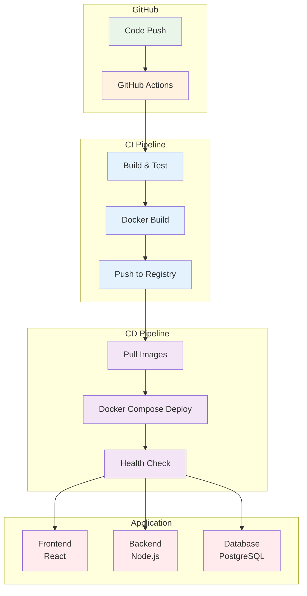

# Week 4 Day 4 Lab 1: Docker Compose 기반 CI/CD 파이프라인 구축

<div align="center">

**🔄 GitHub Actions** • **🐳 Docker Compose** • **🚀 자동 배포**

*Docker Compose 애플리케이션의 완전 자동화된 CI/CD 구축*

</div>

---

## 🕘 실습 정보
**시간**: 12:00-12:50 (50분)
**목표**: Docker Compose 기반 마이크로서비스의 CI/CD 파이프라인 구축
**방식**: GitHub Actions + Docker Compose + 자동 배포

## 🎯 실습 목표

### 📚 학습 목표
- **CI 파이프라인**: GitHub Actions로 빌드/테스트 자동화
- **CD 파이프라인**: Docker Compose 기반 자동 배포
- **통합 워크플로우**: 코드 푸시부터 배포까지 완전 자동화

### 🛠️ 구현 목표
- 3-Tier 애플리케이션 (Frontend, Backend, Database)
- GitHub Actions CI/CD 파이프라인
- Docker Compose 기반 배포 자동화
- 헬스체크 및 롤백 메커니즘

---

## 🏗️ 전체 아키텍처



---

## 🛠️ Step 0: 개인 GitHub 저장소 생성 및 CI/CD 시작 (15분)

### 🎯 목표
**학생 개인의 GitHub 저장소에 코드를 푸시하여 실제 CI/CD 파이프라인 실행**

### 🎯 사전 준비사항
- ✅ GitHub 계정 (https://github.com)
- ✅ Git 설치: `git --version`
- ✅ GitHub Personal Access Token (PAT) 생성
  - https://github.com/settings/tokens
  - "Generate new token (classic)" 클릭
  - Scopes: `repo` 전체 선택
  - Token 복사 (한 번만 표시됨!)

### 🚀 자동화 스크립트 사용

```bash
cd theory/week_04/day4/lab_scripts/lab1
./step0-github-setup.sh
```

**📋 스크립트 내용**: [step0-github-setup.sh](./lab_scripts/lab1/step0-github-setup.sh)

**스크립트 실행 과정**:
1. GitHub 사용자 이름 입력
2. 프로젝트 파일 복사
3. Git 초기화 및 커밋
4. 웹에서 GitHub 저장소 생성 (안내)
5. 코드 푸시 (PAT 인증 필요)
6. GitHub Actions 자동 실행!

### 📝 수동 실행 (학습용)

**0-1. 작업 디렉토리 생성**
```bash
mkdir cicd-demo-app
cd cicd-demo-app
```

**0-2. 프로젝트 파일 복사**
```bash
# lab_scripts/lab1/cicd-lab의 모든 파일 복사
cp -r ../lab_scripts/lab1/cicd-lab/* .
cp -r ../lab_scripts/lab1/cicd-lab/.github .
cp ../lab_scripts/lab1/cicd-lab/.gitignore .
```

**0-3. Git 초기화**
```bash
git init
git add .
git commit -m "Initial commit: CI/CD Demo Application"
```

**0-4. GitHub 저장소 생성 (웹)**
1. https://github.com/new 접속
2. Repository name: `cicd-demo-app`
3. **Public** 선택
4. ⚠️ **"Add a README file" 체크 해제** (중요!)
5. "Create repository" 클릭

**0-5. Remote 추가 및 푸시**
```bash
# YOUR_USERNAME을 본인 GitHub 사용자명으로 변경
git remote add origin https://github.com/YOUR_USERNAME/cicd-demo-app.git
git branch -M main
git push -u origin main

# 인증 시 Personal Access Token 사용
# Username: YOUR_USERNAME
# Password: ghp_xxxxxxxxxxxx (생성한 PAT)
```

**0-6. GitHub Actions 확인**
```bash
# 브라우저에서 확인
https://github.com/YOUR_USERNAME/cicd-demo-app/actions
```

### 📊 예상 결과

**GitHub Actions 자동 실행**:
```
✅ Test Job
  ├─ Backend 테스트 통과
  └─ Frontend 테스트 통과

✅ Build Job
  ├─ Frontend 이미지 빌드
  └─ Backend 이미지 빌드

✅ Deploy Job
  └─ 배포 알림 성공
```

### 💡 중요 포인트

**이제 여러분의 저장소입니다!**
- ✅ 코드 변경 후 `git push`하면 자동으로 CI/CD 실행
- ✅ Actions 탭에서 실시간 로그 확인 가능
- ✅ 실패 시 이메일 알림 (GitHub 설정)
- ✅ 실제 프로젝트처럼 협업 가능

---

## 🛠️ Step 1: 로컬 환경 테스트 (10분)

### 🚀 자동화 스크립트 사용

```bash
cd theory/week_04/day4/lab_scripts/lab1
./step1-setup-project.sh
```

**📋 스크립트 내용**: [step1-setup-project.sh](./lab_scripts/lab1/step1-setup-project.sh)

### 📝 수동 실행 (학습용)

```bash
# 기존 프로젝트 정리
rm -rf ~/cicd-lab

# 프로젝트 디렉토리 생성
mkdir -p ~/cicd-lab
cd ~/cicd-lab

# 프로젝트 구조 생성
mkdir -p frontend/src backend/src .github/workflows
```

**디렉토리 구조**:
```
cicd-lab/
├── frontend/
│   ├── Dockerfile
│   ├── package.json
│   └── src/
├── backend/
│   ├── Dockerfile
│   ├── package.json
│   └── src/
├── docker-compose.yml
├── docker-compose.prod.yml
└── .github/
    └── workflows/
        └── ci-cd.yml
```

---

## 🛠️ Step 2: 애플리케이션 코드 작성 (10분)

### 📝 Frontend (React)

**frontend/package.json**:
```json
{
  "name": "frontend",
  "version": "1.0.0",
  "scripts": {
    "start": "react-scripts start",
    "build": "react-scripts build",
    "test": "react-scripts test --watchAll=false"
  },
  "dependencies": {
    "react": "^18.2.0",
    "react-dom": "^18.2.0",
    "react-scripts": "5.0.1"
  }
}
```

**frontend/src/App.js**:
```javascript
import React, { useState, useEffect } from 'react';

function App() {
  const [message, setMessage] = useState('');
  const [users, setUsers] = useState([]);

  useEffect(() => {
    fetch('/api/health')
      .then(res => res.json())
      .then(data => setMessage(data.message));
    
    fetch('/api/users')
      .then(res => res.json())
      .then(data => setUsers(data));
  }, []);

  return (
    <div style={{ padding: '20px' }}>
      <h1>CI/CD Demo Application</h1>
      <p>Backend Status: {message}</p>
      <h2>Users:</h2>
      <ul>
        {users.map(user => (
          <li key={user.id}>{user.name} - {user.email}</li>
        ))}
      </ul>
    </div>
  );
}

export default App;
```

**frontend/Dockerfile**:
```dockerfile
FROM node:18-alpine AS builder
WORKDIR /app
COPY package*.json ./
RUN npm ci
COPY . .
RUN npm run build

FROM nginx:alpine
COPY --from=builder /app/build /usr/share/nginx/html
COPY nginx.conf /etc/nginx/conf.d/default.conf
EXPOSE 80
CMD ["nginx", "-g", "daemon off;"]
```

**frontend/nginx.conf**:
```nginx
server {
    listen 80;
    location / {
        root /usr/share/nginx/html;
        try_files $uri $uri/ /index.html;
    }
    location /api {
        proxy_pass http://backend:3000;
    }
}
```

### 📝 Backend (Node.js + Express)

**backend/package.json**:
```json
{
  "name": "backend",
  "version": "1.0.0",
  "scripts": {
    "start": "node src/index.js",
    "test": "jest --forceExit"
  },
  "dependencies": {
    "express": "^4.18.2",
    "pg": "^8.11.0"
  },
  "devDependencies": {
    "jest": "^29.5.0",
    "supertest": "^6.3.3"
  }
}
```

**backend/src/index.js**:
```javascript
const express = require('express');
const { Pool } = require('pg');

const app = express();
const port = process.env.PORT || 3000;

const pool = new Pool({
  host: process.env.DB_HOST || 'db',
  port: 5432,
  database: process.env.DB_NAME || 'myapp',
  user: process.env.DB_USER || 'postgres',
  password: process.env.DB_PASSWORD || 'postgres'
});

app.get('/api/health', (req, res) => {
  res.json({ message: 'Backend is healthy!' });
});

app.get('/api/users', async (req, res) => {
  try {
    const result = await pool.query('SELECT * FROM users');
    res.json(result.rows);
  } catch (err) {
    res.status(500).json({ error: err.message });
  }
});

app.listen(port, () => {
  console.log(`Backend listening on port ${port}`);
});

module.exports = app;
```

**backend/src/index.test.js**:
```javascript
const request = require('supertest');
const app = require('./index');

describe('API Tests', () => {
  test('GET /api/health returns healthy status', async () => {
    const response = await request(app).get('/api/health');
    expect(response.status).toBe(200);
    expect(response.body.message).toBe('Backend is healthy!');
  });
});
```

**backend/Dockerfile**:
```dockerfile
FROM node:18-alpine
WORKDIR /app
COPY package*.json ./
RUN npm ci --only=production
COPY . .
EXPOSE 3000
CMD ["npm", "start"]
```

---

## 🛠️ Step 3: Docker Compose 설정 (10분)

### 📝 개발 환경 (docker-compose.yml)

```yaml
version: '3.8'

services:
  frontend:
    build:
      context: ./frontend
      dockerfile: Dockerfile
    ports:
      - "80:80"
    depends_on:
      - backend
    networks:
      - app-network

  backend:
    build:
      context: ./backend
      dockerfile: Dockerfile
    ports:
      - "3000:3000"
    environment:
      - DB_HOST=db
      - DB_NAME=myapp
      - DB_USER=postgres
      - DB_PASSWORD=postgres
    depends_on:
      db:
        condition: service_healthy
    networks:
      - app-network

  db:
    image: postgres:15-alpine
    environment:
      - POSTGRES_DB=myapp
      - POSTGRES_USER=postgres
      - POSTGRES_PASSWORD=postgres
    volumes:
      - db-data:/var/lib/postgresql/data
      - ./init.sql:/docker-entrypoint-initdb.d/init.sql
    healthcheck:
      test: ["CMD-SHELL", "pg_isready -U postgres"]
      interval: 5s
      timeout: 5s
      retries: 5
    networks:
      - app-network

volumes:
  db-data:

networks:
  app-network:
    driver: bridge
```

### 📝 프로덕션 환경 (docker-compose.prod.yml)

```yaml
version: '3.8'

services:
  frontend:
    image: ${DOCKER_REGISTRY}/frontend:${IMAGE_TAG}
    restart: always
    ports:
      - "80:80"
    depends_on:
      - backend
    networks:
      - app-network

  backend:
    image: ${DOCKER_REGISTRY}/backend:${IMAGE_TAG}
    restart: always
    ports:
      - "3000:3000"
    environment:
      - DB_HOST=db
      - DB_NAME=${DB_NAME}
      - DB_USER=${DB_USER}
      - DB_PASSWORD=${DB_PASSWORD}
    depends_on:
      db:
        condition: service_healthy
    networks:
      - app-network

  db:
    image: postgres:15-alpine
    restart: always
    environment:
      - POSTGRES_DB=${DB_NAME}
      - POSTGRES_USER=${DB_USER}
      - POSTGRES_PASSWORD=${DB_PASSWORD}
    volumes:
      - db-data:/var/lib/postgresql/data
    healthcheck:
      test: ["CMD-SHELL", "pg_isready -U ${DB_USER}"]
      interval: 10s
      timeout: 5s
      retries: 5
    networks:
      - app-network

volumes:
  db-data:

networks:
  app-network:
    driver: bridge
```

### 📝 데이터베이스 초기화 (init.sql)

```sql
CREATE TABLE IF NOT EXISTS users (
    id SERIAL PRIMARY KEY,
    name VARCHAR(100) NOT NULL,
    email VARCHAR(100) UNIQUE NOT NULL,
    created_at TIMESTAMP DEFAULT CURRENT_TIMESTAMP
);

INSERT INTO users (name, email) VALUES
    ('Alice', 'alice@example.com'),
    ('Bob', 'bob@example.com'),
    ('Charlie', 'charlie@example.com')
ON CONFLICT (email) DO NOTHING;
```

---

## 🛠️ Step 4: GitHub Actions CI/CD 파이프라인 (15분)

### 📝 CI/CD 워크플로우 (.github/workflows/ci-cd.yml)

```yaml
name: CI/CD Pipeline

on:
  push:
    branches: [ main, develop ]
  pull_request:
    branches: [ main ]

env:
  DOCKER_REGISTRY: ghcr.io
  IMAGE_TAG: ${{ github.sha }}

jobs:
  test:
    name: Run Tests
    runs-on: ubuntu-latest
    
    steps:
      - name: Checkout code
        uses: actions/checkout@v3
      
      - name: Setup Node.js
        uses: actions/setup-node@v3
        with:
          node-version: '18'
      
      - name: Test Backend
        run: |
          cd backend
          npm ci
          npm test
      
      - name: Test Frontend
        run: |
          cd frontend
          npm ci
          npm test

  build:
    name: Build and Push Images
    runs-on: ubuntu-latest
    needs: test
    if: github.event_name == 'push'
    
    steps:
      - name: Checkout code
        uses: actions/checkout@v3
      
      - name: Set up Docker Buildx
        uses: docker/setup-buildx-action@v2
      
      - name: Login to GitHub Container Registry
        uses: docker/login-action@v2
        with:
          registry: ${{ env.DOCKER_REGISTRY }}
          username: ${{ github.actor }}
          password: ${{ secrets.GITHUB_TOKEN }}
      
      - name: Build and push Frontend
        uses: docker/build-push-action@v4
        with:
          context: ./frontend
          push: true
          tags: |
            ${{ env.DOCKER_REGISTRY }}/${{ github.repository }}/frontend:${{ env.IMAGE_TAG }}
            ${{ env.DOCKER_REGISTRY }}/${{ github.repository }}/frontend:latest
          cache-from: type=gha
          cache-to: type=gha,mode=max
      
      - name: Build and push Backend
        uses: docker/build-push-action@v4
        with:
          context: ./backend
          push: true
          tags: |
            ${{ env.DOCKER_REGISTRY }}/${{ github.repository }}/backend:${{ env.IMAGE_TAG }}
            ${{ env.DOCKER_REGISTRY }}/${{ github.repository }}/backend:latest
          cache-from: type=gha
          cache-to: type=gha,mode=max

  deploy:
    name: Deploy to Production
    runs-on: ubuntu-latest
    needs: build
    if: github.ref == 'refs/heads/main'
    
    steps:
      - name: Checkout code
        uses: actions/checkout@v3
      
      - name: Setup SSH
        uses: webfactory/ssh-agent@v0.8.0
        with:
          ssh-private-key: ${{ secrets.SSH_PRIVATE_KEY }}
      
      - name: Deploy with Docker Compose
        run: |
          ssh -o StrictHostKeyChecking=no ${{ secrets.DEPLOY_USER }}@${{ secrets.DEPLOY_HOST }} << 'EOF'
            cd /opt/app
            
            # Pull latest code
            git pull origin main
            
            # Set environment variables
            export DOCKER_REGISTRY=${{ env.DOCKER_REGISTRY }}
            export IMAGE_TAG=${{ env.IMAGE_TAG }}
            export DB_NAME=${{ secrets.DB_NAME }}
            export DB_USER=${{ secrets.DB_USER }}
            export DB_PASSWORD=${{ secrets.DB_PASSWORD }}
            
            # Login to registry
            echo ${{ secrets.GITHUB_TOKEN }} | docker login ${{ env.DOCKER_REGISTRY }} -u ${{ github.actor }} --password-stdin
            
            # Pull new images
            docker-compose -f docker-compose.prod.yml pull
            
            # Deploy with zero-downtime
            docker-compose -f docker-compose.prod.yml up -d --remove-orphans
            
            # Health check
            sleep 10
            curl -f http://localhost/api/health || exit 1
            
            # Cleanup old images
            docker image prune -af
          EOF
      
      - name: Verify Deployment
        run: |
          curl -f http://${{ secrets.DEPLOY_HOST }}/api/health
          echo "Deployment successful!"
```

---

## 🛠️ Step 4: 코드 변경 및 재배포 (10분)

### 🚀 자동화 스크립트 사용

```bash
cd cicd-lab
../step4-update-code.sh
```

**📋 스크립트 내용**: [step4-update-code.sh](./lab_scripts/lab1/step4-update-code.sh)

### 📝 수동 실행 (학습용)

**4-1. 버전 업데이트**
```bash
# Frontend 버전 변경
sed -i 's/Version 1.0.0/Version 1.1.0/g' frontend/src/App.js

# Backend 버전 변경
sed -i "s/version: '1.0.0'/version: '1.1.0'/g" backend/src/index.js
```

**4-2. 새 기능 추가 (Backend)**
```javascript
// backend/src/index.js에 추가
app.get('/api/users/:id', async (req, res) => {
  const { id } = req.params;
  try {
    const result = await pool.query('SELECT * FROM users WHERE id = $1', [id]);
    if (result.rows.length === 0) {
      return res.status(404).json({ error: 'User not found' });
    }
    res.json(result.rows[0]);
  } catch (err) {
    res.status(500).json({ error: err.message });
  }
});
```

**4-3. 재빌드 및 재배포**
```bash
docker-compose build
docker-compose up -d
```

**4-4. 변경사항 확인**
```bash
# 버전 확인
curl http://localhost/api/health

# 새 기능 테스트
curl http://localhost/api/users/1
```

### 📊 예상 결과

```json
// http://localhost/api/health
{
  "message": "Backend is healthy!",
  "version": "1.1.0",
  "timestamp": "2025-01-22T10:00:00.000Z"
}

// http://localhost/api/users/1
{
  "id": 1,
  "name": "Alice",
  "email": "alice@example.com",
  "created_at": "2025-01-22T10:00:00.000Z"
}
```

---

## 🛠️ Step 5: 로컬 테스트 (5분)

### 📝 개발 환경 실행

```bash
# 애플리케이션 빌드 및 실행
docker-compose up -d --build

# 로그 확인
docker-compose logs -f

# 헬스체크
curl http://localhost/api/health
curl http://localhost/api/users

# 브라우저에서 확인
# http://localhost
```

### 📊 예상 결과

```json
// http://localhost/api/health
{
  "message": "Backend is healthy!"
}

// http://localhost/api/users
[
  {
    "id": 1,
    "name": "Alice",
    "email": "alice@example.com",
    "created_at": "2025-01-22T10:00:00.000Z"
  },
  {
    "id": 2,
    "name": "Bob",
    "email": "bob@example.com",
    "created_at": "2025-01-22T10:00:00.000Z"
  }
]
```

---

## ✅ 실습 체크포인트

### ✅ Step 1: 프로젝트 구조
- [ ] 디렉토리 구조 생성 완료
- [ ] 모든 필수 파일 준비

### ✅ Step 2: 애플리케이션 코드
- [ ] Frontend React 앱 작성
- [ ] Backend API 서버 작성
- [ ] 테스트 코드 작성

### ✅ Step 3: Docker Compose
- [ ] 개발 환경 설정 완료
- [ ] 프로덕션 환경 설정 완료
- [ ] 데이터베이스 초기화 스크립트

### ✅ Step 4: CI/CD 파이프라인
- [ ] GitHub Actions 워크플로우 작성
- [ ] 테스트 자동화 설정
- [ ] 빌드 및 배포 자동화

### ✅ Step 5: 로컬 테스트
- [ ] 로컬에서 정상 실행 확인
- [ ] API 엔드포인트 테스트
- [ ] 브라우저에서 UI 확인

---

## 🔍 트러블슈팅

### 문제 1: Frontend가 Backend에 연결되지 않음
```bash
# 증상
Frontend에서 API 호출 실패

# 원인
네트워크 설정 또는 nginx 프록시 설정 오류

# 해결
docker-compose logs backend
docker-compose logs frontend
# nginx.conf의 proxy_pass 확인
```

### 문제 2: Database 연결 실패
```bash
# 증상
Backend에서 DB 연결 오류

# 원인
DB가 완전히 시작되기 전에 Backend 시작

# 해결
# docker-compose.yml의 healthcheck 확인
# depends_on의 condition: service_healthy 확인
```

### 문제 3: GitHub Actions 빌드 실패
```bash
# 증상
CI 파이프라인에서 테스트 실패

# 원인
의존성 설치 오류 또는 테스트 환경 문제

# 해결
# 로컬에서 테스트 실행
cd backend && npm test
cd frontend && npm test
```

---

## 🚀 심화 실습 (선택사항)

### 1. 롤백 메커니즘 추가
```yaml
# .github/workflows/ci-cd.yml에 추가
- name: Rollback on failure
  if: failure()
  run: |
    ssh ${{ secrets.DEPLOY_USER }}@${{ secrets.DEPLOY_HOST }} << 'EOF'
      cd /opt/app
      docker-compose -f docker-compose.prod.yml down
      git checkout HEAD~1
      docker-compose -f docker-compose.prod.yml up -d
    EOF
```

### 2. 모니터링 추가
```yaml
# docker-compose.yml에 추가
  prometheus:
    image: prom/prometheus
    ports:
      - "9090:9090"
    volumes:
      - ./prometheus.yml:/etc/prometheus/prometheus.yml
  
  grafana:
    image: grafana/grafana
    ports:
      - "3001:3000"
    depends_on:
      - prometheus
```

### 3. 슬랙 알림 추가
```yaml
# .github/workflows/ci-cd.yml에 추가
- name: Slack Notification
  uses: 8398a7/action-slack@v3
  with:
    status: ${{ job.status }}
    text: 'Deployment ${{ job.status }}'
    webhook_url: ${{ secrets.SLACK_WEBHOOK }}
  if: always()
```

---

## 🧹 실습 정리

```bash
# 로컬 환경 정리
docker-compose down -v

# 이미지 삭제
docker rmi $(docker images -q)

# 볼륨 삭제
docker volume prune -f
```

---

## 💡 실습 회고

### 🤝 페어 회고 (5분)
1. **CI/CD 파이프라인 구축 경험**: 어떤 부분이 가장 유용했나요?
2. **Docker Compose 활용**: 멀티 컨테이너 관리의 장단점은?
3. **자동화의 가치**: 수동 배포 대비 어떤 이점이 있나요?

### 📊 학습 성과
- **CI/CD 이해**: GitHub Actions 기반 자동화 파이프라인 구축
- **Docker Compose**: 멀티 컨테이너 애플리케이션 관리
- **실무 적용**: 실제 프로젝트에 적용 가능한 배포 자동화

### 🔗 다음 Lab 준비
- **Lab 2**: Kubernetes 기반 GitOps 배포 (ArgoCD)
- **연계 내용**: Docker Compose → Kubernetes 마이그레이션

---

<div align="center">

**🔄 자동화** • **🐳 컨테이너화** • **🚀 지속적 배포**

*Docker Compose 기반 CI/CD로 배포 자동화 완성*

</div>
