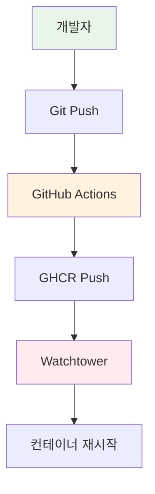

# Week 4 Day 4 Lab 1: GitOps 파이프라인 구축

<div align="center">

**🔄 GitOps** • **🐳 Docker Compose** • **👁️ Watchtower**

*Docker Compose와 Watchtower를 활용한 자동 배포 파이프라인*

</div>

---

## 🕘 실습 정보
**시간**: 12:00-13:50 (110분)
**목표**: Docker Compose + Watchtower 기반 자동 배포
**방식**: GitHub Actions + GHCR + Watchtower

## 🎯 실습 목표
- **GitOps 워크플로우**: Git 기반 자동 배포
- **Watchtower 활용**: 컨테이너 자동 업데이트
- **Docker Compose**: 멀티 컨테이너 관리

---

## 🏗️ 전체 아키텍처



---

## 🛠️ Step 1: 사전 준비 (15분)

### 1-1. GitHub Personal Access Token 생성
1. GitHub → Settings → Developer settings → Personal access tokens
2. **"Tokens (classic)"** 선택 ⚠️
3. 권한: `repo`, `workflow`, `write:packages`

### 1-2. 저장소 준비
⚠️ **중요**: Repository를 **Public**으로 설정해야 GHCR이 동작합니다!

```bash
git clone https://github.com/niceguy61/cicd-demo-app.git
cd cicd-demo-app
```

---

## 🛠️ Step 2: 환경 설정 (20분)

### 2-1. .env 파일 생성

```bash
cat > .env << EOF
# GitHub 설정 (Public Repo 필수!)
GITHUB_TOKEN=your_github_token_here
GITHUB_USERNAME=your_username_here
GITHUB_REPO=your_username_here/cicd-demo-app

# GHCR 설정
REGISTRY=ghcr.io
IMAGE_NAME=ghcr.io/your_username_here/cicd-demo-app

# Watchtower 설정
WATCHTOWER_POLL_INTERVAL=30
WATCHTOWER_CLEANUP=true
EOF
```

### 2-2. Docker Compose 파일

```yaml
version: '3.8'

services:
  app:
    image: ghcr.io/${GITHUB_USERNAME}/cicd-demo-app:latest
    container_name: demo-app
    restart: unless-stopped
    ports:
      - "3000:5000"
    labels:
      - "com.centurylinklabs.watchtower.enable=true"

  watchtower:
    image: containrrr/watchtower:latest
    container_name: watchtower
    restart: unless-stopped
    volumes:
      - /var/run/docker.sock:/var/run/docker.sock
    environment:
      - WATCHTOWER_POLL_INTERVAL=30
      - WATCHTOWER_CLEANUP=true
    command: --interval 30 --cleanup
```

---

## 🛠️ Step 3: GitHub Actions 설정 (25분)

### 3-1. GitHub Secrets 설정
Repository → Settings → Secrets → Actions:
- `GITHUB_TOKEN`: 자동 생성됨

### 3-2. 워크플로우 파일 확인

```yaml
name: CI/CD with Watchtower

on:
  push:
    branches: [ main ]

jobs:
  build:
    runs-on: ubuntu-latest
    steps:
    - uses: actions/checkout@v3
    
    - name: Login to GHCR
      uses: docker/login-action@v2
      with:
        registry: ghcr.io
        username: ${{ github.actor }}
        password: ${{ secrets.GITHUB_TOKEN }}
    
    - name: Build and push
      uses: docker/build-push-action@v4
      with:
        context: .
        push: true
        tags: ghcr.io/${{ github.repository }}:latest
```

---

## 🛠️ Step 4: 배포 및 테스트 (30분)

### 4-1. Docker Compose 시작

```bash
# 환경 변수 로드
source .env

# 스택 시작
docker-compose up -d

# 상태 확인
docker-compose ps
```

### 4-2. 코드 변경 테스트

```bash
# 코드 수정
echo "Hello Watchtower!" > app.py

# 푸시
git add .
git commit -m "Update app"
git push
```

### 4-3. 자동 업데이트 확인

```bash
# Watchtower 로그 확인
docker logs -f watchtower

# 앱 상태 확인
curl http://localhost:3000
```

---

## ✅ 체크포인트

- [ ] Repository가 Public으로 설정됨
- [ ] GHCR 토큰 설정 완료
- [ ] Docker Compose 정상 실행
- [ ] Watchtower 모니터링 시작
- [ ] 코드 변경 시 자동 업데이트 확인

---

## 🔍 트러블슈팅

**문제**: Watchtower가 업데이트 안됨
```bash
# 이미지 확인
docker images | grep demo-app

# 수동 풀
docker pull ghcr.io/username/cicd-demo-app:latest
```

**문제**: GHCR 접근 불가
- Repository가 Public인지 확인
- 토큰 권한 확인

---

## 🧹 정리

```bash
docker-compose down
docker system prune -f
```

---

## 💡 회고

### 학습 성과
- Docker Compose + Watchtower 자동 배포
- GHCR 활용한 컨테이너 레지스트리
- GitOps 워크플로우 체험

### 실무 적용
- 간단한 서비스 자동 배포
- 개발 환경 자동화
- CI/CD 파이프라인 구축

---

<div align="center">

**🔄 자동 배포** • **🐳 Docker Compose** • **👁️ Watchtower**

*간단하고 효과적인 GitOps 파이프라인*

</div>
