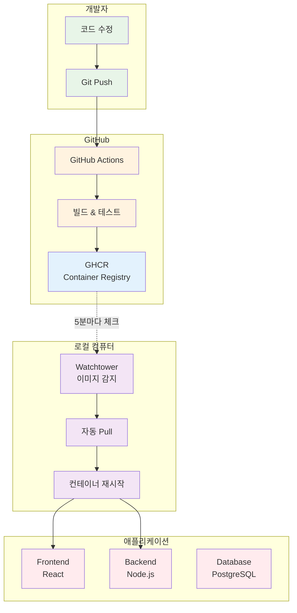
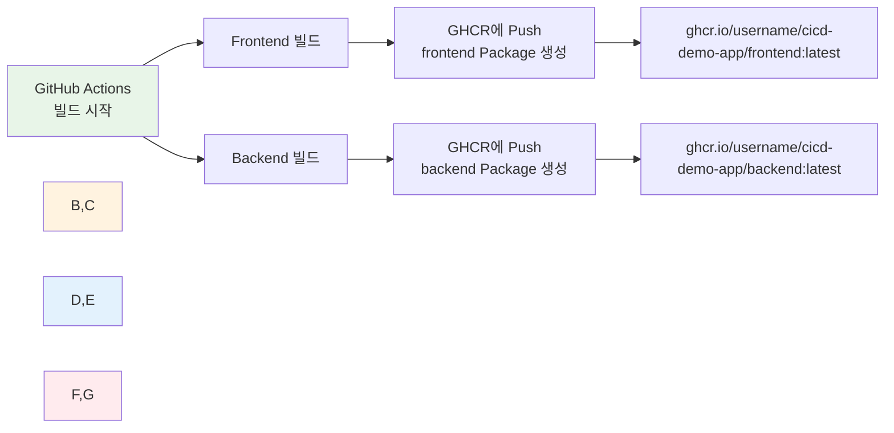

# Week 4 Day 4 Lab 1: GitHub Container Registry + Watchtower 자동 배포

<div align="center">

**🐙 GHCR** • **🔄 Watchtower** • **🚀 완전 자동 배포**

*코드 푸시만 하면 자동으로 배포되는 CI/CD 파이프라인*

</div>

---

## 🕘 실습 정보
**시간**: 12:00-12:50 (50분)
**목표**: GHCR + Watchtower를 활용한 완전 자동 배포 시스템 구축
**방식**: GitHub Actions + 자동 이미지 감지 + 무중단 배포

## 🎯 실습 목표

### 📚 학습 목표
- **GHCR 이해**: GitHub Container Registry의 장점과 사용법
- **Watchtower 활용**: 자동 이미지 업데이트 메커니즘
- **완전 자동화**: 코드 푸시부터 배포까지 자동화

### 🛠️ 구현 목표
- 3-Tier 애플리케이션 (Frontend, Backend, Database)
- GitHub Actions CI/CD 파이프라인
- GHCR 이미지 저장소
- Watchtower 자동 배포

---

## 🏗️ 전체 아키텍처



---

## 💡 핵심 개념

### 🐙 GHCR (GitHub Container Registry)

**장점**:
- ✅ **무료 무제한**: Pull 제한 없음
- ✅ **GitHub 통합**: 같은 저장소에서 관리
- ✅ **Private 무료**: 무제한 Private 저장소
- ✅ **인증 간단**: GitHub 계정으로 자동 인증

**Docker Hub vs GHCR**:
| 항목 | Docker Hub | GHCR |
|------|-----------|------|
| Pull 제한 | 6시간당 200회 | **무제한** ✅ |
| Private 저장소 | 1개 무료 | **무제한** ✅ |
| 비용 | 무료/유료 | **완전 무료** ✅ |

### 🔄 Watchtower

**동작 원리**:
1. 주기적으로 GHCR 체크 (5분마다)
2. 새 이미지 발견 시 자동 Pull
3. 컨테이너 재시작 (무중단)
4. 이전 이미지 정리

**설정**:
```yaml
watchtower:
  image: containrrr/watchtower
  command: --interval 300 --cleanup
  # 300초(5분)마다 체크
```

---

## 🛠️ Step 1: 샘플 프로젝트 준비 (10분)

### 1-1. 샘플 프로젝트 복사
```bash
cd theory/week_04/day4/lab_scripts/lab1
cp -r sample-app ~/cicd-demo-app
cd ~/cicd-demo-app
```

### 1-2. 프로젝트 구조 확인
```
cicd-demo-app/
├── frontend/              # React 애플리케이션
│   ├── src/
│   │   ├── App.js        # 메인 컴포넌트
│   │   └── App.css
│   ├── Dockerfile
│   └── package.json
├── backend/               # Node.js API
│   ├── index.js          # Express 서버
│   ├── Dockerfile
│   └── package.json
├── docker-compose.yml     # 전체 서비스 구성
└── .github/
    └── workflows/
        └── ci-cd.yml      # GitHub Actions
```

---

## 🛠️ Step 2: GitHub 저장소 생성 (10분)

### 2-1. GitHub에서 새 저장소 생성
1. https://github.com/new 접속
2. Repository name: `cicd-demo-app`
3. **Public** 선택 (GHCR 사용 위해)
4. **Create repository** 클릭

### 2-2. 환경 변수 설정
```bash
# .env 파일 생성
cat > .env << EOF
GITHUB_USERNAME=your-github-username
GITHUB_REPO=cicd-demo-app
EOF

# 본인의 GitHub username으로 변경!
```

### 2-3. Git 초기화 및 푸시
```bash
git init
git add .
git commit -m "Initial commit: CI/CD demo app"
git branch -M main
git remote add origin https://github.com/YOUR_USERNAME/cicd-demo-app.git
git push -u origin main
```

### 2-4. GitHub Actions 실행 확인
- https://github.com/YOUR_USERNAME/cicd-demo-app/actions
- 첫 번째 워크플로우 실행 확인
- 빌드 성공 확인 (약 2-3분 소요)

---

## 🛠️ Step 3: 로컬 환경 실행 (10분)

### 💡 GHCR Package 이해하기

**Q: "front, backend만 따로 package를 한다"는 게 무슨 뜻인가요?**

**A: GitHub Actions가 빌드할 때 자동으로 생성됩니다!**



**실제 과정**:
1. **코드 푸시** → GitHub Actions 자동 실행
2. **Frontend 빌드** → `frontend` Package 자동 생성
3. **Backend 빌드** → `backend` Package 자동 생성
4. **GHCR에 저장** → 각각 별도 이미지로 저장

### 3-1. GitHub Actions 빌드 완료 확인

**먼저 빌드가 완료되어야 합니다!**

```bash
# 1. GitHub Actions 페이지 확인
# https://github.com/YOUR_USERNAME/cicd-demo-app/actions

# 2. 최신 워크플로우 상태 확인
# ✅ 초록색 체크: 빌드 성공
# ❌ 빨간색 X: 빌드 실패
# 🟡 노란색 점: 빌드 진행 중 (2-3분 대기)
```

**빌드 성공 확인 후 다음 단계 진행!**

### 3-2. GHCR Package 확인 및 Public 설정

**Package 위치 확인**:
```bash
# 1. GitHub 프로필 → Packages 탭
# https://github.com/YOUR_USERNAME?tab=packages

# 2. 생성된 Package 확인
# - cicd-demo-app/frontend
# - cicd-demo-app/backend
```

**Public으로 변경** (중요!):
```
각 Package 클릭 → Package settings → Change visibility → Public

이유: Public이어야 로컬에서 인증 없이 Pull 가능
```

### 3-3. Docker Compose 파일 확인

**docker-compose.yml 내용**:
```yaml
version: '3.8'

services:
  frontend:
    image: ghcr.io/${GITHUB_USERNAME}/cicd-demo-app/frontend:latest
    # ↑ 이 이미지를 GHCR에서 Pull
    ports:
      - "3000:80"
    depends_on:
      - backend

  backend:
    image: ghcr.io/${GITHUB_USERNAME}/cicd-demo-app/backend:latest
    # ↑ 이 이미지를 GHCR에서 Pull
    ports:
      - "3001:3001"
    environment:
      - DATABASE_URL=postgresql://user:password@db:5432/mydb
    depends_on:
      - db

  db:
    image: postgres:15-alpine
    # ↑ 이건 Docker Hub에서 Pull (공식 이미지)
    environment:
      - POSTGRES_USER=user
      - POSTGRES_PASSWORD=password
      - POSTGRES_DB=mydb
    volumes:
      - postgres_data:/var/lib/postgresql/data

  watchtower:
    image: containrrr/watchtower
    volumes:
      - /var/run/docker.sock:/var/run/docker.sock
    command: --interval 300 --cleanup
    # 5분마다 GHCR 체크 → 새 이미지 있으면 자동 Pull & 재시작

volumes:
  postgres_data:
```

### 3-4. 로컬 실행

```bash
# 1. 환경 변수 설정 확인
cat .env
# GITHUB_USERNAME=your-github-username 확인

# 2. 환경 변수 로드
export $(cat .env | xargs)

# 3. 이미지 Pull 테스트 (선택사항)
docker pull ghcr.io/$GITHUB_USERNAME/cicd-demo-app/frontend:latest
docker pull ghcr.io/$GITHUB_USERNAME/cicd-demo-app/backend:latest

# 4. Docker Compose 실행
docker-compose up -d

# 5. 로그 확인
docker-compose logs -f
```

### 3-5. 접속 확인

**Frontend**: http://localhost:3000
```
예상 화면:
┌─────────────────────────────┐
│  🚀 CI/CD Demo App          │
│                             │
│  Backend is running! 🚀     │
│                             │
│  Users:                     │
│  - Alice (alice@example.com)│
│  - Bob (bob@example.com)    │
│  - Charlie (charlie@...)    │
└─────────────────────────────┘
```

**Backend API**: http://localhost:3001/api/health
```json
{
  "message": "Backend is running! 🚀",
  "timestamp": "2025-10-22T13:30:00.000Z"
}
```

**Users API**: http://localhost:3001/api/users
```json
[
  { "id": 1, "name": "Alice", "email": "alice@example.com" },
  { "id": 2, "name": "Bob", "email": "bob@example.com" },
  { "id": 3, "name": "Charlie", "email": "charlie@example.com" }
]
```

---

## 🛠️ Step 4: 코드 수정 및 자동 배포 (15분)

### 4-1. Frontend 메시지 변경
```javascript
// frontend/src/App.js
<h1>🚀 CI/CD Demo App v2.0</h1>  // 버전 변경
<p>{message} - Updated!</p>       // 메시지 추가
```

### 4-2. Backend 응답 변경
```javascript
// backend/index.js
app.get('/api/health', (req, res) => {
  res.json({ 
    message: 'Backend is running! 🎉 v2.0',  // 버전 추가
    timestamp: new Date().toISOString()
  });
});
```

### 4-3. Git Push
```bash
git add .
git commit -m "Update: v2.0 release"
git push
```

### 4-4. 자동 배포 확인

**1단계: GitHub Actions 실행 (2-3분)**
- https://github.com/YOUR_USERNAME/cicd-demo-app/actions
- 빌드 진행 상황 확인
- GHCR에 이미지 푸시 완료 확인

**2단계: Watchtower 자동 배포 (최대 5분)**
```bash
# Watchtower 로그 확인
docker logs -f $(docker ps -q -f name=watchtower)

# 예상 로그:
# time="..." level=info msg="Found new image for frontend"
# time="..." level=info msg="Stopping container frontend"
# time="..." level=info msg="Starting container frontend"
```

**3단계: 변경사항 확인**
- 브라우저 새로고침 (Ctrl+F5)
- 변경된 메시지 확인: "v2.0", "Updated!"

---

## ✅ 실습 체크포인트

### ✅ Step 1: 프로젝트 준비
- [ ] 샘플 프로젝트 복사 완료
- [ ] 프로젝트 구조 확인
- [ ] 파일 내용 이해

### ✅ Step 2: GitHub 설정
- [ ] GitHub 저장소 생성
- [ ] .env 파일 설정
- [ ] Git 푸시 성공
- [ ] GitHub Actions 실행 확인

### ✅ Step 3: 로컬 실행
- [ ] GHCR 이미지 Public 설정
- [ ] Docker Compose 실행 성공
- [ ] Frontend 접속 확인
- [ ] Backend API 응답 확인

### ✅ Step 4: 자동 배포
- [ ] 코드 수정 완료
- [ ] Git 푸시 성공
- [ ] GitHub Actions 빌드 성공
- [ ] Watchtower 자동 배포 확인
- [ ] 변경사항 브라우저에서 확인

---

## 🔍 트러블슈팅

### 문제 1: GitHub Actions 빌드 실패
```bash
# 증상
Actions 페이지에서 빨간색 X 표시

# 원인 확인
1. Actions 페이지에서 실패한 워크플로우 클릭
2. 빌드 로그 확인
3. 에러 메시지 확인

# 흔한 원인
- Dockerfile 문법 오류
- package.json 의존성 문제
- GitHub 권한 설정 문제

# 해결
1. 로그에서 에러 메시지 확인
2. 해당 파일 수정
3. 다시 Git Push
```

### 문제 2: GHCR Package가 생성되지 않음
```bash
# 증상
https://github.com/YOUR_USERNAME?tab=packages 에 아무것도 없음

# 원인
GitHub Actions 빌드가 완료되지 않았거나 실패함

# 해결
1. Actions 페이지에서 빌드 상태 확인
2. 빌드 완료 대기 (2-3분)
3. 빌드 실패 시 로그 확인 후 수정
```

### 문제 3: GHCR 이미지 Pull 실패
```bash
# 증상
Error: pull access denied for ghcr.io/username/cicd-demo-app/frontend

# 원인
Package가 Private 상태

# 해결
1. https://github.com/YOUR_USERNAME?tab=packages
2. frontend, backend 각각 클릭
3. Package settings → Change visibility → Public
4. 다시 docker-compose up -d
```

### 문제 4: 환경 변수 인식 안 됨
```bash
# 증상
docker-compose.yml에서 ${GITHUB_USERNAME} 인식 안 됨

# 원인
환경 변수가 로드되지 않음

# 해결
# 1. .env 파일 확인
cat .env
# GITHUB_USERNAME=your-github-username 있는지 확인

# 2. 환경 변수 로드
export $(cat .env | xargs)

# 3. 확인
echo $GITHUB_USERNAME

# 4. 다시 실행
docker-compose up -d
```

### 문제 5: Watchtower가 업데이트 안 함
```bash
# 증상
코드 수정 후 Push했는데 로컬에서 변경사항 안 보임

# 원인 확인
# 1. GitHub Actions 빌드 완료 확인
# https://github.com/YOUR_USERNAME/cicd-demo-app/actions

# 2. GHCR에 새 이미지 푸시 확인
# https://github.com/YOUR_USERNAME?tab=packages

# 3. Watchtower 로그 확인
docker logs -f $(docker ps -q -f name=watchtower)

# 해결
# Watchtower 재시작
docker-compose restart watchtower

# 또는 수동 업데이트
docker-compose pull
docker-compose up -d
```

### 문제 6: 포트 충돌
```bash
# 증상
Error: Bind for 0.0.0.0:3000 failed: port is already allocated

# 원인
다른 컨테이너나 프로세스가 포트 사용 중

# 해결
# 1. 기존 컨테이너 정리
docker-compose down
docker ps -a
docker rm -f $(docker ps -aq)

# 2. 포트 사용 프로세스 확인 (Linux/Mac)
lsof -i :3000
kill -9 <PID>

# 3. 포트 사용 프로세스 확인 (Windows)
netstat -ano | findstr :3000
taskkill /PID <PID> /F

# 4. 다시 실행
docker-compose up -d
```

### 문제 7: 브라우저에서 변경사항 안 보임
```bash
# 증상
코드 수정했는데 브라우저에서 이전 화면 보임

# 원인
브라우저 캐시

# 해결
# 1. 강력 새로고침
# - Windows/Linux: Ctrl + Shift + R
# - Mac: Cmd + Shift + R

# 2. 캐시 완전 삭제
# - Chrome: F12 → Network 탭 → Disable cache 체크
# - 시크릿 모드로 접속

# 3. 컨테이너 재시작 확인
docker ps
# frontend, backend 컨테이너의 CREATED 시간 확인
```

---

## 💡 심화 학습

### 🔄 Watchtower 고급 설정

**간격 조정**:
```yaml
watchtower:
  command: --interval 60  # 1분마다 (빠른 배포)
  # 또는
  command: --interval 600  # 10분마다 (안정적)
```

**특정 컨테이너만 감시**:
```yaml
frontend:
  labels:
    - "com.centurylinklabs.watchtower.enable=true"

backend:
  labels:
    - "com.centurylinklabs.watchtower.enable=false"  # 제외
```

**알림 설정**:
```yaml
watchtower:
  environment:
    - WATCHTOWER_NOTIFICATIONS=slack
    - WATCHTOWER_NOTIFICATION_SLACK_HOOK_URL=https://...
```

### 📊 비용 비교

| 방식 | Pull 제한 | 비용 | 추천도 |
|------|----------|------|--------|
| **Docker Hub** | 6시간당 200회 | 무료/유료 | ⭐⭐ |
| **GHCR** | 무제한 | 완전 무료 | ⭐⭐⭐⭐⭐ |
| **AWS ECR** | 무제한 | 스토리지 비용 | ⭐⭐⭐ |

### 🚀 실무 적용

**프로덕션 환경**:
- Watchtower 대신 **ArgoCD** 사용 (Kubernetes)
- **Blue-Green 배포** 또는 **Canary 배포**
- **모니터링 및 알림** 시스템 통합

**보안 강화**:
- Private GHCR 저장소 사용
- 이미지 서명 및 검증
- 취약점 스캔 자동화

---

## 🧹 실습 정리

```bash
# 모든 컨테이너 중지 및 삭제
docker-compose down -v

# 이미지 정리
docker rmi $(docker images -q ghcr.io/*/cicd-demo-app/*)

# 프로젝트 디렉토리 정리 (선택)
cd ~
rm -rf cicd-demo-app
```

---

## 💡 실습 회고

### 🤝 페어 회고 (5분)
1. **자동 배포 경험**: Watchtower의 자동 배포를 직접 체험한 소감은?
2. **GHCR vs Docker Hub**: 두 서비스의 차이점과 장단점은?
3. **실무 적용**: 실제 프로젝트에 어떻게 적용할 수 있을까?

### 📊 학습 성과
- **완전 자동화**: 코드 푸시만으로 배포 완료
- **비용 효율**: GHCR 무제한 사용으로 비용 걱정 없음
- **실무 경험**: 실제 CI/CD 파이프라인 구축 경험
- **도구 이해**: GitHub Actions, GHCR, Watchtower 활용법

### 🔗 다음 학습 연계
- **Week 4 Day 5**: FinOps - CI/CD 파이프라인 비용 최적화
- **Week 5**: Kubernetes 환경에서의 GitOps (ArgoCD)
- **실무 프로젝트**: 팀 프로젝트에 CI/CD 파이프라인 적용

---

<div align="center">

**🐙 GHCR 무제한** • **🔄 자동 배포** • **💰 비용 제로** • **🚀 실무 적용**

*완전 자동화된 CI/CD 파이프라인 마스터!*

</div>
