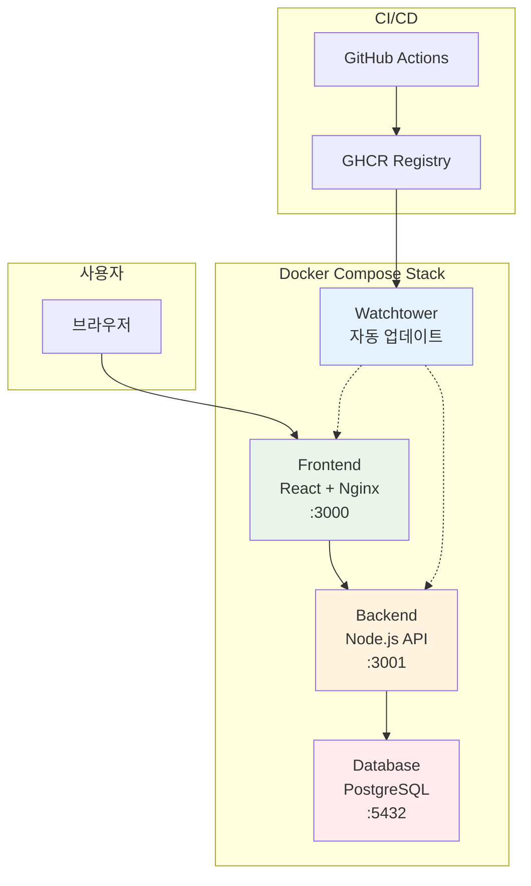
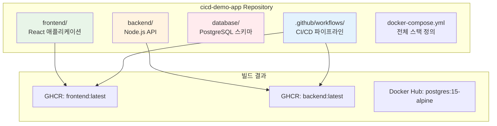
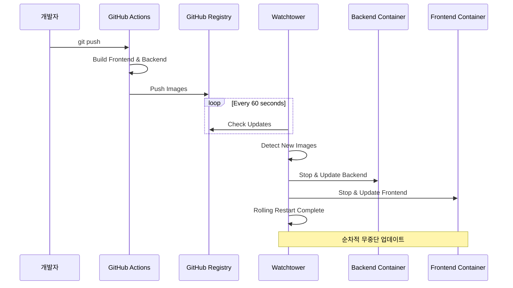

# Week 4 Day 4 Lab 1: GitOps 파이프라인 구축

<div align="center">

**🔄 GitOps** • **🐳 Docker Compose** • **👁️ Watchtower**

*3-Tier 애플리케이션의 자동 배포 파이프라인*

</div>

---

## 🕘 실습 정보
**시간**: 12:00-13:50 (110분)
**목표**: Frontend + Backend + Database 자동 배포
**방식**: GitHub Actions + GHCR + Watchtower

## 🎯 실습 목표
- **3-Tier 아키텍처**: Frontend(React) + Backend(Node.js) + Database(PostgreSQL)
- **Watchtower 활용**: 멀티 컨테이너 자동 업데이트
- **GHCR 연동**: GitHub Container Registry 활용

---

## 🏗️ 전체 아키텍처



---

## 🛠️ Step 1: 저장소 준비 (15분)

### 1-1. GitHub Personal Access Token 생성
1. GitHub → Settings → Developer settings → Personal access tokens
2. **"Tokens (classic)"** 선택 ⚠️
3. 권한: `repo`, `workflow`, `write:packages`

### 1-2. 저장소 클론 및 설정
⚠️ **중요**: Repository를 **Public**으로 설정해야 GHCR이 동작합니다!

```bash
# 데모 앱 클론
git clone https://github.com/niceguy61/cicd-demo-app.git
cd cicd-demo-app

# 본인 GitHub으로 Fork 후 origin 변경
git remote set-url origin git@github.com:YOUR_USERNAME/cicd-demo-app.git
```

---

## 🛠️ Step 2: 환경 설정 (20분)

### 2-1. .env 파일 생성

```bash
# .env 파일 생성 (실제 저장소 구조 반영)
cat > .env << EOF
GITHUB_USERNAME=your_username_here
GITHUB_REPO=cicd-demo-app
GITHUB_TOKEN=your_github_token_here
EOF
```

### 2-2. 실제 Docker Compose 구조 확인

```yaml
# docker-compose.yml (실제 파일 내용)
version: '3.8'

services:
  frontend:
    image: ghcr.io/${GITHUB_USERNAME}/${GITHUB_REPO}/frontend:latest
    ports:
      - "3000:80"
    depends_on:
      - backend
    labels:
      - "com.centurylinklabs.watchtower.enable=true"

  backend:
    image: ghcr.io/${GITHUB_USERNAME}/${GITHUB_REPO}/backend:latest
    ports:
      - "3001:3001"
    environment:
      - DB_HOST=database
      - DB_USER=postgres
      - DB_PASSWORD=postgres
      - DB_NAME=myapp
    depends_on:
      - database
    labels:
      - "com.centurylinklabs.watchtower.enable=true"

  database:
    image: postgres:15-alpine
    environment:
      - POSTGRES_USER=postgres
      - POSTGRES_PASSWORD=postgres
      - POSTGRES_DB=myapp
    volumes:
      - db-data:/var/lib/postgresql/data
    ports:
      - "5432:5432"

  watchtower:
    image: containrrr/watchtower
    volumes:
      - /var/run/docker.sock:/var/run/docker.sock
    command: --interval 60 --cleanup
    environment:
      - WATCHTOWER_TRACE=true
      - WATCHTOWER_ROLLING_RESTART=true
      - WATCHTOWER_TIMEOUT=30s

volumes:
  db-data:
```

---

## 🛠️ Step 3: 애플리케이션 구조 이해 (15분)

### 3-1. 프로젝트 구조



### 3-2. GitHub Actions 워크플로우 확인

```yaml
# .github/workflows/ci-cd.yml (실제 파일)
name: CI/CD Pipeline

on:
  push:
    branches: [ main ]
  pull_request:
    branches: [ main ]

env:
  REGISTRY: ghcr.io
  IMAGE_NAME: ${{ github.repository }}

jobs:
  build-and-push:
    runs-on: ubuntu-latest
    permissions:
      contents: read
      packages: write

    steps:
    - name: Checkout code
      uses: actions/checkout@v3

    - name: Log in to GitHub Container Registry
      uses: docker/login-action@v2
      with:
        registry: ${{ env.REGISTRY }}
        username: ${{ github.actor }}
        password: ${{ secrets.GITHUB_TOKEN }}

    - name: Build and push Frontend
      run: |
        cd frontend
        docker build -t ${{ env.REGISTRY }}/${{ env.IMAGE_NAME }}/frontend:latest .
        docker push ${{ env.REGISTRY }}/${{ env.IMAGE_NAME }}/frontend:latest

    - name: Build and push Backend
      run: |
        cd backend
        docker build -t ${{ env.REGISTRY }}/${{ env.IMAGE_NAME }}/backend:latest .
        docker push ${{ env.REGISTRY }}/${{ env.IMAGE_NAME }}/backend:latest
```

---

## 🛠️ Step 4: 배포 및 테스트 (40분)

### 4-1. Docker Compose 스택 시작

```bash
# 환경 변수 로드
source .env

# 전체 스택 시작
docker-compose up -d

# 서비스 상태 확인
docker-compose ps
```

### 4-2. 애플리케이션 접속 확인

```bash
# Frontend 접속 (React 앱)
curl http://localhost:3000

# Backend API 테스트
curl http://localhost:3001/api/health

# Database 연결 확인
docker-compose logs backend | grep -i database
```

### 4-3. Watchtower 모니터링 시작

```bash
# Watchtower 로그 실시간 확인
docker logs -f watchtower

# 모든 컨테이너 상태 확인
docker-compose logs -f
```

### 4-4. 코드 변경 및 자동 배포 테스트

```bash
# Backend 코드 수정 (예시)
echo "console.log('Updated by GitOps!');" >> backend/index.js

# 변경사항 커밋 및 푸시
git add .
git commit -m "Update backend for GitOps demo"
git push origin main
```

### 4-5. 자동 배포 프로세스 모니터링



---

## ✅ 체크포인트

### ✅ 환경 준비
- [ ] Repository가 Public으로 설정됨
- [ ] GitHub Token (Classic) 생성 완료
- [ ] .env 파일 설정 완료

### ✅ 애플리케이션 배포
- [ ] Docker Compose 스택 정상 실행
- [ ] Frontend (http://localhost:3000) 접속 가능
- [ ] Backend API (http://localhost:3001) 응답 확인
- [ ] Database 연결 정상

### ✅ GitOps 워크플로우
- [ ] Watchtower 모니터링 시작
- [ ] 코드 변경 후 GitHub Actions 실행
- [ ] GHCR에 이미지 푸시 확인
- [ ] Watchtower 자동 업데이트 확인
- [ ] 컨테이너 순차 재시작 완료

---

## 🔍 트러블슈팅

### 문제 1: Watchtower가 업데이트를 감지하지 못함
```bash
# GHCR 이미지 확인
docker images | grep ghcr.io

# 수동으로 이미지 풀 테스트
docker pull ghcr.io/YOUR_USERNAME/cicd-demo-app/frontend:latest

# Watchtower 재시작
docker-compose restart watchtower
```

### 문제 2: Frontend가 Backend에 연결되지 않음
```bash
# 네트워크 확인
docker network ls
docker network inspect cicd-demo-app_default

# Backend 로그 확인
docker-compose logs backend
```

### 문제 3: Database 연결 실패
```bash
# PostgreSQL 상태 확인
docker-compose logs database

# Backend 환경변수 확인
docker-compose exec backend env | grep DB_
```

---

## 🚀 심화 실습 (선택사항)

### 고급 Watchtower 설정
```yaml
# 더 세밀한 Watchtower 설정
watchtower:
  image: containrrr/watchtower
  environment:
    - WATCHTOWER_POLL_INTERVAL=30
    - WATCHTOWER_CLEANUP=true
    - WATCHTOWER_INCLUDE_STOPPED=true
    - WATCHTOWER_REVIVE_STOPPED=false
    - WATCHTOWER_NOTIFICATION_URL=slack://token@channel
```

### 헬스체크 추가
```yaml
# docker-compose.yml에 헬스체크 추가
backend:
  healthcheck:
    test: ["CMD", "curl", "-f", "http://localhost:3001/api/health"]
    interval: 30s
    timeout: 10s
    retries: 3
```

---

## 🧹 실습 정리

```bash
# Docker Compose 스택 중지
docker-compose down

# 볼륨 포함 완전 삭제
docker-compose down -v

# 이미지 정리 (선택사항)
docker system prune -f
```

---

## 💡 실습 회고

### 🤝 페어 회고 (10분)
1. **3-Tier 아키텍처**: Frontend, Backend, Database 분리의 장점은?
2. **Watchtower 효과**: 멀티 컨테이너 자동 업데이트의 편리함은?
3. **실무 적용**: 실제 프로젝트에서 어떻게 활용할 수 있을까?

### 📊 학습 성과
- **3-Tier GitOps**: 복잡한 애플리케이션의 자동 배포 체험
- **GHCR 활용**: GitHub Container Registry 실무 사용법
- **Watchtower 운영**: 멀티 컨테이너 환경에서의 자동 업데이트
- **순차 배포**: Rolling Restart를 통한 무중단 배포

### 🔗 다음 학습 연계
- **Lab 2**: 멀티 환경 배포와 고급 GitOps 전략
- **Day 5**: FinOps와 클라우드 비용 최적화
- **Week 5**: Infrastructure as Code와 Terraform

---

<div align="center">

**🔄 3-Tier GitOps** • **🐳 멀티 컨테이너** • **👁️ 자동 업데이트** • **🚀 무중단 배포**

*실무급 3-Tier 애플리케이션 자동 배포 파이프라인*

</div>
