# Week 4 Day 4 Lab 1: GitOps 파이프라인 구축

<div align="center">

**🔄 GitOps** • **🐳 Docker Compose** • **👁️ Watchtower**

*Docker Compose와 Watchtower를 활용한 자동 배포 파이프라인 구축*

</div>

---

## 🕘 실습 정보
**시간**: 12:00-13:50 (110분)
**목표**: Docker Compose + Watchtower 기반 GitOps 파이프라인 구축
**방식**: GitHub Actions + Watchtower 자동 업데이트 실습

## 🎯 실습 목표
### 📚 학습 목표
- **GitOps 워크플로우**: Git 기반 자동 배포 이해
- **Watchtower 활용**: 컨테이너 이미지 자동 업데이트
- **Docker Compose 운영**: 프로덕션급 컨테이너 오케스트레이션

### 🛠️ 구현 목표
- **CI/CD 파이프라인**: GitHub Actions + Docker Hub + Watchtower
- **자동 재시작**: 이미지 업데이트 시 컨테이너 자동 재시작
- **무중단 배포**: 서비스 중단 없는 업데이트

---

## 🏗️ 전체 아키텍처

```mermaid
graph TB
    subgraph "개발자 워크플로우"
        A[개발자] --> B[코드 변경]
        B --> C[Git Push]
    end
    
    subgraph "GitHub"
        C --> D[GitHub Repository]
        D --> E[GitHub Actions]
        E --> F[Docker Build & Push]
    end
    
    subgraph "Container Registry"
        F --> G[Docker Hub]
    end
    
    subgraph "Production Server"
        H[Docker Compose<br/>애플리케이션 스택]
        I[Watchtower<br/>이미지 모니터링]
        J[App Container<br/>실제 서비스]
    end
    
    G --> I
    I --> J
    J --> H
    I -.-> |이미지 업데이트 감지| J
    J -.-> |컨테이너 재시작| H
    
    style A fill:#e8f5e8
    style E fill:#fff3e0
    style I fill:#ffebee
    style J fill:#e3f2fd
```



---

## 🛠️ Step 1: 사전 준비 (15분)

### 1-1. SSH 키 생성 (GitHub 연동용)

**macOS/Linux**:
```bash
# SSH 키 생성
ssh-keygen -t ed25519 -C "your-email@example.com"

# SSH 에이전트에 키 추가
eval "$(ssh-agent -s)"
ssh-add ~/.ssh/id_ed25519

# 공개키 복사
cat ~/.ssh/id_ed25519.pub
```

**Windows (Git Bash)**:
```bash
# SSH 키 생성
ssh-keygen -t ed25519 -C "your-email@example.com"

# SSH 에이전트 시작
eval $(ssh-agent -s)
ssh-add ~/.ssh/id_ed25519

# 공개키 복사
cat ~/.ssh/id_ed25519.pub
```

### 1-2. GitHub SSH 키 등록
1. GitHub → Settings → SSH and GPG keys
2. "New SSH key" 클릭
3. 복사한 공개키 붙여넣기

### 1-3. GitHub Personal Access Token 생성
1. GitHub → Settings → Developer settings → Personal access tokens
2. **"Tokens (classic)"** 선택 ⚠️
3. "Generate new token (classic)" 클릭
4. 권한 설정:
   - `repo` (전체)
   - `workflow`
   - `write:packages`
5. 토큰 복사 및 안전한 곳에 보관

---

## 🛠️ Step 2: 데모 애플리케이션 준비 (20분)

### 2-1. 저장소 클론 및 설정

```bash
# 데모 애플리케이션 클론
git clone https://github.com/niceguy61/cicd-demo-app.git
cd cicd-demo-app

# 본인 GitHub으로 Fork 후 origin 변경
git remote set-url origin git@github.com:YOUR_USERNAME/cicd-demo-app.git
```

### 2-2. 환경 설정 파일 생성

```bash
# .env 파일 생성
cat > .env << EOF
# GitHub 설정
GITHUB_TOKEN=your_github_token_here
GITHUB_USERNAME=your_username_here

# Docker Hub 설정  
DOCKER_USERNAME=your_dockerhub_username
DOCKER_PASSWORD=your_dockerhub_password

# 애플리케이션 설정
APP_NAME=cicd-demo-app
APP_VERSION=v1.0.0
EOF
```

### 2-3. 애플리케이션 구조 확인

```mermaid
graph TB
    subgraph "cicd-demo-app Repository"
        A[app.py<br/>Flask 애플리케이션]
        B[Dockerfile<br/>컨테이너 이미지]
        C[requirements.txt<br/>Python 의존성]
        D[.github/workflows/<br/>CI/CD 파이프라인]
        E[k8s/<br/>Kubernetes 매니페스트]
        F[.env<br/>환경 설정]
    end
    
    subgraph "CI/CD 구성요소"
        G[GitHub Actions<br/>빌드 & 푸시]
        H[ArgoCD<br/>배포 관리]
        I[Kubernetes<br/>런타임 환경]
    end
    
    D --> G
    E --> H
    H --> I
    
    style A fill:#e8f5e8
    style D fill:#fff3e0
    style E fill:#ffebee
    style G fill:#e3f2fd
```



---

## 🛠️ Step 3: Kind 클러스터 및 ArgoCD 설치 (25분)

### 3-1. Kind 클러스터 생성

```bash
# 기존 클러스터 삭제 (있다면)
kind delete cluster --name gitops-cluster

# 새 클러스터 생성
cat <<EOF | kind create cluster --config=-
kind: Cluster
apiVersion: kind.x-k8s.io/v1alpha4
name: gitops-cluster
nodes:
- role: control-plane
  extraPortMappings:
  - containerPort: 30080
    hostPort: 30080
  - containerPort: 30443
    hostPort: 30443
- role: worker
EOF

# 클러스터 확인
kubectl cluster-info
kubectl get nodes
```

### 3-2. ArgoCD 설치

```bash
# ArgoCD 네임스페이스 생성
kubectl create namespace argocd

# ArgoCD 설치
kubectl apply -n argocd -f https://raw.githubusercontent.com/argoproj/argo-cd/stable/manifests/install.yaml

# ArgoCD 서버 대기
kubectl wait --for=condition=available --timeout=300s deployment/argocd-server -n argocd

# ArgoCD 서버 포트 포워딩 (백그라운드)
kubectl port-forward svc/argocd-server -n argocd 8080:443 &

# ArgoCD CLI 설치 (macOS)
brew install argocd

# ArgoCD CLI 설치 (Linux)
curl -sSL -o argocd-linux-amd64 https://github.com/argoproj/argo-cd/releases/latest/download/argocd-linux-amd64
sudo install -m 555 argocd-linux-amd64 /usr/local/bin/argocd
```

### 3-3. ArgoCD 초기 설정

```bash
# ArgoCD 초기 비밀번호 확인
kubectl -n argocd get secret argocd-initial-admin-secret -o jsonpath="{.data.password}" | base64 -d

# ArgoCD 로그인 (CLI)
argocd login localhost:8080 --username admin --password [위에서_확인한_비밀번호] --insecure

# 비밀번호 변경
argocd account update-password --current-password [현재_비밀번호] --new-password admin123
```

---

## 🛠️ Step 4: GitHub Actions 워크플로우 설정 (20분)

### 4-1. GitHub Secrets 설정

GitHub Repository → Settings → Secrets and variables → Actions에서 다음 설정:

```
DOCKER_USERNAME: your_dockerhub_username
DOCKER_PASSWORD: your_dockerhub_password
GITHUB_TOKEN: your_github_token (자동 생성됨)
```

### 4-2. CI/CD 워크플로우 확인

`.github/workflows/ci-cd.yml` 파일 내용 확인:

```yaml
name: CI/CD Pipeline

on:
  push:
    branches: [ main ]
  pull_request:
    branches: [ main ]

jobs:
  build-and-deploy:
    runs-on: ubuntu-latest
    
    steps:
    - uses: actions/checkout@v3
    
    - name: Set up Docker Buildx
      uses: docker/setup-buildx-action@v2
    
    - name: Login to Docker Hub
      uses: docker/login-action@v2
      with:
        username: ${{ secrets.DOCKER_USERNAME }}
        password: ${{ secrets.DOCKER_PASSWORD }}
    
    - name: Build and push Docker image
      uses: docker/build-push-action@v4
      with:
        context: .
        push: true
        tags: ${{ secrets.DOCKER_USERNAME }}/cicd-demo-app:${{ github.sha }}
    
    - name: Update Kubernetes manifests
      run: |
        sed -i "s|image: .*|image: ${{ secrets.DOCKER_USERNAME }}/cicd-demo-app:${{ github.sha }}|g" k8s/deployment.yaml
        git config --local user.email "action@github.com"
        git config --local user.name "GitHub Action"
        git add k8s/deployment.yaml
        git commit -m "Update image tag to ${{ github.sha }}" || exit 0
        git push
```

---

## 🛠️ Step 5: ArgoCD 애플리케이션 생성 (15분)

### 5-1. ArgoCD 애플리케이션 매니페스트 생성

```bash
cat > argocd-app.yaml << EOF
apiVersion: argoproj.io/v1alpha1
kind: Application
metadata:
  name: cicd-demo-app
  namespace: argocd
spec:
  project: default
  source:
    repoURL: https://github.com/YOUR_USERNAME/cicd-demo-app.git
    targetRevision: HEAD
    path: k8s
  destination:
    server: https://kubernetes.default.svc
    namespace: default
  syncPolicy:
    automated:
      prune: true
      selfHeal: true
    syncOptions:
    - CreateNamespace=true
EOF
```

### 5-2. ArgoCD 애플리케이션 배포

```bash
# 애플리케이션 생성
kubectl apply -f argocd-app.yaml

# 애플리케이션 상태 확인
argocd app list
argocd app get cicd-demo-app

# 수동 동기화 (최초 1회)
argocd app sync cicd-demo-app
```

---

## 🛠️ Step 6: GitOps 워크플로우 테스트 (15분)

### 6-1. 애플리케이션 코드 변경

```bash
# app.py 파일 수정
sed -i 's/Hello, World!/Hello, GitOps World!/g' app.py

# 변경사항 커밋 및 푸시
git add app.py
git commit -m "Update welcome message"
git push origin main
```

### 6-2. CI/CD 파이프라인 모니터링

```mermaid
sequenceDiagram
    participant Dev as 개발자
    participant Git as GitHub
    participant GA as GitHub Actions
    participant DH as Docker Hub
    participant AC as ArgoCD
    participant K8s as Kubernetes
    
    Dev->>Git: git push
    Git->>GA: Trigger Workflow
    GA->>GA: Build Docker Image
    GA->>DH: Push Image
    GA->>Git: Update Manifest
    Git->>AC: Webhook/Poll
    AC->>AC: Detect Changes
    AC->>K8s: Deploy New Version
    K8s->>K8s: Rolling Update
    
    Note over Dev,K8s: 완전 자동화된 GitOps 워크플로우
```



### 6-3. 배포 결과 확인

```bash
# GitHub Actions 워크플로우 상태 확인 (웹 브라우저)
echo "https://github.com/YOUR_USERNAME/cicd-demo-app/actions"

# ArgoCD 대시보드 확인 (웹 브라우저)
echo "http://localhost:8080"

# Kubernetes 리소스 확인
kubectl get pods
kubectl get services
kubectl get deployments

# 애플리케이션 접속 테스트
kubectl port-forward svc/cicd-demo-app 3000:80 &
curl http://localhost:3000
```

---

## ✅ 실습 체크포인트

### ✅ Step 1-2: 환경 준비
- [ ] SSH 키 생성 및 GitHub 등록 완료
- [ ] GitHub Personal Access Token (Classic) 생성
- [ ] 데모 애플리케이션 Fork 및 클론 완료
- [ ] .env 파일 설정 완료

### ✅ Step 3: ArgoCD 설치
- [ ] Kind 클러스터 생성 완료 (1 control-plane + 1 worker)
- [ ] ArgoCD 설치 및 포트 포워딩 완료
- [ ] ArgoCD CLI 로그인 및 비밀번호 변경 완료

### ✅ Step 4-5: GitOps 설정
- [ ] GitHub Secrets 설정 완료
- [ ] CI/CD 워크플로우 파일 확인
- [ ] ArgoCD 애플리케이션 생성 및 동기화 완료

### ✅ Step 6: 전체 워크플로우 테스트
- [ ] 코드 변경 및 푸시 완료
- [ ] GitHub Actions 빌드 성공 확인
- [ ] ArgoCD 자동 동기화 확인
- [ ] 애플리케이션 업데이트 확인

---

## 🔍 트러블슈팅

### 문제 1: ArgoCD 서버 접속 불가
```bash
# 포트 포워딩 재시작
pkill -f "port-forward.*argocd-server"
kubectl port-forward svc/argocd-server -n argocd 8080:443 &

# ArgoCD 서버 상태 확인
kubectl get pods -n argocd
kubectl logs -n argocd deployment/argocd-server
```

### 문제 2: GitHub Actions 빌드 실패
```bash
# Secrets 설정 확인
# GitHub Repository → Settings → Secrets and variables → Actions

# Docker Hub 로그인 테스트
docker login -u YOUR_USERNAME
```

### 문제 3: ArgoCD 동기화 실패
```bash
# 애플리케이션 상태 확인
argocd app get cicd-demo-app

# 수동 동기화 재시도
argocd app sync cicd-demo-app --force

# 리소스 상태 확인
kubectl describe deployment cicd-demo-app
```

---

## 🚀 심화 실습 (선택사항)

### 고급 GitOps 기능
1. **멀티 환경 배포**: dev, staging, prod 환경 분리
2. **Helm 차트 활용**: 복잡한 애플리케이션 패키징
3. **ArgoCD Image Updater**: 이미지 태그 자동 업데이트
4. **Progressive Delivery**: 카나리 배포 및 블루-그린 배포

### 보안 강화
1. **RBAC 설정**: ArgoCD 사용자 권한 관리
2. **Secret 관리**: Sealed Secrets 또는 External Secrets
3. **정책 적용**: OPA Gatekeeper 통합
4. **이미지 스캔**: Trivy 보안 스캔 통합

---

## 🧹 실습 정리

```bash
# 포트 포워딩 종료
pkill -f "port-forward"

# Kind 클러스터 삭제
kind delete cluster --name gitops-cluster

# 로컬 저장소 정리 (선택사항)
cd ..
rm -rf cicd-demo-app
```

---

## 💡 실습 회고

### 🤝 페어 회고 (10분)
1. **GitOps의 장점**: 기존 배포 방식과 비교하여 어떤 장점을 느꼈나요?
2. **자동화 효과**: 코드 변경부터 배포까지의 자동화가 주는 가치는?
3. **실무 적용**: 현재 또는 미래 프로젝트에 어떻게 적용할 수 있을까요?

### 📊 학습 성과
- **GitOps 워크플로우**: Git 기반 선언적 배포 완전 이해
- **CI/CD 통합**: GitHub Actions와 ArgoCD의 완벽한 연동
- **자동화 경험**: 코드 변경부터 배포까지 완전 자동화 체험
- **실무 준비**: 프로덕션 환경에서 사용 가능한 GitOps 파이프라인 구축

### 🔗 다음 학습 연계
- **Lab 2**: 멀티 환경 GitOps와 고급 배포 전략
- **Day 5**: FinOps와 클라우드 비용 최적화
- **Week 5**: Infrastructure as Code와 Terraform

---

<div align="center">

**🔄 GitOps 마스터리** • **🚀 완전 자동화** • **📦 선언적 배포** • **🎯 실무 적용**

*Git을 중심으로 한 현대적 배포 파이프라인 완성*

</div>
