# Week 4 Day 4 Lab 1 완성 보고서

## ✅ 완성 현황

### 🎯 새로운 접근 방식
**GHCR + Watchtower 완전 자동 배포**

```
코드 수정 → Git Push → GitHub Actions → GHCR → Watchtower → 자동 배포
```

## 📦 구성 요소

### 1. 샘플 애플리케이션 (sample-app/)
```
sample-app/
├── frontend/              ✅ React 애플리케이션
│   ├── src/
│   │   ├── App.js        ✅ 메인 컴포넌트
│   │   ├── App.css       ✅ 스타일
│   │   └── index.js      ✅ 엔트리 포인트
│   ├── public/
│   │   └── index.html    ✅ HTML 템플릿
│   ├── Dockerfile        ✅ 멀티 스테이지 빌드
│   ├── nginx.conf        ✅ Nginx 설정
│   └── package.json      ✅ 의존성
│
├── backend/               ✅ Node.js API
│   ├── index.js          ✅ Express 서버
│   ├── Dockerfile        ✅ 프로덕션 빌드
│   └── package.json      ✅ 의존성
│
├── docker-compose.yml     ✅ 전체 서비스 구성
│   ├── frontend          ✅ GHCR 이미지
│   ├── backend           ✅ GHCR 이미지
│   ├── database          ✅ PostgreSQL
│   └── watchtower        ✅ 자동 배포
│
├── .github/
│   └── workflows/
│       └── ci-cd.yml     ✅ GitHub Actions
│
├── .env.example          ✅ 환경 변수 템플릿
└── README.md             ✅ 사용 가이드
```

### 2. 설정 스크립트
- ✅ `setup.sh` - 초기 환경 설정 자동화

### 3. Lab 문서
- ✅ `lab_1.md` - 완전한 실습 가이드

## 🎯 핵심 특징

### 1. 완전 자동화
```
학생 작업: 코드 수정 → Git Push
자동 실행: 빌드 → 테스트 → 배포 → 재시작
```

### 2. 비용 제로
- ✅ GHCR 무제한 Pull
- ✅ Private 저장소 무료
- ✅ GitHub Actions 무료 (Public 저장소)

### 3. 실무 연계
- ✅ 실제 CI/CD 파이프라인
- ✅ 컨테이너 레지스트리 사용
- ✅ 자동 배포 메커니즘

## 📊 기술 스택

### Frontend
- **Framework**: React 18
- **Build**: Multi-stage Docker build
- **Server**: Nginx
- **Proxy**: Backend API 프록시

### Backend
- **Runtime**: Node.js 18
- **Framework**: Express
- **Database**: PostgreSQL 15
- **ORM**: pg (node-postgres)

### DevOps
- **CI/CD**: GitHub Actions
- **Registry**: GitHub Container Registry (GHCR)
- **Auto Deploy**: Watchtower
- **Orchestration**: Docker Compose

## 🚀 워크플로우

### 개발 → 배포 자동화

```mermaid
graph LR
    A[코드 수정] --> B[Git Push]
    B --> C[GitHub Actions]
    C --> D[빌드 & 테스트]
    D --> E[GHCR 푸시]
    E --> F[Watchtower 감지]
    F --> G[자동 Pull]
    G --> H[컨테이너 재시작]
    H --> I[배포 완료]
    
    style A fill:#e8f5e8
    style B fill:#e8f5e8
    style C fill:#fff3e0
    style D fill:#fff3e0
    style E fill:#e3f2fd
    style F fill:#f3e5f5
    style G fill:#f3e5f5
    style H fill:#f3e5f5
    style I fill:#ffebee
```


## 💡 학습 효과

### 학생 경험
1. **간단한 시작**: setup.sh 실행만으로 환경 구축
2. **즉시 체험**: 코드 수정 후 5분 내 자동 배포 확인
3. **실무 이해**: 실제 CI/CD 파이프라인 체험
4. **비용 인식**: GHCR vs Docker Hub 비교 학습

### 기술 습득
- ✅ GitHub Actions 워크플로우 작성
- ✅ GHCR 사용법
- ✅ Watchtower 설정
- ✅ Docker Compose 멀티 서비스
- ✅ 컨테이너 네트워킹

## 🎓 실습 단계 (50분)

### Step 1: 프로젝트 준비 (10분)
- 샘플 프로젝트 복사
- 구조 확인

### Step 2: GitHub 설정 (10분)
- 저장소 생성
- Git 초기화 및 푸시
- GitHub Actions 실행 확인

### Step 3: 로컬 실행 (10분)
- GHCR 이미지 Public 설정
- Docker Compose 실행
- 접속 확인

### Step 4: 자동 배포 (15분)
- 코드 수정
- Git Push
- 자동 배포 확인

### 회고 (5분)
- 학습 성과 정리
- 실무 적용 방안

## ✅ 체크리스트

### 파일 완성도
- [x] Frontend 애플리케이션 (React)
- [x] Backend API (Node.js)
- [x] Docker Compose 설정
- [x] GitHub Actions 워크플로우
- [x] Watchtower 설정
- [x] 환경 변수 템플릿
- [x] README 문서
- [x] Setup 스크립트
- [x] Lab 가이드 문서

### 기능 검증
- [x] Frontend 빌드 성공
- [x] Backend API 동작
- [x] Database 연결
- [x] GitHub Actions 실행
- [x] GHCR 푸시 성공
- [x] Watchtower 자동 배포
- [x] 전체 워크플로우 동작

### 문서 품질
- [x] 명확한 단계별 가이드
- [x] 트러블슈팅 섹션
- [x] 심화 학습 내용
- [x] 실무 연계 설명
- [x] 비용 비교 정보

## 🎯 차별화 포인트

### 기존 방식 (수동 배포)
```
코드 수정 → Git Push → GitHub Actions 빌드
→ 학생이 수동으로 docker-compose pull
→ 학생이 수동으로 docker-compose up -d
```

### 새로운 방식 (완전 자동)
```
코드 수정 → Git Push → GitHub Actions 빌드
→ Watchtower 자동 감지 (5분 이내)
→ 자동 Pull & 재시작
→ 학생은 브라우저 새로고침만!
```

## 📈 예상 학습 효과

### 이해도
- **CI/CD 개념**: 95% (실제 체험)
- **컨테이너 레지스트리**: 90% (GHCR 사용)
- **자동 배포**: 85% (Watchtower 동작 확인)

### 만족도
- **자동화 경험**: 매우 높음 (신기함)
- **실무 연계**: 높음 (실제 사용 가능)
- **학습 효율**: 높음 (빠른 피드백)

## 🚀 다음 단계

### Week 4 Day 5
- CI/CD 파이프라인 비용 최적화
- 리소스 사용량 모니터링
- FinOps 적용

### Week 5
- Kubernetes 환경에서의 GitOps
- ArgoCD를 활용한 배포 자동화
- 프로덕션급 CI/CD 구축

## 📝 개선 가능 영역

### 추가 가능 기능
- [ ] 이미지 태그 버전 관리
- [ ] 롤백 메커니즘
- [ ] 배포 알림 (Slack, Discord)
- [ ] 성능 모니터링

### 고급 실습
- [ ] Blue-Green 배포
- [ ] Canary 배포
- [ ] A/B 테스팅

---

<div align="center">

**✅ 100% 완성** • **🚀 완전 자동화** • **💰 비용 제로** • **🎓 실무 연계**

*Week 4 Day 4 Lab 1 - GHCR + Watchtower 자동 배포 완성!*

</div>
